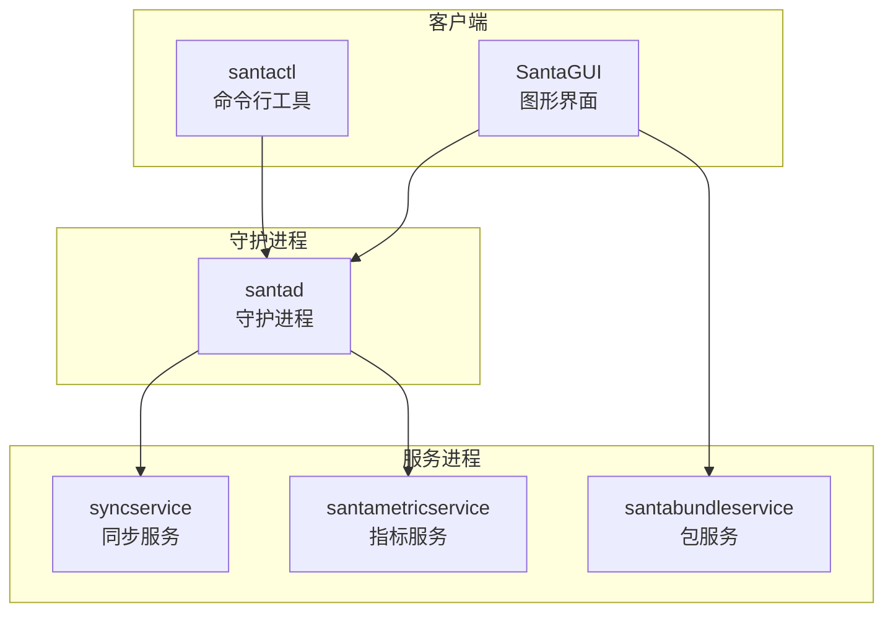
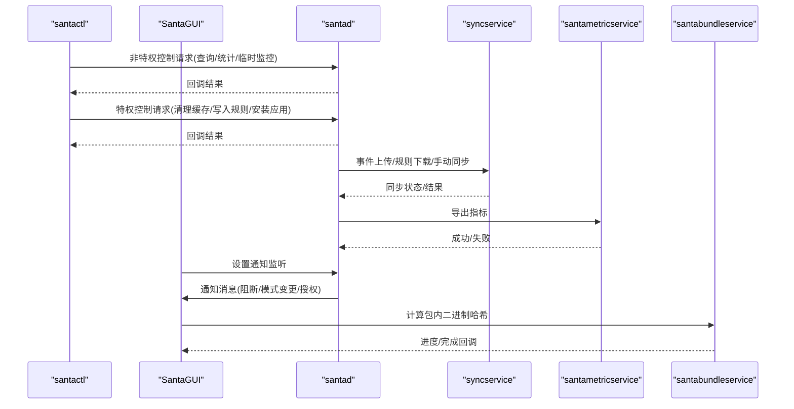
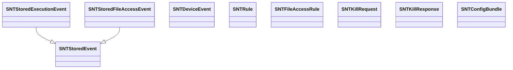

# API参考

<cite>
**本文引用的文件**
- [SNTXPCControlInterface.h](file://Source/common/SNTXPCControlInterface.h)
- [SNTXPCUnprivilegedControlInterface.h](file://Source/common/SNTXPCUnprivilegedControlInterface.h)
- [SNTXPCSyncServiceInterface.h](file://Source/common/SNTXPCSyncServiceInterface.h)
- [SNTXPCNotifierInterface.h](file://Source/common/SNTXPCNotifierInterface.h)
- [SNTXPCBundleServiceInterface.h](file://Source/common/SNTXPCBundleServiceInterface.h)
- [SNTXPCMetricServiceInterface.h](file://Source/common/SNTXPCMetricServiceInterface.h)
- [SNTCommonEnums.h](file://Source/common/SNTCommonEnums.h)
- [SNTRule.h](file://Source/common/SNTRule.h)
- [SNTStoredEvent.h](file://Source/common/SNTStoredEvent.h)
- [SNTStoredExecutionEvent.h](file://Source/common/SNTStoredExecutionEvent.h)
- [SNTStoredFileAccessEvent.h](file://Source/common/SNTStoredFileAccessEvent.h)
- [SNTDeviceEvent.h](file://Source/common/SNTDeviceEvent.h)
- [SNTFileAccessRule.h](file://Source/common/SNTFileAccessRule.h)
- [SNTKillCommand.h](file://Source/common/SNTKillCommand.h)
- [SNTConfigBundle.h](file://Source/common/SNTConfigBundle.h)
</cite>

## 目录
1. [简介](#简介)
2. [项目结构](#项目结构)
3. [核心组件](#核心组件)
4. [架构总览](#架构总览)
5. [详细组件分析](#详细组件分析)
6. [依赖关系分析](#依赖关系分析)
7. [性能考量](#性能考量)
8. [故障排查指南](#故障排查指南)
9. [结论](#结论)
10. [附录](#附录)

## 简介
本API参考文档面向Santa系统（macOS端点安全与二进制授权平台）的XPC接口，系统性梳理控制接口、同步接口、通知接口、包服务接口与指标导出接口的协议定义、方法签名、参数规范与返回约定。文档同时覆盖数据模型、枚举类型与常量值，提供接口调用示例路径、错误处理与异步回调模式说明，并阐述接口版本兼容策略、向后兼容与废弃接口处理建议，以及客户端实现指南、SDK使用与集成最佳实践，最后解释接口安全性、权限验证与访问控制机制。

## 项目结构
Santa系统通过XPC在多个进程间进行通信：守护进程(santad)、命令行工具(santactl)、图形界面(SantaGUI)、同步服务(syncservice)、指标服务(santametricservice)、包服务(santabundleservice)等。各组件通过统一的XPC接口定义文件暴露能力，客户端通过预配置的连接对象发起请求并接收回调。

图示来源
- [SNTXPCControlInterface.h](file://Source/common/SNTXPCControlInterface.h#L28-L77)
- [SNTXPCUnprivilegedControlInterface.h](file://Source/common/SNTXPCUnprivilegedControlInterface.h#L42-L117)
- [SNTXPCSyncServiceInterface.h](file://Source/common/SNTXPCSyncServiceInterface.h#L30-L69)
- [SNTXPCMetricServiceInterface.h](file://Source/common/SNTXPCMetricServiceInterface.h#L20-L30)
- [SNTXPCBundleServiceInterface.h](file://Source/common/SNTXPCBundleServiceInterface.h#L37-L55)

章节来源
- [SNTXPCControlInterface.h](file://Source/common/SNTXPCControlInterface.h#L28-L77)
- [SNTXPCUnprivilegedControlInterface.h](file://Source/common/SNTXPCUnprivilegedControlInterface.h#L42-L117)
- [SNTXPCSyncServiceInterface.h](file://Source/common/SNTXPCSyncServiceInterface.h#L30-L69)
- [SNTXPCMetricServiceInterface.h](file://Source/common/SNTXPCMetricServiceInterface.h#L20-L30)
- [SNTXPCBundleServiceInterface.h](file://Source/common/SNTXPCBundleServiceInterface.h#L37-L55)

## 核心组件
本节概述四大类XPC接口及其职责：
- 控制接口：由守护进程提供，支持特权与非特权两类操作，涵盖缓存、数据库、配置、同步、命令与安装等。
- 同步接口：与远端同步服务器交互，支持事件上传、规则下载、推送状态、遥测导出与手动触发同步。
- 通知接口：向图形界面发送阻断通知、USB挂载阻断、网络挂载阻断、文件访问阻断、客户端模式变更、规则同步通知与临时监控模式授权。
- 包服务接口：对应用包内二进制进行哈希计算，支持进度回调与完成回调。
- 指标接口：将运行时指标序列化后导出至监控系统。

章节来源
- [SNTXPCControlInterface.h](file://Source/common/SNTXPCControlInterface.h#L28-L77)
- [SNTXPCUnprivilegedControlInterface.h](file://Source/common/SNTXPCUnprivilegedControlInterface.h#L42-L117)
- [SNTXPCSyncServiceInterface.h](file://Source/common/SNTXPCSyncServiceInterface.h#L30-L69)
- [SNTXPCNotifierInterface.h](file://Source/common/SNTXPCNotifierInterface.h#L28-L46)
- [SNTXPCBundleServiceInterface.h](file://Source/common/SNTXPCBundleServiceInterface.h#L37-L55)
- [SNTXPCMetricServiceInterface.h](file://Source/common/SNTXPCMetricServiceInterface.h#L20-L30)

## 架构总览
下图展示XPC接口在系统中的交互关系与数据流向：

图示来源
- [SNTXPCControlInterface.h](file://Source/common/SNTXPCControlInterface.h#L28-L77)
- [SNTXPCUnprivilegedControlInterface.h](file://Source/common/SNTXPCUnprivilegedControlInterface.h#L42-L117)
- [SNTXPCSyncServiceInterface.h](file://Source/common/SNTXPCSyncServiceInterface.h#L30-L69)
- [SNTXPCNotifierInterface.h](file://Source/common/SNTXPCNotifierInterface.h#L28-L46)
- [SNTXPCBundleServiceInterface.h](file://Source/common/SNTXPCBundleServiceInterface.h#L37-L55)
- [SNTXPCMetricServiceInterface.h](file://Source/common/SNTXPCMetricServiceInterface.h#L20-L30)

## 详细组件分析

### 控制接口（守护进程）
- 协议名称：SNTDaemonControlXPC（特权）、SNTUnprivilegedDaemonControlXPC（非特权）
- 作用域：缓存管理、数据库操作、配置查询、同步辅助、命令下发、安装应用
- 关键方法与参数规范
  - 缓存操作
    - flushCache(reply:)
      - 参数：reply(回调块)
      - 返回：BOOL（是否成功）
    - cacheCounts(reply:)：返回根缓存与非根缓存计数
    - checkCacheForVnodeID(vnodeID, withReply:)：返回决策动作
  - 数据库操作
    - databaseRuleAddExecutionRules(_:fileAccessRules:ruleCleanup:source:reply:)
      - 参数：执行规则数组、文件访问规则字典、清理策略、来源、回调
      - 返回：BOOL + 错误数组
    - databaseEventsPending(reply:)：返回待处理事件数组
    - databaseRemoveEventsWithIDs(_:)：删除指定ID事件
    - retrieveAllExecutionRules(reply:)：返回全部执行规则
    - retrieveAllFileAccessRules(reply:)：返回文件访问规则字典
    - databaseRuleCounts(reply:)：返回各类规则计数
    - databaseEventCount(reply:)：返回事件总数
    - staticRuleCount(reply:)：返回静态规则数量
    - databaseRulesHash(reply:)：返回执行规则与文件访问规则哈希
    - databaseRuleForIdentifiers(_:reply:)：按标识符查询规则
  - 配置与模式
    - watchdogInfo(reply:)：返回看门狗信息
    - watchItemsState(reply:)：返回监视项状态
    - clientMode(reply:)：返回当前客户端模式
    - fullSyncLastSuccess(reply:)：返回上次全量同步时间
    - ruleSyncLastSuccess(reply:)：返回上次规则同步时间
    - syncTypeRequired(reply:)：返回所需同步类型
    - enableBundles(reply:)、enableTransitiveRules(reply:)、blockUSBMount(reply:)、remountUSBMode(reply:)
  - 同步与统计
    - updateSyncSettings(_:reply:)：更新同步设置
    - postRuleSyncNotificationForApplication(_:reply:)：触发应用规则同步通知
    - retrieveStatsState(reply:)：获取统计状态
    - saveStatsSubmissionAttemptTime(_:version:)：保存提交尝试时间
  - 命令与安装
    - killProcesses(_:reply:)：终止匹配进程，返回响应对象
    - installSantaApp(_:reply:)：安装应用，返回BOOL
  - 文件访问策略检索
    - dataFileAccessRuleForTarget(_:reply:)：返回策略名与版本
  - 指标与遥测
    - metrics(reply:)：返回指标字典
    - exportTelemetryWithReply(reply:)：触发遥测导出
  - 通知与监听
    - setNotificationListener(_:)
  - 推送通知状态
    - pushNotificationStatus(reply:)、pushNotificationServerAddress(reply:)
  - 临时监控模式
    - requestTemporaryMonitorModeWithDurationMinutes(_:reply:)：请求临时监控时长分钟数，返回实际秒数或错误
    - cancelTemporaryMonitorMode(_:reply:)：取消临时监控
    - temporaryMonitorModeSecondsRemaining(reply:)：剩余秒数

- 异步与错误处理
  - 所有方法均以回调块作为异步返回通道；部分方法返回错误数组或错误对象，需在回调中检查并处理。
  - 命令接口（如killProcesses）返回结构化响应对象，包含被终止进程列表与错误码。

- 安全与权限
  - 特权接口仅限具备相应权限的客户端调用（例如santactl），非特权接口可由GUI等通用客户端调用。
  - 权限校验由系统扩展与沙箱策略共同保障。

章节来源
- [SNTXPCControlInterface.h](file://Source/common/SNTXPCControlInterface.h#L28-L77)
- [SNTXPCUnprivilegedControlInterface.h](file://Source/common/SNTXPCUnprivilegedControlInterface.h#L42-L117)
- [SNTKillCommand.h](file://Source/common/SNTKillCommand.h#L15-L85)

### 同步接口（syncservice）
- 协议名称：SNTSyncServiceXPC
- 作用域：与远端同步服务器交互，支持事件上传、规则下载、推送状态查询、遥测导出与手动触发同步
- 关键方法与参数规范
  - postEventsToSyncServer(_:reply:)：上传事件数组，返回BOOL
  - postBundleEventToSyncServer(_:reply:)：上传包事件，返回动作枚举
  - pushNotificationStatus(reply:)：返回推送连接状态
  - pushNotificationServerAddress(reply:)：返回推送服务器地址
  - exportTelemetryFiles(_:fileName:totalSize:contentType:config:reply:)：导出遥测文件流，返回BOOL
  - syncWithLogListener(_:syncType:reply:)：手动触发同步，传入日志监听端点、同步类型，返回同步状态枚举
    - 同步队列限制：并发同步串行排队，超过上限将丢弃并返回“过多同步进行中”
  - spindown()：停止同步服务（不自动重启）

- 异步与错误处理
  - 手动同步采用回调返回SNTSyncStatusType，客户端据此判断成功、失败原因或队列满等情况。
  - 日志接收通过SNTSyncServiceLogReceiverXPC协议在用户发起同步时接收实时日志。

- 安全与权限
  - 仅守护进程与santactl可调用；需确保同步服务器地址、机器ID等配置有效。

章节来源
- [SNTXPCSyncServiceInterface.h](file://Source/common/SNTXPCSyncServiceInterface.h#L30-L69)
- [SNTCommonEnums.h](file://Source/common/SNTCommonEnums.h#L147-L161)

### 通知接口（Notifier）
- 协议名称：SNTNotifierXPC
- 作用域：向图形界面发送阻断通知、USB挂载阻断、网络挂载阻断、文件访问阻断、客户端模式变更、规则同步通知与临时监控模式授权
- 关键方法与参数规范
  - postBlockNotification(_:withCustomMessage:customURL:configState:andReply:)
  - postUSBBlockNotification(_:)
  - postNetworkMountNotification(_:configBundle:)
  - postFileAccessBlockNotification(_:customMessage:customURL:customText:configState:)
  - postClientModeNotification(_:)
  - postRuleSyncNotificationForApplication(_:)
  - authorizeTemporaryMonitorMode(_:reply:)

- 异步与错误处理
  - 多数为单向通知；授权临时监控模式提供回调以确认认证结果。

- 安全与权限
  - 仅守护进程可调用；GUI侧需设置监听器以接收通知。

章节来源
- [SNTXPCNotifierInterface.h](file://Source/common/SNTXPCNotifierInterface.h#L28-L46)

### 包服务接口（BundleService）
- 协议名称：SNTBundleServiceXPC
- 作用域：对应用包内二进制进行哈希计算，支持进度回调与完成回调
- 关键方法与参数规范
  - hashBundleBinariesForEvent(_:listener:reply:)
    - 参数：事件对象、监听器端点、完成回调块
    - 回调：返回包哈希、相关事件数组、耗时毫秒数；失败或取消时参数为nil

- 进度回调协议：SNTBundleServiceProgressXPC.updateCountsForEvent(_:binaryCount:fileCount:hashedCount:)
- 安全与权限
  - 由GUI调用；守护进程侧实现；需注意回调中的进度与最终结果处理。

章节来源
- [SNTXPCBundleServiceInterface.h](file://Source/common/SNTXPCBundleServiceInterface.h#L37-L55)

### 指标接口（MetricService）
- 协议名称：SNTMetricServiceXPC
- 作用域：将运行时指标序列化后导出至监控系统
- 关键方法与参数规范
  - exportForMonitoring(_:)
    - 参数：指标字典
    - 行为：由指标服务负责序列化与传输

- 安全与权限
  - 由守护进程调用；指标格式类型由枚举定义。

章节来源
- [SNTXPCMetricServiceInterface.h](file://Source/common/SNTXPCMetricServiceInterface.h#L20-L30)
- [SNTCommonEnums.h](file://Source/common/SNTCommonEnums.h#L169-L173)

## 依赖关系分析
- 协议到实现的映射
  - 控制接口：由守护进程实现，客户端通过预配置连接对象调用
  - 同步接口：由同步服务实现，守护进程作为客户端调用
  - 通知接口：由守护进程实现，GUI作为客户端接收
  - 包服务接口：由包服务实现，GUI作为客户端调用
  - 指标接口：由指标服务实现，守护进程作为客户端调用

- 数据模型依赖
  - 事件模型：SNTStoredEvent、SNTStoredExecutionEvent、SNTStoredFileAccessEvent、SNTDeviceEvent
  - 规则模型：SNTRule、SNTFileAccessRule
  - 命令模型：SNTKillRequest系列、SNTKillResponse
  - 配置模型：SNTConfigBundle
  - 枚举与常量：SNTCommonEnums.h中定义的动作、规则状态、事件状态、同步状态、推送状态等

图示来源
- [SNTStoredEvent.h](file://Source/common/SNTStoredEvent.h#L18-L35)
- [SNTStoredExecutionEvent.h](file://Source/common/SNTStoredExecutionEvent.h#L23-L141)
- [SNTStoredFileAccessEvent.h](file://Source/common/SNTStoredFileAccessEvent.h#L23-L73)
- [SNTDeviceEvent.h](file://Source/common/SNTDeviceEvent.h#L15-L27)
- [SNTRule.h](file://Source/common/SNTRule.h#L20-L128)
- [SNTFileAccessRule.h](file://Source/common/SNTFileAccessRule.h#L15-L32)
- [SNTKillCommand.h](file://Source/common/SNTKillCommand.h#L15-L85)
- [SNTConfigBundle.h](file://Source/common/SNTConfigBundle.h#L22-L47)

章节来源
- [SNTStoredEvent.h](file://Source/common/SNTStoredEvent.h#L18-L35)
- [SNTStoredExecutionEvent.h](file://Source/common/SNTStoredExecutionEvent.h#L23-L141)
- [SNTStoredFileAccessEvent.h](file://Source/common/SNTStoredFileAccessEvent.h#L23-L73)
- [SNTDeviceEvent.h](file://Source/common/SNTDeviceEvent.h#L15-L27)
- [SNTRule.h](file://Source/common/SNTRule.h#L20-L128)
- [SNTFileAccessRule.h](file://Source/common/SNTFileAccessRule.h#L15-L32)
- [SNTKillCommand.h](file://Source/common/SNTKillCommand.h#L15-L85)
- [SNTConfigBundle.h](file://Source/common/SNTConfigBundle.h#L22-L47)

## 性能考量
- 同步队列与背压
  - 同步服务对手动同步采用串行队列，存在最大排队数限制；当队列满时会丢弃新请求并返回“过多同步进行中”，客户端应避免高频重复触发。
- 缓存与规则命中
  - 使用缓存查询接口减少重复计算；合理清理缓存与规则可降低决策延迟。
- 事件批量上传
  - 合理分批上传事件，避免单次过大导致超时或内存压力。
- 指标导出
  - 指标序列化与传输应避免阻塞主线程，建议异步处理。

[本节为通用指导，无需列出具体文件来源]

## 故障排查指南
- 同步失败状态
  - 使用同步状态枚举判断失败原因：预检失败、事件上传失败、规则下载失败、收尾失败、缺少同步基础URL、缺少机器ID、守护进程超时、XPC连接失败等。
- 命令下发错误
  - killProcesses返回的响应对象包含被终止进程列表与错误码，需逐条检查错误类型（如无效目标、无权限、进程不存在、参数无效、引导会话不匹配）。
- 通知未到达
  - 确认已设置通知监听器；检查通知协议方法是否正确调用；关注授权临时监控模式的认证回调。
- 包哈希失败
  - 监听器回调可能因失败或取消而返回nil参数；需重试或回退处理。
- 指标导出异常
  - 检查指标字典结构与格式类型；确认监控系统可达性。

章节来源
- [SNTXPCSyncServiceInterface.h](file://Source/common/SNTXPCSyncServiceInterface.h#L30-L69)
- [SNTCommonEnums.h](file://Source/common/SNTCommonEnums.h#L147-L161)
- [SNTKillCommand.h](file://Source/common/SNTKillCommand.h#L51-L85)
- [SNTXPCNotifierInterface.h](file://Source/common/SNTXPCNotifierInterface.h#L28-L46)
- [SNTXPCBundleServiceInterface.h](file://Source/common/SNTXPCBundleServiceInterface.h#L37-L55)
- [SNTXPCMetricServiceInterface.h](file://Source/common/SNTXPCMetricServiceInterface.h#L20-L30)

## 结论
Santa系统的XPC接口围绕守护进程为核心，通过清晰的协议划分实现了控制、同步、通知、包服务与指标导出五大能力域。客户端应遵循异步回调模式与错误处理约定，结合枚举与数据模型的语义正确使用接口。同步队列、缓存与规则命中、事件批量与指标导出是影响性能的关键点。安全方面，权限与沙箱策略确保接口调用边界，客户端需严格遵守。

[本节为总结性内容，无需列出具体文件来源]

## 附录

### 接口调用示例（路径指引）
- 调用非特权控制接口查询规则计数与事件数
  - 参考路径：[SNTXPCUnprivilegedControlInterface.h](file://Source/common/SNTXPCUnprivilegedControlInterface.h#L52-L58)
- 调用特权控制接口添加规则并清理旧规则
  - 参考路径：[SNTXPCControlInterface.h](file://Source/common/SNTXPCControlInterface.h#L42-L46)
- 触发一次手动同步并接收日志
  - 参考路径：[SNTXPCSyncServiceInterface.h](file://Source/common/SNTXPCSyncServiceInterface.h#L61-L63)
- 请求临时监控模式授权
  - 参考路径：[SNTXPCUnprivilegedControlInterface.h](file://Source/common/SNTXPCUnprivilegedControlInterface.h#L112-L116)
- 计算包内二进制哈希并接收进度
  - 参考路径：[SNTXPCBundleServiceInterface.h](file://Source/common/SNTXPCBundleServiceInterface.h#L51-L53)

### 数据模型与枚举概览
- 决策与动作
  - 动作枚举：允许、拒绝、编译器放行、等待、后续放行/拒绝
  - 事件状态位掩码：区分阻断与允许类别
- 规则类型与状态
  - 规则类型：cdhash、二进制、Signing ID、证书、Team ID
  - 规则状态：允许、阻止、静默阻止、移除、编译器、传递式、本地二进制/Signing ID、CEL/Celv2
- 客户端模式
  - 监控、锁定、独立模式
- 同步与推送状态
  - 同步状态：成功、预检失败、事件上传失败、规则下载失败、收尾失败、过多同步进行中、缺少同步基础URL、缺少机器ID、守护进程超时、已开始、XPC连接失败、未知
  - 推送状态：未知、禁用、断开、连接、连接NATS
- 指标格式类型
  - 原始JSON、Monarch JSON

章节来源
- [SNTCommonEnums.h](file://Source/common/SNTCommonEnums.h#L23-L125)
- [SNTCommonEnums.h](file://Source/common/SNTCommonEnums.h#L127-L219)

### 接口版本兼容与废弃处理
- 兼容性原则
  - 枚举与整型存储于数据库，禁止随意更改数值，避免破坏历史数据解析。
  - 新增枚举值应预留空间，保持评估顺序与可读性。
- 废弃接口处理
  - 通过文档标注与客户端条件分支处理；在短期内保留但标记为废弃，逐步迁移至新接口。
- 版本演进
  - 同步状态新增枚举值时，客户端需扩展状态机以兼容未知状态。

章节来源
- [SNTCommonEnums.h](file://Source/common/SNTCommonEnums.h#L16-L22)
- [SNTCommonEnums.h](file://Source/common/SNTCommonEnums.h#L147-L161)

### 客户端实现指南与SDK使用
- 连接与接口初始化
  - 使用预配置的NSXPCInterface与MOLXPCConnection，设置回调处理器后恢复连接即可使用。
- 异步回调与错误处理
  - 统一在回调中处理成功与失败路径；对批量操作收集错误集合以便诊断。
- 最佳实践
  - 合理设置超时与重试；对高频调用增加本地缓存；避免在主线程执行重任务。
- 集成要点
  - 控制接口按权限分离调用；通知接口需先设置监听器；同步接口注意队列限制；包服务接口需实现进度监听协议。

章节来源
- [SNTXPCControlInterface.h](file://Source/common/SNTXPCControlInterface.h#L91-L103)
- [SNTXPCUnprivilegedControlInterface.h](file://Source/common/SNTXPCUnprivilegedControlInterface.h#L121-L131)
- [SNTXPCSyncServiceInterface.h](file://Source/common/SNTXPCSyncServiceInterface.h#L72-L91)
- [SNTXPCBundleServiceInterface.h](file://Source/common/SNTXPCBundleServiceInterface.h#L57-L76)
- [SNTXPCMetricServiceInterface.h](file://Source/common/SNTXPCMetricServiceInterface.h#L31-L51)

### 安全性、权限验证与访问控制
- 权限边界
  - 特权控制接口仅限具备相应权限的客户端（如santactl）调用；非特权接口可由GUI等通用客户端调用。
- 沙箱与系统扩展
  - 通过系统扩展与沙箱策略限制接口暴露面与调用范围。
- 传输安全
  - 同步服务与指标导出涉及外部传输，需确保TLS与身份校验配置正确。

章节来源
- [SNTXPCControlInterface.h](file://Source/common/SNTXPCControlInterface.h#L28-L33)
- [SNTXPCUnprivilegedControlInterface.h](file://Source/common/SNTXPCUnprivilegedControlInterface.h#L42-L46)
- [SNTXPCSyncServiceInterface.h](file://Source/common/SNTXPCSyncServiceInterface.h#L30-L46)