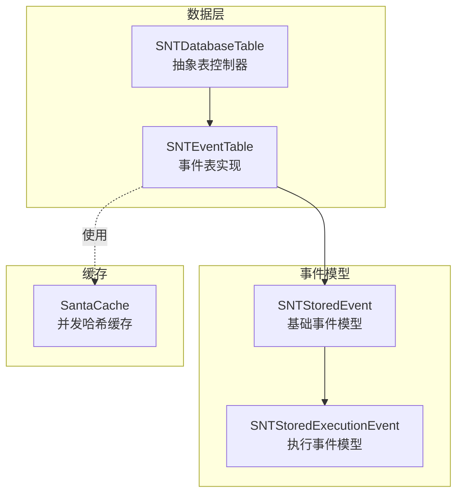
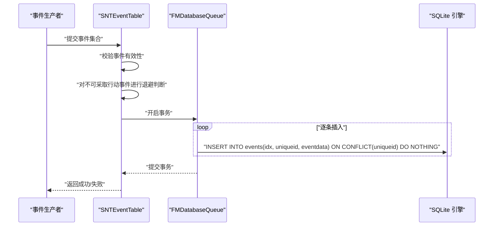
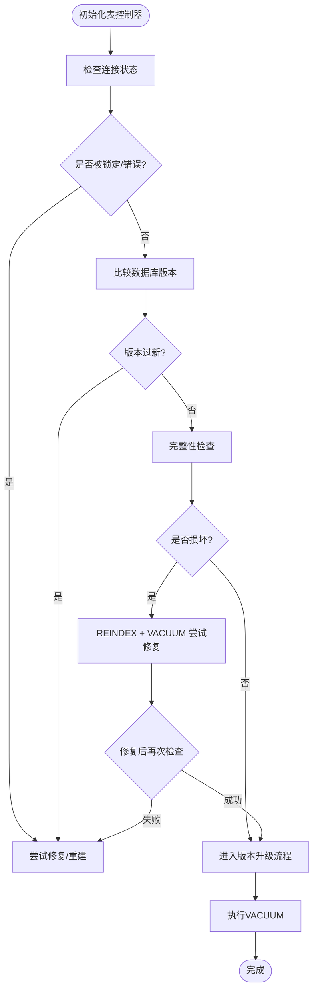
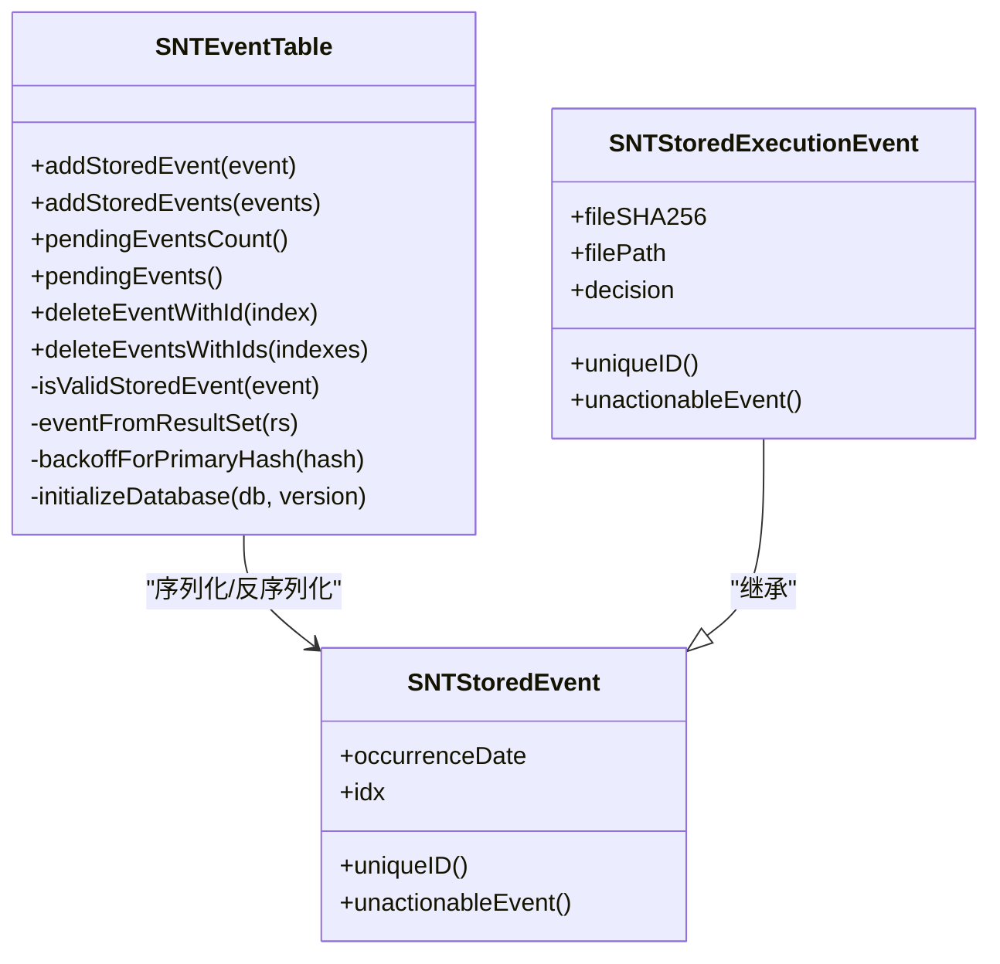
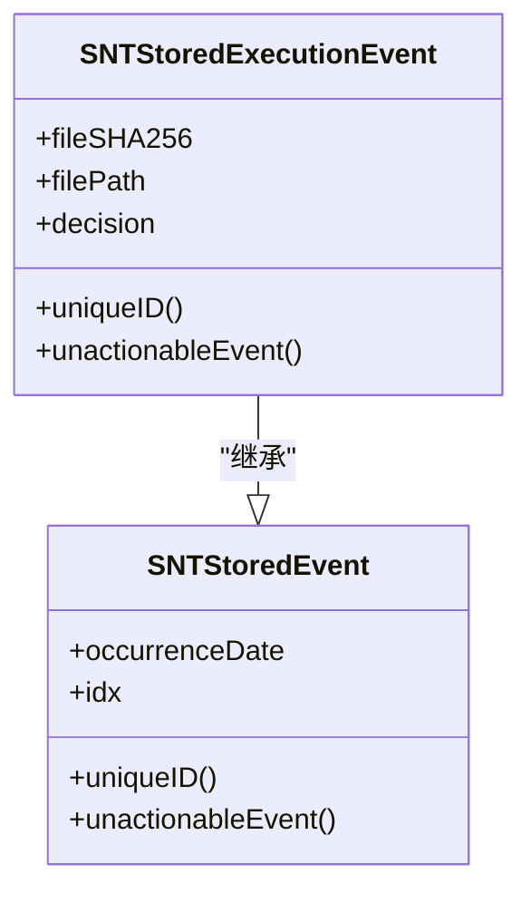
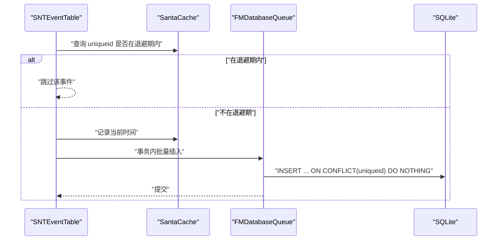
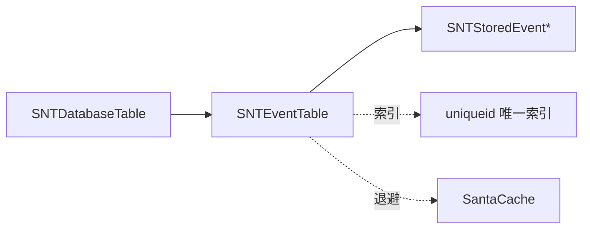

# 事件存储架构

<cite>
**本文引用的文件**
- [SNTEventTable.h](file://Source/santad/DataLayer/SNTEventTable.h)
- [SNTEventTable.mm](file://Source/santad/DataLayer/SNTEventTable.mm)
- [SNTDatabaseTable.h](file://Source/santad/DataLayer/SNTDatabaseTable.h)
- [SNTDatabaseTable.mm](file://Source/santad/DataLayer/SNTDatabaseTable.mm)
- [SNTStoredEvent.h](file://Source/common/SNTStoredEvent.h)
- [SNTStoredEvent.mm](file://Source/common/SNTStoredEvent.mm)
- [SNTStoredExecutionEvent.h](file://Source/common/SNTStoredExecutionEvent.h)
- [SNTStoredExecutionEvent.mm](file://Source/common/SNTStoredExecutionEvent.mm)
- [SantaCache.h](file://Source/common/SantaCache.h)
</cite>

## 目录
1. [简介](#简介)
2. [项目结构](#项目结构)
3. [核心组件](#核心组件)
4. [架构总览](#架构总览)
5. [组件详解](#组件详解)
6. [依赖关系分析](#依赖关系分析)
7. [性能考量](#性能考量)
8. [故障排查指南](#故障排查指南)
9. [结论](#结论)
10. [附录](#附录)

## 简介
本文件系统性梳理 Santa 的事件存储架构，重点覆盖事件数据库表设计、索引策略与查询优化；深入解析 SNTEventTable 与 SNTDatabaseTable 的实现细节（表结构、约束、版本迁移）；阐述事件持久化流程、事务管理与并发控制；说明事件生命周期管理、自动清理与空间优化；解释事件查询接口的设计理念（SQL 构建、参数绑定、结果集处理）；并给出性能调优、备份恢复与数据完整性保障建议，以及事件存储与内存缓存的协同与一致性保障。

## 项目结构
事件存储位于守护进程子系统的数据层，围绕 SQLite（通过 FMDB 封装）实现。核心文件组织如下：
- 数据层基类：SNTDatabaseTable（抽象表控制器，负责连接健康检查、版本升级、事务封装、VACUUM）
- 事件表：SNTEventTable（具体事件表，负责事件入库、查询、删除、唯一性去重）
- 事件模型：SNTStoredEvent 及其子类（如执行事件），用于序列化/反序列化与唯一性判定
- 内存缓存：SantaCache（高性能并发哈希缓存，用于“不可采取行动事件”的短期退避）

**图表来源**
- [SNTDatabaseTable.h](file://Source/santad/DataLayer/SNTDatabaseTable.h#L1-L59)
- [SNTDatabaseTable.mm](file://Source/santad/DataLayer/SNTDatabaseTable.mm#L1-L151)
- [SNTEventTable.h](file://Source/santad/DataLayer/SNTEventTable.h#L1-L72)
- [SNTEventTable.mm](file://Source/santad/DataLayer/SNTEventTable.mm#L1-L244)
- [SNTStoredEvent.h](file://Source/common/SNTStoredEvent.h#L1-L36)
- [SNTStoredEvent.mm](file://Source/common/SNTStoredEvent.mm#L1-L74)
- [SNTStoredExecutionEvent.h](file://Source/common/SNTStoredExecutionEvent.h#L1-L142)
- [SNTStoredExecutionEvent.mm](file://Source/common/SNTStoredExecutionEvent.mm#L1-L181)
- [SantaCache.h](file://Source/common/SantaCache.h#L1-L468)

**章节来源**
- [SNTEventTable.h](file://Source/santad/DataLayer/SNTEventTable.h#L1-L72)
- [SNTEventTable.mm](file://Source/santad/DataLayer/SNTEventTable.mm#L1-L244)
- [SNTDatabaseTable.h](file://Source/santad/DataLayer/SNTDatabaseTable.h#L1-L59)
- [SNTDatabaseTable.mm](file://Source/santad/DataLayer/SNTDatabaseTable.mm#L1-L151)
- [SNTStoredEvent.h](file://Source/common/SNTStoredEvent.h#L1-L36)
- [SNTStoredEvent.mm](file://Source/common/SNTStoredEvent.mm#L1-L74)
- [SNTStoredExecutionEvent.h](file://Source/common/SNTStoredExecutionEvent.h#L1-L142)
- [SNTStoredExecutionEvent.mm](file://Source/common/SNTStoredExecutionEvent.mm#L1-L181)
- [SantaCache.h](file://Source/common/SantaCache.h#L1-L468)

## 核心组件
- SNTDatabaseTable：提供数据库连接健康检查、版本升级入口、事务封装（inDatabase/inTransaction）、VACUUM 清理、完整性校验与修复、用户版本维护。
- SNTEventTable：基于 SNTDatabaseTable 实现事件表，负责事件入库（支持单条/批量）、唯一性冲突处理（按 uniqueid 去重）、查询计数与全量读取、删除、以及“不可采取行动事件”的短期退避。
- SNTStoredEvent 及子类：统一的事件序列化模型，定义唯一标识 uniqueID 与不可采取行动判定 unactionableEvent，便于事件去重与快速过滤。
- SantaCache：高性能并发缓存，用于在内存中记录最近被退避的 uniqueid，避免短时间内重复入库。

**章节来源**
- [SNTDatabaseTable.h](file://Source/santad/DataLayer/SNTDatabaseTable.h#L1-L59)
- [SNTDatabaseTable.mm](file://Source/santad/DataLayer/SNTDatabaseTable.mm#L1-L151)
- [SNTEventTable.h](file://Source/santad/DataLayer/SNTEventTable.h#L1-L72)
- [SNTEventTable.mm](file://Source/santad/DataLayer/SNTEventTable.mm#L1-L244)
- [SNTStoredEvent.h](file://Source/common/SNTStoredEvent.h#L1-L36)
- [SNTStoredEvent.mm](file://Source/common/SNTStoredEvent.mm#L1-L74)
- [SNTStoredExecutionEvent.h](file://Source/common/SNTStoredExecutionEvent.h#L1-L142)
- [SNTStoredExecutionEvent.mm](file://Source/common/SNTStoredExecutionEvent.mm#L1-L181)
- [SantaCache.h](file://Source/common/SantaCache.h#L1-L468)

## 架构总览
事件存储采用“表控制器 + 模型序列化 + 并发缓存”的分层设计：
- 表控制器层：SNTDatabaseTable 负责连接、版本、事务与清理；SNTEventTable 承载业务逻辑。
- 数据访问层：通过 FMDB 的队列封装，确保线程安全与串行化写入。
- 模型层：事件对象以二进制归档形式存入 blob 字段，结合 uniqueid 唯一索引实现去重。
- 缓存层：内存退避缓存降低重复事件入库压力。

**图表来源**
- [SNTEventTable.mm](file://Source/santad/DataLayer/SNTEventTable.mm#L128-L160)
- [SNTDatabaseTable.mm](file://Source/santad/DataLayer/SNTDatabaseTable.mm#L136-L150)

**章节来源**
- [SNTEventTable.mm](file://Source/santad/DataLayer/SNTEventTable.mm#L107-L160)
- [SNTDatabaseTable.mm](file://Source/santad/DataLayer/SNTDatabaseTable.mm#L136-L150)

## 组件详解

### SNTDatabaseTable：表控制器与生命周期
- 连接健康检查：初始化时检测锁状态、错误码、版本新于支持上限、或完整性检查失败，并在必要时执行修复或重建。
- 版本升级：updateTableSchema 在事务内调用 initializeDatabase，返回新版本并设置 userVersion；完成后执行 VACUUM。
- 事务封装：inDatabase/inTransaction 提供统一的串行化访问与回滚控制。
- 完整性保障：PRAGMA integrity_check、REINDEX、VACUUM 三件套用于修复与瘦身。

**图表来源**
- [SNTDatabaseTable.mm](file://Source/santad/DataLayer/SNTDatabaseTable.mm#L36-L150)

**章节来源**
- [SNTDatabaseTable.h](file://Source/santad/DataLayer/SNTDatabaseTable.h#L1-L59)
- [SNTDatabaseTable.mm](file://Source/santad/DataLayer/SNTDatabaseTable.mm#L1-L151)

### SNTEventTable：事件表实现与表结构演进
- 当前版本：5
- 表结构字段：idx（主键，早期为自增，后改为普通主键）、uniqueid（唯一索引，替代原 filesha256）、eventdata（BLOB，存放归档后的事件对象）
- 索引策略：uniqueid 唯一索引，用于去重；早期存在非唯一索引 filesha256，后随字段名变更更新为 uniqueid 唯一索引
- 去重策略：INSERT ... ON CONFLICT(uniqueid) DO NOTHING，避免重复事件入库
- 有效性校验：针对不同事件类型进行字段完整性检查
- 退避机制：对不可采取行动事件（如允许执行）使用内存缓存进行短期退避，避免重复入库
- 查询接口：COUNT(*) 计数、全量 SELECT、按索引删除、批量删除
- 结果集处理：从 BLOB 中解档为具体事件对象，限定允许类集合，失败则删除对应记录

**图表来源**
- [SNTEventTable.h](file://Source/santad/DataLayer/SNTEventTable.h#L1-L72)
- [SNTEventTable.mm](file://Source/santad/DataLayer/SNTEventTable.mm#L107-L243)
- [SNTStoredEvent.h](file://Source/common/SNTStoredEvent.h#L1-L36)
- [SNTStoredEvent.mm](file://Source/common/SNTStoredEvent.mm#L1-L74)
- [SNTStoredExecutionEvent.h](file://Source/common/SNTStoredExecutionEvent.h#L1-L142)
- [SNTStoredExecutionEvent.mm](file://Source/common/SNTStoredExecutionEvent.mm#L1-L181)

**章节来源**
- [SNTEventTable.h](file://Source/santad/DataLayer/SNTEventTable.h#L1-L72)
- [SNTEventTable.mm](file://Source/santad/DataLayer/SNTEventTable.mm#L29-L103)
- [SNTEventTable.mm](file://Source/santad/DataLayer/SNTEventTable.mm#L107-L243)
- [SNTStoredEvent.h](file://Source/common/SNTStoredEvent.h#L1-L36)
- [SNTStoredEvent.mm](file://Source/common/SNTStoredEvent.mm#L1-L74)
- [SNTStoredExecutionEvent.h](file://Source/common/SNTStoredExecutionEvent.h#L1-L142)
- [SNTStoredExecutionEvent.mm](file://Source/common/SNTStoredExecutionEvent.mm#L1-L181)

### 事件模型：SNTStoredEvent 与 SNTStoredExecutionEvent
- SNTStoredEvent：定义基础属性（idx、occurrenceDate）与抽象方法（uniqueID、unactionableEvent），要求子类实现
- SNTStoredExecutionEvent：扩展执行相关字段（文件路径、签名链、决策等），实现 uniqueID 返回 fileSHA256，unactionableEvent 判定允许类事件

**图表来源**
- [SNTStoredEvent.h](file://Source/common/SNTStoredEvent.h#L1-L36)
- [SNTStoredEvent.mm](file://Source/common/SNTStoredEvent.mm#L1-L74)
- [SNTStoredExecutionEvent.h](file://Source/common/SNTStoredExecutionEvent.h#L1-L142)
- [SNTStoredExecutionEvent.mm](file://Source/common/SNTStoredExecutionEvent.mm#L1-L181)

**章节来源**
- [SNTStoredEvent.h](file://Source/common/SNTStoredEvent.h#L1-L36)
- [SNTStoredEvent.mm](file://Source/common/SNTStoredEvent.mm#L1-L74)
- [SNTStoredExecutionEvent.h](file://Source/common/SNTStoredExecutionEvent.h#L1-L142)
- [SNTStoredExecutionEvent.mm](file://Source/common/SNTStoredExecutionEvent.mm#L1-L181)

### 并发控制与内存缓存协调
- 事务控制：SNTDatabaseTable 的 inTransaction 包裹批量入库，确保原子性
- 并发写入：FMDatabaseQueue 提供队列化串行访问，避免竞争
- 退避缓存：SNTEventTable 使用 SantaCache 记录 uniqueid 及时间戳，4 小时窗口内跳过重复入库
- 一致性保障：唯一索引 + ON CONFLICT 去重 + 仅允许白名单类反序列化，防止脏数据污染

**图表来源**
- [SNTEventTable.mm](file://Source/santad/DataLayer/SNTEventTable.mm#L135-L160)
- [SantaCache.h](file://Source/common/SantaCache.h#L1-L468)
- [SNTDatabaseTable.mm](file://Source/santad/DataLayer/SNTDatabaseTable.mm#L136-L150)

**章节来源**
- [SNTEventTable.mm](file://Source/santad/DataLayer/SNTEventTable.mm#L135-L172)
- [SantaCache.h](file://Source/common/SantaCache.h#L1-L468)
- [SNTDatabaseTable.mm](file://Source/santad/DataLayer/SNTDatabaseTable.mm#L136-L150)

## 依赖关系分析
- SNTEventTable 依赖 SNTDatabaseTable 提供的连接、事务与版本管理能力
- 事件模型通过 NSSecureCoding 序列化为 BLOB 存储，反序列化时限定类集合，提升安全性
- 唯一索引 uniqueid 作为去重与查询的关键键值
- 内存缓存与数据库索引共同承担去重与退避职责，减少无效写入

**图表来源**
- [SNTDatabaseTable.h](file://Source/santad/DataLayer/SNTDatabaseTable.h#L1-L59)
- [SNTEventTable.h](file://Source/santad/DataLayer/SNTEventTable.h#L1-L72)
- [SNTEventTable.mm](file://Source/santad/DataLayer/SNTEventTable.mm#L80-L103)
- [SantaCache.h](file://Source/common/SantaCache.h#L1-L468)

**章节来源**
- [SNTEventTable.mm](file://Source/santad/DataLayer/SNTEventTable.mm#L80-L103)
- [SNTDatabaseTable.h](file://Source/santad/DataLayer/SNTDatabaseTable.h#L1-L59)
- [SNTEventTable.h](file://Source/santad/DataLayer/SNTEventTable.h#L1-L72)
- [SantaCache.h](file://Source/common/SantaCache.h#L1-L468)

## 性能考量
- 插入性能
  - 使用唯一索引 + ON CONFLICT 去重，避免重复写入带来的索引分裂与 IO 放大
  - 批量插入在事务内执行，显著降低 WAL/日志开销
- 查询性能
  - COUNT(*) 与全量扫描适合低频场景；高频查询建议引入分页或按时间范围筛选
  - 唯一索引命中率高，有利于去重与幂等写
- 存储与空间
  - 版本升级后执行 VACUUM，释放回收页，降低文件膨胀
  - 对于历史事件可考虑外部归档或定期清理策略（见“生命周期与清理”）
- 并发与锁
  - FMDatabaseQueue 串行化写入，避免写写冲突；读多写少场景可配合只读连接池
- 缓存退避
  - 4 小时退避窗口平衡吞吐与实时性；可根据业务波动调整窗口大小

[本节为通用性能建议，不直接分析具体文件，故无“章节来源”]

## 故障排查指南
- 数据库被锁/连接异常
  - 初始化阶段检测 SQLITE_LOCKED 并记录告警，随后关闭、删除并重建数据库文件
- 版本新于支持上限
  - 自动删除旧库并重建，确保兼容性
- 完整性问题
  - PRAGMA integrity_check 失败时先 REINDEX + VACUUM，仍失败则删除重建
- 事件入库失败
  - 检查事件有效性校验（如 idx、uniqueID、必要字段），确认序列化/反序列化类白名单
  - 确认 uniqueid 唯一索引是否存在且未被破坏
- 查询异常
  - 全量扫描时注意内存占用；建议分页或限制时间范围

**章节来源**
- [SNTDatabaseTable.mm](file://Source/santad/DataLayer/SNTDatabaseTable.mm#L36-L150)
- [SNTEventTable.mm](file://Source/santad/DataLayer/SNTEventTable.mm#L174-L203)

## 结论
Santa 的事件存储以“表控制器 + 模型序列化 + 并发缓存”为核心，通过唯一索引与 ON CONFLICT 去重、事务化批量写入、VACUUM 清理与完整性修复，实现了高可靠、可扩展的事件持久化方案。配合内存退避与严格的类白名单反序列化，有效降低了重复写入与数据污染风险。建议在高吞吐场景下结合分页查询、外部归档与定期清理策略，持续优化存储与查询性能。

## 附录

### 表结构与索引策略（版本 5）
- 表名：events
- 字段
  - idx：整型主键（普通主键，非自增）
  - uniqueid：文本，唯一索引
  - eventdata：二进制，存放事件对象归档数据
- 索引
  - uniqueid 唯一索引，用于去重与幂等写
- 迁移要点
  - v1：初始表与非唯一索引 filesha256
  - v2：清空表后升级
  - v3：去除自增，改为普通主键
  - v4：去重后建立 uniqueid 唯一索引
  - v5：字段名从 filesha256 改为 uniqueid，并重建唯一索引

**章节来源**
- [SNTEventTable.mm](file://Source/santad/DataLayer/SNTEventTable.mm#L52-L103)

### 事件持久化流程与事务管理
- 有效性校验：按事件类型检查关键字段
- 退避判断：对不可采取行动事件使用内存缓存退避
- 事务写入：批量插入，ON CONFLICT(uniqueid) DO NOTHING
- 失败处理：回滚并记录错误

**章节来源**
- [SNTEventTable.mm](file://Source/santad/DataLayer/SNTEventTable.mm#L128-L160)

### 查询接口设计理念
- 计数：COUNT(*) 快速统计待上传事件数量
- 全量读取：SELECT * 遍历并解档，失败则删除对应记录
- 删除：按 idx 单条/批量删除
- 参数绑定：所有 SQL 使用参数绑定，避免注入

**章节来源**
- [SNTEventTable.mm](file://Source/santad/DataLayer/SNTEventTable.mm#L176-L203)
- [SNTEventTable.mm](file://Source/santad/DataLayer/SNTEventTable.mm#L229-L241)

### 生命周期管理与自动清理
- 版本升级后自动 VACUUM，释放空间
- 历史事件建议外部归档或定期清理，避免表膨胀
- 退避缓存窗口（默认 4 小时）降低重复事件入库

**章节来源**
- [SNTDatabaseTable.mm](file://Source/santad/DataLayer/SNTDatabaseTable.mm#L132-L134)
- [SNTEventTable.mm](file://Source/santad/DataLayer/SNTEventTable.mm#L29-L40)
- [SNTEventTable.mm](file://Source/santad/DataLayer/SNTEventTable.mm#L162-L172)

### 备份恢复与数据完整性
- 备份：定期复制数据库文件；或导出事件数据进行归档
- 恢复：若损坏，先尝试 REINDEX + VACUUM；仍失败则删除重建
- 完整性：PRAGMA integrity_check；严格白名单反序列化

**章节来源**
- [SNTDatabaseTable.mm](file://Source/santad/DataLayer/SNTDatabaseTable.mm#L76-L114)