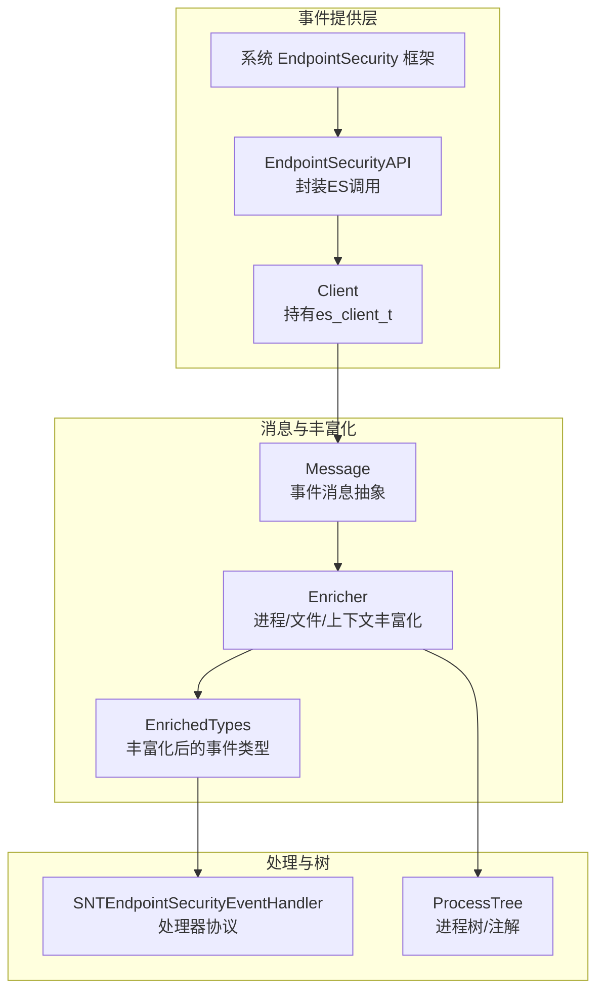
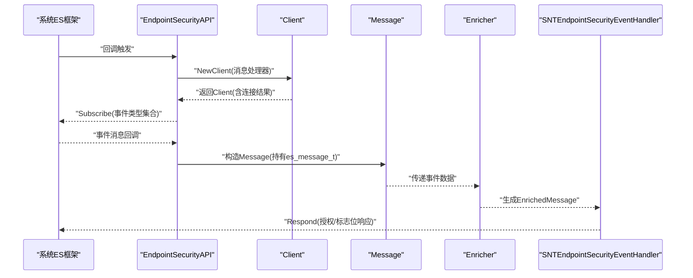
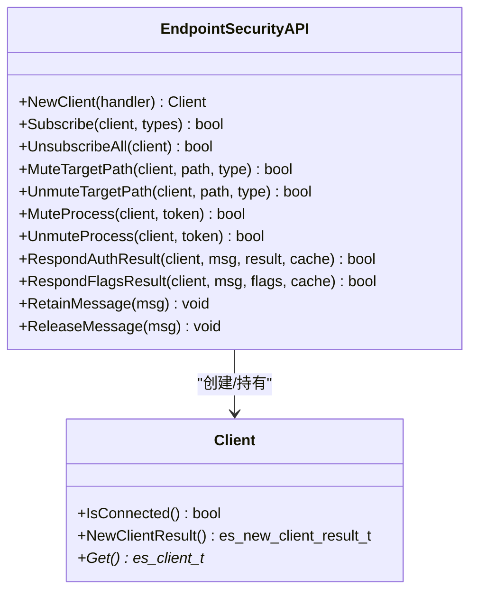
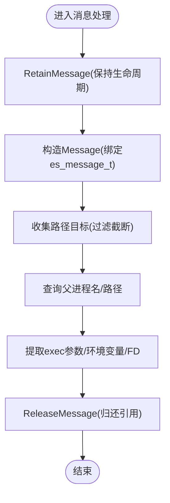
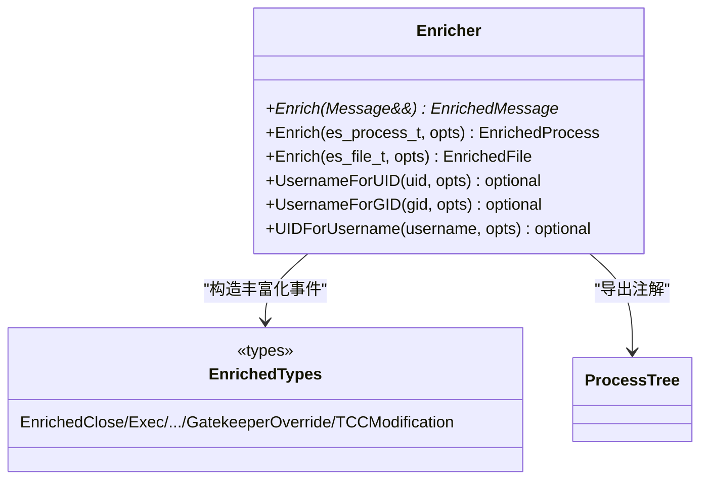
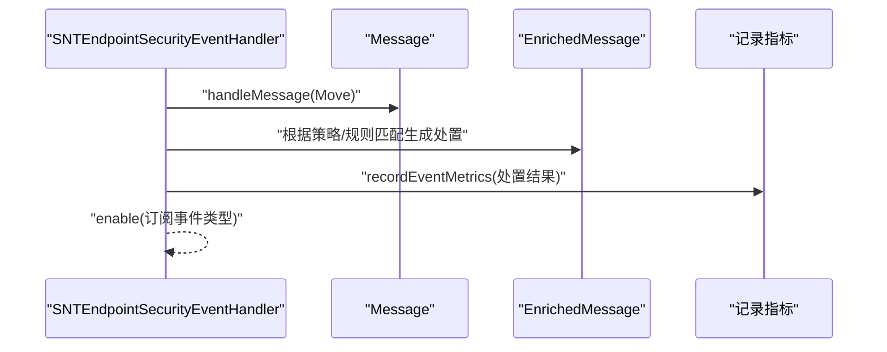
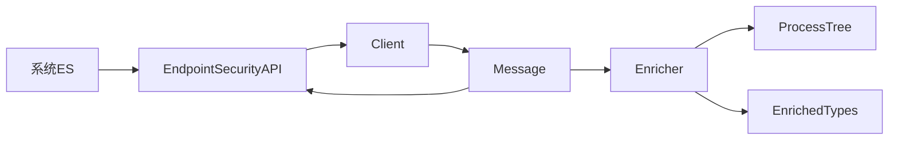

# 事件捕获与处理

<cite>
**本文引用的文件**
- [Client.h](file://Source/santad/EventProviders/EndpointSecurity/Client.h)
- [EndpointSecurityAPI.h](file://Source/santad/EventProviders/EndpointSecurity/EndpointSecurityAPI.h)
- [EndpointSecurityAPI.mm](file://Source/santad/EventProviders/EndpointSecurity/EndpointSecurityAPI.mm)
- [Message.h](file://Source/santad/EventProviders/EndpointSecurity/Message.h)
- [Message.mm](file://Source/santad/EventProviders/EndpointSecurity/Message.mm)
- [Enricher.h](file://Source/santad/EventProviders/EndpointSecurity/Enricher.h)
- [Enricher.mm](file://Source/santad/EventProviders/EndpointSecurity/Enricher.mm)
- [EnrichedTypes.h](file://Source/santad/EventProviders/EndpointSecurity/EnrichedTypes.h)
- [SNTEndpointSecurityEventHandler.h](file://Source/santad/EventProviders/SNTEndpointSecurityEventHandler.h)
- [process_tree.h](file://Source/santad/ProcessTree/process_tree.h)
- [process_tree_macos.h](file://Source/santad/ProcessTree/process_tree_macos.h)
</cite>

## 目录
1. [引言](#引言)
2. [项目结构](#项目结构)
3. [核心组件](#核心组件)
4. [架构总览](#架构总览)
5. [详细组件分析](#详细组件分析)
6. [依赖分析](#依赖分析)
7. [性能考虑](#性能考虑)
8. [故障排查指南](#故障排查指南)
9. [结论](#结论)
10. [附录](#附录)

## 引言
本文件面向Santa项目中基于Endpoint Security API的事件捕获与处理流程，系统性阐述从客户端初始化、连接管理、事件订阅，到消息解析、事件丰富化、处理器路由与决策、异步处理与队列管理、性能监控与重试恢复，以及与系统扩展的协作与资源管理。目标是帮助读者在不深入源码的前提下，理解整体架构与关键路径。

## 项目结构
围绕Endpoint Security事件处理的关键目录与文件如下：
- 事件客户端与API封装：Client、EndpointSecurityAPI
- 消息抽象与解析：Message
- 事件丰富化：Enricher、EnrichedTypes
- 处理器协议与探针：SNTEndpointSecurityEventHandler
- 进程树与注解：process_tree、process_tree_macos

图表来源
- [EndpointSecurityAPI.h](file://Source/santad/EventProviders/EndpointSecurity/EndpointSecurityAPI.h#L30-L76)
- [EndpointSecurityAPI.mm](file://Source/santad/EventProviders/EndpointSecurity/EndpointSecurityAPI.mm#L25-L36)
- [Client.h](file://Source/santad/EventProviders/EndpointSecurity/Client.h#L24-L65)
- [Message.h](file://Source/santad/EventProviders/EndpointSecurity/Message.h#L30-L90)
- [Message.mm](file://Source/santad/EventProviders/EndpointSecurity/Message.mm#L50-L68)
- [Enricher.h](file://Source/santad/EventProviders/EndpointSecurity/Enricher.h#L35-L70)
- [Enricher.mm](file://Source/santad/EventProviders/EndpointSecurity/Enricher.mm#L37-L60)
- [EnrichedTypes.h](file://Source/santad/EventProviders/EndpointSecurity/EnrichedTypes.h#L1-L60)
- [SNTEndpointSecurityEventHandler.h](file://Source/santad/EventProviders/SNTEndpointSecurityEventHandler.h#L27-L38)
- [process_tree.h](file://Source/santad/ProcessTree/process_tree.h#L28-L110)

章节来源
- [EndpointSecurityAPI.h](file://Source/santad/EventProviders/EndpointSecurity/EndpointSecurityAPI.h#L30-L76)
- [EndpointSecurityAPI.mm](file://Source/santad/EventProviders/EndpointSecurity/EndpointSecurityAPI.mm#L25-L36)
- [Client.h](file://Source/santad/EventProviders/EndpointSecurity/Client.h#L24-L65)
- [Message.h](file://Source/santad/EventProviders/EndpointSecurity/Message.h#L30-L90)
- [Message.mm](file://Source/santad/EventProviders/EndpointSecurity/Message.mm#L50-L68)
- [Enricher.h](file://Source/santad/EventProviders/EndpointSecurity/Enricher.h#L35-L70)
- [Enricher.mm](file://Source/santad/EventProviders/EndpointSecurity/Enricher.mm#L37-L60)
- [EnrichedTypes.h](file://Source/santad/EventProviders/EndpointSecurity/EnrichedTypes.h#L1-L60)
- [SNTEndpointSecurityEventHandler.h](file://Source/santad/EventProviders/SNTEndpointSecurityEventHandler.h#L27-L38)
- [process_tree.h](file://Source/santad/ProcessTree/process_tree.h#L28-L110)

## 核心组件
- 事件客户端与连接管理
  - Client：封装es_client_t生命周期，提供连接状态判断与原生句柄访问；避免循环引用时直接使用底层删除接口。
  - EndpointSecurityAPI：对外暴露NewClient、Subscribe/Unsubscribe、Mute/Unmute、Respond等方法，统一桥接系统API调用。
- 事件消息抽象与解析
  - Message：对es_message_t进行安全封装，提供路径目标收集、父进程名/路径查询、执行参数/环境变量/FD访问辅助。
- 事件丰富化
  - Enricher：按事件类型构造EnrichedMessage，补充进程/文件元数据（UID/GID用户名缓存）、可选的进程树注解。
- 处理器协议与探针
  - SNTEndpointSecurityEventHandler：定义handleMessage同步序列化回调与enable订阅时机；支持探针probeInterest兴趣判定。
- 进程树与注解
  - ProcessTree：维护进程树、注解导出、保留/释放语义，支撑跨事件的上下文关联。

章节来源
- [Client.h](file://Source/santad/EventProviders/EndpointSecurity/Client.h#L24-L65)
- [EndpointSecurityAPI.h](file://Source/santad/EventProviders/EndpointSecurity/EndpointSecurityAPI.h#L30-L76)
- [EndpointSecurityAPI.mm](file://Source/santad/EventProviders/EndpointSecurity/EndpointSecurityAPI.mm#L25-L36)
- [Message.h](file://Source/santad/EventProviders/EndpointSecurity/Message.h#L30-L90)
- [Message.mm](file://Source/santad/EventProviders/EndpointSecurity/Message.mm#L50-L68)
- [Enricher.h](file://Source/santad/EventProviders/EndpointSecurity/Enricher.h#L35-L70)
- [Enricher.mm](file://Source/santad/EventProviders/EndpointSecurity/Enricher.mm#L37-L60)
- [SNTEndpointSecurityEventHandler.h](file://Source/santad/EventProviders/SNTEndpointSecurityEventHandler.h#L27-L38)
- [process_tree.h](file://Source/santad/ProcessTree/process_tree.h#L28-L110)

## 架构总览
下图展示从系统事件到处理器的完整链路：系统通过ES回调触发，经由EndpointSecurityAPI封装创建Client并注册消息回调；Message负责事件数据解析；Enricher进行上下文丰富；最终由处理器协议实现具体路由与决策。

图表来源
- [EndpointSecurityAPI.mm](file://Source/santad/EventProviders/EndpointSecurity/EndpointSecurityAPI.mm#L25-L36)
- [Client.h](file://Source/santad/EventProviders/EndpointSecurity/Client.h#L24-L65)
- [Message.mm](file://Source/santad/EventProviders/EndpointSecurity/Message.mm#L50-L68)
- [Enricher.mm](file://Source/santad/EventProviders/EndpointSecurity/Enricher.mm#L37-L60)
- [SNTEndpointSecurityEventHandler.h](file://Source/santad/EventProviders/SNTEndpointSecurityEventHandler.h#L27-L38)

## 详细组件分析

### 组件A：事件客户端与连接管理
- 初始化与连接
  - NewClient通过系统API创建客户端，并传入消息回调闭包；回调内部以共享API实例包装原始es_message_t为Message对象。
  - Client封装连接结果与原生指针，提供IsConnected判断与移动语义，避免拷贝。
- 订阅与静音控制
  - Subscribe/Unsubscribe用于事件类型集合管理；Mute/Unmute支持按路径前缀/字面量与进程维度抑制噪声。
  - 提供反转静音规则的能力，便于动态调整策略。
- 响应与资源管理
  - RespondAuthResult/RespondFlagsResult用于向系统返回授权或标志位结果；ClearCache清理内部缓存。
  - Retain/ReleaseMessage确保消息生命周期与线程池自动释放配合。

图表来源
- [Client.h](file://Source/santad/EventProviders/EndpointSecurity/Client.h#L24-L65)
- [EndpointSecurityAPI.h](file://Source/santad/EventProviders/EndpointSecurity/EndpointSecurityAPI.h#L30-L76)
- [EndpointSecurityAPI.mm](file://Source/santad/EventProviders/EndpointSecurity/EndpointSecurityAPI.mm#L25-L36)

章节来源
- [Client.h](file://Source/santad/EventProviders/EndpointSecurity/Client.h#L24-L65)
- [EndpointSecurityAPI.h](file://Source/santad/EventProviders/EndpointSecurity/EndpointSecurityAPI.h#L30-L76)
- [EndpointSecurityAPI.mm](file://Source/santad/EventProviders/EndpointSecurity/EndpointSecurityAPI.mm#L25-L36)

### 组件B：事件消息解析与数据验证
- 生命周期与引用
  - Message构造时调用Retain，析构时调用Release，确保es_message_t在处理期间有效。
  - 支持移动语义，避免重复持有底层消息。
- 路径目标提取
  - 根据事件类型收集目标文件路径，过滤被截断的路径，避免越界与无效数据。
  - 提供HasPathTarget/PathTargetAtIndex访问器，保证线程安全前提下的首次完成调用后稳定。
- 父进程信息
  - 通过libproc与audit token获取父进程名与路径，作为上下文补充。
- 执行参数/环境变量/FD
  - 提供参数计数与枚举、环境变量键值拆分、FD列表访问等辅助，便于后续策略匹配。

图表来源
- [Message.h](file://Source/santad/EventProviders/EndpointSecurity/Message.h#L30-L90)
- [Message.mm](file://Source/santad/EventProviders/EndpointSecurity/Message.mm#L50-L68)
- [Message.mm](file://Source/santad/EventProviders/EndpointSecurity/Message.mm#L110-L190)

章节来源
- [Message.h](file://Source/santad/EventProviders/EndpointSecurity/Message.h#L30-L90)
- [Message.mm](file://Source/santad/EventProviders/EndpointSecurity/Message.mm#L50-L68)
- [Message.mm](file://Source/santad/EventProviders/EndpointSecurity/Message.mm#L110-L190)

### 组件C：事件丰富化（Enricher）
- 作用机制
  - 针对不同事件类型，构造对应的EnrichedMessage变体，填充进程与文件元数据。
  - 进程丰富：从audit token提取EUID/EGID/RUID/RGID，尝试通过用户名/组名缓存获取字符串表示；可选地导出进程树注解。
  - 文件丰富：基于stat填充UID/GID用户名缓存，未来可扩展哈希等字段。
  - 用户名/组名缓存：支持kLocalOnly选项，避免触发外部进程查找，降低热路径开销。
- 上下文关联
  - 通过ProcessTree导出注解，将当前事件与历史/并发上下文关联，支持跨事件一致性与回溯。

图表来源
- [Enricher.h](file://Source/santad/EventProviders/EndpointSecurity/Enricher.h#L35-L70)
- [Enricher.mm](file://Source/santad/EventProviders/EndpointSecurity/Enricher.mm#L37-L60)
- [EnrichedTypes.h](file://Source/santad/EventProviders/EndpointSecurity/EnrichedTypes.h#L1-L60)
- [process_tree.h](file://Source/santad/ProcessTree/process_tree.h#L28-L110)

章节来源
- [Enricher.h](file://Source/santad/EventProviders/EndpointSecurity/Enricher.h#L35-L70)
- [Enricher.mm](file://Source/santad/EventProviders/EndpointSecurity/Enricher.mm#L37-L60)
- [EnrichedTypes.h](file://Source/santad/EventProviders/EndpointSecurity/EnrichedTypes.h#L1-L60)
- [process_tree.h](file://Source/santad/ProcessTree/process_tree.h#L28-L110)

### 组件D：事件处理器（EventHandler）与路由
- 协议职责
  - handleMessage：同步且串行地处理每个来自ES的消息；提供recordEventMetrics回调以便记录处置结果指标。
  - enable：在Santa初始化完成后订阅所需事件类型，确保策略生效窗口正确。
- 探针机制
  - SNTEndpointSecurityProbe：通过probeInterest对消息表达兴趣或无兴趣，便于按需分流或短路处理。

图表来源
- [SNTEndpointSecurityEventHandler.h](file://Source/santad/EventProviders/SNTEndpointSecurityEventHandler.h#L27-L38)

章节来源
- [SNTEndpointSecurityEventHandler.h](file://Source/santad/EventProviders/SNTEndpointSecurityEventHandler.h#L27-L38)

### 组件E：异步机制、队列与背压
- 异步与串行化
  - 协议明确handleMessage为“同步且串行”，避免并发竞争与顺序问题；适合在回调内直接落库/上报。
- 队列与背压
  - 代码未显式暴露队列实现；建议在上层实现者采用有界队列与背压策略（如阻塞/丢弃策略），结合处理器吞吐与下游I/O能力调节。
- 资源管理
  - Message通过Retain/Release确保消息生命周期；Client在析构时释放底层资源，避免泄漏。

章节来源
- [SNTEndpointSecurityEventHandler.h](file://Source/santad/EventProviders/SNTEndpointSecurityEventHandler.h#L27-L38)
- [Message.mm](file://Source/santad/EventProviders/EndpointSecurity/Message.mm#L50-L68)
- [Client.h](file://Source/santad/EventProviders/EndpointSecurity/Client.h#L24-L65)

## 依赖分析
- 组件耦合
  - EndpointSecurityAPI对系统API进行薄封装，Client持有其并暴露统一接口；Message依赖API进行消息保留/释放与执行数据访问。
  - Enricher依赖ProcessTree导出注解，形成事件上下文的强关联。
- 外部依赖
  - 系统EndpointSecurity框架、libproc、bsm等；版本差异通过编译宏控制（如macOS 15/15.4特性）。
- 循环依赖规避
  - Client在析构时直接调用系统删除接口，避免与API的共享指针循环引用。

图表来源
- [EndpointSecurityAPI.mm](file://Source/santad/EventProviders/EndpointSecurity/EndpointSecurityAPI.mm#L25-L36)
- [Client.h](file://Source/santad/EventProviders/EndpointSecurity/Client.h#L24-L65)
- [Message.mm](file://Source/santad/EventProviders/EndpointSecurity/Message.mm#L50-L68)
- [Enricher.mm](file://Source/santad/EventProviders/EndpointSecurity/Enricher.mm#L37-L60)
- [process_tree.h](file://Source/santad/ProcessTree/process_tree.h#L28-L110)

章节来源
- [EndpointSecurityAPI.mm](file://Source/santad/EventProviders/EndpointSecurity/EndpointSecurityAPI.mm#L25-L36)
- [Client.h](file://Source/santad/EventProviders/EndpointSecurity/Client.h#L24-L65)
- [Message.mm](file://Source/santad/EventProviders/EndpointSecurity/Message.mm#L50-L68)
- [Enricher.mm](file://Source/santad/EventProviders/EndpointSecurity/Enricher.mm#L37-L60)
- [process_tree.h](file://Source/santad/ProcessTree/process_tree.h#L28-L110)

## 性能考虑
- 本地优先与缓存
  - Enricher支持kLocalOnly选项，避免触发外部查找；用户名/组名缓存减少系统调用次数。
- 数据访问优化
  - Message对路径目标与执行数据的访问采用延迟构建与一次性填充，减少重复扫描。
- 版本兼容
  - 通过编译宏区分新特性（如macOS 15+），避免运行时分支覆盖所有情况带来的开销。
- 建议
  - 在上层实现中引入限流/背压与批量化写入，结合事件类型分布优化订阅集合，降低不必要的静音反转与频繁变更。

## 故障排查指南
- 连接失败
  - 检查Client::IsConnected与NewClientResult；确认权限与系统版本满足要求。
- 事件未到达
  - 确认Subscribe是否成功；检查事件类型集合与静音配置（路径/进程）。
- 处理卡顿
  - 关注handleMessage是否阻塞；必要时将耗时操作移至后台队列并设置背压。
- 资源泄漏
  - 确保Message在处理完毕后被释放；Client析构时会释放底层资源。
- 日志与诊断
  - 利用日志输出定位未处理事件类型或异常分支；结合recordEventMetrics统计处置结果。

章节来源
- [Client.h](file://Source/santad/EventProviders/EndpointSecurity/Client.h#L24-L65)
- [EndpointSecurityAPI.mm](file://Source/santad/EventProviders/EndpointSecurity/EndpointSecurityAPI.mm#L46-L54)
- [Message.mm](file://Source/santad/EventProviders/EndpointSecurity/Message.mm#L50-L68)
- [Enricher.mm](file://Source/santad/EventProviders/EndpointSecurity/Enricher.mm#L190-L195)

## 结论
Santa通过EndpointSecurityAPI对系统事件进行可靠封装，结合Message与Enricher实现高效的数据解析与上下文丰富，再由处理器协议完成路由与决策。该设计在保证线程安全与生命周期管理的同时，提供了良好的扩展点与性能优化空间。实际部署中建议配合队列背压、批量化与指标监控，确保在高负载场景下的稳定性与可观测性。

## 附录
- 术语
  - ES：Endpoint Security
  - UID/GID：用户/组标识符
  - 审慎静音：通过路径/进程维度抑制噪声
  - 处置：授权/拒绝/允许带标志位等响应