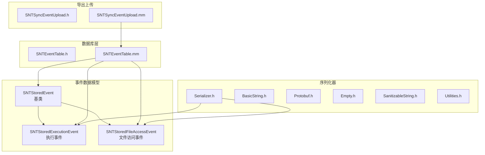
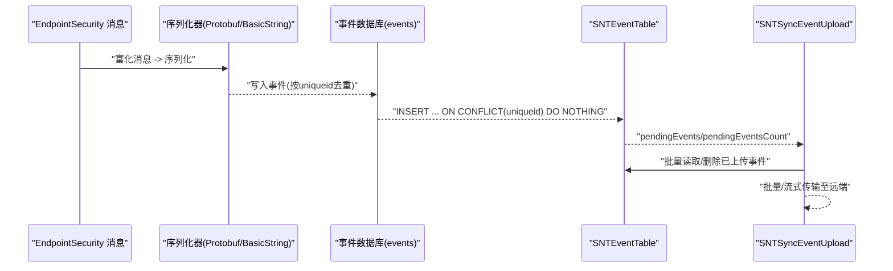
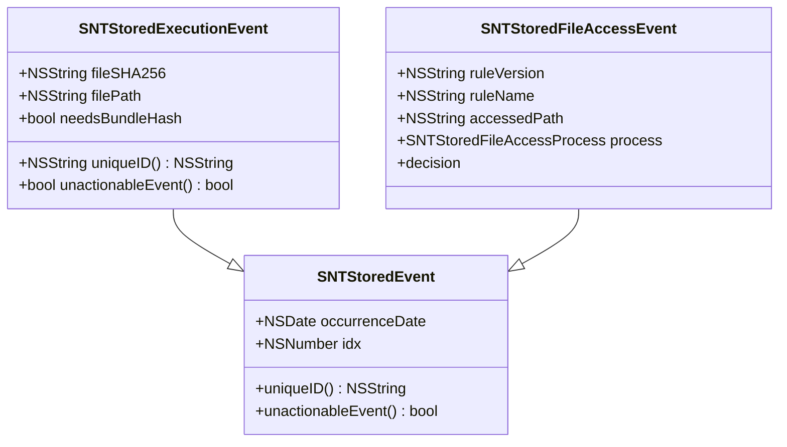
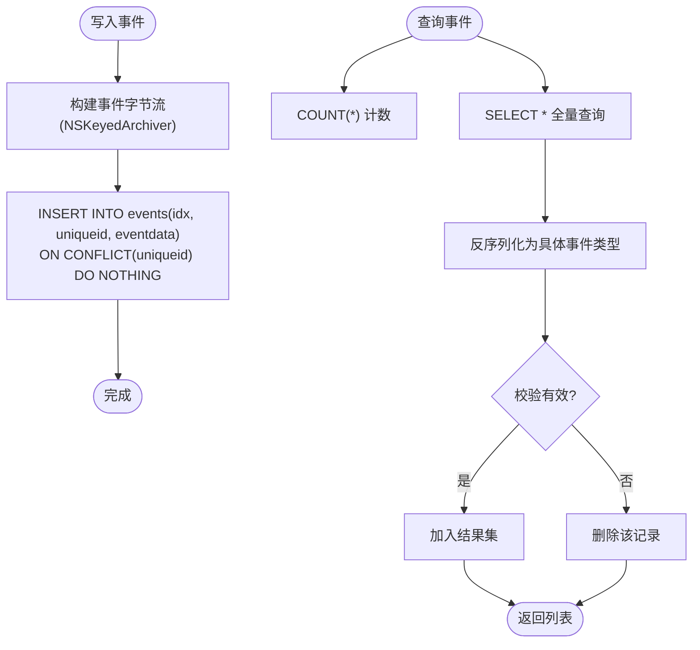
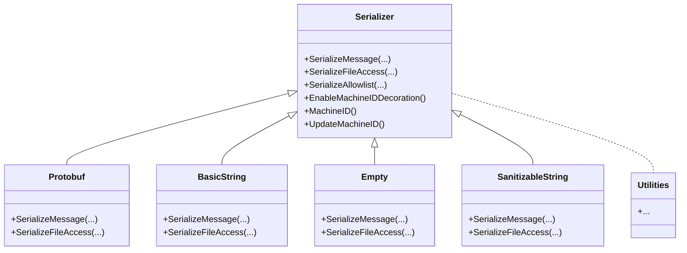
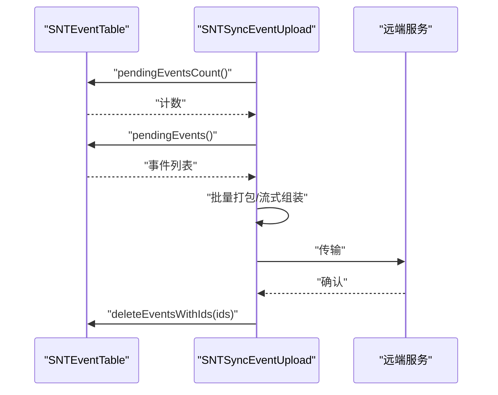
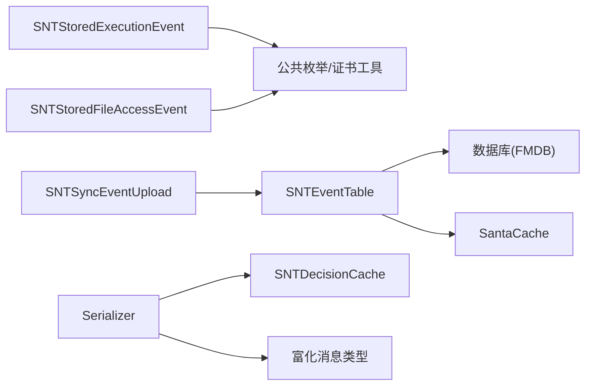

# 事件查询与分析

<cite>
**本文引用的文件**
- [SNTStoredEvent.h](file://Source/common/SNTStoredEvent.h)
- [SNTStoredEvent.mm](file://Source/common/SNTStoredEvent.mm)
- [SNTStoredExecutionEvent.h](file://Source/common/SNTStoredExecutionEvent.h)
- [SNTStoredExecutionEvent.mm](file://Source/common/SNTStoredExecutionEvent.mm)
- [SNTStoredFileAccessEvent.h](file://Source/common/SNTStoredFileAccessEvent.h)
- [SNTEventTable.h](file://Source/santad/DataLayer/SNTEventTable.h)
- [SNTEventTable.mm](file://Source/santad/DataLayer/SNTEventTable.mm)
- [Serializer.h](file://Source/santad/Logs/EndpointSecurity/Serializers/Serializer.h)
- [BasicString.h](file://Source/santad/Logs/EndpointSecurity/Serializers/BasicString.h)
- [BasicString.mm](file://Source/santad/Logs/EndpointSecurity/Serializers/BasicString.mm)
- [Empty.h](file://Source/santad/Logs/EndpointSecurity/Serializers/Empty.h)
- [Empty.mm](file://Source/santad/Logs/EndpointSecurity/Serializers/Empty.mm)
- [Protobuf.h](file://Source/santad/Logs/EndpointSecurity/Serializers/Protobuf.h)
- [Protobuf.mm](file://Source/santad/Logs/EndpointSecurity/Serializers/Protobuf.mm)
- [SanitizableString.h](file://Source/santad/Logs/EndpointSecurity/Serializers/SanitizableString.h)
- [SanitizableString.mm](file://Source/santad/Logs/EndpointSecurity/Serializers/SanitizableString.mm)
- [Utilities.h](file://Source/santad/Logs/EndpointSecurity/Serializers/Utilities.h)
- [Utilities.mm](file://Source/santad/Logs/EndpointSecurity/Serializers/Utilities.mm)
- [SNTSyncEventUpload.h](file://Source/santasyncservice/SNTSyncEventUpload.h)
- [SNTSyncEventUpload.mm](file://Source/santasyncservice/SNTSyncEventUpload.mm)
</cite>

## 目录
1. [简介](#简介)
2. [项目结构](#项目结构)
3. [核心组件](#核心组件)
4. [架构总览](#架构总览)
5. [详细组件分析](#详细组件分析)
6. [依赖关系分析](#依赖关系分析)
7. [性能考虑](#性能考虑)
8. [故障排查指南](#故障排查指南)
9. [结论](#结论)
10. [附录：API使用示例与集成指南](#附录api使用示例与集成指南)

## 简介
本文件面向Santa事件查询与分析能力，系统性梳理事件数据模型、数据库层、序列化器与导出上传链路。重点覆盖以下方面：
- 事件查询接口设计与实现：SQL查询构建、参数过滤、结果排序与聚合统计思路
- 事件分析工具能力：时间范围查询、事件类型筛选、聚合统计
- 事件序列化器多格式支持：Protobuf、BasicString与其他自定义格式
- 事件导出机制：批量导出、增量导出与实时流式传输
- 性能优化策略：索引利用、查询计划与缓存机制
- 最佳实践：常见查询模式、性能调优与监控指标
- 使用示例与集成指南

## 项目结构
Santa事件子系统由“事件数据模型 + 数据库层 + 序列化器 + 导出上传”四部分组成：
- 事件数据模型：统一基类与多种事件类型
- 数据库层：事件表管理、增删查计数、唯一性约束与索引
- 序列化器：面向EndpointSecurity消息的多格式序列化
- 导出上传：事件上传服务，支持批量与流式传输

图表来源
- [SNTStoredEvent.h](file://Source/common/SNTStoredEvent.h#L1-L36)
- [SNTStoredExecutionEvent.h](file://Source/common/SNTStoredExecutionEvent.h#L1-L142)
- [SNTStoredFileAccessEvent.h](file://Source/common/SNTStoredFileAccessEvent.h#L1-L74)
- [SNTEventTable.h](file://Source/santad/DataLayer/SNTEventTable.h#L1-L72)
- [SNTEventTable.mm](file://Source/santad/DataLayer/SNTEventTable.mm#L1-L244)
- [Serializer.h](file://Source/santad/Logs/EndpointSecurity/Serializers/Serializer.h#L1-L133)
- [SNTSyncEventUpload.h](file://Source/santasyncservice/SNTSyncEventUpload.h)
- [SNTSyncEventUpload.mm](file://Source/santasyncservice/SNTSyncEventUpload.mm)

章节来源
- [SNTStoredEvent.h](file://Source/common/SNTStoredEvent.h#L1-L36)
- [SNTStoredEvent.mm](file://Source/common/SNTStoredEvent.mm#L1-L74)
- [SNTStoredExecutionEvent.h](file://Source/common/SNTStoredExecutionEvent.h#L1-L142)
- [SNTStoredExecutionEvent.mm](file://Source/common/SNTStoredExecutionEvent.mm#L1-L181)
- [SNTStoredFileAccessEvent.h](file://Source/common/SNTStoredFileAccessEvent.h#L1-L74)
- [SNTEventTable.h](file://Source/santad/DataLayer/SNTEventTable.h#L1-L72)
- [SNTEventTable.mm](file://Source/santad/DataLayer/SNTEventTable.mm#L1-L244)
- [Serializer.h](file://Source/santad/Logs/EndpointSecurity/Serializers/Serializer.h#L1-L133)
- [SNTSyncEventUpload.h](file://Source/santasyncservice/SNTSyncEventUpload.h)
- [SNTSyncEventUpload.mm](file://Source/santasyncservice/SNTSyncEventUpload.mm)

## 核心组件
- 事件基类与派生事件
  - 基类提供统一的时间戳、索引与安全编码能力；派生事件承载不同业务字段与唯一标识规则
- 事件表（SNTEventTable）
  - 负责事件入库、去重、查询、计数与删除；内置唯一索引与事务写入
- 序列化器（Serializer族）
  - 面向EndpointSecurity消息的多格式序列化接口，支持Protobuf、BasicString等
- 导出上传（SNTSyncEventUpload）
  - 将待上传事件从数据库取出并进行批量或流式传输

章节来源
- [SNTStoredEvent.h](file://Source/common/SNTStoredEvent.h#L1-L36)
- [SNTStoredEvent.mm](file://Source/common/SNTStoredEvent.mm#L1-L74)
- [SNTStoredExecutionEvent.h](file://Source/common/SNTStoredExecutionEvent.h#L1-L142)
- [SNTStoredExecutionEvent.mm](file://Source/common/SNTStoredExecutionEvent.mm#L1-L181)
- [SNTStoredFileAccessEvent.h](file://Source/common/SNTStoredFileAccessEvent.h#L1-L74)
- [SNTEventTable.h](file://Source/santad/DataLayer/SNTEventTable.h#L1-L72)
- [SNTEventTable.mm](file://Source/santad/DataLayer/SNTEventTable.mm#L105-L244)
- [Serializer.h](file://Source/santad/Logs/EndpointSecurity/Serializers/Serializer.h#L1-L133)
- [SNTSyncEventUpload.h](file://Source/santasyncservice/SNTSyncEventUpload.h)
- [SNTSyncEventUpload.mm](file://Source/santasyncservice/SNTSyncEventUpload.mm)

## 架构总览
事件查询与分析的整体流程如下：
- 事件生成：EndpointSecurity消息经富化后由序列化器输出为指定格式
- 事件存储：序列化后的事件写入数据库，按uniqueid去重
- 事件查询：通过SNTEventTable提供计数、全量查询与删除接口
- 事件导出：SNTSyncEventUpload从数据库拉取待上传事件，进行批量/流式传输

图表来源
- [SNTEventTable.mm](file://Source/santad/DataLayer/SNTEventTable.mm#L107-L160)
- [Serializer.h](file://Source/santad/Logs/EndpointSecurity/Serializers/Serializer.h#L43-L67)
- [SNTSyncEventUpload.mm](file://Source/santasyncservice/SNTSyncEventUpload.mm)

## 详细组件分析

### 事件数据模型与唯一性
- 基类SNTStoredEvent
  - 统一属性：发生时间、随机索引
  - 抽象方法：uniqueID、unactionableEvent需由子类实现
- 执行事件SNTStoredExecutionEvent
  - 唯一标识：fileSHA256
  - 可判定无操作事件：当决策允许时视为无操作事件
- 文件访问事件SNTStoredFileAccessEvent
  - 包含规则版本/名称、被访问路径、进程信息与决策

图表来源
- [SNTStoredEvent.h](file://Source/common/SNTStoredEvent.h#L1-L36)
- [SNTStoredEvent.mm](file://Source/common/SNTStoredEvent.mm#L63-L73)
- [SNTStoredExecutionEvent.h](file://Source/common/SNTStoredExecutionEvent.h#L1-L142)
- [SNTStoredExecutionEvent.mm](file://Source/common/SNTStoredExecutionEvent.mm#L172-L180)
- [SNTStoredFileAccessEvent.h](file://Source/common/SNTStoredFileAccessEvent.h#L1-L74)

章节来源
- [SNTStoredEvent.h](file://Source/common/SNTStoredEvent.h#L1-L36)
- [SNTStoredEvent.mm](file://Source/common/SNTStoredEvent.mm#L1-L74)
- [SNTStoredExecutionEvent.h](file://Source/common/SNTStoredExecutionEvent.h#L1-L142)
- [SNTStoredExecutionEvent.mm](file://Source/common/SNTStoredExecutionEvent.mm#L1-L181)
- [SNTStoredFileAccessEvent.h](file://Source/common/SNTStoredFileAccessEvent.h#L1-L74)

### 数据库层：事件表与查询接口
- 表结构与索引
  - 列：idx主键、uniqueid唯一索引、eventdata二进制
  - 唯一索引用于去重，避免重复事件入库
- 写入与去重
  - 采用“冲突忽略”的插入策略，确保uniqueid唯一
- 查询与计数
  - 提供pendingEventsCount与pendingEvents两类接口
  - 全量查询会反序列化事件对象，失败则清理对应记录
- 删除
  - 支持单条与批量删除

图表来源
- [SNTEventTable.mm](file://Source/santad/DataLayer/SNTEventTable.mm#L107-L160)
- [SNTEventTable.mm](file://Source/santad/DataLayer/SNTEventTable.mm#L174-L225)

章节来源
- [SNTEventTable.h](file://Source/santad/DataLayer/SNTEventTable.h#L1-L72)
- [SNTEventTable.mm](file://Source/santad/DataLayer/SNTEventTable.mm#L46-L103)
- [SNTEventTable.mm](file://Source/santad/DataLayer/SNTEventTable.mm#L107-L160)
- [SNTEventTable.mm](file://Source/santad/DataLayer/SNTEventTable.mm#L174-L225)
- [SNTEventTable.mm](file://Source/santad/DataLayer/SNTEventTable.mm#L227-L243)

### 序列化器：多格式支持
- 接口抽象
  - Serializer定义了对多种EndpointSecurity消息类型的序列化虚函数
  - 提供通用模板方法与机器ID装饰能力
- 具体实现
  - Protobuf：二进制Protobuf序列化，适合高吞吐场景
  - BasicString：可读字符串序列化，便于调试与审计
  - Empty：空实现，用于占位或禁用序列化
  - SanitizableString：带脱敏能力的字符串序列化
  - Utilities：序列化工具函数集合

图表来源
- [Serializer.h](file://Source/santad/Logs/EndpointSecurity/Serializers/Serializer.h#L36-L132)
- [Protobuf.h](file://Source/santad/Logs/EndpointSecurity/Serializers/Protobuf.h)
- [Protobuf.mm](file://Source/santad/Logs/EndpointSecurity/Serializers/Protobuf.mm)
- [BasicString.h](file://Source/santad/Logs/EndpointSecurity/Serializers/BasicString.h)
- [BasicString.mm](file://Source/santad/Logs/EndpointSecurity/Serializers/BasicString.mm)
- [Empty.h](file://Source/santad/Logs/EndpointSecurity/Serializers/Empty.h)
- [Empty.mm](file://Source/santad/Logs/EndpointSecurity/Serializers/Empty.mm)
- [SanitizableString.h](file://Source/santad/Logs/EndpointSecurity/Serializers/SanitizableString.h)
- [SanitizableString.mm](file://Source/santad/Logs/EndpointSecurity/Serializers/SanitizableString.mm)
- [Utilities.h](file://Source/santad/Logs/EndpointSecurity/Serializers/Utilities.h)
- [Utilities.mm](file://Source/santad/Logs/EndpointSecurity/Serializers/Utilities.mm)

章节来源
- [Serializer.h](file://Source/santad/Logs/EndpointSecurity/Serializers/Serializer.h#L1-L133)
- [Protobuf.h](file://Source/santad/Logs/EndpointSecurity/Serializers/Protobuf.h)
- [Protobuf.mm](file://Source/santad/Logs/EndpointSecurity/Serializers/Protobuf.mm)
- [BasicString.h](file://Source/santad/Logs/EndpointSecurity/Serializers/BasicString.h)
- [BasicString.mm](file://Source/santad/Logs/EndpointSecurity/Serializers/BasicString.mm)
- [Empty.h](file://Source/santad/Logs/EndpointSecurity/Serializers/Empty.h)
- [Empty.mm](file://Source/santad/Logs/EndpointSecurity/Serializers/Empty.mm)
- [SanitizableString.h](file://Source/santad/Logs/EndpointSecurity/Serializers/SanitizableString.h)
- [SanitizableString.mm](file://Source/santad/Logs/EndpointSecurity/Serializers/SanitizableString.mm)
- [Utilities.h](file://Source/santad/Logs/EndpointSecurity/Serializers/Utilities.h)
- [Utilities.mm](file://Source/santad/Logs/EndpointSecurity/Serializers/Utilities.mm)

### 导出上传：批量/增量/流式
- 读取与计数
  - 通过pendingEventsCount与pendingEvents获取待上传事件
- 批量导出
  - 以批处理方式读取并打包，减少网络往返
- 增量导出
  - 对已成功上传的事件进行删除，仅保留未上传事件
- 实时流式传输
  - 可结合流式协议进行边产生边传输

图表来源
- [SNTEventTable.h](file://Source/santad/DataLayer/SNTEventTable.h#L43-L72)
- [SNTEventTable.mm](file://Source/santad/DataLayer/SNTEventTable.mm#L174-L203)
- [SNTEventTable.mm](file://Source/santad/DataLayer/SNTEventTable.mm#L227-L243)
- [SNTSyncEventUpload.mm](file://Source/santasyncservice/SNTSyncEventUpload.mm)

章节来源
- [SNTEventTable.h](file://Source/santad/DataLayer/SNTEventTable.h#L43-L72)
- [SNTEventTable.mm](file://Source/santad/DataLayer/SNTEventTable.mm#L174-L203)
- [SNTEventTable.mm](file://Source/santad/DataLayer/SNTEventTable.mm#L227-L243)
- [SNTSyncEventUpload.h](file://Source/santasyncservice/SNTSyncEventUpload.h)
- [SNTSyncEventUpload.mm](file://Source/santasyncservice/SNTSyncEventUpload.mm)

## 依赖关系分析
- 事件模型依赖于公共枚举与证书工具
- 事件表依赖数据库框架与缓存组件
- 序列化器依赖决策缓存与富化消息类型
- 导出上传依赖事件表与网络传输模块

图表来源
- [SNTStoredExecutionEvent.mm](file://Source/common/SNTStoredExecutionEvent.mm#L1-L48)
- [SNTStoredFileAccessEvent.h](file://Source/common/SNTStoredFileAccessEvent.h#L1-L74)
- [SNTEventTable.mm](file://Source/santad/DataLayer/SNTEventTable.mm#L46-L50)
- [Serializer.h](file://Source/santad/Logs/EndpointSecurity/Serializers/Serializer.h#L36-L51)
- [SNTSyncEventUpload.mm](file://Source/santasyncservice/SNTSyncEventUpload.mm)

章节来源
- [SNTStoredExecutionEvent.mm](file://Source/common/SNTStoredExecutionEvent.mm#L1-L48)
- [SNTStoredFileAccessEvent.h](file://Source/common/SNTStoredFileAccessEvent.h#L1-L74)
- [SNTEventTable.mm](file://Source/santad/DataLayer/SNTEventTable.mm#L46-L50)
- [Serializer.h](file://Source/santad/Logs/EndpointSecurity/Serializers/Serializer.h#L36-L51)
- [SNTSyncEventUpload.mm](file://Source/santasyncservice/SNTSyncEventUpload.mm)

## 性能考虑
- 索引利用
  - uniqueid唯一索引用于去重与快速查找
  - 建议在查询条件中尽量使用uniqueid或idx进行过滤
- 查询计划
  - 全量查询会反序列化所有事件，建议配合分页/游标或按时间窗口切片
  - 计数查询使用COUNT(*)，适合快速概览
- 缓存机制
  - 无操作事件的退避缓存：对相同uniqueid在固定周期内去重，降低重复入库压力
- 写入优化
  - 事务批量写入，冲突忽略策略减少重复写入
- 读取优化
  - 仅在必要时反序列化，异常事件自动清理，避免脏数据影响后续查询

章节来源
- [SNTEventTable.mm](file://Source/santad/DataLayer/SNTEventTable.mm#L46-L103)
- [SNTEventTable.mm](file://Source/santad/DataLayer/SNTEventTable.mm#L107-L160)
- [SNTEventTable.mm](file://Source/santad/DataLayer/SNTEventTable.mm#L162-L172)

## 故障排查指南
- 反序列化失败
  - 现象：查询时发现部分事件无法反序列化并被清理
  - 处理：检查事件对象的NSSecureCoding实现与允许类集合
- 唯一性冲突
  - 现象：重复uniqueid导致写入被忽略
  - 处理：确认事件唯一标识生成逻辑与去重策略
- 无操作事件过多
  - 现象：退避缓存导致大量事件被跳过
  - 处理：调整退避时间或放宽策略，结合业务需求评估
- 导出堆积
  - 现象：待上传事件持续增长
  - 处理：检查网络连通性与确认回执，优化批量大小与重试策略

章节来源
- [SNTEventTable.mm](file://Source/santad/DataLayer/SNTEventTable.mm#L205-L225)
- [SNTEventTable.mm](file://Source/santad/DataLayer/SNTEventTable.mm#L135-L158)
- [SNTEventTable.mm](file://Source/santad/DataLayer/SNTEventTable.mm#L162-L172)
- [SNTSyncEventUpload.mm](file://Source/santasyncservice/SNTSyncEventUpload.mm)

## 结论
Santa的事件查询与分析体系以统一的数据模型为基础，通过事件表实现高效去重与查询，借助多格式序列化器满足不同场景下的输出需求，并以导出上传服务完成批量/增量/流式的事件传输。性能层面通过索引、事务与退避缓存等手段保障稳定性与吞吐。建议在实际部署中结合业务特征选择合适的序列化格式与导出策略，并建立完善的监控与告警机制。

## 附录：API使用示例与集成指南
- 事件查询接口
  - 计数：参考接口定义与实现，用于快速统计待处理事件数量
  - 全量查询：返回事件列表，注意异常事件会被清理
  - 删除：支持单条与批量删除，常用于导出成功后的清理
- 事件分析工具
  - 时间范围：可在上层封装中基于occurrenceDate进行过滤
  - 事件类型：根据事件类型区分执行事件与文件访问事件
  - 聚合统计：建议在应用层按uniqueid或时间窗口进行聚合
- 序列化器选择
  - Protobuf：高吞吐、低体积，适合生产环境
  - BasicString：易调试、易审计，适合开发与排障
  - SanitizableString：需要脱敏时优先
- 导出集成
  - 读取：使用pendingEventsCount与pendingEvents
  - 传输：结合批量/流式协议发送
  - 清理：成功后调用删除接口

章节来源
- [SNTEventTable.h](file://Source/santad/DataLayer/SNTEventTable.h#L43-L72)
- [SNTEventTable.mm](file://Source/santad/DataLayer/SNTEventTable.mm#L174-L203)
- [SNTEventTable.mm](file://Source/santad/DataLayer/SNTEventTable.mm#L227-L243)
- [Serializer.h](file://Source/santad/Logs/EndpointSecurity/Serializers/Serializer.h#L43-L106)
- [Protobuf.h](file://Source/santad/Logs/EndpointSecurity/Serializers/Protobuf.h)
- [BasicString.h](file://Source/santad/Logs/EndpointSecurity/Serializers/BasicString.h)
- [SanitizableString.h](file://Source/santad/Logs/EndpointSecurity/Serializers/SanitizableString.h)
- [SNTSyncEventUpload.mm](file://Source/santasyncservice/SNTSyncEventUpload.mm)