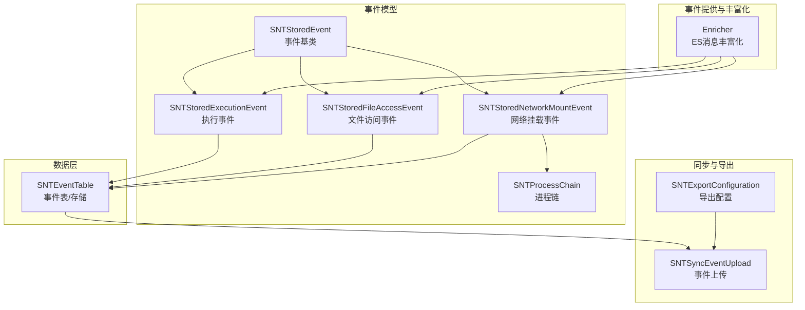
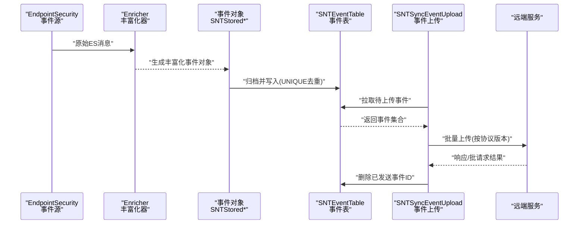
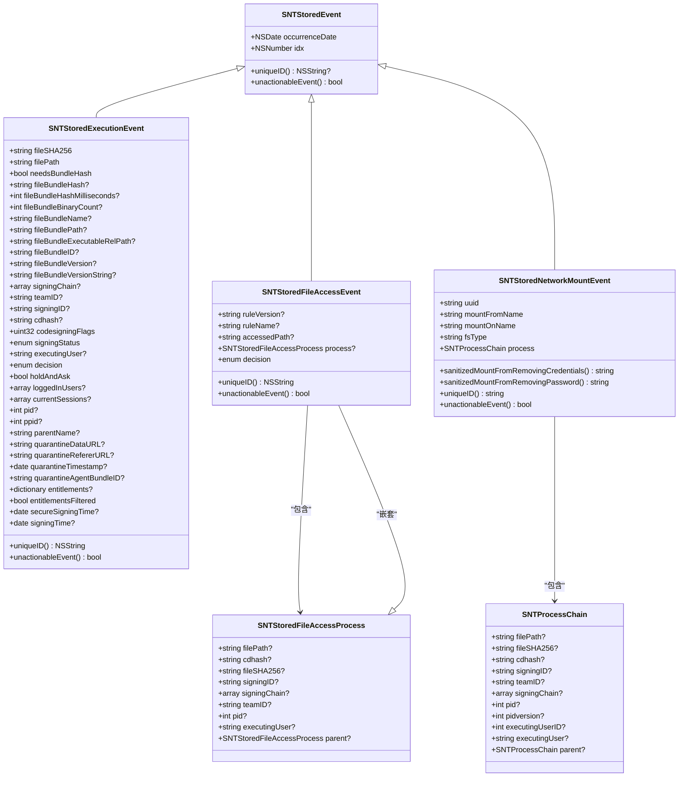
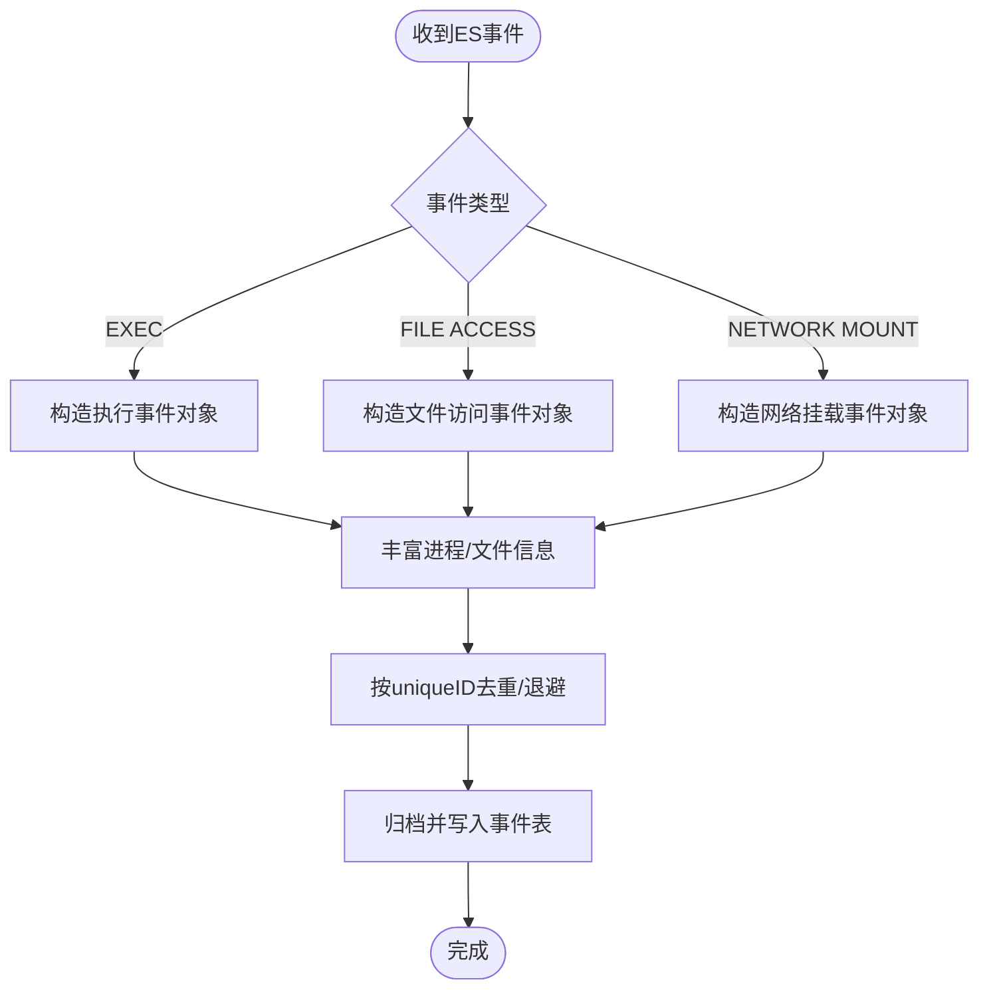
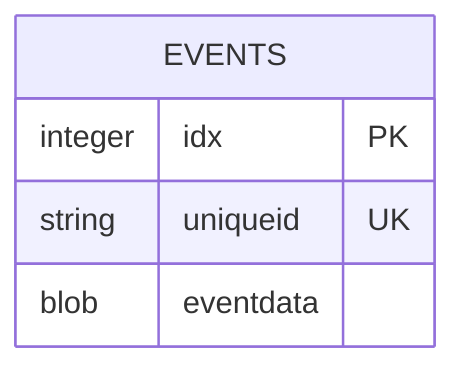
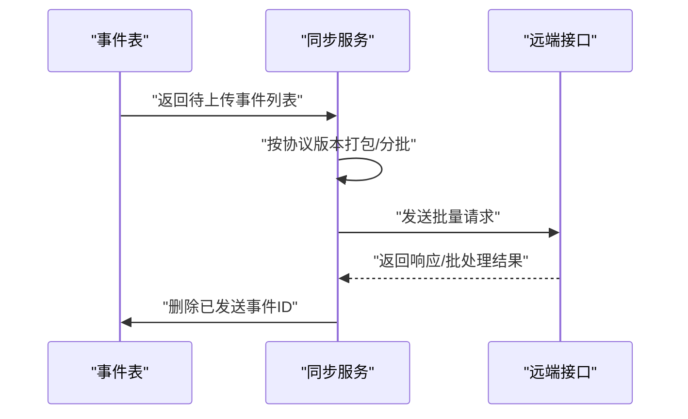
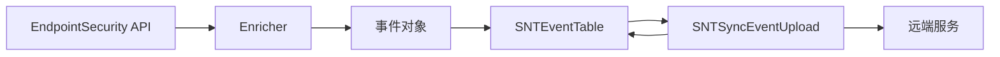

# 事件管理系统

<cite>
**本文引用的文件**
- [SNTStoredEvent.h](file://Source/common/SNTStoredEvent.h)
- [SNTStoredEvent.mm](file://Source/common/SNTStoredEvent.mm)
- [SNTStoredExecutionEvent.h](file://Source/common/SNTStoredExecutionEvent.h)
- [SNTStoredExecutionEvent.mm](file://Source/common/SNTStoredExecutionEvent.mm)
- [SNTStoredFileAccessEvent.h](file://Source/common/SNTStoredFileAccessEvent.h)
- [SNTStoredFileAccessEvent.mm](file://Source/common/SNTStoredFileAccessEvent.mm)
- [SNTStoredNetworkMountEvent.h](file://Source/common/SNTStoredNetworkMountEvent.h)
- [SNTStoredNetworkMountEvent.mm](file://Source/common/SNTStoredNetworkMountEvent.mm)
- [SNTProcessChain.h](file://Source/common/SNTProcessChain.h)
- [SNTProcessChain.mm](file://Source/common/SNTProcessChain.mm)
- [SNTEventTable.h](file://Source/santad/DataLayer/SNTEventTable.h)
- [SNTEventTable.mm](file://Source/santad/DataLayer/SNTEventTable.mm)
- [Enricher.h](file://Source/santad/EventProviders/EndpointSecurity/Enricher.h)
- [Enricher.mm](file://Source/santad/EventProviders/EndpointSecurity/Enricher.mm)
- [SNTSyncEventUpload.h](file://Source/santasyncservice/SNTSyncEventUpload.h)
- [SNTSyncEventUpload.mm](file://Source/santasyncservice/SNTSyncEventUpload.mm)
- [SNTExportConfiguration.h](file://Source/common/SNTExportConfiguration.h)
- [SNTExportConfiguration.mm](file://Source/common/SNTExportConfiguration.mm)
</cite>

## 目录
1. [简介](#简介)
2. [项目结构](#项目结构)
3. [核心组件](#核心组件)
4. [架构总览](#架构总览)
5. [详细组件分析](#详细组件分析)
6. [依赖关系分析](#依赖关系分析)
7. [性能考虑](#性能考虑)
8. [故障排查指南](#故障排查指南)
9. [结论](#结论)
10. [附录](#附录)

## 简介
本文件面向Santa事件管理系统，系统性梳理事件类型分类、事件捕获与丰富化、事件存储与数据库架构、事件持久化与上传流程、事件查询与导出、事件分析与审计追踪、以及性能优化与清理策略。文档以仓库源码为依据，通过图示与分层讲解帮助读者快速掌握从事件产生到持久化与上报的全链路。

## 项目结构
事件管理相关代码主要分布在以下模块：
- 通用事件模型：定义事件基类与各类具体事件（执行、文件访问、网络挂载、临时监控模式审计等）
- 数据层：事件表抽象与SQLite存储实现，负责事件入库、查询、删除与版本迁移
- 事件提供与丰富化：基于EndpointSecurity消息，进行进程/文件信息丰富与缓存
- 同步服务：事件批量序列化、按协议打包并上传至远端
- 导出配置：事件导出目标与参数的序列化与反序列化

图表来源
- [SNTStoredEvent.h](file://Source/common/SNTStoredEvent.h#L1-L36)
- [SNTStoredExecutionEvent.h](file://Source/common/SNTStoredExecutionEvent.h#L1-L142)
- [SNTStoredFileAccessEvent.h](file://Source/common/SNTStoredFileAccessEvent.h#L1-L74)
- [SNTStoredNetworkMountEvent.h](file://Source/common/SNTStoredNetworkMountEvent.h#L1-L42)
- [SNTProcessChain.h](file://Source/common/SNTProcessChain.h#L1-L56)
- [SNTEventTable.h](file://Source/santad/DataLayer/SNTEventTable.h#L1-L72)
- [Enricher.h](file://Source/santad/EventProviders/EndpointSecurity/Enricher.h#L1-L74)
- [SNTSyncEventUpload.h](file://Source/santasyncservice/SNTSyncEventUpload.h#L1-L26)
- [SNTExportConfiguration.h](file://Source/common/SNTExportConfiguration.h#L1-L28)

章节来源
- [SNTStoredEvent.h](file://Source/common/SNTStoredEvent.h#L1-L36)
- [SNTEventTable.h](file://Source/santad/DataLayer/SNTEventTable.h#L1-L72)

## 核心组件
- 事件基类与序列化
  - 基类提供索引、发生时间与唯一标识接口；派生类各自定义唯一ID与可行动性判定
  - 所有事件均支持NSSecureCoding，便于持久化与跨进程传递
- 具体事件类型
  - 执行事件：包含文件哈希、路径、签名链、团队ID、签名ID、cdhash、codesign标志、决策状态、进程与父进程信息、会话与登录用户、隔离区信息等
  - 文件访问事件：包含规则版本/名称、被访问路径、进程链（含签名链、团队ID、签名ID、cdhash、pid、用户、父进程）
  - 网络挂载事件：包含挂载来源/目标、文件系统类型、进程链、并提供凭据脱敏方法
- 数据层
  - 事件表负责将事件对象归档后写入SQLite，使用uniqueid去重，支持事务批量插入、计数查询、按索引删除
  - 内置“不可行动事件”退避缓存，减少重复上传噪声
- 事件提供与丰富化
  - 基于EndpointSecurity消息，对进程、文件、用户UID/GID进行本地或外部查询丰富，并维护轻量缓存
- 同步与导出
  - 将事件按协议版本打包，批量上传；上传成功后在守护进程侧删除已发送事件ID
  - 导出配置支持序列化/反序列化，便于持久化导出目标与参数

章节来源
- [SNTStoredEvent.mm](file://Source/common/SNTStoredEvent.mm#L1-L74)
- [SNTStoredExecutionEvent.mm](file://Source/common/SNTStoredExecutionEvent.mm#L1-L181)
- [SNTStoredFileAccessEvent.mm](file://Source/common/SNTStoredFileAccessEvent.mm#L1-L111)
- [SNTStoredNetworkMountEvent.mm](file://Source/common/SNTStoredNetworkMountEvent.mm#L1-L108)
- [SNTEventTable.mm](file://Source/santad/DataLayer/SNTEventTable.mm#L1-L244)
- [Enricher.mm](file://Source/santad/EventProviders/EndpointSecurity/Enricher.mm#L1-L282)
- [SNTSyncEventUpload.mm](file://Source/santasyncservice/SNTSyncEventUpload.mm#L1-L485)
- [SNTExportConfiguration.mm](file://Source/common/SNTExportConfiguration.mm#L1-L89)

## 架构总览
事件从内核EndpointSecurity事件源进入，经由丰富化器生成 enriched 消息，转换为统一的事件对象，写入本地数据库，随后由同步服务批量上传至远端。

图表来源
- [Enricher.mm](file://Source/santad/EventProviders/EndpointSecurity/Enricher.mm#L1-L282)
- [SNTStoredExecutionEvent.mm](file://Source/common/SNTStoredExecutionEvent.mm#L1-L181)
- [SNTStoredFileAccessEvent.mm](file://Source/common/SNTStoredFileAccessEvent.mm#L1-L111)
- [SNTStoredNetworkMountEvent.mm](file://Source/common/SNTStoredNetworkMountEvent.mm#L1-L108)
- [SNTEventTable.mm](file://Source/santad/DataLayer/SNTEventTable.mm#L1-L244)
- [SNTSyncEventUpload.mm](file://Source/santasyncservice/SNTSyncEventUpload.mm#L1-L485)

## 详细组件分析

### 事件类型与数据模型
事件采用继承体系，统一基类提供序列化能力，各子类聚焦自身字段与语义。

图表来源
- [SNTStoredEvent.h](file://Source/common/SNTStoredEvent.h#L1-L36)
- [SNTStoredExecutionEvent.h](file://Source/common/SNTStoredExecutionEvent.h#L1-L142)
- [SNTStoredFileAccessEvent.h](file://Source/common/SNTStoredFileAccessEvent.h#L1-L74)
- [SNTStoredNetworkMountEvent.h](file://Source/common/SNTStoredNetworkMountEvent.h#L1-L42)
- [SNTProcessChain.h](file://Source/common/SNTProcessChain.h#L1-L56)

章节来源
- [SNTStoredEvent.h](file://Source/common/SNTStoredEvent.h#L1-L36)
- [SNTStoredEvent.mm](file://Source/common/SNTStoredEvent.mm#L1-L74)
- [SNTStoredExecutionEvent.h](file://Source/common/SNTStoredExecutionEvent.h#L1-L142)
- [SNTStoredExecutionEvent.mm](file://Source/common/SNTStoredExecutionEvent.mm#L1-L181)
- [SNTStoredFileAccessEvent.h](file://Source/common/SNTStoredFileAccessEvent.h#L1-L74)
- [SNTStoredFileAccessEvent.mm](file://Source/common/SNTStoredFileAccessEvent.mm#L1-L111)
- [SNTStoredNetworkMountEvent.h](file://Source/common/SNTStoredNetworkMountEvent.h#L1-L42)
- [SNTStoredNetworkMountEvent.mm](file://Source/common/SNTStoredNetworkMountEvent.mm#L1-L108)
- [SNTProcessChain.h](file://Source/common/SNTProcessChain.h#L1-L56)
- [SNTProcessChain.mm](file://Source/common/SNTProcessChain.mm#L1-L63)

### 事件捕获与丰富化流程
- EndpointSecurity事件到达后，由丰富化器根据事件类型映射为丰富化消息，同时对进程/文件元信息进行补充
- 丰富化器支持“仅本地”选项，避免触发外部进程工作，降低热路径开销
- 进程树注解可用于构建进程链，便于审计与溯源

图表来源
- [Enricher.mm](file://Source/santad/EventProviders/EndpointSecurity/Enricher.mm#L1-L282)
- [SNTStoredExecutionEvent.mm](file://Source/common/SNTStoredExecutionEvent.mm#L1-L181)
- [SNTStoredFileAccessEvent.mm](file://Source/common/SNTStoredFileAccessEvent.mm#L1-L111)
- [SNTStoredNetworkMountEvent.mm](file://Source/common/SNTStoredNetworkMountEvent.mm#L1-L108)
- [SNTEventTable.mm](file://Source/santad/DataLayer/SNTEventTable.mm#L1-L244)

章节来源
- [Enricher.h](file://Source/santad/EventProviders/EndpointSecurity/Enricher.h#L1-L74)
- [Enricher.mm](file://Source/santad/EventProviders/EndpointSecurity/Enricher.mm#L1-L282)

### 事件存储与数据库架构
- 表结构与迁移
  - 初始版本创建events表，包含自增主键idx、filesha256列与eventdata二进制
  - 版本演进中移除AUTOINCREMENT、重建表、添加唯一索引filesha256
  - 最终将filesha256重命名为uniqueid，统一不同事件类型的去重键
- 存储策略
  - 使用事务批量插入，ON CONFLICT(uniqueid) DO NOTHING保证幂等
  - 对不可行动事件（如允许仅审计）设置退避缓存，避免频繁上传
  - 支持按索引删除单条或多条事件
- 查询与清理
  - 提供pendingEventsCount与pendingEvents查询
  - 对无法反序列化的事件自动清理对应记录

图表来源
- [SNTEventTable.mm](file://Source/santad/DataLayer/SNTEventTable.mm#L1-L244)

章节来源
- [SNTEventTable.h](file://Source/santad/DataLayer/SNTEventTable.h#L1-L72)
- [SNTEventTable.mm](file://Source/santad/DataLayer/SNTEventTable.mm#L1-L244)

### 事件持久化与上传流程
- 守护进程侧
  - 从事件表读取待上传事件，按协议版本打包，批量发送
  - 成功后调用远程代理删除已发送事件ID，避免重复上传
- 协议与导出
  - 上传时区分执行事件、文件访问事件、临时监控模式审计事件、网络挂载事件
  - 导出配置支持序列化/反序列化，便于持久化导出目标与参数

图表来源
- [SNTSyncEventUpload.mm](file://Source/santasyncservice/SNTSyncEventUpload.mm#L1-L485)
- [SNTEventTable.mm](file://Source/santad/DataLayer/SNTEventTable.mm#L1-L244)

章节来源
- [SNTSyncEventUpload.h](file://Source/santasyncservice/SNTSyncEventUpload.h#L1-L26)
- [SNTSyncEventUpload.mm](file://Source/santasyncservice/SNTSyncEventUpload.mm#L1-L485)
- [SNTExportConfiguration.h](file://Source/common/SNTExportConfiguration.h#L1-L28)
- [SNTExportConfiguration.mm](file://Source/common/SNTExportConfiguration.mm#L1-L89)

### 事件查询接口与导出格式
- 查询接口
  - 计数查询：pendingEventsCount
  - 全量查询：pendingEvents（逐条反序列化，异常则清理）
  - 删除接口：deleteEventWithId / deleteEventsWithIds
- 导出格式与传输协议
  - 事件上传采用协议版本区分，执行事件、文件访问事件、网络挂载事件、临时监控模式审计事件分别映射为协议消息
  - 上传前对网络挂载来源URL进行凭据脱敏
  - 导出配置支持序列化/反序列化，便于持久化导出目标与参数

章节来源
- [SNTEventTable.h](file://Source/santad/DataLayer/SNTEventTable.h#L1-L72)
- [SNTEventTable.mm](file://Source/santad/DataLayer/SNTEventTable.mm#L1-L244)
- [SNTSyncEventUpload.mm](file://Source/santasyncservice/SNTSyncEventUpload.mm#L1-L485)
- [SNTStoredNetworkMountEvent.mm](file://Source/common/SNTStoredNetworkMountEvent.mm#L1-L108)
- [SNTExportConfiguration.mm](file://Source/common/SNTExportConfiguration.mm#L1-L89)

### 事件分析工具、日志与审计追踪
- 日志
  - 反序列化失败等异常通过日志记录，便于定位问题
- 审计追踪
  - 执行事件包含决策状态、签名链、团队ID、签名ID、cdhash、安全签名时间、开发签名时间、权限集等，便于审计
  - 文件访问事件包含规则版本/名称、被访问路径、进程链（含签名链、团队ID、签名ID、cdhash、pid、用户、父进程），支持回溯
  - 网络挂载事件包含挂载来源/目标、文件系统类型、进程链，并提供凭据脱敏方法，兼顾隐私与审计
- 分析建议
  - 基于决策状态与签名信息聚合统计
  - 基于进程链构建执行路径图谱，识别异常调用链

章节来源
- [SNTEventTable.mm](file://Source/santad/DataLayer/SNTEventTable.mm#L1-L244)
- [SNTStoredExecutionEvent.mm](file://Source/common/SNTStoredExecutionEvent.mm#L1-L181)
- [SNTStoredFileAccessEvent.mm](file://Source/common/SNTStoredFileAccessEvent.mm#L1-L111)
- [SNTStoredNetworkMountEvent.mm](file://Source/common/SNTStoredNetworkMountEvent.mm#L1-L108)

### 性能监控指标与优化
- 缓存与退避
  - 不可行动事件退避缓存，减少重复上传与抖动
  - 用户名/组名缓存，降低UID/GID查询开销
- 批量与事务
  - 事务内批量插入，减少磁盘写放大
  - 按批次大小分批上传，控制单次请求体积
- 去重与索引
  - uniqueid唯一索引，配合ON CONFLICT避免重复写入
- 大数据量处理
  - 分批查询与上传，避免一次性加载过多事件
  - 对不可解析事件自动清理，保持表健康

章节来源
- [SNTEventTable.mm](file://Source/santad/DataLayer/SNTEventTable.mm#L1-L244)
- [Enricher.mm](file://Source/santad/EventProviders/EndpointSecurity/Enricher.mm#L1-L282)
- [SNTSyncEventUpload.mm](file://Source/santasyncservice/SNTSyncEventUpload.mm#L1-L485)

## 依赖关系分析
- 组件耦合
  - 事件模型与数据层解耦：事件对象仅依赖序列化协议，存储层负责持久化细节
  - 丰富化器与进程树模块协作，提供进程链注解
  - 同步服务依赖事件表与守护进程代理，负责上传与删除确认
- 外部依赖
  - EndpointSecurity API用于事件源
  - SQLite（FMDB封装）用于本地存储
  - Protocol Buffers用于事件序列化与上传

图表来源
- [Enricher.mm](file://Source/santad/EventProviders/EndpointSecurity/Enricher.mm#L1-L282)
- [SNTEventTable.mm](file://Source/santad/DataLayer/SNTEventTable.mm#L1-L244)
- [SNTSyncEventUpload.mm](file://Source/santasyncservice/SNTSyncEventUpload.mm#L1-L485)

章节来源
- [Enricher.h](file://Source/santad/EventProviders/EndpointSecurity/Enricher.h#L1-L74)
- [SNTEventTable.h](file://Source/santad/DataLayer/SNTEventTable.h#L1-L72)
- [SNTSyncEventUpload.h](file://Source/santasyncservice/SNTSyncEventUpload.h#L1-L26)

## 性能考虑
- 事件去重与退避：通过uniqueID与不可行动事件退避，显著降低重复上传
- 本地缓存：用户名/组名缓存与进程树注解，减少外部查询
- 批处理与事务：批量写入与事务提交，提升吞吐
- 分页与限流：按批次大小分批上传，避免超大请求
- 清理策略：自动清理无法反序列化事件，维持表规模可控

[本节为通用指导，无需列出章节来源]

## 故障排查指南
- 事件无法反序列化
  - 现象：查询待上传事件时出现反序列化错误并清理对应记录
  - 排查：检查事件对象版本兼容性与归档完整性
- 上传失败
  - 现象：上传请求失败，返回错误
  - 排查：检查网络连通性、远端接口可用性、请求超时与批次大小
- 重复事件与噪声
  - 现象：相同事件频繁出现
  - 排查：确认uniqueID是否正确、退避缓存是否生效、是否开启去重策略
- 导出配置异常
  - 现象：导出配置序列化/反序列化失败
  - 排查：检查配置对象完整性与序列化开关

章节来源
- [SNTEventTable.mm](file://Source/santad/DataLayer/SNTEventTable.mm#L1-L244)
- [SNTSyncEventUpload.mm](file://Source/santasyncservice/SNTSyncEventUpload.mm#L1-L485)
- [SNTExportConfiguration.mm](file://Source/common/SNTExportConfiguration.mm#L1-L89)

## 结论
Santa事件管理系统以清晰的事件模型、完善的丰富化与存储机制、稳健的批量上传与清理策略为核心，覆盖了从事件捕获到持久化与上报的完整生命周期。通过uniqueID去重、不可行动事件退避、本地缓存与事务批量写入等手段，在保证审计完整性的同时兼顾性能与可维护性。结合进程链与签名信息，系统为事件分析与审计提供了坚实的数据基础。

[本节为总结性内容，无需列出章节来源]

## 附录
- 事件清理策略
  - 自动清理无法反序列化的事件记录
  - 上传成功后删除已发送事件ID
- 存储优化
  - 唯一索引uniqueid，配合ON CONFLICT避免重复
  - 事务批量写入，减少磁盘写放大
- 大数据量处理
  - 分批查询与上传，限制单次请求大小
  - 对高频事件启用退避缓存

[本节为通用指导，无需列出章节来源]