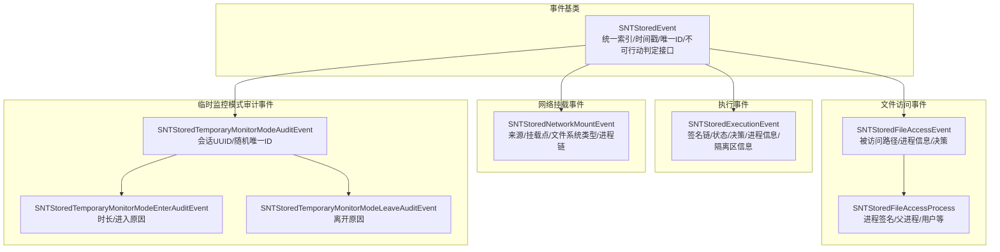
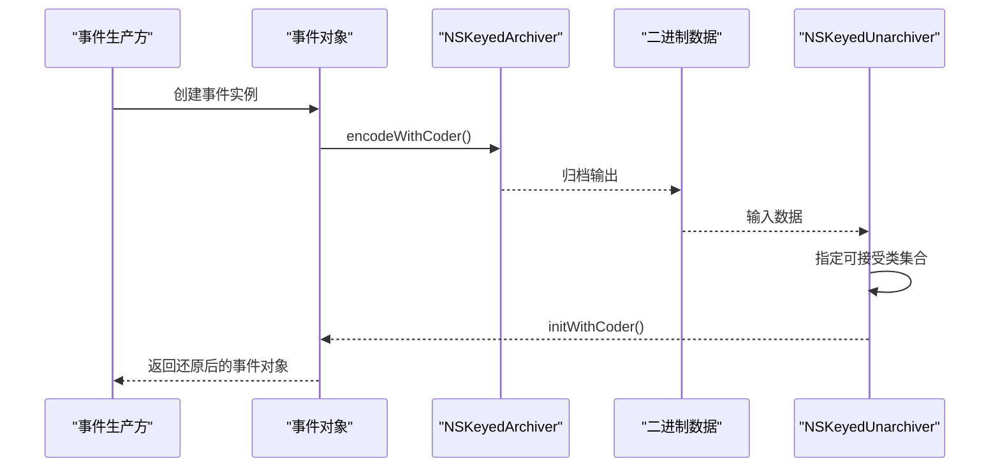
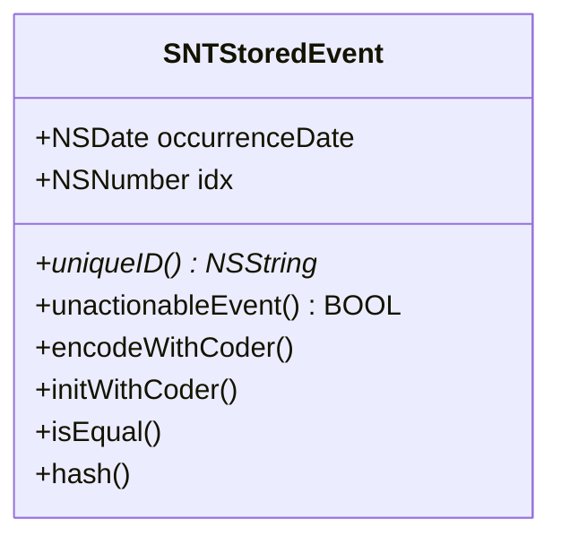
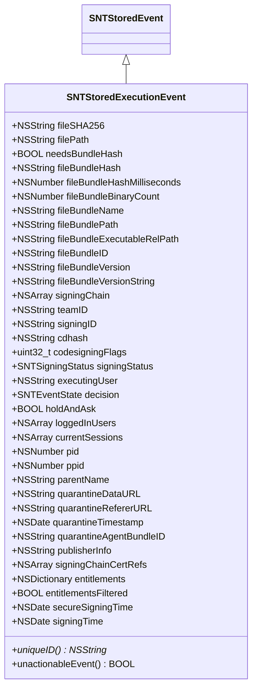
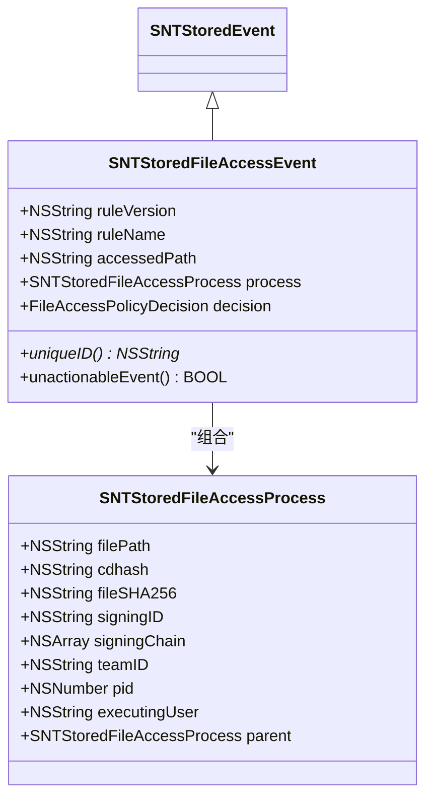
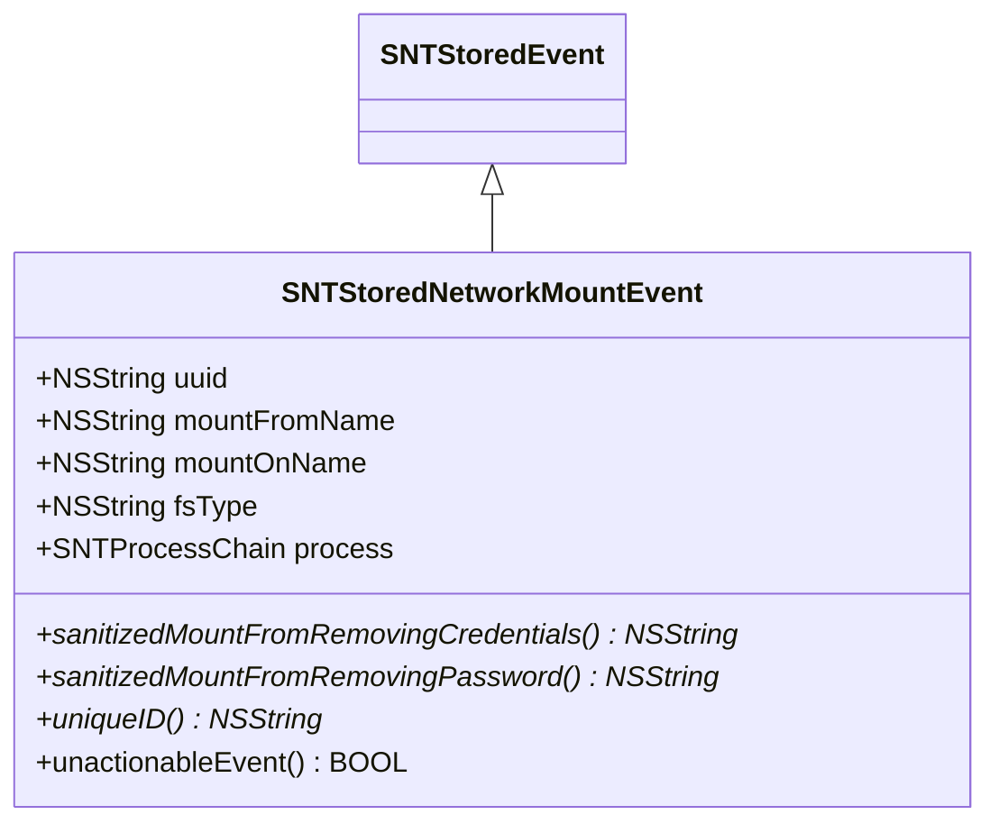
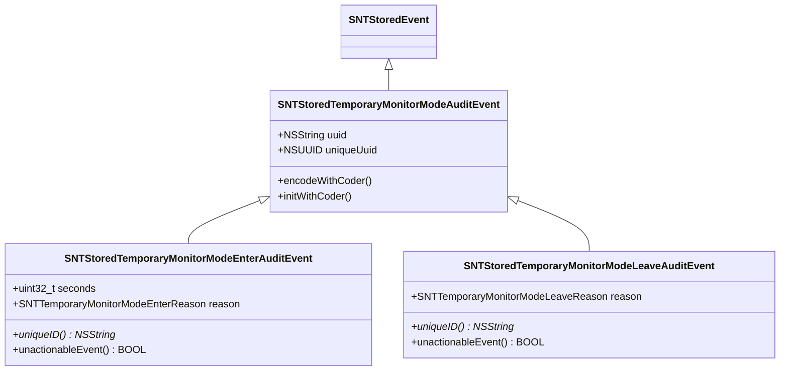
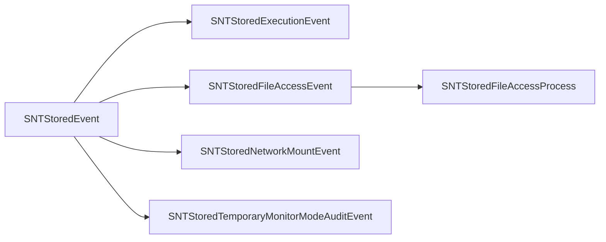

# 事件类型与格式

<cite>
**本文引用的文件**
- [SNTStoredEvent.h](file://Source/common/SNTStoredEvent.h)
- [SNTStoredEvent.mm](file://Source/common/SNTStoredEvent.mm)
- [SNTStoredExecutionEvent.h](file://Source/common/SNTStoredExecutionEvent.h)
- [SNTStoredExecutionEvent.mm](file://Source/common/SNTStoredExecutionEvent.mm)
- [SNTStoredFileAccessEvent.h](file://Source/common/SNTStoredFileAccessEvent.h)
- [SNTStoredFileAccessEvent.mm](file://Source/common/SNTStoredFileAccessEvent.mm)
- [SNTStoredNetworkMountEvent.h](file://Source/common/SNTStoredNetworkMountEvent.h)
- [SNTStoredNetworkMountEvent.mm](file://Source/common/SNTStoredNetworkMountEvent.mm)
- [SNTStoredTemporaryMonitorModeAuditEvent.h](file://Source/common/SNTStoredTemporaryMonitorModeAuditEvent.h)
- [SNTStoredTemporaryMonitorModeAuditEvent.mm](file://Source/common/SNTStoredTemporaryMonitorModeAuditEvent.mm)
- [SNTCommonEnums.h](file://Source/common/SNTCommonEnums.h)
- [new_sntstoredexecutionevent_archive.plist](file://Source/santad/testdata/new_sntstoredexecutionevent_archive.plist)
- [old_sntstoredevent_archive.plist](file://Source/santad/testdata/old_sntstoredevent_archive.plist)
- [SNTStoredEventTest.mm](file://Source/common/SNTStoredEventTest.mm)
- [SNTStoredExecutionEventTest.mm](file://Source/common/SNTStoredExecutionEventTest.mm)
</cite>

## 目录
1. [引言](#引言)
2. [项目结构](#项目结构)
3. [核心组件](#核心组件)
4. [架构总览](#架构总览)
5. [详细组件分析](#详细组件分析)
6. [依赖分析](#依赖分析)
7. [性能考虑](#性能考虑)
8. [故障排查指南](#故障排查指南)
9. [结论](#结论)
10. [附录](#附录)

## 引言
本文件系统性梳理 Santa 中“已存储事件”体系，聚焦以下事件类型与格式：执行事件（SNTStoredExecutionEvent）、文件访问事件（SNTStoredFileAccessEvent）、网络挂载事件（SNTStoredNetworkMountEvent）与临时监控模式审计事件（SNTStoredTemporaryMonitorModeAuditEvent 及其派生类）。文档覆盖：
- 事件基类设计理念与继承关系
- 唯一标识符生成机制、不可行动事件判断逻辑与安全编码实现
- 事件对象的创建、序列化与反序列化流程
- 事件格式版本演进与向后兼容性策略

## 项目结构
事件相关代码主要位于 Source/common 目录，围绕统一的存储事件基类展开，各具体事件类型在自身头文件中声明属性，在实现文件中完成 NSSecureCoding 的编码/解码与业务规则。

图示来源
- [SNTStoredEvent.h](file://Source/common/SNTStoredEvent.h#L1-L36)
- [SNTStoredEvent.mm](file://Source/common/SNTStoredEvent.mm#L1-L74)
- [SNTStoredExecutionEvent.h](file://Source/common/SNTStoredExecutionEvent.h#L1-L142)
- [SNTStoredExecutionEvent.mm](file://Source/common/SNTStoredExecutionEvent.mm#L1-L181)
- [SNTStoredFileAccessEvent.h](file://Source/common/SNTStoredFileAccessEvent.h#L1-L74)
- [SNTStoredFileAccessEvent.mm](file://Source/common/SNTStoredFileAccessEvent.mm#L1-L111)
- [SNTStoredNetworkMountEvent.h](file://Source/common/SNTStoredNetworkMountEvent.h#L1-L42)
- [SNTStoredNetworkMountEvent.mm](file://Source/common/SNTStoredNetworkMountEvent.mm#L1-L108)
- [SNTStoredTemporaryMonitorModeAuditEvent.h](file://Source/common/SNTStoredTemporaryMonitorModeAuditEvent.h#L1-L92)
- [SNTStoredTemporaryMonitorModeAuditEvent.mm](file://Source/common/SNTStoredTemporaryMonitorModeAuditEvent.mm#L1-L144)

章节来源
- [SNTStoredEvent.h](file://Source/common/SNTStoredEvent.h#L1-L36)
- [SNTStoredEvent.mm](file://Source/common/SNTStoredEvent.mm#L1-L74)

## 核心组件
- 事件基类 SNTStoredEvent
  - 统一字段：发生时间、随机索引、唯一ID接口、不可行动事件接口
  - 安全编码：支持 NSSecureCoding，初始化时设置随机索引与当前时间
  - 唯一ID与不可行动判定为纯虚方法，子类必须实现；基类默认抛出异常以避免误用
- 执行事件 SNTStoredExecutionEvent
  - 关键属性：文件哈希、路径、是否为包内事件、包哈希与统计、签名链、团队ID、签名ID、CDHash、签名标志、签名状态、执行用户、决策、持有待审、登录用户/会话、进程/父进程信息、隔离区元数据、发布者信息、权限、过滤标记、可信/非可信签名时间
  - 唯一ID：以文件 SHA-256 作为事件唯一标识
  - 不可行动判定：当决策为允许类时视为不可行动（无需后续处理）
- 文件访问事件 SNTStoredFileAccessEvent
  - 关键属性：违规规则版本/名称、被访问路径、进程信息（含签名链/团队ID/签名ID/CDHash/进程ID/用户/父进程）
  - 唯一ID：由规则名、规则版本与进程 SHA-256 拼接而成，避免因频繁路径变化导致上传噪音
  - 不可行动判定：仅“仅审计允许”场景视为不可行动
- 网络挂载事件 SNTStoredNetworkMountEvent
  - 关键属性：事件 UUID、来源名称、挂载点、文件系统类型、进程链
  - 唯一ID：以来源 URL 作为去重依据
  - 不可行动判定：返回真，表示可纳入回退缓存
  - 安全清洗：提供移除凭据/仅移除密码的 URL 清洗工具函数
- 临时监控模式审计事件
  - 抽象基类：包含会话 UUID 与随机唯一 ID，禁止直接实例化
  - 进入事件：包含持续秒数与进入原因（按需/刷新/重启）
  - 离开事件：包含离开原因（过期/取消/撤销/服务器变更/重启）
  - 唯一ID：每次实例化生成随机 UUID，确保多次刷新均被上报
  - 不可行动判定：始终返回假，要求持久化存储

章节来源
- [SNTStoredEvent.h](file://Source/common/SNTStoredEvent.h#L1-L36)
- [SNTStoredEvent.mm](file://Source/common/SNTStoredEvent.mm#L1-L74)
- [SNTStoredExecutionEvent.h](file://Source/common/SNTStoredExecutionEvent.h#L1-L142)
- [SNTStoredExecutionEvent.mm](file://Source/common/SNTStoredExecutionEvent.mm#L1-L181)
- [SNTStoredFileAccessEvent.h](file://Source/common/SNTStoredFileAccessEvent.h#L1-L74)
- [SNTStoredFileAccessEvent.mm](file://Source/common/SNTStoredFileAccessEvent.mm#L1-L111)
- [SNTStoredNetworkMountEvent.h](file://Source/common/SNTStoredNetworkMountEvent.h#L1-L42)
- [SNTStoredNetworkMountEvent.mm](file://Source/common/SNTStoredNetworkMountEvent.mm#L1-L108)
- [SNTStoredTemporaryMonitorModeAuditEvent.h](file://Source/common/SNTStoredTemporaryMonitorModeAuditEvent.h#L1-L92)
- [SNTStoredTemporaryMonitorModeAuditEvent.mm](file://Source/common/SNTStoredTemporaryMonitorModeAuditEvent.mm#L1-L144)
- [SNTCommonEnums.h](file://Source/common/SNTCommonEnums.h#L91-L125)

## 架构总览
事件对象通过统一的基类与 NSSecureCoding 接口进行序列化与反序列化，便于跨模块传输与持久化。不同事件类型在各自实现中完成字段编解码，并遵循各自的唯一ID与不可行动判定策略。

图示来源
- [SNTStoredEvent.mm](file://Source/common/SNTStoredEvent.mm#L26-L47)
- [SNTStoredExecutionEvent.mm](file://Source/common/SNTStoredExecutionEvent.mm#L54-L95)
- [SNTStoredFileAccessEvent.mm](file://Source/common/SNTStoredFileAccessEvent.mm#L33-L52)
- [SNTStoredNetworkMountEvent.mm](file://Source/common/SNTStoredNetworkMountEvent.mm#L34-L53)
- [SNTStoredTemporaryMonitorModeAuditEvent.mm](file://Source/common/SNTStoredTemporaryMonitorModeAuditEvent.mm#L128-L141)

## 详细组件分析

### 事件基类 SNTStoredEvent
- 设计要点
  - 统一索引 idx：构造时随机生成，用于对象相等性与哈希
  - 发生时间 occurrenceDate：记录事件被记录的时间
  - 唯一ID与不可行动判定：纯虚方法，强制子类实现
  - 安全编码：支持 NSSecureCoding，保证归档/解档过程的安全性
- 相等性与哈希
  - 以 idx 判等与参与哈希，确保事件对象在集合中的稳定性
- 子类职责
  - 必须实现 uniqueID 与 unactionableEvent；基类默认实现会抛出异常，防止误用

图示来源
- [SNTStoredEvent.h](file://Source/common/SNTStoredEvent.h#L18-L36)
- [SNTStoredEvent.mm](file://Source/common/SNTStoredEvent.mm#L26-L74)

章节来源
- [SNTStoredEvent.h](file://Source/common/SNTStoredEvent.h#L18-L36)
- [SNTStoredEvent.mm](file://Source/common/SNTStoredEvent.mm#L26-L74)

### 执行事件 SNTStoredExecutionEvent
- 属性概览
  - 文件维度：SHA-256、路径、是否为包内事件、包哈希与耗时、包内二进制数量、包显示名/标识/版本等
  - 签名维度：签名链、团队ID、签名ID、CDHash、签名标志、签名状态、权限字典、权限过滤标记、可信/非可信签名时间
  - 决策维度：执行用户、决策类型、持有待审、登录用户/会话、进程/父进程信息、隔离区元数据
- 唯一ID与不可行动判定
  - 唯一ID：文件 SHA-256
  - 不可行动：当决策属于允许类时返回真
- 创建与序列化
  - 支持 initWithFileInfo 初始化签名相关信息
  - 全量字段编码/解码，包含数组/字典/日期/枚举等复杂类型

图示来源
- [SNTStoredExecutionEvent.h](file://Source/common/SNTStoredExecutionEvent.h#L23-L142)
- [SNTStoredExecutionEvent.mm](file://Source/common/SNTStoredExecutionEvent.mm#L54-L181)
- [SNTCommonEnums.h](file://Source/common/SNTCommonEnums.h#L204-L210)

章节来源
- [SNTStoredExecutionEvent.h](file://Source/common/SNTStoredExecutionEvent.h#L23-L142)
- [SNTStoredExecutionEvent.mm](file://Source/common/SNTStoredExecutionEvent.mm#L1-L181)
- [SNTStoredExecutionEventTest.mm](file://Source/common/SNTStoredExecutionEventTest.mm#L1-L74)

### 文件访问事件 SNTStoredFileAccessEvent
- 属性概览
  - 规则维度：规则版本/名称
  - 路径维度：被访问路径
  - 进程维度：进程路径/SHA-256/签名ID/CDHash/签名链/团队ID/进程ID/执行用户/父进程
  - 决策维度： FileAccessPolicyDecision
- 唯一ID与不可行动判定
  - 唯一ID：规则名|规则版本|进程 SHA-256，避免路径噪声
  - 不可行动：仅“仅审计允许”返回真
- 创建与序列化
  - 默认初始化会创建进程对象；支持进程父子链的嵌套编码/解码

图示来源
- [SNTStoredFileAccessEvent.h](file://Source/common/SNTStoredFileAccessEvent.h#L23-L74)
- [SNTStoredFileAccessEvent.mm](file://Source/common/SNTStoredFileAccessEvent.mm#L22-L111)

章节来源
- [SNTStoredFileAccessEvent.h](file://Source/common/SNTStoredFileAccessEvent.h#L23-L74)
- [SNTStoredFileAccessEvent.mm](file://Source/common/SNTStoredFileAccessEvent.mm#L1-L111)

### 网络挂载事件 SNTStoredNetworkMountEvent
- 属性概览
  - 事件维度：UUID、来源名称、挂载点、文件系统类型
  - 进程维度：进程链（SNTProcessChain）
- 唯一ID与不可行动判定
  - 唯一ID：来源名称
  - 不可行动：返回真（可缓存）
- 安全清洗
  - 提供移除凭据/仅移除密码的 URL 清洗工具，保障敏感信息不外泄

图示来源
- [SNTStoredNetworkMountEvent.h](file://Source/common/SNTStoredNetworkMountEvent.h#L20-L42)
- [SNTStoredNetworkMountEvent.mm](file://Source/common/SNTStoredNetworkMountEvent.mm#L21-L108)

章节来源
- [SNTStoredNetworkMountEvent.h](file://Source/common/SNTStoredNetworkMountEvent.h#L20-L42)
- [SNTStoredNetworkMountEvent.mm](file://Source/common/SNTStoredNetworkMountEvent.mm#L1-L108)

### 临时监控模式审计事件
- 结构设计
  - 抽象基类：包含会话 UUID 与随机唯一 ID，禁止直接实例化
  - 进入事件：包含持续秒数与进入原因（按需/刷新/重启）
  - 离开事件：包含离开原因（过期/取消/撤销/服务器变更/重启）
- 唯一ID与不可行动判定
  - 唯一ID：每次实例化生成随机 UUID，确保多次刷新均被上报
  - 不可行动：始终返回假，要求持久化存储

图示来源
- [SNTStoredTemporaryMonitorModeAuditEvent.h](file://Source/common/SNTStoredTemporaryMonitorModeAuditEvent.h#L53-L92)
- [SNTStoredTemporaryMonitorModeAuditEvent.mm](file://Source/common/SNTStoredTemporaryMonitorModeAuditEvent.mm#L108-L144)

章节来源
- [SNTStoredTemporaryMonitorModeAuditEvent.h](file://Source/common/SNTStoredTemporaryMonitorModeAuditEvent.h#L1-L92)
- [SNTStoredTemporaryMonitorModeAuditEvent.mm](file://Source/common/SNTStoredTemporaryMonitorModeAuditEvent.mm#L1-L144)

## 依赖分析
- 事件基类与各派生类之间为单向继承关系，派生类复用基类的索引与时间戳，并在自身实现中扩展业务字段
- 执行事件依赖签名检查器与证书工具，用于解析签名链、团队ID、签名ID、CDHash、可信签名时间等
- 文件访问事件内部组合进程对象，进程对象进一步可指向父进程，形成简单的进程链
- 网络挂载事件依赖进程链类型，抽象来源 URL 的清洗能力
- 临时监控模式审计事件依赖枚举类型描述进入/离开原因

图示来源
- [SNTStoredEvent.h](file://Source/common/SNTStoredEvent.h#L18-L36)
- [SNTStoredExecutionEvent.h](file://Source/common/SNTStoredExecutionEvent.h#L23-L142)
- [SNTStoredFileAccessEvent.h](file://Source/common/SNTStoredFileAccessEvent.h#L23-L74)
- [SNTStoredNetworkMountEvent.h](file://Source/common/SNTStoredNetworkMountEvent.h#L20-L42)
- [SNTStoredTemporaryMonitorModeAuditEvent.h](file://Source/common/SNTStoredTemporaryMonitorModeAuditEvent.h#L53-L92)

章节来源
- [SNTStoredEvent.h](file://Source/common/SNTStoredEvent.h#L18-L36)
- [SNTStoredExecutionEvent.h](file://Source/common/SNTStoredExecutionEvent.h#L23-L142)
- [SNTStoredFileAccessEvent.h](file://Source/common/SNTStoredFileAccessEvent.h#L23-L74)
- [SNTStoredNetworkMountEvent.h](file://Source/common/SNTStoredNetworkMountEvent.h#L20-L42)
- [SNTStoredTemporaryMonitorModeAuditEvent.h](file://Source/common/SNTStoredTemporaryMonitorModeAuditEvent.h#L53-L92)

## 性能考虑
- 唯一ID选择
  - 执行事件使用文件 SHA-256，具备强区分度且便于去重
  - 文件访问事件使用规则名/版本/进程 SHA-256 拼接，避免路径频繁变动导致的上传噪音
  - 网络挂载事件使用来源 URL，便于按来源去重
  - 临时监控模式事件使用随机 UUID，确保每次刷新均被记录
- 不可行动判定
  - 允许类决策或仅审计允许场景可直接视为“不可行动”，减少后续处理成本
- 编解码效率
  - 使用 NSSecureCoding 的宏封装，减少样板代码，提升可维护性
- 数据体积控制
  - 对于网络挂载事件，提供 URL 清洗工具，避免敏感凭据随事件上传

## 故障排查指南
- 唯一ID/不可行动判定异常
  - 若直接对基类调用上述方法，将触发异常；请确认使用具体派生类实例
- 序列化/反序列化失败
  - 确保使用受支持的类集合进行解档；参考测试用例中的归档/解档流程
- 字段缺失或类型不匹配
  - 检查事件格式版本差异（见附录），必要时进行兼容性转换
- 签名信息为空
  - 执行事件在签名检查失败时会设置相应状态，请核对文件签名状态与证书链

章节来源
- [SNTStoredEventTest.mm](file://Source/common/SNTStoredEventTest.mm#L27-L111)
- [SNTStoredEvent.mm](file://Source/common/SNTStoredEvent.mm#L63-L74)

## 结论
Santa 的事件体系以统一基类为核心，结合各事件类型的特定属性与业务规则，实现了清晰的层次化设计与安全可靠的序列化机制。通过合理的唯一ID与不可行动判定策略，既保证了事件去重与上报效率，又满足了不同场景下的审计需求。

## 附录

### 事件对象创建、序列化与反序列化示例（步骤说明）
- 执行事件
  - 创建：使用 initWithFileInfo 初始化签名相关信息
  - 序列化：通过 NSKeyedArchiver 归档，开启安全编码
  - 反序列化：指定可接受类集合进行解档
- 文件访问事件
  - 创建：默认初始化会创建进程对象；可设置进程父子链
  - 序列化/反序列化：同上
- 网络挂载事件
  - 创建：默认初始化会生成 UUID 并创建进程链
  - 序列化/反序列化：同上
- 临时监控模式事件
  - 创建：通过进入/离开事件构造器传入会话 UUID 与参数
  - 序列化/反序列化：同上

章节来源
- [SNTStoredExecutionEvent.mm](file://Source/common/SNTStoredExecutionEvent.mm#L26-L48)
- [SNTStoredFileAccessEvent.mm](file://Source/common/SNTStoredFileAccessEvent.mm#L22-L28)
- [SNTStoredNetworkMountEvent.mm](file://Source/common/SNTStoredNetworkMountEvent.mm#L21-L28)
- [SNTStoredTemporaryMonitorModeAuditEvent.mm](file://Source/common/SNTStoredTemporaryMonitorModeAuditEvent.mm#L27-L40)
- [SNTStoredEventTest.mm](file://Source/common/SNTStoredEventTest.mm#L65-L111)

### 事件格式版本演进与向后兼容性
- 版本证据
  - 测试数据中包含新旧两类归档样例，展示事件字段在不同版本中的呈现方式
- 兼容性建议
  - 在新增字段时保持 NSSecureCoding 的向后兼容：新增字段应可选解码，旧版本数据解档时忽略未知键
  - 对于枚举值，避免改变已有整数值，确保数据库存储与历史数据一致
  - 对于复合对象（如签名链、进程链），确保数组/字典元素的可选解码

章节来源
- [new_sntstoredexecutionevent_archive.plist](file://Source/santad/testdata/new_sntstoredexecutionevent_archive.plist#L1-L420)
- [old_sntstoredevent_archive.plist](file://Source/santad/testdata/old_sntstoredevent_archive.plist#L1-L405)