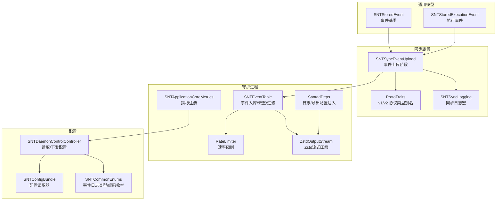
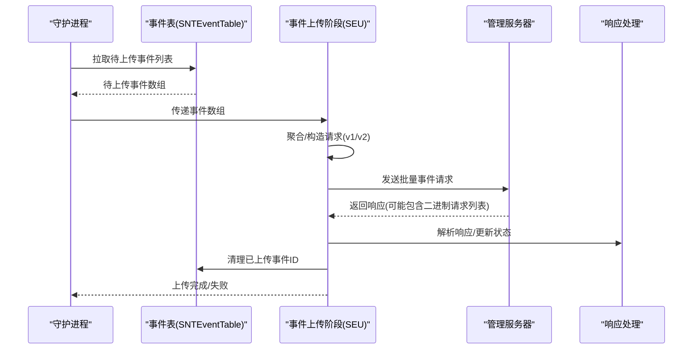
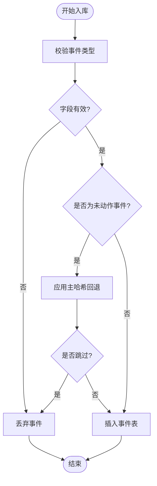
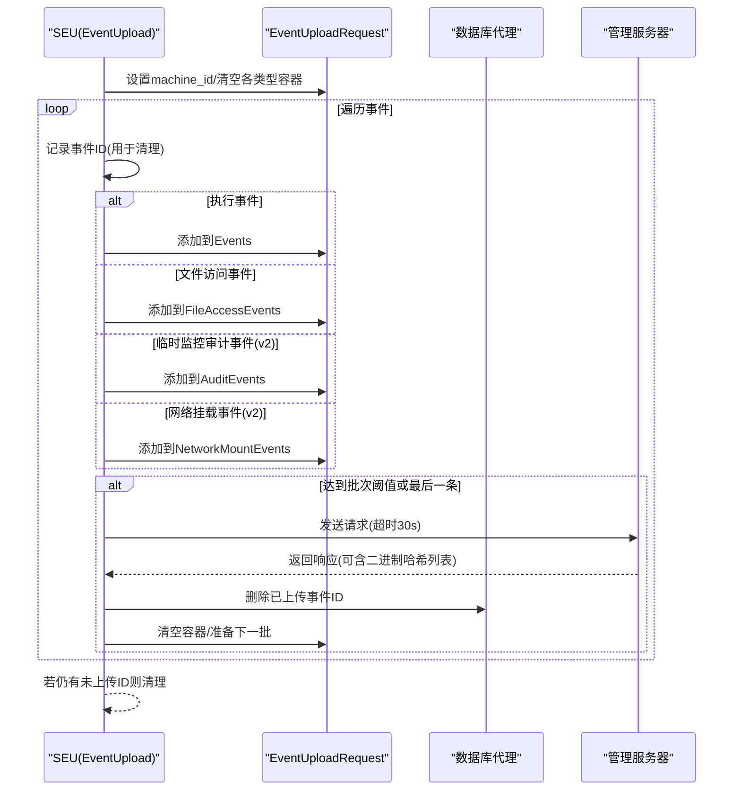
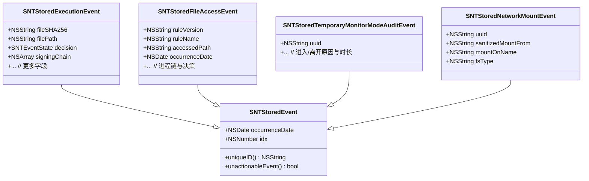
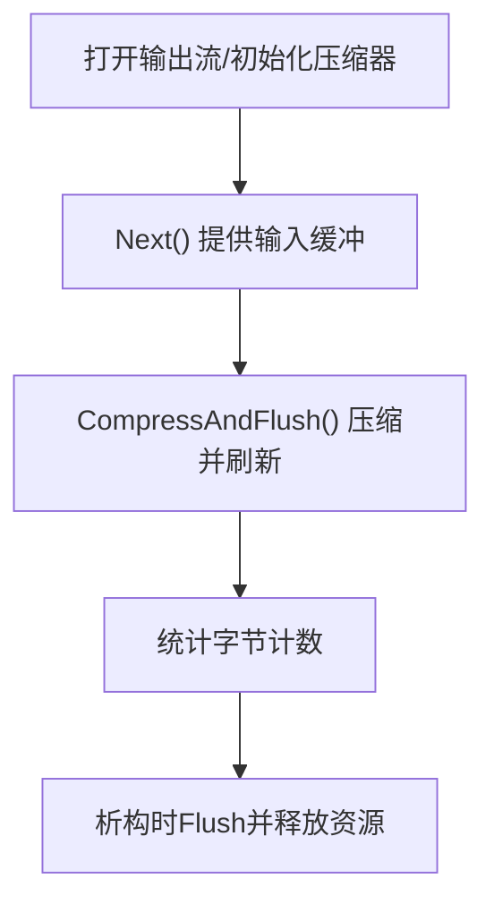
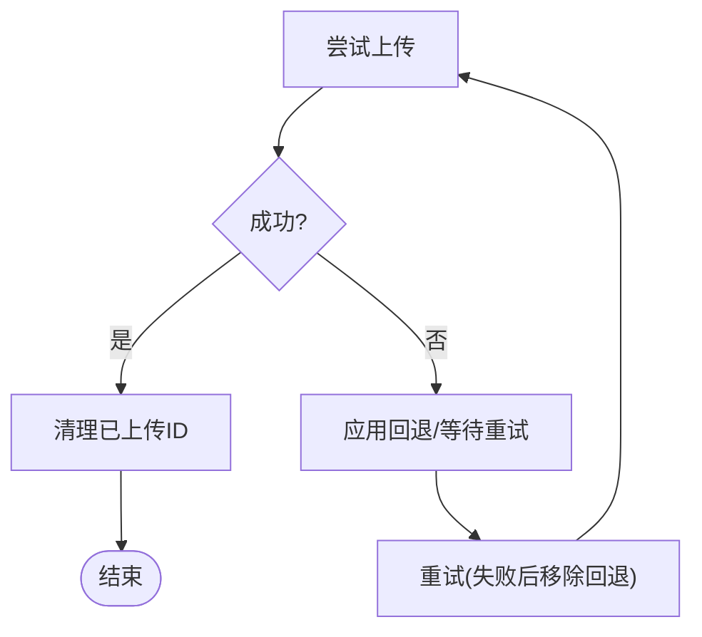
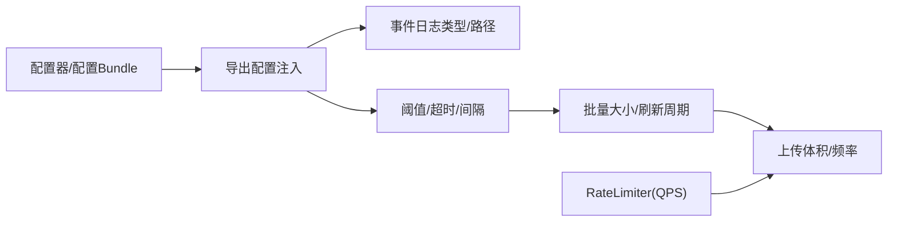
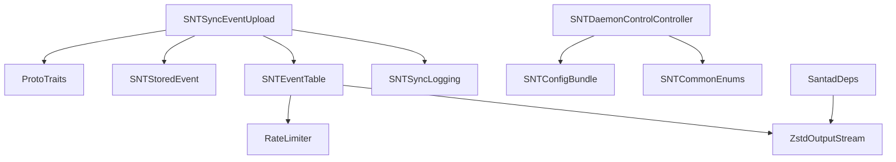

# 事件上传

<cite>
**本文引用的文件**
- [SNTSyncEventUpload.h](file://Source/santasyncservice/SNTSyncEventUpload.h)
- [SNTSyncEventUpload.mm](file://Source/santasyncservice/SNTSyncEventUpload.mm)
- [ProtoTraits.h](file://Source/santasyncservice/ProtoTraits.h)
- [SNTStoredEvent.h](file://Source/common/SNTStoredEvent.h)
- [SNTStoredEvent.mm](file://Source/common/SNTStoredEvent.mm)
- [SNTStoredExecutionEvent.h](file://Source/common/SNTStoredExecutionEvent.h)
- [SNTEventTable.mm](file://Source/santad/DataLayer/SNTEventTable.mm)
- [RateLimiter.h](file://Source/santad/EventProviders/RateLimiter.h)
- [RateLimiter.mm](file://Source/santad/EventProviders/RateLimiter.mm)
- [ZstdOutputStream.h](file://Source/santad/Logs/EndpointSecurity/Writers/FSSpool/ZstdOutputStream.h)
- [ZstdOutputStream.mm](file://Source/santad/Logs/EndpointSecurity/Writers/FSSpool/ZstdOutputStream.mm)
- [SNTSyncLogging.h](file://Source/santasyncservice/SNTSyncLogging.h)
- [SNTDaemonControlController.mm](file://Source/santad/SNTDaemonControlController.mm)
- [SNTConfigBundle.mm](file://Source/common/SNTConfigBundle.mm)
- [SNTCommonEnums.h](file://Source/common/SNTCommonEnums.h)
- [SantadDeps.mm](file://Source/santad/SantadDeps.mm)
- [SNTApplicationCoreMetrics.mm](file://Source/santad/SNTApplicationCoreMetrics.mm)
- [SNTSyncdQueueTest.mm](file://Source/santad/SNTSyncdQueueTest.mm)
</cite>

## 目录
1. [简介](#简介)
2. [项目结构](#项目结构)
3. [核心组件](#核心组件)
4. [架构总览](#架构总览)
5. [详细组件分析](#详细组件分析)
6. [依赖关系分析](#依赖关系分析)
7. [性能考量](#性能考量)
8. [故障排查指南](#故障排查指南)
9. [结论](#结论)
10. [附录](#附录)

## 简介
本技术文档围绕 Santa 的“事件上传”能力，系统化梳理从事件采集、聚合、序列化、批量上传、响应处理到数据库清理的完整流程；并深入说明事件数据格式（Protobuf v1/v2）、压缩与传输优化策略、批量上传机制、错误重试与回退逻辑、事件去重与过滤、优先级排序、配置项与性能调优、带宽控制、监控与质量保障、以及与不同管理服务器的数据对接与兼容性处理。

## 项目结构
事件上传相关代码主要分布在以下模块：
- 同步服务层：负责事件聚合、请求构造、网络上传与响应解析
- 通用模型层：事件对象定义与基础属性
- 守护进程数据层：事件入库、有效性校验、去重与过滤
- 压缩与写入：流式压缩输出（Zstandard）
- 配置与运行时：客户端模式、事件导出配置、速率限制、指标上报
- 日志与监控：同步阶段日志、错误记录与状态上报

**图表来源**
- [SNTSyncEventUpload.mm](file://Source/santasyncservice/SNTSyncEventUpload.mm#L456-L485)
- [ProtoTraits.h](file://Source/santasyncservice/ProtoTraits.h#L1-L224)
- [SNTStoredEvent.h](file://Source/common/SNTStoredEvent.h#L1-L35)
- [SNTStoredExecutionEvent.h](file://Source/common/SNTStoredExecutionEvent.h#L1-L142)
- [SNTEventTable.mm](file://Source/santad/DataLayer/SNTEventTable.mm#L105-L137)
- [RateLimiter.h](file://Source/santad/EventProviders/RateLimiter.h#L1-L76)
- [RateLimiter.mm](file://Source/santad/EventProviders/RateLimiter.mm#L1-L57)
- [ZstdOutputStream.h](file://Source/santad/Logs/EndpointSecurity/Writers/FSSpool/ZstdOutputStream.h#L1-L36)
- [ZstdOutputStream.mm](file://Source/santad/Logs/EndpointSecurity/Writers/FSSpool/ZstdOutputStream.mm#L1-L91)
- [SNTDaemonControlController.mm](file://Source/santad/SNTDaemonControlController.mm#L291-L421)
- [SNTConfigBundle.mm](file://Source/common/SNTConfigBundle.mm#L163-L228)
- [SNTCommonEnums.h](file://Source/common/SNTCommonEnums.h#L122-L167)
- [SantadDeps.mm](file://Source/santad/SantadDeps.mm#L138-L157)
- [SNTApplicationCoreMetrics.mm](file://Source/santad/SNTApplicationCoreMetrics.mm#L36-L80)

**章节来源**
- [SNTSyncEventUpload.h](file://Source/santasyncservice/SNTSyncEventUpload.h#L1-L26)
- [SNTSyncEventUpload.mm](file://Source/santasyncservice/SNTSyncEventUpload.mm#L456-L485)
- [ProtoTraits.h](file://Source/santasyncservice/ProtoTraits.h#L1-L224)

## 核心组件
- 事件上传阶段（SNTSyncEventUpload）：负责从数据库拉取待上传事件、按类型聚合、构造 Protobuf 请求、批量发送、解析响应并清理已上传事件。
- 事件模型（SNTStoredEvent 及派生类）：统一事件索引与唯一标识，支撑去重与过滤。
- 数据层（SNTEventTable）：事件入库、有效性校验、未动作事件去重与过滤。
- 协议适配（ProtoTraits）：根据版本选择 v1 或 v2 的消息类型与枚举别名。
- 压缩输出（ZstdOutputStream）：流式 Zstandard 压缩，支持缓冲区大小与压缩等级配置。
- 速率限制（RateLimiter）：基于窗口的 QPS 控制，防止事件洪峰。
- 配置与导出（SNTDaemonControlController、SNTConfigBundle、SantadDeps）：事件导出目标、日志类型、带宽阈值等。
- 日志与监控（SNTSyncLogging、SNTApplicationCoreMetrics）：同步阶段日志与运行态指标。

**章节来源**
- [SNTStoredEvent.h](file://Source/common/SNTStoredEvent.h#L1-L35)
- [SNTStoredEvent.mm](file://Source/common/SNTStoredEvent.mm#L1-L73)
- [SNTStoredExecutionEvent.h](file://Source/common/SNTStoredExecutionEvent.h#L1-L142)
- [SNTEventTable.mm](file://Source/santad/DataLayer/SNTEventTable.mm#L105-L137)
- [ProtoTraits.h](file://Source/santasyncservice/ProtoTraits.h#L1-L224)
- [ZstdOutputStream.h](file://Source/santad/Logs/EndpointSecurity/Writers/FSSpool/ZstdOutputStream.h#L1-L36)
- [ZstdOutputStream.mm](file://Source/santad/Logs/EndpointSecurity/Writers/FSSpool/ZstdOutputStream.mm#L1-L91)
- [RateLimiter.h](file://Source/santad/EventProviders/RateLimiter.h#L1-L76)
- [RateLimiter.mm](file://Source/santad/EventProviders/RateLimiter.mm#L1-L57)
- [SNTDaemonControlController.mm](file://Source/santad/SNTDaemonControlController.mm#L291-L421)
- [SNTConfigBundle.mm](file://Source/common/SNTConfigBundle.mm#L163-L228)
- [SantadDeps.mm](file://Source/santad/SantadDeps.mm#L138-L157)
- [SNTApplicationCoreMetrics.mm](file://Source/santad/SNTApplicationCoreMetrics.mm#L36-L80)

## 架构总览
事件上传的端到端流程如下：

**图表来源**
- [SNTSyncEventUpload.mm](file://Source/santasyncservice/SNTSyncEventUpload.mm#L465-L482)
- [SNTEventTable.mm](file://Source/santad/DataLayer/SNTEventTable.mm#L105-L137)

**章节来源**
- [SNTSyncEventUpload.mm](file://Source/santasyncservice/SNTSyncEventUpload.mm#L465-L482)
- [SNTEventTable.mm](file://Source/santad/DataLayer/SNTEventTable.mm#L105-L137)

## 详细组件分析

### 事件收集与入库（去重、过滤、回退）
- 入库有效性检查：对不同事件类型进行字段完整性校验，不满足条件的事件被丢弃。
- 未动作事件回退：对“无动作”事件采用主哈希回退策略，短时间内重复事件会被丢弃以降低冗余。
- 去重依据：事件基类使用内部索引作为相等性与哈希依据，确保集合去重有效。

**图表来源**
- [SNTEventTable.mm](file://Source/santad/DataLayer/SNTEventTable.mm#L105-L137)
- [SNTStoredEvent.mm](file://Source/common/SNTStoredEvent.mm#L1-L73)

**章节来源**
- [SNTEventTable.mm](file://Source/santad/DataLayer/SNTEventTable.mm#L105-L137)
- [SNTStoredEvent.h](file://Source/common/SNTStoredEvent.h#L1-L35)
- [SNTStoredEvent.mm](file://Source/common/SNTStoredEvent.mm#L1-L73)

### 事件聚合与上传（批量、协议、响应）
- 批量聚合：按事件总数达到批次阈值或遍历到最后一个事件时触发一次请求发送。
- 协议版本：通过模板参数在编译期选择 v1 或 v2 的消息类型与枚举别名。
- 事件类型映射：执行事件、文件访问事件、临时监控审计事件、网络挂载事件分别映射到对应 Protobuf 字段。
- 响应处理：若响应包含需要补充上传的二进制哈希列表，则更新同步状态以便后续处理。
- 数据清理：成功发送后，通过远程代理调用数据库接口删除已上传事件 ID。

**图表来源**
- [SNTSyncEventUpload.mm](file://Source/santasyncservice/SNTSyncEventUpload.mm#L91-L177)
- [ProtoTraits.h](file://Source/santasyncservice/ProtoTraits.h#L1-L224)

**章节来源**
- [SNTSyncEventUpload.mm](file://Source/santasyncservice/SNTSyncEventUpload.mm#L91-L177)
- [ProtoTraits.h](file://Source/santasyncservice/ProtoTraits.h#L1-L224)

### 事件数据格式与序列化
- 协议版本：v1 与 v2 使用不同的消息类型与枚举别名，通过 ProtoTraits 统一桥接。
- 执行事件字段：包含文件哈希、路径、用户、时间、决策、签名链、权限信息、捆绑包元数据等。
- 文件访问事件字段：规则版本/名称、目标路径、访问时间、决策、进程链（含文件路径、签名链等）。
- 临时监控审计事件：进入/离开会话的原因与时长等。
- 网络挂载事件：UUID、来源、挂载点、文件系统类型等。

**图表来源**
- [SNTStoredEvent.h](file://Source/common/SNTStoredEvent.h#L1-L35)
- [SNTStoredExecutionEvent.h](file://Source/common/SNTStoredExecutionEvent.h#L1-L142)
- [SNTSyncEventUpload.mm](file://Source/santasyncservice/SNTSyncEventUpload.mm#L180-L382)

**章节来源**
- [SNTStoredEvent.h](file://Source/common/SNTStoredEvent.h#L1-L35)
- [SNTStoredExecutionEvent.h](file://Source/common/SNTStoredExecutionEvent.h#L1-L142)
- [SNTSyncEventUpload.mm](file://Source/santasyncservice/SNTSyncEventUpload.mm#L180-L382)

### 压缩算法与传输优化
- 流式压缩：ZstdOutputStream 提供零拷贝流式压缩，支持自定义缓冲区大小与压缩等级。
- 缓冲与刷新：Next/BackUp 接口配合输入缓冲与压缩输出，ByteCount 统计字节数。
- 与导出配置结合：守护进程启动时根据配置设置导出目标、日志类型、阈值与超时，从而影响事件落盘与上传的体积与频率。

**图表来源**
- [ZstdOutputStream.h](file://Source/santad/Logs/EndpointSecurity/Writers/FSSpool/ZstdOutputStream.h#L1-L36)
- [ZstdOutputStream.mm](file://Source/santad/Logs/EndpointSecurity/Writers/FSSpool/ZstdOutputStream.mm#L1-L91)
- [SantadDeps.mm](file://Source/santad/SantadDeps.mm#L138-L157)

**章节来源**
- [ZstdOutputStream.mm](file://Source/santad/Logs/EndpointSecurity/Writers/FSSpool/ZstdOutputStream.mm#L1-L91)
- [SantadDeps.mm](file://Source/santad/SantadDeps.mm#L138-L157)

### 断点续传与错误重试
- 回退策略：对未动作事件采用主哈希回退，避免短期内重复上传造成拥塞。
- 失败移除回退：单元测试验证首次上传失败后会移除回退，允许后续重试。
- 重试与超时：上传请求设置固定超时时间；若失败返回 NO，上层可据此决定重试策略。
- 增量清理：每次批量发送后仅清理本次已上传事件 ID，避免重复删除或遗漏。

**图表来源**
- [SNTEventTable.mm](file://Source/santad/DataLayer/SNTEventTable.mm#L105-L137)
- [SNTSyncdQueueTest.mm](file://Source/santad/SNTSyncdQueueTest.mm#L112-L143)
- [SNTSyncEventUpload.mm](file://Source/santasyncservice/SNTSyncEventUpload.mm#L60-L89)

**章节来源**
- [SNTEventTable.mm](file://Source/santad/DataLayer/SNTEventTable.mm#L105-L137)
- [SNTSyncdQueueTest.mm](file://Source/santad/SNTSyncdQueueTest.mm#L112-L143)
- [SNTSyncEventUpload.mm](file://Source/santasyncservice/SNTSyncEventUpload.mm#L60-L89)

### 事件去重、过滤与优先级排序
- 去重：事件基类以 idx 作为唯一标识，集合去重有效。
- 过滤：无效事件直接丢弃；未动作事件按主哈希回退策略过滤。
- 优先级：当前实现未见显式优先级排序逻辑，建议在业务侧通过事件类型权重或时间戳进行队列化处理（扩展建议）。

**章节来源**
- [SNTStoredEvent.mm](file://Source/common/SNTStoredEvent.mm#L1-L73)
- [SNTEventTable.mm](file://Source/santad/DataLayer/SNTEventTable.mm#L105-L137)

### 事件上传配置、性能调优与带宽控制
- 导出配置：通过配置器注入导出目标 URL、表单字段、事件日志类型等。
- 事件日志类型：支持 syslog、file、protobuf、protobuf stream、protobuf stream gzip、protobuf stream zstd 等。
- 带宽与阈值：守护进程依赖配置中的目录大小/文件大小阈值、刷新超时、导出间隔、批大小等参数，间接影响上传体积与频率。
- 速率限制：RateLimiter 提供基于窗口的 QPS 控制，可抑制事件洪峰。

**图表来源**
- [SNTDaemonControlController.mm](file://Source/santad/SNTDaemonControlController.mm#L291-L421)
- [SNTConfigBundle.mm](file://Source/common/SNTConfigBundle.mm#L163-L228)
- [SantadDeps.mm](file://Source/santad/SantadDeps.mm#L138-L157)
- [SNTCommonEnums.h](file://Source/common/SNTCommonEnums.h#L122-L167)
- [RateLimiter.h](file://Source/santad/EventProviders/RateLimiter.h#L1-L76)
- [RateLimiter.mm](file://Source/santad/EventProviders/RateLimiter.mm#L1-L57)

**章节来源**
- [SNTDaemonControlController.mm](file://Source/santad/SNTDaemonControlController.mm#L291-L421)
- [SNTConfigBundle.mm](file://Source/common/SNTConfigBundle.mm#L163-L228)
- [SantadDeps.mm](file://Source/santad/SantadDeps.mm#L138-L157)
- [SNTCommonEnums.h](file://Source/common/SNTCommonEnums.h#L122-L167)
- [RateLimiter.h](file://Source/santad/EventProviders/RateLimiter.h#L1-L76)
- [RateLimiter.mm](file://Source/santad/EventProviders/RateLimiter.mm#L1-L57)

### 事件上传监控、质量保证与故障恢复
- 同步日志：SNTSyncLogging 提供统一的日志宏，既写标准流水线也转发给同步监听器。
- 指标上报：SNTApplicationCoreMetrics 注册运行态指标（如日志类型），便于质量监控。
- 故障恢复：上传失败时记录错误日志；回退策略与重试机制共同保障最终一致性。

**章节来源**
- [SNTSyncLogging.h](file://Source/santasyncservice/SNTSyncLogging.h#L1-L49)
- [SNTApplicationCoreMetrics.mm](file://Source/santad/SNTApplicationCoreMetrics.mm#L36-L80)
- [SNTSyncEventUpload.mm](file://Source/santasyncservice/SNTSyncEventUpload.mm#L60-L89)

### 与不同管理服务器的数据对接与格式兼容性
- 协议版本切换：通过 ProtoTraits 在编译期选择 v1/v2 类型，保证与不同版本管理服务器的兼容。
- 决策与枚举映射：将本地决策与签名状态映射到对应协议枚举，确保语义一致。
- 响应扩展：v2 中新增网络挂载事件与审计事件，便于更丰富的场景上报。

**章节来源**
- [ProtoTraits.h](file://Source/santasyncservice/ProtoTraits.h#L1-L224)
- [SNTSyncEventUpload.mm](file://Source/santasyncservice/SNTSyncEventUpload.mm#L180-L382)

## 依赖关系分析
- 组件耦合
  - SNTSyncEventUpload 依赖 ProtoTraits 与事件模型，向上游提供上传接口，向下游驱动数据库清理。
  - SNTEventTable 与 RateLimiter 共同承担“入库/去重/限速”的职责，减少上传压力。
  - ZstdOutputStream 与导出配置协同，控制事件落盘与传输体积。
- 外部依赖
  - Protobuf 运行时与 Arena 分配器用于高效序列化。
  - OS 日志与指标系统用于可观测性。

**图表来源**
- [SNTSyncEventUpload.mm](file://Source/santasyncservice/SNTSyncEventUpload.mm#L456-L485)
- [ProtoTraits.h](file://Source/santasyncservice/ProtoTraits.h#L1-L224)
- [SNTEventTable.mm](file://Source/santad/DataLayer/SNTEventTable.mm#L105-L137)
- [RateLimiter.h](file://Source/santad/EventProviders/RateLimiter.h#L1-L76)
- [ZstdOutputStream.h](file://Source/santad/Logs/EndpointSecurity/Writers/FSSpool/ZstdOutputStream.h#L1-L36)
- [SNTDaemonControlController.mm](file://Source/santad/SNTDaemonControlController.mm#L291-L421)
- [SNTConfigBundle.mm](file://Source/common/SNTConfigBundle.mm#L163-L228)
- [SNTCommonEnums.h](file://Source/common/SNTCommonEnums.h#L122-L167)
- [SantadDeps.mm](file://Source/santad/SantadDeps.mm#L138-L157)

**章节来源**
- [SNTSyncEventUpload.mm](file://Source/santasyncservice/SNTSyncEventUpload.mm#L456-L485)
- [SNTEventTable.mm](file://Source/santad/DataLayer/SNTEventTable.mm#L105-L137)
- [RateLimiter.h](file://Source/santad/EventProviders/RateLimiter.h#L1-L76)
- [ZstdOutputStream.h](file://Source/santad/Logs/EndpointSecurity/Writers/FSSpool/ZstdOutputStream.h#L1-L36)
- [SNTDaemonControlController.mm](file://Source/santad/SNTDaemonControlController.mm#L291-L421)
- [SNTConfigBundle.mm](file://Source/common/SNTConfigBundle.mm#L163-L228)
- [SNTCommonEnums.h](file://Source/common/SNTCommonEnums.h#L122-L167)
- [SantadDeps.mm](file://Source/santad/SantadDeps.mm#L138-L157)

## 性能考量
- 批量阈值：根据事件数量与最终索引判断是否发送，避免频繁小包。
- 流式压缩：ZstdOutputStream 支持大缓冲与可调压缩等级，平衡 CPU 与带宽。
- 速率限制：RateLimiter 通过窗口与 QPS 控制，防止突发流量冲击服务器。
- 导出阈值：目录/文件大小阈值与刷新超时，控制事件落盘与上传节奏。
- 日志类型：选择合适的日志类型（如 stream zstd）可显著降低传输体积。

[本节为通用性能讨论，无需列出具体文件来源]

## 故障排查指南
- 上传失败
  - 检查同步日志与错误信息，确认超时与网络问题。
  - 观察回退是否生效，必要时等待回退解除后重试。
- 事件未上传
  - 确认事件有效性与未动作事件过滤策略。
  - 检查数据库清理是否成功（已上传 ID 是否被删除）。
- 传输体积过大
  - 调整日志类型与压缩等级，启用流式压缩。
  - 降低批量阈值或增加刷新超时，平滑流量峰值。
- 速率过高导致丢弃
  - 调整 RateLimiter 的 QPS 与窗口大小，或在配置中降低导出频率。

**章节来源**
- [SNTSyncLogging.h](file://Source/santasyncservice/SNTSyncLogging.h#L1-L49)
- [SNTSyncdQueueTest.mm](file://Source/santad/SNTSyncdQueueTest.mm#L112-L143)
- [SNTEventTable.mm](file://Source/santad/DataLayer/SNTEventTable.mm#L105-L137)
- [RateLimiter.h](file://Source/santad/EventProviders/RateLimiter.h#L1-L76)
- [RateLimiter.mm](file://Source/santad/EventProviders/RateLimiter.mm#L1-L57)

## 结论
Santa 的事件上传体系以“模型统一、协议适配、批量聚合、流式压缩、回退与限速”为核心设计，兼顾了传输效率与系统稳定性。通过配置与指标体系，可在不同环境与负载下灵活调优，并与多版本管理服务器保持良好兼容。

## 附录
- 关键配置项参考
  - 事件导出目标与表单字段：由配置器注入，守护进程启动时读取。
  - 事件日志类型：syslog、file、protobuf、protobuf stream、protobuf stream gzip、protobuf stream zstd。
  - 导出阈值与超时：目录大小/文件大小阈值、刷新超时、导出间隔、批大小。
  - 速率限制：QPS 与窗口大小。
- 版本兼容
  - v1/v2 协议通过 ProtoTraits 映射，确保字段与枚举的向后兼容。

**章节来源**
- [SNTDaemonControlController.mm](file://Source/santad/SNTDaemonControlController.mm#L291-L421)
- [SNTConfigBundle.mm](file://Source/common/SNTConfigBundle.mm#L163-L228)
- [SNTCommonEnums.h](file://Source/common/SNTCommonEnums.h#L122-L167)
- [ProtoTraits.h](file://Source/santasyncservice/ProtoTraits.h#L1-L224)