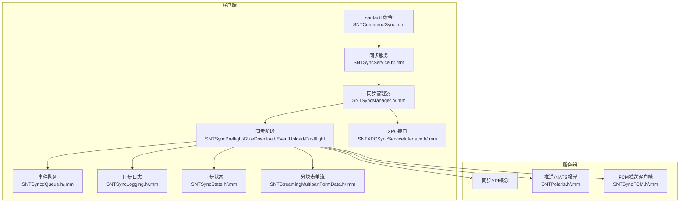
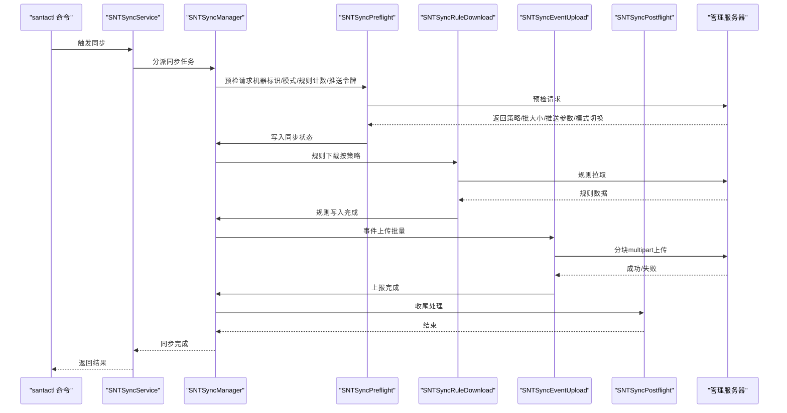
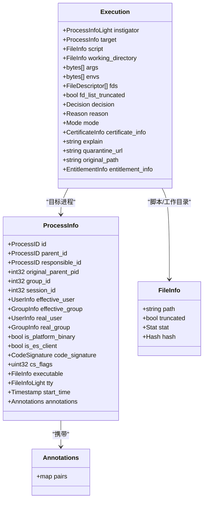
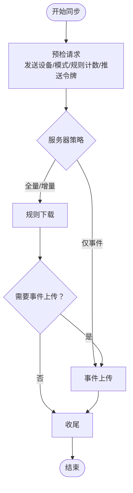
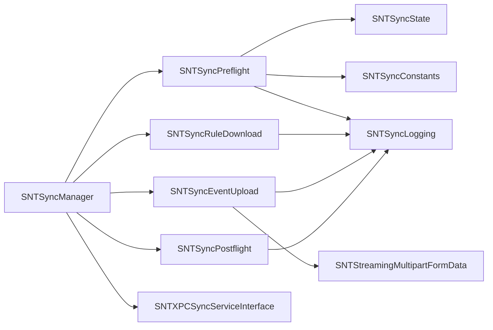

# 同步协议设计

<cite>
**本文引用的文件**
- [santa.proto](file://Source/common/santa.proto)
- [process_tree.proto](file://Source/santad/ProcessTree/process_tree.proto)
- [SNTSyncConstants.h](file://Source/common/SNTSyncConstants.h)
- [SNTSyncManager.h](file://Source/santasyncservice/SNTSyncManager.h)
- [SNTSyncManager.mm](file://Source/santasyncservice/SNTSyncManager.mm)
- [SNTSyncService.h](file://Source/santasyncservice/SNTSyncService.h)
- [SNTSyncPreflight.h](file://Source/santasyncservice/SNTSyncPreflight.h)
- [SNTSyncPreflight.mm](file://Source/santasyncservice/SNTSyncPreflight.mm)
- [SNTSyncRuleDownload.h](file://Source/santasyncservice/SNTSyncRuleDownload.h)
- [SNTSyncEventUpload.h](file://Source/santasyncservice/SNTSyncEventUpload.h)
- [SNTSyncPostflight.h](file://Source/santasyncservice/SNTSyncPostflight.h)
- [ProtoTraits.h](file://Source/santasyncservice/ProtoTraits.h)
- [SNTSyncLogging.h](file://Source/santasyncservice/SNTSyncLogging.h)
- [SNTSyncLogging.mm](file://Source/santasyncservice/SNTSyncLogging.mm)
- [SNTSyncState.h](file://Source/santasyncservice/SNTSyncState.h)
- [SNTSyncState.mm](file://Source/santasyncservice/SNTSyncState.mm)
- [SNTStreamingMultipartFormData.h](file://Source/santasyncservice/SNTStreamingMultipartFormData.h)
- [SNTStreamingMultipartFormData.mm](file://Source/santasyncservice/SNTStreamingMultipartFormData.mm)
- [SNTSyncBroadcaster.h](file://Source/santasyncservice/SNTSyncBroadcaster.h)
- [SNTSyncBroadcaster.mm](file://Source/santasyncservice/SNTSyncBroadcaster.mm)
- [SNTSyncFCM.h](file://Source/santasyncservice/SNTSyncFCM.h)
- [SNTSyncFCM.mm](file://Source/santasyncservice/SNTSyncFCM.mm)
- [SNTPolaris.h](file://Source/santasyncservice/SNTPolaris.h)
- [SNTPolaris.mm](file://Source/santasyncservice/SNTPolaris.mm)
- [SNTSyncConfigBundle.h](file://Source/santasyncservice/SNTSyncConfigBundle.h)
- [SNTSyncConfigBundle.mm](file://Source/santasyncservice/SNTSyncConfigBundle.mm)
- [SNTSyncStage.h](file://Source/santasyncservice/SNTSyncStage.h)
- [SNTXPCSyncServiceInterface.h](file://Source/common/SNTXPCSyncServiceInterface.h)
- [SNTXPCSyncServiceInterface.mm](file://Source/common/SNTXPCSyncServiceInterface.mm)
- [SNTCommandSync.mm](file://Source/santactl/Commands/SNTCommandSync.mm)
- [SNTSyncdQueue.h](file://Source/santad/SNTSyncdQueue.h)
- [SNTSyncdQueue.mm](file://Source/santad/SNTSyncdQueue.mm)
</cite>

## 目录
1. [引言](#引言)
2. [项目结构](#项目结构)
3. [核心组件](#核心组件)
4. [架构总览](#架构总览)
5. [详细组件分析](#详细组件分析)
6. [依赖关系分析](#依赖关系分析)
7. [性能考量](#性能考量)
8. [故障排查指南](#故障排查指南)
9. [结论](#结论)
10. [附录](#附录)

## 引言
本文件面向Santa同步协议的设计与实现，系统化阐述客户端与管理服务器之间的协议架构、消息格式与序列化机制，REST风格的同步流程与阶段划分，Protocol Buffers在同步中的应用及版本兼容策略，认证与加密传输、数据完整性保障，以及协议扩展点、向后兼容性与性能优化建议。同时提供调试工具、监控指标与故障诊断方法，帮助开发者与运维人员快速理解并维护该同步体系。

## 项目结构
围绕同步协议的关键代码分布在以下模块：
- 协议与消息模型：Source/common/santa.proto 定义了事件与规则等消息体；process_tree.proto 提供进程树注解。
- 同步服务与阶段：SNTSync* 组件构成同步流水线（预检、规则下载、事件上传、收尾）。
- 常量与配置键：SNTSyncConstants.h 定义HTTP头、查询参数、JSON键名等。
- XPC接口与控制：SNTXPCSyncServiceInterface.* 暴露同步服务XPC契约；SNTSyncManager.* 调度与执行同步。
- 工具与日志：SNTSyncLogging.*、SNTStreamingMultipartFormData.*、SNTSyncState.* 等支撑传输、状态与日志。
- 客户端入口：santactl 的 SNTCommandSync.mm 触发同步命令。
- 守护进程队列：santad 的 SNTSyncdQueue.* 将事件入队，供同步上传使用。

图表来源
- [SNTCommandSync.mm](file://Source/santactl/Commands/SNTCommandSync.mm)
- [SNTSyncService.h](file://Source/santasyncservice/SNTSyncService.h)
- [SNTSyncManager.h](file://Source/santasyncservice/SNTSyncManager.h)
- [SNTSyncManager.mm](file://Source/santasyncservice/SNTSyncManager.mm)
- [SNTSyncPreflight.h](file://Source/santasyncservice/SNTSyncPreflight.h)
- [SNTSyncRuleDownload.h](file://Source/santasyncservice/SNTSyncRuleDownload.h)
- [SNTSyncEventUpload.h](file://Source/santasyncservice/SNTSyncEventUpload.h)
- [SNTSyncPostflight.h](file://Source/santasyncservice/SNTSyncPostflight.h)
- [SNTXPCSyncServiceInterface.h](file://Source/common/SNTXPCSyncServiceInterface.h)
- [SNTXPCSyncServiceInterface.mm](file://Source/common/SNTXPCSyncServiceInterface.mm)
- [SNTSyncdQueue.h](file://Source/santad/SNTSyncdQueue.h)
- [SNTSyncdQueue.mm](file://Source/santad/SNTSyncdQueue.mm)
- [SNTSyncLogging.h](file://Source/santasyncservice/SNTSyncLogging.h)
- [SNTSyncLogging.mm](file://Source/santasyncservice/SNTSyncLogging.mm)
- [SNTSyncState.h](file://Source/santasyncservice/SNTSyncState.h)
- [SNTSyncState.mm](file://Source/santasyncservice/SNTSyncState.mm)
- [SNTStreamingMultipartFormData.h](file://Source/santasyncservice/SNTStreamingMultipartFormData.h)
- [SNTStreamingMultipartFormData.mm](file://Source/santasyncservice/SNTStreamingMultipartFormData.mm)
- [SNTPolaris.h](file://Source/santasyncservice/SNTPolaris.h)
- [SNTPolaris.mm](file://Source/santasyncservice/SNTPolaris.mm)
- [SNTSyncFCM.h](file://Source/santasyncservice/SNTSyncFCM.h)
- [SNTSyncFCM.mm](file://Source/santasyncservice/SNTSyncFCM.mm)

章节来源
- [SNTCommandSync.mm](file://Source/santactl/Commands/SNTCommandSync.mm)
- [SNTSyncService.h](file://Source/santasyncservice/SNTSyncService.h)
- [SNTSyncManager.h](file://Source/santasyncservice/SNTSyncManager.h)
- [SNTSyncManager.mm](file://Source/santasyncservice/SNTSyncManager.mm)
- [SNTSyncPreflight.h](file://Source/santasyncservice/SNTSyncPreflight.h)
- [SNTSyncPreflight.mm](file://Source/santasyncservice/SNTSyncPreflight.mm)
- [SNTSyncRuleDownload.h](file://Source/santasyncservice/SNTSyncRuleDownload.h)
- [SNTSyncEventUpload.h](file://Source/santasyncservice/SNTSyncEventUpload.h)
- [SNTSyncPostflight.h](file://Source/santasyncservice/SNTSyncPostflight.h)
- [SNTXPCSyncServiceInterface.h](file://Source/common/SNTXPCSyncServiceInterface.h)
- [SNTXPCSyncServiceInterface.mm](file://Source/common/SNTXPCSyncServiceInterface.mm)
- [SNTSyncdQueue.h](file://Source/santad/SNTSyncdQueue.h)
- [SNTSyncdQueue.mm](file://Source/santad/SNTSyncdQueue.mm)
- [SNTSyncLogging.h](file://Source/santasyncservice/SNTSyncLogging.h)
- [SNTSyncLogging.mm](file://Source/santasyncservice/SNTSyncLogging.mm)
- [SNTSyncState.h](file://Source/santasyncservice/SNTSyncState.h)
- [SNTSyncState.mm](file://Source/santasyncservice/SNTSyncState.mm)
- [SNTStreamingMultipartFormData.h](file://Source/santasyncservice/SNTStreamingMultipartFormData.h)
- [SNTStreamingMultipartFormData.mm](file://Source/santasyncservice/SNTStreamingMultipartFormData.mm)
- [SNTPolaris.h](file://Source/santasyncservice/SNTPolaris.h)
- [SNTPolaris.mm](file://Source/santasyncservice/SNTPolaris.mm)
- [SNTSyncFCM.h](file://Source/santasyncservice/SNTSyncFCM.h)
- [SNTSyncFCM.mm](file://Source/santasyncservice/SNTSyncFCM.mm)

## 核心组件
- 协议消息模型：基于 Protocol Buffers 的消息定义，涵盖执行、文件访问、登录会话、磁盘挂载、打包信息等事件类型，以及规则、签名链、权限等元数据。
- 同步阶段：预检（获取服务器配置与推送参数）、规则下载（按需或全量拉取）、事件上传（批量上报）、收尾（完成态处理）。
- 配置与常量：统一的HTTP头、查询参数、JSON键名与默认值，确保客户端与服务器一致。
- 传输与状态：支持分块multipart表单流式上传；通过状态对象记录批大小、模式、正则、USB/网络挂载策略等。
- 推送与广播：支持FCM/NATS推送通道，接收全量/全局规则同步指令与模式切换通知。

章节来源
- [santa.proto](file://Source/common/santa.proto)
- [process_tree.proto](file://Source/santad/ProcessTree/process_tree.proto)
- [SNTSyncConstants.h](file://Source/common/SNTSyncConstants.h)
- [SNTSyncPreflight.mm](file://Source/santasyncservice/SNTSyncPreflight.mm)
- [SNTSyncRuleDownload.h](file://Source/santasyncservice/SNTSyncRuleDownload.h)
- [SNTSyncEventUpload.h](file://Source/santasyncservice/SNTSyncEventUpload.h)
- [SNTSyncPostflight.h](file://Source/santasyncservice/SNTSyncPostflight.h)
- [SNTStreamingMultipartFormData.h](file://Source/santasyncservice/SNTStreamingMultipartFormData.h)
- [SNTStreamingMultipartFormData.mm](file://Source/santasyncservice/SNTStreamingMultipartFormData.mm)
- [SNTSyncState.h](file://Source/santasyncservice/SNTSyncState.h)
- [SNTSyncState.mm](file://Source/santasyncservice/SNTSyncState.mm)
- [SNTSyncFCM.h](file://Source/santasyncservice/SNTSyncFCM.h)
- [SNTSyncFCM.mm](file://Source/santasyncservice/SNTSyncFCM.mm)
- [SNTPolaris.h](file://Source/santasyncservice/SNTPolaris.h)
- [SNTPolaris.mm](file://Source/santasyncservice/SNTPolaris.mm)

## 架构总览
同步协议采用“阶段化流水线”架构，客户端通过SNTSyncManager调度各阶段，借助SNTSyncPreflight获取服务器策略与推送参数，再根据策略决定是否进行规则全量/增量同步与事件批量上报。事件由守护进程收集并通过SNTSyncdQueue入队，最终由SNTSyncEventUpload以分块multipart方式上传。

图表来源
- [SNTCommandSync.mm](file://Source/santactl/Commands/SNTCommandSync.mm)
- [SNTSyncService.h](file://Source/santasyncservice/SNTSyncService.h)
- [SNTSyncManager.h](file://Source/santasyncservice/SNTSyncManager.h)
- [SNTSyncManager.mm](file://Source/santasyncservice/SNTSyncManager.mm)
- [SNTSyncPreflight.h](file://Source/santasyncservice/SNTSyncPreflight.h)
- [SNTSyncPreflight.mm](file://Source/santasyncservice/SNTSyncPreflight.mm)
- [SNTSyncRuleDownload.h](file://Source/santasyncservice/SNTSyncRuleDownload.h)
- [SNTSyncEventUpload.h](file://Source/santasyncservice/SNTSyncEventUpload.h)
- [SNTSyncPostflight.h](file://Source/santasyncservice/SNTSyncPostflight.h)

## 详细组件分析

### 协议消息模型与序列化
- 消息定义：santa.proto 定义了执行、文件访问、登录会话、磁盘挂载、打包、转交白名单等事件消息，以及FileInfo/ProcessInfo/CertificateInfo等实体与枚举。
- 进程树注解：process_tree.proto 提供Annotations，用于在Execution等事件中携带进程树上下文。
- 序列化：客户端与服务器均使用Protocol Buffers进行二进制序列化，字段有序、向后兼容，支持新增可选字段不破坏旧解析。
- 版本策略：通过命名空间与版本目录（如syncv2）区分协议版本，保持兼容的同时允许新字段与行为演进。

图表来源
- [santa.proto](file://Source/common/santa.proto)
- [process_tree.proto](file://Source/santad/ProcessTree/process_tree.proto)

章节来源
- [santa.proto](file://Source/common/santa.proto)
- [process_tree.proto](file://Source/santad/ProcessTree/process_tree.proto)

### 同步阶段与HTTP API设计
- 阶段划分：预检（Preflight）、规则下载（RuleDownload）、事件上传（EventUpload）、收尾（Postflight）。
- 预检（Preflight）：客户端发送机器标识、主机名、OS版本、SIP状态、当前模式、规则计数、推送令牌等；服务器返回批大小、全量同步间隔、事件详情链接、模式切换、USB/网络挂载策略、推送服务器与鉴权参数等。
- 规则下载：依据预检结果与本地规则哈希，按需拉取增量或全量规则。
- 事件上传：将本地事件批次以分块multipart表单上传，支持断点续传与重试。
- 收尾：清理临时状态、更新游标、记录统计。

图表来源
- [SNTSyncPreflight.mm](file://Source/santasyncservice/SNTSyncPreflight.mm)
- [SNTSyncRuleDownload.h](file://Source/santasyncservice/SNTSyncRuleDownload.h)
- [SNTSyncEventUpload.h](file://Source/santasyncservice/SNTSyncEventUpload.h)
- [SNTSyncPostflight.h](file://Source/santasyncservice/SNTSyncPostflight.h)

章节来源
- [SNTSyncPreflight.mm](file://Source/santasyncservice/SNTSyncPreflight.mm)
- [SNTSyncRuleDownload.h](file://Source/santasyncservice/SNTSyncRuleDownload.h)
- [SNTSyncEventUpload.h](file://Source/santasyncservice/SNTSyncEventUpload.h)
- [SNTSyncPostflight.h](file://Source/santasyncservice/SNTSyncPostflight.h)

### HTTP API与REST风格端点
- 端点组织：预检端点路径包含机器ID，遵循REST资源命名风格。
- 请求头与参数：使用统一的常量键（如XSRF、序列号、主机名、OS版本、规则计数、批大小、上传URL、客户端模式、USB挂载策略等），便于跨语言与跨平台一致性。
- 响应模式：预检返回策略与配置；规则下载返回规则集合；事件上传返回成功/失败与重试建议；收尾返回完成状态。
- 批量与分块：事件上传采用分块multipart表单，提升大包传输稳定性与可控性。

章节来源
- [SNTSyncConstants.h](file://Source/common/SNTSyncConstants.h)
- [SNTSyncPreflight.mm](file://Source/santasyncservice/SNTSyncPreflight.mm)
- [SNTStreamingMultipartFormData.h](file://Source/santasyncservice/SNTStreamingMultipartFormData.h)
- [SNTStreamingMultipartFormData.mm](file://Source/santasyncservice/SNTStreamingMultipartFormData.mm)

### Protocol Buffers在同步中的应用与版本兼容
- 消息定义：santa.proto与process_tree.proto作为核心消息契约，字段有序、可扩展。
- 版本策略：通过命名空间与版本目录（如syncv2）隔离协议版本；预检阶段根据服务器能力选择v1/v2路径。
- 兼容性：新增字段标记为optional，避免破坏旧解析；服务器可返回兼容字段或新字段，客户端按存在性判断。
- 编解码：客户端与服务器均使用PB编解码，减少序列化开销与跨平台差异。

章节来源
- [santa.proto](file://Source/common/santa.proto)
- [process_tree.proto](file://Source/santad/ProcessTree/process_tree.proto)
- [SNTSyncPreflight.mm](file://Source/santasyncservice/SNTSyncPreflight.mm)
- [ProtoTraits.h](file://Source/santasyncservice/ProtoTraits.h)

### 认证机制、加密传输与数据完整性
- 推送鉴权：预检返回推送服务器地址、NKey、JWT、HMAC Key等，用于后续安全通信。
- 加密传输：建议通过HTTPS/TLS保护同步通道；推送通道亦应启用端到端加密。
- 数据完整性：PB二进制格式具备紧凑性与强类型校验；结合服务器端签名与校验可进一步保证完整性。
- 会话与令牌：推送令牌与XSRF Token等头字段用于防重放与会话关联。

章节来源
- [SNTSyncPreflight.mm](file://Source/santasyncservice/SNTSyncPreflight.mm)
- [SNTSyncConstants.h](file://Source/common/SNTSyncConstants.h)

### 协议扩展点与向后兼容
- 扩展点：预检阶段可返回新字段（如网络挂载白名单、模式切换、导出配置等），客户端按存在性处理。
- 兼容策略：保留已弃用字段一段时间；在预检阶段同时设置新旧键，确保老服务器与新客户端共存。
- 版本演进：通过版本目录与命名空间区分v1/v2，逐步迁移；客户端在预检后选择对应实现。

章节来源
- [SNTSyncPreflight.mm](file://Source/santasyncservice/SNTSyncPreflight.mm)
- [SNTSyncConstants.h](file://Source/common/SNTSyncConstants.h)

### 性能优化方案
- 批量与分块：事件按批大小上传，分块multipart降低单次请求体积与超时风险。
- 事件裁剪：提供轻量消息变体（如ProcessInfoLight、FileInfoLight）以减少带宽占用。
- 重试与退避：根据服务器返回的全量同步间隔与全局规则同步截止时间动态调整重试节奏。
- 事件过滤：通过允许/阻止路径正则与未知事件开关减少无关事件上报。

章节来源
- [SNTSyncEventUpload.h](file://Source/santasyncservice/SNTSyncEventUpload.h)
- [SNTStreamingMultipartFormData.h](file://Source/santasyncservice/SNTStreamingMultipartFormData.h)
- [SNTSyncPreflight.mm](file://Source/santasyncservice/SNTSyncPreflight.mm)
- [SNTSyncConstants.h](file://Source/common/SNTSyncConstants.h)

## 依赖关系分析
- 组件耦合：SNTSyncManager依赖SNTSyncStage系列组件；SNTSyncPreflight依赖SNTSyncState与SNTSyncConstants；SNTSyncEventUpload依赖SNTStreamingMultipartFormData。
- 外部依赖：Protocol Buffers、进程树注解、推送服务（NATS/FCM）、守护进程XPC接口。
- 循环依赖：未见循环导入；阶段间通过状态对象与回调传递控制流。

图表来源
- [SNTSyncManager.h](file://Source/santasyncservice/SNTSyncManager.h)
- [SNTSyncManager.mm](file://Source/santasyncservice/SNTSyncManager.mm)
- [SNTSyncPreflight.h](file://Source/santasyncservice/SNTSyncPreflight.h)
- [SNTSyncPreflight.mm](file://Source/santasyncservice/SNTSyncPreflight.mm)
- [SNTSyncRuleDownload.h](file://Source/santasyncservice/SNTSyncRuleDownload.h)
- [SNTSyncEventUpload.h](file://Source/santasyncservice/SNTSyncEventUpload.h)
- [SNTSyncPostflight.h](file://Source/santasyncservice/SNTSyncPostflight.h)
- [SNTSyncState.h](file://Source/santasyncservice/SNTSyncState.h)
- [SNTSyncState.mm](file://Source/santasyncservice/SNTSyncState.mm)
- [SNTSyncConstants.h](file://Source/common/SNTSyncConstants.h)
- [SNTStreamingMultipartFormData.h](file://Source/santasyncservice/SNTStreamingMultipartFormData.h)
- [SNTStreamingMultipartFormData.mm](file://Source/santasyncservice/SNTStreamingMultipartFormData.mm)
- [SNTSyncLogging.h](file://Source/santasyncservice/SNTSyncLogging.h)
- [SNTSyncLogging.mm](file://Source/santasyncservice/SNTSyncLogging.mm)
- [SNTXPCSyncServiceInterface.h](file://Source/common/SNTXPCSyncServiceInterface.h)

章节来源
- [SNTSyncManager.h](file://Source/santasyncservice/SNTSyncManager.h)
- [SNTSyncManager.mm](file://Source/santasyncservice/SNTSyncManager.mm)
- [SNTSyncPreflight.h](file://Source/santasyncservice/SNTSyncPreflight.h)
- [SNTSyncPreflight.mm](file://Source/santasyncservice/SNTSyncPreflight.mm)
- [SNTSyncRuleDownload.h](file://Source/santasyncservice/SNTSyncRuleDownload.h)
- [SNTSyncEventUpload.h](file://Source/santasyncservice/SNTSyncEventUpload.h)
- [SNTSyncPostflight.h](file://Source/santasyncservice/SNTSyncPostflight.h)
- [SNTSyncState.h](file://Source/santasyncservice/SNTSyncState.h)
- [SNTSyncState.mm](file://Source/santasyncservice/SNTSyncState.mm)
- [SNTSyncConstants.h](file://Source/common/SNTSyncConstants.h)
- [SNTStreamingMultipartFormData.h](file://Source/santasyncservice/SNTStreamingMultipartFormData.h)
- [SNTStreamingMultipartFormData.mm](file://Source/santasyncservice/SNTStreamingMultipartFormData.mm)
- [SNTSyncLogging.h](file://Source/santasyncservice/SNTSyncLogging.h)
- [SNTSyncLogging.mm](file://Source/santasyncservice/SNTSyncLogging.mm)
- [SNTXPCSyncServiceInterface.h](file://Source/common/SNTXPCSyncServiceInterface.h)

## 性能考量
- 事件批大小：预检返回的批大小用于平衡吞吐与内存占用；过小增加请求次数，过大可能触发超时。
- 分块上传：分块multipart降低单包大小，提高成功率与可恢复性。
- 轻量消息：优先使用轻量变体（如ProcessInfoLight、FileInfoLight）减少序列化与传输成本。
- 重试策略：依据服务器返回的全量同步间隔与全局规则同步截止时间动态退避，避免拥塞。
- 事件过滤：通过允许/阻止路径正则与未知事件开关减少无效上报。

章节来源
- [SNTSyncPreflight.mm](file://Source/santasyncservice/SNTSyncPreflight.mm)
- [SNTStreamingMultipartFormData.h](file://Source/santasyncservice/SNTStreamingMultipartFormData.h)
- [SNTSyncConstants.h](file://Source/common/SNTSyncConstants.h)

## 故障排查指南
- 日志定位：使用SNTSyncLogging记录预检、规则下载、事件上传、收尾阶段的错误与警告，便于定位问题。
- 状态检查：核对SNTSyncState中的批大小、模式、正则、USB/网络挂载策略、推送参数等是否符合预期。
- 传输问题：若事件上传失败，检查分块multipart参数与服务器返回码；必要时缩小批大小或禁用未知事件上报。
- 推送异常：确认预检返回的推送服务器、NKey、JWT、HMAC Key是否完整；检查FCM/NATS连接状态。
- 守护进程队列：检查SNTSyncdQueue是否正常入队与出队，避免事件积压。

章节来源
- [SNTSyncLogging.h](file://Source/santasyncservice/SNTSyncLogging.h)
- [SNTSyncLogging.mm](file://Source/santasyncservice/SNTSyncLogging.mm)
- [SNTSyncState.h](file://Source/santasyncservice/SNTSyncState.h)
- [SNTSyncState.mm](file://Source/santasyncservice/SNTSyncState.mm)
- [SNTStreamingMultipartFormData.h](file://Source/santasyncservice/SNTStreamingMultipartFormData.h)
- [SNTStreamingMultipartFormData.mm](file://Source/santasyncservice/SNTStreamingMultipartFormData.mm)
- [SNTSyncFCM.h](file://Source/santasyncservice/SNTSyncFCM.h)
- [SNTSyncFCM.mm](file://Source/santasyncservice/SNTSyncFCM.mm)
- [SNTSyncdQueue.h](file://Source/santad/SNTSyncdQueue.h)
- [SNTSyncdQueue.mm](file://Source/santad/SNTSyncdQueue.mm)

## 结论
Santa同步协议以Protocol Buffers为核心消息格式，结合阶段化的预检、规则下载、事件上传与收尾流程，实现了高可靠、可扩展且具备向后兼容性的同步体系。通过推送通道与分块上传等机制，兼顾性能与稳定性；通过日志与状态对象提供可观测性与可诊断性。建议在生产环境中强化TLS与推送鉴权，并持续关注服务器返回的策略参数以动态优化同步行为。

## 附录
- 关键常量与键名：参见SNTSyncConstants.h，涵盖XSRF头、设备信息、模式、批大小、上传URL、规则计数、推送令牌与全量同步间隔等。
- 同步入口：santactl命令通过SNTCommandSync.mm触发同步；SNTSyncService与SNTSyncManager负责协调与执行。
- 进程树注解：process_tree.proto提供Annotations，增强事件上下文。

章节来源
- [SNTSyncConstants.h](file://Source/common/SNTSyncConstants.h)
- [SNTCommandSync.mm](file://Source/santactl/Commands/SNTCommandSync.mm)
- [SNTSyncService.h](file://Source/santasyncservice/SNTSyncService.h)
- [SNTSyncManager.h](file://Source/santasyncservice/SNTSyncManager.h)
- [SNTSyncManager.mm](file://Source/santasyncservice/SNTSyncManager.mm)
- [process_tree.proto](file://Source/santad/ProcessTree/process_tree.proto)