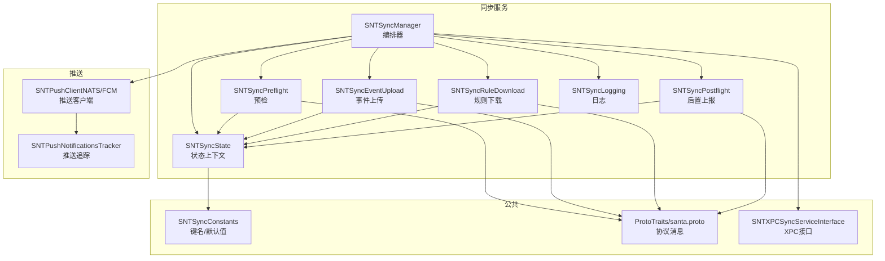
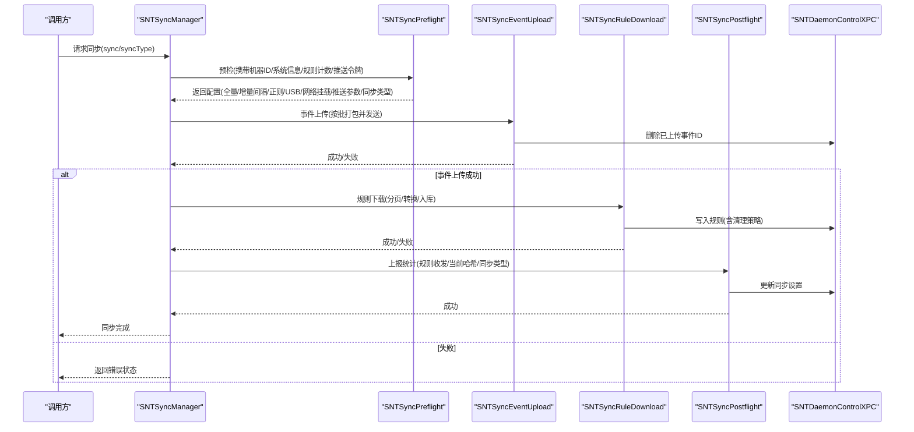
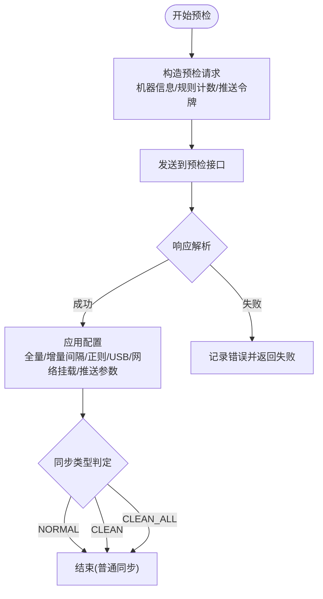
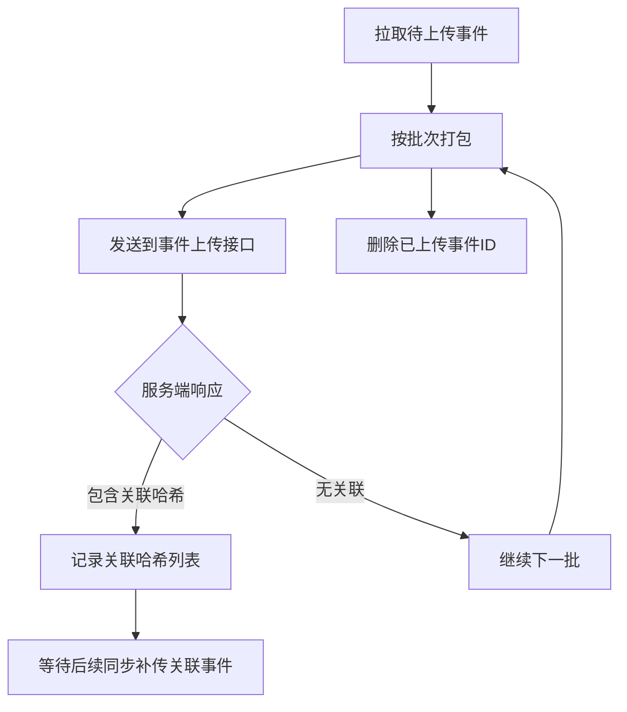
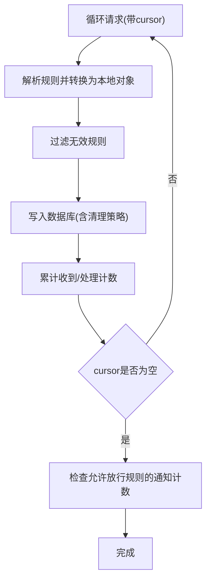
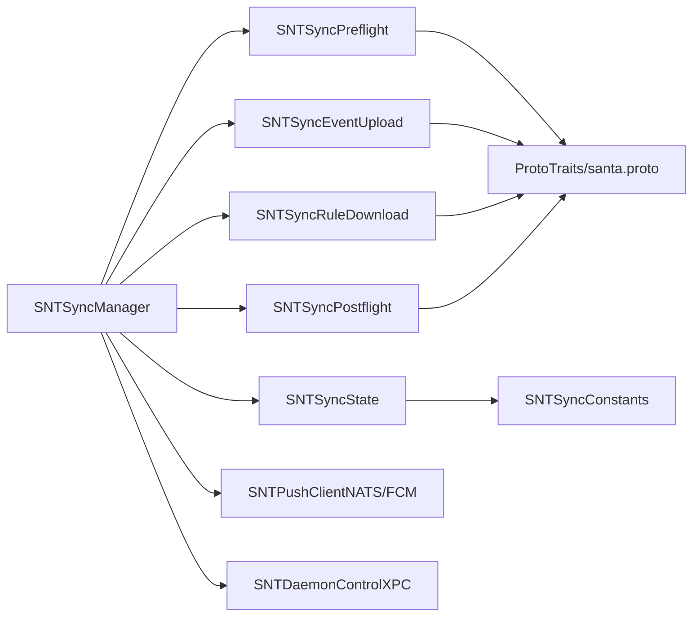

# 同步服务系统

<cite>
**本文引用的文件**
- [SNTSyncManager.h](file://Source/santasyncservice/SNTSyncManager.h)
- [SNTSyncManager.mm](file://Source/santasyncservice/SNTSyncManager.mm)
- [SNTSyncPreflight.h](file://Source/santasyncservice/SNTSyncPreflight.h)
- [SNTSyncPreflight.mm](file://Source/santasyncservice/SNTSyncPreflight.mm)
- [SNTSyncEventUpload.h](file://Source/santasyncservice/SNTSyncEventUpload.h)
- [SNTSyncEventUpload.mm](file://Source/santasyncservice/SNTSyncEventUpload.mm)
- [SNTSyncRuleDownload.h](file://Source/santasyncservice/SNTSyncRuleDownload.h)
- [SNTSyncRuleDownload.mm](file://Source/santasyncservice/SNTSyncRuleDownload.mm)
- [SNTSyncPostflight.h](file://Source/santasyncservice/SNTSyncPostflight.h)
- [SNTSyncPostflight.mm](file://Source/santasyncservice/SNTSyncPostflight.mm)
- [SNTSyncState.h](file://Source/santasyncservice/SNTSyncState.h)
- [SNTSyncState.mm](file://Source/santasyncservice/SNTSyncState.mm)
- [SNTSyncConstants.h](file://Source/common/SNTSyncConstants.h)
- [SNTSyncConstants.mm](file://Source/common/SNTSyncConstants.mm)
- [SNTSyncService.h](file://Source/santasyncservice/SNTSyncService.h)
- [SNTSyncService.mm](file://Source/santasyncservice/SNTSyncService.mm)
- [SNTXPCSyncServiceInterface.h](file://Source/common/SNTXPCSyncServiceInterface.h)
- [SNTXPCSyncServiceInterface.mm](file://Source/common/SNTXPCSyncServiceInterface.mm)
- [SNTSyncLogging.h](file://Source/santasyncservice/SNTSyncLogging.h)
- [SNTSyncLogging.mm](file://Source/santasyncservice/SNTSyncLogging.mm)
- [SNTPushClientNATS.h](file://Source/santasyncservice/SNTPushClientNATS.h)
- [SNTPushClientNATS.mm](file://Source/santasyncservice/SNTPushClientNATS.mm)
- [SNTPushClientFCM.h](file://Source/santasyncservice/SNTPushClientFCM.h)
- [SNTPushClientFCM.mm](file://Source/santasyncservice/SNTPushClientFCM.mm)
- [SNTSyncBroadcaster.h](file://Source/santasyncservice/SNTSyncBroadcaster.h)
- [SNTSyncBroadcaster.mm](file://Source/santasyncservice/SNTSyncBroadcaster.mm)
- [SNTSyncFCM.h](file://Source/santasyncservice/SNTSyncFCM.h)
- [SNTSyncFCM.mm](file://Source/santasyncservice/SNTSyncFCM.mm)
- [SNTStreamingMultipartFormData.h](file://Source/santasyncservice/SNTStreamingMultipartFormData.h)
- [SNTStreamingMultipartFormData.mm](file://Source/santasyncservice/SNTStreamingMultipartFormData.mm)
- [SNTSyncConfigBundle.h](file://Source/santasyncservice/SNTSyncConfigBundle.h)
- [SNTSyncConfigBundle.mm](file://Source/santasyncservice/SNTSyncConfigBundle.mm)
- [SNTSyncPostflight.mm](file://Source/santasyncservice/SNTSyncPostflight.mm)
- [SNTSyncPreflight.mm](file://Source/santasyncservice/SNTSyncPreflight.mm)
- [SNTSyncRuleDownload.mm](file://Source/santasyncservice/SNTSyncRuleDownload.mm)
- [SNTSyncEventUpload.mm](file://Source/santasyncservice/SNTSyncEventUpload.mm)
- [SNTSyncManager.mm](file://Source/santasyncservice/SNTSyncManager.mm)
- [SNTSyncState.h](file://Source/santasyncservice/SNTSyncState.h)
- [SNTSyncState.mm](file://Source/santasyncservice/SNTSyncState.mm)
- [SNTSyncConstants.h](file://Source/common/SNTSyncConstants.h)
- [SNTSyncConstants.mm](file://Source/common/SNTSyncConstants.mm)
- [SNTSyncLogging.h](file://Source/santasyncservice/SNTSyncLogging.h)
- [SNTSyncLogging.mm](file://Source/santasyncservice/SNTSyncLogging.mm)
- [SNTPushNotificationsTracker.h](file://Source/santasyncservice/SNTPushNotificationsTracker.h)
- [SNTPushNotificationsTracker.mm](file://Source/santasyncservice/SNTPushNotificationsTracker.mm)
- [ProtoTraits.h](file://Source/santasyncservice/ProtoTraits.h)
- [santa.proto](file://Source/common/santa.proto)
- [santa_proto_include_wrapper.h](file://Source/common/santa_proto_include_wrapper.h)
- [SNTSyncManagerTest.mm](file://Source/santasyncservice/SNTSyncManagerTest.mm)
- [SNTSyncManagerNATSTest.mm](file://Source/santasyncservice/SNTSyncManagerNATSTest.mm)
- [SNTSyncRuleDownloadTest.mm](file://Source/santasyncservice/SNTSyncRuleDownloadTest.mm)
- [SNTSyncEventUploadTest.mm](file://Source/santasyncservice/SNTStreamingMultipartFormDataTest.mm)
- [SNTStreamingMultipartFormDataTest.mm](file://Source/santasyncservice/SNTStreamingMultipartFormDataTest.mm)
- [SNTSyncTest.mm](file://Source/santasyncservice/SNTSyncTest.mm)
- [SNTSyncPreflight_basic.json](file://Source/santasyncservice/testdata/sync_preflight_basic.json)
- [SNTSyncPreflight_request.json](file://Source/santasyncservice/testdata/sync_preflight_request.json)
- [SNTSyncPreflight_request_v2.json](file://Source/santasyncservice/testdata/sync_preflight_request_v2.json)
- [SNTSyncPreflight_lockdown.json](file://Source/santasyncservice/testdata/sync_preflight_lockdown.json)
- [SNTSyncPreflight_turn_on_blockusb.json](file://Source/santasyncservice/testdata/sync_preflight_turn_on_blockusb.json)
- [SNTSyncPreflight_turn_off_blockusb.json](file://Source/santasyncservice/testdata/sync_preflight_turn_off_blockusb.json)
- [SNTSyncPreflight_blockusb_absent.json](file://Source/santasyncservice/testdata/sync_preflight_blockusb_absent.json)
- [SNTSyncPreflight_standalone.json](file://Source/santasyncservice/testdata/sync_preflight_standalone.json)
- [SNTSyncPreflight_blockusb_absent.json](file://Source/santasyncservice/testdata/sync_preflight_blockusb_absent.json)
- [SNTSyncPreflight_lockdown.json](file://Source/santasyncservice/testdata/sync_preflight_lockdown.json)
- [SNTSyncPreflight_turn_off_blockusb.json](file://Source/santasyncservice/testdata/sync_preflight_turn_off_blockusb.json)
- [SNTSyncPreflight_turn_on_blockusb.json](file://Source/santasyncservice/testdata/sync_preflight_turn_on_blockusb.json)
- [SNTSyncPreflight_standalone.json](file://Source/santasyncservice/testdata/sync_preflight_standalone.json)
- [SNTSyncPreflight_request.json](file://Source/santasyncservice/testdata/sync_preflight_request.json)
- [SNTSyncPreflight_request_v2.json](file://Source/santasyncservice/testdata/sync_preflight_request_v2.json)
- [SNTSyncPreflight_basic.json](file://Source/santasyncservice/testdata/sync_preflight_basic.json)
- [SNTSyncRuleDownload_batch1.json](file://Source/santasyncservice/testdata/sync_ruledownload_batch1.json)
- [SNTSyncRuleDownload_batch2.json](file://Source/santasyncservice/testdata/sync_ruledownload_batch2.json)
- [SNTSyncRuleDownload_with_cel_1.json](file://Source/santasyncservice/testdata/sync_ruledownload_with_cel_1.json)
- [SNTSyncEventUpload_input_basic.plist](file://Source/santasyncservice/testdata/sync_eventupload_input_basic.plist)
- [SNTSyncEventUpload_input_quarantine.plist](file://Source/santasyncservice/testdata/sync_eventupload_input_quarantine.plist)
</cite>

## 目录
1. [简介](#简介)
2. [项目结构](#项目结构)
3. [核心组件](#核心组件)
4. [架构总览](#架构总览)
5. [详细组件分析](#详细组件分析)
6. [依赖关系分析](#依赖关系分析)
7. [性能考虑](#性能考虑)
8. [故障排除指南](#故障排除指南)
9. [结论](#结论)
10. [附录](#附录)

## 简介
本文件为 Santa 同步服务系统的深度技术文档，面向工程师与运维人员，系统性阐述同步协议设计、预检机制、规则下载与事件上传的完整流程；详述与管理服务器的通信协议、数据格式与安全传输机制；解释同步状态管理、重试策略与错误处理；说明实时推送通知、增量同步与批量处理实现；并提供配置项、性能调优与监控方法，以及同步故障排除、数据一致性与备份恢复策略，最后给出与不同管理服务器的集成方案与 API 参考。

## 项目结构
同步服务位于 Source/santasyncservice 目录，围绕 SNTSyncManager 作为编排器，串联预检、事件上传、规则下载、后置上报等阶段，并通过 SNTSyncState 在各阶段间传递上下文。公共常量定义于 Source/common/SNTSyncConstants.*，协议与消息类型由 ProtoTraits.h 与 santa.proto/santa_proto_include_wrapper.h 提供。

图示来源
- [SNTSyncManager.mm](file://Source/santasyncservice/SNTSyncManager.mm#L66-L120)
- [SNTSyncPreflight.mm](file://Source/santasyncservice/SNTSyncPreflight.mm#L406-L428)
- [SNTSyncEventUpload.mm](file://Source/santasyncservice/SNTSyncEventUpload.mm#L458-L484)
- [SNTSyncRuleDownload.mm](file://Source/santasyncservice/SNTSyncRuleDownload.mm#L395-L403)
- [SNTSyncPostflight.mm](file://Source/santasyncservice/SNTSyncPostflight.mm#L70-L85)
- [SNTSyncState.h](file://Source/santasyncservice/SNTSyncState.h#L25-L116)
- [SNTSyncConstants.h](file://Source/common/SNTSyncConstants.h#L17-L166)
- [ProtoTraits.h](file://Source/santasyncservice/ProtoTraits.h)
- [santa.proto](file://Source/common/santa.proto)
- [SNTXPCSyncServiceInterface.h](file://Source/common/SNTXPCSyncServiceInterface.h)

章节来源
- [SNTSyncManager.mm](file://Source/santasyncservice/SNTSyncManager.mm#L66-L120)
- [SNTSyncState.h](file://Source/santasyncservice/SNTSyncState.h#L25-L116)
- [SNTSyncConstants.h](file://Source/common/SNTSyncConstants.h#L17-L166)

## 核心组件
- SNTSyncManager：同步编排器，负责调度预检、事件上传、规则下载、后置上报，维护定时器与并发控制，处理网络可达性与推送配置。
- SNTSyncPreflight：向管理服务器发起预检请求，获取配置（如全量/增量间隔、正则白黑名单、USB/网络挂载策略、推送参数等），并确定本次同步类型（普通/Clean/CleanAll）。
- SNTSyncEventUpload：从数据库拉取待上传事件，按批次打包，支持执行事件、文件访问事件、临时监控模式审计事件与网络挂载事件，支持服务端要求的关联二进制事件回传。
- SNTSyncRuleDownload：分页拉取规则集，转换为本地规则对象，写入数据库；在 V2 下同时处理文件访问规则；根据服务端推送信息触发系统通知。
- SNTSyncPostflight：向服务器上报本次同步统计（收到/处理规则数、当前规则哈希、同步类型），更新本地同步设置。
- SNTSyncState：贯穿所有阶段的状态容器，保存会话、机器标识、推送参数、批大小、计数、编码方式等。
- 推送与广播：SNTPushClientNATS/FCM 负责连接与订阅，SNTPushNotificationsTracker 跟踪需要通知的应用。
- 日志与测试：SNTSyncLogging 提供统一日志；大量 testdata 用于验证协议字段与行为。

章节来源
- [SNTSyncManager.h](file://Source/santasyncservice/SNTSyncManager.h#L24-L78)
- [SNTSyncManager.mm](file://Source/santasyncservice/SNTSyncManager.mm#L196-L400)
- [SNTSyncPreflight.h](file://Source/santasyncservice/SNTSyncPreflight.h#L15-L21)
- [SNTSyncEventUpload.h](file://Source/santasyncservice/SNTSyncEventUpload.h#L16-L26)
- [SNTSyncRuleDownload.h](file://Source/santasyncservice/SNTSyncRuleDownload.h#L15-L23)
- [SNTSyncPostflight.h](file://Source/santasyncservice/SNTSyncPostflight.h#L15-L21)
- [SNTSyncState.h](file://Source/santasyncservice/SNTSyncState.h#L25-L116)

## 架构总览
同步流程采用“阶段化流水线”设计：预检决定策略与周期，事件上传与规则下载可并行或串行执行，后置上报汇总统计并更新本地状态。SNTSyncManager 使用 GCD 定时器与信号量控制并发，结合 Reachability 监听网络恢复自动触发同步。

图示来源
- [SNTSyncManager.mm](file://Source/santasyncservice/SNTSyncManager.mm#L297-L400)
- [SNTSyncPreflight.mm](file://Source/santasyncservice/SNTSyncPreflight.mm#L406-L428)
- [SNTSyncEventUpload.mm](file://Source/santasyncservice/SNTSyncEventUpload.mm#L458-L484)
- [SNTSyncRuleDownload.mm](file://Source/santasyncservice/SNTSyncRuleDownload.mm#L395-L473)
- [SNTSyncPostflight.mm](file://Source/santasyncservice/SNTSyncPostflight.mm#L70-L85)

## 详细组件分析

### 预检阶段（SNTSyncPreflight）
- 目标：与管理服务器协商同步策略与参数，决定本次同步类型（普通/Clean/CleanAll），并下发客户端模式、路径正则、USB/网络挂载策略、推送配置等。
- 关键点：
  - 生成预检请求，包含机器ID、序列号、主机名、OS版本/build、机型、Santa版本、主用户、用户组、SIP状态、推送令牌、是否推送同步等。
  - 读取数据库中各类规则计数与规则哈希，作为预检输入的一部分。
  - 解析响应中的全量同步间隔、增量同步间隔、推送全量同步间隔、全局规则同步截止时间、客户端模式、白/黑名单正则、USB挂载开关与重挂载模式、文件访问覆盖动作、导出配置、事件详情URL/文本、同步类型（NORMAL/CLEAN/CLEAN_ALL）等。
  - V2 响应新增：推送服务器地址、nkey/JWT/deviceID/tags、HMAC密钥、模式切换（撤销/按需监控模式）、网络挂载限制与允许主机列表、被禁止挂载的提示信息等。
- 清洁同步逻辑：遵循客户端请求与服务器响应的优先级规则，确保 CleanAll 的最高优先级。

图示来源
- [SNTSyncPreflight.mm](file://Source/santasyncservice/SNTSyncPreflight.mm#L80-L120)
- [SNTSyncPreflight.mm](file://Source/santasyncservice/SNTSyncPreflight.mm#L150-L210)
- [SNTSyncPreflight.mm](file://Source/santasyncservice/SNTSyncPreflight.mm#L260-L320)
- [SNTSyncPreflight.mm](file://Source/santasyncservice/SNTSyncPreflight.mm#L325-L404)

章节来源
- [SNTSyncPreflight.mm](file://Source/santasyncservice/SNTSyncPreflight.mm#L80-L120)
- [SNTSyncPreflight.mm](file://Source/santasyncservice/SNTSyncPreflight.mm#L150-L210)
- [SNTSyncPreflight.mm](file://Source/santasyncservice/SNTSyncPreflight.mm#L260-L320)
- [SNTSyncPreflight.mm](file://Source/santasyncservice/SNTSyncPreflight.mm#L325-L404)

### 事件上传阶段（SNTSyncEventUpload）
- 目标：将本地待上传事件批量发送至管理服务器，支持多种事件类型，并处理服务端要求的关联二进制事件回传。
- 关键点：
  - 从数据库拉取待上传事件集合，按批次上限打包；每批发送后立即删除对应事件ID，避免重复上传。
  - 支持的事件类型：执行事件（含签名链、权限、沙箱标志、签名状态等）、文件访问事件（含进程链）、临时监控模式进入/离开审计事件、网络挂载事件（V2）。
  - 服务端可能返回需要关联的二进制哈希列表，以便后续补传相关事件。
  - 仅在普通同步或允许清洁同步事件上传时发送事件。
- 批量与压缩：通过 SNTSyncState.contentEncoding 控制内容编码（由配置注入），减少带宽占用。

图示来源
- [SNTSyncEventUpload.mm](file://Source/santasyncservice/SNTSyncEventUpload.mm#L90-L110)
- [SNTSyncEventUpload.mm](file://Source/santasyncservice/SNTSyncEventUpload.mm#L110-L177)
- [SNTSyncEventUpload.mm](file://Source/santasyncservice/SNTSyncEventUpload.mm#L178-L297)
- [SNTSyncEventUpload.mm](file://Source/santasyncservice/SNTSyncEventUpload.mm#L298-L368)
- [SNTSyncEventUpload.mm](file://Source/santasyncservice/SNTSyncEventUpload.mm#L370-L454)

章节来源
- [SNTSyncEventUpload.mm](file://Source/santasyncservice/SNTSyncEventUpload.mm#L90-L110)
- [SNTSyncEventUpload.mm](file://Source/santasyncservice/SNTSyncEventUpload.mm#L110-L177)
- [SNTSyncEventUpload.mm](file://Source/santasyncservice/SNTSyncEventUpload.mm#L178-L297)
- [SNTSyncEventUpload.mm](file://Source/santasyncservice/SNTSyncEventUpload.mm#L298-L368)
- [SNTSyncEventUpload.mm](file://Source/santasyncservice/SNTSyncEventUpload.mm#L370-L454)

### 规则下载阶段（SNTSyncRuleDownload）
- 目标：从管理服务器分页拉取规则集，转换为本地规则对象并写入数据库；在 V2 下处理文件访问规则；对允许放行的二进制/包触发系统通知。
- 关键点：
  - 分页循环直至 cursor 为空，累计收到/处理数量。
  - 将服务端规则映射为本地 SNTRule/SNTFileAccessRule，校验并过滤无效规则。
  - 根据同步类型选择清理策略（Clean/CleanAll 时清理非传递规则/全部规则）。
  - 对允许放行的规则，若存在通知应用名称，则通过 SNTPushNotificationsTracker 记录剩余待处理数量；当计数归零时，向守护进程发出通知。
- 文件访问规则（V2）：支持路径与进程组合策略、静默模式、自定义消息与事件详情等。

图示来源
- [SNTSyncRuleDownload.mm](file://Source/santasyncservice/SNTSyncRuleDownload.mm#L87-L154)
- [SNTSyncRuleDownload.mm](file://Source/santasyncservice/SNTSyncRuleDownload.mm#L155-L218)
- [SNTSyncRuleDownload.mm](file://Source/santasyncservice/SNTSyncRuleDownload.mm#L219-L283)
- [SNTSyncRuleDownload.mm](file://Source/santasyncservice/SNTSyncRuleDownload.mm#L284-L347)
- [SNTSyncRuleDownload.mm](file://Source/santasyncservice/SNTSyncRuleDownload.mm#L348-L394)
- [SNTSyncRuleDownload.mm](file://Source/santasyncservice/SNTSyncRuleDownload.mm#L395-L473)

章节来源
- [SNTSyncRuleDownload.mm](file://Source/santasyncservice/SNTSyncRuleDownload.mm#L87-L154)
- [SNTSyncRuleDownload.mm](file://Source/santasyncservice/SNTSyncRuleDownload.mm#L155-L218)
- [SNTSyncRuleDownload.mm](file://Source/santasyncservice/SNTSyncRuleDownload.mm#L219-L283)
- [SNTSyncRuleDownload.mm](file://Source/santasyncservice/SNTSyncRuleDownload.mm#L284-L347)
- [SNTSyncRuleDownload.mm](file://Source/santasyncservice/SNTSyncRuleDownload.mm#L348-L394)
- [SNTSyncRuleDownload.mm](file://Source/santasyncservice/SNTSyncRuleDownload.mm#L395-L473)

### 后置上报阶段（SNTSyncPostflight）
- 目标：向服务器上报本次同步统计（收到/处理规则数、当前规则哈希、同步类型），并更新本地同步设置。
- 关键点：
  - 汇总 rulesReceived/rulesProcessed（及 V2 下 file_access_* 对应计数），同步类型 NORMAL/CLEAN/CLEAN_ALL。
  - 读取数据库当前规则哈希，提交给服务器。
  - 调用守护进程更新同步设置。

章节来源
- [SNTSyncPostflight.mm](file://Source/santasyncservice/SNTSyncPostflight.mm#L28-L67)
- [SNTSyncPostflight.mm](file://Source/santasyncservice/SNTSyncPostflight.mm#L70-L85)

### 同步状态管理（SNTSyncState）
- 统一承载会话、机器ID/所有者/组、推送参数、全量/推送全量同步间隔、事件批大小、内容编码、规则计数、同步类型、是否仅预检等。
- 生命周期：由 SNTSyncManager.createSyncStateWithStatus 构建，包含证书固定校验、HTTPS 校验、代理配置、XSRF 令牌与头名等。

章节来源
- [SNTSyncState.h](file://Source/santasyncservice/SNTSyncState.h#L25-L116)
- [SNTSyncState.mm](file://Source/santasyncservice/SNTSyncState.mm#L15-L22)
- [SNTSyncManager.mm](file://Source/santasyncservice/SNTSyncManager.mm#L418-L500)

### 通信协议与数据格式
- 协议版本：通过 SNTSyncManager 判定是否启用 V2（域名固定或强制编译宏），使用 ProtoTraits 与 santa.proto 定义的消息类型。
- 预检/事件上传/规则下载/后置上报均以 HTTP(S) 请求形式与管理服务器交互，请求体为 Protobuf 消息，响应亦为 Protobuf。
- 关键键名与默认值由 SNTSyncConstants 提供，涵盖设备信息、决策类型、规则类型/策略、路径正则、USB/网络挂载、推送令牌、事件批大小、全量/推送全量同步间隔、全局规则同步截止时间等。

章节来源
- [SNTSyncManager.mm](file://Source/santasyncservice/SNTSyncManager.mm#L466-L493)
- [SNTSyncPreflight.mm](file://Source/santasyncservice/SNTSyncPreflight.mm#L406-L428)
- [SNTSyncEventUpload.mm](file://Source/santasyncservice/SNTSyncEventUpload.mm#L458-L484)
- [SNTSyncRuleDownload.mm](file://Source/santasyncservice/SNTSyncRuleDownload.mm#L395-L403)
- [SNTSyncPostflight.mm](file://Source/santasyncservice/SNTSyncPostflight.mm#L70-L85)
- [SNTSyncConstants.h](file://Source/common/SNTSyncConstants.h#L17-L166)
- [SNTSyncConstants.mm](file://Source/common/SNTSyncConstants.mm#L16-L160)
- [ProtoTraits.h](file://Source/santasyncservice/ProtoTraits.h)
- [santa.proto](file://Source/common/santa.proto)
- [santa_proto_include_wrapper.h](file://Source/common/santa_proto_include_wrapper.h)

### 安全传输机制
- 服务器端证书固定：当管理服务器域名被固定时，使用内置 PEM 证书进行校验，强制启用 V2。
- 自定义根证书：支持从文件/数据加载根证书，用于非固定域名场景。
- 客户端证书认证：支持基于证书文件/密码、CN 或 Issuer CN 的客户端证书认证。
- HTTPS 强制：若未使用 HTTPS，会发出警告。
- 代理与重定向：支持代理配置，拒绝重定向，防止泄露凭据。
- XSRF 令牌：通过 SNTSyncState.xsrfToken 与 xsrfTokenHeader 字段在请求头中携带。

章节来源
- [SNTSyncManager.mm](file://Source/santasyncservice/SNTSyncManager.mm#L466-L493)
- [SNTSyncConstants.mm](file://Source/common/SNTSyncConstants.mm#L16-L30)

### 实时推送通知与增量同步
- 推送客户端：优先尝试 FCM；否则在满足域名固定条件下使用 NATS 推送；否则禁用推送。
- 推送配置：预检阶段从服务器获取推送服务器地址、nkey/JWT/deviceID/tags、HMAC 密钥等；运行期间根据推送全量同步间隔调整定时器。
- 增量同步：事件上传与规则下载按批进行，规则下载支持分页游标；后置上报统计规则收发数量。
- 应用放行通知：对允许放行的二进制/包，通过 SNTPushNotificationsTracker 记录剩余规则数量，计数归零后触发系统通知。

章节来源
- [SNTSyncManager.mm](file://Source/santasyncservice/SNTSyncManager.mm#L70-L90)
- [SNTSyncPreflight.mm](file://Source/santasyncservice/SNTSyncPreflight.mm#L325-L404)
- [SNTSyncRuleDownload.mm](file://Source/santasyncservice/SNTSyncRuleDownload.mm#L348-L394)
- [SNTPushClientNATS.mm](file://Source/santasyncservice/SNTPushClientNATS.mm)
- [SNTPushClientFCM.mm](file://Source/santasyncservice/SNTPushClientFCM.mm)
- [SNTPushNotificationsTracker.mm](file://Source/santasyncservice/SNTPushNotificationsTracker.mm)

### 错误处理与重试策略
- 并发控制：使用信号量限制同时进行的同步请求数量，避免资源争用。
- 网络可达性：监听网络状态变化，网络恢复后自动触发一次同步。
- 阶段失败：任一阶段失败（预检/事件上传/规则下载/后置上报）均返回相应状态码；预检失败时根据推送状态调整下次全量同步间隔。
- 超时与重试：各阶段请求设置超时；规则入库与后置设置等待守护进程响应，超时视为失败。
- 日志：统一通过 SNTSyncLogging 输出调试/错误信息，便于定位问题。

章节来源
- [SNTSyncManager.mm](file://Source/santasyncservice/SNTSyncManager.mm#L40-L60)
- [SNTSyncManager.mm](file://Source/santasyncservice/SNTSyncManager.mm#L504-L539)
- [SNTSyncRuleDownload.mm](file://Source/santasyncservice/SNTSyncRuleDownload.mm#L420-L459)
- [SNTSyncEventUpload.mm](file://Source/santasyncservice/SNTSyncEventUpload.mm#L110-L177)
- [SNTSyncPreflight.mm](file://Source/santasyncservice/SNTSyncPreflight.mm#L150-L160)
- [SNTSyncPostflight.mm](file://Source/santasyncservice/SNTSyncPostflight.mm#L28-L67)

## 依赖关系分析
- 组件耦合：
  - SNTSyncManager 依赖 SNTSyncState、SNTSyncPreflight、SNTSyncEventUpload、SNTSyncRuleDownload、SNTSyncPostflight、推送客户端与日志模块。
  - 各 Stage 依赖 ProtoTraits 与 santa.proto 定义的消息类型。
  - 与守护进程通过 XPC 接口交互，用于数据库操作与同步设置更新。
- 外部依赖：
  - 网络栈（Network.framework）用于可达性监测。
  - 证书固定与根证书加载（Pinning）。
  - 测试数据与单元测试覆盖关键流程。

图示来源
- [SNTSyncManager.mm](file://Source/santasyncservice/SNTSyncManager.mm#L66-L120)
- [SNTSyncPreflight.mm](file://Source/santasyncservice/SNTSyncPreflight.mm#L406-L428)
- [SNTSyncEventUpload.mm](file://Source/santasyncservice/SNTSyncEventUpload.mm#L458-L484)
- [SNTSyncRuleDownload.mm](file://Source/santasyncservice/SNTSyncRuleDownload.mm#L395-L403)
- [SNTSyncPostflight.mm](file://Source/santasyncservice/SNTSyncPostflight.mm#L70-L85)
- [SNTSyncState.h](file://Source/santasyncservice/SNTSyncState.h#L25-L116)
- [SNTSyncConstants.h](file://Source/common/SNTSyncConstants.h#L17-L166)
- [ProtoTraits.h](file://Source/santasyncservice/ProtoTraits.h)

## 性能考虑
- 批量上传：通过 SNTSyncState.eventBatchSize 控制事件批大小，默认 50；可根据网络状况与服务器能力调整。
- 内容编码：通过 SNTSyncState.contentEncoding 选择压缩/编码方式，降低带宽占用。
- 并发与限流：信号量限制并发同步次数；定时器按推送全量同步间隔或默认全量同步间隔调度。
- 数据库写入：规则入库采用异步回调与超时控制，避免阻塞同步主流程。
- 日志级别：在调试/生产环境合理设置日志级别，避免过多 I/O 影响性能。

章节来源
- [SNTSyncConstants.mm](file://Source/common/SNTSyncConstants.mm#L155-L160)
- [SNTSyncManager.mm](file://Source/santasyncservice/SNTSyncManager.mm#L90-L100)
- [SNTSyncEventUpload.mm](file://Source/santasyncservice/SNTSyncEventUpload.mm#L110-L177)
- [SNTSyncRuleDownload.mm](file://Source/santasyncservice/SNTSyncRuleDownload.mm#L420-L459)

## 故障排除指南
- 常见错误与处理：
  - 缺少 SyncBaseURL 或非 HTTPS：直接返回缺失状态并记录错误，建议检查配置。
  - 缺少 Machine ID：同上，需补齐机器标识。
  - 预检失败：根据推送状态调整下次全量同步间隔；检查网络与证书配置。
  - 事件上传失败：记录错误并等待网络恢复后重试；确认批大小与编码设置。
  - 规则入库超时：检查守护进程健康与数据库负载；必要时增大超时或减少批大小。
  - 推送连接异常：检查推送服务器地址、nkey/JWT/deviceID/tags/HMAC 密钥；确认域名固定与证书配置。
- 诊断工具与日志：
  - 使用 SNTSyncLogging 输出详细日志，定位阶段与错误原因。
  - 结合 testdata 进行回归测试，验证协议字段与行为。
- 数据一致性：
  - 事件上传后立即删除已发送事件ID，避免重复。
  - 规则下载完成后更新同步设置，确保下次预检正确。

章节来源
- [SNTSyncManager.mm](file://Source/santasyncservice/SNTSyncManager.mm#L420-L437)
- [SNTSyncEventUpload.mm](file://Source/santasyncservice/SNTSyncEventUpload.mm#L110-L177)
- [SNTSyncRuleDownload.mm](file://Source/santasyncservice/SNTSyncRuleDownload.mm#L420-L459)
- [SNTSyncPreflight.mm](file://Source/santasyncservice/SNTSyncPreflight.mm#L150-L160)
- [SNTSyncPostflight.mm](file://Source/santasyncservice/SNTSyncPostflight.mm#L28-L67)

## 结论
Santa 同步服务通过清晰的阶段化设计与严格的错误处理机制，实现了与管理服务器的稳定、安全与高效同步。预检阶段决定策略与周期，事件上传与规则下载支持批量与增量，后置上报保障统计与一致性。配合推送通知与可达性检测，系统在复杂网络环境下仍能保持高可用。建议在生产环境中启用证书固定、合理配置批大小与同步间隔，并持续监控日志与指标以优化性能。

## 附录

### 配置选项与API参考
- 关键配置键（来自 SNTSyncConstants）：
  - 设备与系统信息：serial_num、hostname、santa_version、os_version、os_build、model_identifier、primary_user、primary_user_groups
  - 同步与推送：full_sync_interval、push_notification_full_sync_interval_seconds、push_notification_global_rule_sync_deadline_seconds、fcm_token、enable_all_event_upload、disable_unknown_event_upload
  - USB/网络挂载：block_usb_mount、remount_usb_mode、block_network_mount、allowed_network_mount_hosts、banned_network_mount_block_message
  - 正则策略：allowed_path_regex、blocked_path_regex
  - 事件批大小：batch_size
  - 事件与规则字段：events、rules、cursor、decision、rule_type、policy、cel_expr、custom_msg、custom_url、comment 等
- 同步阶段接口（来自 SNTSyncStage 子类）：
  - 预检：preflight/{machine_id}
  - 事件上传：eventupload/{machine_id}
  - 规则下载：ruledownload/{machine_id}
  - 后置上报：postflight/{machine_id}

章节来源
- [SNTSyncConstants.h](file://Source/common/SNTSyncConstants.h#L17-L166)
- [SNTSyncConstants.mm](file://Source/common/SNTSyncConstants.mm#L16-L160)
- [SNTSyncPreflight.mm](file://Source/santasyncservice/SNTSyncPreflight.mm#L406-L411)
- [SNTSyncEventUpload.mm](file://Source/santasyncservice/SNTSyncEventUpload.mm#L458-L463)
- [SNTSyncRuleDownload.mm](file://Source/santasyncservice/SNTSyncRuleDownload.mm#L395-L400)
- [SNTSyncPostflight.mm](file://Source/santasyncservice/SNTSyncPostflight.mm#L70-L75)

### 测试与验证
- 单元测试覆盖：
  - SNTSyncManagerTest：同步流程与并发控制
  - SNTSyncManagerNATSTest：NATS 推送集成
  - SNTSyncRuleDownloadTest：规则下载与清理策略
  - SNTStreamingMultipartFormDataTest：事件上传打包与边界条件
- 测试数据：
  - 预检响应样例：basic/request/request_v2/lockdown/turn_on_blockusb/turn_off_blockusb/standalone 等
  - 规则下载样例：batch1/batch2/with_cel_1
  - 事件上传输入样例：basic/quarantine

章节来源
- [SNTSyncManagerTest.mm](file://Source/santasyncservice/SNTSyncManagerTest.mm)
- [SNTSyncManagerNATSTest.mm](file://Source/santasyncservice/SNTSyncManagerNATSTest.mm)
- [SNTSyncRuleDownloadTest.mm](file://Source/santasyncservice/SNTSyncRuleDownloadTest.mm)
- [SNTStreamingMultipartFormDataTest.mm](file://Source/santasyncservice/SNTStreamingMultipartFormDataTest.mm)
- [SNTSyncPreflight_basic.json](file://Source/santasyncservice/testdata/sync_preflight_basic.json)
- [SNTSyncPreflight_request.json](file://Source/santasyncservice/testdata/sync_preflight_request.json)
- [SNTSyncPreflight_request_v2.json](file://Source/santasyncservice/testdata/sync_preflight_request_v2.json)
- [SNTSyncPreflight_lockdown.json](file://Source/santasyncservice/testdata/sync_preflight_lockdown.json)
- [SNTSyncPreflight_turn_on_blockusb.json](file://Source/santasyncservice/testdata/sync_preflight_turn_on_blockusb.json)
- [SNTSyncPreflight_turn_off_blockusb.json](file://Source/santasyncservice/testdata/sync_preflight_turn_off_blockusb.json)
- [SNTSyncPreflight_standalone.json](file://Source/santasyncservice/testdata/sync_preflight_standalone.json)
- [SNTSyncRuleDownload_batch1.json](file://Source/santasyncservice/testdata/sync_ruledownload_batch1.json)
- [SNTSyncRuleDownload_batch2.json](file://Source/santasyncservice/testdata/sync_ruledownload_batch2.json)
- [SNTSyncRuleDownload_with_cel_1.json](file://Source/santasyncservice/testdata/sync_ruledownload_with_cel_1.json)
- [SNTSyncEventUpload_input_basic.plist](file://Source/santasyncservice/testdata/sync_eventupload_input_basic.plist)
- [SNTSyncEventUpload_input_quarantine.plist](file://Source/santasyncservice/testdata/sync_eventupload_input_quarantine.plist)