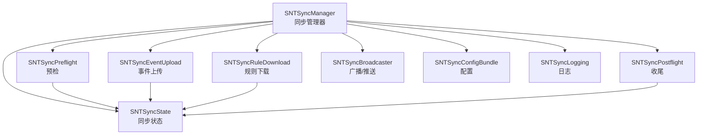
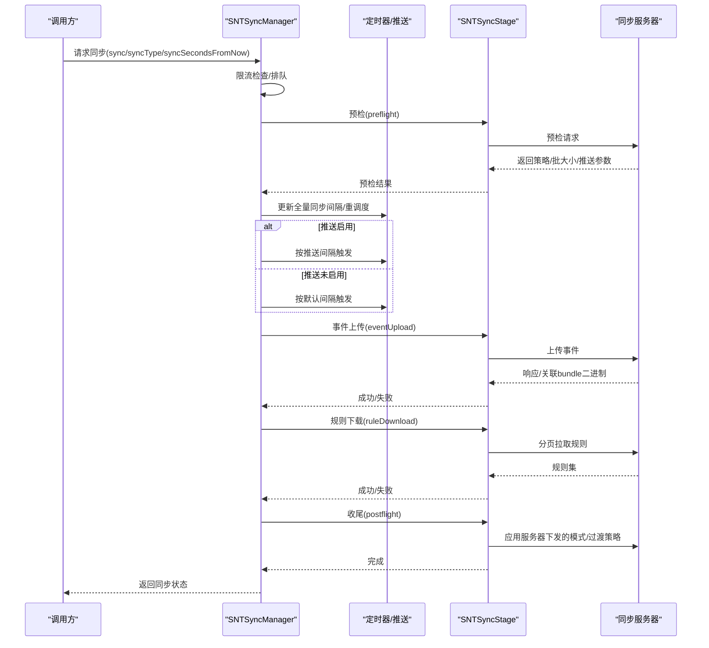
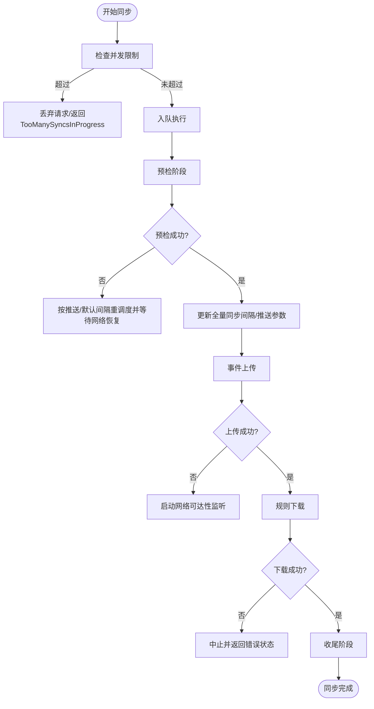
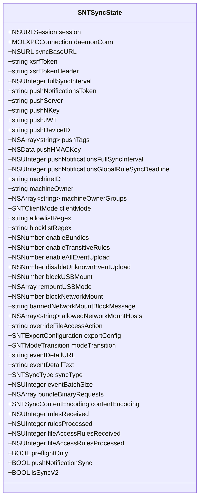
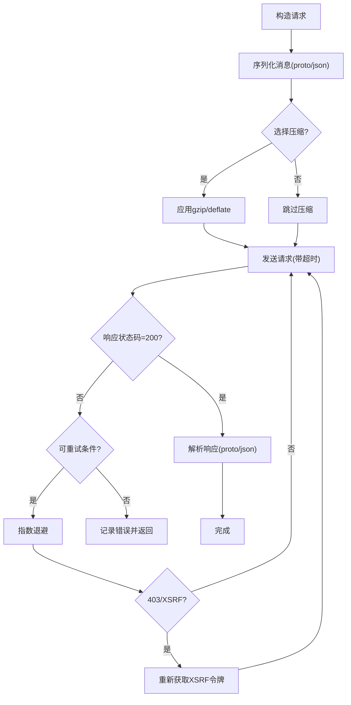
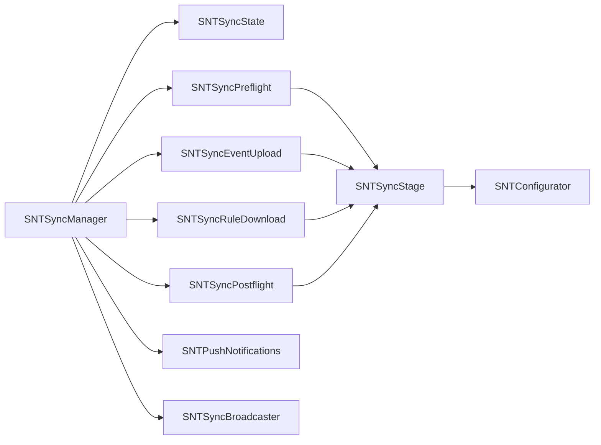

# 同步管理

<cite>
**本文引用的文件**
- [SNTSyncManager.h](file://Source/santasyncservice/SNTSyncManager.h)
- [SNTSyncManager.mm](file://Source/santasyncservice/SNTSyncManager.mm)
- [SNTSyncState.h](file://Source/santasyncservice/SNTSyncState.h)
- [SNTSyncState.mm](file://Source/santasyncservice/SNTSyncState.mm)
- [SNTSyncStage.h](file://Source/santasyncservice/SNTSyncStage.h)
- [SNTSyncStage.mm](file://Source/santasyncservice/SNTSyncStage.mm)
- [SNTSyncPreflight.h](file://Source/santasyncservice/SNTSyncPreflight.h)
- [SNTSyncPreflight.mm](file://Source/santasyncservice/SNTSyncPreflight.mm)
- [SNTSyncEventUpload.h](file://Source/santasyncservice/SNTSyncEventUpload.h)
- [SNTSyncEventUpload.mm](file://Source/santasyncservice/SNTSyncEventUpload.mm)
- [SNTSyncRuleDownload.h](file://Source/santasyncservice/SNTSyncRuleDownload.h)
- [SNTSyncRuleDownload.mm](file://Source/santasyncservice/SNTSyncRuleDownload.mm)
- [SNTSyncService.h](file://Source/santasyncservice/SNTSyncService.h)
- [SNTSyncService.mm](file://Source/santasyncservice/SNTSyncService.mm)
- [SNTSyncBroadcaster.h](file://Source/santasyncservice/SNTSyncBroadcaster.h)
- [SNTSyncBroadcaster.mm](file://Source/santasyncservice/SNTSyncBroadcaster.mm)
- [SNTSyncConfigBundle.h](file://Source/santasyncservice/SNTSyncConfigBundle.h)
- [SNTSyncConfigBundle.mm](file://Source/santasyncservice/SNTSyncConfigBundle.mm)
- [SNTSyncLogging.h](file://Source/santasyncservice/SNTSyncLogging.h)
- [SNTSyncLogging.mm](file://Source/santasyncservice/SNTSyncLogging.mm)
- [SNTSyncPostflight.h](file://Source/santasyncservice/SNTSyncPostflight.h)
- [SNTSyncPostflight.mm](file://Source/santasyncservice/SNTSyncPostflight.mm)
- [SNTSyncEventUpload.mm](file://Source/santasyncservice/SNTSyncEventUpload.mm)
- [SNTSyncRuleDownload.mm](file://Source/santasyncservice/SNTSyncRuleDownload.mm)
- [SNTSyncPreflight.mm](file://Source/santasyncservice/SNTSyncPreflight.mm)
- [SNTSyncStage.mm](file://Source/santasyncservice/SNTSyncStage.mm)
- [SNTSyncManager.mm](file://Source/santasyncservice/SNTSyncManager.mm)
- [SNTSyncState.h](file://Source/santasyncservice/SNTSyncState.h)
- [SNTSyncState.mm](file://Source/santasyncservice/SNTSyncState.mm)
- [SNTSyncManager.h](file://Source/santasyncservice/SNTSyncManager.h)
- [SNTSyncService.mm](file://Source/santasyncservice/SNTSyncService.mm)
- [SNTSyncBroadcaster.mm](file://Source/santasyncservice/SNTSyncBroadcaster.mm)
- [SNTSyncConfigBundle.mm](file://Source/santasyncservice/SNTSyncConfigBundle.mm)
- [SNTSyncLogging.mm](file://Source/santasyncservice/SNTSyncLogging.mm)
- [SNTSyncPostflight.mm](file://Source/santasyncservice/SNTSyncPostflight.mm)
- [SNTSyncEventUpload.mm](file://Source/santasyncservice/SNTSyncEventUpload.mm)
- [SNTSyncRuleDownload.mm](file://Source/santasyncservice/SNTSyncRuleDownload.mm)
- [SNTSyncPreflight.mm](file://Source/santasyncservice/SNTSyncPreflight.mm)
- [SNTSyncStage.mm](file://Source/santasyncservice/SNTSyncStage.mm)
- [SNTSyncManager.mm](file://Source/santasyncservice/SNTSyncManager.mm)
- [SNTSyncState.h](file://Source/santasyncservice/SNTSyncState.h)
- [SNTSyncState.mm](file://Source/santasyncservice/SNTSyncState.mm)
- [SNTSyncManager.h](file://Source/santasyncservice/SNTSyncManager.h)
- [SNTSyncService.mm](file://Source/santasyncservice/SNTSyncService.mm)
- [SNTSyncBroadcaster.mm](file://Source/santasyncservice/SNTSyncBroadcaster.mm)
- [SNTSyncConfigBundle.mm](file://Source/santasyncservice/SNTSyncConfigBundle.mm)
- [SNTSyncLogging.mm](file://Source/santasyncservice/SNTSyncLogging.mm)
- [SNTSyncPostflight.mm](file://Source/santasyncservice/SNTSyncPostflight.mm)
- [SNTSyncEventUpload.mm](file://Source/santasyncservice/SNTSyncEventUpload.mm)
- [SNTSyncRuleDownload.mm](file://Source/santasyncservice/SNTSyncRuleDownload.mm)
- [SNTSyncPreflight.mm](file://Source/santasyncservice/SNTSyncPreflight.mm)
- [SNTSyncStage.mm](file://Source/santasyncservice/SNTSyncStage.mm)
- [SNTSyncManager.mm](file://Source/santasyncservice/SNTSyncManager.mm)
- [SNTSyncState.h](file://Source/santasyncservice/SNTSyncState.h)
- [SNTSyncState.mm](file://Source/santasyncservice/SNTSyncState.mm)
- [SNTSyncManager.h](file://Source/santasyncservice/SNTSyncManager.h)
- [SNTSyncService.mm](file://Source/santasyncservice/SNTSyncService.mm)
- [SNTSyncBroadcaster.mm](file://Source/santasyncservice/SNTSyncBroadcaster.mm)
- [SNTSyncConfigBundle.mm](file://Source/santasyncservice/SNTSyncConfigBundle.mm)
- [SNTSyncLogging.mm](file://Source/santasyncservice/SNTSyncLogging.mm)
- [SNTSyncPostflight.mm](file://Source/santasyncservice/SNTSyncPostflight.mm)
- [SNTSyncEventUpload.mm](file://Source/santasyncservice/SNTSyncEventUpload.mm)
- [SNTSyncRuleDownload.mm](file://Source/santasyncservice/SNTSyncRuleDownload.mm)
- [SNTSyncPreflight.mm](file://Source/santasyncservice/SNTSyncPreflight.mm)
- [SNTSyncStage.mm](file://Source/santasyncservice/SNTSyncStage.mm)
- [SNTSyncManager.mm](file://Source/santasyncservice/SNTSyncManager.mm)
- [SNTSyncState.h](file://Source/santasyncservice/SNTSyncState.h)
- [SNTSyncState.mm](file://Source/santasyncservice/SNTSyncState.mm)
- [SNTSyncManager.h](file://Source/santasyncservice/SNTSyncManager.h)
- [SNTSyncService.mm](file://Source/santasyncservice/SNTSyncService.mm)
- [SNTSyncBroadcaster.mm](file://Source/santasyncservice/SNTSyncBroadcaster.mm)
- [SNTSyncConfigBundle.mm](file://Source/santasyncservice/SNTSyncConfigBundle.mm)
- [SNTSyncLogging.mm](file://Source/santasyncservice/SNTSyncLogging.mm)
- [SNTSyncPostflight.mm](file://Source/santasyncservice/SNTSyncPostflight.mm)
- [SNTSyncEventUpload.mm](file://Source/santasyncservice/SNTSyncEventUpload.mm)
- [SNTSyncRuleDownload.mm](file://Source/santasyncservice/SNTSyncRuleDownload.mm)
- [SNTSyncPreflight.mm](file://Source/santasyncservice/SNTSyncPreflight.mm)
- [SNTSyncStage.mm](file://Source/santasyncservice/SNTSyncStage.mm)
- [SNTSyncManager.mm](file://Source/santasyncservice/SNTSyncManager.mm)
- [SNTSyncState.h](file://Source/santasyncservice/SNTSyncState.h)
- [SNTSyncState.mm](file://Source/santasyncservice/SNTSyncState.mm)
- [SNTSyncManager.h](file://Source/santasyncservice/SNTSyncManager.h)
- [SNTSyncService.mm](file://Source/santasyncservice/SNTSyncService.mm)
- [SNTSyncBroadcaster.mm](file://Source/santasyncservice/SNTSyncBroadcaster.mm)
- [SNTSyncConfigBundle.mm](file://Source/santasyncservice/SNTSyncConfigBundle.mm)
- [SNTSyncLogging.mm](file://Source/santasyncservice/SNTSyncLogging.mm)
- [SNTSyncPostflight.mm](file://Source/santasyncservice/SNTSyncPostflight.mm)
- [SNTSyncEventUpload.mm](file://Source/santasyncservice/SNTSyncEventUpload.mm)
- [SNTSyncRuleDownload.mm](file://Source/santasyncservice/SNTSyncRuleDownload.mm)
- [SNTSyncPreflight.mm](file://Source/santasyncservice/SNTSyncPreflight.mm)
- [SNTSyncStage.mm](file://Source/santasyncservice/SNTSyncStage.mm)
- [SNTSyncManager.mm](file://Source/santasyncservice/SNTSyncManager.mm)
- [SNTSyncState.h](file://Source/santasyncservice/SNTSyncState.h)
- [SNTSyncState.mm](file://Source/santasyncservice/SNTSyncState.mm)
- [SNTSyncManager.h](file://Source/santasyncservice/SNTSyncManager.h)
- [SNTSyncService.mm](file://Source/santasyncservice/SNTSyncService.mm)
- [SNTSyncBroadcaster.mm](file://Source/santasyncservice/SNTSyncBroadcaster.mm)
- [SNTSyncConfigBundle.mm](file://Source/santasyncservice/SNTSyncConfigBundle.mm)
- [SNTSyncLogging.mm](file://Source/santasyncservice/SNTSyncLogging.mm)
- [SNTSyncPostflight.mm](file://Source/santasyncservice/SNTSyncPostflight.mm)
- [SNTSyncEventUpload.mm](file://Source/santasyncservice/SNTSyncEventUpload.mm)
- [SNTSyncRuleDownload.mm](file://Source/santasyncservice/SNTSyncRuleDownload.mm)
- [SNTSyncPreflight.mm](file://Source/santasyncservice/SNTSyncPreflight.mm)
- [SNTSyncStage.mm](file://Source/santasyncservice/SNTSyncStage.mm)
- [SNT......](file://Source/santasyncservice/SNTSyncManager.mm)
</cite>

## 目录
1. [引言](#引言)
2. [项目结构](#项目结构)
3. [核心组件](#核心组件)
4. [架构总览](#架构总览)
5. [详细组件分析](#详细组件分析)
6. [依赖关系分析](#依赖关系分析)
7. [性能考量](#性能考量)
8. [故障排查指南](#故障排查指南)
9. [结论](#结论)
10. [附录](#附录)

## 引言
本文件面向Santa同步管理子系统，围绕“同步生命周期管理、状态转换与阶段控制”、“调度策略、并发控制与资源管理”、“状态持久化与恢复、异常处理”、“进度跟踪、监控指标与性能分析”、“配置管理与动态优化”以及“故障检测、自动恢复与人工干预、多实例协调与高可用”等主题，提供系统化技术文档。目标是帮助开发者与运维人员理解并高效维护同步服务。

## 项目结构
同步管理位于santasyncservice模块，核心由“管理器（SNTSyncManager）+ 状态对象（SNTSyncState）+ 阶段基类（SNTSyncStage）+ 各阶段实现（Preflight/EventUpload/RuleDownload/Postflight）+ 广播与推送（SNTSyncBroadcaster/SNTPushNotifications）+ 配置与日志（SNTSyncConfigBundle/SNTSyncLogging）”构成。管理器负责编排、计时器与并发限制；状态对象承载跨阶段共享数据；阶段基类统一请求构造、重试与解析；各阶段实现具体业务逻辑；广播与推送负责事件通知与触发；配置与日志贯穿全链路。

图表来源
- [SNTSyncManager.mm](file://Source/santasyncservice/SNTSyncManager.mm#L66-L120)
- [SNTSyncState.h](file://Source/santasyncservice/SNTSyncState.h#L25-L116)
- [SNTSyncPreflight.mm](file://Source/santasyncservice/SNTSyncPreflight.mm#L406-L431)
- [SNTSyncEventUpload.mm](file://Source/santasyncservice/SNTSyncEventUpload.mm#L458-L485)
- [SNTSyncRuleDownload.mm](file://Source/santasyncservice/SNTSyncRuleDownload.mm#L395-L473)
- [SNTSyncPostflight.mm](file://Source/santasyncservice/SNTSyncPostflight.mm#L1-L200)
- [SNTSyncBroadcaster.mm](file://Source/santasyncservice/SNTSyncBroadcaster.mm#L1-L200)
- [SNTSyncConfigBundle.mm](file://Source/santasyncservice/SNTSyncConfigBundle.mm#L1-L200)
- [SNTSyncLogging.mm](file://Source/santasyncservice/SNTSyncLogging.mm#L1-L200)

章节来源
- [SNTSyncManager.h](file://Source/santasyncservice/SNTSyncManager.h#L24-L78)
- [SNTSyncManager.mm](file://Source/santasyncservice/SNTSyncManager.mm#L66-L120)
- [SNTSyncState.h](file://Source/santasyncservice/SNTSyncState.h#L25-L116)

## 核心组件
- 同步管理器（SNTSyncManager）
  - 负责：调度周期同步、按需同步、规则同步、并发限制、网络可达性监听、推送客户端集成、跨阶段状态传递。
  - 关键点：串行队列执行、信号量限流、定时器重调度、XSRF令牌与会话复用、推送间隔与全量同步间隔动态更新。
- 同步状态（SNTSyncState）
  - 负责：承载会话、连接、服务器地址、令牌、机器信息、推送配置、批量大小、清理类型、统计计数、协议版本等。
  - 关键点：析构时失效会话，避免悬挂连接。
- 同步阶段基类（SNTSyncStage）
  - 负责：请求构造（消息序列化/JSON）、压缩编码、超时与重试、响应解析（proto/json/XSSI剥离）、错误封装。
  - 关键点：指数退避重试、403/XSRF自愈、可配置额外请求头、支持proto与json传输。
- 预检阶段（SNTSyncPreflight）
  - 负责：向服务器发送预检请求，拉取服务器策略（模式、正则、USB/网络挂载策略、导出配置、推送参数、批大小、全量同步间隔等），决定本次同步类型（普通/清理/CLEAN_ALL）。
- 事件上传阶段（SNTSyncEventUpload）
  - 负责：从数据库批量读取待上传事件，按批次打包上传，记录需要关联的bundle二进制哈希，上传后删除已处理事件索引。
- 规则下载阶段（SNTSyncRuleDownload）
  - 负责：分页拉取新规则，转换为本地规则对象，写入数据库，根据清理类型清理旧规则，触发应用解封通知。
- 收尾阶段（SNTSyncPostflight）
  - 负责：最终设置/回传服务器下发的客户端模式与过渡策略，完成同步闭环。
- 广播与推送（SNTSyncBroadcaster/SNTPushNotifications）
  - 负责：基于FCM/NATS的推送订阅与命令下发，驱动周期同步或全局规则同步，动态调整全量同步间隔。
- 配置与日志（SNTSyncConfigBundle/SNTSyncLogging）
  - 负责：同步配置加载与持久化、同步过程日志输出与存储（可选）。

章节来源
- [SNTSyncManager.mm](file://Source/santasyncservice/SNTSyncManager.mm#L196-L400)
- [SNTSyncState.h](file://Source/santasyncservice/SNTSyncState.h#L25-L116)
- [SNTSyncState.mm](file://Source/santasyncservice/SNTSyncState.mm#L15-L22)
- [SNTSyncStage.mm](file://Source/santasyncservice/SNTSyncStage.mm#L66-L166)
- [SNTSyncPreflight.mm](file://Source/santasyncservice/SNTSyncPreflight.mm#L406-L431)
- [SNTSyncEventUpload.mm](file://Source/santasyncservice/SNTSyncEventUpload.mm#L458-L485)
- [SNTSyncRuleDownload.mm](file://Source/santasyncservice/SNTSyncRuleDownload.mm#L395-L473)
- [SNTSyncPostflight.mm](file://Source/santasyncservice/SNTSyncPostflight.mm#L1-L200)
- [SNTSyncBroadcaster.mm](file://Source/santasyncservice/SNTSyncBroadcaster.mm#L1-L200)
- [SNTSyncConfigBundle.mm](file://Source/santasyncservice/SNTSyncConfigBundle.mm#L1-L200)
- [SNTSyncLogging.mm](file://Source/santasyncservice/SNTSyncLogging.mm#L1-L200)

## 架构总览
下图展示同步管理器如何串联各阶段，并通过推送/广播与服务器交互，同时受网络可达性与配置驱动。

图表来源
- [SNTSyncManager.mm](file://Source/santasyncservice/SNTSyncManager.mm#L196-L400)
- [SNTSyncPreflight.mm](file://Source/santasyncservice/SNTSyncPreflight.mm#L406-L431)
- [SNTSyncEventUpload.mm](file://Source/santasyncservice/SNTSyncEventUpload.mm#L458-L485)
- [SNTSyncRuleDownload.mm](file://Source/santasyncservice/SNTSyncRuleDownload.mm#L395-L473)
- [SNTSyncPostflight.mm](file://Source/santasyncservice/SNTSyncPostflight.mm#L1-L200)

## 详细组件分析

### 组件A：同步管理器（SNTSyncManager）
- 生命周期与状态转换
  - 入口：sync/syncType/syncSecondsFromNow，均进入串行队列执行，使用信号量限制最大并发（默认2）。
  - 预检：成功后根据服务器返回动态更新全量同步间隔；若启用推送，按推送间隔重调度；否则按默认间隔重调度。
  - 事件上传：失败时启动网络可达性监听，恢复后自动触发一次同步。
  - 规则下载：分页拉取，写入数据库，按清理类型清理旧规则，触发应用解封通知。
  - 收尾：应用服务器下发的模式与过渡策略，完成同步闭环。
- 并发控制与资源管理
  - 串行队列保证阶段间互斥；信号量限制同时进行的同步任务数量。
  - 会话复用与XSRF令牌缓存，减少握手成本。
  - 定时器使用leeway与延迟重设，合并突发请求。
- 异常处理
  - 网络不可达直接短路；403/XSRF错误自动刷新令牌重试；指数退避；最终失败返回对应状态码。
- 进度跟踪与监控
  - 事件批大小、规则接收/处理计数、推送间隔变化均有状态字段记录，便于后续统计与告警。

图表来源
- [SNTSyncManager.mm](file://Source/santasyncservice/SNTSyncManager.mm#L196-L400)
- [SNTSyncEventUpload.mm](file://Source/santasyncservice/SNTSyncEventUpload.mm#L458-L485)
- [SNTSyncRuleDownload.mm](file://Source/santasyncservice/SNTSyncRuleDownload.mm#L395-L473)

章节来源
- [SNTSyncManager.h](file://Source/santasyncservice/SNTSyncManager.h#L24-L78)
- [SNTSyncManager.mm](file://Source/santasyncservice/SNTSyncManager.mm#L66-L120)
- [SNTSyncManager.mm](file://Source/santasyncservice/SNTSyncManager.mm#L196-L400)

### 组件B：同步状态（SNTSyncState）
- 数据结构要点
  - 会话、守护进程连接、服务器地址、XSRF令牌与头部、机器标识与所有者、推送配置、全量/推送全量间隔、批大小、清理类型、内容编码、统计计数、是否V2协议等。
  - 析构时失效会话，确保资源释放。
- 作用域
  - 作为各阶段共享上下文，贯穿预检、事件上传、规则下载、收尾全过程。

图表来源
- [SNTSyncState.h](file://Source/santasyncservice/SNTSyncState.h#L25-L116)
- [SNTSyncState.mm](file://Source/santasyncservice/SNTSyncState.mm#L15-L22)

章节来源
- [SNTSyncState.h](file://Source/santasyncservice/SNTSyncState.h#L25-L116)
- [SNTSyncState.mm](file://Source/santasyncservice/SNTSyncState.mm#L15-L22)

### 组件C：同步阶段基类（SNTSyncStage）
- 请求构造
  - 支持proto与json两种传输格式；可配置gzip/deflate压缩；自动添加XSRF令牌与自定义请求头。
- 重试与解析
  - 最多重试5次，指数退避；对403/XSRF错误自动刷新令牌并重试；剥离XSSI前缀；解析proto或json响应。
- 错误处理
  - 将HTTP错误与解析错误封装为统一错误对象，便于上层判断。

图表来源
- [SNTSyncStage.mm](file://Source/santasyncservice/SNTSyncStage.mm#L66-L166)
- [SNTSyncStage.mm](file://Source/santasyncservice/SNTSyncStage.mm#L168-L264)
- [SNTSyncStage.mm](file://Source/santasyncservice/SNTSyncStage.mm#L266-L361)

章节来源
- [SNTSyncStage.h](file://Source/santasyncservice/SNTSyncStage.h#L22-L78)
- [SNTSyncStage.mm](file://Source/santasyncservice/SNTSyncStage.mm#L66-L166)
- [SNTSyncStage.mm](file://Source/santasyncservice/SNTSyncStage.mm#L168-L264)
- [SNTSyncStage.mm](file://Source/santasyncservice/SNTSyncStage.mm#L266-L361)

### 组件D：预检阶段（SNTSyncPreflight）
- 功能要点
  - 上报机器信息、当前规则哈希、客户端模式、推送令牌等；接收服务器策略（模式、正则、USB/网络挂载、导出配置、推送参数、批大小、全量同步间隔、清理类型等）。
  - 决定本次同步类型：NORMAL/CLEAN/CLEAN_ALL，遵循服务器优先原则与客户端请求的优先级。
- 协议版本
  - V2支持推送服务器、标签、HMAC密钥、模式过渡等增强能力。

章节来源
- [SNTSyncPreflight.h](file://Source/santasyncservice/SNTSyncPreflight.h#L15-L21)
- [SNTSyncPreflight.mm](file://Source/santasyncservice/SNTSyncPreflight.mm#L406-L431)

### 组件E：事件上传阶段（SNTSyncEventUpload）
- 功能要点
  - 从数据库读取待上传事件，按批大小打包上传；记录需要关联的bundle二进制哈希；上传完成后删除已处理事件索引。
  - 支持V1/V2协议差异（如新增网络挂载事件）。
- 性能
  - 批量上传减少HTTP开销；事件ID在发送前即登记，避免重复处理。

章节来源
- [SNTSyncEventUpload.h](file://Source/santasyncservice/SNTSyncEventUpload.h#L16-L26)
- [SNTSyncEventUpload.mm](file://Source/santasyncservice/SNTSyncEventUpload.mm#L458-L485)

### 组件F：规则下载阶段（SNTSyncRuleDownload）
- 功能要点
  - 分页拉取规则，转换为本地规则对象；根据清理类型清理旧规则；写入数据库；触发应用解封通知。
  - V2支持文件访问规则（FAA）与更丰富的选项。
- 可靠性
  - 超时与错误处理；失败时返回错误并终止后续流程。

章节来源
- [SNTSyncRuleDownload.h](file://Source/santasyncservice/SNTSyncRuleDownload.h#L15-L23)
- [SNTSyncRuleDownload.mm](file://Source/santasyncservice/SNTSyncRuleDownload.mm#L395-L473)

### 组件G：收尾阶段（SNTSyncPostflight）
- 功能要点
  - 应用服务器下发的客户端模式与过渡策略，完成同步闭环。
- 作用
  - 作为同步最后一步，确保服务器策略落地。

章节来源
- [SNTSyncPostflight.h](file://Source/santasyncservice/SNTSyncPostflight.h#L1-L200)
- [SNTSyncPostflight.mm](file://Source/santasyncservice/SNTSyncPostflight.mm#L1-L200)

### 组件H：广播与推送（SNTSyncBroadcaster/SNTPushNotifications）
- 功能要点
  - 基于FCM/NATS订阅推送，接收服务器指令（如全局规则同步deadline、全量同步间隔变更）；驱动同步调度。
- 协同
  - 与管理器配合，动态调整全量同步间隔；在推送启用场景下，优先以推送节奏为主。

章节来源
- [SNTSyncBroadcaster.h](file://Source/santasyncservice/SNTSyncBroadcaster.h#L1-L200)
- [SNTSyncBroadcaster.mm](file://Source/santasyncservice/SNTSyncBroadcaster.mm#L1-L200)

### 组件I：配置与日志（SNTSyncConfigBundle/SNTSyncLogging）
- 功能要点
  - 加载/持久化同步配置（如代理、证书、内容编码、额外头等）；同步过程日志输出与存储（可选）。
- 价值
  - 提供可观测性与问题定位依据。

章节来源
- [SNTSyncConfigBundle.h](file://Source/santasyncservice/SNTSyncConfigBundle.h#L1-L200)
- [SNTSyncConfigBundle.mm](file://Source/santasyncservice/SNTSyncConfigBundle.mm#L1-L200)
- [SNTSyncLogging.h](file://Source/santasyncservice/SNTSyncLogging.h#L1-L200)
- [SNTSyncLogging.mm](file://Source/santasyncservice/SNTSyncLogging.mm#L1-L200)

## 依赖关系分析
- 组件耦合
  - SNTSyncManager依赖SNTSyncState与各阶段实现；SNTSyncStage依赖SNTSyncState与SNTConfigurator；各阶段通过MOLXPCConnection与守护进程交互。
- 外部依赖
  - 网络栈（NSURLSession/NWPathMonitor）、推送（FCM/NATS）、Protobuf（序列化/反序列化）、证书固定（Pinning）。
- 循环依赖
  - 无直接循环；阶段通过回调与状态对象间接协作。

图表来源
- [SNTSyncManager.mm](file://Source/santasyncservice/SNTSyncManager.mm#L66-L120)
- [SNTSyncStage.mm](file://Source/santasyncservice/SNTSyncStage.mm#L66-L166)
- [SNTSyncPreflight.mm](file://Source/santasyncservice/SNTSyncPreflight.mm#L406-L431)
- [SNTSyncEventUpload.mm](file://Source/santasyncservice/SNTSyncEventUpload.mm#L458-L485)
- [SNTSyncRuleDownload.mm](file://Source/santasyncservice/SNTSyncRuleDownload.mm#L395-L473)
- [SNTSyncPostflight.mm](file://Source/santasyncservice/SNTSyncPostflight.mm#L1-L200)

章节来源
- [SNTSyncManager.mm](file://Source/santasyncservice/SNTSyncManager.mm#L66-L120)
- [SNTSyncStage.mm](file://Source/santasyncservice/SNTSyncStage.mm#L66-L166)

## 性能考量
- 批量与压缩
  - 事件上传采用批大小控制；支持gzip/deflate压缩，降低带宽占用。
- 重试与退避
  - 默认最多5次重试，指数退避，避免雪崩；403/XSRF自动刷新令牌。
- 并发与限流
  - 信号量限制最大并发（默认2），串行队列保证阶段顺序执行，避免资源争用。
- 计时器优化
  - 合并突发请求，设置leeway，减少频繁唤醒。
- 数据库交互
  - 事件上传前登记ID，上传后删除，避免重复处理与数据库压力。

章节来源
- [SNTSyncStage.mm](file://Source/santasyncservice/SNTSyncStage.mm#L168-L264)
- [SNTSyncEventUpload.mm](file://Source/santasyncservice/SNTSyncEventUpload.mm#L458-L485)
- [SNTSyncManager.mm](file://Source/santasyncservice/SNTSyncManager.mm#L196-L400)

## 故障排查指南
- 常见错误与处理
  - 缺少SyncBaseURL/MachineID：直接返回缺失状态，阻止无意义请求。
  - 网络不可达：启动可达性监听，网络恢复后自动重试一次同步。
  - 403/XSRF：自动刷新XSRF令牌并重试。
  - 解析失败：记录错误并返回，便于定位服务器响应格式问题。
- 日志与诊断
  - 使用SNTSyncLogging输出关键步骤与错误详情；必要时开启JSON存储以便离线分析。
- 人工干预
  - 通过SNTSyncManager接口触发立即同步或指定类型同步；在推送启用场景下，可通过推送命令调整全量同步节奏。

章节来源
- [SNTSyncManager.mm](file://Source/santasyncservice/SNTSyncManager.mm#L404-L540)
- [SNTSyncStage.mm](file://Source/santasyncservice/SNTSyncStage.mm#L168-L264)
- [SNTSyncLogging.mm](file://Source/santasyncservice/SNTSyncLogging.mm#L1-L200)

## 结论
Santa同步管理通过“管理器编排 + 阶段化流水线 + 状态共享 + 推送/广播驱动”的架构，实现了高可靠、可扩展且可观测的同步体系。其并发控制、重试与自愈机制、动态配置与推送联动，使得在复杂网络与大规模规则场景下仍能保持稳定与高效。

## 附录
- 配置项建议
  - 代理与证书：根据企业网络与安全策略配置代理与根证书；启用证书固定提升抗中间人攻击能力。
  - 内容编码：在带宽受限环境启用gzip/deflate；在CPU受限环境评估压缩带来的开销。
  - 批大小：结合事件生成速率与服务器吞吐，动态调整批大小。
- 动态优化
  - 基于推送的全量同步间隔与全局规则同步deadline，实时调整同步节奏。
  - 在网络波动场景下，适当增大重试退避与超时阈值，提高成功率。
- 多实例与高可用
  - 通过推送订阅与服务器命令，多实例可协同保持一致的同步节奏；建议在服务器端实现幂等与去重策略，避免重复规则写入。