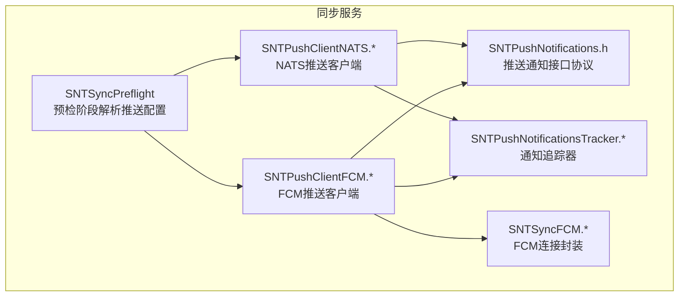
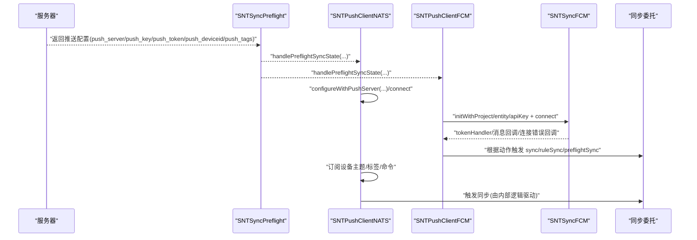
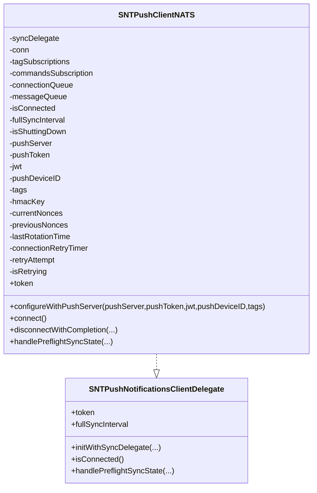
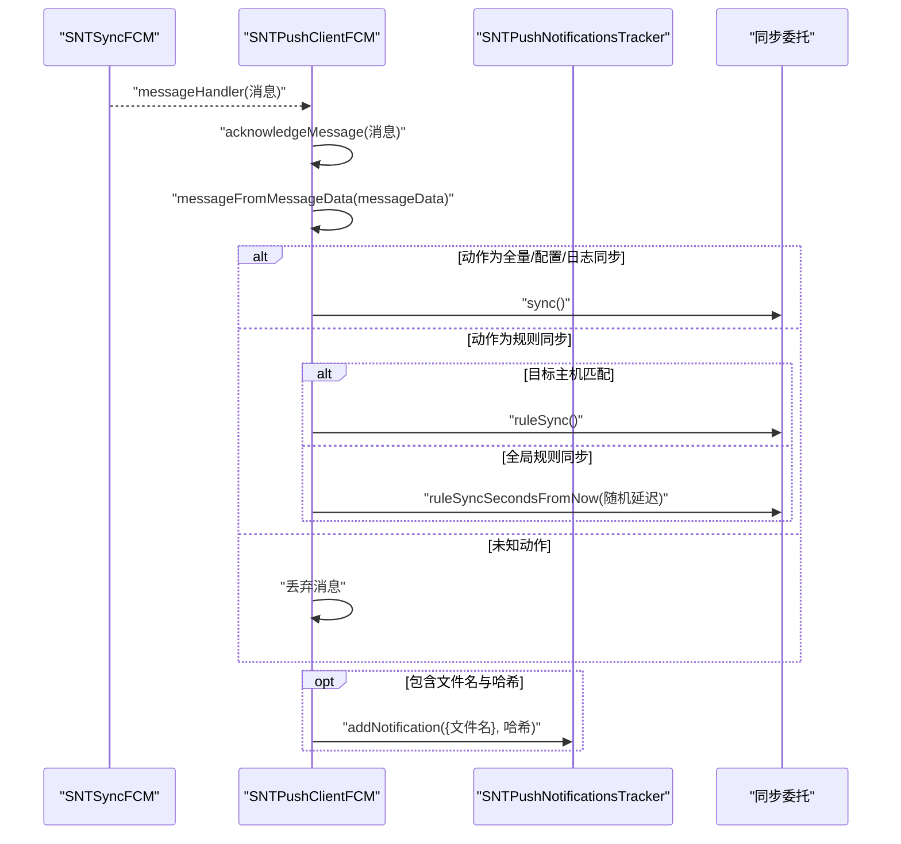
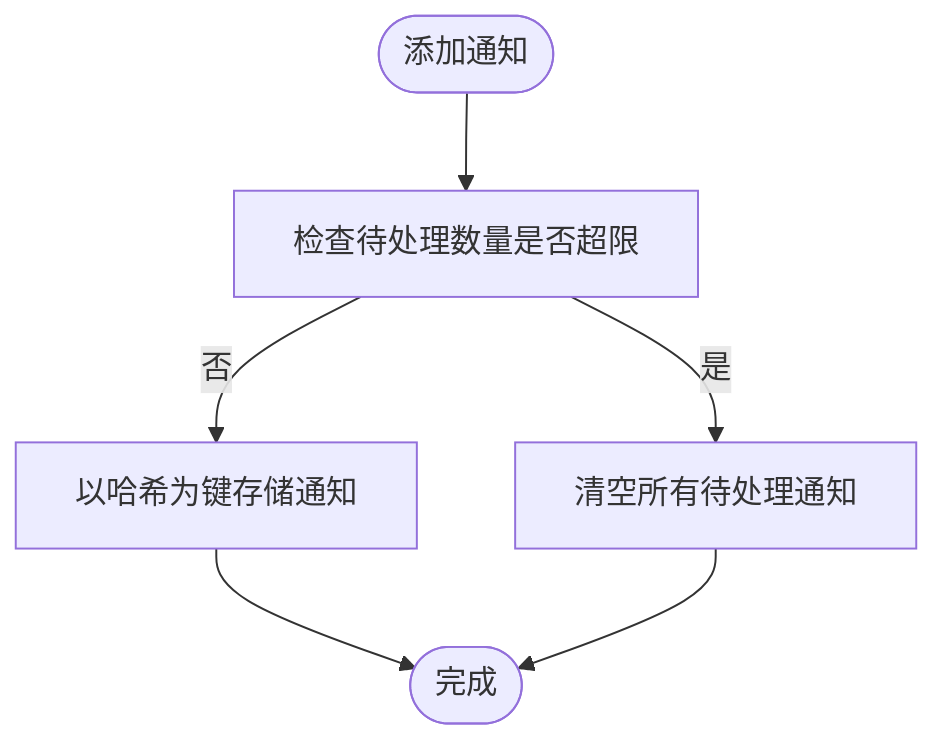
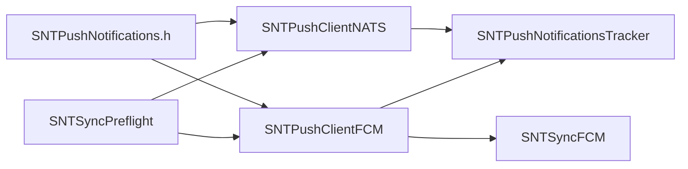

# 推送通知

<cite>
**本文引用的文件**
- [SNTPushClientNATS.h](file://Source/santasyncservice/SNTPushClientNATS.h)
- [SNTPushClientNATS.mm](file://Source/santasyncservice/SNTPushClientNATS.mm)
- [SNTPushClientFCM.h](file://Source/santasyncservice/SNTPushClientFCM.h)
- [SNTPushClientFCM.mm](file://Source/santasyncservice/SNTPushClientFCM.mm)
- [SNTPushNotifications.h](file://Source/santasyncservice/SNTPushNotifications.h)
- [SNTPushNotificationsTracker.h](file://Source/santasyncservice/SNTPushNotificationsTracker.h)
- [SNTPushNotificationsTracker.mm](file://Source/santasyncservice/SNTPushNotificationsTracker.mm)
- [SNTSyncFCM.h](file://Source/santasyncservice/SNTSyncFCM.h)
- [SNTSyncFCM.mm](file://Source/santasyncservice/SNTSyncFCM.mm)
- [SNTSyncPreflight.mm](file://Source/santasyncservice/SNTSyncPreflight.mm)
- [SNTPushClientNATSConnectionTest.mm](file://Source/santasyncservice/SNTPushClientNATSConnectionTest.mm)
- [SNTPushClientNATSIntegrationTest.mm](file://Source/santasyncservice/SNTPushClientNATSIntegrationTest.mm)
- [SNTPushClientNATSTest.mm](file://Source/santasyncservice/SNTPushClientNATSTest.mm)
- [SNTPushClientNATSCommandTest.mm](file://Source/santasyncservice/SNTPushClientNATSCommandTest.mm)
</cite>

## 目录
1. [简介](#简介)
2. [项目结构](#项目结构)
3. [核心组件](#核心组件)
4. [架构总览](#架构总览)
5. [组件详解](#组件详解)
6. [依赖关系分析](#依赖关系分析)
7. [性能与可靠性](#性能与可靠性)
8. [故障排查指南](#故障排查指南)
9. [结论](#结论)
10. [附录：配置与参数](#附录配置与参数)

## 简介
本技术文档面向Santa推送通知系统，聚焦于实时通知的架构设计、消息路由与分发机制，以及两种推送客户端（NATS与Firebase Cloud Messaging）的实现差异与适用场景。文档还阐述了通知追踪系统、状态管理与可靠性保障机制，说明推送消息格式、优先级处理与批量发送策略，并提供配置选项、性能优化与成本控制建议，覆盖监控、故障诊断与替代方案处理，以及多平台支持、消息模板与个性化定制能力。

## 项目结构
推送通知相关代码主要位于同步服务模块中，围绕“推送通知接口协议”“NATS推送客户端”“FCM推送客户端”“通知追踪器”“FCM连接封装”等组件协同工作。预检阶段从服务器获取推送配置，随后由具体客户端建立连接并订阅主题或监听消息流，最终通过委托触发同步任务。

图示来源
- [SNTSyncPreflight.mm](file://Source/santasyncservice/SNTSyncPreflight.mm#L318-L360)
- [SNTPushNotifications.h](file://Source/santasyncservice/SNTPushNotifications.h#L20-L40)
- [SNTPushClientNATS.mm](file://Source/santasyncservice/SNTPushClientNATS.mm#L101-L120)
- [SNTPushClientFCM.mm](file://Source/santasyncservice/SNTPushClientFCM.mm#L47-L110)
- [SNTSyncFCM.h](file://Source/santasyncservice/SNTSyncFCM.h#L29-L115)
- [SNTPushNotificationsTracker.mm](file://Source/santasyncservice/SNTPushNotificationsTracker.mm#L28-L66)

章节来源
- [SNTSyncPreflight.mm](file://Source/santasyncservice/SNTSyncPreflight.mm#L318-L360)
- [SNTPushNotifications.h](file://Source/santasyncservice/SNTPushNotifications.h#L20-L40)

## 核心组件
- 推送通知接口协议：定义客户端通用能力（连接状态、预检配置处理、令牌与全量同步间隔等），并约定与同步服务的回调委托接口。
- NATS推送客户端：基于NATS协议，使用nkey/JWT认证，支持标签订阅、命令订阅、重连与退避、nonce去重、设备ID与标签变更检测、自动重试等。
- FCM推送客户端：基于SNTSyncFCM封装，负责与Google FCM建立长连接、接收消息、解析动作、触发同步任务；具备连接错误处理与指数退避。
- 通知追踪器：维护待展示的通知映射（二进制/包哈希到名称与规则计数），限制积压上限，支持按哈希移除与规则计数递减。
- FCM连接封装：提供检查点注册、连接/确认、断开、会话配置、致命状态码、随机延迟与指数退避等能力。

章节来源
- [SNTPushNotifications.h](file://Source/santasyncservice/SNTPushNotifications.h#L20-L40)
- [SNTPushClientNATS.mm](file://Source/santasyncservice/SNTPushClientNATS.mm#L101-L120)
- [SNTPushClientFCM.mm](file://Source/santasyncservice/SNTPushClientFCM.mm#L47-L110)
- [SNTPushNotificationsTracker.mm](file://Source/santasyncservice/SNTPushNotificationsTracker.mm#L28-L66)
- [SNTSyncFCM.h](file://Source/santasyncservice/SNTSyncFCM.h#L29-L115)

## 架构总览
推送通知系统采用“预检下发配置 → 客户端按需连接 → 订阅/监听 → 解析动作 → 触发同步”的流水线式架构。NATS路径强调低延迟、高吞吐、细粒度标签路由；FCM路径强调跨平台、长连接与消息确认。

图示来源
- [SNTSyncPreflight.mm](file://Source/santasyncservice/SNTSyncPreflight.mm#L318-L360)
- [SNTPushClientNATS.mm](file://Source/santasyncservice/SNTPushClientNATS.mm#L130-L200)
- [SNTPushClientFCM.mm](file://Source/santasyncservice/SNTPushClientFCM.mm#L61-L110)
- [SNTSyncFCM.h](file://Source/santasyncservice/SNTSyncFCM.h#L65-L115)

## 组件详解

### NATS推送客户端（SNTPushClientNATS）
- 初始化与队列：初始化时创建连接队列与消息队列，避免竞态；默认等待预检配置后再连接。
- 配置与校验：对推送服务器域名进行生产/调试差异化校验（TLS前缀、后缀），支持设备ID与标签变更检测；凭据变更要求重建连接。
- 连接与重连：使用natsOptions设置URL、用户凭证（JWT+nkey）、允许重连与无限重试；内置退避与定时器重试。
- 订阅模型：支持标签订阅与命令订阅；消息处理在独立消息队列执行。
- 去重与安全：维护两代nonce集合与旋转时间，防止重放攻击；支持HMAC密钥（来自预检）用于完整性校验（见预检解析）。
- 委托交互：暴露token（返回机器ID）、全量同步间隔属性；处理预检同步状态以更新配置并尝试连接。

图示来源
- [SNTPushNotifications.h](file://Source/santasyncservice/SNTPushNotifications.h#L32-L40)
- [SNTPushClientNATS.h](file://Source/santasyncservice/SNTPushClientNATS.h#L17-L21)
- [SNTPushClientNATS.mm](file://Source/santasyncservice/SNTPushClientNATS.mm#L66-L136)
- [SNTPushClientNATS.mm](file://Source/santasyncservice/SNTPushClientNATS.mm#L130-L200)
- [SNTPushClientNATS.mm](file://Source/santasyncservice/SNTPushClientNATS.mm#L335-L364)
- [SNTPushClientNATS.mm](file://Source/santasyncservice/SNTPushClientNATS.mm#L793-L827)
- [SNTPushClientNATS.mm](file://Source/santasyncservice/SNTPushClientNATS.mm#L830-L837)

章节来源
- [SNTPushClientNATS.mm](file://Source/santasyncservice/SNTPushClientNATS.mm#L101-L120)
- [SNTPushClientNATS.mm](file://Source/santasyncservice/SNTPushClientNATS.mm#L130-L200)
- [SNTPushClientNATS.mm](file://Source/santasyncservice/SNTPushClientNATS.mm#L335-L364)
- [SNTPushClientNATS.mm](file://Source/santasyncservice/SNTPushClientNATS.mm#L793-L827)
- [SNTPushClientNATS.mm](file://Source/santasyncservice/SNTPushClientNATS.mm#L830-L837)

### Firebase Cloud Messaging推送客户端（SNTPushClientFCM）
- 初始化与监听：初始化时记录全量同步间隔与全局规则同步截止时间；若令牌未变化则直接复用；否则断开旧连接并重新建立。
- 连接与错误处理：通过SNTSyncFCM建立连接，设置tokenHandler与连接错误回调；错误时断开并回退至全量同步周期。
- 消息解析与动作分发：从FCM消息中提取blob并反序列化为字典，过滤允许键；依据动作触发同步委托（全量同步/配置同步/日志同步/规则同步/目标主机规则同步/全局规则同步延迟）。
- 通知追踪：当存在文件名与哈希时，写入通知追踪器；规则下载过程中按计数递减，直至归零触发后续流程。

图示来源
- [SNTPushClientFCM.mm](file://Source/santasyncservice/SNTPushClientFCM.mm#L84-L110)
- [SNTPushClientFCM.mm](file://Source/santasyncservice/SNTPushClientFCM.mm#L117-L163)
- [SNTPushClientFCM.mm](file://Source/santasyncservice/SNTPushClientFCM.mm#L165-L194)
- [SNTPushNotificationsTracker.mm](file://Source/santasyncservice/SNTPushNotificationsTracker.mm#L47-L66)

章节来源
- [SNTPushClientFCM.mm](file://Source/santasyncservice/SNTPushClientFCM.mm#L47-L110)
- [SNTPushClientFCM.mm](file://Source/santasyncservice/SNTPushClientFCM.mm#L117-L163)
- [SNTPushClientFCM.mm](file://Source/santasyncservice/SNTPushClientFCM.mm#L165-L194)
- [SNTSyncFCM.h](file://Source/santasyncservice/SNTSyncFCM.h#L29-L115)

### 通知追踪器（SNTPushNotificationsTracker）
- 单例模式：提供全局唯一实例，内部使用串行队列保护并发访问。
- 数据结构：以哈希为键存储通知元信息（如文件名），并维护规则计数字段。
- 限流与清理：当待处理通知超过阈值时清空缓存，避免积压导致阻塞。
- 生命周期操作：支持按哈希批量移除与按计数递减，便于规则下载完成后触发后续动作。

图示来源
- [SNTPushNotificationsTracker.mm](file://Source/santasyncservice/SNTPushNotificationsTracker.mm#L47-L66)

章节来源
- [SNTPushNotificationsTracker.h](file://Source/santasyncservice/SNTPushNotificationsTracker.h#L17-L32)
- [SNTPushNotificationsTracker.mm](file://Source/santasyncservice/SNTPushNotificationsTracker.mm#L28-L66)

### 预检阶段与推送配置（SNTSyncPreflight）
- 从服务器响应中提取推送服务器、nkey、JWT、设备ID、标签与HMAC密钥等字段，填充同步状态对象，供推送客户端使用。
- 设备ID缺失时记录警告；HMAC密钥用于后续消息完整性校验。

章节来源
- [SNTSyncPreflight.mm](file://Source/santasyncservice/SNTSyncPreflight.mm#L318-L360)

## 依赖关系分析
- 协议层：SNTPushNotifications.h定义统一接口，NATS与FCM客户端均遵循该协议，确保上层调用一致。
- NATS客户端依赖：NATS C库、SNTConfigurator（机器ID）、SNTSyncConstants（默认周期）、SNTLogging（日志）。
- FCM客户端依赖：SNTSyncFCM（连接封装）、SNTConfigurator（FCM项目/实体/API Key）、SNTLogging、SNTPushNotificationsTracker。
- 预检依赖：SNTSyncPreflight从服务器响应中注入推送配置到SNTSyncState，再由客户端消费。

图示来源
- [SNTPushNotifications.h](file://Source/santasyncservice/SNTPushNotifications.h#L20-L40)
- [SNTPushClientNATS.mm](file://Source/santasyncservice/SNTPushClientNATS.mm#L101-L120)
- [SNTPushClientFCM.mm](file://Source/santasyncservice/SNTPushClientFCM.mm#L47-L110)
- [SNTSyncPreflight.mm](file://Source/santasyncservice/SNTSyncPreflight.mm#L318-L360)
- [SNTSyncFCM.h](file://Source/santasyncservice/SNTSyncFCM.h#L29-L115)
- [SNTPushNotificationsTracker.mm](file://Source/santasyncservice/SNTPushNotificationsTracker.mm#L28-L66)

## 性能与可靠性
- NATS路径
  - 认证与连接：使用nkey/JWT，允许无限重连与错误回调，提升可用性；域名校验与TLS要求确保生产环境安全。
  - 去重与安全：双代nonce缓存与旋转，降低重放风险；支持HMAC密钥增强完整性校验。
  - 并发与队列：连接与消息处理分离队列，避免阻塞；自动重试与退避减少抖动。
- FCM路径
  - 连接稳定性：指数退避与最大回退时间控制，网络恢复后延迟重连；致命HTTP状态码可配置。
  - 消息确认：每条消息必须确认，避免重复投递；错误时断开并回退到全量同步周期。
  - 负载均衡：全局规则同步支持随机延迟，缓解集中压力。
- 通知追踪
  - 待处理上限控制，防止内存膨胀；规则计数递减确保规则下载完成后触发后续流程。

章节来源
- [SNTPushClientNATS.mm](file://Source/santasyncservice/SNTPushClientNATS.mm#L335-L364)
- [SNTPushClientNATS.mm](file://Source/santasyncservice/SNTPushClientNATS.mm#L793-L827)
- [SNTSyncFCM.h](file://Source/santasyncservice/SNTSyncFCM.h#L65-L115)
- [SNTPushClientFCM.mm](file://Source/santasyncservice/SNTPushClientFCM.mm#L99-L110)
- [SNTPushNotificationsTracker.mm](file://Source/santasyncservice/SNTPushNotificationsTracker.mm#L47-L66)

## 故障排查指南
- NATS连接问题
  - 无配置或凭据不完整：无法建立连接；检查预检返回的服务器、nkey、JWT与设备ID。
  - 域名校验失败：生产构建要求TLS前缀与特定后缀；调试构建可绕过校验但不推荐。
  - 自动重连：观察重试计数与延迟；必要时手动断开并重新配置。
  - 测试验证：可通过集成测试模拟发布/订阅，验证连接与订阅行为。
- FCM连接问题
  - 令牌变更：若令牌变化，先断开旧连接再重新建立；错误回调会触发回退策略。
  - 致命状态码：根据配置决定是否重试；网络恢复后按退避策略重连。
  - 消息确认：未确认消息会导致重复投递；确保消息处理链路正确调用确认。
- 通知积压
  - 若待处理通知过多，追踪器会清空缓存；检查消息处理链路与规则下载进度。

章节来源
- [SNTPushClientNATS.mm](file://Source/santasyncservice/SNTPushClientNATS.mm#L130-L200)
- [SNTPushClientNATS.mm](file://Source/santasyncservice/SNTPushClientNATS.mm#L335-L364)
- [SNTPushClientNATSIntegrationTest.mm](file://Source/santasyncservice/SNTPushClientNATSIntegrationTest.mm#L122-L172)
- [SNTPushClientNATSConnectionTest.mm](file://Source/santasyncservice/SNTPushClientNATSConnectionTest.mm#L146-L173)
- [SNTPushClientNATSConnectionTest.mm](file://Source/santasyncservice/SNTPushClientNATSConnectionTest.mm#L175-L193)
- [SNTPushClientNATSConnectionTest.mm](file://Source/santasyncservice/SNTPushClientNATSConnectionTest.mm#L195-L214)
- [SNTPushClientNATSCommandTest.mm](file://Source/santasyncservice/SNTPushClientNATSCommandTest.mm#L39-L62)
- [SNTPushClientNATSTest.mm](file://Source/santasyncservice/SNTPushClientNATSTest.mm#L150-L219)
- [SNTPushClientNATSTest.mm](file://Source/santasyncservice/SNTPushClientNATSTest.mm#L185-L219)
- [SNTPushClientFCM.mm](file://Source/santasyncservice/SNTPushClientFCM.mm#L99-L110)
- [SNTPushNotificationsTracker.mm](file://Source/santasyncservice/SNTPushNotificationsTracker.mm#L47-L66)

## 结论
Santa推送通知系统通过统一协议抽象与两类客户端实现，兼顾低延迟高吞吐（NATS）与跨平台长连接（FCM）。预检阶段提供灵活的推送配置，客户端在安全、可靠与性能之间取得平衡。通知追踪器与规则计数机制进一步完善了从消息到规则应用的闭环。结合测试用例与错误处理策略，系统具备良好的可观测性与可维护性。

## 附录：配置与参数
- 预检推送配置字段（来自服务器响应）
  - 推送服务器：推送服务地址
  - nkey：用户密钥标识
  - JWT：用户令牌
  - 设备ID：目标主机标识
  - 标签：订阅标签列表
  - HMAC密钥：消息完整性校验密钥
- NATS客户端关键属性
  - 服务器域名：生产构建要求TLS前缀与特定后缀
  - 凭据：JWT与nkey组合
  - 设备ID与标签：变更时触发重连或订阅更新
  - 全量同步间隔：来自预检配置
  - 重连策略：无限重连与退避
- FCM客户端关键属性
  - 项目/实体/API Key：来自配置器
  - 全量同步间隔与全局规则同步截止时间：来自预检配置
  - 连接错误处理：致命状态码、回退与延迟重连
  - 消息确认：每条消息必须确认
- 通知追踪
  - 待处理上限：超过阈值清空
  - 规则计数：按计数递减，直至归零

章节来源
- [SNTSyncPreflight.mm](file://Source/santasyncservice/SNTSyncPreflight.mm#L318-L360)
- [SNTPushClientNATS.mm](file://Source/santasyncservice/SNTPushClientNATS.mm#L130-L200)
- [SNTPushClientNATS.mm](file://Source/santasyncservice/SNTPushClientNATS.mm#L335-L364)
- [SNTPushClientFCM.mm](file://Source/santasyncservice/SNTPushClientFCM.mm#L61-L110)
- [SNTSyncFCM.h](file://Source/santasyncservice/SNTSyncFCM.h#L65-L115)
- [SNTPushNotificationsTracker.mm](file://Source/santasyncservice/SNTPushNotificationsTracker.mm#L47-L66)