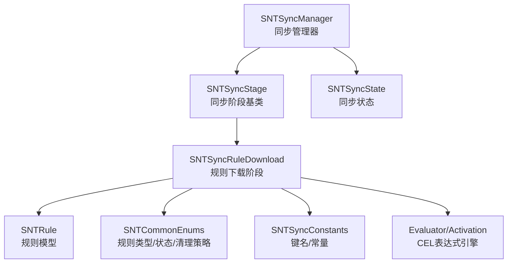
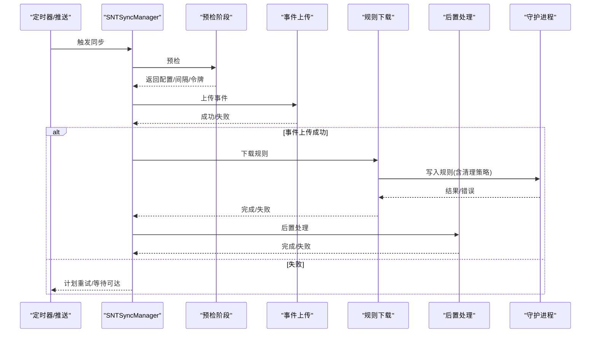
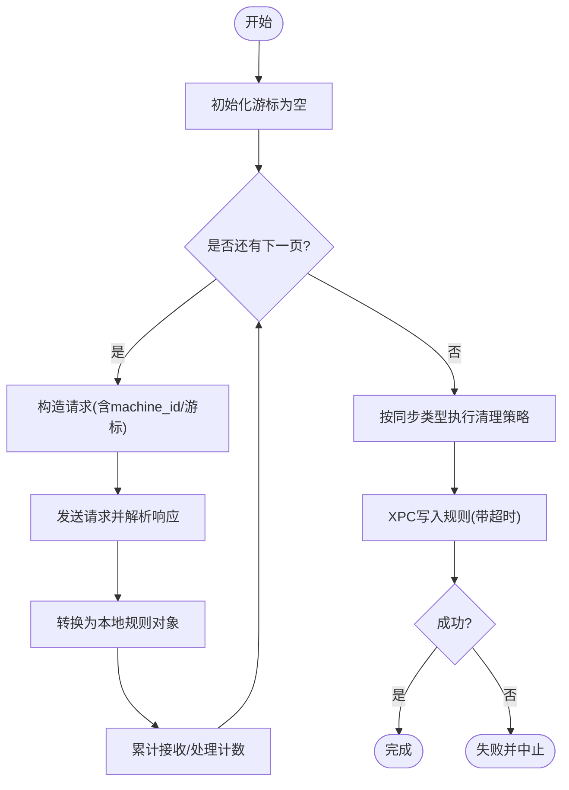
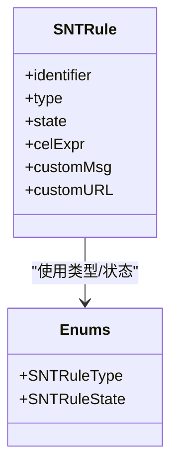
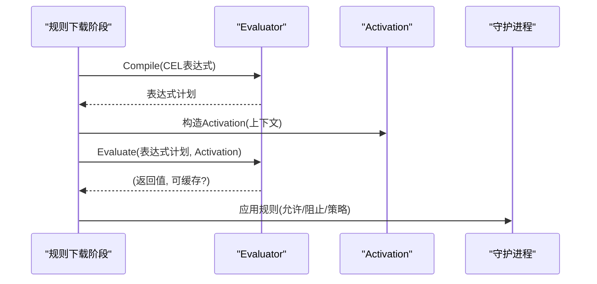
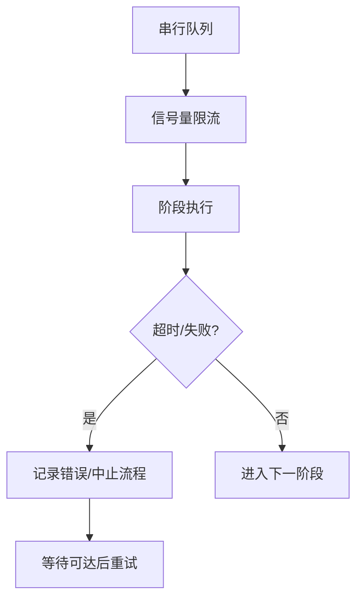
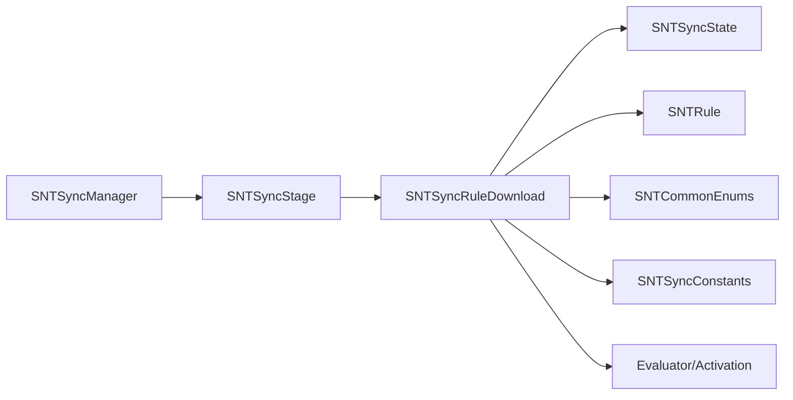

# 规则同步

<cite>
**本文引用的文件**
- [SNTSyncManager.h](file://Source/santasyncservice/SNTSyncManager.h)
- [SNTSyncManager.mm](file://Source/santasyncservice/SNTSyncManager.mm)
- [SNTSyncRuleDownload.h](file://Source/santasyncservice/SNTSyncRuleDownload.h)
- [SNTSyncRuleDownload.mm](file://Source/santasyncservice/SNTSyncRuleDownload.mm)
- [SNTSyncStage.h](file://Source/santasyncservice/SNTSyncStage.h)
- [SNTSyncState.h](file://Source/santasyncservice/SNTSyncState.h)
- [SNTSyncConstants.h](file://Source/common/SNTSyncConstants.h)
- [SNTRule.h](file://Source/common/SNTRule.h)
- [SNTCommonEnums.h](file://Source/common/SNTCommonEnums.h)
- [Evaluator.h](file://Source/common/cel/Evaluator.h)
- [Evaluator.mm](file://Source/common/cel/Evaluator.mm)
- [Activation.h](file://Source/common/cel/Activation.h)
</cite>

## 目录
1. [简介](#简介)
2. [项目结构](#项目结构)
3. [核心组件](#核心组件)
4. [架构总览](#架构总览)
5. [详细组件分析](#详细组件分析)
6. [依赖分析](#依赖分析)
7. [性能考虑](#性能考虑)
8. [故障排查指南](#故障排查指南)
9. [结论](#结论)
10. [附录](#附录)

## 简介
本文件面向Santa规则同步能力，系统化阐述规则下载的批处理机制、增量更新策略与冲突解决算法；详解CEL表达式规则的解析、编译与执行流程；说明规则优先级管理、依赖关系处理与有效性验证；给出并发控制、事务管理与回滚机制；并提供规则格式规范、性能优化与存储策略，以及监控、诊断与数据一致性保障方法，并覆盖与不同管理服务器的集成方案与API兼容性。

## 项目结构
围绕规则同步的关键代码位于以下模块：
- 同步服务入口与调度：SNTSyncManager（头/实现）
- 同步阶段基类：SNTSyncStage
- 规则下载阶段：SNTSyncRuleDownload（头/实现）
- 同步状态容器：SNTSyncState
- 常量与键名：SNTSyncConstants
- 规则模型：SNTRule
- 公共枚举与清理策略：SNTCommonEnums
- CEL表达式引擎：Evaluator、Activation

图表来源
- [SNTSyncManager.mm](file://Source/santasyncservice/SNTSyncManager.mm#L296-L400)
- [SNTSyncStage.h](file://Source/santasyncservice/SNTSyncStage.h#L22-L78)
- [SNTSyncRuleDownload.mm](file://Source/santasyncservice/SNTSyncRuleDownload.mm#L395-L504)
- [SNTSyncState.h](file://Source/santasyncservice/SNTSyncState.h#L25-L116)
- [SNTRule.h](file://Source/common/SNTRule.h#L15-L129)
- [SNTCommonEnums.h](file://Source/common/SNTCommonEnums.h#L50-L120)
- [SNTSyncConstants.h](file://Source/common/SNTSyncConstants.h#L115-L166)
- [Evaluator.h](file://Source/common/cel/Evaluator.h#L35-L85)
- [Activation.h](file://Source/common/cel/Activation.h#L35-L94)

章节来源
- [SNTSyncManager.mm](file://Source/santasyncservice/SNTSyncManager.mm#L296-L400)
- [SNTSyncRuleDownload.mm](file://Source/santasyncservice/SNTSyncRuleDownload.mm#L395-L504)

## 核心组件
- 同步管理器（SNTSyncManager）：负责周期性与推送触发的全量/增量同步编排，串行队列与信号量限流，网络可达性监听与重试，事件上传、规则下载、后置处理的流水线串联。
- 同步阶段（SNTSyncStage）：定义每个阶段的通用请求构造、发送与响应解析接口，提供阶段URL生成与会话封装。
- 规则下载阶段（SNTSyncRuleDownload）：从服务器拉取规则批次，转换为本地规则对象，调用守护进程写入数据库，按同步类型执行清理策略，并进行通知与回滚提示。
- 同步状态（SNTSyncState）：贯穿各阶段的状态容器，承载会话、机器信息、推送配置、计数统计、协议版本等。
- 规则模型（SNTRule）：抽象规则标识、类型、状态、CEL表达式、自定义消息/链接、时间戳等属性。
- 公共枚举（SNTCommonEnums）：规则类型、状态、清理策略、同步类型等，决定优先级与行为。
- CEL引擎（Evaluator/Activation）：编译CEL表达式为可执行计划，基于Activation上下文求值，返回允许/拒绝或策略枚举结果。

章节来源
- [SNTSyncManager.h](file://Source/santasyncservice/SNTSyncManager.h#L24-L78)
- [SNTSyncManager.mm](file://Source/santasyncservice/SNTSyncManager.mm#L196-L262)
- [SNTSyncStage.h](file://Source/santasyncservice/SNTSyncStage.h#L22-L78)
- [SNTSyncRuleDownload.h](file://Source/santasyncservice/SNTSyncRuleDownload.h#L19-L23)
- [SNTSyncRuleDownload.mm](file://Source/santasyncservice/SNTSyncRuleDownload.mm#L402-L472)
- [SNTSyncState.h](file://Source/santasyncservice/SNTSyncState.h#L25-L116)
- [SNTRule.h](file://Source/common/SNTRule.h#L15-L129)
- [SNTCommonEnums.h](file://Source/common/SNTCommonEnums.h#L50-L120)
- [Evaluator.h](file://Source/common/cel/Evaluator.h#L35-L85)
- [Evaluator.mm](file://Source/common/cel/Evaluator.mm#L91-L172)
- [Activation.h](file://Source/common/cel/Activation.h#L35-L94)

## 架构总览
规则同步采用“预检—事件上传—规则下载—后置处理”的流水线，结合推送与定时器驱动，确保在弱网/离线场景下的稳健性与一致性。

图表来源
- [SNTSyncManager.mm](file://Source/santasyncservice/SNTSyncManager.mm#L296-L400)
- [SNTSyncManager.mm](file://Source/santasyncservice/SNTSyncManager.mm#L402-L500)
- [SNTSyncRuleDownload.mm](file://Source/santasyncservice/SNTSyncRuleDownload.mm#L402-L472)

## 详细组件分析

### 批处理与增量更新机制
- 批次拉取：规则下载阶段通过游标循环分页拉取，直至服务器返回空游标，期间累计接收/处理计数。
- 增量策略：根据同步类型选择清理策略：
  - 正常：不清理已有规则
  - 清理：清理非传递规则
  - 清理全部：清理所有规则
- 写入与超时：通过守护进程XPC接口批量写入，设置超时避免阻塞；若超时或失败，记录错误并中止后续流程。

图表来源
- [SNTSyncRuleDownload.mm](file://Source/santasyncservice/SNTSyncRuleDownload.mm#L91-L154)
- [SNTSyncRuleDownload.mm](file://Source/santasyncservice/SNTSyncRuleDownload.mm#L402-L472)
- [SNTCommonEnums.h](file://Source/common/SNTCommonEnums.h#L189-L202)

章节来源
- [SNTSyncRuleDownload.mm](file://Source/santasyncservice/SNTSyncRuleDownload.mm#L91-L154)
- [SNTSyncRuleDownload.mm](file://Source/santasyncservice/SNTSyncRuleDownload.mm#L402-L472)
- [SNTCommonEnums.h](file://Source/common/SNTCommonEnums.h#L189-L202)

### 冲突解决与优先级管理
- 规则优先级：规则类型按枚举顺序具备天然优先级（如签名ID > 证书 > TeamID > 二进制 > CDHash），用于判定同主体多条规则时的生效顺序。
- 状态语义：
  - 允许/静默阻止/移除/编译器允许/传递允许/本地二进制/本地签名ID
  - CEL规则在v1/v2中以不同状态标识，最终由CEL引擎求值决定允许/阻止或策略枚举
- 冲突处理：
  - 当存在多条针对同一标识符的规则时，依据类型优先级与状态语义确定最终决策
  - 对于CEL规则，优先执行CEL求值，再回退到静态规则状态

图表来源
- [SNTRule.h](file://Source/common/SNTRule.h#L15-L129)
- [SNTCommonEnums.h](file://Source/common/SNTCommonEnums.h#L50-L120)

章节来源
- [SNTCommonEnums.h](file://Source/common/SNTCommonEnums.h#L50-L120)
- [SNTRule.h](file://Source/common/SNTRule.h#L15-L129)

### CEL表达式解析、编译与执行
- 编译期：
  - 初始化编译器，注册标准库与字符串扩展函数
  - 链接协议消息反射，注入变量类型，构建编译器
  - 将CEL表达式编译为AST并校验，生成可执行表达式计划
- 运行期：
  - 基于Activation上下文（可执行文件、参数、环境、UID、工作目录等）求值
  - 返回布尔值映射为允许/阻止，或直接返回策略枚举；错误以状态形式返回
  - 支持结果缓存标记，便于上层缓存策略

图表来源
- [Evaluator.h](file://Source/common/cel/Evaluator.h#L35-L85)
- [Evaluator.mm](file://Source/common/cel/Evaluator.mm#L91-L172)
- [Activation.h](file://Source/common/cel/Activation.h#L35-L94)
- [SNTSyncRuleDownload.mm](file://Source/santasyncservice/SNTSyncRuleDownload.mm#L395-L504)

章节来源
- [Evaluator.h](file://Source/common/cel/Evaluator.h#L35-L85)
- [Evaluator.mm](file://Source/common/cel/Evaluator.mm#L91-L172)
- [Activation.h](file://Source/common/cel/Activation.h#L35-L94)

### 并发控制、事务管理与回滚
- 并发控制：
  - 使用串行队列保证同步阶段串行执行，避免资源竞争
  - 使用信号量限制同时进行的同步请求数量，防止过载
- 事务与回滚：
  - 规则写入通过守护进程接口批量提交，失败时记录错误并中止后续阶段
  - 清理策略在写入前按同步类型执行，避免脏数据残留
- 超时与重试：
  - 写入与各阶段请求均设置超时；网络不可达时启动可达性监听，恢复后自动重试

图表来源
- [SNTSyncManager.mm](file://Source/santasyncservice/SNTSyncManager.mm#L196-L262)
- [SNTSyncManager.mm](file://Source/santasyncservice/SNTSyncManager.mm#L402-L500)
- [SNTSyncRuleDownload.mm](file://Source/santasyncservice/SNTSyncRuleDownload.mm#L402-L472)

章节来源
- [SNTSyncManager.mm](file://Source/santasyncservice/SNTSyncManager.mm#L196-L262)
- [SNTSyncManager.mm](file://Source/santasyncservice/SNTSyncManager.mm#L402-L500)
- [SNTSyncRuleDownload.mm](file://Source/santasyncservice/SNTSyncRuleDownload.mm#L402-L472)

### 规则格式规范与有效性验证
- 键名与字段：
  - 规则标识、策略、类型、自定义消息/链接、CEL表达式、注释等
  - 事件与规则相关键名统一由常量定义，确保跨模块一致性
- 有效性：
  - 规则必须具备有效标识符；未知策略/类型将被忽略并记录日志
  - 文件访问规则（FAA）在v2中新增路径/进程/选项等字段，需满足校验规则

章节来源
- [SNTSyncConstants.h](file://Source/common/SNTSyncConstants.h#L115-L166)
- [SNTSyncRuleDownload.mm](file://Source/santasyncservice/SNTSyncRuleDownload.mm#L290-L347)

### 存储策略与一致性
- 数据落盘：通过守护进程接口批量写入数据库，减少频繁IO
- 清理策略：按同步类型在写入前清理，避免历史规则干扰
- 一致性保障：预检阶段获取服务器配置，后置阶段更新同步状态，确保客户端与服务器状态对齐

章节来源
- [SNTSyncRuleDownload.mm](file://Source/santasyncservice/SNTSyncRuleDownload.mm#L402-L472)
- [SNTSyncManager.mm](file://Source/santasyncservice/SNTSyncManager.mm#L296-L400)

### 监控、故障诊断与数据一致性
- 指标与计数：记录规则接收/处理数量、事件批次大小、推送连接状态等
- 日志与告警：关键路径输出调试/错误日志，失败时返回明确状态码
- 重试与可达性：网络不可达时启动监听，恢复后立即重试
- 一致性检查：后置阶段更新同步设置，确保配置与状态一致

章节来源
- [SNTSyncState.h](file://Source/santasyncservice/SNTSyncState.h#L98-L116)
- [SNTSyncManager.mm](file://Source/santasyncservice/SNTSyncManager.mm#L502-L539)
- [SNTSyncManager.mm](file://Source/santasyncservice/SNTSyncManager.mm#L366-L400)

### 与管理服务器的集成与API兼容
- 协议版本：支持v1/v2协议，通过预检阶段协商；v2启用推送与新特性
- 认证与加密：支持服务端证书固定、客户端证书/CommonName/Iusser认证；HTTPS强制
- 推送：FCM/NATS推送可选，推送配置在预检后下发并动态调整全量同步间隔
- 键名与字段：统一常量定义，确保与服务器约定一致

章节来源
- [SNTSyncManager.mm](file://Source/santasyncservice/SNTSyncManager.mm#L418-L500)
- [SNTSyncConstants.h](file://Source/common/SNTSyncConstants.h#L1-L166)

## 依赖分析
- 组件耦合：
  - SNTSyncManager依赖SNTSyncStage族与SNTSyncState，形成清晰的流水线
  - SNTSyncRuleDownload依赖SNTRule、SNTCommonEnums、SNTSyncConstants与CEL引擎
- 外部依赖：
  - 网络栈（NSURLSession）、推送客户端（FCM/NATS）、守护进程XPC
- 循环依赖：
  - 无明显循环依赖；阶段与状态单向依赖管理器

图表来源
- [SNTSyncManager.mm](file://Source/santasyncservice/SNTSyncManager.mm#L296-L400)
- [SNTSyncStage.h](file://Source/santasyncservice/SNTSyncStage.h#L22-L78)
- [SNTSyncRuleDownload.mm](file://Source/santasyncservice/SNTSyncRuleDownload.mm#L395-L504)
- [SNTSyncState.h](file://Source/santasyncservice/SNTSyncState.h#L25-L116)
- [SNTRule.h](file://Source/common/SNTRule.h#L15-L129)
- [SNTCommonEnums.h](file://Source/common/SNTCommonEnums.h#L50-L120)
- [SNTSyncConstants.h](file://Source/common/SNTSyncConstants.h#L115-L166)
- [Evaluator.h](file://Source/common/cel/Evaluator.h#L35-L85)
- [Activation.h](file://Source/common/cel/Activation.h#L35-L94)

章节来源
- [SNTSyncManager.mm](file://Source/santasyncservice/SNTSyncManager.mm#L296-L400)
- [SNTSyncRuleDownload.mm](file://Source/santasyncservice/SNTSyncRuleDownload.mm#L395-L504)

## 性能考虑
- 批处理与分页：游标分页避免一次性拉取过多规则，降低内存峰值
- 串行队列与限流：避免并发写入导致的锁争用与抖动
- 超时与背压：阶段与写入超时防止阻塞，配合重试与可达性监听提升鲁棒性
- CEL编译复用：表达式计划可缓存（实现层面支持），减少重复编译开销
- 传输压缩：支持多种内容编码，按配置选择以平衡带宽与CPU

章节来源
- [SNTSyncRuleDownload.mm](file://Source/santasyncservice/SNTSyncRuleDownload.mm#L91-L154)
- [SNTSyncManager.mm](file://Source/santasyncservice/SNTSyncManager.mm#L196-L262)
- [Evaluator.mm](file://Source/common/cel/Evaluator.mm#L91-L172)
- [SNTSyncState.h](file://Source/santasyncservice/SNTSyncState.h#L98-L116)

## 故障排查指南
- 常见状态与原因：
  - 缺少同步基础URL/机器ID：无法发起同步
  - 守护进程超时：XPC通信异常或写入阻塞
  - 事件上传失败：网络问题或服务器拒绝
  - 规则下载失败：服务器错误或规则无效
- 排查步骤：
  - 检查网络与HTTPS配置、证书固定与客户端证书
  - 查看可达性监听是否生效，确认重试逻辑
  - 关注CEL编译/求值错误，核对表达式语法与上下文
  - 核对规则类型/状态枚举与服务器协议版本一致性

章节来源
- [SNTCommonEnums.h](file://Source/common/SNTCommonEnums.h#L147-L168)
- [SNTSyncManager.mm](file://Source/santasyncservice/SNTSyncManager.mm#L402-L500)
- [Evaluator.mm](file://Source/common/cel/Evaluator.mm#L141-L172)

## 结论
Santa规则同步通过严格的流水线设计、清晰的优先级与清理策略、完善的并发与容错机制，实现了在复杂网络与多样化规则形态下的高可靠与高性能。CEL引擎的引入进一步提升了规则表达力与运行效率。建议在生产环境中结合推送与定时器策略，合理配置清理与批处理参数，并持续监控指标与日志以保障一致性与可观测性。

## 附录
- 关键键名与字段参考：见同步常量定义
- 规则类型与状态枚举：见公共枚举
- 同步类型与清理策略：见公共枚举

章节来源
- [SNTSyncConstants.h](file://Source/common/SNTSyncConstants.h#L115-L166)
- [SNTCommonEnums.h](file://Source/common/SNTCommonEnums.h#L50-L120)
- [SNTCommonEnums.h](file://Source/common/SNTCommonEnums.h#L189-L202)