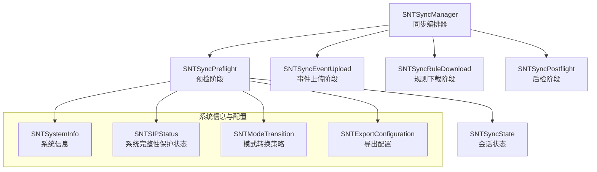
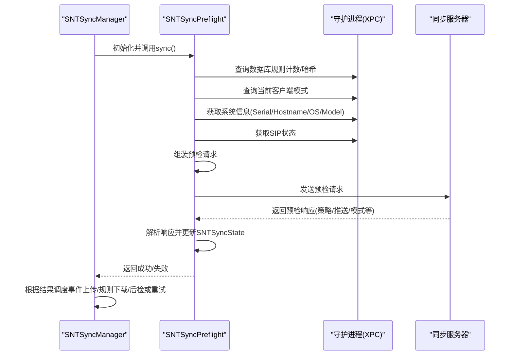
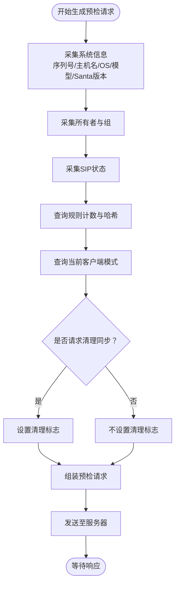
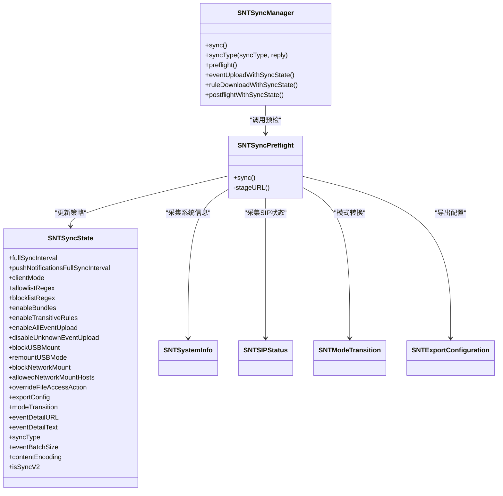
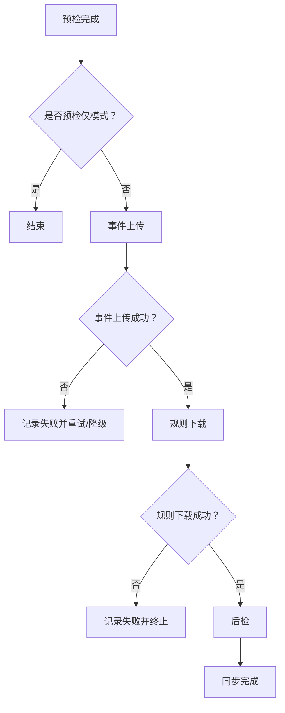

# 预检机制

<cite>
**本文引用的文件**
- [SNTSyncPreflight.h](file://Source/santasyncservice/SNTSyncPreflight.h)
- [SNTSyncPreflight.mm](file://Source/santasyncservice/SNTSyncPreflight.mm)
- [SNTSyncManager.h](file://Source/santasyncservice/SNTSyncManager.h)
- [SNTSyncManager.mm](file://Source/santasyncservice/SNTSyncManager.mm)
- [SNTSyncState.h](file://Source/santasyncservice/SNTSyncState.h)
- [SNTSyncState.mm](file://Source/santasyncservice/SNTSyncState.mm)
- [SNTSyncConstants.h](file://Source/common/SNTSyncConstants.h)
- [SNTSyncLogging.h](file://Source/santasyncservice/SNTSyncLogging.h)
- [SNTSyncLogging.mm](file://Source/santasyncservice/SNTSyncLogging.mm)
- [SNTSystemInfo.h](file://Source/common/SNTSystemInfo.h)
- [SNTSystemInfo.mm](file://Source/common/SNTSystemInfo.mm)
- [SNTSIPStatus.h](file://Source/common/SNTSIPStatus.h)
- [SNTSIPStatus.mm](file://Source/common/SNTSIPStatus.mm)
- [SNTModeTransition.h](file://Source/common/SNTModeTransition.h)
- [SNTModeTransition.mm](file://Source/common/SNTModeTransition.mm)
- [SNTExportConfiguration.h](file://Source/common/SNTExportConfiguration.h)
- [SNTExportConfiguration.mm](file://Source/common/SNTExportConfiguration.mm)
- [SNTXPCControlInterface.h](file://Source/common/SNTXPCControlInterface.h)
- [SNTXPCControlInterface.mm](file://Source/common/SNTXPCControlInterface.mm)
- [ProtoTraits.h](file://Source/santasyncservice/ProtoTraits.h)
- [syncv2/v2.pb.h](file://Source/santasyncservice/syncv2/v2.pb.h)
- [SNTSyncPreflight 测试数据 basic.json](file://Source/santasyncservice/testdata/sync_preflight_basic.json)
- [SNTSyncPreflight 测试数据 lockdown.json](file://Source/santasyncservice/testdata/sync_preflight_lockdown.json)
- [SNTSyncPreflight 测试数据 standalone.json](file://Source/santasyncservice/testdata/sync_preflight_standalone.json)
- [SNTSyncPreflight 测试数据 request.json](file://Source/santasyncservice/testdata/sync_preflight_request.json)
- [SNTSyncPreflight 测试数据 request_v2.json](file://Source/santasyncservice/testdata/sync_preflight_request_v2.json)
- [SNTSyncPreflight 测试数据 turn_on_blockusb.json](file://Source/santasyncservice/testdata/sync_preflight_turn_on_blockusb.json)
- [SNTSyncPreflight 测试数据 turn_off_blockusb.json](file://Source/santasyncservice/testdata/sync_preflight_turn_off_blockusb.json)
- [SNTSyncPreflight 测试数据 blockusb_absent.json](file://Source/santasyncservice/testdata/sync_preflight_blockusb_absent.json)
</cite>

## 目录
1. [简介](#简介)
2. [项目结构](#项目结构)
3. [核心组件](#核心组件)
4. [架构总览](#架构总览)
5. [详细组件分析](#详细组件分析)
6. [依赖关系分析](#依赖关系分析)
7. [性能考量](#性能考量)
8. [故障排除指南](#故障排除指南)
9. [结论](#结论)
10. [附录](#附录)

## 简介
本文件面向Santa同步子系统的“预检”阶段，提供从请求生成、系统状态采集与配置验证，到响应解析、服务器指令处理与策略更新的完整技术说明。文档还覆盖三种预检模式（基本、锁定、独立）的行为差异与适用场景，预检失败的处理策略、重试与降级方案，以及预检相关配置参数、性能优化与故障排除方法，并给出日志分析、监控告警与调试工具的使用建议。

## 项目结构
预检机制位于同步服务模块中，围绕SNTSyncManager组织的同步流水线展开。预检阶段负责向服务器查询并应用策略，同时决定后续事件上传、规则下载与后检阶段的执行路径。

图表来源
- [SNTSyncManager.mm](file://Source/santasyncservice/SNTSyncManager.mm#L297-L400)
- [SNTSyncPreflight.mm](file://Source/santasyncservice/SNTSyncPreflight.mm#L406-L428)
- [SNTSyncState.h](file://Source/santasyncservice/SNTSyncState.h#L25-L115)
- [SNTSystemInfo.h](file://Source/common/SNTSystemInfo.h)
- [SNTSIPStatus.h](file://Source/common/SNTSIPStatus.h)
- [SNTModeTransition.h](file://Source/common/SNTModeTransition.h)
- [SNTExportConfiguration.h](file://Source/common/SNTExportConfiguration.h)

章节来源
- [SNTSyncManager.mm](file://Source/santasyncservice/SNTSyncManager.mm#L297-L400)
- [SNTSyncPreflight.mm](file://Source/santasyncservice/SNTSyncPreflight.mm#L406-L428)
- [SNTSyncState.h](file://Source/santasyncservice/SNTSyncState.h#L25-L115)

## 核心组件
- 预检阶段（SNTSyncPreflight）
  - 负责生成预检请求、采集系统状态、解析服务器响应并更新SNTSyncState中的策略字段。
  - 支持协议版本切换（v1/v2），在v2中处理推送配置、模式转换、网络挂载控制等扩展能力。
- 同步管理器（SNTSyncManager）
  - 组织预检、事件上传、规则下载、后检的串行流水线；根据预检结果调度后续阶段与定时器。
  - 处理预检失败后的重试与降级（缩短全量同步间隔）。
- 同步状态（SNTSyncState）
  - 作为跨阶段共享的数据载体，承载服务器下发的策略、计数、批大小、推送配置、模式转换等。
- 系统信息与配置（SNTSystemInfo、SNTSIPStatus、SNTModeTransition、SNTExportConfiguration）
  - 提供机器ID、主机名、OS版本、序列号、模型标识、SIP状态、导出配置等输入数据。
- 协议与常量（ProtoTraits、syncv2/v2.pb.h、SNTSyncConstants）
  - 定义预检请求/响应字段、枚举值、默认阈值与键名映射。

章节来源
- [SNTSyncPreflight.h](file://Source/santasyncservice/SNTSyncPreflight.h#L17-L20)
- [SNTSyncPreflight.mm](file://Source/santasyncservice/SNTSyncPreflight.mm#L80-L323)
- [SNTSyncManager.mm](file://Source/santasyncservice/SNTSyncManager.mm#L297-L400)
- [SNTSyncState.h](file://Source/santasyncservice/SNTSyncState.h#L25-L115)
- [SNTSystemInfo.h](file://Source/common/SNTSystemInfo.h)
- [SNTSIPStatus.h](file://Source/common/SNTSIPStatus.h)
- [SNTModeTransition.h](file://Source/common/SNTModeTransition.h)
- [SNTExportConfiguration.h](file://Source/common/SNTExportConfiguration.h)
- [ProtoTraits.h](file://Source/santasyncservice/ProtoTraits.h)
- [syncv2/v2.pb.h](file://Source/santasyncservice/syncv2/v2.pb.h)
- [SNTSyncConstants.h](file://Source/common/SNTSyncConstants.h#L15-L166)

## 架构总览
预检阶段在同步流水线中处于首位，其职责是：
- 生成预检请求：包含机器信息、系统信息、规则计数与哈希、当前客户端模式、可选的清理标志。
- 发送请求并接收响应：解析服务器返回的策略、批大小、同步间隔、推送配置、模式转换、USB/网络挂载控制等。
- 更新SNTSyncState：将服务器指令写入状态对象，供后续阶段使用。
- 决策后续流程：若为预检仅模式或后检阶段失败，流程提前结束；否则继续事件上传、规则下载与后检。

图表来源
- [SNTSyncManager.mm](file://Source/santasyncservice/SNTSyncManager.mm#L297-L400)
- [SNTSyncPreflight.mm](file://Source/santasyncservice/SNTSyncPreflight.mm#L80-L323)
- [SNTSystemInfo.mm](file://Source/common/SNTSystemInfo.mm)
- [SNTSIPStatus.mm](file://Source/common/SNTSIPStatus.mm)
- [SNTXPCControlInterface.h](file://Source/common/SNTXPCControlInterface.h)

## 详细组件分析

### 预检请求生成逻辑
- 请求字段来源
  - 机器与系统信息：机器ID、序列号、主机名、OS版本/构建、模型标识、Santa版本、所有者与组。
  - 客户端模式：来自守护进程的当前模式（监控/锁定/独立）。
  - 规则统计与哈希：二进制、证书、编译器、传递规则、团队ID、签名ID、cdhash；v2新增文件访问规则计数。
  - 推送令牌与开关：推送通知令牌与开关。
  - 清理标志：若客户端请求或首次成功同步，则携带“从干净状态开始”的标志。
- 协议版本
  - 通过模板函数支持v1/v2，v2响应包含推送服务器、nkey/JWT、设备ID、标签、HMAC密钥、模式转换、网络挂载控制等。

图表来源
- [SNTSyncPreflight.mm](file://Source/santasyncservice/SNTSyncPreflight.mm#L80-L150)
- [SNTSystemInfo.h](file://Source/common/SNTSystemInfo.h)
- [SNTSIPStatus.h](file://Source/common/SNTSIPStatus.h)
- [SNTXPCControlInterface.h](file://Source/common/SNTXPCControlInterface.h)

章节来源
- [SNTSyncPreflight.mm](file://Source/santasyncservice/SNTSyncPreflight.mm#L80-L150)

### 系统状态收集与配置验证
- 状态收集
  - 通过XPC接口从守护进程获取规则计数、规则哈希、当前模式。
  - 通过系统信息模块获取序列号、主机名、OS版本/构建、模型标识、Santa版本。
  - 通过SIP状态模块获取当前系统完整性保护状态。
- 配置验证
  - 同步基础URL必须存在且为HTTPS；若为受固定域名（pinning）范围内的域，启用v2协议。
  - 客户端可配置推送通知令牌与代理；会话配置包含拒绝重定向、用户代理、服务器/客户端证书等。

章节来源
- [SNTSyncPreflight.mm](file://Source/santasyncservice/SNTSyncPreflight.mm#L115-L143)
- [SNTSyncManager.mm](file://Source/santasyncservice/SNTSyncManager.mm#L418-L500)
- [SNTSystemInfo.mm](file://Source/common/SNTSystemInfo.mm)
- [SNTSIPStatus.mm](file://Source/common/SNTSIPStatus.mm)

### 预检响应解析与策略更新
- 响应解析要点
  - 功能开关：启用包管理、启用传递规则、全部事件上传、未知事件上传禁用。
  - 批大小：事件上传批大小，默认值由常量定义。
  - 同步间隔：全量同步最小间隔限制；推送全量同步间隔与全局规则同步截止时间。
  - 客户端模式：监控/锁定/独立模式切换。
  - 正则白/黑名单：允许/阻止路径正则。
  - USB挂载控制：开启USB挂载与强制重新挂载模式列表。
  - 文件访问动作覆盖：审计仅/AUDIT_ONLY/DISABLE/NONE。
  - 导出配置：带签名的POST目标URL与表单字段。
  - 事件详情：事件详情URL与文本。
  - 同步类型：NORMAL/CLEAN/CLEAN_ALL，遵循客户端请求优先级与服务器覆盖规则。
  - v2扩展：推送服务器地址、nkey/JWT、设备ID、标签、HMAC密钥；模式转换（撤销/按需监控模式）；网络挂载控制与被禁止挂载时的提示消息。
- 策略更新
  - 将解析得到的策略写入SNTSyncState，供后续阶段使用；对推送凭据在移交后清空以降低泄露风险。

章节来源
- [SNTSyncPreflight.mm](file://Source/santasyncservice/SNTSyncPreflight.mm#L150-L323)
- [SNTSyncPreflight.mm](file://Source/santasyncservice/SNTSyncPreflight.mm#L325-L404)
- [SNTSyncState.h](file://Source/santasyncservice/SNTSyncState.h#L44-L115)
- [SNTSyncConstants.h](file://Source/common/SNTSyncConstants.h#L15-L166)

### 不同预检模式的行为差异与适用场景
- 基本模式（监控）
  - 行为：常规授权决策，允许/阻止基于规则集；可配置白/黑名单与事件上传策略。
  - 适用：日常生产环境，平衡安全与可用性。
- 锁定模式（lockdown）
  - 行为：严格限制，仅允许明确白名单规则；适合高安全基线场景。
  - 适用：对未知软件零容忍的高敏感环境。
- 独立模式（standalone）
  - 行为：本地决策为主，减少对服务器依赖；适合离线或受限网络环境。
  - 适用：无外网访问或需要最小化外部依赖的终端。

章节来源
- [SNTSyncPreflight.mm](file://Source/santasyncservice/SNTSyncPreflight.mm#L135-L142)
- [SNTSyncPreflight.mm](file://Source/santasyncservice/SNTSyncPreflight.mm#L204-L209)
- [SNTSyncManager.mm](file://Source/santasyncservice/SNTSyncManager.mm#L204-L228)

### 预检失败处理策略、重试机制与降级方案
- 失败处理
  - 若预检失败且启用推送通知，将根据推送全量同步间隔与默认间隔的较小值进行重调度；同时启动可达性监听，网络恢复后自动触发同步。
  - 若未启用推送通知，使用默认全量同步间隔（通常为10分钟）。
- 重试与降级
  - 通过网络路径监控检测可达性变化；当网络恢复时立即触发一次同步尝试。
  - 在预检阶段失败时，避免将推送凭据继续传递给其他阶段，确保凭据生命周期可控。

章节来源
- [SNTSyncManager.mm](file://Source/santasyncservice/SNTSyncManager.mm#L349-L364)
- [SNTSyncManager.mm](file://Source/santasyncservice/SNTSyncManager.mm#L502-L539)
- [SNTSyncManager.mm](file://Source/santasyncservice/SNTSyncManager.mm#L314-L348)

### 预检配置参数清单
- 基础参数
  - 同步基础URL、机器ID、机器所有者与组、推送通知令牌、代理配置。
- 预检响应关键参数
  - 全量同步间隔、事件批大小、推送全量同步间隔、全局规则同步截止时间、客户端模式、白/黑名单正则、启用包管理、启用传递规则、全部事件上传、未知事件上传禁用、USB挂载控制、文件访问动作覆盖、导出配置、事件详情URL/文本、同步类型（NORMAL/CLEAN/CLEAN_ALL）、v2推送配置（服务器/nkey/JWT/设备ID/标签/HMAC密钥）、模式转换、网络挂载控制与被禁止挂载提示消息。
- 默认阈值
  - 最小全量同步间隔、默认全量同步间隔、默认推送全量同步间隔、默认推送全局规则同步截止时间。

章节来源
- [SNTSyncState.h](file://Source/santasyncservice/SNTSyncState.h#L44-L115)
- [SNTSyncConstants.h](file://Source/common/SNTSyncConstants.h#L15-L166)
- [SNTSyncPreflight.mm](file://Source/santasyncservice/SNTSyncPreflight.mm#L181-L203)
- [SNTSyncPreflight.mm](file://Source/santasyncservice/SNTSyncPreflight.mm#L187-L198)
- [SNTSyncPreflight.mm](file://Source/santasyncservice/SNTSyncPreflight.mm#L268-L270)

## 依赖关系分析
- 组件耦合
  - SNTSyncManager依赖SNTSyncPreflight完成预检；预检结果驱动后续阶段的执行与定时器调度。
  - SNTSyncPreflight依赖守护进程XPC接口获取规则计数/哈希与当前模式；依赖系统信息模块与SIP状态模块提供硬件/系统上下文。
  - SNTSyncState作为跨阶段共享对象，承载服务器下发策略与运行期状态。
- 外部依赖
  - 协议定义来自syncv2/v2.pb.h与ProtoTraits；常量定义来自SNTSyncConstants。
  - 日志统一通过SNTSyncLogging接口输出。

图表来源
- [SNTSyncManager.mm](file://Source/santasyncservice/SNTSyncManager.mm#L297-L400)
- [SNTSyncPreflight.mm](file://Source/santasyncservice/SNTSyncPreflight.mm#L406-L428)
- [SNTSyncState.h](file://Source/santasyncservice/SNTSyncState.h#L25-L115)
- [SNTSystemInfo.h](file://Source/common/SNTSystemInfo.h)
- [SNTSIPStatus.h](file://Source/common/SNTSIPStatus.h)
- [SNTModeTransition.h](file://Source/common/SNTModeTransition.h)
- [SNTExportConfiguration.h](file://Source/common/SNTExportConfiguration.h)

## 性能考量
- 事件批大小
  - 预检响应中的批大小直接影响事件上传吞吐；过小增加请求次数，过大可能影响首包延迟与服务器处理压力。
- 同步间隔
  - 全量同步间隔与推送全量同步间隔共同决定同步频率；推送启用时优先使用推送周期，未启用时回落到默认周期。
- v2协议与推送
  - v2协议支持更细粒度的推送配置与模式转换，有助于降低不必要的全量同步开销。
- 会话与认证
  - 使用固定根证书或客户端证书可提升安全性，但需注意证书链与PINNING带来的握手成本；内容编码可减少传输体积。

章节来源
- [SNTSyncPreflight.mm](file://Source/santasyncservice/SNTSyncPreflight.mm#L181-L203)
- [SNTSyncManager.mm](file://Source/santasyncservice/SNTSyncManager.mm#L314-L348)
- [SNTSyncConstants.h](file://Source/common/SNTSyncConstants.h#L150-L166)

## 故障排除指南
- 常见问题定位
  - 缺失同步基础URL或机器ID：预检无法启动，需检查配置；日志会记录缺失项并返回相应状态码。
  - 非HTTPS同步基础URL：会记录警告，建议改为HTTPS并启用PINNING。
  - 预检失败：查看日志中“预检失败”与“可达性恢复后触发新同步”的提示；确认网络连通性与服务器可达性。
  - 推送配置缺失：若启用推送但未收到服务器推送配置，客户端将记录警告；检查服务器响应与网络策略。
- 调试工具与日志
  - 使用同步日志接口输出请求/响应细节；结合测试数据（basic/lockdown/standalone/request/request_v2等）复现不同模式下的行为。
  - 通过doctor命令或命令行工具触发预检测试，观察返回状态与日志输出。

章节来源
- [SNTSyncManager.mm](file://Source/santasyncservice/SNTSyncManager.mm#L418-L500)
- [SNTSyncLogging.h](file://Source/santasyncservice/SNTSyncLogging.h)
- [SNTSyncLogging.mm](file://Source/santasyncservice/SNTSyncLogging.mm)
- [SNTSyncPreflight 测试数据 basic.json](file://Source/santasyncservice/testdata/sync_preflight_basic.json)
- [SNTSyncPreflight 测试数据 lockdown.json](file://Source/santasyncservice/testdata/sync_preflight_lockdown.json)
- [SNTSyncPreflight 测试数据 standalone.json](file://Source/santasyncservice/testdata/sync_preflight_standalone.json)
- [SNTSyncPreflight 测试数据 request.json](file://Source/santasyncservice/testdata/sync_preflight_request.json)
- [SNTSyncPreflight 测试数据 request_v2.json](file://Source/santasyncservice/testdata/sync_preflight_request_v2.json)

## 结论
预检机制通过标准化的请求生成、严格的系统状态采集与配置验证、丰富的响应解析与策略更新，为后续事件上传、规则下载与后检提供了可靠依据。借助v2协议与推送配置，系统可在保证安全的前提下实现更灵活的同步节奏与更强的实时性。针对预检失败，系统具备重试与降级策略，配合日志与监控可快速定位问题并恢复服务。

## 附录
- 关键流程图（预检到事件上传）

图表来源
- [SNTSyncManager.mm](file://Source/santasyncservice/SNTSyncManager.mm#L366-L400)