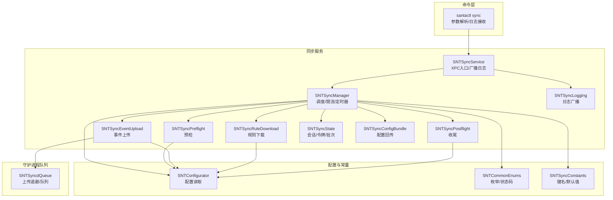
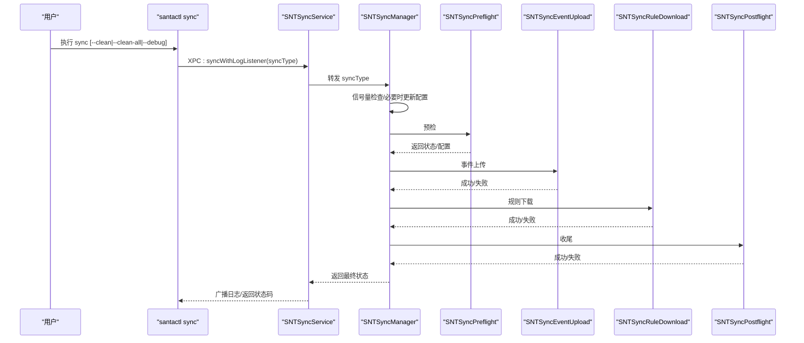
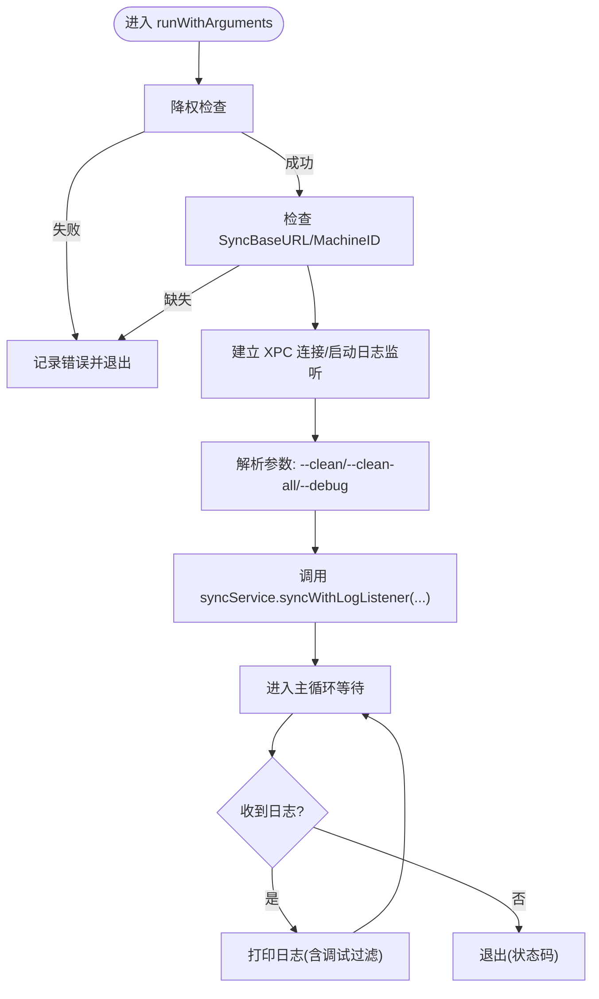
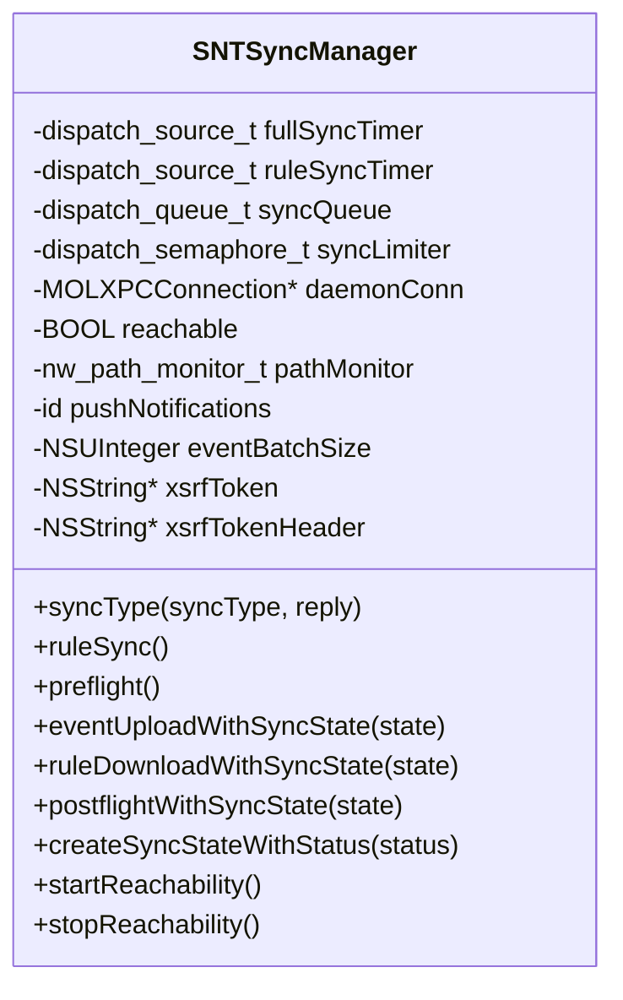
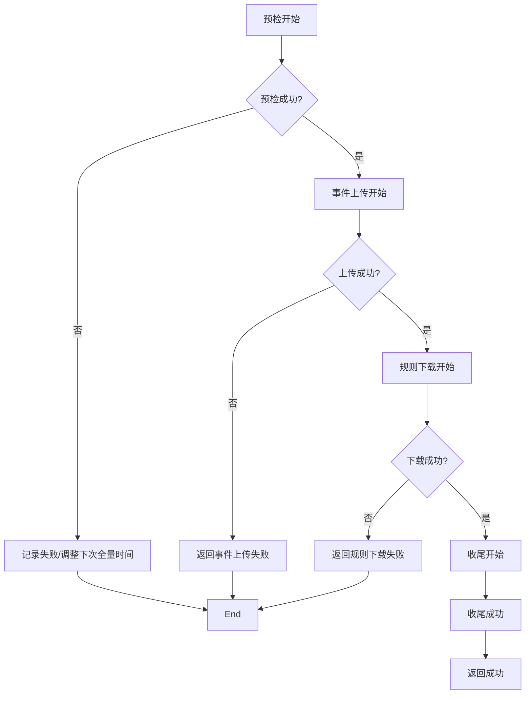
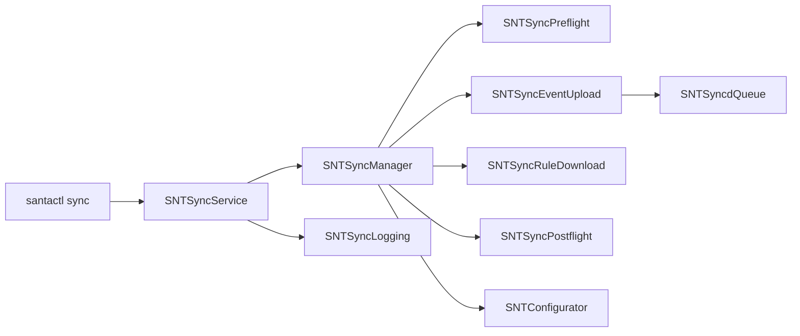

# 同步控制命令

<cite>
**本文引用的文件**
- [SNTCommandSync.mm](file://Source/santactl/Commands/SNTCommandSync.mm)
- [SNTSyncService.mm](file://Source/santasyncservice/SNTSyncService.mm)
- [SNTSyncManager.mm](file://Source/santasyncservice/SNTSyncManager.mm)
- [SNTSyncPreflight.mm](file://Source/santasyncservice/SNTSyncPreflight.mm)
- [SNTSyncEventUpload.mm](file://Source/santasyncservice/SNTSyncEventUpload.mm)
- [SNTSyncRuleDownload.mm](file://Source/santasyncservice/SNTSyncRuleDownload.mm)
- [SNTSyncPostflight.mm](file://Source/santasyncservice/SNTSyncPostflight.mm)
- [SNTSyncState.mm](file://Source/santasyncservice/SNTSyncState.mm)
- [SNTSyncConfigBundle.mm](file://Source/santasyncservice/SNTSyncConfigBundle.mm)
- [SNTSyncConstants.mm](file://Source/common/SNTSyncConstants.mm)
- [SNTCommonEnums.h](file://Source/common/SNTCommonEnums.h)
- [SNTConfigurator.mm](file://Source/common/SNTConfigurator.mm)
- [SNTSyncLogging.mm](file://Source/santasyncservice/SNTSyncLogging.mm)
- [SNTSyncdQueue.mm](file://Source/santad/SNTSyncdQueue.mm)
</cite>

## 目录
1. [简介](#简介)
2. [项目结构](#项目结构)
3. [核心组件](#核心组件)
4. [架构总览](#架构总览)
5. [详细组件分析](#详细组件分析)
6. [依赖关系分析](#依赖关系分析)
7. [性能考虑](#性能考虑)
8. [故障排查指南](#故障排查指南)
9. [结论](#结论)
10. [附录](#附录)

## 简介
本文件面向 Santa 的“同步控制命令”，系统性说明如何通过命令行触发手动同步、查询同步状态与配置，并对同步过程进行状态监控、进度跟踪与结果验证。同时覆盖强制同步（Clean/CleanAll）、增量与全量同步的执行方式，以及失败处理、重试机制与错误恢复策略；并给出同步配置优化、网络设置与性能调优建议，以及可复用的自动化脚本与集成方案。

## 项目结构
围绕同步控制命令，涉及的关键模块包括：
- 命令入口：santactl 的 sync 子命令，负责解析参数、连接同步服务并接收日志。
- 同步服务：独立进程，负责调度与执行预检、事件上传、规则下载、收尾等阶段。
- 同步管理器：串行队列与信号量协调并发，维护定时器与可达性监听。
- 阶段实现：预检、事件上传、规则下载、收尾。
- 配置与常量：同步协议版本、键值、默认间隔、清理策略等。
- 日志广播：将服务端日志推送到客户端监听器。

图表来源
- [SNTCommandSync.mm](file://Source/santactl/Commands/SNTCommandSync.mm#L60-L119)
- [SNTSyncService.mm](file://Source/santasyncservice/SNTSyncService.mm#L168-L186)
- [SNTSyncManager.mm](file://Source/santasyncservice/SNTSyncManager.mm#L204-L228)
- [SNTSyncPreflight.mm](file://Source/santasyncservice/SNTSyncPreflight.mm#L413-L427)
- [SNTSyncEventUpload.mm](file://Source/santasyncservice/SNTSyncEventUpload.mm#L465-L482)
- [SNTSyncRuleDownload.mm](file://Source/santasyncservice/SNTSyncRuleDownload.mm#L402-L472)
- [SNTSyncPostflight.mm](file://Source/santasyncservice/SNTSyncPostflight.mm#L70-L84)
- [SNTSyncState.mm](file://Source/santasyncservice/SNTSyncState.mm#L15-L22)
- [SNTSyncConfigBundle.mm](file://Source/santasyncservice/SNTSyncConfigBundle.mm#L45-L87)
- [SNTSyncLogging.mm](file://Source/santasyncservice/SNTSyncLogging.mm#L16-L23)
- [SNTConfigurator.mm](file://Source/common/SNTConfigurator.mm#L91-L115)
- [SNTCommonEnums.h](file://Source/common/SNTCommonEnums.h#L147-L161)
- [SNTSyncConstants.mm](file://Source/common/SNTSyncConstants.mm#L155-L160)
- [SNTSyncdQueue.mm](file://Source/santad/SNTSyncdQueue.mm#L37-L65)

章节来源
- [SNTCommandSync.mm](file://Source/santactl/Commands/SNTCommandSync.mm#L33-L119)
- [SNTSyncService.mm](file://Source/santasyncservice/SNTSyncService.mm#L168-L186)
- [SNTSyncManager.mm](file://Source/santasyncservice/SNTSyncManager.mm#L204-L228)

## 核心组件
- 命令入口（santactl sync）
  - 支持参数：--clean、--clean-all、--debug
  - 连接同步服务 XPC，建立匿名监听器以接收日志
  - 将同步类型与日志监听端点传递给同步服务
- 同步服务（SNTSyncService）
  - 作为 XPC 服务入口，转发同步请求到 SNTSyncManager
  - 管理日志监听者广播
- 同步管理器（SNTSyncManager）
  - 并发限制：信号量限制同时进行的同步任务数量
  - 定时器：全量同步与规则同步定时器
  - 可达性：网络恢复后自动触发同步
  - 同步链路：预检 → 事件上传 → 规则下载 → 收尾
- 阶段实现
  - 预检：协商协议版本、模式、批大小、推送配置、清理策略等
  - 事件上传：按批发送执行/访问/审计/挂载事件
  - 规则下载：拉取服务器规则并写入数据库，支持 Clean/CleanAll
  - 收尾：回传统计与配置更新
- 配置与常量
  - 同步协议版本、默认全量同步间隔、最小间隔、事件批大小
  - 清理策略映射：Normal/Clean/CleanAll
- 日志与广播
  - 服务端日志通过广播器推送给客户端监听器

章节来源
- [SNTCommandSync.mm](file://Source/santactl/Commands/SNTCommandSync.mm#L50-L119)
- [SNTSyncService.mm](file://Source/santasyncservice/SNTSyncService.mm#L168-L186)
- [SNTSyncManager.mm](file://Source/santasyncservice/SNTSyncManager.mm#L204-L228)
- [SNTSyncPreflight.mm](file://Source/santasyncservice/SNTSyncPreflight.mm#L413-L427)
- [SNTSyncEventUpload.mm](file://Source/santasyncservice/SNTSyncEventUpload.mm#L465-L482)
- [SNTSyncRuleDownload.mm](file://Source/santasyncservice/SNTSyncRuleDownload.mm#L402-L472)
- [SNTSyncPostflight.mm](file://Source/santasyncservice/SNTSyncPostflight.mm#L70-L84)
- [SNTSyncConstants.mm](file://Source/common/SNTSyncConstants.mm#L155-L160)
- [SNTCommonEnums.h](file://Source/common/SNTCommonEnums.h#L147-L161)

## 架构总览
下图展示从命令行到服务端同步链路的调用序列，包括日志广播与状态返回。

图表来源
- [SNTCommandSync.mm](file://Source/santactl/Commands/SNTCommandSync.mm#L60-L119)
- [SNTSyncService.mm](file://Source/santasyncservice/SNTSyncService.mm#L168-L186)
- [SNTSyncManager.mm](file://Source/santasyncservice/SNTSyncManager.mm#L296-L400)
- [SNTSyncPreflight.mm](file://Source/santasyncservice/SNTSyncPreflight.mm#L413-L427)
- [SNTSyncEventUpload.mm](file://Source/santasyncservice/SNTSyncEventUpload.mm#L465-L482)
- [SNTSyncRuleDownload.mm](file://Source/santasyncservice/SNTSyncRuleDownload.mm#L402-L472)
- [SNTSyncPostflight.mm](file://Source/santasyncservice/SNTSyncPostflight.mm#L70-L84)

## 详细组件分析

### 组件A：命令行同步（santactl sync）
- 功能要点
  - 参数解析：--clean、--clean-all、--debug
  - 权限降级：确保非特权运行
  - 连接同步服务：XPC 连接失效即退出
  - 日志监听：匿名 XPC Listener 接收服务端日志
  - 同步类型：根据参数选择 Normal/Clean/CleanAll
  - 状态返回：以状态码形式返回最终结果
- 关键行为
  - 若未配置 SyncBaseURL 或缺失 Machine ID，直接退出
  - --debug 仅在客户端侧开启调试日志输出
  - --clean-all 优先级高于服务器响应的 Clean 请求

图表来源
- [SNTCommandSync.mm](file://Source/santactl/Commands/SNTCommandSync.mm#L60-L119)

章节来源
- [SNTCommandSync.mm](file://Source/santactl/Commands/SNTCommandSync.mm#L33-L119)

### 组件B：同步服务（SNTSyncService）
- 功能要点
  - 初始化：降权、加载配置、连接守护进程
  - XPC 入口：syncWithLogListener，将日志监听器加入广播器
  - 导出接口：事件上传、Bundle 事件上报、推送状态查询、遥测导出
- 关键行为
  - 当启用推送通知时，根据推送状态调整全量同步周期
  - 无配置或连接异常时优雅退出

章节来源
- [SNTSyncService.mm](file://Source/santasyncservice/SNTSyncService.mm#L44-L106)
- [SNTSyncService.mm](file://Source/santasyncservice/SNTSyncService.mm#L108-L167)
- [SNTSyncService.mm](file://Source/santasyncservice/SNTSyncService.mm#L168-L186)

### 组件C：同步管理器（SNTSyncManager）
- 功能要点
  - 并发控制：信号量限制同时进行的同步任务数
  - 定时器：全量同步与规则同步定时器
  - 可达性：网络恢复后自动触发同步
  - 同步链路：预检 → 事件上传 → 规则下载 → 收尾
- 关键行为
  - --clean/--clean-all 通过更新配置包下发到守护进程
  - 预检失败时根据是否启用推送通知调整下次全量同步时间
  - 事件上传失败时返回相应状态码并停止后续流程

图表来源
- [SNTSyncManager.mm](file://Source/santasyncservice/SNTSyncManager.mm#L41-L103)
- [SNTSyncManager.mm](file://Source/santasyncservice/SNTSyncManager.mm#L204-L228)
- [SNTSyncManager.mm](file://Source/santasyncservice/SNTSyncManager.mm#L296-L400)
- [SNTSyncManager.mm](file://Source/santasyncservice/SNTSyncManager.mm#L418-L500)

章节来源
- [SNTSyncManager.mm](file://Source/santasyncservice/SNTSyncManager.mm#L204-L228)
- [SNTSyncManager.mm](file://Source/santasyncservice/SNTSyncManager.mm#L296-L400)
- [SNTSyncManager.mm](file://Source/santasyncservice/SNTSyncManager.mm#L418-L500)

### 组件D：同步阶段（预检/事件上传/规则下载/收尾）
- 预检（SNTSyncPreflight）
  - 协商协议版本、模式、批大小、推送配置、清理策略
  - 处理 Clean/CleanAll 与服务器响应的关系
- 事件上传（SNTSyncEventUpload）
  - 按批发送执行/访问/审计/挂载事件
  - 支持 Clean 同步事件上传开关
- 规则下载（SNTSyncRuleDownload）
  - 下载并转换为内部规则对象，写入数据库
  - Clean/CleanAll 对应不同清理策略
- 收尾（SNTSyncPostflight）
  - 回传规则统计与哈希，更新同步设置

图表来源
- [SNTSyncPreflight.mm](file://Source/santasyncservice/SNTSyncPreflight.mm#L306-L364)
- [SNTSyncEventUpload.mm](file://Source/santasyncservice/SNTSyncEventUpload.mm#L465-L482)
- [SNTSyncRuleDownload.mm](file://Source/santasyncservice/SNTSyncRuleDownload.mm#L402-L472)
- [SNTSyncPostflight.mm](file://Source/santasyncservice/SNTSyncPostflight.mm#L70-L84)

章节来源
- [SNTSyncPreflight.mm](file://Source/santasyncservice/SNTSyncPreflight.mm#L306-L364)
- [SNTSyncEventUpload.mm](file://Source/santasyncservice/SNTSyncEventUpload.mm#L465-L482)
- [SNTSyncRuleDownload.mm](file://Source/santasyncservice/SNTSyncRuleDownload.mm#L402-L472)
- [SNTSyncPostflight.mm](file://Source/santasyncservice/SNTSyncPostflight.mm#L70-L84)

### 组件E：同步状态与配置
- 同步状态（SNTSyncState）
  - 会话、令牌、批次大小、清理类型、推送配置等
- 配置回传（SNTSyncConfigBundle）
  - 收尾阶段将客户端模式、正则、USB/网络挂载策略、事件上传开关等回传给守护进程
- 常量与默认值（SNTSyncConstants）
  - 默认事件批大小、最小/默认全量同步间隔、推送相关默认值
- 枚举与状态码（SNTCommonEnums）
  - 同步状态码、同步类型、内容编码、推送状态等

章节来源
- [SNTSyncState.mm](file://Source/santasyncservice/SNTSyncState.mm#L15-L22)
- [SNTSyncConfigBundle.mm](file://Source/santasyncservice/SNTSyncConfigBundle.mm#L45-L87)
- [SNTSyncConstants.mm](file://Source/common/SNTSyncConstants.mm#L155-L160)
- [SNTCommonEnums.h](file://Source/common/SNTCommonEnums.h#L147-L161)
- [SNTCommonEnums.h](file://Source/common/SNTCommonEnums.h#L189-L193)

## 依赖关系分析
- 命令层依赖同步服务 XPC 接口
- 同步服务依赖同步管理器与日志广播器
- 同步管理器依赖各阶段组件、配置读取器与守护进程连接
- 阶段组件依赖配置读取器与守护进程连接
- 守护进程队列（SNTSyncdQueue）参与事件上传的退避与队列化

图表来源
- [SNTCommandSync.mm](file://Source/santactl/Commands/SNTCommandSync.mm#L60-L119)
- [SNTSyncService.mm](file://Source/santasyncservice/SNTSyncService.mm#L168-L186)
- [SNTSyncManager.mm](file://Source/santasyncservice/SNTSyncManager.mm#L296-L400)
- [SNTSyncEventUpload.mm](file://Source/santasyncservice/SNTSyncEventUpload.mm#L465-L482)
- [SNTSyncdQueue.mm](file://Source/santad/SNTSyncdQueue.mm#L37-L65)
- [SNTSyncLogging.mm](file://Source/santasyncservice/SNTSyncLogging.mm#L16-L23)

章节来源
- [SNTCommandSync.mm](file://Source/santactl/Commands/SNTCommandSync.mm#L60-L119)
- [SNTSyncService.mm](file://Source/santasyncservice/SNTSyncService.mm#L168-L186)
- [SNTSyncManager.mm](file://Source/santasyncservice/SNTSyncManager.mm#L296-L400)
- [SNTSyncEventUpload.mm](file://Source/santasyncservice/SNTSyncEventUpload.mm#L465-L482)
- [SNTSyncdQueue.mm](file://Source/santad/SNTSyncdQueue.mm#L37-L65)
- [SNTSyncLogging.mm](file://Source/santasyncservice/SNTSyncLogging.mm#L16-L23)

## 性能考虑
- 并发与限流
  - 使用信号量限制同时进行的同步任务数量，避免资源争用
- 批量与退避
  - 事件批大小默认值可影响吞吐与延迟；上传失败时可结合守护进程队列的退避策略
- 定时器与网络
  - 全量同步间隔与推送通知周期动态协商；网络可达性恢复后自动触发同步
- 协议与认证
  - 协议版本与证书固定策略影响连接稳定性与性能；代理配置需正确设置

章节来源
- [SNTSyncManager.mm](file://Source/santasyncservice/SNTSyncManager.mm#L41-L59)
- [SNTSyncConstants.mm](file://Source/common/SNTSyncConstants.mm#L155-L160)
- [SNTSyncEventUpload.mm](file://Source/santasyncservice/SNTSyncEventUpload.mm#L465-L482)
- [SNTSyncdQueue.mm](file://Source/santad/SNTSyncdQueue.mm#L37-L65)

## 故障排查指南
- 常见状态码与含义
  - 成功、预检失败、事件上传失败、规则下载失败、收尾失败、过多同步进行中、缺少 SyncBaseURL、缺少 Machine ID、守护进程超时、XPC 连接失败、未知
- 失败处理与重试
  - 预检失败：若启用推送通知，按推送周期与默认周期较小值重排定时器
  - 事件上传失败：停止后续流程，等待网络恢复或手动重试
  - 规则下载失败：停止后续流程，等待网络恢复或手动重试
  - 收尾失败：记录失败并结束
- 网络与可达性
  - 监听网络路径变化，恢复后自动触发同步
- 日志与调试
  - 使用 --debug 开启客户端调试日志
  - 服务端日志通过广播器推送到客户端

章节来源
- [SNTCommonEnums.h](file://Source/common/SNTCommonEnums.h#L147-L161)
- [SNTSyncManager.mm](file://Source/santasyncservice/SNTSyncManager.mm#L349-L364)
- [SNTSyncEventUpload.mm](file://Source/santasyncservice/SNTSyncEventUpload.mm#L60-L89)
- [SNTSyncRuleDownload.mm](file://Source/santasyncservice/SNTSyncRuleDownload.mm#L419-L438)
- [SNTSyncPostflight.mm](file://Source/santasyncservice/SNTSyncPostflight.mm#L70-L84)
- [SNTSyncManager.mm](file://Source/santasyncservice/SNTSyncManager.mm#L502-L539)
- [SNTCommandSync.mm](file://Source/santactl/Commands/SNTCommandSync.mm#L92-L119)
- [SNTSyncLogging.mm](file://Source/santasyncservice/SNTSyncLogging.mm#L16-L23)

## 结论
通过命令行触发的同步控制具备完善的参数解析、日志广播与状态返回能力；服务端同步管理器以阶段化流水线串联预检、事件上传、规则下载与收尾，并通过并发限制、定时器与网络可达性保障稳定性。配合 Clean/CleanAll 清理策略与推送通知机制，可在复杂网络环境下实现可靠且可控的同步。建议在生产环境中合理设置批大小、全量同步间隔与代理配置，并利用日志与状态码进行持续监控与快速定位问题。

## 附录

### A. 同步操作速查
- 手动同步
  - 基础：santactl sync
  - 强制同步（仅删除非传递规则）：santactl sync --clean
  - 强制同步（删除所有规则）：santactl sync --clean-all
  - 详细日志：santactl sync --debug
- 同步状态查询
  - 通过返回的状态码判断当前同步结果
  - 服务端日志通过 XPC 广播至客户端
- 同步配置管理
  - 通过配置键（如 SyncBaseURL、MachineID、SyncProxyConfiguration、SyncClientContentEncoding 等）进行集中管理
  - 收尾阶段将客户端模式、正则、USB/网络挂载策略、事件上传开关等回传给守护进程

章节来源
- [SNTCommandSync.mm](file://Source/santactl/Commands/SNTCommandSync.mm#L50-L58)
- [SNTSyncService.mm](file://Source/santasyncservice/SNTSyncService.mm#L168-L186)
- [SNTSyncConfigBundle.mm](file://Source/santasyncservice/SNTSyncConfigBundle.mm#L45-L87)
- [SNTConfigurator.mm](file://Source/common/SNTConfigurator.mm#L91-L115)

### B. 同步类型与清理策略
- 同步类型
  - Normal：常规同步
  - Clean：删除非传递规则后重新同步
  - CleanAll：删除全部规则后重新同步
- 清理策略映射
  - Normal → 不清理
  - Clean → 非传递规则清理
  - CleanAll → 全部规则清理

章节来源
- [SNTCommonEnums.h](file://Source/common/SNTCommonEnums.h#L189-L193)
- [SNTSyncRuleDownload.mm](file://Source/santasyncservice/SNTSyncRuleDownload.mm#L78-L85)

### C. 自动化脚本与集成方案
- 建议脚本步骤
  - 降权与检查配置：确保已配置 SyncBaseURL 与 MachineID
  - 触发同步：执行 santactl sync，捕获返回状态码
  - 日志收集：订阅 XPC 广播日志，按需输出到文件或监控系统
  - 失败重试：基于状态码与网络可达性进行指数退避重试
  - 集成监控：将状态码与关键指标（规则数量、事件批大小、推送状态）接入监控告警
- 参考实现位置
  - 命令入口与日志监听：[SNTCommandSync.mm](file://Source/santactl/Commands/SNTCommandSync.mm#L60-L119)
  - 同步服务与广播：[SNTSyncService.mm](file://Source/santasyncservice/SNTSyncService.mm#L168-L186)
  - 状态码定义：[SNTCommonEnums.h](file://Source/common/SNTCommonEnums.h#L147-L161)
  - 可达性与定时器：[SNTSyncManager.mm](file://Source/santasyncservice/SNTSyncManager.mm#L349-L364)

章节来源
- [SNTCommandSync.mm](file://Source/santactl/Commands/SNTCommandSync.mm#L60-L119)
- [SNTSyncService.mm](file://Source/santasyncservice/SNTSyncService.mm#L168-L186)
- [SNTCommonEnums.h](file://Source/common/SNTCommonEnums.h#L147-L161)
- [SNTSyncManager.mm](file://Source/santasyncservice/SNTSyncManager.mm#L349-L364)