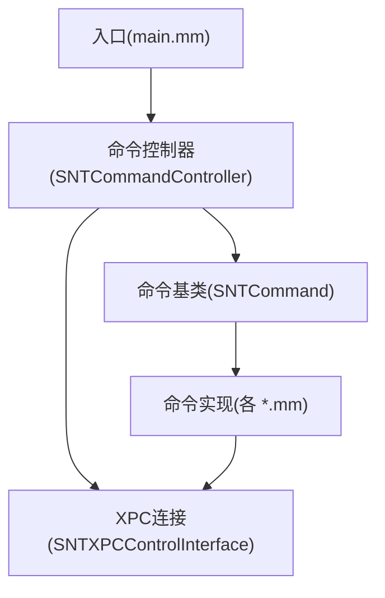
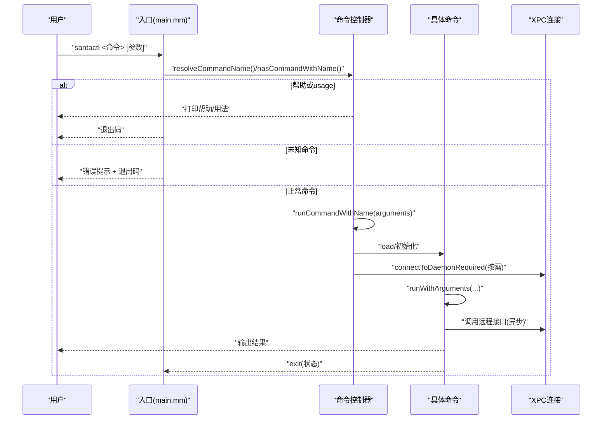
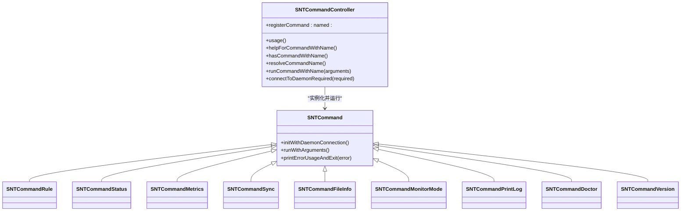

# 命令参考手册

<cite>
**本文引用的文件**
- [main.mm](file://Source/santactl/main.mm)
- [SNTCommandController.h](file://Source/santactl/SNTCommandController.h)
- [SNTCommandController.mm](file://Source/santactl/SNTCommandController.mm)
- [SNTCommand.h](file://Source/santactl/SNTCommand.h)
- [SNTCommand.mm](file://Source/santactl/SNTCommand.mm)
- [SNTCommandBundleInfo.mm](file://Source/santactl/Commands/SNTCommandBundleInfo.mm)
- [SNTCommandCheckCache.mm](file://Source/santactl/Commands/SNTCommandCheckCache.mm)
- [SNTCommandCommand.mm](file://Source/santactl/Commands/SNTCommandCommand.mm)
- [SNTCommandDoctor.mm](file://Source/santactl/Commands/SNTCommandDoctor.mm)
- [SNTCommandFileInfo.mm](file://Source/santactl/Commands/SNTCommandFileInfo.mm)
- [SNTCommandFlushCache.mm](file://Source/santactl/Commands/SNTCommandFlushCache.mm)
- [SNTCommandInstall.mm](file://Source/santactl/Commands/SNTCommandInstall.mm)
- [SNTCommandMetrics.mm](file://Source/santactl/Commands/SNTCommandMetrics.mm)
- [SNTCommandMonitorMode.mm](file://Source/santactl/Commands/SNTCommandMonitorMode.mm)
- [SNTCommandPrintLog.mm](file://Source/santactl/Commands/SNTCommandPrintLog.mm)
- [SNTCommandRule.mm](file://Source/santactl/Commands/SNTCommandRule.mm)
- [SNTCommandStatus.mm](file://Source/santactl/Commands/SNTCommandStatus.mm)
- [SNTCommandSync.mm](file://Source/santactl/Commands/SNTCommandSync.mm)
- [SNTCommandTelemetry.mm](file://Source/santactl/Commands/SNTCommandTelemetry.mm)
- [SNTCommandVersion.mm](file://Source/santactl/Commands/SNTCommandVersion.mm)
</cite>

## 目录
1. [简介](#简介)
2. [项目结构](#项目结构)
3. [核心组件](#核心组件)
4. [架构总览](#架构总览)
5. [详细组件分析](#详细组件分析)
6. [依赖关系分析](#依赖关系分析)
7. [性能考量](#性能考量)
8. [故障排查指南](#故障排查指南)
9. [结论](#结论)
10. [附录](#附录)

## 简介
本手册面向使用 Santa 的管理员与开发者，系统性梳理 santactl 命令行工具的所有可用命令、语法、参数、返回值、权限要求、错误处理与输出格式，并给出常见组合与自动化脚本建议。读者无需深入代码即可高效上手。

## 项目结构
santactl 采用“命令注册 + 控制器分发”的模块化设计：
- 入口程序负责解析参数、帮助与未知命令提示，并将控制权交给命令控制器。
- 命令控制器维护命令注册表（名称到类映射）与别名映射，负责帮助文本生成、命令解析与运行。
- 各具体命令实现遵循统一协议，负责自身参数解析、调用 XPC 接口与输出结果。

图表来源
- [main.mm](file://Source/santactl/main.mm#L1-L84)
- [SNTCommandController.h](file://Source/santactl/SNTCommandController.h#L1-L74)
- [SNTCommandController.mm](file://Source/santactl/SNTCommandController.mm#L1-L159)
- [SNTCommand.h](file://Source/santactl/SNTCommand.h#L1-L81)
- [SNTCommand.mm](file://Source/santactl/SNTCommand.mm#L1-L47)

章节来源
- [main.mm](file://Source/santactl/main.mm#L1-L84)
- [SNTCommandController.h](file://Source/santactl/SNTCommandController.h#L1-L74)
- [SNTCommandController.mm](file://Source/santactl/SNTCommandController.mm#L1-L159)
- [SNTCommand.h](file://Source/santactl/SNTCommand.h#L1-L81)
- [SNTCommand.mm](file://Source/santactl/SNTCommand.mm#L1-L47)

## 核心组件
- 入口与帮助系统
  - 解析 argv，剥离可执行路径；支持 help/-h/--help 子命令与通用 usage 输出。
  - 未知命令打印错误并返回非零退出码。
- 命令控制器
  - 维护命令注册表与别名表；自动生成 usage；按需输出帮助；解析命令名（去连字符/下划线、别名归一化）。
  - 运行时检查是否需要 root 权限与 XPC 连接；必要时建立连接并在完成后进入主循环等待异步回调。
- 命令基类
  - 提供 runWithArguments:daemonConnection: 模板方法；子类只需实现 runWithArguments: 即可。
  - 提供 printErrorUsageAndExit: 打印错误与长帮助后退出。

章节来源
- [main.mm](file://Source/santactl/main.mm#L1-L84)
- [SNTCommandController.h](file://Source/santactl/SNTCommandController.h#L1-L74)
- [SNTCommandController.mm](file://Source/santactl/SNTCommandController.mm#L1-L159)
- [SNTCommand.h](file://Source/santactl/SNTCommand.h#L1-L81)
- [SNTCommand.mm](file://Source/santactl/SNTCommand.mm#L1-L47)

## 架构总览
santactl 的命令分发流程如下：

图表来源
- [main.mm](file://Source/santactl/main.mm#L1-L84)
- [SNTCommandController.mm](file://Source/santactl/SNTCommandController.mm#L1-L159)
- [SNTCommand.h](file://Source/santactl/SNTCommand.h#L1-L81)
- [SNTCommand.mm](file://Source/santactl/SNTCommand.mm#L1-L47)

## 详细组件分析

### 命令：version
- 用途：显示 santad、santactl、SantaGUI 版本信息。
- 语法：santactl version [--json]
- 参数
  - --json：以 JSON 输出。
- 返回值
  - 成功：0；失败：非零。
- 权限要求：无。
- 输出格式：默认为两列对齐；--json 为 JSON 对象。
- 使用示例
  - 显示版本：santactl version
  - 导出 JSON：santactl version --json

章节来源
- [SNTCommandVersion.mm](file://Source/santactl/Commands/SNTCommandVersion.mm#L1-L99)

### 命令：status
- 用途：展示 Santa 运行状态（模式、缓存、规则、同步、指标等）。
- 语法：santactl status [--json]
- 参数
  - --json：以 JSON 输出。
- 返回值
  - 成功：0；失败：非零。
- 权限要求：无。
- 输出格式：默认人类可读；--json 为结构化 JSON。
- 使用示例
  - 查看状态：santactl status
  - 导出 JSON：santactl status --json

章节来源
- [SNTCommandStatus.mm](file://Source/santactl/Commands/SNTCommandStatus.mm#L1-L472)

### 命令：metrics
- 用途：查看 Santa 指标数据。
- 语法：santactl metrics [前缀...] [--json]
- 参数
  - 前缀：过滤指标名称前缀。
  - --json：以 JSON 输出。
- 返回值
  - 成功：0；失败：非零。
- 权限要求：需要与守护进程通信。
- 输出格式：默认表格；--json 为 JSON。
- 使用示例
  - 查看指标：santactl metrics
  - 导出 JSON：santactl metrics --json

章节来源
- [SNTCommandMetrics.mm](file://Source/santactl/Commands/SNTCommandMetrics.mm#L1-L182)

### 命令：sync
- 用途：与配置的服务器进行同步。
- 语法：santactl sync [--clean|--clean-all|--debug]
- 参数
  - --clean：清理非传递规则并请求干净同步。
  - --clean-all：清理全部规则并请求干净同步。
  - --debug：启用详细日志。
- 返回值
  - 成功：0；失败：非零（含“并发过多”等状态）。
- 权限要求：无（直接与同步服务通信）。
- 输出格式：标准输出打印同步过程日志。
- 使用示例
  - 普通同步：santactl sync
  - 清理并同步：santactl sync --clean
  - 调试同步：santactl sync --debug

章节来源
- [SNTCommandSync.mm](file://Source/santactl/Commands/SNTCommandSync.mm#L1-L119)

### 命令：fileinfo（别名：fi）
- 用途：打印文件信息（签名、哈希、类型、规则等），支持递归、过滤、JSON 输出与证书索引。
- 语法：santactl fileinfo [选项] [文件/目录...]
- 选项
  - -r/--recursive：递归扫描目录。
  - --json：JSON 输出。
  - --key：<键>：仅输出指定键（可多次指定）。有效键包括：路径、SHA-256、SHA-1、Bundle 名称/版本、下载来源/URL/时间/Agent、Team ID、Signing ID、CDHash、类型、PageZero、是否签名、安全签名时间、签名时间、规则、权限、签名链、通用签名链。
  - --cert-index：<索引>：仅输出签名链中某一张证书的键值（0 表示叶子到根，-1 表示根到叶子）。
  - --localtz：使用本地时区显示时间。
  - --filter：<键=正则>：按属性正则过滤（可多次指定），满足任一即显示（或通过 --filter-inclusive 变为全匹配）。
  - --filter-inclusive：多过滤器必须同时满足。
  - --entitlements：显示权限。
  - --bundleinfo：若文件属于捆绑包，额外输出捆绑包哈希与各二进制哈希。
- 返回值
  - 成功：0；失败：非零。
- 权限要求：无。
- 输出格式：默认人类可读；--json 为数组。
- 使用示例
  - 基本信息：santactl fileinfo /usr/bin/yes
  - JSON 输出：santactl fileinfo --key SHA-256 --json /usr/bin/yes
  - 递归扫描：santactl fileinfo /usr/bin -r --key Path --key SHA-256 --key Rule
  - 过滤脚本与压缩包：santactl fileinfo /usr/bin/* --filter Type=Script --filter Path=zip

章节来源
- [SNTCommandFileInfo.mm](file://Source/santactl/Commands/SNTCommandFileInfo.mm#L1-L800)

### 命令：bundleinfo（调试构建）
- 用途：搜索捆绑包内的二进制并计算哈希与事件信息。
- 语法：santactl bundleinfo <bundle路径>
- 返回值
  - 成功：0；失败：非零。
- 权限要求：无。
- 输出格式：人类可读。
- 使用示例
  - 分析捆绑包：santactl bundleinfo /Applications/Some.app

章节来源
- [SNTCommandBundleInfo.mm](file://Source/santactl/Commands/SNTCommandBundleInfo.mm#L1-L87)

### 命令：rule
- 用途：手动添加/删除/检查规则，支持导入导出 JSON、CEL 规则、文件访问规则查询。
- 语法：santactl rule [选项]
- 选项（互斥与组合）
  - 操作态：
    - --allow / --whitelist：允许
    - --block / --blacklist：阻止
    - --silent-block / --silent-blacklist：静默阻止
    - --compiler：允许并标记为编译器
    - --cel：<表达式>：添加 CEL 规则
    - --remove：移除规则
    - --check：检查现有规则
    - --import：<路径>：从 JSON 导入规则
    - --export：<路径>：导出规则到 JSON
    - --export-file-access：<路径>：导出文件访问规则到 Plist（调试构建）
  - 识别符：
    - --path：<路径>：基于路径当前文件自动推断标识符（默认 SHA-256）
    - --identifier：<sha256|teamID|signingID|cdhash>：显式指定标识符
    - --sha256：<哈希>：已弃用的 SHA-256 指定方式
  - 类型：
    - --teamid：团队 ID 规则
    - --signingid：签名 ID 规则（格式 TeamID:SigningID 或 platform:SigningID）
    - --certificate：证书 SHA-256 规则
    - --cdhash：CDHash 规则
  - 其他：
    - --message：<消息>：阻止时显示的自定义消息
    - --comment：<注释>：附加到新规则
    - --clean：清空非传递规则后再导入
    - --clean-all：清空全部规则后再导入
    - --file-access：检查路径关联的文件访问规则（需与 --check 配合且需 --path）
    - --force：强制修改（调试构建）
- 返回值
  - 成功：0；失败：非零。
- 权限要求：需要 root；当配置了同步或静态规则时，默认禁止非检查操作。
- 输出格式：人类可读；导入/导出为 JSON/Plist。
- 使用示例
  - 添加允许规则：santactl rule --allow --path /usr/bin/ls
  - 导入规则：santactl rule --import rules.json
  - 导出规则：santactl rule --export rules.json
  - 检查规则：santactl rule --check --identifier 84de9c6...

章节来源
- [SNTCommandRule.mm](file://Source/santactl/Commands/SNTCommandRule.mm#L1-L597)

### 命令：monitormode（别名：mm）
- 用途：临时切换到监控模式（在策略允许范围内）。
- 语法：santactl monitormode [--duration <分钟|h|d>|<数字>] [--cancel]
- 参数
  - --duration：持续分钟数，支持 m/h/d 单位字符串。
  - --cancel：取消临时监控模式，回到锁定模式。
- 返回值
  - 成功：0；失败：非零。
- 权限要求：无。
- 输出格式：人类可读。
- 使用示例
  - 临时监控 30 分钟：santactl monitormode --duration 30
  - 临时监控 2 小时：santactl monitormode --duration 2h
  - 取消：santactl monitormode --cancel

章节来源
- [SNTCommandMonitorMode.mm](file://Source/santactl/Commands/SNTCommandMonitorMode.mm#L1-L158)

### 命令：printlog
- 用途：将序列化的 Santa Protobuf 日志文件打印为 JSON。
- 语法：santactl printlog <文件路径...>
- 参数
  - 多个文件路径；输出为外层数组，内层为对应文件的消息列表。
- 返回值
  - 成功：0；失败：非零。
- 权限要求：无。
- 输出格式：JSON 列表。
- 使用示例
  - 打印单个日志：santactl printlog /var/db/santa/log.bin
  - 批量打印：santactl printlog /var/db/santa/*.bin

章节来源
- [SNTCommandPrintLog.mm](file://Source/santactl/Commands/SNTCommandPrintLog.mm#L1-L410)

### 命令：doctor
- 用途：诊断系统问题（进程、配置、同步连通性等），非零退出码表示发现问题。
- 语法：santactl doctor
- 返回值
  - 成功：0；发现任何问题：非零。
- 权限要求：需要 root。
- 输出格式：人类可读（带颜色提示）。
- 使用示例
  - 运行诊断：santactl doctor

章节来源
- [SNTCommandDoctor.mm](file://Source/santactl/Commands/SNTCommandDoctor.mm#L1-L249)

### 咨询/调试相关命令（调试构建）
以下命令仅在调试构建中可用，不建议在生产环境使用。

- 命令：checkcache（隐藏）
  - 用途：开发用途，打印文件在缓存中的授权状态。
  - 语法：santactl checkcache <文件路径>
  - 权限：需要 root。
  - 返回值：存在/不存在/编译器/未命中等不同退出码。
  - 输出：人类可读。

- 命令：flushcache（隐藏）
  - 用途：开发用途，刷新授权缓存。
  - 语法：santactl flushcache
  - 权限：需要 root。
  - 返回值：0/1。

- 命令：install（隐藏）
  - 用途：开发用途，指示守护进程安装 Santa.app。
  - 语法：santactl install
  - 权限：需要 root。
  - 返回值：0/1。

- 命令：command（隐藏）
  - 用途：触发 Santa 命令（调试），如按条件杀死进程。
  - 语法：santactl command kill [--process <pid> <pidversion>|--cdhash <cdhash>|--signingid <TeamID:SigningID>|--teamid <teamid>]
  - 权限：需要 root。
  - 返回值：0/1。

- 命令：telemetry（隐藏）
  - 用途：导出遥测数据。
  - 语法：santactl telemetry --export
  - 权限：需要与守护进程通信。
  - 返回值：0/1。

章节来源
- [SNTCommandCheckCache.mm](file://Source/santactl/Commands/SNTCommandCheckCache.mm#L1-L86)
- [SNTCommandFlushCache.mm](file://Source/santactl/Commands/SNTCommandFlushCache.mm#L1-L66)
- [SNTCommandInstall.mm](file://Source/santactl/Commands/SNTCommandInstall.mm#L1-L81)
- [SNTCommandCommand.mm](file://Source/santactl/Commands/SNTCommandCommand.mm#L1-L197)
- [SNTCommandTelemetry.mm](file://Source/santactl/Commands/SNTCommandTelemetry.mm#L1-L112)

## 依赖关系分析
- 命令注册与别名
  - 各命令通过宏在 +load 中向控制器注册；控制器维护命令名到类的字典与别名到真实命令名的映射。
- XPC 通信
  - 控制器根据命令声明决定是否需要连接守护进程；连接失败时提供清晰错误提示并退出。
- 权限与可见性
  - 部分命令声明 requiresRoot；部分命令 isHidden；helpForCommandWithName 会追加别名列表。

图表来源
- [SNTCommandController.h](file://Source/santactl/SNTCommandController.h#L1-L74)
- [SNTCommandController.mm](file://Source/santactl/SNTCommandController.mm#L1-L159)
- [SNTCommand.h](file://Source/santactl/SNTCommand.h#L1-L81)
- [SNTCommand.mm](file://Source/santactl/SNTCommand.mm#L1-L47)
- [SNTCommandRule.mm](file://Source/santactl/Commands/SNTCommandRule.mm#L1-L597)
- [SNTCommandStatus.mm](file://Source/santactl/Commands/SNTCommandStatus.mm#L1-L472)
- [SNTCommandMetrics.mm](file://Source/santactl/Commands/SNTCommandMetrics.mm#L1-L182)
- [SNTCommandSync.mm](file://Source/santactl/Commands/SNTCommandSync.mm#L1-L119)
- [SNTCommandFileInfo.mm](file://Source/santactl/Commands/SNTCommandFileInfo.mm#L1-L800)
- [SNTCommandMonitorMode.mm](file://Source/santactl/Commands/SNTCommandMonitorMode.mm#L1-L158)
- [SNTCommandPrintLog.mm](file://Source/santactl/Commands/SNTCommandPrintLog.mm#L1-L410)
- [SNTCommandDoctor.mm](file://Source/santactl/Commands/SNTCommandDoctor.mm#L1-L249)
- [SNTCommandVersion.mm](file://Source/santactl/Commands/SNTCommandVersion.mm#L1-L99)

章节来源
- [SNTCommandController.h](file://Source/santactl/SNTCommandController.h#L1-L74)
- [SNTCommandController.mm](file://Source/santactl/SNTCommandController.mm#L1-L159)
- [SNTCommand.h](file://Source/santactl/SNTCommand.h#L1-L81)
- [SNTCommand.mm](file://Source/santactl/SNTCommand.mm#L1-L47)

## 性能考量
- fileinfo
  - 递归扫描时限制并发队列数量，避免大量 XPC 请求导致消息丢失。
  - 支持过滤与 JSON 输出，便于后续流水线处理。
- metrics
  - 支持前缀过滤与 JSON 输出，减少无关数据传输。
- printlog
  - 支持多文件输入，输出为嵌套 JSON 数组，便于批量处理。
- doctor
  - 异步发起网络请求并设置超时，避免阻塞。

章节来源
- [SNTCommandFileInfo.mm](file://Source/santactl/Commands/SNTCommandFileInfo.mm#L596-L700)
- [SNTCommandMetrics.mm](file://Source/santactl/Commands/SNTCommandMetrics.mm#L148-L179)
- [SNTCommandPrintLog.mm](file://Source/santactl/Commands/SNTCommandPrintLog.mm#L346-L407)
- [SNTCommandDoctor.mm](file://Source/santactl/Commands/SNTCommandDoctor.mm#L181-L246)

## 故障排查指南
- 无法连接守护进程
  - 控制器会在 invalidationHandler 中打印错误并退出；请确认守护进程运行并授予所需权限。
- 权限不足
  - 声明 requiresRoot 的命令需要 root；否则会直接退出并提示。
- 同步冲突
  - sync 命令可能返回“并发过多”，稍后再试。
- 命令不存在或拼写错误
  - 入口会打印帮助或未知命令提示；可通过 help 获取帮助。
- 输出格式与管道
  - 多数命令支持 --json；可配合 jq 等工具进行过滤与格式化。

章节来源
- [SNTCommandController.mm](file://Source/santactl/SNTCommandController.mm#L114-L128)
- [SNTCommandController.mm](file://Source/santactl/SNTCommandController.mm#L143-L156)
- [SNTCommandSync.mm](file://Source/santactl/Commands/SNTCommandSync.mm#L92-L107)
- [main.mm](file://Source/santactl/main.mm#L27-L83)

## 结论
santactl 提供了覆盖版本、状态、指标、同步、文件信息、规则管理、监控模式、日志解析与诊断等完整运维能力。通过统一的命令框架、严格的权限控制与清晰的帮助系统，既适合日常运维，也便于自动化集成。

## 附录

### 命令别名与快捷方式
- fileinfo：别名 fi
- monitormode：别名 mm

章节来源
- [SNTCommandFileInfo.mm](file://Source/santactl/Commands/SNTCommandFileInfo.mm#L222-L224)
- [SNTCommandMonitorMode.mm](file://Source/santactl/Commands/SNTCommandMonitorMode.mm#L52-L54)

### 常见命令组合与自动化脚本思路
- 导出规则并清理旧规则
  - 清空并导入：santactl rule --clean-all --import rules.json
- 临时监控模式
  - 临时放宽策略：santactl monitormode --duration 60
  - 取消：santactl monitormode --cancel
- 批量检查文件签名与规则
  - 递归扫描并导出 JSON：santactl fileinfo --recursive --json /Applications
  - 过滤脚本类型：santactl fileinfo /usr/bin/* --filter Type=Script
- 查看指标并告警
  - 定期导出指标：santactl metrics --json
- 诊断与排障
  - doctor：santactl doctor
  - printlog：santactl printlog /var/db/santa/*.bin

### 错误处理与返回码约定
- 未知命令：入口返回 128
- 帮助/用法：入口返回 0/1（取决于是否成功）
- 命令内部错误：printErrorUsageAndExit 会打印错误与长帮助后退出，通常返回 1
- 成功：多数命令返回 0；部分命令（如 sync）返回特定状态值

章节来源
- [main.mm](file://Source/santactl/main.mm#L27-L83)
- [SNTCommand.mm](file://Source/santactl/SNTCommand.mm#L39-L46)
- [SNTCommandSync.mm](file://Source/santactl/Commands/SNTCommandSync.mm#L92-L107)