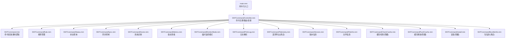
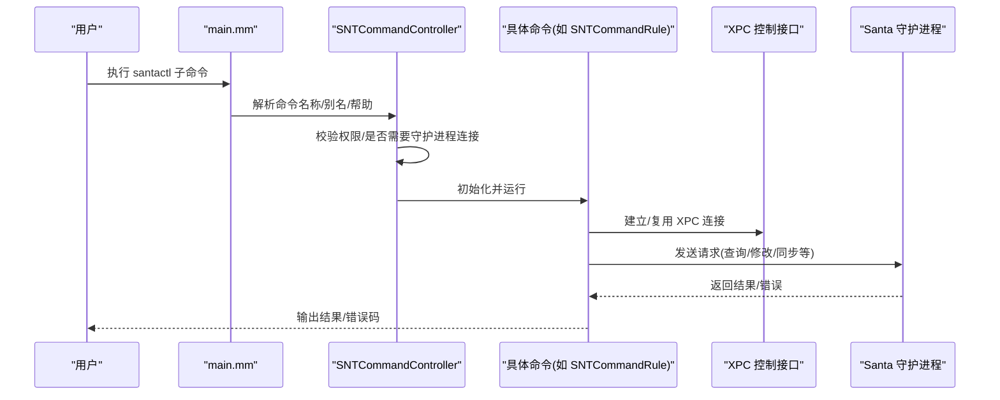
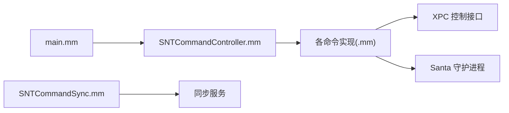

# 命令行工具

<cite>
**本文引用的文件**
- [main.mm](file://Source/santactl/main.mm)
- [SNTCommandController.mm](file://Source/santactl/SNTCommandController.mm)
- [SNTCommand.mm](file://Source/santactl/SNTCommand.mm)
- [SNTCommandRule.mm](file://Source/santactl/Commands/SNTCommandRule.mm)
- [SNTCommandStatus.mm](file://Source/santactl/Commands/SNTCommandStatus.mm)
- [SNTCommandSync.mm](file://Source/santactl/Commands/SNTCommandSync.mm)
- [SNTCommandDoctor.mm](file://Source/santactl/Commands/SNTCommandDoctor.mm)
- [SNTCommandMetrics.mm](file://Source/santactl/Commands/SNTCommandMetrics.mm)
- [SNTCommandMonitorMode.mm](file://Source/santactl/Commands/SNTCommandMonitorMode.mm)
- [SNTCommandFlushCache.mm](file://Source/santactl/Commands/SNTCommandFlushCache.mm)
- [SNTCommandPrintLog.mm](file://Source/santactl/Commands/SNTCommandPrintLog.mm)
- [SNTCommandTelemetry.mm](file://Source/santactl/Commands/SNTCommandTelemetry.mm)
- [SNTCommandVersion.mm](file://Source/santactl/Commands/SNTCommandVersion.mm)
- [SNTCommandBundleInfo.mm](file://Source/santactl/Commands/SNTCommandBundleInfo.mm)
- [SNTCommandFileInfo.mm](file://Source/santactl/Commands/SNTCommandFileInfo.mm)
- [SNTCommandCheckCache.mm](file://Source/santactl/Commands/SNTCommandCheckCache.mm)
- [SNTCommandInstall.mm](file://Source/santactl/Commands/SNTCommandInstall.mm)
</cite>

## 目录
1. [简介](#简介)
2. [项目结构](#项目结构)
3. [核心组件](#核心组件)
4. [架构总览](#架构总览)
5. [详细组件分析](#详细组件分析)
6. [依赖关系分析](#依赖关系分析)
7. [性能考量](#性能考量)
8. [故障排除指南](#故障排除指南)
9. [结论](#结论)
10. [附录](#附录)

## 简介
本文件为 Santa 命令行工具（santactl）的完整使用文档，覆盖所有可用命令的功能、参数选项、使用示例与最佳实践。santactl 通过子命令组织功能，包括规则管理、状态查询、同步控制、诊断工具、指标查看、日志解析等。本文还提供批量操作示例、自动化脚本编写思路、权限与安全注意事项、错误处理机制说明以及与其他管理工具的集成建议。

## 项目结构
santactl 的入口位于主程序，负责解析命令并委派给对应的命令处理器；命令处理器再通过 XPC 与 Santa 守护进程交互，或在需要时直接与同步服务通信。

图表来源
- [main.mm](file://Source/santactl/main.mm#L1-L84)
- [SNTCommandController.mm](file://Source/santactl/SNTCommandController.mm#L1-L159)
- [SNTCommand.mm](file://Source/santactl/SNTCommand.mm#L1-L47)
- [SNTCommandRule.mm](file://Source/santactl/Commands/SNTCommandRule.mm#L1-L597)
- [SNTCommandStatus.mm](file://Source/santactl/Commands/SNTCommandStatus.mm#L1-L472)
- [SNTCommandSync.mm](file://Source/santactl/Commands/SNTCommandSync.mm#L1-L119)
- [SNTCommandDoctor.mm](file://Source/santactl/Commands/SNTCommandDoctor.mm#L1-L249)
- [SNTCommandMetrics.mm](file://Source/santactl/Commands/SNTCommandMetrics.mm#L1-L182)
- [SNTCommandMonitorMode.mm](file://Source/santactl/Commands/SNTCommandMonitorMode.mm#L1-L158)
- [SNTCommandPrintLog.mm](file://Source/santactl/Commands/SNTCommandPrintLog.mm#L1-L410)
- [SNTCommandTelemetry.mm](file://Source/santactl/Commands/SNTCommandTelemetry.mm#L1-L112)
- [SNTCommandVersion.mm](file://Source/santactl/Commands/SNTCommandVersion.mm#L1-L99)
- [SNTCommandFileInfo.mm](file://Source/santactl/Commands/SNTCommandFileInfo.mm#L1-L1082)
- [SNTCommandCheckCache.mm](file://Source/santactl/Commands/SNTCommandCheckCache.mm#L1-L86)
- [SNTCommandFlushCache.mm](file://Source/santactl/Commands/SNTCommandFlushCache.mm#L1-L66)
- [SNTCommandInstall.mm](file://Source/santactl/Commands/SNTCommandInstall.mm#L1-L81)
- [SNTCommandBundleInfo.mm](file://Source/santactl/Commands/SNTCommandBundleInfo.mm#L1-L87)

章节来源
- [main.mm](file://Source/santactl/main.mm#L1-L84)
- [SNTCommandController.mm](file://Source/santactl/SNTCommandController.mm#L1-L159)

## 核心组件
- 命令入口与路由：解析用户输入，解析别名，校验权限与守护进程连接需求，调用具体命令执行。
- 命令基类：封装 XPC 连接、帮助文本输出、错误打印与退出。
- 命令集合：按功能划分，如规则管理、状态查询、同步、诊断、指标、日志、遥测、版本、文件信息等。

章节来源
- [SNTCommandController.mm](file://Source/santactl/SNTCommandController.mm#L1-L159)
- [SNTCommand.mm](file://Source/santactl/SNTCommand.mm#L1-L47)

## 架构总览
santactl 采用“命令控制器 + 命令处理器”的分层设计，命令处理器通过 XPC 与守护进程交互，部分命令（如同步）直接与同步服务通信。

图表来源
- [main.mm](file://Source/santactl/main.mm#L1-L84)
- [SNTCommandController.mm](file://Source/santactl/SNTCommandController.mm#L1-L159)
- [SNTCommand.mm](file://Source/santactl/SNTCommand.mm#L1-L47)
- [SNTCommandRule.mm](file://Source/santactl/Commands/SNTCommandRule.mm#L1-L597)

## 详细组件分析

### 规则管理命令：santactl rule
- 功能：添加/移除/查询执行规则；导入/导出执行规则；清理规则；检查文件访问规则。
- 关键参数：
  - 操作类型：--allow、--block、--silent-block、--compiler、--cel、--remove、--check
  - 选择器：--path、--identifier、--sha256、--teamid、--signingid、--certificate、--cdhash、--file-access
  - 导入/导出：--import、--export、--clean、--clean-all
  - 其他：--message、--comment、--help
- 权限与限制：
  - 需要 root 权限
  - 当配置了同步服务器或静态规则时，默认禁止手动修改（可通过调试构建的 --force 放宽）
- 使用要点：
  - --path 会自动推断标识符类型（二进制 SHA-256、证书 SHA-256、CDHash、TeamID、SigningID）
  - --check 可结合 --file-access 查询文件访问规则
  - --import 支持从 JSON 文件批量导入；--export 导出非静态规则
- 示例流程（概念性）：
  - 添加允许规则：指定 --path 或 --identifier，并选择类型标志位
  - 导入规则：先 --clean/--clean-all 清理，再 --import 导入
  - 查询规则：--check 指定 --identifier 或 --path
  - 导出规则：--export 输出到文件

章节来源
- [SNTCommandRule.mm](file://Source/santactl/Commands/SNTCommandRule.mm#L1-L597)

### 状态查询命令：santactl status
- 功能：显示守护进程模式、缓存统计、规则计数、同步状态、事件数量、指标开关等。
- 参数：--json 输出 JSON 格式
- 输出字段概览（节选）：客户端模式、日志类型、文件日志开关、USB 阻断、启动 USB 选项、静态规则数、看门狗 CPU/RAM 事件峰值、缓存计数、各类规则数量、临时监控剩余时间、同步服务器、上次全量/规则同步时间、推送通知状态、事件待上传数、规则哈希、指标导出配置等。
- 使用建议：
  - 结合 --json 便于自动化采集
  - 关注“Clean Sync Required”和“Push Notifications”状态

章节来源
- [SNTCommandStatus.mm](file://Source/santactl/Commands/SNTCommandStatus.mm#L1-L472)

### 同步控制命令：santactl sync
- 功能：触发与同步服务的同步，支持普通同步、清理同步（仅删除非传递规则）与全量清理同步。
- 参数：--clean、--clean-all、--debug
- 行为：
  - 要求已配置 SyncBaseURL
  - 以匿名监听方式接收同步日志
  - 成功后返回同步状态码
- 使用建议：
  - 在策略变更或规则异常时使用 --clean/--clean-all
  - 使用 --debug 获取更详细的同步过程日志

章节来源
- [SNTCommandSync.mm](file://Source/santactl/Commands/SNTCommandSync.mm#L1-L119)

### 诊断工具：santactl doctor
- 功能：检查进程、配置、同步连通性等潜在问题。
- 行为：
  - 校验 Santa GUI、santad、santasyncservice 是否运行
  - 校验配置有效性
  - 对同步服务器发起预检请求（HTTPS、代理、证书等）
- 退出码：发现任何问题即非零退出，便于自动化告警

章节来源
- [SNTCommandDoctor.mm](file://Source/santactl/Commands/SNTCommandDoctor.mm#L1-L249)

### 指标查看命令：santactl metrics
- 功能：展示守护进程指标及元数据，支持过滤与 JSON 输出。
- 参数：可传前缀过滤指标名；--json 输出 JSON
- 使用建议：
  - 与配置中的指标导出设置联动，便于统一采集

章节来源
- [SNTCommandMetrics.mm](file://Source/santactl/Commands/SNTCommandMetrics.mm#L1-L182)

### 临时监控模式：santactl monitormode（别名 mm）
- 功能：在满足条件时申请临时 Monitor Mode，或取消临时模式。
- 参数：--duration（支持 m/h/d）、--cancel
- 行为：
  - 解析时间字符串，转换为分钟
  - 调用守护进程接口请求/取消临时模式

章节来源
- [SNTCommandMonitorMode.mm](file://Source/santactl/Commands/SNTCommandMonitorMode.mm#L1-L158)

### 日志解析：santactl printlog
- 功能：将压缩或编码的 Santa 日志文件解析为 JSON 列表。
- 输入：一个或多个日志路径
- 支持格式：流式批次、zstd、gzip、Any 批次
- 注意：对超大压缩文件有内存上限保护

章节来源
- [SNTCommandPrintLog.mm](file://Source/santactl/Commands/SNTCommandPrintLog.mm#L1-L410)

### 版本信息：santactl version
- 功能：显示 santad、santactl、SantaGUI 的版本信息（含构建号与提交哈希）
- 参数：--json 输出 JSON

章节来源
- [SNTCommandVersion.mm](file://Source/santactl/Commands/SNTCommandVersion.mm#L1-L99)

### 文件信息：santactl fileinfo（别名 fi）
- 功能：输出文件的签名链、规则匹配、下载信息、签名时间、Entitlements 等。
- 参数：
  - --recursive/-r 递归目录
  - --json JSON 输出
  - --key 多次指定输出字段（如 SHA-256、Rule、SigningID 等）
  - --cert-index 指定签名链中某一层证书
  - --filter/--filter-inclusive 正则过滤
  - --entitlements 显示权限
  - --bundleinfo 显示包哈希与包内二进制哈希
- 并发与性能：
  - 为避免 XPC 消息拥塞，规则查询并发被限制为较低值
- 使用建议：
  - 与 --filter 组合快速筛选目标文件
  - 与 --bundleinfo 结合定位包级签名与哈希

章节来源
- [SNTCommandFileInfo.mm](file://Source/santactl/Commands/SNTCommandFileInfo.mm#L1-L1082)

### 其他实用命令
- 缓存检查：santactl checkcache（隐藏，需 root）——根据 vnodeID 查询缓存命中情况
- 缓存刷新：santactl flushcache（隐藏，需 root）——开发用途
- 安装：santactl install（隐藏，需 root）——指示守护进程安装应用
- 包信息：santactl bundleinfo（调试构建）——列出包内二进制及其哈希
- 遥测导出：santactl telemetry --export（调试构建）——触发并等待遥测导出完成

章节来源
- [SNTCommandCheckCache.mm](file://Source/santactl/Commands/SNTCommandCheckCache.mm#L1-L86)
- [SNTCommandFlushCache.mm](file://Source/santactl/Commands/SNTCommandFlushCache.mm#L1-L66)
- [SNTCommandInstall.mm](file://Source/santactl/Commands/SNTCommandInstall.mm#L1-L81)
- [SNTCommandBundleInfo.mm](file://Source/santactl/Commands/SNTCommandBundleInfo.mm#L1-L87)
- [SNTCommandTelemetry.mm](file://Source/santactl/Commands/SNTCommandTelemetry.mm#L1-L112)

## 依赖关系分析
- 命令入口与控制器
  - main.mm 依赖 SNTCommandController 解析命令、帮助与路由
  - SNTCommandController 负责命令注册、别名解析、权限与连接校验、运行命令
- 命令与守护进程
  - 多数命令通过 SNTCommandController 建立 XPC 连接，调用守护进程接口
- 同步命令
  - SNTCommandSync 直接与同步服务通信，不依赖守护进程连接
- 诊断命令
  - SNTCommandDoctor 通过配置验证与 HTTP 预检判断同步健康度

图表来源
- [main.mm](file://Source/santactl/main.mm#L1-L84)
- [SNTCommandController.mm](file://Source/santactl/SNTCommandController.mm#L1-L159)
- [SNTCommandSync.mm](file://Source/santactl/Commands/SNTCommandSync.mm#L1-L119)

## 性能考量
- 并发限制：fileinfo 在查询规则时限制并发，避免大量 XPC 请求导致消息丢失
- 日志解析：对压缩日志进行内存保护，避免过大文件造成内存压力
- 同步：合理使用 --clean/--clean-all，减少不必要的全量同步
- 指标输出：--json 便于批量采集与后续处理，降低终端渲染开销

章节来源
- [SNTCommandFileInfo.mm](file://Source/santactl/Commands/SNTCommandFileInfo.mm#L616-L667)
- [SNTCommandPrintLog.mm](file://Source/santactl/Commands/SNTCommandPrintLog.mm#L184-L197)
- [SNTCommandSync.mm](file://Source/santactl/Commands/SNTCommandSync.mm#L58-L107)

## 故障排除指南
- 无法连接守护进程
  - 现象：提示与守护进程通信失败
  - 排查：确认守护进程运行、具备所需权限（如 Full Disk Access），参考控制器的无效化处理提示
- 权限不足
  - 现象：提示需要 root 权限
  - 排查：对应命令（如 rule、flushcache、checkcache、install）均需 root
- 同步失败
  - 现象：同步状态异常或超时
  - 排查：使用 doctor 检查 HTTPS、代理、证书；必要时使用 --clean/--clean-all
- 规则修改被拒绝
  - 现象：中心化配置或静态规则生效时，禁止手动修改
  - 排查：检查配置中的 SyncBaseURL/静态规则；调试构建下可使用 --force（不推荐）

章节来源
- [SNTCommandController.mm](file://Source/santactl/SNTCommandController.mm#L114-L128)
- [SNTCommandRule.mm](file://Source/santactl/Commands/SNTCommandRule.mm#L125-L137)
- [SNTCommandDoctor.mm](file://Source/santactl/Commands/SNTCommandDoctor.mm#L145-L246)
- [SNTCommandSync.mm](file://Source/santactl/Commands/SNTCommandSync.mm#L92-L107)

## 结论
santactl 提供了覆盖规则管理、状态监控、同步控制、诊断、指标、日志解析与版本信息的完整命令集。通过合理的参数组合与自动化脚本，可高效完成日常运维与排障任务。建议在生产环境优先使用非隐藏命令，谨慎使用需要 root 权限或调试特性（如 --force、flushcache、telemetry）。

## 附录

### 常见使用场景与流程
- 批量导入规则
  - 步骤：先 --clean/--clean-all，再 --import 导入 JSON
  - 参考：规则命令的导入/清理逻辑
- 快速诊断同步问题
  - 步骤：doctor 检查进程与配置；doctor 对同步服务器发起预检；必要时 sync --clean
  - 参考：doctor 与 sync 命令
- 生成规则快照
  - 步骤：--export 导出当前非静态规则
  - 参考：规则命令的导出逻辑
- 定位可疑文件
  - 步骤：fileinfo --key Rule --filter Path=正则 /path/to/target
  - 参考：fileinfo 命令的过滤与输出
- 临时放宽策略
  - 步骤：monitormode --duration 30m 或 --cancel
  - 参考：monitormode 命令

### 自动化与集成建议
- 与配置管理工具集成
  - 将 --json 输出接入配置管理流水线，实现规则的版本化与审计
- 与监控系统集成
  - 使用 status --json 与 metrics --json 采集关键指标，对接监控平台
- 与日志分析平台集成
  - 使用 printlog 将压缩日志转为 JSON，供日志平台解析
- 与 CI/CD 集成
  - 在构建后使用 fileinfo 与 bundleinfo 校验签名与哈希一致性

### 权限与安全注意事项
- root 权限
  - 规则修改、缓存刷新、安装等命令需要 root
- 开发用途限制
  - checkcache、flushcache、install、bundleinfo、telemetry 等为开发用途或调试特性，不建议在生产使用
- 中心化配置
  - 当启用同步或静态规则时，禁止手动修改（除非调试构建）