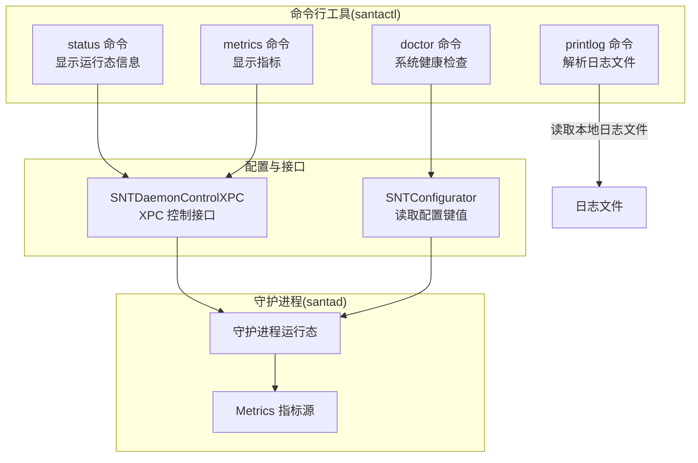
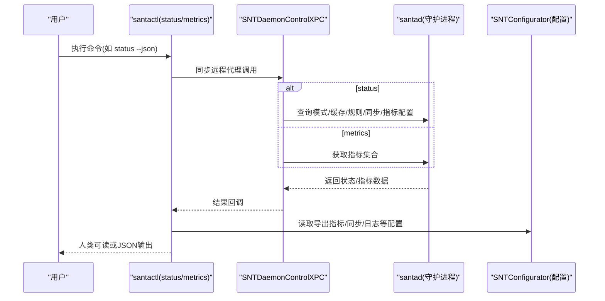
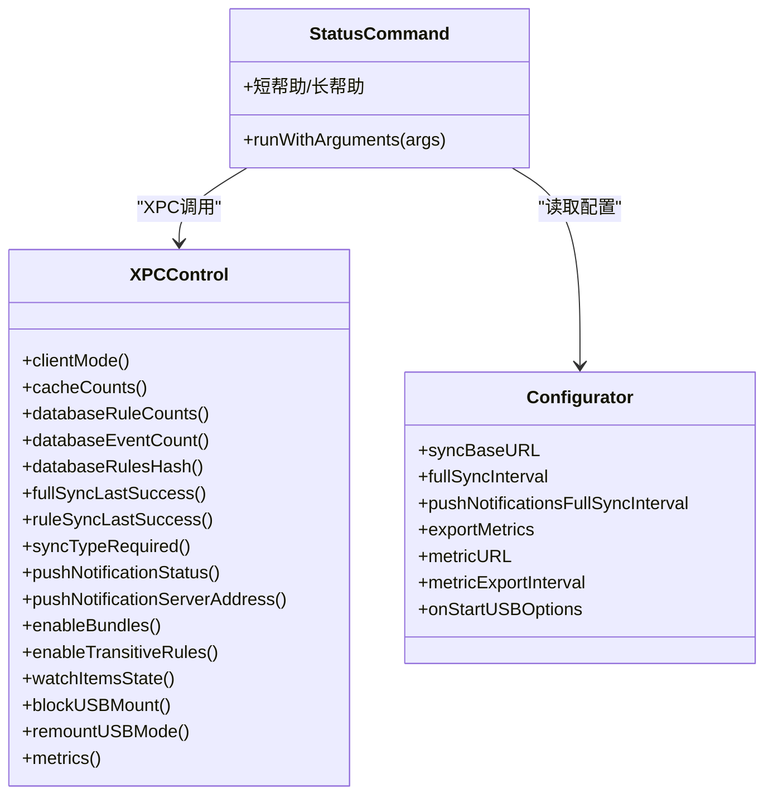
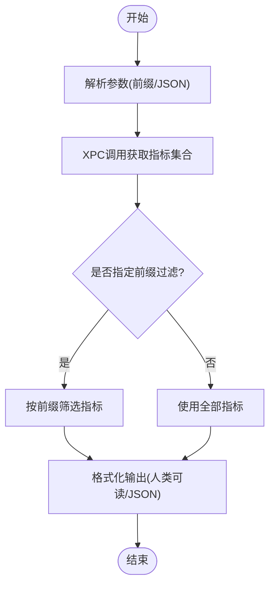
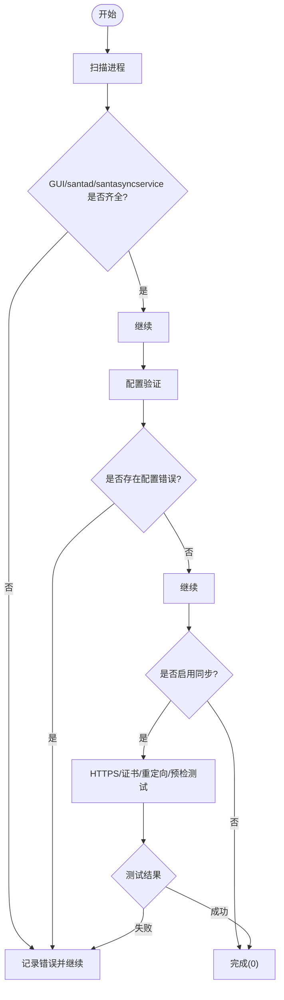
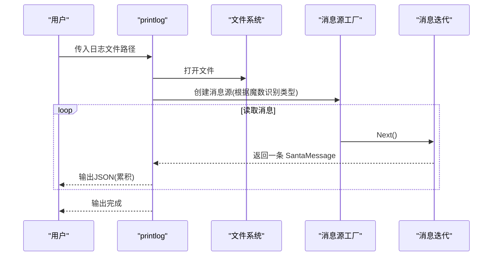
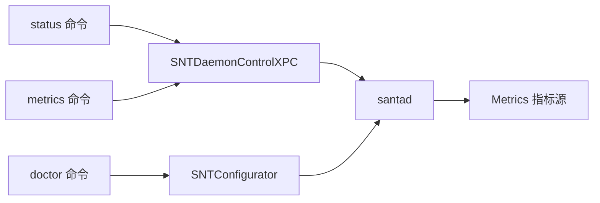

# 状态查询命令

<cite>
**本文引用的文件**
- [Source/santactl/Commands/SNTCommandStatus.mm](file://Source/santactl/Commands/SNTCommandStatus.mm)
- [Source/santactl/Commands/SNTCommandMetrics.mm](file://Source/santactl/Commands/SNTCommandMetrics.mm)
- [Source/santactl/Commands/SNTCommandDoctor.mm](file://Source/santactl/Commands/SNTCommandDoctor.mm)
- [Source/santactl/Commands/SNTCommandPrintLog.mm](file://Source/santactl/Commands/SNTCommandPrintLog.mm)
- [Source/common/SNTConfigurator.mm](file://Source/common/SNTConfigurator.mm)
- [Source/common/SNTXPCControlInterface.h](file://Source/common/SNTXPCControlInterface.h)
- [Source/common/SNTMetricSet.mm](file://Source/common/SNTMetricSet.mm)
- [Source/santad/Metrics.mm](file://Source/santad/Metrics.mm)
</cite>

## 目录
1. [简介](#简介)
2. [项目结构](#项目结构)
3. [核心组件](#核心组件)
4. [架构总览](#架构总览)
5. [详细组件分析](#详细组件分析)
6. [依赖关系分析](#依赖关系分析)
7. [性能考量](#性能考量)
8. [故障排查指南](#故障排查指南)
9. [结论](#结论)
10. [附录](#附录)

## 简介
本文件面向系统管理员与运维工程师，提供 Santa 状态查询命令的完整使用说明。围绕“系统状态检查、配置信息查询、运行状态监控”三大目标，文档覆盖以下能力：
- 实时状态查询：通过 status 命令查看守护进程模式、缓存与规则统计、同步与推送状态、指标导出配置等。
- 历史状态与事件回溯：通过 doctor 命令进行系统进程与配置健康检查；通过 printlog 命令解析持久化日志文件为可读 JSON。
- 性能与指标观测：通过 metrics 命令查看当前运行期指标，并支持按前缀过滤与 JSON 导出。
- 异常检测与健康检查：doctor 命令对进程、配置、同步连通性进行自动诊断。
- 报告与导出：支持以 JSON 格式输出状态与指标，便于自动化采集与二次分析。

## 项目结构
与状态查询相关的核心代码位于以下模块：
- santactl 子命令实现：status、metrics、doctor、printlog
- 配置读取：SNTConfigurator 提供配置键值访问
- XPC 接口：SNTDaemonControlXPC 定义与守护进程交互的 RPC 方法
- 指标模型：SNTMetricSet 定义指标类型与存储结构
- 守护进程指标源：santad/Metrics.mm 提供事件处理器、事件类型、处置结果等指标维度

图表来源
- [Source/santactl/Commands/SNTCommandStatus.mm](file://Source/santactl/Commands/SNTCommandStatus.mm#L85-L469)
- [Source/santactl/Commands/SNTCommandMetrics.mm](file://Source/santactl/Commands/SNTCommandMetrics.mm#L168-L181)
- [Source/santactl/Commands/SNTCommandDoctor.mm](file://Source/santactl/Commands/SNTCommandDoctor.mm#L79-L248)
- [Source/santactl/Commands/SNTCommandPrintLog.mm](file://Source/santactl/Commands/SNTCommandPrintLog.mm#L346-L409)
- [Source/common/SNTConfigurator.mm](file://Source/common/SNTConfigurator.mm#L193-L200)
- [Source/common/SNTXPCControlInterface.h](file://Source/common/SNTXPCControlInterface.h#L28-L78)
- [Source/santad/Metrics.mm](file://Source/santad/Metrics.mm#L1-L200)

章节来源
- [Source/santactl/Commands/SNTCommandStatus.mm](file://Source/santactl/Commands/SNTCommandStatus.mm#L85-L469)
- [Source/santactl/Commands/SNTCommandMetrics.mm](file://Source/santactl/Commands/SNTCommandMetrics.mm#L168-L181)
- [Source/santactl/Commands/SNTCommandDoctor.mm](file://Source/santactl/Commands/SNTCommandDoctor.mm#L79-L248)
- [Source/santactl/Commands/SNTCommandPrintLog.mm](file://Source/santactl/Commands/SNTCommandPrintLog.mm#L346-L409)
- [Source/common/SNTConfigurator.mm](file://Source/common/SNTConfigurator.mm#L193-L200)
- [Source/common/SNTXPCControlInterface.h](file://Source/common/SNTXPCControlInterface.h#L28-L78)
- [Source/santad/Metrics.mm](file://Source/santad/Metrics.mm#L1-L200)

## 核心组件
- 状态查询命令 status
  - 功能：汇总守护进程运行态（模式、日志类型、USB 阻断、启动 USB 选项、静态规则数）、缓存统计、规则类型计数、同步状态（服务器、上次全量/规则同步时间、是否需要清理同步、推送状态、事件待上传数、执行/文件访问规则哈希）、Watch Items 状态、指标导出配置。
  - 输出：支持人类可读格式与 JSON 格式（--json）。
- 指标查询命令 metrics
  - 功能：拉取守护进程当前指标集，支持按前缀过滤、人类可读打印与 JSON 导出。
  - 输出：指标元数据（名称、描述、类型）、根标签、指标明细（含字段、创建/更新时间、数据）。
- 健康检查命令 doctor
  - 功能：校验系统进程（Santa GUI、santad、santasyncservice）、配置有效性、同步连通性（HTTPS、证书、重定向、预检接口）。
  - 行为：非零退出码表示发现潜在问题。
- 日志解析命令 printlog
  - 功能：解析压缩或二进制格式的日志文件，输出 JSON 列表，支持多路径输入。
  - 能力：自动识别流式批次、zstd/gzip/any 等多种格式，内置完整性校验。

章节来源
- [Source/santactl/Commands/SNTCommandStatus.mm](file://Source/santactl/Commands/SNTCommandStatus.mm#L85-L469)
- [Source/santactl/Commands/SNTCommandMetrics.mm](file://Source/santactl/Commands/SNTCommandMetrics.mm#L168-L181)
- [Source/santactl/Commands/SNTCommandDoctor.mm](file://Source/santactl/Commands/SNTCommandDoctor.mm#L79-L248)
- [Source/santactl/Commands/SNTCommandPrintLog.mm](file://Source/santactl/Commands/SNTCommandPrintLog.mm#L346-L409)

## 架构总览
下图展示从命令行到守护进程与配置系统的调用链路与数据流向。

图表来源
- [Source/santactl/Commands/SNTCommandStatus.mm](file://Source/santactl/Commands/SNTCommandStatus.mm#L85-L469)
- [Source/santactl/Commands/SNTCommandMetrics.mm](file://Source/santactl/Commands/SNTCommandMetrics.mm#L168-L181)
- [Source/common/SNTXPCControlInterface.h](file://Source/common/SNTXPCControlInterface.h#L28-L78)
- [Source/common/SNTConfigurator.mm](file://Source/common/SNTConfigurator.mm#L193-L200)

## 详细组件分析

### 组件A：状态查询命令 status
- 关键职责
  - 通过 XPC 远程调用获取守护进程运行态：客户端模式（监控/锁定/临时监控）、CPU/RAM 观测事件峰值、缓存计数、数据库规则计数、静态规则数、规则哈希、同步状态（上次成功时间、是否需要清理同步、推送状态与服务器地址）、USB 阻断与挂载重挂模式、启动时 USB 选项、Watch Items 开关与策略来源、指标导出开关与目标。
  - 将上述信息格式化为人类可读表格或 JSON 字典，便于人工审阅与自动化处理。
- 数据字段与含义（节选）
  - 守护进程信息(daemon)
    - mode：当前客户端模式
    - log_type：事件日志类型
    - file_logging：是否启用文件变更日志
    - watchdog_cpu_events/watchdog_ram_events：观察事件计数与峰值
    - block_usb/remount_usb_mode/on_start_usb_options：USB 阻断、重挂模式、启动时 USB 处理策略
    - static_rules：静态规则数量
  - 缓存信息(cache)
    - root_cache_count/non_root_cache_count：根目录与非根目录缓存条目数
  - 传递白名单(transitive allowlisting)
    - enabled：是否启用
    - compiler_rules/transitive_rules：编译器与传递规则计数
  - 规则类型(rule_types)
    - binary_rules/certificate_rules/teamid_rules/signingid_rules/cdhash_rules：各类规则计数
  - 同步(sync)
    - enabled/server/clean_required/last_successful_full/last_successful_rule/full_sync_interval_seconds/push_notifications/push_server/push_notifications_full_sync_interval_seconds/bundle_scanning/events_pending_upload/execution_rules_hash/file_access_rules_hash
  - Watch Items(watch_items)
    - enabled/data_source/rule_count/policy_version/config_path/last_policy_update
  - 指标导出(metrics)
    - enabled/server/export_interval_seconds
- 使用建议
  - 日常巡检：直接运行，关注 mode、block_usb、events_pending_upload、push_notifications、execution_rules_hash 是否异常。
  - 自动化：使用 --json，结合 jq 或 Python 解析，建立阈值报警与趋势分析。
- 可视化：状态字段分类与依赖关系如下。

图表来源
- [Source/santactl/Commands/SNTCommandStatus.mm](file://Source/santactl/Commands/SNTCommandStatus.mm#L85-L469)
- [Source/common/SNTXPCControlInterface.h](file://Source/common/SNTXPCControlInterface.h#L28-L78)
- [Source/common/SNTConfigurator.mm](file://Source/common/SNTConfigurator.mm#L193-L200)

章节来源
- [Source/santactl/Commands/SNTCommandStatus.mm](file://Source/santactl/Commands/SNTCommandStatus.mm#L85-L469)
- [Source/common/SNTXPCControlInterface.h](file://Source/common/SNTXPCControlInterface.h#L28-L78)
- [Source/common/SNTConfigurator.mm](file://Source/common/SNTConfigurator.mm#L193-L200)

### 组件B：指标查询命令 metrics
- 关键职责
  - 通过 XPC 拉取指标集合，支持前缀过滤，输出人类可读表格或 JSON。
  - 指标包含类型（常量/计数器/仪表盘等）、字段组合、创建/更新时间、数值。
- 使用建议
  - 用于性能基线与异常检测：对比 export_interval 与服务端指标差异，定位异常波动。
  - 与 --json 结合，接入监控平台进行可视化与告警。
- 流程图

图表来源
- [Source/santactl/Commands/SNTCommandMetrics.mm](file://Source/santactl/Commands/SNTCommandMetrics.mm#L148-L181)

章节来源
- [Source/santactl/Commands/SNTCommandMetrics.mm](file://Source/santactl/Commands/SNTCommandMetrics.mm#L148-L181)
- [Source/common/SNTMetricSet.mm](file://Source/common/SNTMetricSet.mm#L1-L200)
- [Source/santad/Metrics.mm](file://Source/santad/Metrics.mm#L1-L200)

### 组件C：健康检查命令 doctor
- 关键职责
  - 进程检查：确认 Santa GUI、santad、santasyncservice 是否在运行。
  - 配置检查：调用配置验证逻辑，输出错误列表。
  - 同步检查：若启用同步，验证 HTTPS、证书、重定向、预检接口可达性。
- 退出码
  - 无问题：0；发现问题：非零，便于脚本判断。

图表来源
- [Source/santactl/Commands/SNTCommandDoctor.mm](file://Source/santactl/Commands/SNTCommandDoctor.mm#L79-L248)

章节来源
- [Source/santactl/Commands/SNTCommandDoctor.mm](file://Source/santactl/Commands/SNTCommandDoctor.mm#L79-L248)

### 组件D：日志解析命令 printlog
- 关键职责
  - 支持多路径输入，自动识别日志文件类型（流式批次、zstd、gzip、any），解压/解码后逐条转换为 JSON。
  - 对损坏或不支持的文件给出明确错误提示。
- 使用建议
  - 用于离线分析历史事件、审计取证与回归排查。
  - 与状态命令配合，定位异常事件前后的时间窗口与规则变化。

图表来源
- [Source/santactl/Commands/SNTCommandPrintLog.mm](file://Source/santactl/Commands/SNTCommandPrintLog.mm#L274-L311)
- [Source/santactl/Commands/SNTCommandPrintLog.mm](file://Source/santactl/Commands/SNTCommandPrintLog.mm#L346-L409)

章节来源
- [Source/santactl/Commands/SNTCommandPrintLog.mm](file://Source/santactl/Commands/SNTCommandPrintLog.mm#L274-L311)
- [Source/santactl/Commands/SNTCommandPrintLog.mm](file://Source/santactl/Commands/SNTCommandPrintLog.mm#L346-L409)

## 依赖关系分析
- 命令到守护进程
  - status 与 metrics 通过 SNTDaemonControlXPC 协议与 santad 通信，获取运行态与指标。
- 命令到配置
  - status/metrics/doctor 在输出时会读取 SNTConfigurator 中的导出指标、同步、日志等配置项。
- 指标模型
  - SNTMetricSet 定义指标类型与存储结构；santad/Metrics.mm 提供事件处理器、事件类型、处置结果等维度映射，作为指标数据来源。

图表来源
- [Source/common/SNTXPCControlInterface.h](file://Source/common/SNTXPCControlInterface.h#L28-L78)
- [Source/common/SNTConfigurator.mm](file://Source/common/SNTConfigurator.mm#L193-L200)
- [Source/santad/Metrics.mm](file://Source/santad/Metrics.mm#L1-L200)

章节来源
- [Source/common/SNTXPCControlInterface.h](file://Source/common/SNTXPCControlInterface.h#L28-L78)
- [Source/common/SNTConfigurator.mm](file://Source/common/SNTConfigurator.mm#L193-L200)
- [Source/santad/Metrics.mm](file://Source/santad/Metrics.mm#L1-L200)

## 性能考量
- status 的 XPC 调用涉及多个异步回调聚合，注意避免在高并发场景下重复频繁调用，建议合并为周期性轮询。
- metrics 的 JSON 导出可能产生较大负载，建议仅在必要时开启 --json 并限制前缀过滤范围。
- printlog 在处理大文件时会进行内存解压，需确保主机内存充足并避免同时解析过多文件。
- doctor 在启用同步时会发起网络请求，建议设置合理的超时与重试策略，避免阻塞。

## 故障排查指南
- 常见问题与定位
  - 进程缺失：doctor 发现 GUI/santad/santasyncservice 不在运行，优先检查系统扩展与服务状态。
  - 配置错误：doctor 输出配置验证错误列表，逐项修正。
  - 同步异常：doctor 对 HTTPS、证书、重定向与预检接口进行检查；status 的 push_notifications 与 last_successful_* 字段可辅助定位。
  - 指标为空：确认 exportMetrics 已启用且 metricURL/metricExportInterval 正确；使用 metrics --json 校验指标集合。
  - 日志解析失败：printlog 会输出具体错误原因（类型不支持、解压失败、魔数不匹配等），先修复文件再重试。
- 建议流程
  - 先 doctor，再 status，最后 metrics/printlog，形成“进程/配置/运行态/指标/日志”的闭环排查。

章节来源
- [Source/santactl/Commands/SNTCommandDoctor.mm](file://Source/santactl/Commands/SNTCommandDoctor.mm#L79-L248)
- [Source/santactl/Commands/SNTCommandStatus.mm](file://Source/santactl/Commands/SNTCommandStatus.mm#L85-L469)
- [Source/santactl/Commands/SNTCommandMetrics.mm](file://Source/santactl/Commands/SNTCommandMetrics.mm#L168-L181)
- [Source/santactl/Commands/SNTCommandPrintLog.mm](file://Source/santactl/Commands/SNTCommandPrintLog.mm#L346-L409)

## 结论
通过 status、metrics、doctor、printlog 四类命令，Santa 提供了从“实时状态—指标观测—健康检查—历史回溯”的完整状态查询与监控体系。建议在生产环境中：
- 将 status 与 metrics 的 JSON 输出接入统一监控平台；
- 使用 doctor 作为每日巡检的一部分；
- 将 printlog 作为审计与取证的重要手段；
- 结合 Watch Items 与规则哈希，建立规则变更追踪与回滚预案。

## 附录
- 常用命令速查
  - 查看运行状态：santactl status [--json]
  - 查看指标：santactl metrics [--json] [前缀...]
  - 健康检查：santactl doctor
  - 解析日志：santactl printlog <路径...>
- 字段解读要点
  - mode：监控/锁定/临时监控，临时监控带有剩余时间；需关注切换频率与持续时间。
  - events_pending_upload：事件积压，需检查同步链路与服务器负载。
  - push_notifications：FCM/NPS Push Service，关注连接状态与服务器地址。
  - execution_rules_hash/file_access_rules_hash：规则哈希变化指示规则更新，可用于审计与回滚。
  - metrics.enabled/server/export_interval_seconds：指标导出开关与周期，异常时优先检查网络与认证配置。