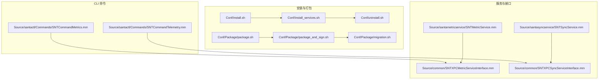
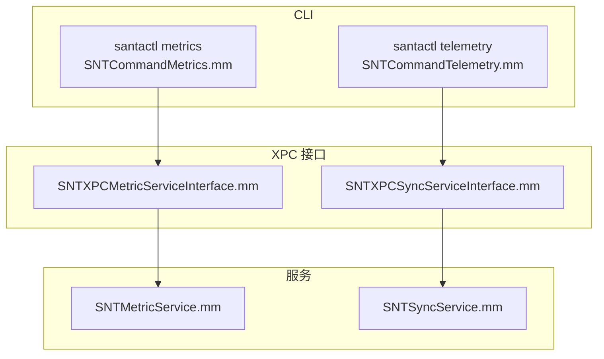
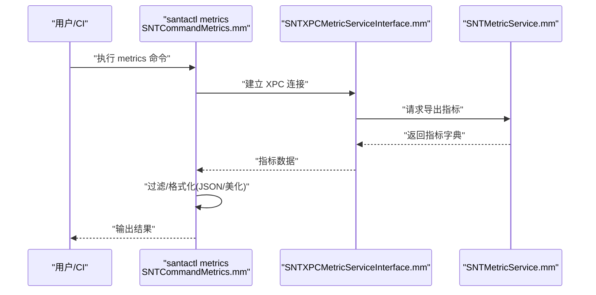
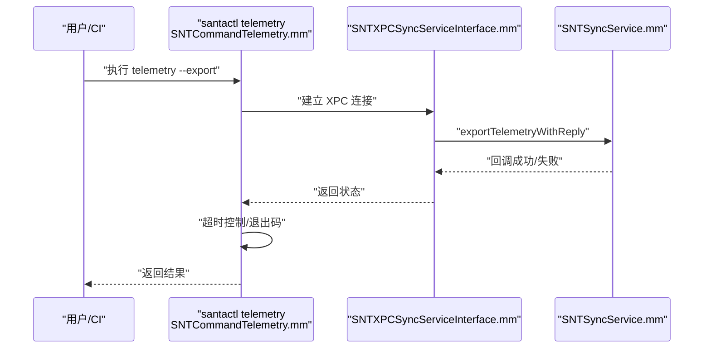
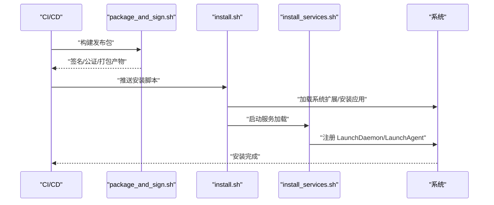
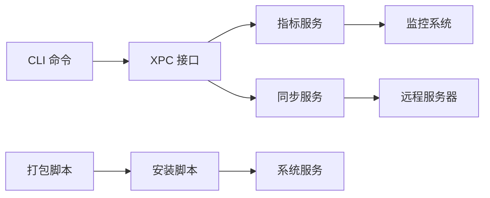

# 自动化集成

<cite>
**本文引用的文件**
- [README.md](file://README.md)
- [install.sh](file://Conf/install.sh)
- [install_services.sh](file://Conf/install_services.sh)
- [uninstall.sh](file://Conf/uninstall.sh)
- [package.sh](file://Conf/Package/package.sh)
- [package_and_sign.sh](file://Conf/Package/package_and_sign.sh)
- [migration.sh](file://Conf/Package/migration.sh)
- [SNTCommandMetrics.mm](file://Source/santactl/Commands/SNTCommandMetrics.mm)
- [SNTCommandTelemetry.mm](file://Source/santactl/Commands/SNTCommandTelemetry.mm)
- [SNTMetricService.mm](file://Source/santametricservice/SNTMetricService.mm)
- [SNTSyncService.mm](file://Source/santasyncservice/SNTSyncService.mm)
- [SNTXPCMetricServiceInterface.mm](file://Source/common/SNTXPCMetricServiceInterface.mm)
- [SNTXPCSyncServiceInterface.mm](file://Source/common/SNTXPCSyncServiceInterface.mm)
</cite>

## 目录
1. [简介](#简介)
2. [项目结构](#项目结构)
3. [核心组件](#核心组件)
4. [架构总览](#架构总览)
5. [详细组件分析](#详细组件分析)
6. [依赖关系分析](#依赖关系分析)
7. [性能考量](#性能考量)
8. [故障排查指南](#故障排查指南)
9. [结论](#结论)
10. [附录：自动化脚本模板](#附录自动化脚本模板)

## 简介
本文件面向需要在 macOS 上进行 Santa 安全授权系统自动化集成的工程团队，提供从安装部署、指标导出、遥测数据获取到 CI/CD 集成、监控与告警对接的完整实践指南。内容覆盖：
- 与外部系统的集成方法与自动化脚本编写
- 指标导出、遥测数据获取与文件信息查询的自动化流程
- CI/CD 集成、监控系统对接与告警系统集成方案
- API 调用封装、错误处理与重试机制
- 批量操作、并发控制与性能优化策略
- 完整的自动化部署与运维脚本模板

## 项目结构
Santa 仓库采用按功能域分层的组织方式，自动化相关的关键目录与文件如下：
- Conf：安装、卸载、打包与迁移脚本，以及 LaunchDaemon/LaunchAgent 的配置清单
- Source：用户态组件（santactl 命令行）、守护进程（santad）及各服务（metrics、sync、bundle）
- Testing/Docs：测试与文档资源

图表来源
- [install.sh](file://Conf/install.sh#L1-L68)
- [install_services.sh](file://Conf/install_services.sh#L1-L64)
- [uninstall.sh](file://Conf/uninstall.sh#L1-L42)
- [package.sh](file://Conf/Package/package.sh#L1-L77)
- [package_and_sign.sh](file://Conf/Package/package_and_sign.sh#L1-L153)
- [migration.sh](file://Conf/Package/migration.sh#L1-L41)
- [SNTCommandMetrics.mm](file://Source/santactl/Commands/SNTCommandMetrics.mm#L1-L182)
- [SNTCommandTelemetry.mm](file://Source/santactl/Commands/SNTCommandTelemetry.mm#L1-L112)
- [SNTMetricService.mm](file://Source/santametricservice/SNTMetricService.mm#L1-L130)
- [SNTSyncService.mm](file://Source/santasyncservice/SNTSyncService.mm#L1-L249)
- [SNTXPCMetricServiceInterface.mm](file://Source/common/SNTXPCMetricServiceInterface.mm#L1-L43)
- [SNTXPCSyncServiceInterface.mm](file://Source/common/SNTXPCSyncServiceInterface.mm#L1-L49)

章节来源
- [README.md](file://README.md#L1-L152)

## 核心组件
- 安装与升级自动化
  - install.sh：支持静默安装与受保护升级场景，自动处理 Lockdown 模式下的签名组件放行规则，触发安装流程并清理迁移缓存
  - install_services.sh：系统扩展启动时由 NPS Santa 系统扩展调用，负责卸载旧版 Google Santa 组件、加载新版本 LaunchDaemon/LaunchAgent
  - uninstall.sh：安全卸载，包括内核扩展卸载、服务卸载与残留文件清理
  - package.sh/package_and_sign.sh：打包、签名、公证、装箱与 DMG 制作的流水线
  - migration.sh：迁移脚本，用于从旧版 Google Santa 平滑迁移到 NPS Santa

- CLI 指标与遥测
  - SNTCommandMetrics：通过 XPC 连接获取指标，支持过滤与 JSON 导出
  - SNTCommandTelemetry：调试构建下提供遥测导出能力，带超时与信号量控制

- 服务与接口
  - SNTMetricService：根据配置格式化并写入监控系统（文件/HTTP）
  - SNTSyncService：同步管理、统计上报、遥测文件上传、日志广播
  - SNTXPCMetricServiceInterface/SNTXPCSyncServiceInterface：XPC 接口封装，定义参数类型与连接配置

章节来源
- [install.sh](file://Conf/install.sh#L1-L68)
- [install_services.sh](file://Conf/install_services.sh#L1-L64)
- [uninstall.sh](file://Conf/uninstall.sh#L1-L42)
- [package.sh](file://Conf/Package/package.sh#L1-L77)
- [package_and_sign.sh](file://Conf/Package/package_and_sign.sh#L1-L153)
- [migration.sh](file://Conf/Package/migration.sh#L1-L41)
- [SNTCommandMetrics.mm](file://Source/santactl/Commands/SNTCommandMetrics.mm#L1-L182)
- [SNTCommandTelemetry.mm](file://Source/santactl/Commands/SNTCommandTelemetry.mm#L1-L112)
- [SNTMetricService.mm](file://Source/santametricservice/SNTMetricService.mm#L1-L130)
- [SNTSyncService.mm](file://Source/santasyncservice/SNTSyncService.mm#L1-L249)
- [SNTXPCMetricServiceInterface.mm](file://Source/common/SNTXPCMetricServiceInterface.mm#L1-L43)
- [SNTXPCSyncServiceInterface.mm](file://Source/common/SNTXPCSyncServiceInterface.mm#L1-L49)

## 架构总览
Santa 的自动化集成围绕“CLI → XPC → 服务”的链路展开，指标与遥测分别由 metrics 与 sync 服务承载，并通过统一的配置与接口进行编排。

图表来源
- [SNTCommandMetrics.mm](file://Source/santactl/Commands/SNTCommandMetrics.mm#L1-L182)
- [SNTCommandTelemetry.mm](file://Source/santactl/Commands/SNTCommandTelemetry.mm#L1-L112)
- [SNTXPCMetricServiceInterface.mm](file://Source/common/SNTXPCMetricServiceInterface.mm#L1-L43)
- [SNTXPCSyncServiceInterface.mm](file://Source/common/SNTXPCSyncServiceInterface.mm#L1-L49)
- [SNTMetricService.mm](file://Source/santametricservice/SNTMetricService.mm#L1-L130)
- [SNTSyncService.mm](file://Source/santasyncservice/SNTSyncService.mm#L1-L249)

## 详细组件分析

### 指标导出自动化（metrics）
- 功能要点
  - 通过 XPC 从守护进程获取指标集合，支持前缀过滤与 JSON 输出
  - 依据配置决定是否导出、导出目标格式与周期
  - 支持美化输出与结构化 JSON，便于后续接入监控系统

- 关键流程（序列图）

图表来源
- [SNTCommandMetrics.mm](file://Source/santactl/Commands/SNTCommandMetrics.mm#L1-L182)
- [SNTXPCMetricServiceInterface.mm](file://Source/common/SNTXPCMetricServiceInterface.mm#L1-L43)
- [SNTMetricService.mm](file://Source/santametricservice/SNTMetricService.mm#L1-L130)

- 自动化建议
  - 在 CI 中定期拉取指标并通过 JSON 输出对接监控平台
  - 使用前缀过滤缩小输出范围，降低解析开销
  - 将导出周期与配置项对齐，避免频繁 I/O

章节来源
- [SNTCommandMetrics.mm](file://Source/santactl/Commands/SNTCommandMetrics.mm#L1-L182)
- [SNTMetricService.mm](file://Source/santametricservice/SNTMetricService.mm#L1-L130)
- [SNTXPCMetricServiceInterface.mm](file://Source/common/SNTXPCMetricServiceInterface.mm#L1-L43)

### 遥测数据获取自动化（telemetry）
- 功能要点
  - 调试构建下提供遥测导出能力，内部以信号量等待完成或超时
  - 同步代理调用后端服务执行文件流式上传

- 关键流程（序列图）

图表来源
- [SNTCommandTelemetry.mm](file://Source/santactl/Commands/SNTCommandTelemetry.mm#L1-L112)
- [SNTXPCSyncServiceInterface.mm](file://Source/common/SNTXPCSyncServiceInterface.mm#L1-L49)
- [SNTSyncService.mm](file://Source/santasyncservice/SNTSyncService.mm#L1-L249)

- 自动化建议
  - 在 CI 中设置合理超时时间，结合日志定位失败原因
  - 对上传任务进行幂等与重试控制，避免重复文件导致的异常

章节来源
- [SNTCommandTelemetry.mm](file://Source/santactl/Commands/SNTCommandTelemetry.mm#L1-L112)
- [SNTSyncService.mm](file://Source/santasyncservice/SNTSyncService.mm#L1-L249)
- [SNTXPCSyncServiceInterface.mm](file://Source/common/SNTXPCSyncServiceInterface.mm#L1-L49)

### 文件信息查询自动化（file info）
- 功能要点
  - 通过 CLI 查询文件相关信息，便于审计与合规检查
  - 可结合规则与事件数据库进行联动分析

- 自动化建议
  - 在批量扫描场景中，将查询结果标准化为 JSON，便于下游系统消费
  - 对高并发查询进行限速与队列化，避免对系统造成瞬时压力

章节来源
- [SNTCommandMetrics.mm](file://Source/santactl/Commands/SNTCommandMetrics.mm#L1-L182)

### 安装与升级自动化（CI/CD 集成）
- 流程概览
  - 包装阶段：签名、公证、打包、DMG 制作
  - 部署阶段：静默安装、受保护升级、服务加载
  - 卸载阶段：安全卸载与残留清理

- 关键流程（序列图）

图表来源
- [package_and_sign.sh](file://Conf/Package/package_and_sign.sh#L1-L153)
- [install.sh](file://Conf/install.sh#L1-L68)
- [install_services.sh](file://Conf/install_services.sh#L1-L64)

- 自动化建议
  - 在 CI 中将签名与公证步骤拆分为独立 Job，失败快速回滚
  - 使用受保护升级逻辑，避免 Lockdown 模式阻断更新
  - 在安装前后执行健康检查（如 metrics/状态查询），确保服务可用

章节来源
- [package.sh](file://Conf/Package/package.sh#L1-L77)
- [package_and_sign.sh](file://Conf/Package/package_and_sign.sh#L1-L153)
- [install.sh](file://Conf/install.sh#L1-L68)
- [install_services.sh](file://Conf/install_services.sh#L1-L64)
- [migration.sh](file://Conf/Package/migration.sh#L1-L41)

### 监控系统对接与告警集成
- 指标导出对接
  - SNTMetricService 根据配置选择文件或 HTTP 写入器，将指标转换为 RawJSON 或 MonarchJSON
  - 建议在监控系统中配置定时抓取与告警规则，结合前缀过滤与字段映射

- 遥测文件上传
  - SNTSyncService 通过流式 multipart 表单上传遥测文件，支持自定义 Content-Type 与长度头
  - 建议在监控系统中记录上传状态与响应码，异常时触发告警

- 告警策略建议
  - 指标异常阈值：如决策拒绝率、事件积压、同步失败数
  - 遥测上传失败：连续失败次数、超时比例
  - 系统扩展状态：加载失败、权限不足、签名验证失败

章节来源
- [SNTMetricService.mm](file://Source/santametricservice/SNTMetricService.mm#L1-L130)
- [SNTSyncService.mm](file://Source/santasyncservice/SNTSyncService.mm#L1-L249)

### 批量操作、并发控制与性能优化
- 批量操作
  - 使用 CLI 前缀过滤与 JSON 输出，减少解析成本
  - 对高并发查询与上传任务进行队列化与限速

- 并发控制
  - 指标导出与遥测上传采用异步与信号量控制，避免阻塞
  - 统一日志广播与状态上报，降低重复 I/O

- 性能优化
  - 降低导出频率与数据体量，结合配置项调整周期
  - 使用流式上传与零拷贝传输，减少内存占用
  - 在 CI 中并行执行签名、公证与打包任务

章节来源
- [SNTCommandMetrics.mm](file://Source/santactl/Commands/SNTCommandMetrics.mm#L1-L182)
- [SNTCommandTelemetry.mm](file://Source/santactl/Commands/SNTCommandTelemetry.mm#L1-L112)
- [SNTSyncService.mm](file://Source/santasyncservice/SNTSyncService.mm#L1-L249)

## 依赖关系分析
- 组件耦合
  - CLI 仅通过 XPC 与服务交互，降低耦合度
  - 指标与遥测分别由独立服务处理，职责清晰
  - 安装/卸载脚本与系统服务强耦合，需严格遵循权限与时机

- 外部依赖
  - 签名与公证工具链（codesign、xcrun stapler、产品包工具）
  - 监控系统（文件/HTTP 写入器）
  - 同步服务器（NATS/FCM/HTTP 上传）

图表来源
- [SNTCommandMetrics.mm](file://Source/santactl/Commands/SNTCommandMetrics.mm#L1-L182)
- [SNTCommandTelemetry.mm](file://Source/santactl/Commands/SNTCommandTelemetry.mm#L1-L112)
- [SNTXPCMetricServiceInterface.mm](file://Source/common/SNTXPCMetricServiceInterface.mm#L1-L43)
- [SNTXPCSyncServiceInterface.mm](file://Source/common/SNTXPCSyncServiceInterface.mm#L1-L49)
- [SNTMetricService.mm](file://Source/santametricservice/SNTMetricService.mm#L1-L130)
- [SNTSyncService.mm](file://Source/santasyncservice/SNTSyncService.mm#L1-L249)
- [package_and_sign.sh](file://Conf/Package/package_and_sign.sh#L1-L153)
- [install.sh](file://Conf/install.sh#L1-L68)

## 性能考量
- I/O 与网络
  - 指标导出与遥测上传应避免高频小块写入，合并批量处理
  - 上传阶段使用流式传输，设置合理的 Content-Length 与超时

- CPU 与内存
  - 减少不必要的 JSON 序列化与字符串拼接
  - 控制并发度，避免与系统扩展的热点竞争

- 存储与日志
  - 合理配置日志轮转与保留策略，避免磁盘压力
  - 清理临时文件与迁移缓存，保持系统整洁

## 故障排查指南
- 安装失败
  - 检查权限与系统扩展加载状态
  - 受保护升级场景下确认 Lockdown 模式下的签名组件放行规则已生效

- 指标未导出
  - 确认配置项开启导出、格式与目标 URL 正确
  - 查看服务日志，定位格式化或写入错误

- 遥测上传失败
  - 检查网络连通性与服务器状态码
  - 结合超时与信号量日志定位阻塞点

- 卸载残留
  - 执行卸载脚本并手动清理残留 LaunchDaemon/LaunchAgent 与日志配置

章节来源
- [install.sh](file://Conf/install.sh#L1-L68)
- [install_services.sh](file://Conf/install_services.sh#L1-L64)
- [uninstall.sh](file://Conf/uninstall.sh#L1-L42)
- [SNTMetricService.mm](file://Source/santametricservice/SNTMetricService.mm#L1-L130)
- [SNTSyncService.mm](file://Source/santasyncservice/SNTSyncService.mm#L1-L249)

## 结论
通过 CLI → XPC → 服务的清晰架构，Santa 提供了完善的自动化集成能力。结合本文提供的脚本模板、流程图与最佳实践，可在企业环境中实现稳定、可观察、可扩展的自动化部署与运维。

## 附录：自动化脚本模板
以下为可直接复用的自动化脚本模板路径与要点说明（请勿直接粘贴具体代码内容）：

- 安装与升级
  - [安装脚本](file://Conf/install.sh#L1-L68)：支持受保护升级与 Lockdown 模式放行规则
  - [服务加载脚本](file://Conf/install_services.sh#L1-L64)：卸载旧版组件并加载新服务
  - [迁移脚本](file://Conf/Package/migration.sh#L1-L41)：从 Google Santa 平滑迁移
  - [卸载脚本](file://Conf/uninstall.sh#L1-L42)：安全卸载与残留清理

- 打包与签名
  - [打包脚本](file://Conf/Package/package.sh#L1-L77)：生成 app.pkg 与开发包
  - [签名与公证脚本](file://Conf/Package/package_and_sign.sh#L1-L153)：全链路签名、公证、装箱与 DMG 制作

- 指标与遥测
  - [指标命令](file://Source/santactl/Commands/SNTCommandMetrics.mm#L1-L182)：过滤与 JSON 导出
  - [遥测命令](file://Source/santactl/Commands/SNTCommandTelemetry.mm#L1-L112)：调试导出与超时控制
  - [指标服务](file://Source/santametricservice/SNTMetricService.mm#L1-L130)：格式化与写入
  - [同步服务](file://Source/santasyncservice/SNTSyncService.mm#L1-L249)：遥测上传与日志广播

- XPC 接口
  - [指标 XPC 接口](file://Source/common/SNTXPCMetricServiceInterface.mm#L1-L43)
  - [同步 XPC 接口](file://Source/common/SNTXPCSyncServiceInterface.mm#L1-L49)

- CI/CD 集成建议
  - 将签名与公证作为独立 Job，失败即停
  - 使用受保护升级逻辑，避免 Lockdown 模式阻断
  - 在安装前后执行健康检查（metrics/状态查询）