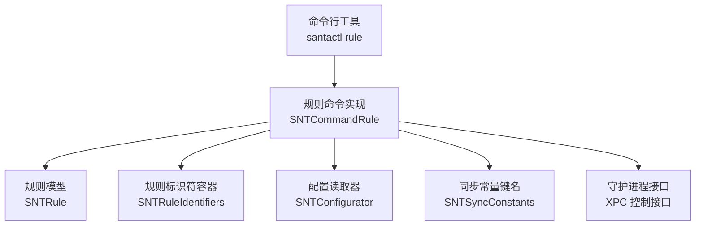
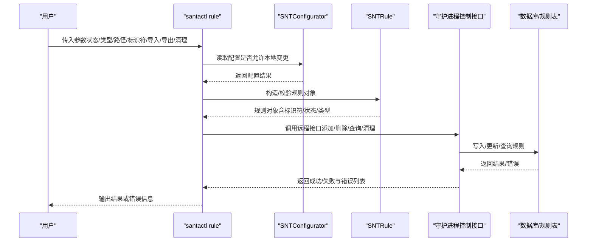
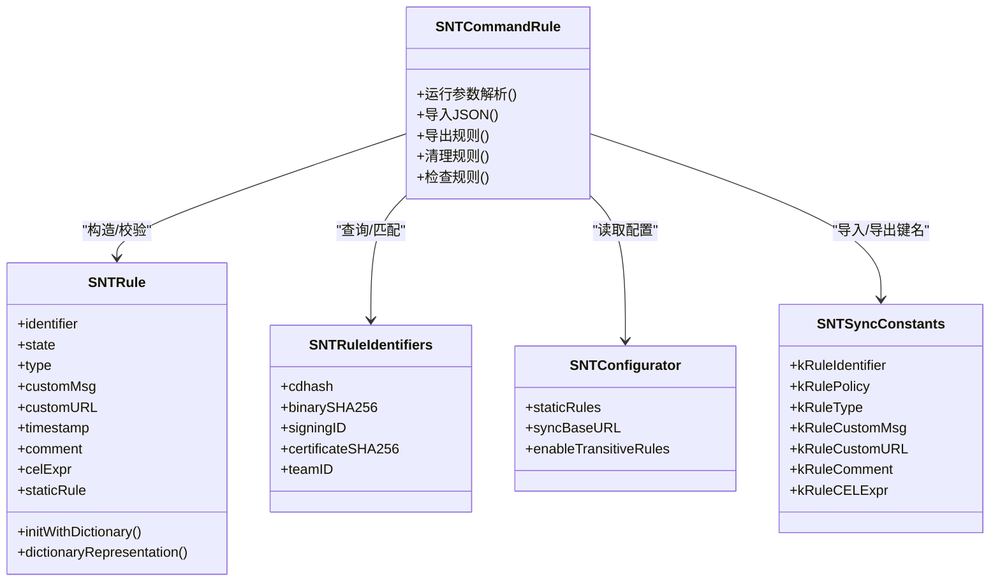

# 规则管理命令

<cite>
**本文引用的文件**
- [Source/santactl/Commands/SNTCommandRule.mm](file://Source/santactl/Commands/SNTCommandRule.mm)
- [Source/common/SNTRule.h](file://Source/common/SNTRule.h)
- [Source/common/SNTRule.mm](file://Source/common/SNTRule.mm)
- [Source/common/SNTRuleIdentifiers.h](file://Source/common/SNTRuleIdentifiers.h)
- [Source/common/SNTRuleIdentifiers.mm](file://Source/common/SNTRuleIdentifiers.mm)
- [Source/common/SNTConfigurator.h](file://Source/common/SNTConfigurator.h)
- [Source/common/SNTConfigurator.mm](file://Source/common/SNTConfigurator.mm)
- [Source/common/SNTSyncConstants.h](file://Source/common/SNTSyncConstants.h)
</cite>

## 目录
1. [简介](#简介)
2. [项目结构](#项目结构)
3. [核心组件](#核心组件)
4. [架构总览](#架构总览)
5. [详细组件分析](#详细组件分析)
6. [依赖关系分析](#依赖关系分析)
7. [性能考量](#性能考量)
8. [故障排查指南](#故障排查指南)
9. [结论](#结论)
10. [附录](#附录)

## 简介
本文件面向 Santa 的规则管理命令（santactl rule），系统化阐述规则的添加、删除、查询与修改语法与参数；详解三类规则类型（代码签名规则、路径规则、静态规则）的参数格式；提供批量规则操作示例与最佳实践；覆盖规则优先级、验证与冲突处理；并给出规则导出、导入与备份恢复流程，以及自动化脚本与集成建议。

## 项目结构
围绕规则管理命令，涉及以下关键模块：
- 命令入口与解析：santactl 规则命令实现，负责参数解析、调用守护进程接口、执行导入/导出等。
- 规则模型：SNTRule 定义规则字段、校验与序列化；SNTRuleIdentifiers 提供跨组件传递的标识符结构。
- 配置与策略：SNTConfigurator 暴露静态规则、同步服务器配置等，影响本地是否允许手动变更。
- 同步常量：SNTSyncConstants 定义规则字典键名，用于导入/导出 JSON 结构。

图表来源
- [Source/santactl/Commands/SNTCommandRule.mm](file://Source/santactl/Commands/SNTCommandRule.mm#L125-L447)
- [Source/common/SNTRule.h](file://Source/common/SNTRule.h#L22-L129)
- [Source/common/SNTRule.mm](file://Source/common/SNTRule.mm#L40-L222)
- [Source/common/SNTRuleIdentifiers.h](file://Source/common/SNTRuleIdentifiers.h#L31-L62)
- [Source/common/SNTConfigurator.h](file://Source/common/SNTConfigurator.h#L544-L610)
- [Source/common/SNTSyncConstants.h](file://Source/common/SNTSyncConstants.h#L115-L141)

章节来源
- [Source/santactl/Commands/SNTCommandRule.mm](file://Source/santactl/Commands/SNTCommandRule.mm#L125-L447)
- [Source/common/SNTRule.h](file://Source/common/SNTRule.h#L22-L129)
- [Source/common/SNTRule.mm](file://Source/common/SNTRule.mm#L40-L222)
- [Source/common/SNTRuleIdentifiers.h](file://Source/common/SNTRuleIdentifiers.h#L31-L62)
- [Source/common/SNTConfigurator.h](file://Source/common/SNTConfigurator.h#L544-L610)
- [Source/common/SNTSyncConstants.h](file://Source/common/SNTSyncConstants.h#L115-L141)

## 核心组件
- 规则命令实现（SNTCommandRule）
  - 负责解析参数、构造 SNTRule、调用守护进程接口进行规则增删改查、支持导入/导出 JSON、清理规则等。
  - 关键行为包括：状态设置（允许/阻止/静默阻止/编译器放行/CEL）、类型选择（二进制/证书/团队ID/签名ID/CDHash）、路径推导标识符、校验与错误输出、文件访问规则检查等。
- 规则模型（SNTRule）
  - 字段：标识符、状态、类型、自定义消息/URL、时间戳、注释、CEL 表达式、是否静态规则。
  - 校验：对不同类型的标识符长度与字符集进行严格校验，并规范化大小写。
  - 序列化：支持从字典初始化、导出为字典，便于导入/导出 JSON。
- 规则标识符容器（SNTRuleIdentifiers）
  - 封装 cdhash、二进制 SHA-256、签名 ID、证书 SHA-256、团队 ID，用于匹配与查询。
- 配置读取器（SNTConfigurator）
  - 提供静态规则、同步服务器地址等配置，决定是否允许在本地手动变更规则。
- 同步常量（SNTSyncConstants）
  - 定义规则字典键名（如标识符、策略、类型、自定义消息/URL、注释、CEL 表达式等），用于导入/导出 JSON 的结构约定。

章节来源
- [Source/santactl/Commands/SNTCommandRule.mm](file://Source/santactl/Commands/SNTCommandRule.mm#L125-L447)
- [Source/common/SNTRule.h](file://Source/common/SNTRule.h#L22-L129)
- [Source/common/SNTRule.mm](file://Source/common/SNTRule.mm#L40-L222)
- [Source/common/SNTRuleIdentifiers.h](file://Source/common/SNTRuleIdentifiers.h#L31-L62)
- [Source/common/SNTConfigurator.h](file://Source/common/SNTConfigurator.h#L544-L610)
- [Source/common/SNTSyncConstants.h](file://Source/common/SNTSyncConstants.h#L115-L141)

## 架构总览
santactl rule 的典型调用链如下：

图表来源
- [Source/santactl/Commands/SNTCommandRule.mm](file://Source/santactl/Commands/SNTCommandRule.mm#L125-L447)
- [Source/common/SNTConfigurator.h](file://Source/common/SNTConfigurator.h#L544-L610)
- [Source/common/SNTRule.mm](file://Source/common/SNTRule.mm#L40-L222)

## 详细组件分析

### 命令语法与参数
- 基本用法
  - 使用方式：santactl rule [选项]
  - 必需权限：需要 root 权限
  - 需要连接：需要与守护进程建立连接
- 子命令/状态
  - --allow 或 --whitelist：添加允许规则
  - --block 或 --blacklist：添加阻止规则
  - --silent-block 或 --silent-blacklist：添加静默阻止规则
  - --compiler：添加允许编译器规则
  - --cel 'expr'：添加 CEL 规则表达式
  - --remove：移除现有规则
  - --check：检查是否存在规则
  - --import <路径>：从 JSON 文件导入规则
  - --export <路径>：导出非静态规则到 JSON 文件
  - --export-file-access <路径>：导出文件访问规则到 Plist（调试构建可用）
- 选择规则类型
  - --path <路径>：根据路径推导规则标识符（默认二进制 SHA-256）
  - --identifier <值>：显式指定标识符（可为 sha256、teamID、signingID、cdhash）
  - --sha256 <哈希>：指定二进制 SHA-256（已弃用）
  - --teamid：按团队 ID 规则
  - --signingid：按签名 ID 规则（格式为 TeamID:SigningID；平台二进制使用特殊标记）
  - --certificate：按证书 SHA-256 规则
  - --cdhash：按 CDHash 规则
  - --file-access：仅与 --check 搭配，检查路径关联的文件访问规则
- 可选参数
  - --message <消息>：阻止时显示的自定义消息
  - --comment <注释>：附加到新规则的注释
  - --clean：清理所有非传递性规则
  - --clean-all：清理全部规则
  - --force：强制允许在启用同步服务器时进行手动变更（调试构建）
- 导入/导出规则
  - 导出 JSON：仅导出非静态且非移除规则
  - 导入 JSON：将 JSON 中的规则批量写入数据库
  - 清理策略：--clean/--clean-all 可与 --import 组合先清空再导入
- 文件访问规则
  - --export-file-access：导出文件访问规则（调试构建）

章节来源
- [Source/santactl/Commands/SNTCommandRule.mm](file://Source/santactl/Commands/SNTCommandRule.mm#L50-L123)
- [Source/santactl/Commands/SNTCommandRule.mm](file://Source/santactl/Commands/SNTCommandRule.mm#L153-L335)

### 规则类型与参数格式
- 二进制 SHA-256 规则
  - 标识符要求：长度为哈希字节数的十六进制字符串，不区分大小写但内部会归一化为小写
  - 适用场景：基于文件指纹的精确控制
- 证书 SHA-256 规则
  - 标识符要求：证书 SHA-256 十六进制串
  - 适用场景：基于签发者证书的控制
- 团队 ID（Team ID）规则
  - 标识符要求：固定长度的字母数字串，强制大写
  - 适用场景：组织级白名单/黑名单
- 签名 ID（Signing ID）规则
  - 格式：TeamID:SigningID；当为平台二进制时 TeamID 使用特殊标记
  - 大小写：TeamID 强制大写（平台二进制除外），SigningID 保持原样
  - 适用场景：细粒度授权，限定到开发者签名身份
- CDHash 规则
  - 标识符要求：固定长度十六进制串，内部归一化为小写
  - 适用场景：内核/系统组件级别的精确匹配
- 静态规则
  - 通过配置注入，作为本地永久规则集，不受在线同步覆盖
  - 与动态规则共存时，静态规则优先级更高

章节来源
- [Source/common/SNTRule.mm](file://Source/common/SNTRule.mm#L63-L167)
- [Source/common/SNTRule.mm](file://Source/common/SNTRule.mm#L169-L186)
- [Source/common/SNTConfigurator.h](file://Source/common/SNTConfigurator.h#L56-L79)

### 规则验证与错误处理
- 标识符校验
  - 不同类型标识符长度与字符集严格校验，不符合将返回错误
  - 归一化处理：二进制/证书/CDHash 统一转为小写；TeamID 统一转为大写；SigningID 保留原样
- 状态与表达式
  - 当状态为 CEL 时必须提供表达式，否则报错
- 参数互斥与组合
  - --check 与 --import/--export/--export-file-access/--clean/--clean-all 互斥
  - --file-access 仅能与 --check 搭配且需提供 --path
  - 导入/导出只能单独使用，不能与其他目标混用
- 配置限制
  - 若配置了同步服务器或存在静态规则，且不是 --check，将拒绝本地变更（除非使用调试构建的强制标志）

章节来源
- [Source/santactl/Commands/SNTCommandRule.mm](file://Source/santactl/Commands/SNTCommandRule.mm#L259-L335)
- [Source/common/SNTRule.mm](file://Source/common/SNTRule.mm#L169-L186)
- [Source/common/SNTRule.mm](file://Source/common/SNTRule.mm#L63-L167)
- [Source/common/SNTConfigurator.h](file://Source/common/SNTConfigurator.h#L544-L610)

### 批量规则操作与最佳实践
- 批量导入
  - 使用 --import <路径> 导入 JSON 文件；建议先使用 --clean/--clean-all 清理旧规则，避免冲突
  - 导入文件结构遵循同步常量键名，包含规则数组
- 批量导出
  - 使用 --export <路径> 导出当前非静态规则；注意导出不包含传递性规则与移除规则
- 清理策略
  - --clean：仅清理非传递性规则
  - --clean-all：清理全部规则
- 最佳实践
  - 在启用同步服务器或存在静态规则时，避免直接本地变更；如需变更，先评估策略一致性
  - 对于签名 ID 规则，确保 TeamID 与 SigningID 格式正确
  - 使用 --comment 记录变更原因与责任人，便于审计

章节来源
- [Source/santactl/Commands/SNTCommandRule.mm](file://Source/santactl/Commands/SNTCommandRule.mm#L315-L335)
- [Source/common/SNTSyncConstants.h](file://Source/common/SNTSyncConstants.h#L115-L141)

### 规则优先级与冲突解决
- 优先级
  - 静态规则优先于动态规则；本地规则优先于同步规则（在未启用同步或未配置静态规则时）
- 冲突解决
  - 当多条规则针对同一标识符时，状态与类型共同决定最终决策
  - 使用 --check 查询当前规则状态，确认冲突来源
  - 通过 --remove 移除冲突规则，或调整状态/类型以消除歧义

章节来源
- [Source/common/SNTConfigurator.h](file://Source/common/SNTConfigurator.h#L56-L79)
- [Source/santactl/Commands/SNTCommandRule.mm](file://Source/santactl/Commands/SNTCommandRule.mm#L394-L404)

### 规则导出、导入与备份恢复
- 导出
  - --export <路径>：导出非静态规则为 JSON；导出前可结合 --clean/--clean-all 清理
  - --export-file-access <路径>：导出文件访问规则（调试构建）
- 导入
  - --import <路径>：从 JSON 批量导入规则；建议配合清理选项
- 备份与恢复
  - 备份：定期执行导出，保存到受控位置
  - 恢复：在新环境或回滚时执行导入，必要时先清理旧规则

章节来源
- [Source/santactl/Commands/SNTCommandRule.mm](file://Source/santactl/Commands/SNTCommandRule.mm#L470-L569)
- [Source/common/SNTSyncConstants.h](file://Source/common/SNTSyncConstants.h#L115-L141)

### 自动化脚本与集成方案
- 脚本建议
  - 导入前：执行清理（--clean/--clean-all），避免历史规则干扰
  - 导入后：执行 --check 校验关键规则状态
  - 定期导出：生成规则快照，纳入版本控制或安全审计
- 集成建议
  - CI/CD：在部署阶段自动导入规则清单，确保一致性
  - 运维：通过统一配置管理下发静态规则，减少本地变更
  - 监控：对规则导入/导出日志进行告警与审计

章节来源
- [Source/santactl/Commands/SNTCommandRule.mm](file://Source/santactl/Commands/SNTCommandRule.mm#L315-L335)
- [Source/common/SNTConfigurator.h](file://Source/common/SNTConfigurator.h#L56-L79)

## 依赖关系分析
- 组件耦合
  - SNTCommandRule 依赖 SNTRule 进行规则对象构造与校验，依赖 SNTConfigurator 判断是否允许本地变更，依赖同步常量键名进行导入/导出字典结构
- 关键依赖链
  - 参数解析 → 规则对象构造 → 守护进程接口调用 → 数据库写入/查询 → 结果输出
- 外部接口
  - XPC 控制接口用于与守护进程通信，完成规则的持久化与查询

图表来源
- [Source/santactl/Commands/SNTCommandRule.mm](file://Source/santactl/Commands/SNTCommandRule.mm#L125-L447)
- [Source/common/SNTRule.h](file://Source/common/SNTRule.h#L22-L129)
- [Source/common/SNTRuleIdentifiers.h](file://Source/common/SNTRuleIdentifiers.h#L31-L62)
- [Source/common/SNTConfigurator.h](file://Source/common/SNTConfigurator.h#L544-L610)
- [Source/common/SNTSyncConstants.h](file://Source/common/SNTSyncConstants.h#L115-L141)

## 性能考量
- 导入/导出批处理
  - 批量导入时建议分批处理，避免一次性写入过多规则导致阻塞
- 规则数量
  - 大规模规则集可能增加匹配开销，建议合并同类项与精简规则
- 日志与输出
  - 导出/导入过程会产生日志，建议在低峰时段执行，减少对系统的影响

## 故障排查指南
- 常见错误
  - 标识符格式错误：检查长度与字符集是否符合类型要求
  - 状态与表达式不匹配：CEL 规则必须提供表达式
  - 参数互斥：--check 与导入/导出/清理互斥；--file-access 仅与 --check 搭配
  - 配置限制：启用同步服务器或静态规则时禁止本地变更
- 排查步骤
  - 使用 --check 确认当前规则状态
  - 使用 --export 导出现有规则，比对期望状态
  - 使用 --remove 移除冲突规则，重新导入
  - 查看守护进程日志定位具体错误

章节来源
- [Source/santactl/Commands/SNTCommandRule.mm](file://Source/santactl/Commands/SNTCommandRule.mm#L259-L335)
- [Source/common/SNTRule.mm](file://Source/common/SNTRule.mm#L63-L167)

## 结论
santactl rule 提供了完善的规则生命周期管理能力，覆盖添加、删除、查询、修改、导入/导出与清理。通过严格的标识符校验、清晰的状态/类型语义以及与配置系统的协同，能够满足企业级规则治理需求。建议在启用同步或静态规则时谨慎进行本地变更，并通过脚本化与审计流程保障规则的一致性与可追溯性。

## 附录
- 规则字典键名参考（用于导入/导出 JSON）
  - 标识符：对应规则标识符
  - 策略：允许/阻止/静默阻止/编译器放行/CEL/移除等
  - 类型：二进制/证书/团队ID/签名ID/CDHash
  - 自定义消息/URL：可选
  - 注释：可选
  - CEL 表达式：CEL 规则必填

章节来源
- [Source/common/SNTSyncConstants.h](file://Source/common/SNTSyncConstants.h#L115-L141)