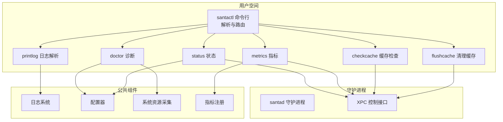
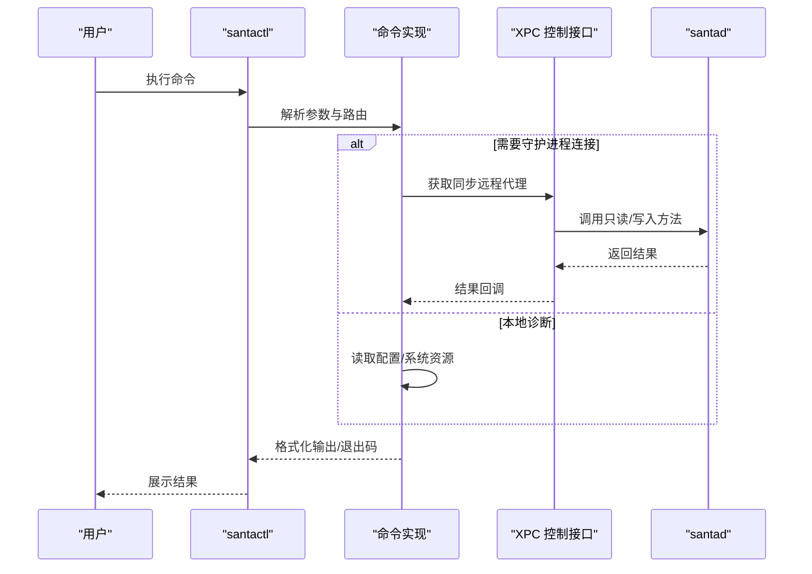
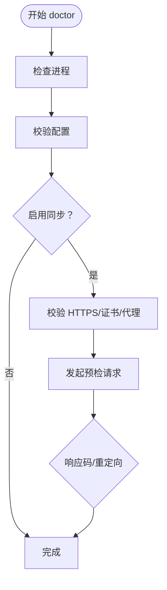
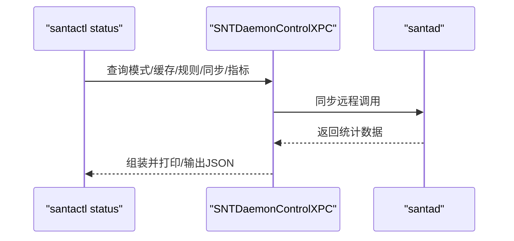
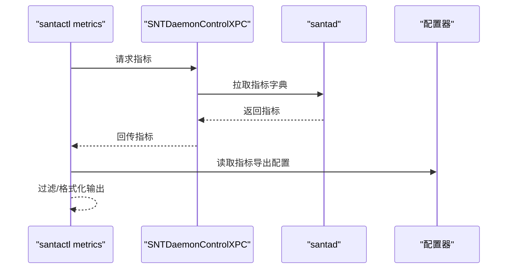
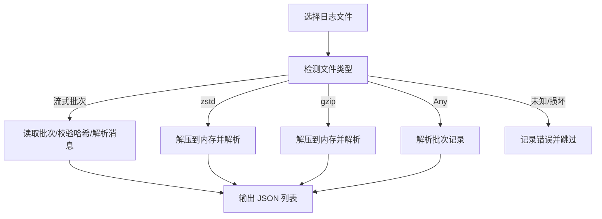
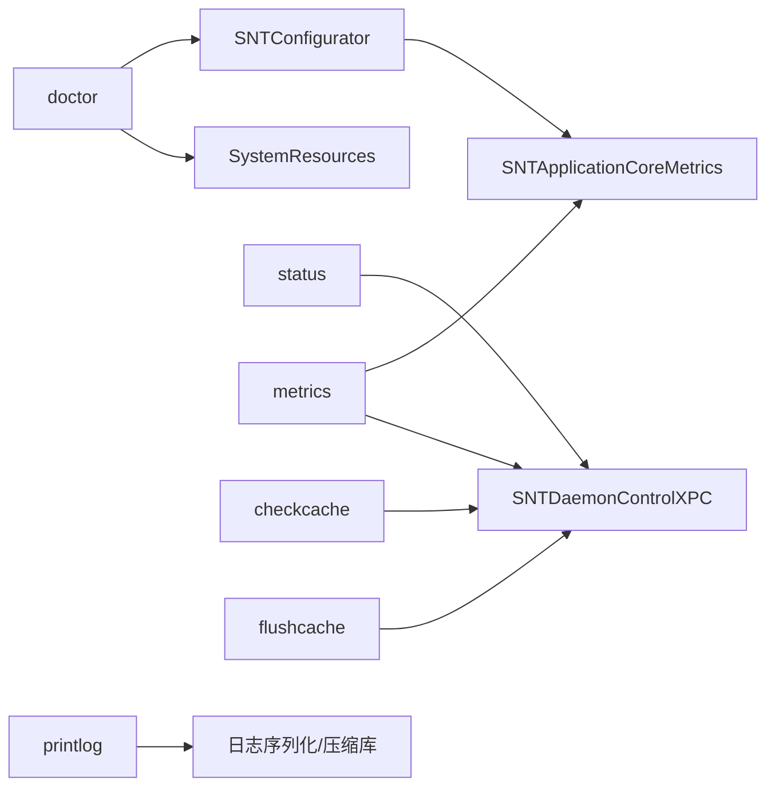

# 诊断工具

<cite>
**本文引用的文件**
- [Source/santactl/main.mm](file://Source/santactl/main.mm)
- [Source/santactl/Commands/SNTCommandDoctor.mm](file://Source/santactl/Commands/SNTCommandDoctor.mm)
- [Source/santactl/Commands/SNTCommandStatus.mm](file://Source/santactl/Commands/SNTCommandStatus.mm)
- [Source/santactl/Commands/SNTCommandMetrics.mm](file://Source/santactl/Commands/SNTCommandMetrics.mm)
- [Source/santactl/Commands/SNTCommandPrintLog.mm](file://Source/santactl/Commands/SNTCommandPrintLog.mm)
- [Source/santactl/Commands/SNTCommandCheckCache.mm](file://Source/santactl/Commands/SNTCommandCheckCache.mm)
- [Source/santactl/Commands/SNTCommandFlushCache.mm](file://Source/santactl/Commands/SNTCommandFlushCache.mm)
- [Source/common/SNTLogging.h](file://Source/common/SNTLogging.h)
- [Source/common/SNTConfigurator.mm](file://Source/common/SNTConfigurator.mm)
- [Source/common/SystemResources.h](file://Source/common/SystemResources.h)
- [Source/common/SNTXPCControlInterface.h](file://Source/common/SNTXPCControlInterface.h)
- [Source/common/MOLXPCConnection.h](file://Source/common/MOLXPCConnection.h)
- [Source/common/MOLXPCConnection.mm](file://Source/common/MOLXPCConnection.mm)
- [Source/santad/SNTApplicationCoreMetrics.mm](file://Source/santad/SNTApplicationCoreMetrics.mm)
</cite>

## 目录
1. [简介](#简介)
2. [项目结构](#项目结构)
3. [核心组件](#核心组件)
4. [架构总览](#架构总览)
5. [详细组件分析](#详细组件分析)
6. [依赖关系分析](#依赖关系分析)
7. [性能考量](#性能考量)
8. [故障排查指南](#故障排查指南)
9. [结论](#结论)
10. [附录](#附录)

## 简介
本文件为 Santa 诊断工具的详细使用文档，覆盖系统诊断、日志查看、缓存清理与健康检查等能力。重点说明以下方面：
- 命令行工具 santactl 的使用场景、参数与输出解释
- 日志级别、过滤与分析技巧（基于内置日志与事件日志）
- 缓存状态检查、缓存清理与性能优化建议
- 系统健康检查、依赖验证与配置校验方法
- 自动化诊断脚本与故障排除流程

## 项目结构
诊断相关功能主要由三部分组成：
- 命令行工具：santactl 及其子命令（doctor、status、metrics、printlog、checkcache、flushcache）
- 运行时服务：santad（守护进程）通过 XPC 暴露控制接口供 santactl 查询与操作
- 公共基础设施：日志、配置、系统资源采集、指标注册

图表来源
- [Source/santactl/main.mm](file://Source/santactl/main.mm#L39-L84)
- [Source/santactl/Commands/SNTCommandDoctor.mm](file://Source/santactl/Commands/SNTCommandDoctor.mm#L79-L85)
- [Source/santactl/Commands/SNTCommandStatus.mm](file://Source/santactl/Commands/SNTCommandStatus.mm#L85-L116)
- [Source/santactl/Commands/SNTCommandMetrics.mm](file://Source/santactl/Commands/SNTCommandMetrics.mm#L168-L179)
- [Source/santactl/Commands/SNTCommandPrintLog.mm](file://Source/santactl/Commands/SNTCommandPrintLog.mm#L346-L407)
- [Source/santactl/Commands/SNTCommandCheckCache.mm](file://Source/santactl/Commands/SNTCommandCheckCache.mm#L57-L76)
- [Source/santactl/Commands/SNTCommandFlushCache.mm](file://Source/santactl/Commands/SNTCommandFlushCache.mm#L53-L63)
- [Source/common/SNTXPCControlInterface.h](file://Source/common/SNTXPCControlInterface.h#L28-L77)
- [Source/common/MOLXPCConnection.h](file://Source/common/MOLXPCConnection.h#L149-L163)

章节来源
- [Source/santactl/main.mm](file://Source/santactl/main.mm#L39-L84)

## 核心组件
- doctor：系统级诊断，检查进程、配置与同步连通性，失败时以非零退出码提示
- status：运行时状态查询，含模式、缓存计数、规则计数、同步状态、指标导出配置等
- metrics：运行时指标查询与过滤，支持 JSON 输出
- printlog：将压缩或二进制格式的日志文件解析为 JSON 输出
- checkcache：按文件路径计算 vnodeID 并查询授权缓存状态（开发用途）
- flushcache：请求守护进程清空授权缓存（开发用途）

章节来源
- [Source/santactl/Commands/SNTCommandDoctor.mm](file://Source/santactl/Commands/SNTCommandDoctor.mm#L79-L85)
- [Source/santactl/Commands/SNTCommandStatus.mm](file://Source/santactl/Commands/SNTCommandStatus.mm#L85-L116)
- [Source/santactl/Commands/SNTCommandMetrics.mm](file://Source/santactl/Commands/SNTCommandMetrics.mm#L168-L179)
- [Source/santactl/Commands/SNTCommandPrintLog.mm](file://Source/santactl/Commands/SNTCommandPrintLog.mm#L346-L407)
- [Source/santactl/Commands/SNTCommandCheckCache.mm](file://Source/santactl/Commands/SNTCommandCheckCache.mm#L57-L76)
- [Source/santactl/Commands/SNTCommandFlushCache.mm](file://Source/santactl/Commands/SNTCommandFlushCache.mm#L53-L63)

## 架构总览
santactl 通过 XPC 与 santad 通信，调用 SNTDaemonControlXPC 接口获取状态、指标与执行操作；doctor 使用系统资源与配置器进行本地校验。

图表来源
- [Source/santactl/Commands/SNTCommandStatus.mm](file://Source/santactl/Commands/SNTCommandStatus.mm#L85-L116)
- [Source/santactl/Commands/SNTCommandMetrics.mm](file://Source/santactl/Commands/SNTCommandMetrics.mm#L168-L179)
- [Source/santactl/Commands/SNTCommandDoctor.mm](file://Source/santactl/Commands/SNTCommandDoctor.mm#L145-L246)
- [Source/common/SNTXPCControlInterface.h](file://Source/common/SNTXPCControlInterface.h#L28-L77)
- [Source/common/MOLXPCConnection.h](file://Source/common/MOLXPCConnection.h#L149-L163)

## 详细组件分析

### doctor：系统诊断
- 作用：检查关键进程是否运行、配置是否有效、同步连通性（HTTPS、证书、重定向等），失败时返回非零退出码
- 关键点：
  - 进程检查：查找 GUI、守护进程与同步服务进程
  - 配置校验：委托配置器进行校验并逐条输出错误
  - 同步测试：向预检端点发起请求，记录响应码与重定向位置
- 使用建议：
  - 作为自动化巡检入口，结合退出码判断整体健康度
  - 在集成测试或上线前执行，确保基础依赖可用

图表来源
- [Source/santactl/Commands/SNTCommandDoctor.mm](file://Source/santactl/Commands/SNTCommandDoctor.mm#L79-L126)
- [Source/santactl/Commands/SNTCommandDoctor.mm](file://Source/santactl/Commands/SNTCommandDoctor.mm#L128-L143)
- [Source/santactl/Commands/SNTCommandDoctor.mm](file://Source/santactl/Commands/SNTCommandDoctor.mm#L145-L246)

章节来源
- [Source/santactl/Commands/SNTCommandDoctor.mm](file://Source/santactl/Commands/SNTCommandDoctor.mm#L79-L126)
- [Source/santactl/Commands/SNTCommandDoctor.mm](file://Source/santactl/Commands/SNTCommandDoctor.mm#L128-L143)
- [Source/santactl/Commands/SNTCommandDoctor.mm](file://Source/santactl/Commands/SNTCommandDoctor.mm#L145-L246)

### status：运行时健康检查
- 作用：输出运行模式、缓存计数、规则计数、同步状态、推送通知、指标导出等信息；支持 JSON 输出
- 关键点：
  - 模式与日志类型：Monitor/Lockdown/Standalone 或临时监控模式
  - 缓存统计：root 与非 root 缓存条目数
  - 规则统计：二进制、证书、TeamID、SigningID、CDHash、编译器与传递式规则
  - 同步状态：上次全量/规则同步时间、是否需要清洁同步、事件待上传数、规则哈希
  - 指标导出：服务器地址、格式、导出间隔
- 使用建议：
  - 日常巡检：直接人类可读输出
  - 集成监控：使用 --json 导出便于解析

图表来源
- [Source/santactl/Commands/SNTCommandStatus.mm](file://Source/santactl/Commands/SNTCommandStatus.mm#L85-L116)
- [Source/santactl/Commands/SNTCommandStatus.mm](file://Source/santactl/Commands/SNTCommandStatus.mm#L373-L396)
- [Source/common/SNTXPCControlInterface.h](file://Source/common/SNTXPCControlInterface.h#L28-L77)

章节来源
- [Source/santactl/Commands/SNTCommandStatus.mm](file://Source/santactl/Commands/SNTCommandStatus.mm#L85-L116)
- [Source/santactl/Commands/SNTCommandStatus.mm](file://Source/santactl/Commands/SNTCommandStatus.mm#L373-L396)

### metrics：指标查询与过滤
- 作用：拉取运行时指标集，支持前缀过滤与 JSON 输出；同时展示指标服务器、格式与导出间隔
- 关键点：
  - 指标数据标准化：日期字段转换为 ISO 字符串
  - 过滤策略：对指标名称进行前缀匹配
  - 输出格式：人类可读或 JSON
- 使用建议：
  - 与监控系统集成：使用 --json 与前缀过滤减少带宽
  - 结合配置项：关注 MetricURL、MetricFormat、MetricExportInterval

图表来源
- [Source/santactl/Commands/SNTCommandMetrics.mm](file://Source/santactl/Commands/SNTCommandMetrics.mm#L168-L179)
- [Source/santactl/Commands/SNTCommandMetrics.mm](file://Source/santactl/Commands/SNTCommandMetrics.mm#L112-L146)
- [Source/common/SNTConfigurator.mm](file://Source/common/SNTConfigurator.mm#L180-L190)

章节来源
- [Source/santactl/Commands/SNTCommandMetrics.mm](file://Source/santactl/Commands/SNTCommandMetrics.mm#L112-L146)
- [Source/santactl/Commands/SNTCommandMetrics.mm](file://Source/santactl/Commands/SNTCommandMetrics.mm#L148-L167)
- [Source/santactl/Commands/SNTCommandMetrics.mm](file://Source/santactl/Commands/SNTCommandMetrics.mm#L168-L179)
- [Source/common/SNTConfigurator.mm](file://Source/common/SNTConfigurator.mm#L180-L190)

### printlog：日志解析与分析
- 作用：将压缩或二进制格式的日志文件解析为 JSON，支持多文件输入
- 关键点：
  - 文件类型识别：流式批次魔数、zstd、gzip、Any 批次
  - 解压与解码：限制最大压缩文件大小，避免内存压力
  - 错误处理：对损坏消息、长度/哈希不一致等情况给出明确错误
- 使用建议：
  - 先解压再解析，避免超大文件导致内存占用过高
  - 结合业务正则与时间范围过滤，聚焦异常时段

图表来源
- [Source/santactl/Commands/SNTCommandPrintLog.mm](file://Source/santactl/Commands/SNTCommandPrintLog.mm#L274-L311)
- [Source/santactl/Commands/SNTCommandPrintLog.mm](file://Source/santactl/Commands/SNTCommandPrintLog.mm#L312-L407)

章节来源
- [Source/santactl/Commands/SNTCommandPrintLog.mm](file://Source/santactl/Commands/SNTCommandPrintLog.mm#L274-L311)
- [Source/santactl/Commands/SNTCommandPrintLog.mm](file://Source/santactl/Commands/SNTCommandPrintLog.mm#L312-L407)

### checkcache：缓存状态检查（开发用途）
- 作用：根据文件路径计算 vnodeID，并查询该文件在授权缓存中的状态（允许/拒绝/编译器允许/未命中）
- 关键点：
  - 仅限 root 权限使用，避免信息泄露
  - 通过 XPC 远程调用守护进程
- 使用建议：
  - 用于定位特定文件的决策路径
  - 与 flushcache 配合进行问题复现与验证

章节来源
- [Source/santactl/Commands/SNTCommandCheckCache.mm](file://Source/santactl/Commands/SNTCommandCheckCache.mm#L57-L76)
- [Source/santactl/Commands/SNTCommandCheckCache.mm](file://Source/santactl/Commands/SNTCommandCheckCache.mm#L78-L85)

### flushcache：缓存清理（开发用途）
- 作用：请求守护进程清空授权缓存
- 关键点：
  - 成功返回成功状态，失败返回失败状态
  - 仅限 root 权限使用
- 使用建议：
  - 在规则变更后触发，确保新规则生效
  - 与 checkcache 配合验证清理效果

章节来源
- [Source/santactl/Commands/SNTCommandFlushCache.mm](file://Source/santactl/Commands/SNTCommandFlushCache.mm#L53-L63)

## 依赖关系分析
- 命令到守护进程：status、metrics、checkcache、flushcache 通过 XPC 接口与 santad 交互
- 本地诊断：doctor 依赖系统资源与配置器，不强制要求守护进程连接
- 日志解析：printlog 依赖日志序列化与压缩库，内部进行类型识别与解码
- 指标系统：metrics 输出依赖指标注册与配置项

图表来源
- [Source/santactl/Commands/SNTCommandDoctor.mm](file://Source/santactl/Commands/SNTCommandDoctor.mm#L128-L143)
- [Source/santactl/Commands/SNTCommandStatus.mm](file://Source/santactl/Commands/SNTCommandStatus.mm#L85-L116)
- [Source/santactl/Commands/SNTCommandMetrics.mm](file://Source/santactl/Commands/SNTCommandMetrics.mm#L168-L179)
- [Source/santactl/Commands/SNTCommandPrintLog.mm](file://Source/santactl/Commands/SNTCommandPrintLog.mm#L346-L407)
- [Source/santad/SNTApplicationCoreMetrics.mm](file://Source/santad/SNTApplicationCoreMetrics.mm#L1-L174)

章节来源
- [Source/common/SystemResources.h](file://Source/common/SystemResources.h#L27-L48)
- [Source/common/SNTConfigurator.mm](file://Source/common/SNTConfigurator.mm#L180-L190)
- [Source/common/SNTXPCControlInterface.h](file://Source/common/SNTXPCControlInterface.h#L28-L77)
- [Source/common/MOLXPCConnection.h](file://Source/common/MOLXPCConnection.h#L149-L163)
- [Source/santad/SNTApplicationCoreMetrics.mm](file://Source/santad/SNTApplicationCoreMetrics.mm#L1-L174)

## 性能考量
- 日志解析内存控制：printlog 对压缩文件大小设置上限，避免一次性解压造成内存峰值过高
- XPC 调用异步与超时：status 中对推送通知探测使用信号量与定时器，避免阻塞
- 指标导出：metrics 支持前缀过滤与 JSON 输出，便于下游系统按需消费
- 运行时指标：santad 注册内存、CPU、模式、日志类型等指标，便于持续观测

章节来源
- [Source/santactl/Commands/SNTCommandPrintLog.mm](file://Source/santactl/Commands/SNTCommandPrintLog.mm#L52-L56)
- [Source/santactl/Commands/SNTCommandStatus.mm](file://Source/santactl/Commands/SNTCommandStatus.mm#L180-L216)
- [Source/santad/SNTApplicationCoreMetrics.mm](file://Source/santad/SNTApplicationCoreMetrics.mm#L82-L116)
- [Source/santad/SNTApplicationCoreMetrics.mm](file://Source/santad/SNTApplicationCoreMetrics.mm#L169-L174)

## 故障排查指南
- 进程缺失
  - 现象：doctor 报告 GUI、守护进程或同步服务未运行
  - 处理：确认服务安装与启动状态，必要时重启服务
- 配置错误
  - 现象：doctor 输出配置错误列表
  - 处理：根据错误提示修正配置项，重新加载配置
- 同步异常
  - 现象：doctor 指出未使用 HTTPS、证书/代理配置不当或预检失败
  - 处理：检查证书链、代理设置与网络可达性；必要时切换到 HTTPS
- 缓存异常
  - 现象：checkcache 显示未命中或与预期不符
  - 处理：flushcache 清理后重试；核对规则与哈希
- 日志解析失败
  - 现象：printlog 报告类型不支持、损坏或哈希不一致
  - 处理：确认文件完整性与版本兼容；先解压再解析
- 指标缺失或为空
  - 现象：metrics 输出为空或未配置
  - 处理：检查指标导出配置项（MetricURL、MetricFormat、MetricExportInterval）

章节来源
- [Source/santactl/Commands/SNTCommandDoctor.mm](file://Source/santactl/Commands/SNTCommandDoctor.mm#L110-L126)
- [Source/santactl/Commands/SNTCommandDoctor.mm](file://Source/santactl/Commands/SNTCommandDoctor.mm#L157-L163)
- [Source/santactl/Commands/SNTCommandDoctor.mm](file://Source/santactl/Commands/SNTCommandDoctor.mm#L220-L239)
- [Source/santactl/Commands/SNTCommandCheckCache.mm](file://Source/santactl/Commands/SNTCommandCheckCache.mm#L57-L76)
- [Source/santactl/Commands/SNTCommandFlushCache.mm](file://Source/santactl/Commands/SNTCommandFlushCache.mm#L53-L63)
- [Source/santactl/Commands/SNTCommandPrintLog.mm](file://Source/santactl/Commands/SNTCommandPrintLog.mm#L356-L407)
- [Source/santactl/Commands/SNTCommandMetrics.mm](file://Source/santactl/Commands/SNTCommandMetrics.mm#L112-L146)
- [Source/common/SNTConfigurator.mm](file://Source/common/SNTConfigurator.mm#L180-L190)

## 结论
Santa 的诊断工具围绕“本地诊断（doctor）+ 运行时查询（status/metrics）+ 日志解析（printlog）+ 缓存操作（checkcache/flushcache）”构建，既满足日常运维巡检，也支持深入问题定位。通过合理的日志与指标配置、严格的权限控制与安全实践，可显著提升系统的可观测性与稳定性。

## 附录

### 命令速查与使用要点
- doctor
  - 用途：系统级诊断，检查进程、配置与同步
  - 退出码：非零表示发现问题
- status
  - 用途：查看运行模式、缓存/规则统计、同步状态、指标导出配置
  - 选项：--json 输出 JSON
- metrics
  - 用途：查看运行时指标，支持前缀过滤与 JSON 输出
  - 选项：--json 输出 JSON
- printlog
  - 用途：将压缩/二进制日志解析为 JSON
  - 用法：可传入多个路径
- checkcache
  - 用途：查询指定文件在授权缓存中的状态（开发用途）
  - 权限：需要 root
- flushcache
  - 用途：请求守护进程清空授权缓存（开发用途）
  - 权限：需要 root

章节来源
- [Source/santactl/Commands/SNTCommandDoctor.mm](file://Source/santactl/Commands/SNTCommandDoctor.mm#L65-L77)
- [Source/santactl/Commands/SNTCommandStatus.mm](file://Source/santactl/Commands/SNTCommandStatus.mm#L76-L84)
- [Source/santactl/Commands/SNTCommandMetrics.mm](file://Source/santactl/Commands/SNTCommandMetrics.mm#L40-L48)
- [Source/santactl/Commands/SNTCommandPrintLog.mm](file://Source/santactl/Commands/SNTCommandPrintLog.mm#L328-L344)
- [Source/santactl/Commands/SNTCommandCheckCache.mm](file://Source/santactl/Commands/SNTCommandCheckCache.mm#L31-L55)
- [Source/santactl/Commands/SNTCommandFlushCache.mm](file://Source/santactl/Commands/SNTCommandFlushCache.mm#L29-L51)

### 日志级别与输出
- 日志宏：TEE_LOGI/TEE_LOGE 等同时输出到系统日志与标准输出/错误
- 使用建议：在自动化脚本中优先使用 printlog 与 status/metrics 的 JSON 输出，便于机器解析

章节来源
- [Source/common/SNTLogging.h](file://Source/common/SNTLogging.h#L25-L64)

### 自动化诊断脚本思路
- 步骤建议：
  1) doctor：快速判断整体健康度
  2) status --json：抓取运行时状态，记录模式、缓存、规则、同步与指标导出配置
  3) metrics --json：抓取指标，结合前缀过滤
  4) printlog：对最近日志文件进行解析，定位异常时段
  5) checkcache/flushcache：针对可疑文件或规则变更后验证
- 输出归档：将 doctor、status、metrics 的 JSON 输出与 printlog 的解析结果统一归档，便于对比分析

章节来源
- [Source/santactl/Commands/SNTCommandDoctor.mm](file://Source/santactl/Commands/SNTCommandDoctor.mm#L79-L85)
- [Source/santactl/Commands/SNTCommandStatus.mm](file://Source/santactl/Commands/SNTCommandStatus.mm#L378-L469)
- [Source/santactl/Commands/SNTCommandMetrics.mm](file://Source/santactl/Commands/SNTCommandMetrics.mm#L168-L179)
- [Source/santactl/Commands/SNTCommandPrintLog.mm](file://Source/santactl/Commands/SNTCommandPrintLog.mm#L346-L407)
- [Source/santactl/Commands/SNTCommandCheckCache.mm](file://Source/santactl/Commands/SNTCommandCheckCache.mm#L57-L76)
- [Source/santactl/Commands/SNTCommandFlushCache.mm](file://Source/santactl/Commands/SNTCommandFlushCache.mm#L53-L63)