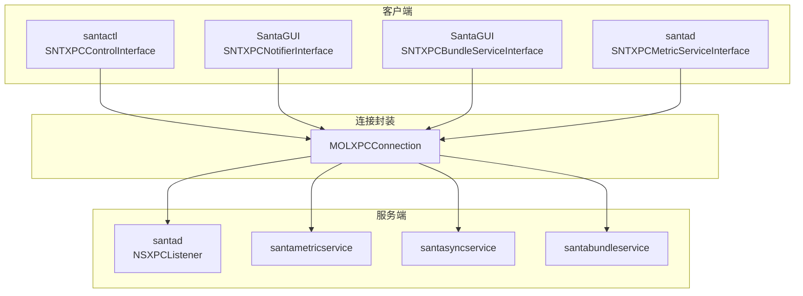
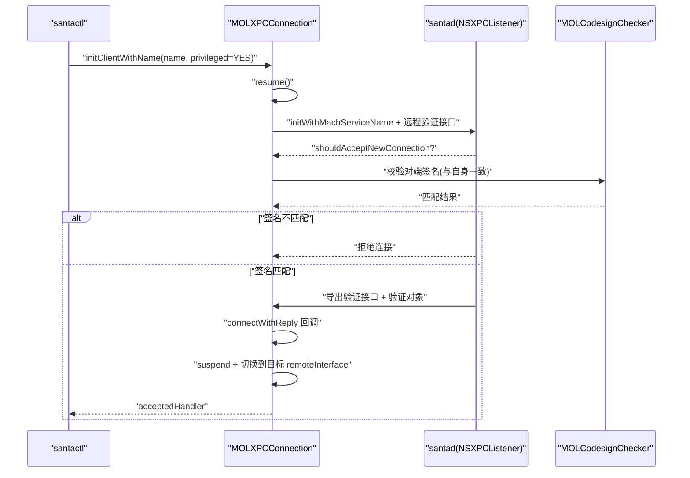
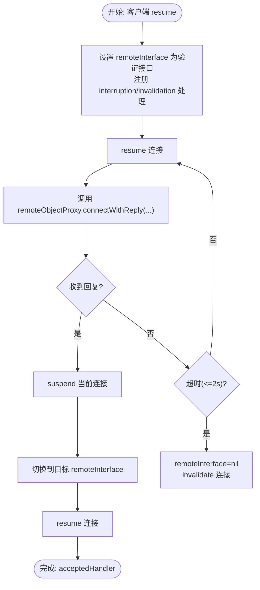
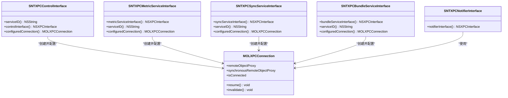
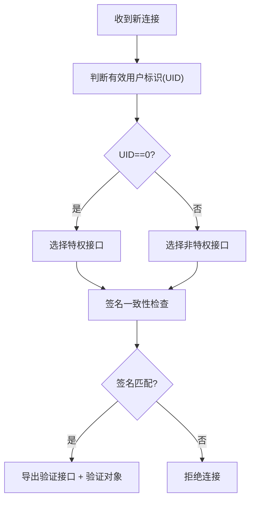
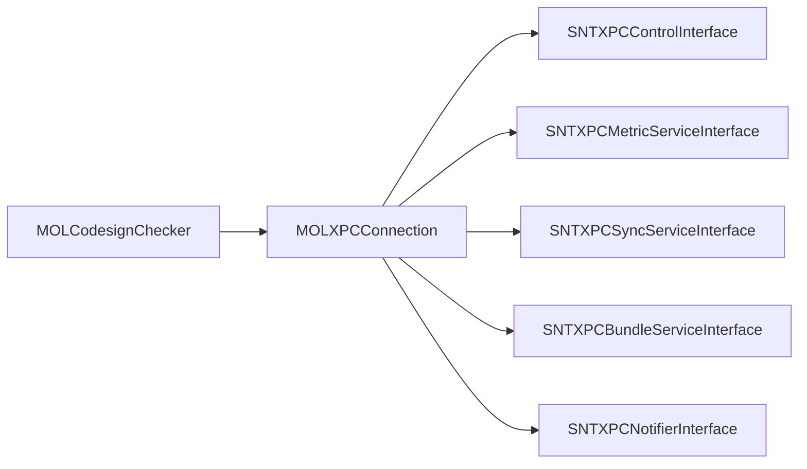

# XPC通信安全

<cite>
**本文引用的文件**
- [MOLXPCConnection.h](file://Source/common/MOLXPCConnection.h)
- [MOLXPCConnection.mm](file://Source/common/MOLXPCConnection.mm)
- [SNTXPCControlInterface.h](file://Source/common/SNTXPCControlInterface.h)
- [SNTXPCControlInterface.mm](file://Source/common/SNTXPCControlInterface.mm)
- [SNTXPCBundleServiceInterface.h](file://Source/common/SNTXPCBundleServiceInterface.h)
- [SNTXPCBundleServiceInterface.mm](file://Source/common/SNTXPCBundleServiceInterface.mm)
- [SNTXPCMetricServiceInterface.h](file://Source/common/SNTXPCMetricServiceInterface.h)
- [SNTXPCMetricServiceInterface.mm](file://Source/common/SNTXPCMetricServiceInterface.mm)
- [SNTXPCSyncServiceInterface.h](file://Source/common/SNTXPCSyncServiceInterface.h)
- [SNTXPCSyncServiceInterface.mm](file://Source/common/SNTXPCSyncServiceInterface.mm)
- [SNTXPCNotifierInterface.h](file://Source/common/SNTXPCNotifierInterface.h)
- [SNTXPCNotifierInterface.mm](file://Source/common/SNTXPCNotifierInterface.mm)
- [MOLCodesignChecker.h](file://Source/common/MOLCodesignChecker.h)
- [MOLCodesignChecker.mm](file://Source/common/MOLCodesignChecker.mm)
- [SNTStoredEvent.h](file://Source/common/SNTStoredEvent.h)
- [SNTStoredExecutionEvent.h](file://Source/common/SNTStoredExecutionEvent.h)
- [SNTStoredFileAccessEvent.h](file://Source/common/SNTStoredFileAccessEvent.h)
- [SNTExportConfiguration.h](file://Source/common/SNTExportConfiguration.h)
- [SNTCommonEnums.h](file://Source/common/SNTCommonEnums.h)
- [SNTConfigBundle.h](file://Source/common/SNTConfigBundle.h)
- [SNTConfigState.h](file://Source/common/SNTConfigState.h)
- [SNTXPCUnprivilegedControlInterface.h](file://Source/common/SNTXPCUnprivilegedControlInterface.h)
- [SNTXPCUnprivilegedControlInterface.mm](file://Source/common/SNTXPCUnprivilegedControlInterface.mm)
- [SNTXPCUnprivilegedControlInterfaceTest.mm](file://Source/common/SNTXPCUnprivilegedControlInterfaceTest.mm)
- [SNTXPCConnectionTest.mm](file://Source/common/MOLXPCConnectionTest.mm)
- [SNTXPCConnection.mm](file://Source/common/MOLXPCConnection.mm)
- [SNTXPCConnectionTest.mm](file://Source/common/MOLXPCConnectionTest.mm)
- [checkCacheForVnodeID.mm](file://Fuzzing/santad/src/checkCacheForVnodeID.mm)
- [databaseRemoveEventsWithIDs.mm](file://Fuzzing/santad/src/databaseRemoveEventsWithIDs.mm)
- [databaseRuleAddRules.mm](file://Fuzzing/santad/src/databaseRuleAddRules.mm)
- [com.northpolesec.santa.plist](file://Conf/com.northpolesec.santa.plist)
- [com.northpolesec.santa.bundleservice.plist](file://Conf/com.northpolesec.santa.bundleservice.plist)
- [com.northpolesec.santa.metricservice.plist](file://Conf/com.northpolesec.santa.metricservice.plist)
- [com.northpolesec.santa.syncservice.plist](file://Conf/com.northpolesec.santa.syncservice.plist)
</cite>

## 目录
1. [引言](#引言)
2. [项目结构](#项目结构)
3. [核心组件](#核心组件)
4. [架构总览](#架构总览)
5. [详细组件分析](#详细组件分析)
6. [依赖关系分析](#依赖关系分析)
7. [性能考量](#性能考量)
8. [故障排查指南](#故障排查指南)
9. [结论](#结论)
10. [附录](#附录)

## 引言
本文件系统性梳理 Santa 在 macOS 上通过 XPC 实现的进程间通信安全机制，重点覆盖以下方面：
- 连接建立与身份验证：基于代码签名与用户权限的双向校验
- 接口与消息序列化：NSXPCInterface 的类映射与参数类型声明
- 传输与会话安全：连接生命周期管理、超时与失效处理
- 权限与特权：区分特权/非特权接口、服务端导出对象的选择策略
- 安全上下文传递：事件对象、配置状态与枚举类型的跨进程传递
- 连接池与会话管理：客户端连接复用与服务端监听器接受流程
- 错误处理与审计：失效回调、错误处理器与日志记录

## 项目结构
Santa 的 XPC 通信围绕一组“接口定义 + 连接封装”的模式组织：
- 接口层：每个服务（控制、度量、同步、通知、打包）均提供协议与 NSXPCInterface 初始化方法
- 连接层：统一使用 MOLXPCConnection 封装连接建立、签名验证、接口切换与失效处理
- 服务清单：通过 launchd plist 暴露 Mach 服务名，供客户端按名称连接

图表来源
- [SNTXPCControlInterface.mm](file://Source/common/SNTXPCControlInterface.mm#L89-L94)
- [SNTXPCMetricServiceInterface.mm](file://Source/common/SNTXPCMetricServiceInterface.mm#L35-L40)
- [SNTXPCSyncServiceInterface.mm](file://Source/common/SNTXPCSyncServiceInterface.mm#L41-L46)
- [SNTXPCBundleServiceInterface.mm](file://Source/common/SNTXPCBundleServiceInterface.mm#L38-L43)
- [MOLXPCConnection.mm](file://Source/common/MOLXPCConnection.mm#L114-L157)

章节来源
- [SNTXPCControlInterface.h](file://Source/common/SNTXPCControlInterface.h#L79-L103)
- [SNTXPCControlInterface.mm](file://Source/common/SNTXPCControlInterface.mm#L28-L40)
- [SNTXPCControlInterface.mm](file://Source/common/SNTXPCControlInterface.mm#L82-L94)
- [SNTXPCMetricServiceInterface.h](file://Source/common/SNTXPCMetricServiceInterface.h#L31-L51)
- [SNTXPCMetricServiceInterface.mm](file://Source/common/SNTXPCMetricServiceInterface.mm#L19-L40)
- [SNTXPCSyncServiceInterface.h](file://Source/common/SNTXPCSyncServiceInterface.h#L72-L91)
- [SNTXPCSyncServiceInterface.mm](file://Source/common/SNTXPCSyncServiceInterface.mm#L19-L46)
- [SNTXPCBundleServiceInterface.h](file://Source/common/SNTXPCBundleServiceInterface.h#L57-L76)
- [SNTXPCBundleServiceInterface.mm](file://Source/common/SNTXPCBundleServiceInterface.mm#L22-L43)
- [MOLXPCConnection.h](file://Source/common/MOLXPCConnection.h#L54-L154)
- [MOLXPCConnection.mm](file://Source/common/MOLXPCConnection.mm#L59-L105)

## 核心组件
- MOLXPCConnection：统一的 XPC 连接封装，负责服务端监听与客户端连接建立、签名验证、接口切换、失效处理与超时控制
- 各服务接口：SNTXPCControlInterface、SNTXPCMetricServiceInterface、SNTXPCSyncServiceInterface、SNTXPCBundleServiceInterface、SNTXPCNotifierInterface
- 代码签名检查：MOLCodesignChecker 用于校验对端进程签名一致性
- 事件与配置模型：SNTStoredEvent、SNTStoredExecutionEvent、SNTStoredFileAccessEvent、SNTConfigBundle、SNTConfigState、SNTExportConfiguration 等

章节来源
- [MOLXPCConnection.h](file://Source/common/MOLXPCConnection.h#L54-L154)
- [MOLXPCConnection.mm](file://Source/common/MOLXPCConnection.mm#L59-L105)
- [MOLCodesignChecker.h](file://Source/common/MOLCodesignChecker.h#L1-L200)
- [MOLCodesignChecker.mm](file://Source/common/MOLCodesignChecker.mm#L1-L200)
- [SNTStoredEvent.h](file://Source/common/SNTStoredEvent.h#L1-L200)
- [SNTStoredExecutionEvent.h](file://Source/common/SNTStoredExecutionEvent.h#L1-L200)
- [SNTStoredFileAccessEvent.h](file://Source/common/SNTStoredFileAccessEvent.h#L1-L200)
- [SNTConfigBundle.h](file://Source/common/SNTConfigBundle.h#L1-L200)
- [SNTConfigState.h](file://Source/common/SNTConfigState.h#L1-L200)
- [SNTExportConfiguration.h](file://Source/common/SNTExportConfiguration.h#L1-L200)

## 架构总览
下图展示 Santa 守护进程与各客户端/服务之间的 XPC 交互路径，以及连接建立阶段的签名验证与接口切换。

图表来源
- [MOLXPCConnection.mm](file://Source/common/MOLXPCConnection.mm#L114-L157)
- [MOLXPCConnection.mm](file://Source/common/MOLXPCConnection.mm#L159-L202)
- [MOLCodesignChecker.mm](file://Source/common/MOLCodesignChecker.mm#L1-L200)
- [SNTXPCControlInterface.mm](file://Source/common/SNTXPCControlInterface.mm#L89-L94)

章节来源
- [MOLXPCConnection.mm](file://Source/common/MOLXPCConnection.mm#L114-L202)
- [SNTXPCControlInterface.mm](file://Source/common/SNTXPCControlInterface.mm#L89-L94)

## 详细组件分析

### MOLXPCConnection：连接建立与安全校验
- 服务器端初始化：支持以 Mach 服务名或匿名监听器启动监听器，并在监听器委托中进行接入校验
- 客户端初始化：支持以 Mach 服务名或服务端发送的监听器端点建立连接；可选择是否以特权方式连接
- 建立流程：先以“验证接口”连接，发送“connectWithReply”完成握手后，再切换到实际的远程接口
- 超时与失效：建立过程有超时保护；中断/失效时清理 remoteInterface 并触发 invalidationHandler
- 签名验证：在接入阶段对端进程签名信息进行校验，确保与本地签名一致才允许建立正式连接
- 接口切换：握手成功后挂起连接，切换到目标 remoteInterface 再恢复，避免代理不符合协议导致的异常

图表来源
- [MOLXPCConnection.mm](file://Source/common/MOLXPCConnection.mm#L114-L157)

章节来源
- [MOLXPCConnection.h](file://Source/common/MOLXPCConnection.h#L54-L154)
- [MOLXPCConnection.mm](file://Source/common/MOLXPCConnection.mm#L59-L105)
- [MOLXPCConnection.mm](file://Source/common/MOLXPCConnection.mm#L114-L157)
- [MOLXPCConnection.mm](file://Source/common/MOLXPCConnection.mm#L159-L202)
- [MOLXPCConnection.mm](file://Source/common/MOLXPCConnection.mm#L204-L220)
- [MOLXPCConnection.mm](file://Source/common/MOLXPCConnection.mm#L222-L239)
- [MOLXPCConnectionTest.mm](file://Source/common/MOLXPCConnectionTest.mm#L40-L65)

### 服务接口与消息序列化
- 控制接口（santactl ↔ santad）
  - 服务 ID 动态生成，结合团队 ID 与 bundle ID
  - 使用 NSXPCInterface 设置自定义类映射，确保数组、规则、事件等对象正确序列化
  - 提供预配置连接工厂方法，直接返回已设置好 remoteInterface 的 MOLXPCConnection

- 度量接口（santad → santametricservice）
  - 以非特权方式连接，导出指标字典给外部监控系统

- 同步接口（santad/santactl ↔ santasyncservice）
  - 支持事件上报、遥测文件流式导出、推送通知状态查询、手动触发同步等
  - 使用监听器端点回传日志，保证长链路日志可靠传输

- 打包接口（SantaGUI ↔ santabundleservice）
  - 以特权方式连接，提供二进制哈希计算进度回调与完成回调

- 通知接口（SantaGUI ↔ santad）
  - 提供阻断通知、USB/网络挂载通知、临时监控授权等

图表来源
- [SNTXPCControlInterface.h](file://Source/common/SNTXPCControlInterface.h#L79-L103)
- [SNTXPCControlInterface.mm](file://Source/common/SNTXPCControlInterface.mm#L28-L40)
- [SNTXPCControlInterface.mm](file://Source/common/SNTXPCControlInterface.mm#L82-L94)
- [SNTXPCMetricServiceInterface.h](file://Source/common/SNTXPCMetricServiceInterface.h#L31-L51)
- [SNTXPCMetricServiceInterface.mm](file://Source/common/SNTXPCMetricServiceInterface.mm#L19-L40)
- [SNTXPCSyncServiceInterface.h](file://Source/common/SNTXPCSyncServiceInterface.h#L72-L91)
- [SNTXPCSyncServiceInterface.mm](file://Source/common/SNTXPCSyncServiceInterface.mm#L19-L46)
- [SNTXPCBundleServiceInterface.h](file://Source/common/SNTXPCBundleServiceInterface.h#L57-L76)
- [SNTXPCBundleServiceInterface.mm](file://Source/common/SNTXPCBundleServiceInterface.mm#L22-L43)
- [MOLXPCConnection.h](file://Source/common/MOLXPCConnection.h#L54-L154)

章节来源
- [SNTXPCControlInterface.mm](file://Source/common/SNTXPCControlInterface.mm#L28-L40)
- [SNTXPCControlInterface.mm](file://Source/common/SNTXPCControlInterface.mm#L82-L94)
- [SNTXPCMetricServiceInterface.mm](file://Source/common/SNTXPCMetricServiceInterface.mm#L19-L40)
- [SNTXPCSyncServiceInterface.mm](file://Source/common/SNTXPCSyncServiceInterface.mm#L19-L46)
- [SNTXPCBundleServiceInterface.mm](file://Source/common/SNTXPCBundleServiceInterface.mm#L22-L43)
- [SNTXPCNotifierInterface.mm](file://Source/common/SNTXPCNotifierInterface.mm#L19-L23)

### 代码签名与权限校验
- 对端签名一致性：服务端在接入阶段获取对端 PID，构造 MOLCodesignChecker 并与本地签名信息比对，仅当一致时才接受连接
- 特权接口选择：根据连接的有效用户标识选择导出“特权接口”或“非特权接口”，从而限制客户端能力
- 选项设置：客户端初始化时可指定是否以特权方式连接（影响 NSXPCConnection 的 options）

图表来源
- [MOLXPCConnection.mm](file://Source/common/MOLXPCConnection.mm#L159-L202)
- [MOLCodesignChecker.mm](file://Source/common/MOLCodesignChecker.mm#L1-L200)

章节来源
- [MOLXPCConnection.mm](file://Source/common/MOLXPCConnection.mm#L159-L202)
- [MOLCodesignChecker.h](file://Source/common/MOLCodesignChecker.h#L1-L200)
- [MOLCodesignChecker.mm](file://Source/common/MOLCodesignChecker.mm#L1-L200)

### 传输加密与安全上下文
- 加密与完整性：XPC 通道默认基于内核提供的安全通道，具备进程身份绑定与消息完整性保障
- 上下文传递：通过 NSXPCInterface 的类映射，事件对象、配置对象、枚举值等在进程间安全传递
- 会话隔离：不同 UID 的客户端被分配至不同的接口，避免越权访问

章节来源
- [SNTXPCControlInterface.mm](file://Source/common/SNTXPCControlInterface.mm#L46-L87)
- [SNTXPCSyncServiceInterface.mm](file://Source/common/SNTXPCSyncServiceInterface.mm#L19-L35)
- [SNTXPCBundleServiceInterface.mm](file://Source/common/SNTXPCBundleServiceInterface.mm#L22-L31)
- [SNTXPCMetricServiceInterface.mm](file://Source/common/SNTXPCMetricServiceInterface.mm#L19-L29)

### 连接池与会话管理
- 单连接模型：接口层提供“已配置连接”工厂方法，建议在生命周期内复用同一连接实例
- 重连与失效：连接中断或失效时，通过 invalidationHandler 清理状态并触发上层重建逻辑
- 监听器端点：同步服务支持通过 NSXPCListenerEndpoint 传递监听器，便于长链路日志回传

章节来源
- [SNTXPCSyncServiceInterface.h](file://Source/common/SNTXPCSyncServiceInterface.h#L51-L63)
- [SNTXPCSyncServiceInterface.mm](file://Source/common/SNTXPCSyncServiceInterface.mm#L41-L46)
- [MOLXPCConnection.mm](file://Source/common/MOLXPCConnection.mm#L204-L220)

### 通信超时与错误处理
- 建立超时：连接握手阶段最多等待约 2 秒，超时则主动失效并清理接口
- 中断/失效：连接中断或失效时，清理 remoteInterface 并触发 invalidationHandler
- 同步代理错误：remoteObjectProxyWithErrorHandler 与 synchronousRemoteObjectProxyWithErrorHandler 在错误发生时触发失效

章节来源
- [MOLXPCConnection.mm](file://Source/common/MOLXPCConnection.mm#L145-L156)
- [MOLXPCConnection.mm](file://Source/common/MOLXPCConnection.mm#L204-L220)

### 接口配置示例与安全参数
- 控制接口（santactl → santad）
  - 服务 ID：由团队 ID 与 bundle ID 组合生成
  - 接口类映射：数组、规则、事件、错误等
  - 连接方式：特权连接
  - 参考路径：[SNTXPCControlInterface.mm](file://Source/common/SNTXPCControlInterface.mm#L28-L40)，[SNTXPCControlInterface.mm](file://Source/common/SNTXPCControlInterface.mm#L82-L94)

- 度量接口（santad → santametricservice）
  - 接口类映射：字典、数组、字符串、数值、日期
  - 连接方式：非特权连接
  - 参考路径：[SNTXPCMetricServiceInterface.mm](file://Source/common/SNTXPCMetricServiceInterface.mm#L19-L40)

- 同步接口（santad/santactl → santasyncservice）
  - 接口类映射：事件、执行事件、文件访问事件、文件句柄
  - 连接方式：特权连接
  - 参考路径：[SNTXPCSyncServiceInterface.mm](file://Source/common/SNTXPCSyncServiceInterface.mm#L19-L35)

- 打包接口（SantaGUI → santabundleservice）
  - 连接方式：特权连接
  - 参考路径：[SNTXPCBundleServiceInterface.mm](file://Source/common/SNTXPCBundleServiceInterface.mm#L38-L43)

- 通知接口（SantaGUI → santad）
  - 参考路径：[SNTXPCNotifierInterface.mm](file://Source/common/SNTXPCNotifierInterface.mm#L19-L23)

章节来源
- [SNTXPCControlInterface.mm](file://Source/common/SNTXPCControlInterface.mm#L28-L40)
- [SNTXPCControlInterface.mm](file://Source/common/SNTXPCControlInterface.mm#L82-L94)
- [SNTXPCMetricServiceInterface.mm](file://Source/common/SNTXPCMetricServiceInterface.mm#L19-L40)
- [SNTXPCSyncServiceInterface.mm](file://Source/common/SNTXPCSyncServiceInterface.mm#L19-L35)
- [SNTXPCBundleServiceInterface.mm](file://Source/common/SNTXPCBundleServiceInterface.mm#L38-L43)
- [SNTXPCNotifierInterface.mm](file://Source/common/SNTXPCNotifierInterface.mm#L19-L23)

### 通信审计、异常检测与安全监控
- 审计与日志
  - 同步服务支持通过监听器端点回传日志，便于在用户触发同步时收集服务端日志
  - 参考路径：[SNTXPCSyncServiceInterface.h](file://Source/common/SNTXPCSyncServiceInterface.h#L51-L63)

- 异常检测
  - 连接建立超时、中断/失效回调、错误代理处理器均可作为异常信号
  - 参考路径：[MOLXPCConnection.mm](file://Source/common/MOLXPCConnection.mm#L145-L156)，[MOLXPCConnection.mm](file://Source/common/MOLXPCConnection.mm#L204-L220)

- 安全监控
  - 通过度量接口导出指标，结合外部监控系统进行态势感知
  - 参考路径：[SNTXPCMetricServiceInterface.h](file://Source/common/SNTXPCMetricServiceInterface.h#L21-L29)，[SNTXPCMetricServiceInterface.mm](file://Source/common/SNTXPCMetricServiceInterface.mm#L19-L29)

章节来源
- [SNTXPCSyncServiceInterface.h](file://Source/common/SNTXPCSyncServiceInterface.h#L51-L63)
- [MOLXPCConnection.mm](file://Source/common/MOLXPCConnection.mm#L145-L156)
- [MOLXPCConnection.mm](file://Source/common/MOLXPCConnection.mm#L204-L220)
- [SNTXPCMetricServiceInterface.h](file://Source/common/SNTXPCMetricServiceInterface.h#L21-L29)
- [SNTXPCMetricServiceInterface.mm](file://Source/common/SNTXPCMetricServiceInterface.mm#L19-L29)

## 依赖关系分析
- 组件耦合
  - 各服务接口依赖 MOLXPCConnection 进行连接配置与生命周期管理
  - 服务端通过监听器委托实现接入校验与接口导出
  - 代码签名检查模块独立于连接层，仅在接入阶段参与

图表来源
- [MOLCodesignChecker.mm](file://Source/common/MOLCodesignChecker.mm#L1-L200)
- [MOLXPCConnection.mm](file://Source/common/MOLXPCConnection.mm#L159-L202)
- [SNTXPCControlInterface.mm](file://Source/common/SNTXPCControlInterface.mm#L89-L94)
- [SNTXPCMetricServiceInterface.mm](file://Source/common/SNTXPCMetricServiceInterface.mm#L35-L40)
- [SNTXPCSyncServiceInterface.mm](file://Source/common/SNTXPCSyncServiceInterface.mm#L41-L46)
- [SNTXPCBundleServiceInterface.mm](file://Source/common/SNTXPCBundleServiceInterface.mm#L38-L43)

章节来源
- [MOLCodesignChecker.h](file://Source/common/MOLCodesignChecker.h#L1-L200)
- [MOLCodesignChecker.mm](file://Source/common/MOLCodesignChecker.mm#L1-L200)
- [MOLXPCConnection.mm](file://Source/common/MOLXPCConnection.mm#L159-L202)

## 性能考量
- 连接延迟：客户端首次 resume 会进行握手与签名验证，通常在数毫秒内完成；若超时则会主动失效
- 代理线程：消息始终在后台线程投递，避免阻塞主线程
- 会话复用：建议复用连接实例，减少重复建立成本
- 类映射优化：合理设置 NSXPCInterface 的类映射，避免不必要的序列化开销

章节来源
- [MOLXPCConnection.h](file://Source/common/MOLXPCConnection.h#L47-L53)
- [MOLXPCConnection.mm](file://Source/common/MOLXPCConnection.mm#L145-L156)

## 故障排查指南
- 连接无法建立
  - 检查服务端 plist 是否正确暴露 Mach 服务名
  - 确认客户端使用的服务 ID 与服务端一致
  - 查看 invalidationHandler 是否被触发，定位签名或权限问题

- 超时失败
  - 建立阶段超过约 2 秒会主动失效，检查服务端监听器是否正常、握手流程是否被阻塞

- 权限不足
  - 确认客户端是否以正确的特权方式连接（如需要特权接口）
  - 检查服务端对端 UID 判定与接口导出逻辑

- 代理不可用
  - 当连接失效时 remoteObjectProxy 与 synchronousRemoteObjectProxy 会返回空，需重建连接

章节来源
- [MOLXPCConnection.mm](file://Source/common/MOLXPCConnection.mm#L145-L156)
- [MOLXPCConnection.mm](file://Source/common/MOLXPCConnection.mm#L204-L220)
- [MOLXPCConnectionTest.mm](file://Source/common/MOLXPCConnectionTest.mm#L40-L65)

## 结论
Santa 的 XPC 通信安全机制通过“签名一致性 + 用户权限 + 接口切换 + 超时与失效处理”的组合，实现了强约束的进程间通信。接口层以 NSXPCInterface 的类映射确保复杂对象的可靠传递，连接层以统一封装简化了客户端集成与维护。配合同步服务的日志回传与度量接口的指标导出，可构建完善的审计与监控体系。

## 附录
- 服务端 plist 示例（参考）
  - [com.northpolesec.santa.plist](file://Conf/com.northpolesec.santa.plist)
  - [com.northpolesec.santa.bundleservice.plist](file://Conf/com.northpolesec.santa.bundleservice.plist)
  - [com.northpolesec.santa.metricservice.plist](file://Conf/com.northpolesec.santa.metricservice.plist)
  - [com.northpolesec.santa.syncservice.plist](file://Conf/com.northpolesec.santa.syncservice.plist)

- 客户端使用示例（参考）
  - [checkCacheForVnodeID.mm](file://Fuzzing/santad/src/checkCacheForVnodeID.mm#L34-L36)
  - [databaseRemoveEventsWithIDs.mm](file://Fuzzing/santad/src/databaseRemoveEventsWithIDs.mm#L34-L36)
  - [databaseRuleAddRules.mm](file://Fuzzing/santad/src/databaseRuleAddRules.mm#L52-L54)