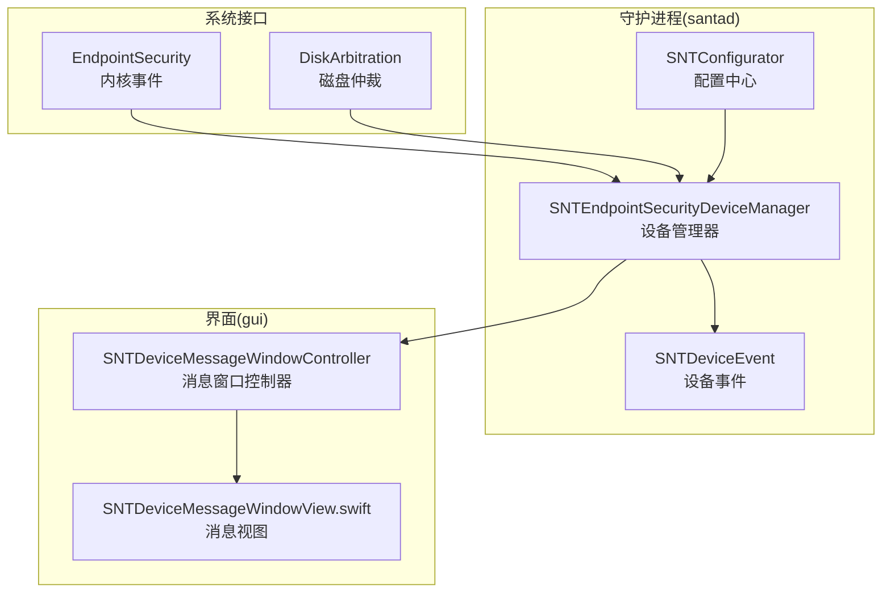
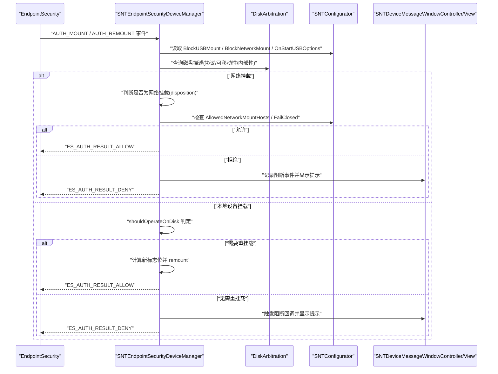
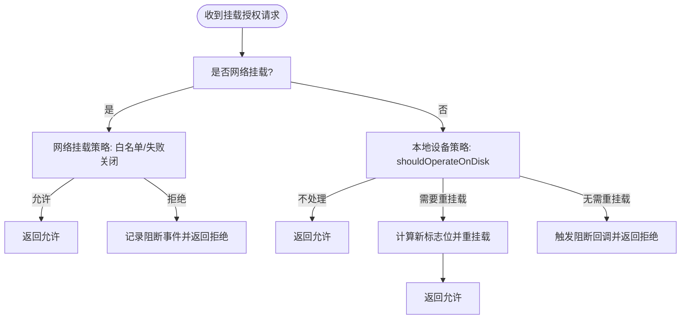
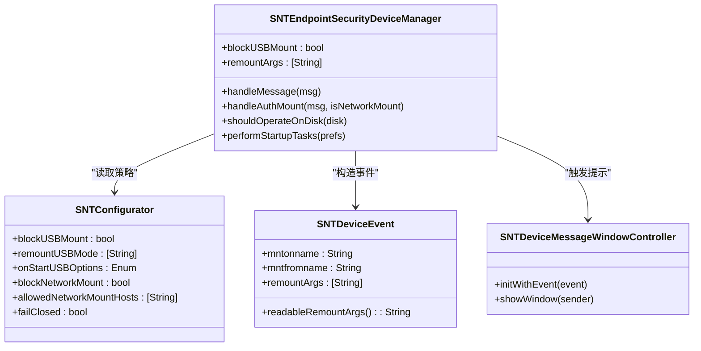

# 外部存储设备安全策略

<cite>
**本文引用的文件**
- [SNTEndpointSecurityDeviceManager.h](file://Source/santad/EventProviders/SNTEndpointSecurityDeviceManager.h)
- [SNTEndpointSecurityDeviceManager.mm](file://Source/santad/EventProviders/SNTEndpointSecurityDeviceManager.mm)
- [SNTConfigurator.h](file://Source/common/SNTConfigurator.h)
- [SNTConfigurator.mm](file://Source/common/SNTConfigurator.mm)
- [SNTDeviceEvent.h](file://Source/common/SNTDeviceEvent.h)
- [SNTDeviceEvent.mm](file://Source/common/SNTDeviceEvent.mm)
- [SNTDeviceMessageWindowController.h](file://Source/gui/SNTDeviceMessageWindowController.h)
- [SNTDeviceMessageWindowController.mm](file://Source/gui/SNTDeviceMessageWindowController.mm)
- [SNTDeviceMessageWindowView.swift](file://Source/gui/SNTDeviceMessageWindowView.swift)
- [usb-sd-blocking.md](file://docs/docs/features/usb-sd-blocking.md)
- [EndpointSecurity_Research_Report.md](file://docs/EndpointSecurity_Research_Report.md)
- [Santad.mm](file://Source/santad/Santad.mm)
- [SNTEndpointSecurityDeviceManagerTest.mm](file://Source/santad/EventProviders/SNTEndpointSecurityDeviceManagerTest.mm)
</cite>

## 目录
1. [简介](#简介)
2. [项目结构](#项目结构)
3. [核心组件](#核心组件)
4. [架构总览](#架构总览)
5. [详细组件分析](#详细组件分析)
6. [依赖关系分析](#依赖关系分析)
7. [性能考量](#性能考量)
8. [故障排查指南](#故障排查指南)
9. [结论](#结论)
10. [附录](#附录)

## 简介
本文件聚焦 Santa 在 macOS 上对外部存储设备（USB/SD）的安全策略与实现，涵盖挂载授权、强制只读/禁用执行等策略、启动时处理逻辑、以及网络挂载的控制机制。文档基于仓库中的源码与官方文档，系统梳理了从内核事件到策略决策、再到用户提示与日志记录的完整链路。

## 项目结构
围绕外部存储设备安全策略的相关模块主要分布在以下位置：
- 设备管理与事件处理：Source/santad/EventProviders/SNTEndpointSecurityDeviceManager.*
- 配置与键值：Source/common/SNTConfigurator.*
- 设备事件模型：Source/common/SNTDeviceEvent.*
- GUI 提示窗口：Source/gui/SNTDeviceMessageWindowController.* 与 SNTDeviceMessageWindowView.swift
- 文档与说明：docs/docs/features/usb-sd-blocking.md、docs/EndpointSecurity_Research_Report.md
- 启动时策略应用：Source/santad/Santad.mm
- 单元测试：Source/santad/EventProviders/SNTEndpointSecurityDeviceManagerTest.mm

图表来源
- [SNTEndpointSecurityDeviceManager.mm](file://Source/santad/EventProviders/SNTEndpointSecurityDeviceManager.mm#L422-L580)
- [SNTConfigurator.h](file://Source/common/SNTConfigurator.h#L696-L748)
- [SNTDeviceEvent.h](file://Source/common/SNTDeviceEvent.h#L17-L27)
- [SNTDeviceMessageWindowController.mm](file://Source/gui/SNTDeviceMessageWindowController.mm#L34-L44)
- [SNTDeviceMessageWindowView.swift](file://Source/gui/SNTDeviceMessageWindowView.swift#L30-L38)

章节来源
- [SNTEndpointSecurityDeviceManager.h](file://Source/santad/EventProviders/SNTEndpointSecurityDeviceManager.h#L34-L58)
- [SNTEndpointSecurityDeviceManager.mm](file://Source/santad/EventProviders/SNTEndpointSecurityDeviceManager.mm#L422-L580)
- [SNTConfigurator.h](file://Source/common/SNTConfigurator.h#L696-L748)
- [SNTDeviceEvent.h](file://Source/common/SNTDeviceEvent.h#L17-L27)
- [SNTDeviceMessageWindowController.h](file://Source/gui/SNTDeviceMessageWindowController.h#L21-L31)
- [SNTDeviceMessageWindowController.mm](file://Source/gui/SNTDeviceMessageWindowController.mm#L34-L44)
- [SNTDeviceMessageWindowView.swift](file://Source/gui/SNTDeviceMessageWindowView.swift#L30-L38)

## 核心组件
- 设备管理器（SNTEndpointSecurityDeviceManager）
  - 职责：订阅 EndpointSecurity 挂载/卸载事件；通过 DiskArbitration 判断设备属性；根据配置决定允许、拒绝或重新挂载；在拒绝时生成设备事件并触发回调；记录日志。
  - 关键能力：识别 USB/SD/可移动设备；支持启动时对现有挂载进行卸载/重挂载；支持网络挂载的白名单与“失败关闭”策略。
- 配置中心（SNTConfigurator）
  - 职责：提供 BlockUSBMount、RemountUSBMode、OnStartUSBOptions、BlockNetworkMount、AllowedNetworkMountHosts 等键值；支持同步下发与本地覆盖。
- 设备事件（SNTDeviceEvent）
  - 职责：封装挂载路径、来源设备、重挂载参数等信息，用于 UI 提示与日志记录。
- GUI 提示（SNTDeviceMessageWindowController/View）
  - 职责：展示阻断/重挂载后的用户提示，结合配置消息文案。

章节来源
- [SNTEndpointSecurityDeviceManager.h](file://Source/santad/EventProviders/SNTEndpointSecurityDeviceManager.h#L34-L58)
- [SNTEndpointSecurityDeviceManager.mm](file://Source/santad/EventProviders/SNTEndpointSecurityDeviceManager.mm#L422-L580)
- [SNTConfigurator.h](file://Source/common/SNTConfigurator.h#L485-L510)
- [SNTConfigurator.h](file://Source/common/SNTConfigurator.h#L696-L748)
- [SNTDeviceEvent.h](file://Source/common/SNTDeviceEvent.h#L17-L27)
- [SNTDeviceEvent.mm](file://Source/common/SNTDeviceEvent.mm#L41-L53)
- [SNTDeviceMessageWindowController.h](file://Source/gui/SNTDeviceMessageWindowController.h#L21-L31)
- [SNTDeviceMessageWindowController.mm](file://Source/gui/SNTDeviceMessageWindowController.mm#L34-L44)
- [SNTDeviceMessageWindowView.swift](file://Source/gui/SNTDeviceMessageWindowView.swift#L30-L38)

## 架构总览
下图展示了从内核挂载授权请求到策略决策与用户反馈的关键交互：

图表来源
- [SNTEndpointSecurityDeviceManager.mm](file://Source/santad/EventProviders/SNTEndpointSecurityDeviceManager.mm#L422-L580)
- [SNTConfigurator.h](file://Source/common/SNTConfigurator.h#L696-L748)
- [SNTDeviceMessageWindowController.mm](file://Source/gui/SNTDeviceMessageWindowController.mm#L34-L44)
- [SNTDeviceMessageWindowView.swift](file://Source/gui/SNTDeviceMessageWindowView.swift#L30-L38)

## 详细组件分析

### 设备管理器（策略入口）
- 订阅事件与消息处理
  - 订阅 AUTH_MOUNT、AUTH_REMOUNT、NOTIFY_UNMOUNT 事件；在卸载事件中刷新缓存。
  - 根据事件类型分派到 handleAuthMount，再区分网络挂载与本地设备挂载。
- 设备判定与操作
  - shouldOperateOnDisk 基于 DiskArbitration 描述判断是否为外部可移动设备（含 USB/SD/非内部/非虚拟），并对特殊协议（如 PCI-Express 的外置 SSD）进行兼容处理。
  - 若配置了 RemountUSBMode，则比较当前挂载标志位与期望集合，若已满足则允许；否则计算新标志位并调用 DADiskMountWithArguments 进行重挂载。
  - 若未配置重挂载，则直接拒绝并记录阻断事件。
- 启动时处理
  - 当启用 BlockUSBMount 且 OnStartUSBOptions 配置为卸载/强制卸载/重挂载时，遍历现有挂载点，按需卸载并在必要时重挂载。
- 网络挂载策略
  - 仅在 macOS 15+ 且事件包含网络挂载标识时生效。
  - 若未开启 BlockNetworkMount 或主机在 AllowedNetworkMountHosts 白名单中则允许；否则根据 FailClosed 决策是否阻断并记录事件。

图表来源
- [SNTEndpointSecurityDeviceManager.mm](file://Source/santad/EventProviders/SNTEndpointSecurityDeviceManager.mm#L422-L580)
- [SNTEndpointSecurityDeviceManager.mm](file://Source/santad/EventProviders/SNTEndpointSecurityDeviceManager.mm#L510-L563)

章节来源
- [SNTEndpointSecurityDeviceManager.mm](file://Source/santad/EventProviders/SNTEndpointSecurityDeviceManager.mm#L422-L580)
- [SNTEndpointSecurityDeviceManager.mm](file://Source/santad/EventProviders/SNTEndpointSecurityDeviceManager.mm#L510-L563)
- [EndpointSecurity_Research_Report.md](file://docs/EndpointSecurity_Research_Report.md#L749-L782)

### 配置中心（键值与默认行为）
- 关键键值
  - BlockUSBMount：是否阻止外部存储设备挂载。
  - RemountUSBMode：重挂载使用的挂载选项数组（如只读、禁执行等）。
  - OnStartUSBOptions：启动时对已有挂载采取的动作（卸载/强制卸载/重挂载）。
  - BlockNetworkMount：是否阻止网络挂载。
  - AllowedNetworkMountHosts：允许的网络主机白名单。
  - FailClosed：当无法解析主机信息时的默认策略（阻断）。
  - BannedUSBBlockMessage / RemountUSBBlockMessage / BannedNetworkMountBlockMessage：阻断/重挂载时的用户提示文案。
- 键值类型与来源
  - 同步下发与强制配置键类型定义，确保 RemountUSBMode 为字符串数组，BlockUSBMount 为布尔等。

章节来源
- [SNTConfigurator.h](file://Source/common/SNTConfigurator.h#L485-L510)
- [SNTConfigurator.h](file://Source/common/SNTConfigurator.h#L696-L748)
- [SNTConfigurator.mm](file://Source/common/SNTConfigurator.mm#L190-L389)

### 设备事件与用户提示
- 设备事件模型
  - SNTDeviceEvent 封装挂载点与来源设备，并携带重挂载参数；提供可读化输出便于 UI 展示。
- GUI 提示
  - SNTDeviceMessageWindowController 负责创建并展示消息窗口；SNTDeviceMessageWindowView.swift 使用 SNTBlockMessage 生成提示内容。

章节来源
- [SNTDeviceEvent.h](file://Source/common/SNTDeviceEvent.h#L17-L27)
- [SNTDeviceEvent.mm](file://Source/common/SNTDeviceEvent.mm#L41-L53)
- [SNTDeviceMessageWindowController.h](file://Source/gui/SNTDeviceMessageWindowController.h#L21-L31)
- [SNTDeviceMessageWindowController.mm](file://Source/gui/SNTDeviceMessageWindowController.mm#L34-L44)
- [SNTDeviceMessageWindowView.swift](file://Source/gui/SNTDeviceMessageWindowView.swift#L30-L38)

### 启动时策略应用
- 启动偏好（OnStartUSBOptions）
  - 支持 Unmount、ForceUnmount、Remount、ForceRemount；若配置了 RemountUSBMode，则对现有挂载进行卸载后重挂载。
- 配置变更监听
  - 在守护进程启动时监听 BlockUSBMount 与 RemountUSBMode 的变化，动态更新设备管理器状态。

章节来源
- [SNTEndpointSecurityDeviceManager.mm](file://Source/santad/EventProviders/SNTEndpointSecurityDeviceManager.mm#L322-L408)
- [Santad.mm](file://Source/santad/Santad.mm#L371-L397)

### 网络挂载策略（macOS 15+）
- 事件版本与处置字段
  - 仅在事件版本 8 及以上（macOS 15+）存在 disposition 字段，用于区分网络挂载。
- 策略逻辑
  - 若未开启 BlockNetworkMount 或主机在白名单中则允许；否则根据 FailClosed 决策阻断并记录事件。

章节来源
- [SNTEndpointSecurityDeviceManager.mm](file://Source/santad/EventProviders/SNTEndpointSecurityDeviceManager.mm#L433-L451)
- [SNTEndpointSecurityDeviceManager.mm](file://Source/santad/EventProviders/SNTEndpointSecurityDeviceManager.mm#L582-L617)

### 行为验证与测试要点
- 测试覆盖
  - 验证阻断/重挂载回调参数（挂载点、来源设备、重挂载参数）。
  - 验证启动时对现有挂载的处理（卸载/强制卸载/重挂载）。
  - 验证网络挂载事件处理与白名单/失败关闭行为。

章节来源
- [SNTEndpointSecurityDeviceManagerTest.mm](file://Source/santad/EventProviders/SNTEndpointSecurityDeviceManagerTest.mm#L160-L200)
- [SNTEndpointSecurityDeviceManagerTest.mm](file://Source/santad/EventProviders/SNTEndpointSecurityDeviceManagerTest.mm#L366-L389)
- [SNTEndpointSecurityDeviceManagerTest.mm](file://Source/santad/EventProviders/SNTEndpointSecurityDeviceManagerTest.mm#L643-L678)

## 依赖关系分析
- 组件耦合
  - 设备管理器依赖 EndpointSecurity 与 DiskArbitration 获取挂载事件与磁盘描述；依赖配置中心读取策略键值；依赖设备事件与 GUI 控制器进行用户提示。
- 外部依赖
  - macOS 15+ 的事件版本与网络挂载处置字段影响策略分支。
- 配置联动
  - BlockUSBMount 与 RemountUSBMode 共同决定挂载行为；OnStartUSBOptions 影响启动时处理；BlockNetworkMount 与 AllowedNetworkMountHosts/FailClosed 决定网络挂载策略。

图表来源
- [SNTEndpointSecurityDeviceManager.h](file://Source/santad/EventProviders/SNTEndpointSecurityDeviceManager.h#L34-L58)
- [SNTConfigurator.h](file://Source/common/SNTConfigurator.h#L696-L748)
- [SNTDeviceEvent.h](file://Source/common/SNTDeviceEvent.h#L17-L27)
- [SNTDeviceMessageWindowController.h](file://Source/gui/SNTDeviceMessageWindowController.h#L21-L31)

## 性能考量
- 事件处理
  - 设备管理器在处理挂载事件时避免不必要的重挂载，优先允许已满足重挂载条件的挂载，减少系统调用次数。
- 启动时扫描
  - 启动任务会枚举所有挂载点并逐一处理，建议在大规模挂载场景下关注等待超时与日志告警。
- 日志与指标
  - 启动时对各类操作（跳过/允许/卸载失败/重挂载失败/成功）进行计数，便于评估策略效果与潜在问题。

章节来源
- [SNTEndpointSecurityDeviceManager.mm](file://Source/santad/EventProviders/SNTEndpointSecurityDeviceManager.mm#L322-L408)
- [SNTEndpointSecurityDeviceManager.mm](file://Source/santad/EventProviders/SNTEndpointSecurityDeviceManager.mm#L409-L416)

## 故障排查指南
- 常见问题定位
  - 网络挂载被拒：检查 BlockNetworkMount 是否开启、AllowedNetworkMountHosts 是否包含目标主机、FailClosed 是否启用。
  - 本地设备挂载被拒：确认 BlockUSBMount 是否开启、RemountUSBMode 是否配置、设备是否被 shouldOperateOnDisk 判定为外部可移动设备。
  - 启动时未处理现有挂载：检查 OnStartUSBOptions 配置与 RemountUSBMode 是否为空（空时不会进行重挂载）。
- 日志与指标
  - 查看启动时的 startup_disk_operation 计数，定位卸载/重挂载失败原因。
  - 关注设备管理器日志中磁盘描述与标志位转换信息，辅助判断策略匹配情况。
- 回归测试
  - 使用单元测试覆盖路径验证阻断/重挂载回调参数、启动时处理逻辑与网络挂载事件处理。

章节来源
- [SNTEndpointSecurityDeviceManager.mm](file://Source/santad/EventProviders/SNTEndpointSecurityDeviceManager.mm#L433-L451)
- [SNTEndpointSecurityDeviceManager.mm](file://Source/santad/EventProviders/SNTEndpointSecurityDeviceManager.mm#L582-L617)
- [SNTEndpointSecurityDeviceManagerTest.mm](file://Source/santad/EventProviders/SNTEndpointSecurityDeviceManagerTest.mm#L160-L200)
- [SNTEndpointSecurityDeviceManagerTest.mm](file://Source/santad/EventProviders/SNTEndpointSecurityDeviceManagerTest.mm#L366-L389)

## 结论
Santa 的外部存储设备安全策略以 EndpointSecurity 与 DiskArbitration 为基础，结合配置中心的键值实现灵活的挂载控制：既可直接阻断，也可通过重挂载强制只读、禁执行等，有效降低数据外泄风险。同时，启动时的策略应用与网络挂载白名单/失败关闭机制进一步增强了部署灵活性与安全性。

## 附录
- 官方特性文档（USB/SD Blocking）
  - 包含策略概述、配置项说明与启动行为选项。
- 研究报告摘录
  - 对 USB/外接存储挂载处理流程与策略特点进行了具体实现说明。

章节来源
- [usb-sd-blocking.md](file://docs/docs/features/usb-sd-blocking.md#L1-L33)
- [EndpointSecurity_Research_Report.md](file://docs/EndpointSecurity_Research_Report.md#L749-L782)