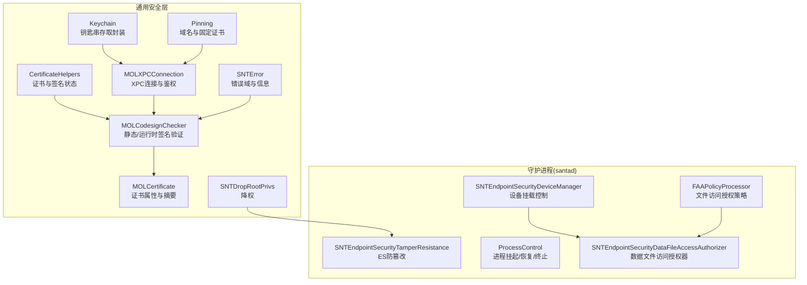
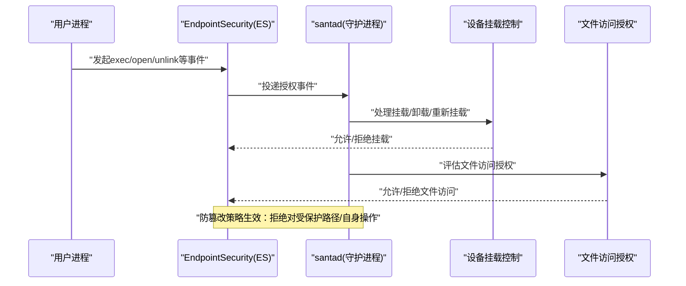
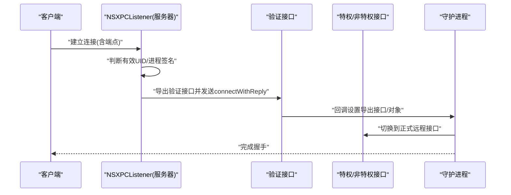
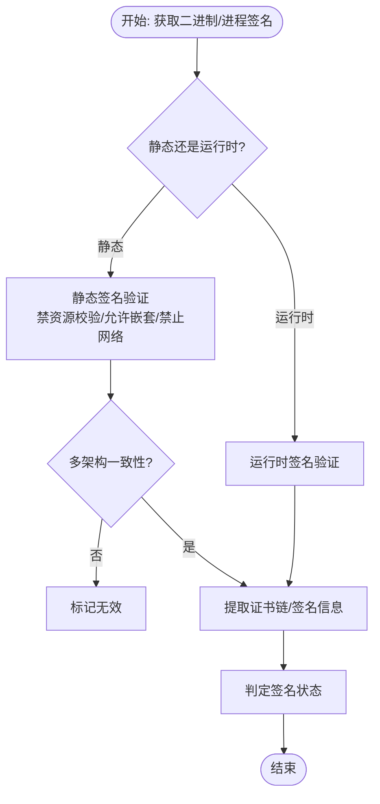
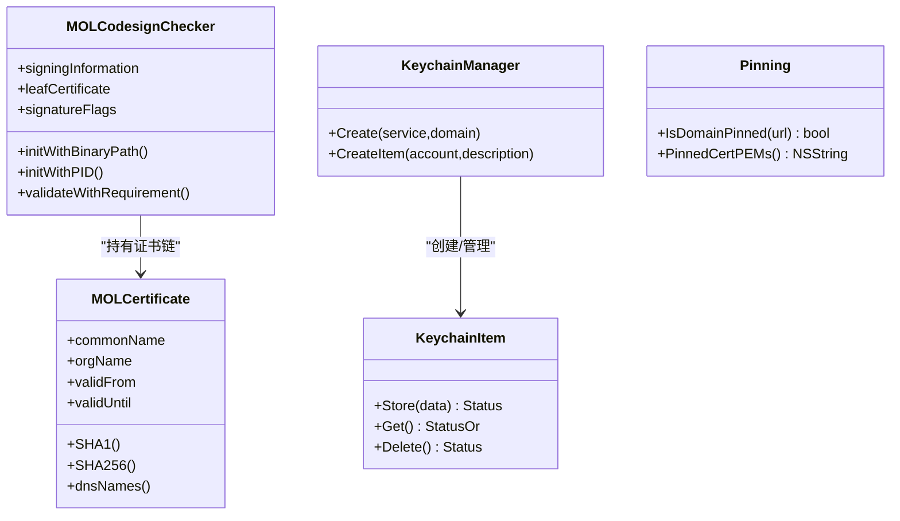
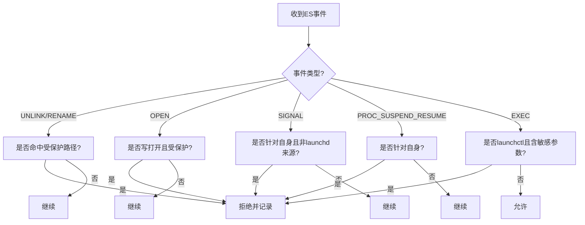
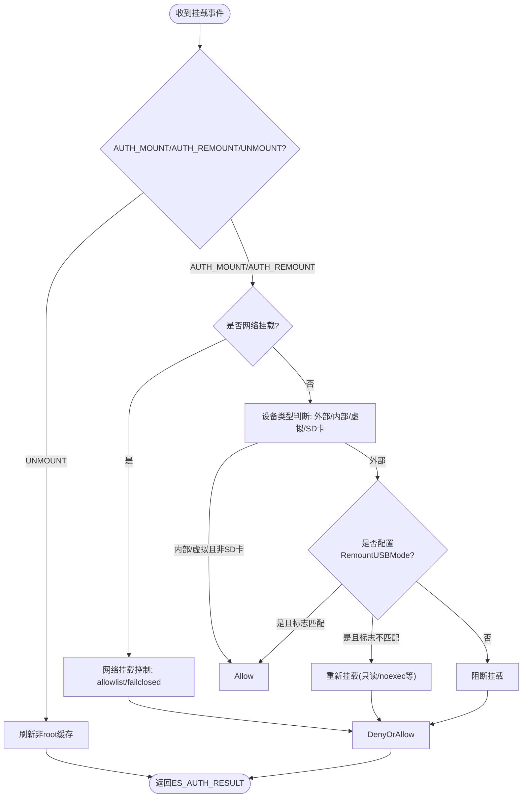
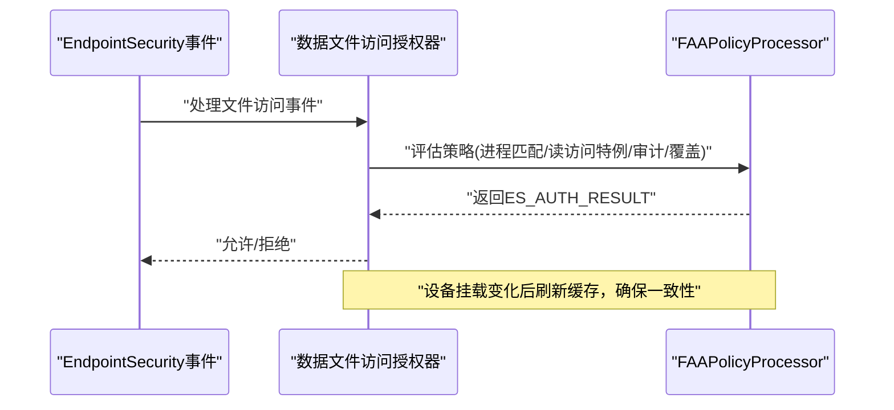
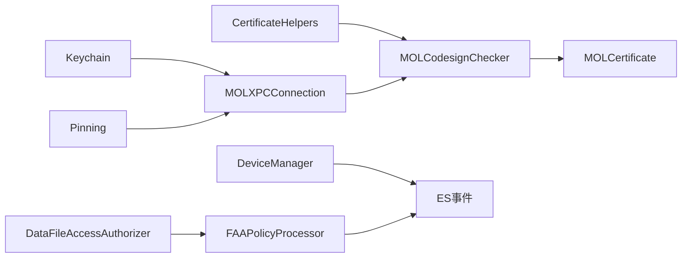

# 安全机制

<cite>
**本文引用的文件**
- [Source/common/CertificateHelpers.mm](file://Source/common/CertificateHelpers.mm)
- [Source/common/Keychain.mm](file://Source/common/Keychain.mm)
- [Source/common/MOLCodesignChecker.mm](file://Source/common/MOLCodesignChecker.mm)
- [Source/common/MOLXPCConnection.mm](file://Source/common/MOLXPCConnection.mm)
- [Source/common/MOLCertificate.mm](file://Source/common/MOLCertificate.mm)
- [Source/common/Pinning.mm](file://Source/common/Pinning.mm)
- [Source/common/SNTDropRootPrivs.mm](file://Source/common/SNTDropRootPrivs.mm)
- [Source/common/SNTError.mm](file://Source/common/SNTError.mm)
- [Source/santad/EventProviders/SNTEndpointSecurityTamperResistance.mm](file://Source/santad/EventProviders/SNTEndpointSecurityTamperResistance.mm)
- [Source/santad/ProcessControl.mm](file://Source/santad/ProcessControl.mm)
- [Source/santad/EventProviders/SNTEndpointSecurityDeviceManager.h](file://Source/santad/EventProviders/SNTEndpointSecurityDeviceManager.h)
- [Source/santad/EventProviders/SNTEndpointSecurityDeviceManager.mm](file://Source/santad/EventProviders/SNTEndpointSecurityDeviceManager.mm)
- [Source/santad/EventProviders/FAAPolicyProcessor.h](file://Source/santad/EventProviders/FAAPolicyProcessor.h)
- [Source/santad/EventProviders/FAAPolicyProcessor.mm](file://Source/santad/EventProviders/FAAPolicyProcessor.mm)
- [Source/santad/EventProviders/SNTEndpointSecurityDataFileAccessAuthorizer.h](file://Source/santad/EventProviders/SNTEndpointSecurityDataFileAccessAuthorizer.h)
- [Source/santad/EventProviders/SNTEndpointSecurityDataFileAccessAuthorizer.mm](file://Source/santad/EventProviders/SNTEndpointSecurityDataFileAccessAuthorizer.mm)
- [docs/docs/features/usb-sd-blocking.md](file://docs/docs/features/usb-sd-blocking.md)
- [EndpointSecurity-Research-Report.md](file://EndpointSecurity-Research-Report.md)
- [docs/EndpointSecurity_Research_Report.md](file://docs/EndpointSecurity_Research_Report.md)
</cite>

## 更新摘要
本次更新聚焦于增强外部存储设备安全策略，重点修订以下内容：
- 明确外部存储设备识别与处理逻辑：针对USB4/Thunderbolt/PCI-Express等高速外部存储设备，即使未标记为可移除/可弹出，也纳入挂载控制范围，确保阻断策略覆盖高速外置存储。
- 补充启动时对现有挂载的处理策略：支持在启动时对已挂载的外部存储执行卸载或重新挂载（强制模式），以确保符合RemountUSBMode配置。
- 完善网络挂载控制：在网络挂载场景下，依据disposition字段（macOS 15+）精准识别网络挂载来源，并结合failClosed与allowlist策略进行阻断或放行。
- 强化文件访问授权（FAA）与设备挂载控制的协同：在设备挂载被阻断或重新挂载后，及时刷新相关缓存，避免后续文件访问授权出现不一致状态。
- 新增与更新安全配置建议：针对USB/SD阻断、RemountUSBMode、OnStartUSBOptions、BlockNetworkMount、AllowedNetworkMountHosts、FailClosed等配置项，提供更清晰的策略说明与最佳实践。

上述更新均已在对应章节中体现，并补充了新的图示来源与章节来源，确保文档与代码实现保持一致。

## 目录
1. [引言](#引言)
2. [项目结构](#项目结构)
3. [核心组件](#核心组件)
4. [架构总览](#架构总览)
5. [详细组件分析](#详细组件分析)
6. [依赖关系分析](#依赖关系分析)
7. [性能考量](#性能考量)
8. [故障排查指南](#故障排查指南)
9. [结论](#结论)
10. [附录](#附录)

## 引言
本文件面向Santa的安全机制，系统化梳理其访问控制、代码签名验证、XPC通信安全、证书与钥匙串集成、信任链建立、防篡改与完整性保护、组件间通信协议与授权、沙箱与权限管理等关键能力，并给出安全配置最佳实践、漏洞防护与威胁缓解策略、安全审计与事件响应建议。

## 项目结构
Santa由多个子组件构成：通用安全工具（证书、签名、XPC、钥匙串、固定证书）、守护进程（santad）及其事件处理模块（Endpoint Security客户端）、服务进程（bundle/sync/metric）。安全相关逻辑主要集中在通用层与santad的事件处理器中。

图表来源
- [Source/common/CertificateHelpers.mm](file://Source/common/CertificateHelpers.mm#L1-L104)
- [Source/common/MOLCodesignChecker.mm](file://Source/common/MOLCodesignChecker.mm#L1-L120)
- [Source/common/MOLCertificate.mm](file://Source/common/MOLCertificate.mm#L1-L120)
- [Source/common/MOLXPCConnection.mm](file://Source/common/MOLXPCConnection.mm#L1-L120)
- [Source/common/Keychain.mm](file://Source/common/Keychain.mm#L1-L120)
- [Source/common/Pinning.mm](file://Source/common/Pinning.mm#L1-L120)
- [Source/common/SNTDropRootPrivs.mm](file://Source/common/SNTDropRootPrivs.mm#L1-L38)
- [Source/common/SNTError.mm](file://Source/common/SNTError.mm#L1-L60)
- [Source/santad/EventProviders/SNTEndpointSecurityTamperResistance.mm](file://Source/santad/EventProviders/SNTEndpointSecurityTamperResistance.mm#L1-L120)
- [Source/santad/ProcessControl.mm](file://Source/santad/ProcessControl.mm#L1-L57)
- [Source/santad/EventProviders/SNTEndpointSecurityDeviceManager.h](file://Source/santad/EventProviders/SNTEndpointSecurityDeviceManager.h#L1-L58)
- [Source/santad/EventProviders/SNTEndpointSecurityDeviceManager.mm](file://Source/santad/EventProviders/SNTEndpointSecurityDeviceManager.mm#L1-L120)
- [Source/santad/EventProviders/FAAPolicyProcessor.h](file://Source/santad/EventProviders/FAAPolicyProcessor.h#L1-L120)
- [Source/santad/EventProviders/FAAPolicyProcessor.mm](file://Source/santad/EventProviders/FAAPolicyProcessor.mm#L1-L120)
- [Source/santad/EventProviders/SNTEndpointSecurityDataFileAccessAuthorizer.h](file://Source/santad/EventProviders/SNTEndpointSecurityDataFileAccessAuthorizer.h#L1-L46)
- [Source/santad/EventProviders/SNTEndpointSecurityDataFileAccessAuthorizer.mm](file://Source/santad/EventProviders/SNTEndpointSecurityDataFileAccessAuthorizer.mm#L1-L90)

章节来源
- [Source/common/CertificateHelpers.mm](file://Source/common/CertificateHelpers.mm#L1-L104)
- [Source/common/MOLCodesignChecker.mm](file://Source/common/MOLCodesignChecker.mm#L1-L120)
- [Source/common/MOLXPCConnection.mm](file://Source/common/MOLXPCConnection.mm#L1-L120)
- [Source/common/Keychain.mm](file://Source/common/Keychain.mm#L1-L120)
- [Source/common/Pinning.mm](file://Source/common/Pinning.mm#L1-L120)
- [Source/common/SNTDropRootPrivs.mm](file://Source/common/SNTDropRootPrivs.mm#L1-L38)
- [Source/common/SNTError.mm](file://Source/common/SNTError.mm#L1-L60)
- [Source/santad/EventProviders/SNTEndpointSecurityTamperResistance.mm](file://Source/santad/EventProviders/SNTEndpointSecurityTamperResistance.mm#L1-L120)
- [Source/santad/ProcessControl.mm](file://Source/santad/ProcessControl.mm#L1-L57)
- [Source/santad/EventProviders/SNTEndpointSecurityDeviceManager.h](file://Source/santad/EventProviders/SNTEndpointSecurityDeviceManager.h#L1-L58)
- [Source/santad/EventProviders/SNTEndpointSecurityDeviceManager.mm](file://Source/santad/EventProviders/SNTEndpointSecurityDeviceManager.mm#L1-L120)
- [Source/santad/EventProviders/FAAPolicyProcessor.h](file://Source/santad/EventProviders/FAAPolicyProcessor.h#L1-L120)
- [Source/santad/EventProviders/FAAPolicyProcessor.mm](file://Source/santad/EventProviders/FAAPolicyProcessor.mm#L1-L120)
- [Source/santad/EventProviders/SNTEndpointSecurityDataFileAccessAuthorizer.h](file://Source/santad/EventProviders/SNTEndpointSecurityDataFileAccessAuthorizer.h#L1-L46)
- [Source/santad/EventProviders/SNTEndpointSecurityDataFileAccessAuthorizer.mm](file://Source/santad/EventProviders/SNTEndpointSecurityDataFileAccessAuthorizer.mm#L1-L90)

## 核心组件
- 代码签名与证书处理：基于Security框架进行静态/运行时签名验证、证书链解析与属性提取、签名状态判定。
- XPC通信安全：通过MOLXPCConnection在连接建立阶段执行对端进程签名一致性校验，限定特权/非特权接口暴露，确保仅受信进程可接入。
- 钥匙串集成：封装钥匙串项的创建、存储、查询与删除，统一错误码映射与访问控制策略。
- 固定证书与域名白名单：限定同步/上报等网络请求的目标域名与根/中间证书，降低中间人攻击风险。
- 防篡改与完整性：santad使用Endpoint Security监听关键系统调用，阻断对规则库、事件库、状态文件及自身组件的写/删/重命名/覆盖等操作；同时对信号、挂起/恢复等敏感动作进行拦截。
- 进程控制与降权：提供进程挂起/恢复/终止的统一入口，并在启动时主动降权以最小权限运行。
- 设备挂载控制：基于DiskArbitration与EndpointSecurity，对USB/SD/网络等设备挂载进行识别、阻断或重新挂载，支持启动时统一处理。
- 文件访问授权（FAA）：对数据/进程中心策略进行评估，支持读访问特例、审计仅记、无效签名保护、速率限制与TTY通知。

章节来源
- [Source/common/MOLCodesignChecker.mm](file://Source/common/MOLCodesignChecker.mm#L1-L120)
- [Source/common/CertificateHelpers.mm](file://Source/common/CertificateHelpers.mm#L1-L104)
- [Source/common/MOLCertificate.mm](file://Source/common/MOLCertificate.mm#L1-L120)
- [Source/common/MOLXPCConnection.mm](file://Source/common/MOLXPCConnection.mm#L1-L120)
- [Source/common/Keychain.mm](file://Source/common/Keychain.mm#L1-L120)
- [Source/common/Pinning.mm](file://Source/common/Pinning.mm#L1-L120)
- [Source/santad/EventProviders/SNTEndpointSecurityTamperResistance.mm](file://Source/santad/EventProviders/SNTEndpointSecurityTamperResistance.mm#L1-L120)
- [Source/santad/ProcessControl.mm](file://Source/santad/ProcessControl.mm#L1-L57)
- [Source/santad/EventProviders/SNTEndpointSecurityDeviceManager.h](file://Source/santad/EventProviders/SNTEndpointSecurityDeviceManager.h#L1-L58)
- [Source/santad/EventProviders/SNTEndpointSecurityDeviceManager.mm](file://Source/santad/EventProviders/SNTEndpointSecurityDeviceManager.mm#L1-L120)
- [Source/santad/EventProviders/FAAPolicyProcessor.h](file://Source/santad/EventProviders/FAAPolicyProcessor.h#L1-L120)
- [Source/santad/EventProviders/FAAPolicyProcessor.mm](file://Source/santad/EventProviders/FAAPolicyProcessor.mm#L1-L120)
- [Source/santad/EventProviders/SNTEndpointSecurityDataFileAccessAuthorizer.h](file://Source/santad/EventProviders/SNTEndpointSecurityDataFileAccessAuthorizer.h#L1-L46)
- [Source/santad/EventProviders/SNTEndpointSecurityDataFileAccessAuthorizer.mm](file://Source/santad/EventProviders/SNTEndpointSecurityDataFileAccessAuthorizer.mm#L1-L90)

## 架构总览
下图展示从用户态触发到守护进程决策的关键路径，以及安全边界与信任链：

图表来源
- [Source/santad/EventProviders/SNTEndpointSecurityDeviceManager.mm](file://Source/santad/EventProviders/SNTEndpointSecurityDeviceManager.mm#L422-L621)
- [Source/santad/EventProviders/FAAPolicyProcessor.mm](file://Source/santad/EventProviders/FAAPolicyProcessor.mm#L502-L560)

章节来源
- [Source/santad/EventProviders/SNTEndpointSecurityDeviceManager.mm](file://Source/santad/EventProviders/SNTEndpointSecurityDeviceManager.mm#L422-L621)
- [Source/santad/EventProviders/FAAPolicyProcessor.mm](file://Source/santad/EventProviders/FAAPolicyProcessor.mm#L502-L560)

## 详细组件分析

### 访问控制与XPC通信安全
- 连接建立阶段：服务器侧根据连接发起者的有效UID与导出接口类型选择特权或非特权接口；随后通过MOLXPCConnection对端进程进行签名一致性校验，仅当与本地自证一致才接受连接。
- 接口暴露：客户端在握手完成后切换到正式的远程对象接口，避免在验证阶段暴露完整能力集。
- 超时与失效处理：握手超时会主动使连接失效并清理远程代理接口，防止误用。

图表来源
- [Source/common/MOLXPCConnection.mm](file://Source/common/MOLXPCConnection.mm#L120-L200)

章节来源
- [Source/common/MOLXPCConnection.mm](file://Source/common/MOLXPCConnection.mm#L1-L239)

### 代码签名验证与信任链
- 静态签名验证：针对磁盘上二进制，使用特定标志位组合进行验证，避免资源校验与网络访问，提升性能；同时对多架构一致性检查。
- 运行时签名验证：针对已加载进程，采用默认标志位进行校验。
- 签名状态判定：综合错误码、签名标志、平台二进制标记与证书类型，区分Unsigned/Adhoc/Production/Development等状态。
- 证书链与属性：封装证书对象，支持常见属性（组织、单位、DN、SAN、有效期、摘要等），并提供证书链数组转换。

图表来源
- [Source/common/MOLCodesignChecker.mm](file://Source/common/MOLCodesignChecker.mm#L1-L120)
- [Source/common/CertificateHelpers.mm](file://Source/common/CertificateHelpers.mm#L60-L104)
- [Source/common/MOLCertificate.mm](file://Source/common/MOLCertificate.mm#L1-L120)

章节来源
- [Source/common/MOLCodesignChecker.mm](file://Source/common/MOLCodesignChecker.mm#L1-L220)
- [Source/common/CertificateHelpers.mm](file://Source/common/CertificateHelpers.mm#L1-L104)
- [Source/common/MOLCertificate.mm](file://Source/common/MOLCertificate.mm#L1-L120)

### 证书验证流程、钥匙串集成与信任链建立
- 证书验证：通过证书属性与OID值识别生产类证书（如Mac App Store、Developer ID等），辅助签名状态判定。
- 钥匙串集成：提供服务名/账户名/描述长度校验、数据存储/删除/查询、错误码映射至统一状态码，使用“仅本设备”访问策略，避免跨设备泄露。
- 信任链建立：结合固定证书列表与域名白名单，限定网络目标，减少对系统信任根的依赖范围，降低中间人风险。

图表来源
- [Source/common/MOLCertificate.mm](file://Source/common/MOLCertificate.mm#L1-L120)
- [Source/common/MOLCodesignChecker.mm](file://Source/common/MOLCodesignChecker.mm#L1-L120)
- [Source/common/Keychain.mm](file://Source/common/Keychain.mm#L1-L120)
- [Source/common/Pinning.mm](file://Source/common/Pinning.mm#L1-L120)

章节来源
- [Source/common/MOLCertificate.mm](file://Source/common/MOLCertificate.mm#L1-L120)
- [Source/common/MOLCodesignChecker.mm](file://Source/common/MOLCodesignChecker.mm#L1-L120)
- [Source/common/Keychain.mm](file://Source/common/Keychain.mm#L1-L120)
- [Source/common/Pinning.mm](file://Source/common/Pinning.mm#L1-L120)

### 防篡改机制、完整性检查与安全边界设计
- 受保护路径集合：规则库、事件库、同步状态、应用目录、LaunchAgent/LaunchDaemon服务等。
- 拦截策略：拒绝对受保护路径的删除、重命名、写打开、覆盖；对自身进程的信号、挂起/恢复进行限制；对launchctl敏感参数进行白名单校验。
- ES订阅事件：信号、exec、unlink、rename、open、proc_suspend_resume等，统一记录并按策略响应。
- 进程控制：优先使用pid_suspend/pid_resume，不可用时回退到信号方式并记录日志。

图表来源
- [Source/santad/EventProviders/SNTEndpointSecurityTamperResistance.mm](file://Source/santad/EventProviders/SNTEndpointSecurityTamperResistance.mm#L120-L220)
- [Source/santad/ProcessControl.mm](file://Source/santad/ProcessControl.mm#L1-L57)

章节来源
- [Source/santad/EventProviders/SNTEndpointSecurityTamperResistance.mm](file://Source/santad/EventProviders/SNTEndpointSecurityTamperResistance.mm#L1-L326)
- [Source/santad/ProcessControl.mm](file://Source/santad/ProcessControl.mm#L1-L57)

### 组件间通信的安全协议、身份验证与授权
- XPC握手：通过验证接口与connectWithReply完成双向确认，随后切换到正式接口。
- 签名一致性：服务器端对端进程签名与本地自证进行匹配，拒绝不一致来源。
- 授权粒度：根据进程UID与配置决定暴露特权或非特权接口，最小化攻击面。
- 同步/上报：固定域名白名单与固定证书列表，降低TLS劫持风险。

章节来源
- [Source/common/MOLXPCConnection.mm](file://Source/common/MOLXPCConnection.mm#L120-L200)
- [Source/common/Pinning.mm](file://Source/common/Pinning.mm#L1-L120)

### 沙箱限制与权限管理
- 降权策略：启动时若检测到root权限则切换到nobody组与用户，确保以最小权限运行。
- 钥匙串访问：使用“仅本设备”策略，避免跨设备访问；对交互/权限不足等情况进行明确错误映射。
- 进程控制：对自身挂起/恢复失败回退到信号方式，避免滥用权限。

章节来源
- [Source/common/SNTDropRootPrivs.mm](file://Source/common/SNTDropRootPrivs.mm#L1-L38)
- [Source/common/Keychain.mm](file://Source/common/Keychain.mm#L120-L212)
- [Source/santad/ProcessControl.mm](file://Source/santad/ProcessControl.mm#L1-L57)

### 外部存储设备安全策略（增强）
- 设备识别与处理：
  - 对于内部或虚拟接口设备（含SD卡），若非SD卡则允许挂载。
  - 对于外部设备（非内部且非虚拟），一律纳入挂载控制范围，包括USB4/Thunderbolt/PCI-Express等高速外置存储。
  - 对内部/虚拟SD卡且不可移除/不可弹出/非USB/非Secure Digital的情况，不进行挂载控制。
- 启动时处理：
  - 支持在启动时对已挂载的外部存储执行卸载或重新挂载（强制模式），以确保符合RemountUSBMode配置。
  - 若已存在RemountUSBMode标志，则允许当前挂载继续，避免重复干预。
- 网络挂载控制：
  - 在macOS 15+环境下，利用ES消息版本8+的disposition字段精确识别网络挂载来源。
  - 结合BlockNetworkMount、AllowedNetworkMountHosts与FailClosed策略，实现细粒度控制。
- 与FAA协同：
  - 设备挂载被阻断或重新挂载后，及时刷新相关缓存，避免后续文件访问授权出现不一致状态。

图表来源
- [Source/santad/EventProviders/SNTEndpointSecurityDeviceManager.mm](file://Source/santad/EventProviders/SNTEndpointSecurityDeviceManager.mm#L250-L449)
- [Source/santad/EventProviders/SNTEndpointSecurityDeviceManager.mm](file://Source/santad/EventProviders/SNTEndpointSecurityDeviceManager.mm#L422-L621)

章节来源
- [Source/santad/EventProviders/SNTEndpointSecurityDeviceManager.h](file://Source/santad/EventProviders/SNTEndpointSecurityDeviceManager.h#L1-L58)
- [Source/santad/EventProviders/SNTEndpointSecurityDeviceManager.mm](file://Source/santad/EventProviders/SNTEndpointSecurityDeviceManager.mm#L250-L449)
- [Source/santad/EventProviders/SNTEndpointSecurityDeviceManager.mm](file://Source/santad/EventProviders/SNTEndpointSecurityDeviceManager.mm#L422-L621)
- [docs/docs/features/usb-sd-blocking.md](file://docs/docs/features/usb-sd-blocking.md#L1-L33)
- [EndpointSecurity-Research-Report.md](file://EndpointSecurity-Research-Report.md#L396-L428)
- [docs/EndpointSecurity_Research_Report.md](file://docs/EndpointSecurity_Research_Report.md#L686-L788)

### 文件访问授权（FAA）与设备挂载控制协同
- 策略评估流程：
  - 对每个目标-策略对进行决策评估，支持“读访问特例”（写标志判断、克隆/复制文件的源只读目标等）。
  - 应用规则类型反转（允许/禁止列表）、审计仅记覆盖、无效签名保护。
  - 记录遥测与日志、生成阻断事件对象、触发UI阻断通知与TTY消息（受静默与TTY静默开关控制）。
  - 维护“最近读取缓存”（基于进程PID+版本+客户端类型与设备号inode对）与TTY消息去重缓存，支持进程退出清理。
  - 提供“即时响应”能力：对已允许的读取在相同文件上快速放行，避免重复评估。
- 与设备挂载控制的协同：
  - 当设备挂载被阻断或重新挂载后，及时刷新相关缓存，确保后续文件访问授权评估的一致性。

图表来源
- [Source/santad/EventProviders/SNTEndpointSecurityDataFileAccessAuthorizer.mm](file://Source/santad/EventProviders/SNTEndpointSecurityDataFileAccessAuthorizer.mm#L93-L159)
- [Source/santad/EventProviders/FAAPolicyProcessor.mm](file://Source/santad/EventProviders/FAAPolicyProcessor.mm#L502-L560)

章节来源
- [Source/santad/EventProviders/FAAPolicyProcessor.h](file://Source/santad/EventProviders/FAAPolicyProcessor.h#L54-L173)
- [Source/santad/EventProviders/FAAPolicyProcessor.mm](file://Source/santad/EventProviders/FAAPolicyProcessor.mm#L120-L216)
- [Source/santad/EventProviders/FAAPolicyProcessor.mm](file://Source/santad/EventProviders/FAAPolicyProcessor.mm#L311-L363)
- [Source/santad/EventProviders/FAAPolicyProcessor.mm](file://Source/santad/EventProviders/FAAPolicyProcessor.mm#L435-L495)
- [Source/santad/EventProviders/FAAPolicyProcessor.mm](file://Source/santad/EventProviders/FAAPolicyProcessor.mm#L502-L560)
- [Source/santad/EventProviders/SNTEndpointSecurityDataFileAccessAuthorizer.h](file://Source/santad/EventProviders/SNTEndpointSecurityDataFileAccessAuthorizer.h#L1-L46)
- [Source/santad/EventProviders/SNTEndpointSecurityDataFileAccessAuthorizer.mm](file://Source/santad/EventProviders/SNTEndpointSecurityDataFileAccessAuthorizer.mm#L93-L159)

## 依赖关系分析
- 低耦合高内聚：签名验证、证书处理、XPC连接、钥匙串操作、设备挂载控制、文件访问授权均以独立模块提供能力，santad通过组合这些模块实现策略执行。
- 外部依赖：Security框架（签名/证书）、EndpointSecurity（事件）、XPC（IPC）、Keychain（持久化）、DiskArbitration（设备枚举）。
- 循环依赖：未见循环依赖迹象；各模块职责清晰，接口稳定。

图表来源
- [Source/common/MOLCodesignChecker.mm](file://Source/common/MOLCodesignChecker.mm#L1-L120)
- [Source/common/MOLCertificate.mm](file://Source/common/MOLCertificate.mm#L1-L120)
- [Source/common/CertificateHelpers.mm](file://Source/common/CertificateHelpers.mm#L1-L104)
- [Source/common/MOLXPCConnection.mm](file://Source/common/MOLXPCConnection.mm#L1-L120)
- [Source/common/Keychain.mm](file://Source/common/Keychain.mm#L1-L120)
- [Source/common/Pinning.mm](file://Source/common/Pinning.mm#L1-L120)
- [Source/santad/EventProviders/SNTEndpointSecurityDeviceManager.mm](file://Source/santad/EventProviders/SNTEndpointSecurityDeviceManager.mm#L1-L120)
- [Source/santad/EventProviders/FAAPolicyProcessor.mm](file://Source/santad/EventProviders/FAAPolicyProcessor.mm#L1-L120)
- [Source/santad/EventProviders/SNTEndpointSecurityDataFileAccessAuthorizer.mm](file://Source/santad/EventProviders/SNTEndpointSecurityDataFileAccessAuthorizer.mm#L1-L90)

章节来源
- [Source/common/MOLCodesignChecker.mm](file://Source/common/MOLCodesignChecker.mm#L1-L120)
- [Source/common/MOLXPCConnection.mm](file://Source/common/MOLXPCConnection.mm#L1-L120)
- [Source/common/Keychain.mm](file://Source/common/Keychain.mm#L1-L120)
- [Source/common/Pinning.mm](file://Source/common/Pinning.mm#L1-L120)
- [Source/santad/EventProviders/SNTEndpointSecurityDeviceManager.mm](file://Source/santad/EventProviders/SNTEndpointSecurityDeviceManager.mm#L1-L120)
- [Source/santad/EventProviders/FAAPolicyProcessor.mm](file://Source/santad/EventProviders/FAAPolicyProcessor.mm#L1-L120)
- [Source/santad/EventProviders/SNTEndpointSecurityDataFileAccessAuthorizer.mm](file://Source/santad/EventProviders/SNTEndpointSecurityDataFileAccessAuthorizer.mm#L1-L90)

## 性能考量
- 静态签名验证禁用资源校验与网络访问，显著降低耗时；多架构一致性检查仅在静态场景启用，避免重复开销。
- XPC握手引入一次往返，但换取了强身份验证与最小接口暴露；超时控制避免阻塞。
- ES事件处理按需缓存，对高热路径（如OPEN）谨慎缓存，平衡吞吐与准确性。
- 钥匙串操作采用一次性查询/删除再新增，避免冗余写入。
- 设备挂载控制在启动时批量处理，避免频繁阻断带来的抖动。

章节来源
- [Source/common/MOLCodesignChecker.mm](file://Source/common/MOLCodesignChecker.mm#L30-L120)
- [Source/common/MOLXPCConnection.mm](file://Source/common/MOLXPCConnection.mm#L120-L200)
- [Source/santad/EventProviders/SNTEndpointSecurityDeviceManager.mm](file://Source/santad/EventProviders/SNTEndpointSecurityDeviceManager.mm#L318-L408)
- [Source/common/Keychain.mm](file://Source/common/Keychain.mm#L120-L212)

## 故障排查指南
- 签名验证失败：检查错误码与签名标志，确认是否为Unsigned/Adhoc/Production/Development；核对证书链与平台二进制标记。
- XPC连接异常：确认对端进程签名与本地自证一致；检查握手超时与失效处理逻辑；查看接口切换是否成功。
- 钥匙串操作失败：关注错误码映射（如权限不足、交互不允许、项不存在等）；确认服务名/账户名/描述长度约束。
- 防篡改被触发：检查是否对受保护路径执行了删除/重命名/写打开/覆盖；核对自身信号/挂起/恢复是否被拒绝。
- 进程控制回退：若pid_suspend/pid_resume不可用，系统会回退到信号方式，应检查系统版本与可用性。
- 外部存储设备挂载问题：确认设备类型识别逻辑（内部/虚拟/外部/SD卡）与RemountUSBMode配置；检查启动时卸载/重新挂载是否成功。
- 网络挂载控制：在macOS 15+环境下，确认ES消息版本与disposition字段可用；核对BlockNetworkMount、AllowedNetworkMountHosts与FailClosed配置。

章节来源
- [Source/common/SNTError.mm](file://Source/common/SNTError.mm#L1-L102)
- [Source/common/MOLCodesignChecker.mm](file://Source/common/MOLCodesignChecker.mm#L120-L220)
- [Source/common/MOLXPCConnection.mm](file://Source/common/MOLXPCConnection.mm#L120-L200)
- [Source/common/Keychain.mm](file://Source/common/Keychain.mm#L120-L212)
- [Source/santad/EventProviders/SNTEndpointSecurityTamperResistance.mm](file://Source/santad/EventProviders/SNTEndpointSecurityTamperResistance.mm#L120-L220)
- [Source/santad/ProcessControl.mm](file://Source/santad/ProcessControl.mm#L1-L57)
- [Source/santad/EventProviders/SNTEndpointSecurityDeviceManager.mm](file://Source/santad/EventProviders/SNTEndpointSecurityDeviceManager.mm#L250-L449)
- [Source/santad/EventProviders/SNTEndpointSecurityDeviceManager.mm](file://Source/santad/EventProviders/SNTEndpointSecurityDeviceManager.mm#L422-L621)

## 结论
Santa通过“签名验证+XPC鉴权+ES防篡改+固定证书/域名白名单+最小权限运行+设备挂载控制+文件访问授权”的组合拳，构建了多层次、强边界的安全体系。签名验证与证书处理保证来源可信，XPC握手与接口隔离确保通信安全，ES事件拦截与受保护路径策略保障系统完整性，固定证书与域名白名单降低网络风险，降权与进程控制进一步收敛攻击面；设备挂载控制与FAA协同，确保对外部存储与文件访问的全面防护。

## 附录
- 安全配置最佳实践
  - 严格启用XPC连接阶段的签名一致性校验，仅暴露必要接口。
  - 使用固定域名白名单与固定证书列表，限制网络目标。
  - 对受保护路径实施严格的读写/删除/重命名/覆盖策略。
  - 启用自身信号/挂起/恢复拦截，防止被外部控制。
  - 启动即降权，避免长期保留root权限。
  - 针对外部存储设备：
    - 启用BlockUSBMount并配置RemountUSBMode（如只读、noexec、nosuid等），确保高速外置存储符合安全基线。
    - 在启动时选择Unmount/ForceUnmount/Remount/ForceRemount策略，确保现有挂载符合RemountUSBMode。
    - 网络挂载场景下，启用BlockNetworkMount并维护AllowedNetworkMountHosts白名单，结合FailClosed策略实现安全兜底。
- 漏洞防护与威胁缓解
  - 静态签名验证禁用网络访问，降低供应链风险。
  - 对launchctl敏感参数进行白名单校验，阻断卸载/替换组件的尝试。
  - 对历史遗留组件配置文件进行清理，消除回滚路径。
- 安全审计与事件响应
  - 建立ES事件日志与指标采集，对拒绝事件进行聚合统计。
  - 对篡改尝试进行告警与取证，保留进程链与签名信息。
  - 制定应急处置流程：隔离受影响主机、回滚可疑变更、重建信任链。
- 与macOS安全框架的集成
  - 与EndpointSecurity、DiskArbitration、Security、Keychain等框架深度集成，充分利用系统原生安全能力。
  - 遵循沙箱限制与权限管理，最小化攻击面并确保合规性。