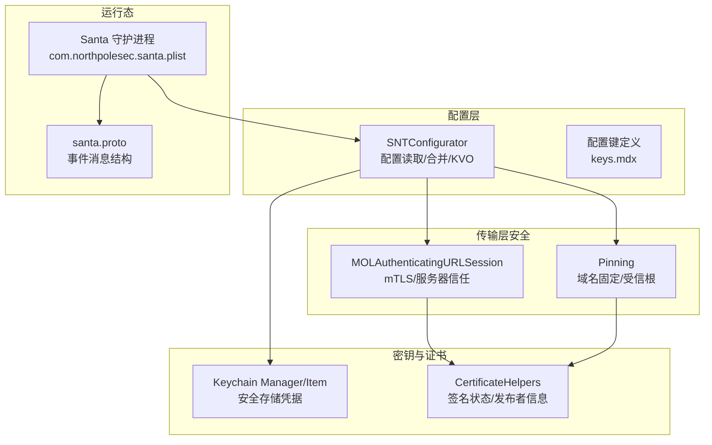
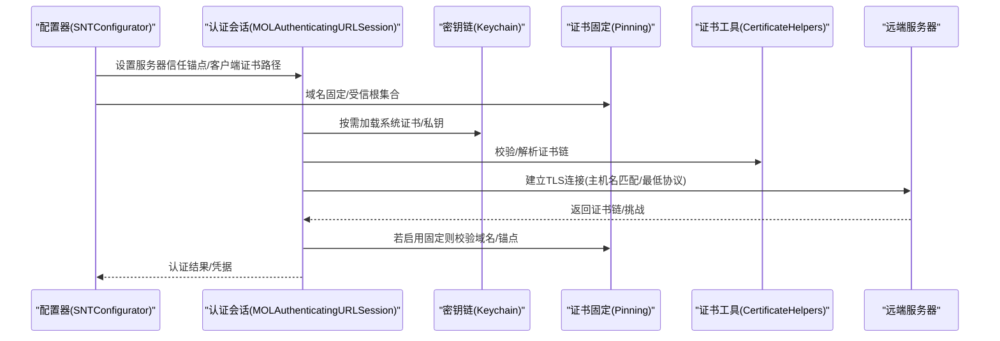
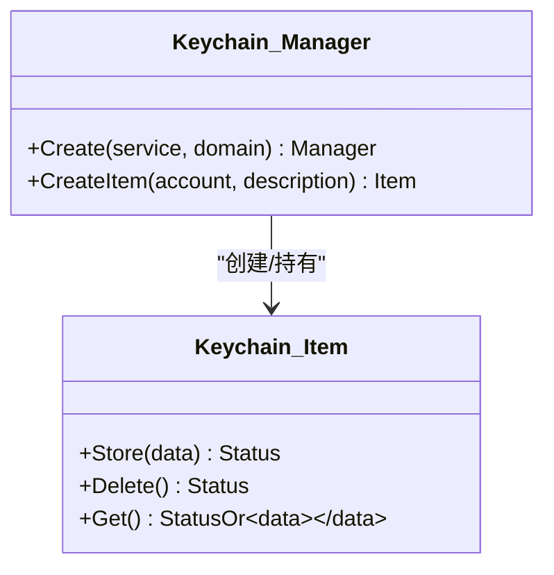
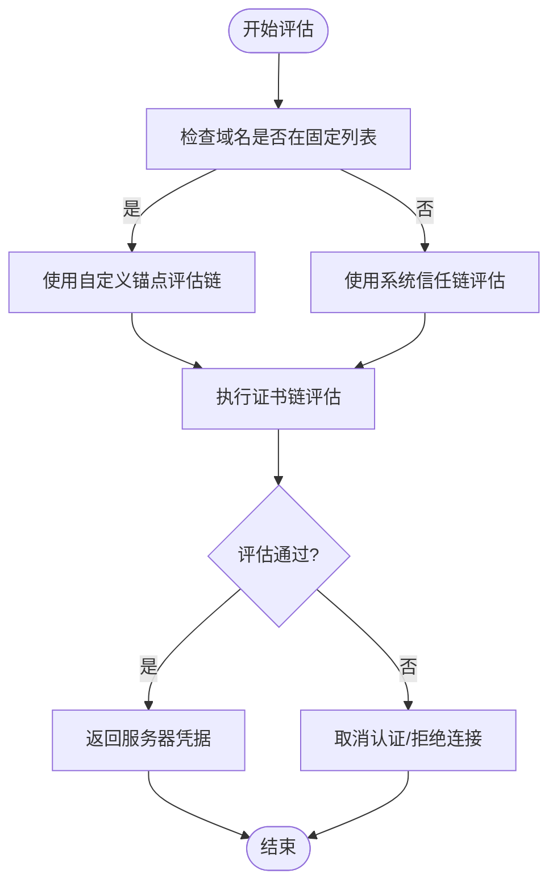
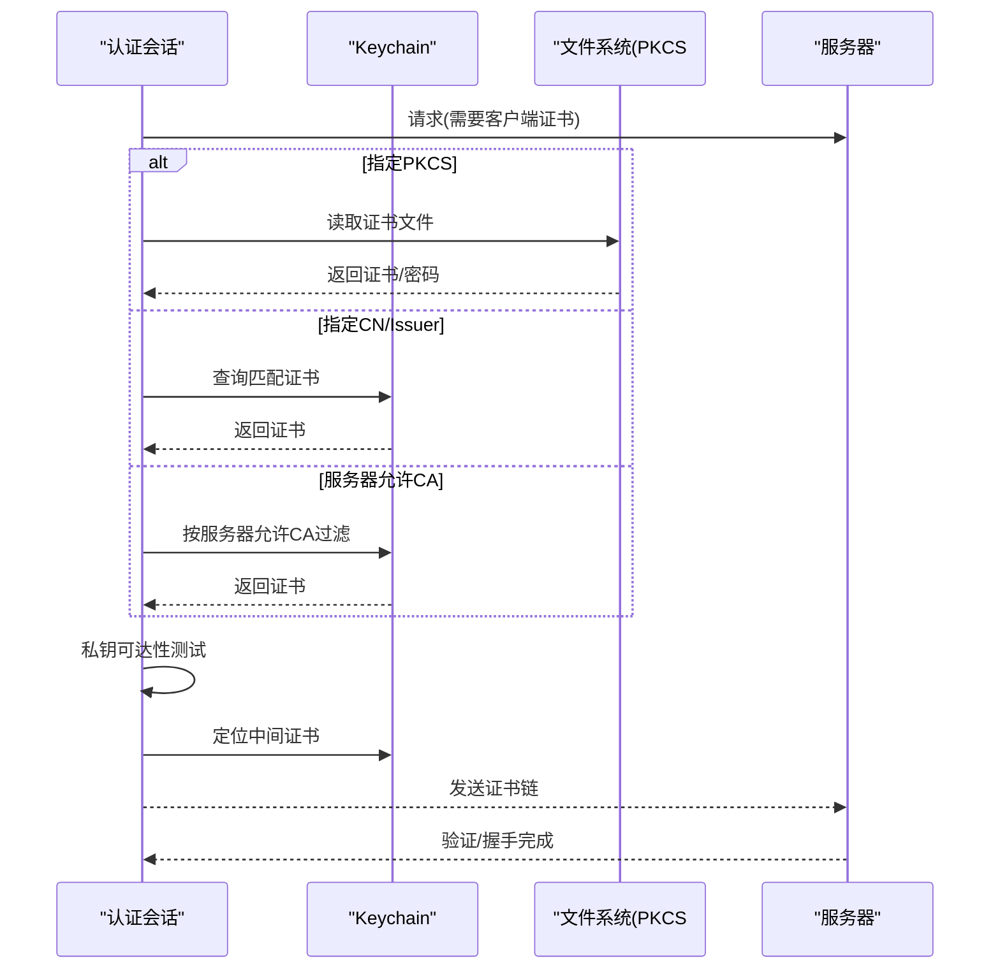
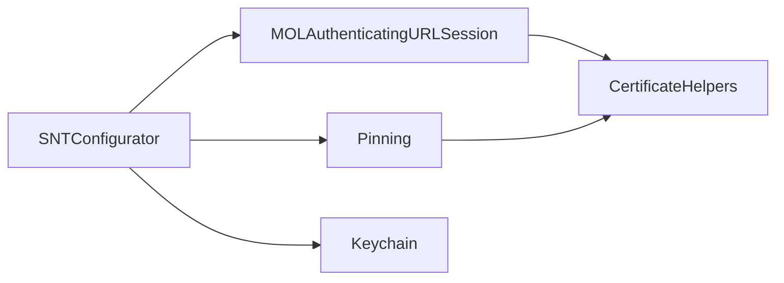

# 安全配置

<cite>
**本文引用的文件**
- [Keychain.h](file://Source/common/Keychain.h)
- [Keychain.mm](file://Source/common/Keychain.mm)
- [Pinning.h](file://Source/common/Pinning.h)
- [Pinning.mm](file://Source/common/Pinning.mm)
- [MOLAuthenticatingURLSession.h](file://Source/common/MOLAuthenticatingURLSession.h)
- [MOLAuthenticatingURLSession.mm](file://Source/common/MOLAuthenticatingURLSession.mm)
- [SNTConfigurator.h](file://Source/common/SNTConfigurator.h)
- [SNTConfigurator.mm](file://Source/common/SNTConfigurator.mm)
- [CertificateHelpers.h](file://Source/common/CertificateHelpers.h)
- [CertificateHelpers.mm](file://Source/common/CertificateHelpers.mm)
- [santa.proto](file://Source/common/santa.proto)
- [com.northpolesec.santa.plist](file://Conf/com.northpolesec.santa.plist)
- [keys.mdx](file://docs/docs/configuration/keys.mdx)
</cite>

## 目录
1. [简介](#简介)
2. [项目结构](#项目结构)
3. [核心组件](#核心组件)
4. [架构总览](#架构总览)
5. [详细组件分析](#详细组件分析)
6. [依赖关系分析](#依赖关系分析)
7. [性能考量](#性能考量)
8. [故障排查指南](#故障排查指南)
9. [结论](#结论)
10. [附录](#附录)

## 简介
本技术文档聚焦 Santa 的安全配置，围绕密钥链集成、证书固定（服务器端与客户端）、安全参数配置、配置文件安全与敏感信息保护、凭据管理、安全策略与默认设置、风险控制参数、配置验证与审计机制，以及配置更新流程、安全影响评估与回滚策略进行系统化说明。文档旨在帮助安全与运维人员在部署与维护 Santa 时建立可审计、可验证、可回滚的安全基线。

## 项目结构
Santa 的安全配置涉及多个层次：
- 配置读取与状态管理：通过配置器统一读取与合并来自同步服务与本地强制配置的状态，暴露为 KVO 可观察属性。
- 传输层安全：基于 NSURLSession 的认证会话封装，支持 mTLS 客户端证书与服务器信任锚点校验。
- 证书与密钥管理：对系统 Keychain 的抽象封装，用于安全存储与检索敏感凭据。
- 证书固定：内置受信根证书集合与域名固定策略，降低中间人攻击风险。
- 事件与日志：事件消息中可选包含机器标识，便于审计关联。

图表来源
- [SNTConfigurator.h](file://Source/common/SNTConfigurator.h#L1-L200)
- [SNTConfigurator.mm](file://Source/common/SNTConfigurator.mm#L1-L200)
- [MOLAuthenticatingURLSession.h](file://Source/common/MOLAuthenticatingURLSession.h#L1-L136)
- [MOLAuthenticatingURLSession.mm](file://Source/common/MOLAuthenticatingURLSession.mm#L1-L200)
- [Pinning.h](file://Source/common/Pinning.h#L1-L31)
- [Pinning.mm](file://Source/common/Pinning.mm#L1-L120)
- [Keychain.h](file://Source/common/Keychain.h#L1-L79)
- [Keychain.mm](file://Source/common/Keychain.mm#L1-L120)
- [CertificateHelpers.h](file://Source/common/CertificateHelpers.h#L1-L68)
- [CertificateHelpers.mm](file://Source/common/CertificateHelpers.mm#L1-L104)
- [com.northpolesec.santa.plist](file://Conf/com.northpolesec.santa.plist#L1-L22)
- [santa.proto](file://Source/common/santa.proto#L1150-L1185)

章节来源
- [SNTConfigurator.h](file://Source/common/SNTConfigurator.h#L1-L200)
- [SNTConfigurator.mm](file://Source/common/SNTConfigurator.mm#L1-L200)
- [MOLAuthenticatingURLSession.h](file://Source/common/MOLAuthenticatingURLSession.h#L1-L136)
- [MOLAuthenticatingURLSession.mm](file://Source/common/MOLAuthenticatingURLSession.mm#L1-L200)
- [Pinning.h](file://Source/common/Pinning.h#L1-L31)
- [Pinning.mm](file://Source/common/Pinning.mm#L1-L120)
- [Keychain.h](file://Source/common/Keychain.h#L1-L79)
- [Keychain.mm](file://Source/common/Keychain.mm#L1-L120)
- [CertificateHelpers.h](file://Source/common/CertificateHelpers.h#L1-L68)
- [CertificateHelpers.mm](file://Source/common/CertificateHelpers.mm#L1-L104)
- [com.northpolesec.santa.plist](file://Conf/com.northpolesec.santa.plist#L1-L22)
- [santa.proto](file://Source/common/santa.proto#L1150-L1185)

## 核心组件
- 配置器（SNTConfigurator）
  - 负责从同步状态与本地强制配置中读取键值，合并为最终状态；提供 KVO 属性以驱动运行时行为。
  - 关键能力：键类型约束、访问授权（仅守护进程与 root）、临时监控模式、事件日志与遥测导出等。
- 传输层认证会话（MOLAuthenticatingURLSession）
  - 封装 NSURLSession，支持 TLS 最低版本、拒绝重定向、主机名匹配、客户端证书选择与中间证书定位、服务器信任锚点替换。
- 密钥链（Keychain Manager/Item）
  - 对系统 Keychain 的轻量封装，提供凭据存储、删除、读取，带长度校验与错误码映射。
- 证书固定（Pinning）
  - 内置受信根证书集合与域名后缀固定列表，用于限制可信任的服务器证书链与目标域。
- 证书工具（CertificateHelpers）
  - 提供发布者信息、证书链提取、生产签名证书判定、代码签名状态判断等辅助能力。
- 运行配置（com.northpolesec.santa.plist）
  - LaunchDaemon 启动项，确保守护进程以 root 权限运行并保持存活。
- 事件消息（santa.proto）
  - 事件消息可选包含机器 ID，便于审计与溯源。

章节来源
- [SNTConfigurator.h](file://Source/common/SNTConfigurator.h#L1-L200)
- [SNTConfigurator.mm](file://Source/common/SNTConfigurator.mm#L1-L200)
- [MOLAuthenticatingURLSession.h](file://Source/common/MOLAuthenticatingURLSession.h#L1-L136)
- [MOLAuthenticatingURLSession.mm](file://Source/common/MOLAuthenticatingURLSession.mm#L1-L200)
- [Keychain.h](file://Source/common/Keychain.h#L1-L79)
- [Keychain.mm](file://Source/common/Keychain.mm#L1-L120)
- [Pinning.h](file://Source/common/Pinning.h#L1-L31)
- [Pinning.mm](file://Source/common/Pinning.mm#L1-L120)
- [CertificateHelpers.h](file://Source/common/CertificateHelpers.h#L1-L68)
- [CertificateHelpers.mm](file://Source/common/CertificateHelpers.mm#L1-L104)
- [com.northpolesec.santa.plist](file://Conf/com.northpolesec.santa.plist#L1-L22)
- [santa.proto](file://Source/common/santa.proto#L1150-L1185)

## 架构总览
下图展示 Santa 安全配置在运行时的关键交互路径：配置器读取配置，传输层使用 mTLS 与服务器信任锚点进行连接，密钥链用于存储与检索客户端证书与密码，证书固定降低信任边界风险，事件消息携带机器 ID 支持审计。

图表来源
- [SNTConfigurator.mm](file://Source/common/SNTConfigurator.mm#L1-L200)
- [MOLAuthenticatingURLSession.mm](file://Source/common/MOLAuthenticatingURLSession.mm#L120-L220)
- [Keychain.mm](file://Source/common/Keychain.mm#L120-L212)
- [Pinning.mm](file://Source/common/Pinning.mm#L1-L120)
- [CertificateHelpers.mm](file://Source/common/CertificateHelpers.mm#L1-L104)

## 详细组件分析

### 组件A：密钥链集成（凭据安全存储与检索）
- 设计要点
  - 通过 Manager/Item 抽象封装 Keychain 操作，提供创建、存储、删除、读取接口，并进行输入长度校验与错误码到通用状态码映射。
  - 默认使用“仅此设备”可访问性，避免凭据跨设备泄露。
- 安全影响
  - 仅在 root 权限下访问状态文件，减少配置被篡改风险。
  - 凭据写入前先删除旧值，避免残留数据污染。
- 使用建议
  - 将客户端证书密码、服务器信任锚点等敏感数据交由 Keychain 管理，不在明文配置文件中直接存放。
  - 对 Keychain 访问失败进行告警与降级策略（如禁用 mTLS）。

图表来源
- [Keychain.h](file://Source/common/Keychain.h#L1-L79)
- [Keychain.mm](file://Source/common/Keychain.mm#L1-L212)

章节来源
- [Keychain.h](file://Source/common/Keychain.h#L1-L79)
- [Keychain.mm](file://Source/common/Keychain.mm#L1-L212)

### 组件B：证书固定与服务器信任（Pin-Down 与锚点）
- 设计要点
  - 域名固定：基于后缀匹配的白名单，限定允许通信的目标域。
  - 服务器信任锚点：支持从 PEM 数据或文件注入自定义根证书，覆盖系统信任链。
  - 服务器证书链评估：在存在自定义锚点时优先使用，否则退回系统信任。
- 安全影响
  - 降低中间人攻击风险，防止误信不受信 CA 或过期证书。
  - 通过最小化信任锚点集合，缩小攻击面。
- 使用建议
  - 在生产环境启用服务器锚点固定，避免使用系统默认信任链。
  - 对固定域名与锚点变更进行审计与回滚预案。

图表来源
- [Pinning.mm](file://Source/common/Pinning.mm#L1-L120)
- [MOLAuthenticatingURLSession.mm](file://Source/common/MOLAuthenticatingURLSession.mm#L338-L390)

章节来源
- [Pinning.h](file://Source/common/Pinning.h#L1-L31)
- [Pinning.mm](file://Source/common/Pinning.mm#L1-L120)
- [MOLAuthenticatingURLSession.h](file://Source/common/MOLAuthenticatingURLSession.h#L1-L136)
- [MOLAuthenticatingURLSession.mm](file://Source/common/MOLAuthenticatingURLSession.mm#L338-L390)

### 组件C：客户端 mTLS 认证（多源选择与中间证书定位）
- 设计要点
  - 客户端证书来源：PKCS#12 文件、Keychain 中按 CN/Issuer 查找、或根据服务器允许的 CA 列表自动匹配。
  - 私钥可用性检测：尝试对测试数据进行签名以验证私钥可达性。
  - 中间证书定位：通过构建信任链并提取除叶子证书外的其余证书作为附加链。
- 安全影响
  - 强制双向 TLS，提升与同步服务的身份可信度。
  - 自动中间证书补全增强兼容性，同时保留最小必要链。
- 使用建议
  - 优先使用 Keychain 中的系统证书，避免明文密码存储。
  - 对私钥不可达或算法不支持的情况进行告警与降级处理。

图表来源
- [MOLAuthenticatingURLSession.mm](file://Source/common/MOLAuthenticatingURLSession.mm#L205-L336)
- [MOLAuthenticatingURLSession.mm](file://Source/common/MOLAuthenticatingURLSession.mm#L496-L521)

章节来源
- [MOLAuthenticatingURLSession.h](file://Source/common/MOLAuthenticatingURLSession.h#L1-L136)
- [MOLAuthenticatingURLSession.mm](file://Source/common/MOLAuthenticatingURLSession.mm#L205-L336)
- [MOLAuthenticatingURLSession.mm](file://Source/common/MOLAuthenticatingURLSession.mm#L496-L521)

### 组件D：配置文件安全与敏感信息保护
- 设计要点
  - 仅在 root 权限且守护进程上下文中访问状态文件，防止非授权修改。
  - 键类型约束与 KVO 依赖，确保配置变更可追踪。
  - 事件日志与遥测导出参数可集中管控，避免敏感信息泄露。
- 安全影响
  - 降低配置被篡改与未授权读取的风险。
  - 通过最小权限与只读路径设计，减少攻击面。
- 使用建议
  - 将机密键（如客户端证书密码、额外头部）置于 Keychain 或受控配置源。
  - 对配置变更记录审计日志，定期巡检。

章节来源
- [SNTConfigurator.mm](file://Source/common/SNTConfigurator.mm#L1-L200)
- [SNTConfigurator.h](file://Source/common/SNTConfigurator.h#L1-L200)

### 组件E：凭据管理与证书工具
- 设计要点
  - 发布者信息提取：区分 App Store、Developer ID 等场景，便于用户理解阻断原因。
  - 生产签名证书判定：基于 OID 与平台二进制标志综合判断。
  - 代码签名状态：区分 unsigned/ad-hoc/development/production 等状态。
- 安全影响
  - 为策略决策提供更准确的签名上下文，减少误判。
  - 有助于识别不受信任或已撤销签名的二进制。
- 使用建议
  - 结合签名状态与规则策略，对开发/测试与生产环境采用差异化控制。

章节来源
- [CertificateHelpers.h](file://Source/common/CertificateHelpers.h#L1-L68)
- [CertificateHelpers.mm](file://Source/common/CertificateHelpers.mm#L1-L104)

### 组件F：事件消息与审计（机器 ID 与时间戳）
- 设计要点
  - 事件消息可选包含机器 ID、事件时间、处理时间、引导会话 UUID 等字段，便于审计与关联。
- 安全影响
  - 为合规审计提供完整证据链。
  - 机器 ID 可与配置中的装饰开关联动，统一输出格式。
- 使用建议
  - 在导出遥测或事件日志时，确保机器 ID 与策略状态一致，避免脱敏不当。

章节来源
- [santa.proto](file://Source/common/santa.proto#L1150-L1185)

## 依赖关系分析
- 配置器依赖
  - 读取同步状态与本地强制配置，合并为最终状态；对关键键（如客户端模式、日志类型、USB/网络挂载策略、统计导出等）进行 KVO 观察。
- 传输层依赖
  - 服务器信任锚点与客户端证书配置来源于配置器；证书工具用于解析与判定。
- 密钥链依赖
  - 客户端证书与密码通过 Keychain 安全存储；错误码映射与访问权限控制保障安全。
- 固定策略依赖
  - 域名固定与受信根集合用于限制信任边界；与服务器证书链评估协同工作。

图表来源
- [SNTConfigurator.mm](file://Source/common/SNTConfigurator.mm#L1-L200)
- [MOLAuthenticatingURLSession.mm](file://Source/common/MOLAuthenticatingURLSession.mm#L1-L200)
- [Pinning.mm](file://Source/common/Pinning.mm#L1-L120)
- [Keychain.mm](file://Source/common/Keychain.mm#L1-L120)
- [CertificateHelpers.mm](file://Source/common/CertificateHelpers.mm#L1-L104)

章节来源
- [SNTConfigurator.mm](file://Source/common/SNTConfigurator.mm#L1-L200)
- [MOLAuthenticatingURLSession.mm](file://Source/common/MOLAuthenticatingURLSession.mm#L1-L200)
- [Pinning.mm](file://Source/common/Pinning.mm#L1-L120)
- [Keychain.mm](file://Source/common/Keychain.mm#L1-L120)
- [CertificateHelpers.mm](file://Source/common/CertificateHelpers.mm#L1-L104)

## 性能考量
- 传输层
  - 启用 TLS 管道化与最低协议版本限制，兼顾安全性与性能。
  - 重定向拒绝策略减少不必要的握手与链路切换。
- 日志与遥测
  - 事件日志类型与缓冲阈值可调，避免磁盘压力过大。
  - 遥测导出批大小与超时参数可调，平衡吞吐与延迟。
- 证书链评估
  - 仅在必要时进行链评估与私钥可达性测试，避免频繁 IO 与系统调用。

## 故障排查指南
- mTLS 失败
  - 检查客户端证书来源配置（PKCS#12、CN、Issuer、服务器允许 CA）。
  - 查看私钥可达性日志与错误码，确认私钥算法支持情况。
  - 核对服务器证书链评估结果与锚点配置。
- 服务器信任问题
  - 确认是否启用自定义锚点；若无可用锚点，退回系统信任链。
  - 检查域名固定策略是否阻止了目标域。
- Keychain 访问失败
  - 校验服务名/账户名/描述长度限制；查看错误码映射。
  - 确认当前进程权限与访问域。
- 配置未生效
  - 确认配置键类型与取值范围；检查 KVO 依赖链。
  - 核对状态文件访问授权（仅守护进程与 root）。

章节来源
- [MOLAuthenticatingURLSession.mm](file://Source/common/MOLAuthenticatingURLSession.mm#L116-L169)
- [MOLAuthenticatingURLSession.mm](file://Source/common/MOLAuthenticatingURLSession.mm#L205-L336)
- [Pinning.mm](file://Source/common/Pinning.mm#L1-L120)
- [Keychain.mm](file://Source/common/Keychain.mm#L1-L120)
- [SNTConfigurator.mm](file://Source/common/SNTConfigurator.mm#L1-L200)

## 结论
Santa 的安全配置通过“配置器 + 传输层认证 + 密钥链 + 证书固定 + 证书工具”的组合，实现了从策略下发到传输安全、凭据保护与审计溯源的闭环。建议在生产环境中启用服务器锚点固定、mTLS 客户端认证、Keychain 凭据管理与最小权限访问，并结合事件消息中的机器 ID 实现可审计的运行态监控。

## 附录

### 安全配置模板与最佳实践
- 服务器信任锚点
  - 在配置中设置服务器锚点数据或文件路径，避免使用系统默认信任链。
- 客户端 mTLS
  - 优先使用 Keychain 中的证书与私钥；如使用 PKCS#12，请妥善保管密码并限制文件权限。
- 域名固定
  - 明确固定域名后缀，仅允许与受信域通信。
- 事件与遥测
  - 合理设置事件日志类型与缓冲阈值；开启遥测导出批处理参数，避免单次导出过大。
- 凭据管理
  - 所有敏感凭据放入 Keychain；避免明文配置；对 Keychain 访问失败进行告警与降级。

章节来源
- [MOLAuthenticatingURLSession.h](file://Source/common/MOLAuthenticatingURLSession.h#L1-L136)
- [MOLAuthenticatingURLSession.mm](file://Source/common/MOLAuthenticatingURLSession.mm#L74-L131)
- [Pinning.mm](file://Source/common/Pinning.mm#L1-L120)
- [Keychain.mm](file://Source/common/Keychain.mm#L120-L212)
- [SNTConfigurator.h](file://Source/common/SNTConfigurator.h#L540-L720)

### 配置验证、安全检查与审计机制
- 配置验证
  - 键类型约束与取值范围检查；KVO 依赖链验证；状态文件访问授权检查。
- 安全检查
  - 服务器证书链评估；域名固定匹配；私钥可达性测试；Keychain 访问权限与错误码映射。
- 审计机制
  - 事件消息包含机器 ID、事件时间、处理时间；日志类型与导出参数可审计。

章节来源
- [SNTConfigurator.mm](file://Source/common/SNTConfigurator.mm#L1-L200)
- [MOLAuthenticatingURLSession.mm](file://Source/common/MOLAuthenticatingURLSession.mm#L116-L169)
- [Pinning.mm](file://Source/common/Pinning.mm#L1-L120)
- [Keychain.mm](file://Source/common/Keychain.mm#L1-L120)
- [santa.proto](file://Source/common/santa.proto#L1150-L1185)

### 配置更新流程、安全影响评估与回滚策略
- 更新流程
  - 通过同步服务下发新配置；配置器合并并应用；触发 KVO 通知，守护进程按新策略运行。
- 安全影响评估
  - 评估 mTLS 证书变更、锚点变更、域名固定策略变更的影响范围；对关键键进行灰度发布。
- 回滚策略
  - 保留上一版本状态文件；在失败时恢复至上一版本；对关键键变更进行变更日志与审批。

章节来源
- [SNTConfigurator.h](file://Source/common/SNTConfigurator.h#L1-L200)
- [SNTConfigurator.mm](file://Source/common/SNTConfigurator.mm#L1-L200)
- [com.northpolesec.santa.plist](file://Conf/com.northpolesec.santa.plist#L1-L22)