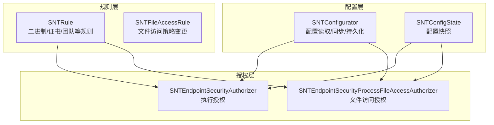
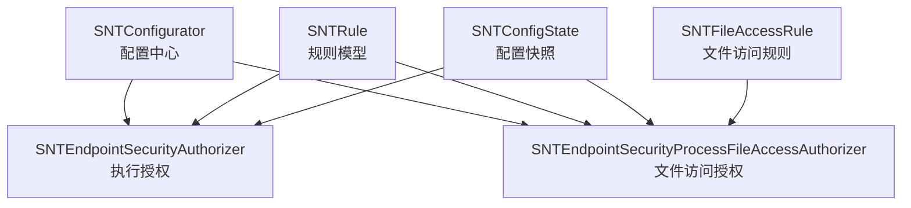
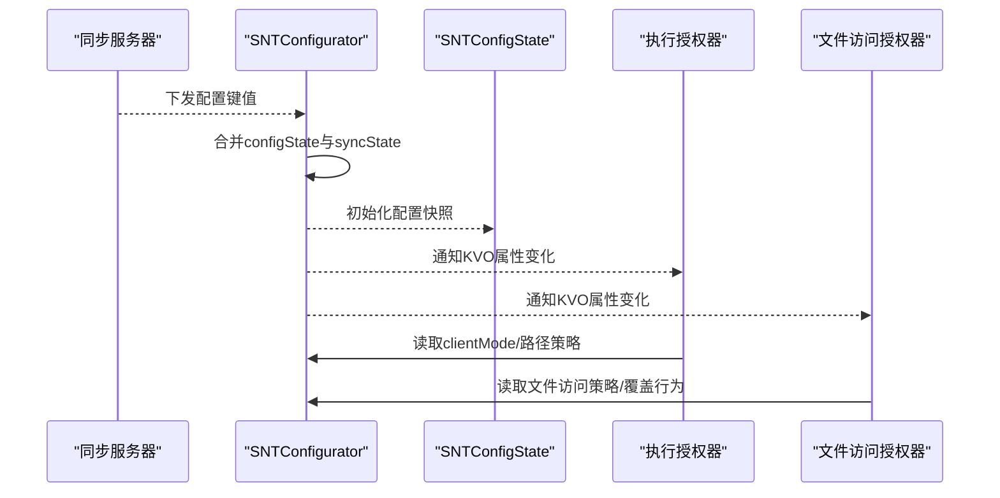
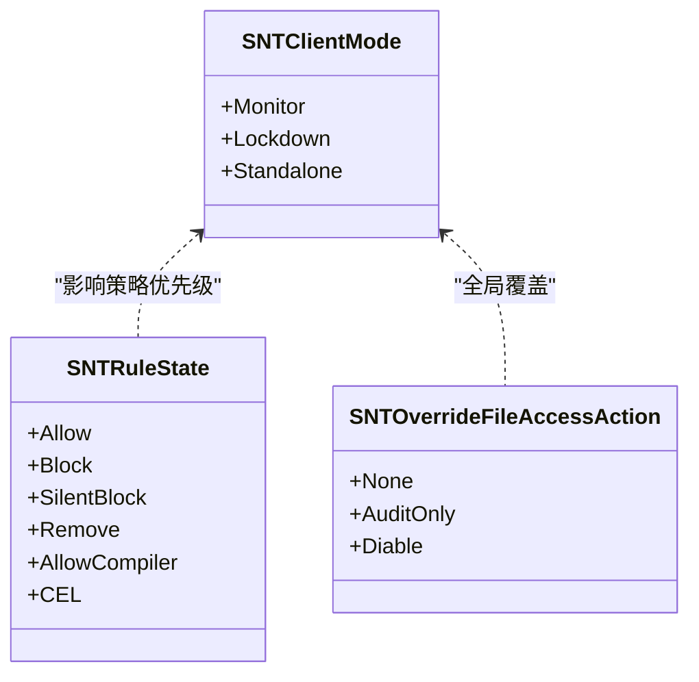
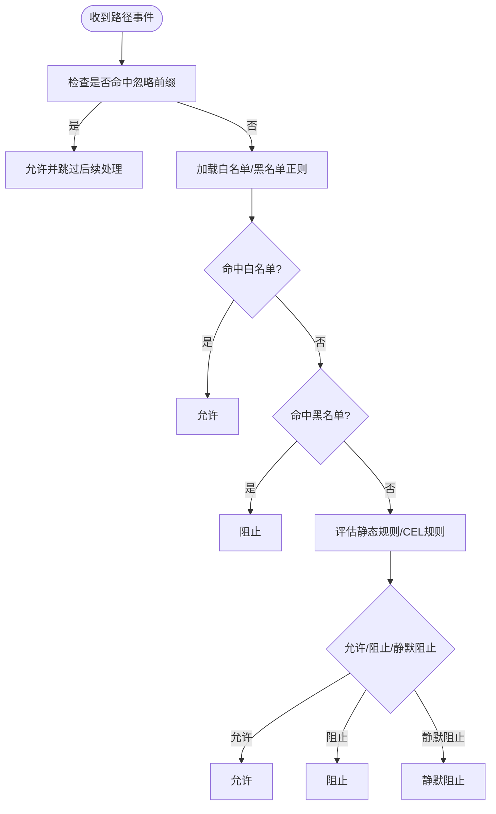
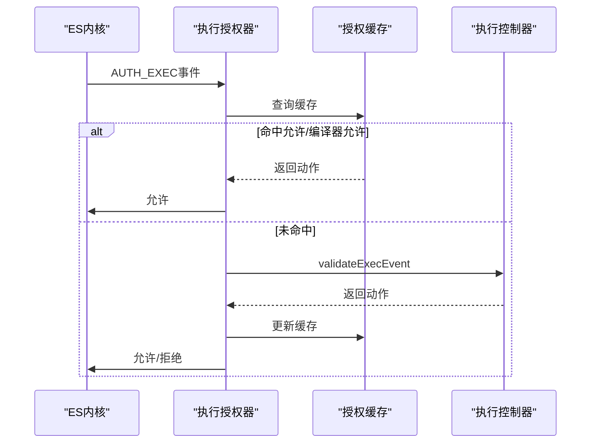
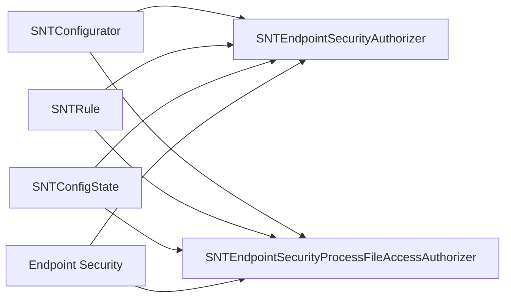

# 访问控制设计

<cite>
**本文引用的文件**
- [SNTConfigState.h](file://Source/common/SNTConfigState.h)
- [SNTConfigState.mm](file://Source/common/SNTConfigState.mm)
- [SNTConfigurator.h](file://Source/common/SNTConfigurator.h)
- [SNTConfigurator.mm](file://Source/common/SNTConfigurator.mm)
- [SNTCommonEnums.h](file://Source/common/SNTCommonEnums.h)
- [SNTRule.h](file://Source/common/SNTRule.h)
- [SNTFileAccessRule.h](file://Source/common/SNTFileAccessRule.h)
- [SNTFileAccessRule.mm](file://Source/common/SNTFileAccessRule.mm)
- [SNTEndpointSecurityAuthorizer.h](file://Source/santad/EventProviders/SNTEndpointSecurityAuthorizer.h)
- [SNTEndpointSecurityAuthorizer.mm](file://Source/santad/EventProviders/SNTEndpointSecurityAuthorizer.mm)
- [SNTEndpointSecurityProcessFileAccessAuthorizer.h](file://Source/santad/EventProviders/SNTEndpointSecurityProcessFileAccessAuthorizer.h)
- [SNTEndpointSecurityProcessFileAccessAuthorizer.mm](file://Source/santad/EventProviders/SNTEndpointSecurityProcessFileAccessAuthorizer.mm)
</cite>

## 目录
1. [简介](#简介)
2. [项目结构](#项目结构)
3. [核心组件](#核心组件)
4. [架构总览](#架构总览)
5. [组件详解](#组件详解)
6. [依赖关系分析](#依赖关系分析)
7. [性能考量](#性能考量)
8. [故障排查指南](#故障排查指南)
9. [结论](#结论)
10. [附录](#附录)

## 简介
本文件面向Santa的访问控制设计，系统化阐述基于配置的访问控制机制、权限分级与角色管理、配置状态管理、实时权限更新与策略实施、组件间权限边界、访问控制列表（ACL）与白名单/黑名单机制、动态权限调整与临时权限授予/撤销流程，并提供权限审计、合规性检查与安全策略验证方案。文档以代码为依据，结合图示帮助读者从高层到实现细节全面理解Santa在macOS上的访问控制体系。

## 项目结构
Santa的访问控制相关代码主要分布在以下模块：
- 配置与状态：SNTConfigurator负责集中式配置读取、同步与持久化；SNTConfigState用于快照当前配置状态。
- 规则模型：SNTRule定义二进制/证书/团队等规则类型与状态；SNTFileAccessRule定义文件访问策略变更的增删操作。
- 执行授权：SNTEndpointSecurityAuthorizer对接Endpoint Security框架，对执行事件进行授权决策。
- 文件访问授权：SNTEndpointSecurityProcessFileAccessAuthorizer对进程级文件访问事件进行策略匹配与授权。
- 枚举与常量：SNTCommonEnums定义动作、规则类型、客户端模式、事件状态等核心枚举。

**图表来源**
- [SNTConfigurator.h](file://Source/common/SNTConfigurator.h#L1-L120)
- [SNTConfigurator.mm](file://Source/common/SNTConfigurator.mm#L397-L453)
- [SNTConfigState.h](file://Source/common/SNTConfigState.h#L1-L32)
- [SNTConfigState.mm](file://Source/common/SNTConfigState.mm#L22-L53)
- [SNTRule.h](file://Source/common/SNTRule.h#L1-L129)
- [SNTFileAccessRule.h](file://Source/common/SNTFileAccessRule.h#L1-L33)
- [SNTEndpointSecurityAuthorizer.h](file://Source/santad/EventProviders/SNTEndpointSecurityAuthorizer.h#L1-L42)
- [SNTEndpointSecurityProcessFileAccessAuthorizer.h](file://Source/santad/EventProviders/SNTEndpointSecurityProcessFileAccessAuthorizer.h#L1-L40)

**章节来源**
- [SNTConfigurator.h](file://Source/common/SNTConfigurator.h#L1-L200)
- [SNTConfigurator.mm](file://Source/common/SNTConfigurator.mm#L397-L453)
- [SNTConfigState.h](file://Source/common/SNTConfigState.h#L1-L32)
- [SNTConfigState.mm](file://Source/common/SNTConfigState.mm#L22-L53)
- [SNTRule.h](file://Source/common/SNTRule.h#L1-L129)
- [SNTFileAccessRule.h](file://Source/common/SNTFileAccessRule.h#L1-L33)
- [SNTFileAccessRule.mm](file://Source/common/SNTFileAccessRule.mm#L1-L82)
- [SNTEndpointSecurityAuthorizer.h](file://Source/santad/EventProviders/SNTEndpointSecurityAuthorizer.h#L1-L42)
- [SNTEndpointSecurityProcessFileAccessAuthorizer.h](file://Source/santad/EventProviders/SNTEndpointSecurityProcessFileAccessAuthorizer.h#L1-L40)

## 核心组件
- 配置中心（SNTConfigurator）
  - 单例模式，统一读取/合并来自同步服务器与本地mobileconfig的配置键值。
  - 提供KVO属性，暴露客户端模式、路径白名单/黑名单正则、文件变更忽略前缀、USB/网络挂载策略、文件访问策略、临时监控模式等。
  - 维护同步状态与运行态状态文件，支持安全编码持久化。
- 配置快照（SNTConfigState）
  - 基于某一时刻的SNTConfigurator生成不可变快照，便于跨组件一致读取。
- 规则模型（SNTRule）
  - 定义规则标识、类型（二进制/签名ID/证书/团队ID等）、状态（允许/阻止/静默阻止/移除/编译器允许等），支持自定义消息与CEL表达式。
- 文件访问规则（SNTFileAccessRule）
  - 表达“新增/删除”某条文件访问策略的原子操作，支持安全归档。
- 授权器（SNTEndpointSecurityAuthorizer）
  - 订阅执行类ES事件，通过缓存与控制器组合完成授权决策，避免ES框架对拒绝结果的缓存，确保规则更新后能及时生效。
- 进程文件访问授权器（SNTEndpointSecurityProcessFileAccessAuthorizer）
  - 订阅文件访问类ES事件，按进程维度匹配策略树，支持即时响应与策略覆盖（如审计仅记录或禁用）。

**章节来源**
- [SNTConfigurator.h](file://Source/common/SNTConfigurator.h#L1-L200)
- [SNTConfigurator.mm](file://Source/common/SNTConfigurator.mm#L397-L453)
- [SNTConfigState.h](file://Source/common/SNTConfigState.h#L1-L32)
- [SNTConfigState.mm](file://Source/common/SNTConfigState.mm#L22-L53)
- [SNTRule.h](file://Source/common/SNTRule.h#L1-L129)
- [SNTFileAccessRule.h](file://Source/common/SNTFileAccessRule.h#L1-L33)
- [SNTFileAccessRule.mm](file://Source/common/SNTFileAccessRule.mm#L1-L82)
- [SNTEndpointSecurityAuthorizer.h](file://Source/santad/EventProviders/SNTEndpointSecurityAuthorizer.h#L1-L42)
- [SNTEndpointSecurityAuthorizer.mm](file://Source/santad/EventProviders/SNTEndpointSecurityAuthorizer.mm#L70-L120)
- [SNTEndpointSecurityProcessFileAccessAuthorizer.h](file://Source/santad/EventProviders/SNTEndpointSecurityProcessFileAccessAuthorizer.h#L1-L40)
- [SNTEndpointSecurityProcessFileAccessAuthorizer.mm](file://Source/santad/EventProviders/SNTEndpointSecurityProcessFileAccessAuthorizer.mm#L75-L120)

## 架构总览
Santa的访问控制采用“配置驱动 + 事件订阅 + 策略匹配 + 决策缓存”的分层架构：
- 配置层：集中管理客户端模式、路径白/黑名单、USB/网络挂载、文件访问策略、临时监控模式等。
- 策略层：规则模型与文件访问规则抽象，支持静态规则与动态下发。
- 授权层：两类授权器分别处理执行与文件访问事件，结合缓存与控制器实现快速且可更新的决策。
- 状态层：配置快照与状态文件保障一致性与持久化。

**图表来源**
- [SNTConfigurator.h](file://Source/common/SNTConfigurator.h#L1-L200)
- [SNTConfigurator.mm](file://Source/common/SNTConfigurator.mm#L397-L453)
- [SNTConfigState.h](file://Source/common/SNTConfigState.h#L1-L32)
- [SNTConfigState.mm](file://Source/common/SNTConfigState.mm#L22-L53)
- [SNTRule.h](file://Source/common/SNTRule.h#L1-L129)
- [SNTFileAccessRule.h](file://Source/common/SNTFileAccessRule.h#L1-L33)
- [SNTEndpointSecurityAuthorizer.h](file://Source/santad/EventProviders/SNTEndpointSecurityAuthorizer.h#L1-L42)
- [SNTEndpointSecurityProcessFileAccessAuthorizer.h](file://Source/santad/EventProviders/SNTEndpointSecurityProcessFileAccessAuthorizer.h#L1-L40)

## 组件详解

### 配置与状态管理
- 配置来源与优先级
  - 同步服务器下发键值与mobileconfig键值合并至configState与syncState，最终由SNTConfigurator暴露属性。
  - 客户端模式可通过临时监控模式覆盖，且该覆盖在KVO链路中被纳入clientMode计算。
- 配置持久化与访问控制
  - 同步状态与运行态状态文件位于固定路径，仅在满足特定权限条件时才允许访问，防止非特权进程篡改。
  - 支持安全编码/解码，保证序列化配置的完整性与一致性。
- 配置快照
  - SNTConfigState在初始化时复制关键配置字段，作为只读视图供其他组件使用，避免并发修改带来的不一致。

**图表来源**
- [SNTConfigurator.mm](file://Source/common/SNTConfigurator.mm#L233-L320)
- [SNTConfigurator.mm](file://Source/common/SNTConfigurator.mm#L397-L453)
- [SNTConfigState.mm](file://Source/common/SNTConfigState.mm#L22-L53)
- [SNTConfigurator.h](file://Source/common/SNTConfigurator.h#L300-L420)
- [SNTConfigurator.h](file://Source/common/SNTConfigurator.h#L665-L700)

**章节来源**
- [SNTConfigurator.mm](file://Source/common/SNTConfigurator.mm#L233-L320)
- [SNTConfigurator.mm](file://Source/common/SNTConfigurator.mm#L397-L453)
- [SNTConfigState.h](file://Source/common/SNTConfigState.h#L1-L32)
- [SNTConfigState.mm](file://Source/common/SNTConfigState.mm#L22-L53)
- [SNTConfigurator.h](file://Source/common/SNTConfigurator.h#L300-L420)
- [SNTConfigurator.h](file://Source/common/SNTConfigurator.h#L665-L700)

### 权限分级与角色管理
- 客户端模式（SNTClientMode）
  - 监控（Monitor）、锁定（Lockdown）、独立（Standalone）三种模式，决定默认阻断策略与用户体验。
  - 临时监控模式可在指定时间内强制进入监控模式，到期自动恢复原模式。
- 规则状态（SNTRuleState）
  - 允许、阻止、静默阻止、移除、编译器允许、本地二进制/签名ID允许、CEL规则等，体现不同粒度与场景的权限控制。
- 文件访问覆盖（SNTOverrideFileAccessAction）
  - 支持“仅审计”或“完全禁用”，用于全局性地调整文件访问策略的行为。

**图表来源**
- [SNTCommonEnums.h](file://Source/common/SNTCommonEnums.h#L84-L126)
- [SNTCommonEnums.h](file://Source/common/SNTCommonEnums.h#L175-L180)
- [SNTConfigurator.h](file://Source/common/SNTConfigurator.h#L740-L757)

**章节来源**
- [SNTCommonEnums.h](file://Source/common/SNTCommonEnums.h#L84-L126)
- [SNTCommonEnums.h](file://Source/common/SNTCommonEnums.h#L175-L180)
- [SNTConfigurator.h](file://Source/common/SNTConfigurator.h#L740-L757)

### 访问控制列表与白名单/黑名单
- 路径白名单/黑名单
  - 通过ICU风格正则表达式配置，支持同步下发与本地强制配置。
  - 文件变更忽略前缀（in-kernel过滤）可显著降低日志开销，且有节点数量限制与去重优化。
- 静态规则
  - 可作为回退规则集或独立规则源，不受同步异常影响，适合MDM分发。
- 规则优先级
  - 规则类型按预定义顺序评估，新规则类型需预留优先级空间，确保评估顺序稳定。

**图表来源**
- [SNTConfigurator.h](file://Source/common/SNTConfigurator.h#L78-L110)
- [SNTConfigurator.h](file://Source/common/SNTConfigurator.h#L116-L167)
- [SNTConfigurator.h](file://Source/common/SNTConfigurator.h#L764-L771)
- [SNTCommonEnums.h](file://Source/common/SNTCommonEnums.h#L50-L83)

**章节来源**
- [SNTConfigurator.h](file://Source/common/SNTConfigurator.h#L78-L110)
- [SNTConfigurator.h](file://Source/common/SNTConfigurator.h#L116-L167)
- [SNTConfigurator.h](file://Source/common/SNTConfigurator.h#L764-L771)
- [SNTCommonEnums.h](file://Source/common/SNTCommonEnums.h#L50-L83)

### 实时权限更新与策略实施
- 执行授权流程
  - 授权器订阅执行类ES事件，先查本地授权缓存；若未命中，委托执行控制器进行决策；根据动作设置ES响应与缓存策略。
  - 对于拒绝结果，明确不交由ES框架缓存，确保规则更新后立即生效。
- 文件访问授权流程
  - 按进程维度查找匹配策略，构建目标集合后交由策略处理器评估；支持即时响应与策略覆盖（审计仅记录/禁用）。
  - 配置变更时清理进程策略缓存并重新评估，保证策略一致性。

**图表来源**
- [SNTEndpointSecurityAuthorizer.mm](file://Source/santad/EventProviders/SNTEndpointSecurityAuthorizer.mm#L91-L159)
- [SNTEndpointSecurityAuthorizer.mm](file://Source/santad/EventProviders/SNTEndpointSecurityAuthorizer.mm#L191-L239)

**章节来源**
- [SNTEndpointSecurityAuthorizer.mm](file://Source/santad/EventProviders/SNTEndpointSecurityAuthorizer.mm#L91-L159)
- [SNTEndpointSecurityAuthorizer.mm](file://Source/santad/EventProviders/SNTEndpointSecurityAuthorizer.mm#L191-L239)
- [SNTEndpointSecurityProcessFileAccessAuthorizer.mm](file://Source/santad/EventProviders/SNTEndpointSecurityProcessFileAccessAuthorizer.mm#L75-L120)
- [SNTEndpointSecurityProcessFileAccessAuthorizer.mm](file://Source/santad/EventProviders/SNTEndpointSecurityProcessFileAccessAuthorizer.mm#L245-L273)

### 动态权限调整、临时权限与撤销
- 临时监控模式
  - 通过配置中心进入/离开临时监控模式，期间clientMode强制为监控模式，到期自动恢复。
- 动态文件访问策略覆盖
  - 支持全局“仅审计”或“禁用”文件访问策略，适用于紧急处置或审计阶段。
- 策略变更传播
  - 配置变更触发授权器清理进程策略缓存并重新评估，确保新策略立即生效。

**章节来源**
- [SNTConfigurator.h](file://Source/common/SNTConfigurator.h#L665-L700)
- [SNTConfigurator.h](file://Source/common/SNTConfigurator.h#L740-L757)
- [SNTEndpointSecurityProcessFileAccessAuthorizer.mm](file://Source/santad/EventProviders/SNTEndpointSecurityProcessFileAccessAuthorizer.mm#L245-L273)

### 权限继承与冲突解决
- 传递式白名单（Transitive Allowlist）
  - 当启用时，标记为“允许编译器”的规则可传递允许其产出的可执行文件；否则仅按普通允许规则处理。
- 规则优先级
  - 规则类型按预设顺序评估，新增类型需预留空间，避免SQLite行为变化导致优先级错乱。
- 冲突处理
  - 若同一对象同时命中白名单与黑名单，应以更严格的策略为准；CEL规则可按表达式动态决定，建议在策略设计时避免相互矛盾的条件。

**章节来源**
- [SNTConfigurator.h](file://Source/common/SNTConfigurator.h#L764-L771)
- [SNTCommonEnums.h](file://Source/common/SNTCommonEnums.h#L50-L83)

### 访问控制配置示例与最佳实践
- 基础配置要点
  - 客户端模式：生产环境建议Lockdown，开发测试可用Monitor或临时监控。
  - 路径白名单/黑名单：使用ICU正则，避免以通配符开头导致匹配范围过大。
  - 静态规则：关键工具链与系统组件可放入静态规则，确保不受同步异常影响。
- 文件访问策略
  - 使用进程级策略树限定作用域，减少误伤；必要时启用“仅审计”观察风险。
- 审计与合规
  - 启用事件日志与遥测导出，设置批次阈值与超时参数，定期校验上传完整性。

[本节为概念性说明，不直接分析具体文件，故无“章节来源”]

## 依赖关系分析
- 组件耦合
  - 授权器依赖配置中心提供的策略与模式；规则模型为策略的载体；配置快照提供稳定的只读视图。
- 外部依赖
  - Endpoint Security框架提供事件订阅与授权响应接口；KVO用于配置变更通知。
- 循环依赖
  - 代码组织上未见循环导入；授权器通过控制器与缓存间接协作，避免直接循环引用。

**图表来源**
- [SNTConfigurator.h](file://Source/common/SNTConfigurator.h#L1-L200)
- [SNTEndpointSecurityAuthorizer.h](file://Source/santad/EventProviders/SNTEndpointSecurityAuthorizer.h#L1-L42)
- [SNTEndpointSecurityProcessFileAccessAuthorizer.h](file://Source/santad/EventProviders/SNTEndpointSecurityProcessFileAccessAuthorizer.h#L1-L40)

**章节来源**
- [SNTConfigurator.h](file://Source/common/SNTConfigurator.h#L1-L200)
- [SNTEndpointSecurityAuthorizer.h](file://Source/santad/EventProviders/SNTEndpointSecurityAuthorizer.h#L1-L42)
- [SNTEndpointSecurityProcessFileAccessAuthorizer.h](file://Source/santad/EventProviders/SNTEndpointSecurityProcessFileAccessAuthorizer.h#L1-L40)

## 性能考量
- 缓存与命中率
  - 授权缓存显著降低重复决策成本；对编译器进程与待定授权不缓存，确保策略一致性。
- 内核过滤
  - 文件变更忽略前缀在内核侧生效，减少用户态处理与日志开销。
- 策略评估
  - 进程文件访问策略按目标集合批量评估，支持即时响应，避免长链路等待。
- 日志与导出
  - 事件日志与遥测导出支持批量阈值与超时配置，平衡数据完整性与系统负载。

[本节提供通用指导，不直接分析具体文件，故无“章节来源”]

## 故障排查指南
- 授权未生效
  - 检查是否命中ES框架拒绝缓存；确认规则更新后授权器已清理缓存并重新评估。
- 文件访问策略无效
  - 确认进程策略树是否正确匹配；检查覆盖行为（仅审计/禁用）是否影响了预期结果。
- 配置未加载
  - 核对访问授权（仅root/守护进程可读写状态文件）；确认KVO监听是否正常触发。
- 临时监控模式异常
  - 检查配置中心的临时监控状态保存与恢复逻辑；确认到期时间是否正确。

**章节来源**
- [SNTEndpointSecurityAuthorizer.mm](file://Source/santad/EventProviders/SNTEndpointSecurityAuthorizer.mm#L70-L120)
- [SNTEndpointSecurityProcessFileAccessAuthorizer.mm](file://Source/santad/EventProviders/SNTEndpointSecurityProcessFileAccessAuthorizer.mm#L245-L273)
- [SNTConfigurator.mm](file://Source/common/SNTConfigurator.mm#L233-L320)

## 结论
Santa的访问控制以配置为中心，通过KVO驱动的实时更新、内核级过滤与进程级策略匹配，实现了高可用、可审计、可扩展的访问控制体系。执行授权与文件访问授权分离，既保证了系统安全，又兼顾了可观测性与运维灵活性。建议在生产环境中采用Lockdown模式与静态规则兜底，配合临时监控与审计仅记录策略，实现安全与效率的平衡。

[本节为总结性内容，不直接分析具体文件，故无“章节来源”]

## 附录
- 关键配置键与用途概览
  - 客户端模式、路径白/黑名单正则、文件变更忽略前缀、USB/网络挂载策略、文件访问策略、临时监控模式、传递式白名单、事件日志与遥测导出等。
- 最佳实践清单
  - 明确策略优先级与冲突处理；合理使用静态规则；启用内核过滤；定期审计与合规检查；谨慎使用临时监控与覆盖行为。

[本节为概念性说明，不直接分析具体文件，故无“章节来源”]