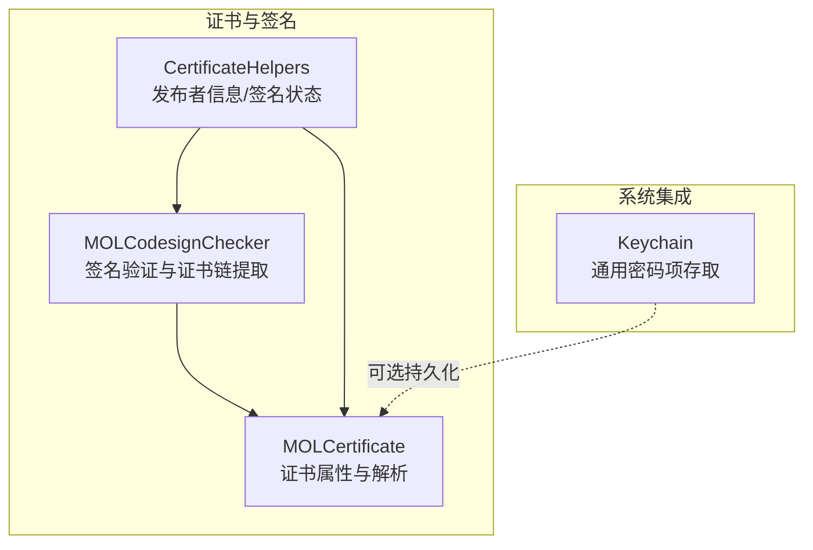
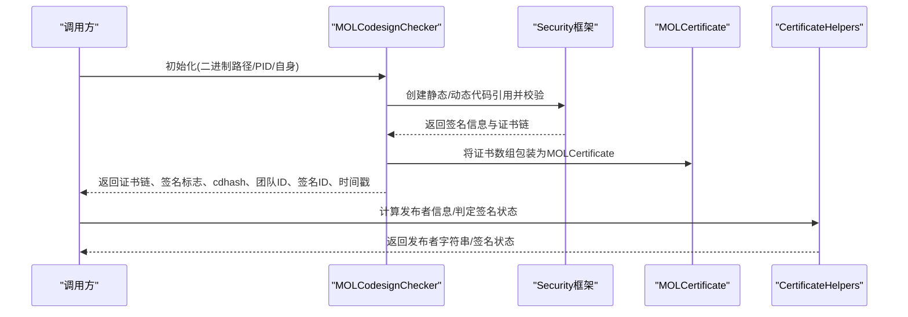
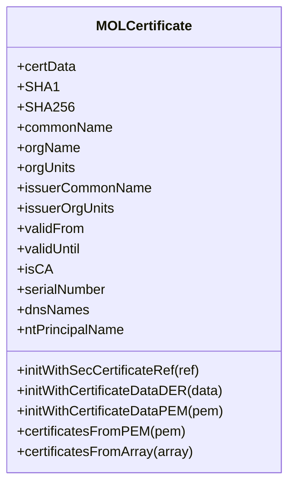
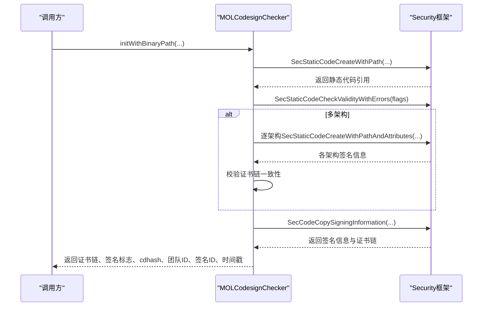
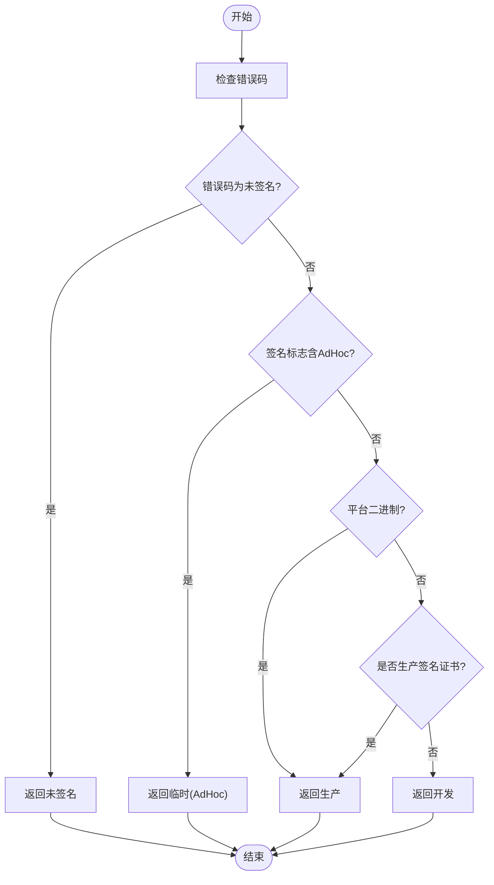
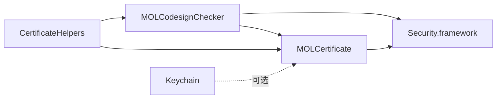

# 证书验证

<cite>
**本文引用的文件**
- [MOLCertificate.h](file://Source/common/MOLCertificate.h)
- [MOLCertificate.mm](file://Source/common/MOLCertificate.mm)
- [MOLCodesignChecker.h](file://Source/common/MOLCodesignChecker.h)
- [MOLCodesignChecker.mm](file://Source/common/MOLCodesignChecker.mm)
- [CertificateHelpers.h](file://Source/common/CertificateHelpers.h)
- [CertificateHelpers.mm](file://Source/common/CertificateHelpers.mm)
- [Keychain.h](file://Source/common/Keychain.h)
- [Keychain.mm](file://Source/common/Keychain.mm)
</cite>

## 目录
1. [引言](#引言)
2. [项目结构](#项目结构)
3. [核心组件](#核心组件)
4. [架构总览](#架构总览)
5. [详细组件分析](#详细组件分析)
6. [依赖关系分析](#依赖关系分析)
7. [性能考量](#性能考量)
8. [故障排查指南](#故障排查指南)
9. [结论](#结论)
10. [附录](#附录)

## 引言
本文件面向Santa的证书验证机制，系统性阐述代码签名证书验证流程、信任链建立与证书完整性检查；详解证书解析、公钥验证与签名算法支持；说明多级证书验证、中间证书处理与根证书信任管理；解释证书撤销检查、时间戳验证与证书链构建；并提供证书配置示例、自定义CA支持与证书更新策略，以及错误处理、验证失败诊断与证书管理最佳实践。

## 项目结构
围绕证书验证的关键模块主要位于 Source/common 目录，包括：
- 证书对象封装：MOLCertificate（解析X509字段、摘要、SAN等）
- 代码签名检查器：MOLCodesignChecker（调用Security框架进行签名验证、提取证书链、读取签名信息）
- 证书辅助工具：CertificateHelpers（从证书链提取发布者信息、判断生产/开发签名状态）
- 系统钥匙串封装：Keychain（通用密码项存储/查询，用于证书或密钥材料的持久化）

图表来源
- [MOLCertificate.h](file://Source/common/MOLCertificate.h#L1-L138)
- [MOLCertificate.mm](file://Source/common/MOLCertificate.mm#L1-L491)
- [MOLCodesignChecker.h](file://Source/common/MOLCodesignChecker.h#L1-L210)
- [MOLCodesignChecker.mm](file://Source/common/MOLCodesignChecker.mm#L1-L453)
- [CertificateHelpers.h](file://Source/common/CertificateHelpers.h#L1-L68)
- [CertificateHelpers.mm](file://Source/common/CertificateHelpers.mm#L1-L104)
- [Keychain.h](file://Source/common/Keychain.h#L1-L79)
- [Keychain.mm](file://Source/common/Keychain.mm#L1-L212)

章节来源
- [MOLCertificate.h](file://Source/common/MOLCertificate.h#L1-L138)
- [MOLCodesignChecker.h](file://Source/common/MOLCodesignChecker.h#L1-L210)
- [CertificateHelpers.h](file://Source/common/CertificateHelpers.h#L1-L68)
- [Keychain.h](file://Source/common/Keychain.h#L1-L79)

## 核心组件
- MOLCertificate：对SecCertificateRef进行封装，提供只读属性缓存、SHA-1/SHA-256指纹、主题/颁发者DN字段、SAN、有效期、是否CA、序列号、NT Principal Name、DNS名称等；支持从DER/PEM初始化，并可将证书数组转换为MOLCertificate列表。
- MOLCodesignChecker：基于Security框架的SecStaticCode/SecCode接口进行签名验证，提取证书链、签名标志、cdhash、团队ID、签名ID、平台二进制标识、权限、安全签名时间与开发者签名时间；支持从磁盘路径、进程PID、自身进程初始化；对多架构二进制执行一致性检查。
- CertificateHelpers：提供发布者字符串生成、证书链SecCertificateRef数组转换、生产签名证书判定、根据签名标志与错误推导签名状态（未签名/无效/临时/生产/开发）。
- Keychain：对系统钥匙串进行封装，提供服务名/账户名/描述校验、错误码到absl状态映射、通用密码项的创建、存储、删除、读取。

章节来源
- [MOLCertificate.mm](file://Source/common/MOLCertificate.mm#L1-L491)
- [MOLCodesignChecker.mm](file://Source/common/MOLCodesignChecker.mm#L1-L453)
- [CertificateHelpers.mm](file://Source/common/CertificateHelpers.mm#L1-L104)
- [Keychain.mm](file://Source/common/Keychain.mm#L1-L212)

## 架构总览
Santa的证书验证以“签名检查器”为核心，串联“证书对象”与“证书辅助工具”，并在需要时与“钥匙串”交互完成证书材料的持久化与检索。

图表来源
- [MOLCodesignChecker.mm](file://Source/common/MOLCodesignChecker.mm#L81-L133)
- [MOLCertificate.mm](file://Source/common/MOLCertificate.mm#L113-L123)
- [CertificateHelpers.mm](file://Source/common/CertificateHelpers.mm#L23-L39)

## 详细组件分析

### 组件A：MOLCertificate（证书对象）
职责与能力
- 提供只读属性缓存，避免重复查询底层SecCertificateRef属性
- 支持从DER/PEM初始化；PEM解析采用扫描BEGIN/END边界并Base64解码
- 暴露主题/颁发者DN字段、组织单位、序列号、有效期、是否CA、DNS SAN、NT Principal Name等
- 计算SHA-1/SHA-256指纹，便于快速比对与缓存键使用
- 实现NSSecureCoding，支持跨XPC传输（接收端不复用缓存）

实现要点
- 使用SecCertificateCreateWithData与证书序列号校验确保DER有效性
- 使用SecCertificateCopyValues获取X509字典，再按OID提取所需字段
- memoizedSelector模式缓存昂贵属性（如证书数据、DN、SAN、日期），首次访问计算并缓存

复杂度与性能
- 属性访问为O(1)，首次访问O(1)至O(n)取决于底层SecCertificateCopyValues实现
- SHA-1/SHA-256计算为O(n)（n为证书数据长度）

错误处理
- PEM解析失败返回空；DER初始化通过序列号存在性校验失败返回空
- X509字段提取异常时返回空值，保证健壮性

图表来源
- [MOLCertificate.h](file://Source/common/MOLCertificate.h#L1-L138)
- [MOLCertificate.mm](file://Source/common/MOLCertificate.mm#L35-L88)
- [MOLCertificate.mm](file://Source/common/MOLCertificate.mm#L90-L123)
- [MOLCertificate.mm](file://Source/common/MOLCertificate.mm#L300-L490)

章节来源
- [MOLCertificate.h](file://Source/common/MOLCertificate.h#L1-L138)
- [MOLCertificate.mm](file://Source/common/MOLCertificate.mm#L1-L491)

### 组件B：MOLCodesignChecker（签名验证与证书链提取）
职责与能力
- 基于Security框架的SecStaticCode/SecCode接口进行签名验证
- 提取证书链、签名标志、cdhash、团队ID、签名ID、平台二进制标识、权限、时间戳
- 支持从磁盘路径、文件描述符、进程PID、自身进程初始化
- 对多架构二进制执行签名一致性检查（所有切片签名必须一致）

验证流程与关键点
- 静态签名验证使用kSecCSDoNotValidateResources | kSecCSCheckNestedCode | kSecCSCheckAllArchitectures | kSecCSNoNetworkAccess，显著提升性能并避免网络访问
- 动态签名验证使用默认标志
- 多架构一致性：遍历各架构切片，提取签名信息，若证书链集合不一致则判定为签名无效
- 证书链提取：从签名信息字典中获取证书数组并转换为MOLCertificate列表

图表来源
- [MOLCodesignChecker.mm](file://Source/common/MOLCodesignChecker.mm#L151-L173)
- [MOLCodesignChecker.mm](file://Source/common/MOLCodesignChecker.mm#L81-L133)
- [MOLCodesignChecker.mm](file://Source/common/MOLCodesignChecker.mm#L345-L359)
- [MOLCodesignChecker.mm](file://Source/common/MOLCodesignChecker.mm#L361-L384)

章节来源
- [MOLCodesignChecker.h](file://Source/common/MOLCodesignChecker.h#L1-L210)
- [MOLCodesignChecker.mm](file://Source/common/MOLCodesignChecker.mm#L1-L453)

### 组件C：CertificateHelpers（发布者与签名状态）
职责与能力
- 发布者字符串：根据叶子证书的CN/OrgName/TeamID生成用户友好的发布者描述
- 证书链转换：将MOLCertificate数组转换为SecCertificateRef数组
- 生产签名证书判定：通过特定OID集合判断是否为生产签名证书
- 签名状态推断：结合错误码、签名标志、平台二进制与生产证书判定，输出未签名/无效/临时/生产/开发

图表来源
- [CertificateHelpers.mm](file://Source/common/CertificateHelpers.mm#L88-L104)

章节来源
- [CertificateHelpers.h](file://Source/common/CertificateHelpers.h#L1-L68)
- [CertificateHelpers.mm](file://Source/common/CertificateHelpers.mm#L1-L104)

### 组件D：Keychain（系统钥匙串）
职责与能力
- 校验服务名/账户名/描述长度合法性
- 错误码到absl状态映射，统一错误语义
- 提供通用密码项的创建、存储、删除、读取
- 通过SecItemAdd/SecItemDelete/SecItemCopyMatching与钥匙串交互

适用场景
- 存储证书材料、时间戳证书、或与证书验证相关的元数据
- 与证书链构建、信任锚管理配合使用（例如持久化自定义CA）

章节来源
- [Keychain.h](file://Source/common/Keychain.h#L1-L79)
- [Keychain.mm](file://Source/common/Keychain.mm#L1-L212)

## 依赖关系分析
- MOLCodesignChecker 依赖 Security.framework 的 SecStaticCode/SecCode 接口，负责签名验证与证书链提取
- MOLCertificate 依赖 Security.framework 的 SecCertificate 接口，负责证书解析与属性访问
- CertificateHelpers 依赖 MOLCertificate 与 MOLCodesignChecker，提供高层语义（发布者、签名状态）
- Keychain 作为可选依赖，提供通用密码项存取能力，可用于证书材料持久化

图表来源
- [MOLCodesignChecker.mm](file://Source/common/MOLCodesignChecker.mm#L1-L453)
- [MOLCertificate.mm](file://Source/common/MOLCertificate.mm#L1-L491)
- [CertificateHelpers.mm](file://Source/common/CertificateHelpers.mm#L1-L104)
- [Keychain.mm](file://Source/common/Keychain.mm#L1-L212)

章节来源
- [MOLCodesignChecker.mm](file://Source/common/MOLCodesignChecker.mm#L1-L453)
- [MOLCertificate.mm](file://Source/common/MOLCertificate.mm#L1-L491)
- [CertificateHelpers.mm](file://Source/common/CertificateHelpers.mm#L1-L104)
- [Keychain.mm](file://Source/common/Keychain.mm#L1-L212)

## 性能考量
- 验证标志优化：静态签名验证使用“不校验资源、仅检查嵌套代码、全架构、禁止网络访问”的组合，显著降低耗时且避免网络阻塞
- 缓存策略：MOLCertificate对昂贵属性采用memoizedSelector缓存，减少重复查询
- 多架构一致性：在静态签名路径下强制全架构一致性，避免部分切片签名不一致导致的后续失败重试
- I/O优化：提供基于文件描述符的初始化方法，减少重复打开文件的开销

章节来源
- [MOLCodesignChecker.mm](file://Source/common/MOLCodesignChecker.mm#L31-L63)
- [MOLCodesignChecker.mm](file://Source/common/MOLCodesignChecker.mm#L345-L359)
- [MOLCertificate.mm](file://Source/common/MOLCertificate.mm#L172-L199)

## 故障排查指南
常见问题与定位
- 未签名/签名无效
  - 未签名：错误码对应未签名状态，返回“未签名”
  - 签名无效：可能由证书链不一致、资源签名缺失、时间戳失效等引起
- 临时签名（AdHoc）
  - 若签名标志包含AdHoc，判定为临时签名，通常不可信任
- 平台二进制
  - 平台二进制直接视为生产签名
- 生产签名证书判定
  - 通过特定OID集合判断；非运行时安全检查，仅用于状态提示
- 时间戳与签名时间
  - 安全签名时间来自可信的时间戳权威机构；开发者签名时间可被篡改，不应过度信任
- 多架构签名不一致
  - 静态签名路径下若任一切片签名链不同，整体判定为无效

诊断建议
- 优先检查错误码与错误描述（SecurityOSStatusToAbslStatus映射）
- 核查证书链长度与顺序，确认根/中间证书可用
- 检查时间戳证书与当前系统时间，确认未过期
- 对多架构二进制，逐一核对各架构签名信息一致性

章节来源
- [CertificateHelpers.mm](file://Source/common/CertificateHelpers.mm#L88-L104)
- [MOLCodesignChecker.mm](file://Source/common/MOLCodesignChecker.mm#L311-L327)
- [MOLCodesignChecker.mm](file://Source/common/MOLCodesignChecker.mm#L345-L359)
- [Keychain.mm](file://Source/common/Keychain.mm#L52-L59)

## 结论
Santa的证书验证以MOLCodesignChecker为核心，结合MOLCertificate与CertificateHelpers，形成从签名验证、证书链提取到发布者与状态推断的完整闭环。通过合理的验证标志、缓存与多架构一致性检查，既保证了性能也兼顾了安全性。配合Keychain可实现证书材料的持久化管理，满足企业自定义CA与证书更新策略需求。

## 附录

### 证书验证流程与信任链建立
- 静态签名验证：使用SecStaticCodeCreateWithPath创建静态代码引用，应用优化标志进行验证
- 证书链提取：从签名信息字典中获取证书数组，转换为MOLCertificate列表
- 信任链构建：将证书链按颁发者/主题匹配，确认根证书受信（可结合Keychain中的自定义CA）
- 时间戳验证：优先使用安全签名时间；若无时间戳或过期，则按规则降级处理
- 撤销检查：验证标志中禁用网络访问，无法在线吊销检查；可通过离线CRL/OCSP缓存或定期同步策略补充

章节来源
- [MOLCodesignChecker.mm](file://Source/common/MOLCodesignChecker.mm#L151-L173)
- [MOLCodesignChecker.mm](file://Source/common/MOLCodesignChecker.mm#L119-L126)
- [CertificateHelpers.mm](file://Source/common/CertificateHelpers.mm#L23-L39)

### 公钥验证与签名算法支持
- 公钥验证：由Security框架在签名验证过程中自动完成，无需显式公钥提取
- 签名算法：由Security框架根据证书公钥类型与签名内容自动选择算法并验证

章节来源
- [MOLCodesignChecker.mm](file://Source/common/MOLCodesignChecker.mm#L81-L133)

### 多级证书验证与中间证书处理
- 多级验证：证书链按顺序验证，每级由上一级颁发者签名
- 中间证书：可从签名信息中获取；若缺失，需通过Keychain或系统信任设置补充
- 根证书信任：通过系统信任设置或自定义CA导入实现

章节来源
- [MOLCodesignChecker.mm](file://Source/common/MOLCodesignChecker.mm#L119-L126)
- [Keychain.mm](file://Source/common/Keychain.mm#L138-L169)

### 证书完整性检查
- 证书数据完整性：通过SHA-1/SHA-256指纹进行快速比对
- 签名完整性：通过SecStaticCodeCheckValidityWithErrors进行验证
- 资源完整性：默认跳过资源校验以提升性能，但可按需调整标志

章节来源
- [MOLCertificate.mm](file://Source/common/MOLCertificate.mm#L300-L343)
- [MOLCodesignChecker.mm](file://Source/common/MOLCodesignChecker.mm#L31-L63)

### 证书配置示例与自定义CA支持
- 自定义CA：通过Keychain将自定义根/中间证书以通用密码项形式存储，或导入系统钥匙串
- 配置策略：在信任设置中启用自定义CA；对多架构二进制确保各切片签名一致
- 更新策略：定期同步时间戳证书与中间证书；对过期证书及时替换

章节来源
- [Keychain.mm](file://Source/common/Keychain.mm#L138-L169)
- [MOLCodesignChecker.mm](file://Source/common/MOLCodesignChecker.mm#L31-L63)

### 证书错误处理与最佳实践
- 错误处理：使用错误域与错误码映射，区分未签名、无效、临时等状态
- 最佳实践：
  - 优先使用生产签名证书
  - 对多架构二进制执行一致性检查
  - 严格校验时间戳与有效期
  - 使用Keychain进行证书材料持久化与版本管理
  - 在受限网络环境下谨慎处理在线吊销检查

章节来源
- [MOLCodesignChecker.mm](file://Source/common/MOLCodesignChecker.mm#L331-L343)
- [CertificateHelpers.mm](file://Source/common/CertificateHelpers.mm#L88-L104)
- [Keychain.mm](file://Source/common/Keychain.mm#L52-L59)