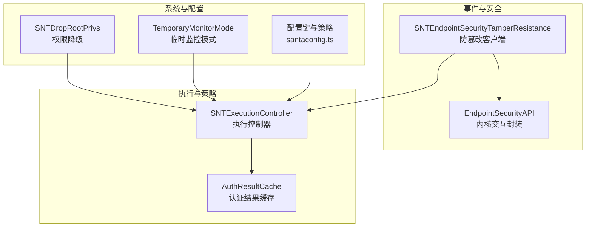
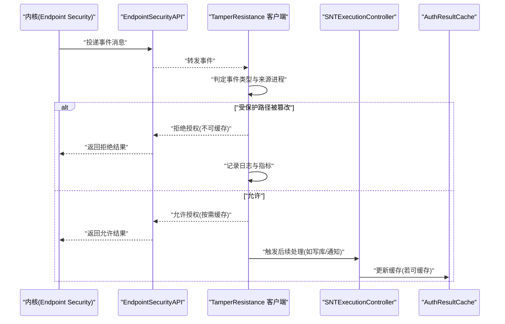
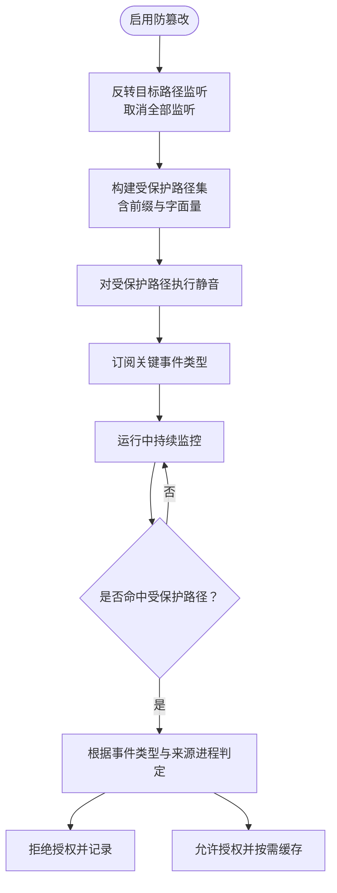
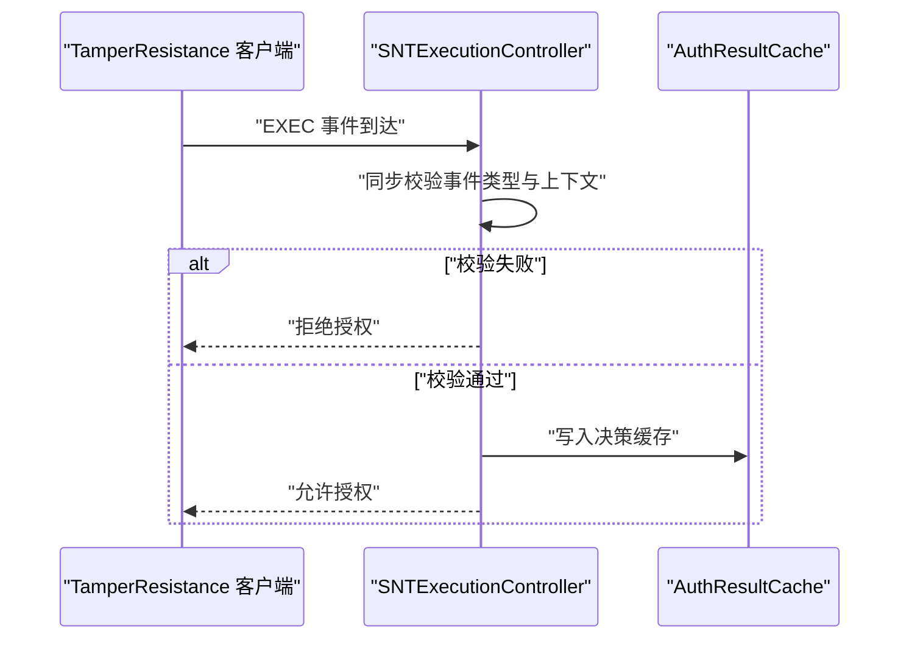
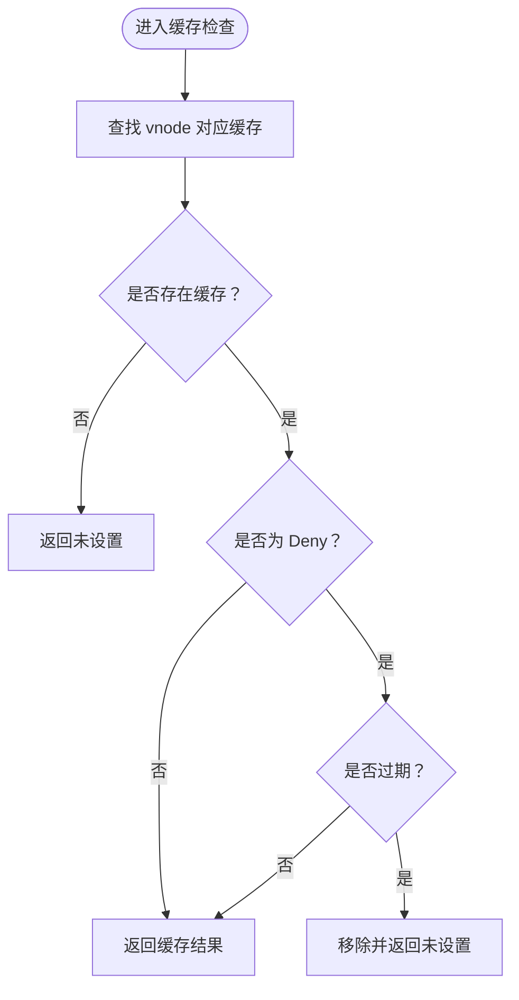
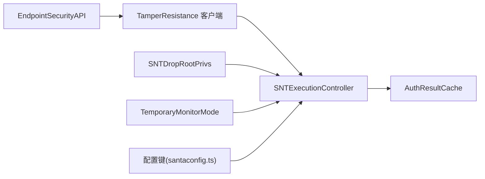

# 防篡改机制

<cite>
**本文引用的文件**
- [SNTEndpointSecurityTamperResistance.h](file://Source/santad/EventProviders/SNTEndpointSecurityTamperResistance.h)
- [SNTEndpointSecurityTamperResistance.mm](file://Source/santad/EventProviders/SNTEndpointSecurityTamperResistance.mm)
- [EndpointSecurityAPI.mm](file://Source/santad/EventProviders/EndpointSecurity/EndpointSecurityAPI.mm)
- [SNTDropRootPrivs.mm](file://Source/common/SNTDropRootPrivs.mm)
- [SNTExecutionController.h](file://Source/santad/SNTExecutionController.h)
- [SNTExecutionController.mm](file://Source/santad/SNTExecutionController.mm)
- [SNTExecutionControllerTest.mm](file://Source/santad/SNTExecutionControllerTest.mm)
- [AuthResultCache.mm](file://Source/santad/EventProviders/AuthResultCache.mm)
- [AuthResultCacheTest.mm](file://Source/santad/EventProviders/AuthResultCacheTest.mm)
- [SantadDeps.mm](file://Source/santad/SantadDeps.mm)
- [ES_Mute_Flowcharts.md](file://ES_Mute_Flowcharts.md)
- [EndpointSecurity_Research_Report.md](file://docs/EndpointSecurity_Research_Report.md)
- [ES_Mute_Mechanism_Report.md](file://ES_Mute_Mechanism_Report.md)
- [SNTEndpointSecurityTamperResistanceTest.mm](file://Source/santad/EventProviders/SNTEndpointSecurityTamperResistanceTest.mm)
- [TemporaryMonitorMode.mm](file://Source/santad/TemporaryMonitorMode.mm)
- [TemporaryMonitorModeTest.mm](file://Source/santad/TemporaryMonitorModeTest.mm)
- [santaconfig.ts](file://docs/src/lib/santaconfig.ts)
</cite>

## 目录
1. [简介](#简介)
2. [项目结构](#项目结构)
3. [核心组件](#核心组件)
4. [架构总览](#架构总览)
5. [详细组件分析](#详细组件分析)
6. [依赖关系分析](#依赖关系分析)
7. [性能考量](#性能考量)
8. [故障排查指南](#故障排查指南)
9. [结论](#结论)
10. [附录](#附录)

## 简介
本技术文档聚焦 Santa 的“防篡改机制”，系统性阐述其完整性保护、修改检测与异常行为识别能力。重点覆盖以下方面：
- 文件完整性校验与受保护路径集：通过 Endpoint Security 的“反向静音”（invert muting）与目标路径监听，对关键文件与组件进行严格监控。
- 进程完整性监控：阻断针对 Santa 自身的信号、挂起/恢复等敏感操作；限制 launchctl 的危险子命令与加载旧版遗留组件。
- 系统扩展保护：对 System Extensions 目录与 launchctl 可执行路径实施保护，防止恶意卸载或替换。
- 权限降级与安全边界：在启动阶段主动降权，降低被攻击面；维持最小权限运行。
- 异常活动告警与自动恢复：通过日志记录、指标统计与临时监控模式，实现异常检测与可控恢复。
- 配置示例、阈值与响应策略：结合现有配置键与测试用例，给出可落地的部署建议。

## 项目结构
Santa 的防篡改能力主要由以下模块协同实现：
- 事件提供与处理层：基于 Endpoint Security 的客户端与处理器，负责订阅与响应特定事件类型。
- 执行控制层：统一的执行控制器，协调授权决策、缓存与后续动作。
- 缓存与持久化：认证结果缓存与数据库事件表，支撑快速决策与审计。
- 安全基础设施：权限降级、系统扩展保护、临时监控模式等。

图表来源
- [SNTEndpointSecurityTamperResistance.mm](file://Source/santad/EventProviders/SNTEndpointSecurityTamperResistance.mm#L267-L296)
- [EndpointSecurityAPI.mm](file://Source/santad/EventProviders/EndpointSecurity/EndpointSecurityAPI.mm#L112-L148)
- [SNTExecutionController.h](file://Source/santad/SNTExecutionController.h#L50-L71)
- [SNTExecutionController.mm](file://Source/santad/SNTExecutionController.mm#L183-L204)
- [AuthResultCache.mm](file://Source/santad/EventProviders/AuthResultCache.mm#L106-L180)
- [SNTDropRootPrivs.mm](file://Source/common/SNTDropRootPrivs.mm#L1-L38)
- [TemporaryMonitorMode.mm](file://Source/santad/TemporaryMonitorMode.mm#L1-L90)
- [santaconfig.ts](file://docs/src/lib/santaconfig.ts#L592-L635)

章节来源
- [SNTEndpointSecurityTamperResistance.mm](file://Source/santad/EventProviders/SNTEndpointSecurityTamperResistance.mm#L267-L296)
- [EndpointSecurityAPI.mm](file://Source/santad/EventProviders/EndpointSecurity/EndpointSecurityAPI.mm#L112-L148)
- [SNTExecutionController.h](file://Source/santad/SNTExecutionController.h#L50-L71)
- [SNTExecutionController.mm](file://Source/santad/SNTExecutionController.mm#L183-L204)
- [AuthResultCache.mm](file://Source/santad/EventProviders/AuthResultCache.mm#L106-L180)
- [SNTDropRootPrivs.mm](file://Source/common/SNTDropRootPrivs.mm#L1-L38)
- [TemporaryMonitorMode.mm](file://Source/santad/TemporaryMonitorMode.mm#L1-L90)
- [santaconfig.ts](file://docs/src/lib/santaconfig.ts#L592-L635)

## 核心组件
- 防篡改客户端（SNTEndpointSecurityTamperResistance）
  - 通过“目标路径监听反转”与“静音”策略，仅对受保护路径产生事件，从而高效捕获篡改行为。
  - 对 UNLINK/RENAME/OPEN/SIGNAL/PROC_SUSPEND_RESUME/EXEC 等事件进行细粒度拦截与判定。
  - 内置受保护路径集合，涵盖规则库、事件库、应用与 LaunchDaemons/LaunchAgents 等关键位置，并扩展至 SystemExtensions 与 launchctl。
- 执行控制器（SNTExecutionController）
  - 负责二进制执行请求的决策、响应与后续动作（如写入事件库、通知 GUI 等）。
  - 在执行前进行同步校验，必要时直接拒绝并记录。
- 认证结果缓存（AuthResultCache）
  - 基于 vnode 的缓存结构，支持 Deny 结果的过期清理，避免误判长期生效。
  - 提供根/非根设备号区分，确保跨卷一致性。
- 权限降级（SNTDropRootPrivs）
  - 启动即降权，降低被提权或被攻击的风险。
- 临时监控模式（TemporaryMonitorMode）
  - 在特定条件下进入监控模式并在到期或条件变化时自动撤销，用于异常场景下的可控恢复。

章节来源
- [SNTEndpointSecurityTamperResistance.h](file://Source/santad/EventProviders/SNTEndpointSecurityTamperResistance.h#L1-L34)
- [SNTEndpointSecurityTamperResistance.mm](file://Source/santad/EventProviders/SNTEndpointSecurityTamperResistance.mm#L44-L55)
- [SNTExecutionController.h](file://Source/santad/SNTExecutionController.h#L50-L71)
- [AuthResultCache.mm](file://Source/santad/EventProviders/AuthResultCache.mm#L106-L180)
- [SNTDropRootPrivs.mm](file://Source/common/SNTDropRootPrivs.mm#L1-L38)
- [TemporaryMonitorMode.mm](file://Source/santad/TemporaryMonitorMode.mm#L1-L90)

## 架构总览
下图展示防篡改机制在系统中的整体交互：事件从内核经 Endpoint Security 到客户端，再由执行控制器与缓存共同完成决策与响应。

图表来源
- [EndpointSecurityAPI.mm](file://Source/santad/EventProviders/EndpointSecurity/EndpointSecurityAPI.mm#L112-L148)
- [SNTEndpointSecurityTamperResistance.mm](file://Source/santad/EventProviders/SNTEndpointSecurityTamperResistance.mm#L149-L265)
- [SNTExecutionController.mm](file://Source/santad/SNTExecutionController.mm#L183-L204)
- [AuthResultCache.mm](file://Source/santad/EventProviders/AuthResultCache.mm#L106-L180)

## 详细组件分析

### 组件A：防篡改客户端（SNTEndpointSecurityTamperResistance）
- 受保护路径集合
  - 规则库、事件库、状态与统计文件，以及 Santa 应用与 Launch 项目录。
  - 扩展保护：SystemExtensions 目录与 launchctl 可执行路径。
- 事件处理逻辑
  - UNLINK/RENAME：阻止删除/重命名受保护路径。
  - OPEN：阻止对受保护路径以写方式打开；对字面量受保护路径以读方式打开也阻止。
  - SIGNAL：阻止除 launchd 外对自身发送信号。
  - PROC_SUSPEND_RESUME：根据配置阻止对自身挂起/恢复。
  - EXEC：对 launchctl 的危险子命令与加载旧版遗留组件进行拦截。
- 启用流程与静音反转
  - 先取消所有目标路径监听，再反转静音语义，最后对受保护路径进行静音，确保只接收目标事件。
  - 订阅事件类型包括 AUTH_SIGNAL/AUTH_EXEC/AUTH_UNLINK/AUTH_RENAME/AUTH_OPEN/AUTH_PROC_SUSPEND_RESUME。

图表来源
- [SNTEndpointSecurityTamperResistance.mm](file://Source/santad/EventProviders/SNTEndpointSecurityTamperResistance.mm#L267-L296)
- [ES_Mute_Flowcharts.md](file://ES_Mute_Flowcharts.md#L290-L353)
- [EndpointSecurity_Research_Report.md](file://docs/EndpointSecurity_Research_Report.md#L890-L912)

章节来源
- [SNTEndpointSecurityTamperResistance.mm](file://Source/santad/EventProviders/SNTEndpointSecurityTamperResistance.mm#L44-L55)
- [SNTEndpointSecurityTamperResistance.mm](file://Source/santad/EventProviders/SNTEndpointSecurityTamperResistance.mm#L149-L265)
- [SNTEndpointSecurityTamperResistance.mm](file://Source/santad/EventProviders/SNTEndpointSecurityTamperResistance.mm#L267-L296)
- [ES_Mute_Flowcharts.md](file://ES_Mute_Flowcharts.md#L290-L353)
- [EndpointSecurity_Research_Report.md](file://docs/EndpointSecurity_Research_Report.md#L890-L912)

### 组件B：执行控制器（SNTExecutionController）
- 职责
  - 对执行事件进行同步校验，必要时直接拒绝。
  - 将决策写入缓存，驱动后续动作（如事件入库、通知 GUI、同步队列等）。
- 关键点
  - 在处理 EXEC 事件前进行类型校验，避免非 EXEC 事件进入。
  - 与策略处理器协作，尽快将决策回写内核。

图表来源
- [SNTExecutionController.h](file://Source/santad/SNTExecutionController.h#L50-L71)
- [SNTExecutionController.mm](file://Source/santad/SNTExecutionController.mm#L183-L204)

章节来源
- [SNTExecutionController.h](file://Source/santad/SNTExecutionController.h#L50-L71)
- [SNTExecutionController.mm](file://Source/santad/SNTExecutionController.mm#L183-L204)

### 组件C：认证结果缓存（AuthResultCache）
- 数据结构与策略
  - 基于 vnode 的缓存，区分根/非根设备号，支持 Deny 结果的过期清理。
  - 对 Hold/Allow/Deny 等状态转换进行严格约束，避免错误状态传播。
- 性能与可靠性
  - 通过过期时间控制 Deny 缓存生命周期，减少重复日志与抖动。
  - 测试覆盖了状态转换与过期行为，保证缓存一致性。

图表来源
- [AuthResultCache.mm](file://Source/santad/EventProviders/AuthResultCache.mm#L148-L171)
- [AuthResultCacheTest.mm](file://Source/santad/EventProviders/AuthResultCacheTest.mm#L226-L277)

章节来源
- [AuthResultCache.mm](file://Source/santad/EventProviders/AuthResultCache.mm#L106-L180)
- [AuthResultCacheTest.mm](file://Source/santad/EventProviders/AuthResultCacheTest.mm#L226-L277)

### 组件D：权限降级与安全边界（SNTDropRootPrivs）
- 启动即降权，确保进程以最小权限运行，降低被提权或被利用的风险。
- 通过 setuid/setgid 与 setgroups 系列调用，将进程 UID/GID 切换到非特权用户。

章节来源
- [SNTDropRootPrivs.mm](file://Source/common/SNTDropRootPrivs.mm#L1-L38)

### 组件E：系统扩展保护与 launchctl 限制
- 对 SystemExtensions 目录与 launchctl 可执行路径进行保护，防止恶意卸载或替换。
- 对 launchctl 的危险子命令与加载旧版遗留组件进行拦截，避免历史漏洞被利用。

章节来源
- [SNTEndpointSecurityTamperResistance.mm](file://Source/santad/EventProviders/SNTEndpointSecurityTamperResistance.mm#L267-L296)
- [SNTEndpointSecurityTamperResistance.mm](file://Source/santad/EventProviders/SNTEndpointSecurityTamperResistance.mm#L81-L125)

### 组件F：异常活动告警与自动恢复（TemporaryMonitorMode）
- 在特定条件下进入临时监控模式，记录进入/剩余时间等信息。
- 当配置变更（如同步服务器地址变化）或剩余时间不足时，自动撤销会话并发出审计事件。
- 与配置键联动，确保在重启或配置更新后仍能正确恢复状态。

章节来源
- [TemporaryMonitorMode.mm](file://Source/santad/TemporaryMonitorMode.mm#L1-L90)
- [TemporaryMonitorModeTest.mm](file://Source/santad/TemporaryMonitorModeTest.mm#L65-L94)

## 依赖关系分析
- 防篡改客户端依赖 EndpointSecurityAPI 进行授权响应与参数解析。
- 执行控制器依赖策略处理器与缓存，负责最终决策与后续动作。
- 启动依赖权限降级模块，确保最小权限运行。
- 临时监控模式与配置键存在强耦合，保障状态一致性与可恢复性。

图表来源
- [EndpointSecurityAPI.mm](file://Source/santad/EventProviders/EndpointSecurity/EndpointSecurityAPI.mm#L112-L148)
- [SNTEndpointSecurityTamperResistance.mm](file://Source/santad/EventProviders/SNTEndpointSecurityTamperResistance.mm#L149-L265)
- [SNTExecutionController.mm](file://Source/santad/SNTExecutionController.mm#L183-L204)
- [AuthResultCache.mm](file://Source/santad/EventProviders/AuthResultCache.mm#L106-L180)
- [SNTDropRootPrivs.mm](file://Source/common/SNTDropRootPrivs.mm#L1-L38)
- [TemporaryMonitorMode.mm](file://Source/santad/TemporaryMonitorMode.mm#L1-L90)
- [santaconfig.ts](file://docs/src/lib/santaconfig.ts#L592-L635)

章节来源
- [SantadDeps.mm](file://Source/santad/SantadDeps.mm#L110-L136)
- [EndpointSecurityAPI.mm](file://Source/santad/EventProviders/EndpointSecurity/EndpointSecurityAPI.mm#L112-L148)
- [SNTExecutionController.mm](file://Source/santad/SNTExecutionController.mm#L183-L204)
- [AuthResultCache.mm](file://Source/santad/EventProviders/AuthResultCache.mm#L106-L180)
- [SNTDropRootPrivs.mm](file://Source/common/SNTDropRootPrivs.mm#L1-L38)
- [TemporaryMonitorMode.mm](file://Source/santad/TemporaryMonitorMode.mm#L1-L90)
- [santaconfig.ts](file://docs/src/lib/santaconfig.ts#L592-L635)

## 性能考量
- 事件过滤与静音反转：通过“反转静音”与目标路径监听，大幅降低无关事件开销，仅对受保护路径产生事件，提高检测效率。
- 缓存策略：Deny 结果带过期时间，避免长期缓存导致的误判与重复日志；Hold/Allow 状态转换严格约束，减少无效重试。
- 日志与指标：对被拦截事件进行计数与记录，便于异常趋势分析与阈值设定。

## 故障排查指南
- 验证受保护路径匹配
  - 使用单元测试中的路径匹配断言，确认字面量与前缀匹配逻辑符合预期。
- 检查事件订阅与处理
  - 确认启用流程中订阅的事件类型完整，避免遗漏关键篡改事件。
- 授权响应与缓存
  - 检查 EndpointSecurityAPI 的响应接口是否成功；核对缓存过期与状态转换测试用例，确保缓存一致性。
- 临时监控模式
  - 关注配置变更触发的撤销逻辑与剩余时间计算，确保在重启或配置更新后能正确恢复。

章节来源
- [SNTEndpointSecurityTamperResistanceTest.mm](file://Source/santad/EventProviders/SNTEndpointSecurityTamperResistanceTest.mm#L344-L357)
- [EndpointSecurityAPI.mm](file://Source/santad/EventProviders/EndpointSecurity/EndpointSecurityAPI.mm#L112-L148)
- [AuthResultCacheTest.mm](file://Source/santad/EventProviders/AuthResultCacheTest.mm#L226-L277)
- [TemporaryMonitorModeTest.mm](file://Source/santad/TemporaryMonitorModeTest.mm#L65-L94)

## 结论
Santa 的防篡改机制通过“目标路径监听反转 + 受保护路径集 + 事件细粒度拦截 + 权限降级 + 临时监控模式”的组合拳，实现了对关键文件与系统扩展的完整性保护、篡改检测与异常响应。配合认证结果缓存与严格的事件处理流程，既能保证低开销的实时检测，又能提供可靠的审计与恢复能力。

## 附录

### 防篡改配置示例与阈值建议
- 受保护路径清单（示例要点）
  - 规则库与事件库：/private/var/db/santa/rules.db、/private/var/db/santa/events.db
  - 状态与统计：/private/var/db/santa/sync-state.plist、/private/var/db/santa/state.plist、/private/var/db/santa/stats-state.plist
  - 应用与 Launch 项：/Applications/Santa.app、/Library/LaunchAgents/com.northpolesec.santa.*、/Library/LaunchDaemons/com.northpolesec.santa.*
  - 系统扩展与工具：/Library/SystemExtensions、/bin/launchctl
- 事件订阅与处理
  - 订阅 AUTH_SIGNAL、AUTH_EXEC、AUTH_UNLINK、AUTH_RENAME、AUTH_OPEN、AUTH_PROC_SUSPEND_RESUME。
  - 对 DENY 事件不缓存，确保每次篡改尝试均被记录与告警。
- 权限降级
  - 启动即降权，避免特权滥用。
- 临时监控模式
  - 在异常场景下启用，到期或配置变更时自动撤销，保障可控恢复。

章节来源
- [SNTEndpointSecurityTamperResistance.mm](file://Source/santad/EventProviders/SNTEndpointSecurityTamperResistance.mm#L44-L55)
- [SNTEndpointSecurityTamperResistance.mm](file://Source/santad/EventProviders/SNTEndpointSecurityTamperResistance.mm#L267-L296)
- [SNTDropRootPrivs.mm](file://Source/common/SNTDropRootPrivs.mm#L1-L38)
- [TemporaryMonitorMode.mm](file://Source/santad/TemporaryMonitorMode.mm#L1-L90)

### 检测阈值与响应策略
- 阈值建议（示例）
  - 单路径连续 DENY 次数阈值：用于触发更高优先级告警或临时监控模式。
  - 事件速率阈值：全局日志速率上限，避免噪声淹没真实威胁。
- 响应策略（示例）
  - 立即记录并上报；对可疑进程执行隔离或阻断；在满足条件时进入临时监控模式；必要时触发自动恢复流程。

章节来源
- [santaconfig.ts](file://docs/src/lib/santaconfig.ts#L592-L635)

### 篡改事件处理、取证分析与安全加固
- 事件处理
  - 对 UNLINK/RENAME/OPEN/SIGNAL/PROC_SUSPEND_RESUME/EXEC 等事件进行拒绝与记录，保留审计证据。
- 取证分析
  - 事件库与序列化日志可用于回溯篡改路径、来源进程与时间线。
- 安全加固
  - 启用权限降级；限制 launchctl 危险子命令；定期迁移与清理遗留组件；启用临时监控模式应对异常。

章节来源
- [SNTEndpointSecurityTamperResistance.mm](file://Source/santad/EventProviders/SNTEndpointSecurityTamperResistance.mm#L149-L265)
- [SNTEndpointSecurityTamperResistanceTest.mm](file://Source/santad/EventProviders/SNTEndpointSecurityTamperResistanceTest.mm#L250-L357)