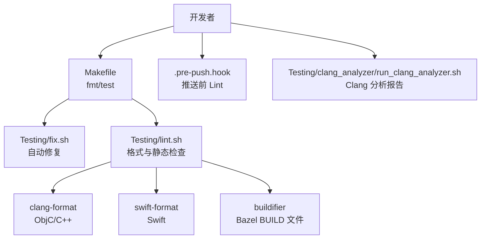
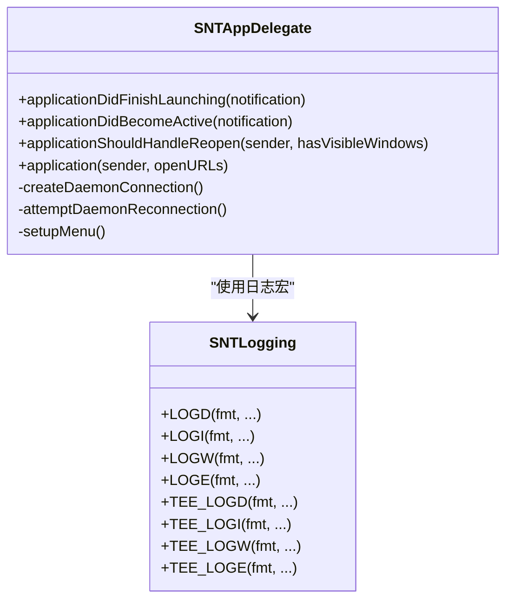
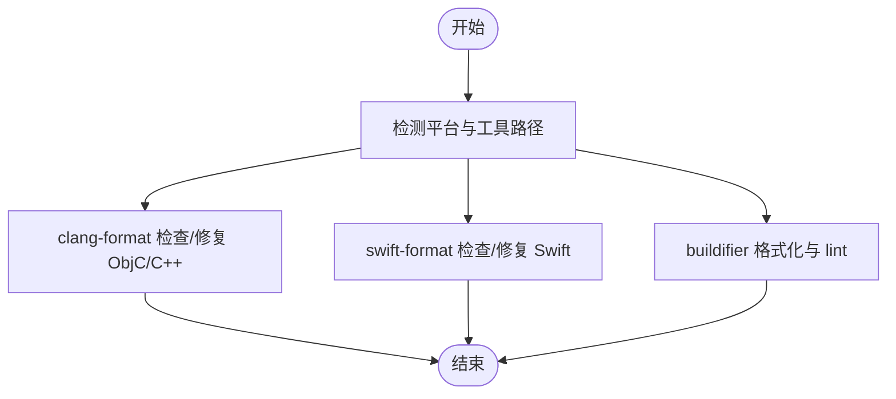
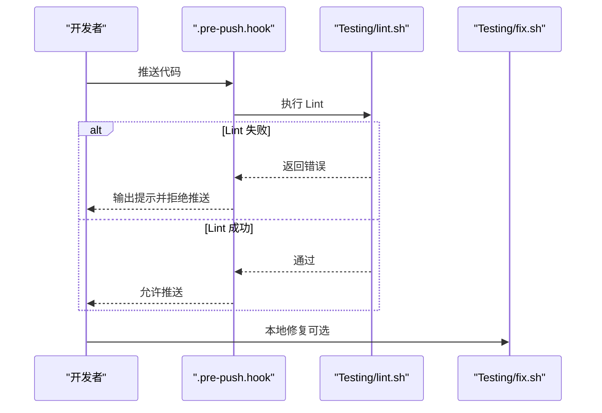
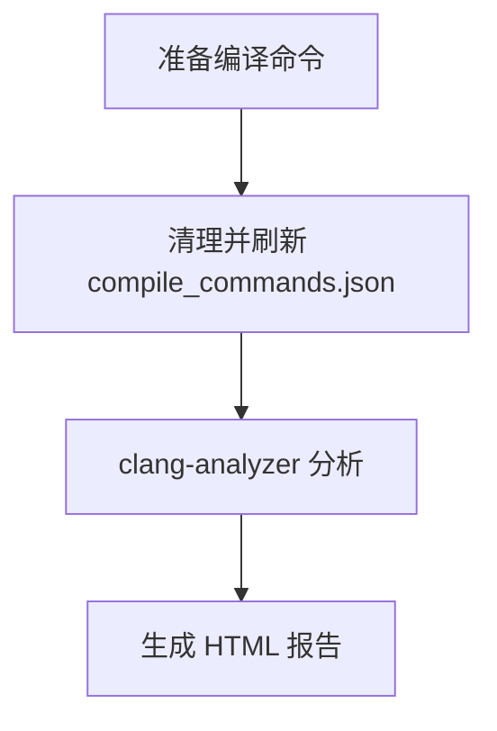
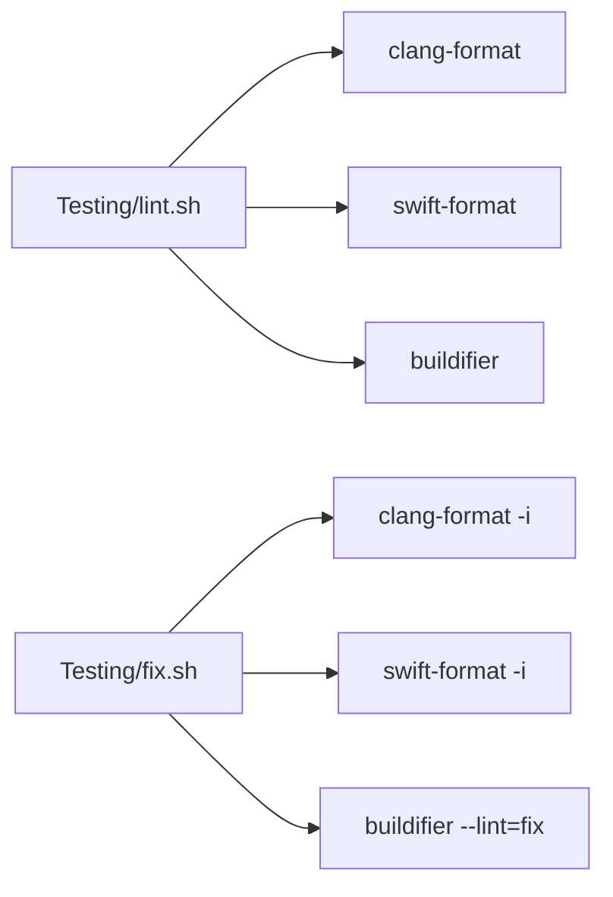

# 代码规范

<cite>
**本文引用的文件**
- [.clang-format](file://.clang-format)
- [.swift-format](file://.swift-format)
- [.pylintrc](file://.pylintrc)
- [.pre-push.hook](file://.pre-push.hook)
- [Testing/lint.sh](file://Testing/lint.sh)
- [Testing/fix.sh](file://Testing/fix.sh)
- [Makefile](file://Makefile)
- [README.md](file://README.md)
- [Source/common/SNTLogging.h](file://Source/common/SNTLogging.h)
- [Source/common/SNTCommonEnums.h](file://Source/common/SNTCommonEnums.h)
- [Source/gui/SNTAppDelegate.h](file://Source/gui/SNTAppDelegate.h)
- [Source/gui/SNTAppDelegate.mm](file://Source/gui/SNTAppDelegate.mm)
- [Testing/clang_analyzer/run_clang_analyzer.sh](file://Testing/clang_analyzer/run_clang_analyzer.sh)
</cite>

## 目录
1. [引言](#引言)
2. [项目结构](#项目结构)
3. [核心组件](#核心组件)
4. [架构总览](#架构总览)
5. [详细组件分析](#详细组件分析)
6. [依赖分析](#依赖分析)
7. [性能考虑](#性能考虑)
8. [故障排查指南](#故障排查指南)
9. [结论](#结论)
10. [附录](#附录)

## 引言
本文件为 Santa 项目的代码规范与质量标准文档，覆盖 Objective-C++、Swift 与 Python 的编码标准与约定，统一格式化工具（clang-format、SwiftFormat）的配置与使用，命名约定（类名、方法名、变量名、常量名），注释与文档字符串规范，代码审查检查清单与质量门禁，静态分析工具（clang-analyzer、pylint）的使用，重构指导与反模式识别，以及自动化质量检查与 CI 集成方案。目标是帮助开发者在多语言混合的 macOS 平台下保持一致、可读、可维护的代码风格，并通过工具链实现自动化质量控制。

## 项目结构
Santa 项目采用多模块、多语言混合架构，主要由以下部分组成：
- 公共库与通用组件：位于 Source/common，包含跨组件共享的逻辑与数据模型。
- 守护进程与事件处理：位于 Source/santad，负责系统扩展交互、策略决策与事件记录。
- 命令行工具：位于 Source/santactl，提供规则管理、状态查询等命令行能力。
- 图形界面代理：位于 Source/gui，提供用户通知与信息展示。
- 同步服务：位于 Source/santasyncservice，负责与远端服务器同步配置与事件。
- 指标服务：位于 Source/santametricservice，负责指标格式化与输出。
- 测试与质量工具：位于 Testing，包含 Lint、Fix、Clang 分析脚本与预提交钩子。
- 文档与站点：位于 docs，提供开发与部署文档。

```mermaid
graph TB
subgraph "公共层"
COMMON["Source/common<br/>通用组件与数据模型"]
end
subgraph "守护进程"
SANTAD["Source/santad<br/>事件处理与策略决策"]
end
subgraph "CLI"
SANTACTL["Source/santactl<br/>命令行工具"]
end
subgraph "GUI"
GUI["Source/gui<br/>图形界面代理"]
end
subgraph "服务"
SYNC["Source/santasyncservice<br/>同步服务"]
METRICS["Source/santametricservice<br/>指标服务"]
end
COMMON --> SANTAD
COMMON --> SANTACTL
COMMON --> GUI
COMMON --> SYNC
COMMON --> METRICS
```

**章节来源**
- [README.md](file://README.md#L1-L152)

## 核心组件
本节聚焦于与代码规范直接相关的核心组件与约定，包括：
- Objective-C++ 与 C++：遵循 clang-format 规则，统一缩进、行长、指针对齐与容器字面量空格。
- Swift：遵循 .swift-format 规则，统一行长、缩进、参数换行与若干风格开关。
- Python：遵循 .pylintrc 规则，统一行长与缩进。
- 注释与日志：统一使用头文件注释模板与日志宏，保证一致性与可追溯性。
- 枚举与常量：统一枚举命名与值域设计，避免破坏数据库持久化兼容性。

**章节来源**
- [.clang-format](file://.clang-format#L1-L43)
- [.swift-format](file://.swift-format#L1-L18)
- [.pylintrc](file://.pylintrc#L1-L4)
- [Source/common/SNTLogging.h](file://Source/common/SNTLogging.h#L1-L68)
- [Source/common/SNTCommonEnums.h](file://Source/common/SNTCommonEnums.h#L1-L233)

## 架构总览
下图展示了代码质量工具链在本地与 CI 中的协作关系：开发者在本地通过 Makefile 调用 Testing/fix.sh 进行自动修复，Testing/lint.sh 执行格式化与静态检查；.pre-push.hook 在推送前触发 lint；Clang 分析脚本用于生成 HTML 报告。



**图表来源**
- [Makefile](file://Makefile#L1-L40)
- [Testing/fix.sh](file://Testing/fix.sh#L1-L8)
- [Testing/lint.sh](file://Testing/lint.sh#L1-L22)
- [.pre-push.hook](file://.pre-push.hook#L1-L34)
- [Testing/clang_analyzer/run_clang_analyzer.sh](file://Testing/clang_analyzer/run_clang_analyzer.sh#L1-L16)

**章节来源**
- [Makefile](file://Makefile#L1-L40)
- [Testing/fix.sh](file://Testing/fix.sh#L1-L8)
- [Testing/lint.sh](file://Testing/lint.sh#L1-L22)
- [.pre-push.hook](file://.pre-push.hook#L1-L34)
- [Testing/clang_analyzer/run_clang_analyzer.sh](file://Testing/clang_analyzer/run_clang_analyzer.sh#L1-L16)

## 详细组件分析

### Objective-C++ 编码标准与约定
- 语言与风格
  - 使用 Google 风格，ObjC 行长限制为 100，C++ 行长限制为 80。
  - 缩进宽度为 2，指针对齐策略为“变量名右侧”，允许短 case 语句单行，容器字面量允许空格。
  - 结尾插入新行，函数单行策略为内联。
- 命名约定
  - 类名以 SNT 前缀命名，如 SNTAppDelegate、SNTLogging 等，体现模块归属。
  - 方法与属性采用驼峰命名，私有类别与实现文件中使用下划线前缀区分内部成员。
  - 常量与宏使用全大写加下划线，如 LOGD、LOGI、TEE_LOGE 等。
- 注释与文档
  - 头文件顶部包含版权与许可证声明，接口与重要逻辑处添加简要注释。
  - 日志宏统一使用 os_log 与 TEE_LOG* 变体，便于同时输出到系统日志与终端。
- 代码组织
  - 头文件仅暴露必要接口，实现细节放入 .mm 文件；测试文件以 Test 后缀命名，便于识别。
  - 通过 BUILD 文件组织依赖，确保模块可见性与编译顺序正确。



**图表来源**
- [Source/gui/SNTAppDelegate.h](file://Source/gui/SNTAppDelegate.h#L1-L22)
- [Source/gui/SNTAppDelegate.mm](file://Source/gui/SNTAppDelegate.mm#L1-L182)
- [Source/common/SNTLogging.h](file://Source/common/SNTLogging.h#L1-L68)

**章节来源**
- [.clang-format](file://.clang-format#L1-L43)
- [Source/common/SNTLogging.h](file://Source/common/SNTLogging.h#L1-L68)
- [Source/common/SNTCommonEnums.h](file://Source/common/SNTCommonEnums.h#L1-L233)
- [Source/gui/SNTAppDelegate.h](file://Source/gui/SNTAppDelegate.h#L1-L22)
- [Source/gui/SNTAppDelegate.mm](file://Source/gui/SNTAppDelegate.mm#L1-L182)

### Swift 编码标准与约定
- 语言与风格
  - 行长限制为 120，缩进 2 空格；参数逐行换行；优先保持函数输出在一起。
  - 关闭若干 SwiftFormat 规则（如强制小驼峰、块注释等），以减少与现有代码冲突。
- 命名约定
  - 遵循 Swift 常规命名习惯，类型使用大驼峰，实例与函数使用小驼峰。
  - 与 Objective-C 混编时，注意桥接头文件命名与模块导出。
- 注释与文档
  - 保持简洁清晰，避免冗余注释；对外公开 API 提供必要的说明。

**章节来源**
- [.swift-format](file://.swift-format#L1-L18)

### Python 编码标准与约定
- 语言与风格
  - 行长限制为 80，缩进为 2 空格。
- 命名约定
  - 函数与变量使用下划线分隔的小写命名；常量使用全大写加下划线；类使用大驼峰。
- 注释与文档
  - 使用单行注释与三引号文档字符串，保持一致性。

**章节来源**
- [.pylintrc](file://.pylintrc#L1-L4)

### 注释规范与文档字符串
- 头文件注释模板
  - 统一包含版权年份与许可证声明，确保法律合规与可追溯性。
- 日志与注释
  - 使用 SNTLogging.h 中定义的日志宏进行分级输出，避免魔法数字与硬编码字符串。
  - 对外接口与复杂逻辑添加简要注释，说明用途、输入输出与边界条件。

**章节来源**
- [Source/common/SNTLogging.h](file://Source/common/SNTLogging.h#L1-L68)

### 命名约定总览
- Objective-C++
  - 类名：SNT 前缀 + 功能描述，如 SNTConfigurator、SNTFileInfo。
  - 方法与属性：小驼峰，私有成员以下划线开头。
  - 常量与宏：全大写加下划线，如 SNTAction、LOGD/LOGI/LOGW/LOGE。
- Swift
  - 类型：大驼峰；实例与函数：小驼峰；与 Objective-C 混编时注意桥接命名。
- Python
  - 函数/变量：下划线分隔小写；常量：全大写加下划线；类：大驼峰。

**章节来源**
- [Source/common/SNTCommonEnums.h](file://Source/common/SNTCommonEnums.h#L1-L233)
- [Source/gui/SNTAppDelegate.h](file://Source/gui/SNTAppDelegate.h#L1-L22)
- [Source/gui/SNTAppDelegate.mm](file://Source/gui/SNTAppDelegate.mm#L1-L182)

### 代码格式化工具配置与使用
- clang-format（ObjC/C++）
  - 配置：基于 Google 风格，ObjC 行长 100、C++ 行长 80，指针对齐右侧，容器字面量允许空格，结尾换行。
  - 使用：本地修复执行 Testing/fix.sh；Lint 检查执行 Testing/lint.sh。
- SwiftFormat（Swift）
  - 配置：行长 120，缩进 2，参数逐行换行，若干规则关闭。
  - 使用：本地修复与 Lint 均通过 swift-format 命令完成。
- Python（pylint）
  - 配置：行长 80，缩进 2 空格。
  - 使用：在本地或 CI 中运行 pylint 进行静态检查。
- Bazel BUILD 文件
  - 使用 buildifier 进行格式化与 lint，支持 warn/fix 模式。



**图表来源**
- [Testing/lint.sh](file://Testing/lint.sh#L1-L22)
- [Testing/fix.sh](file://Testing/fix.sh#L1-L8)
- [.clang-format](file://.clang-format#L1-L43)
- [.swift-format](file://.swift-format#L1-L18)
- [.pylintrc](file://.pylintrc#L1-L4)

**章节来源**
- [Testing/lint.sh](file://Testing/lint.sh#L1-L22)
- [Testing/fix.sh](file://Testing/fix.sh#L1-L8)
- [.clang-format](file://.clang-format#L1-L43)
- [.swift-format](file://.swift-format#L1-L18)
- [.pylintrc](file://.pylintrc#L1-L4)

### 代码审查检查清单与质量门禁
- 代码风格
  - 通过 clang-format、swift-format、buildifier 的 lint 模式，确保风格一致。
  - 无多余空白字符与行尾空格。
- 逻辑与健壮性
  - 无未使用的导入与变量；异常路径有明确处理。
  - 日志输出分级合理，错误信息可诊断。
- 构建与测试
  - 通过 Bazel 构建与单元测试；测试覆盖率与稳定性满足门禁。
- 推送前检查
  - .pre-push.hook 自动执行 lint.sh，失败则阻止推送。



**图表来源**
- [.pre-push.hook](file://.pre-push.hook#L1-L34)
- [Testing/lint.sh](file://Testing/lint.sh#L1-L22)
- [Testing/fix.sh](file://Testing/fix.sh#L1-L8)

**章节来源**
- [.pre-push.hook](file://.pre-push.hook#L1-L34)
- [Testing/lint.sh](file://Testing/lint.sh#L1-L22)
- [Testing/fix.sh](file://Testing/fix.sh#L1-L8)

### 静态分析工具使用
- clang-analyzer
  - 使用 analyze-build 基于 compile_commands.json 生成 HTML 报告，默认清理并刷新编译命令后分析。
  - 建议在变更较大的功能点完成后运行，以发现潜在内存泄漏、空指针等问题。
- pylint（Python）
  - 基于 .pylintrc 配置运行，检查命名、复杂度、未使用项等。



**图表来源**
- [Testing/clang_analyzer/run_clang_analyzer.sh](file://Testing/clang_analyzer/run_clang_analyzer.sh#L1-L16)

**章节来源**
- [Testing/clang_analyzer/run_clang_analyzer.sh](file://Testing/clang_analyzer/run_clang_analyzer.sh#L1-L16)
- [.pylintrc](file://.pylintrc#L1-L4)

### 代码重构指导与反模式识别
- 重构指导
  - 将重复逻辑抽取为公共函数或类，减少分支嵌套与函数长度。
  - 明确模块边界，避免循环依赖；通过接口抽象隐藏实现细节。
  - 为关键路径增加单元测试，确保重构后行为不变。
- 反模式识别
  - 过长函数：拆分为职责单一的小函数。
  - 硬编码字符串与魔法数字：统一为常量或枚举。
  - 过度使用全局状态：通过依赖注入或单例管理。
  - 忽视日志分级：按严重程度使用不同级别日志。

[本节为通用指导，不直接分析具体文件，故无章节来源]

### 自动化代码质量检查与 CI 集成
- 本地
  - make fmt：调用 Testing/fix.sh 自动修复；make test：运行单元测试。
  - .pre-push.hook：推送前自动执行 lint.sh。
- CI
  - 建议在流水线中复用 Testing/lint.sh 与 Testing/fix.sh，确保风格一致。
  - 对关键 PR 运行 clang-analyzer 生成报告，作为安全门禁的一部分。

**章节来源**
- [Makefile](file://Makefile#L1-L40)
- [.pre-push.hook](file://.pre-push.hook#L1-L34)
- [Testing/lint.sh](file://Testing/lint.sh#L1-L22)
- [Testing/fix.sh](file://Testing/fix.sh#L1-L8)

## 依赖分析
- 语言工具链
  - clang-format 与 swift-format 分别作用于 ObjC/C++ 与 Swift；buildifier 作用于 Bazel BUILD 文件。
- 代码组织
  - Source/common 作为共享库被多个组件依赖，需保持稳定的接口与兼容的枚举值。
- 测试与质量
  - Testing/lint.sh 与 Testing/fix.sh 依赖工具链与环境变量（如 xcrun clang-format、swift-format）。



**图表来源**
- [Testing/lint.sh](file://Testing/lint.sh#L1-L22)
- [Testing/fix.sh](file://Testing/fix.sh#L1-L8)

**章节来源**
- [Testing/lint.sh](file://Testing/lint.sh#L1-L22)
- [Testing/fix.sh](file://Testing/fix.sh#L1-L8)

## 性能考虑
- 格式化与分析
  - 在大型仓库中，clang-analyzer 分析时间较长，建议仅在关键变更后运行。
- 日志输出
  - 使用分级日志，避免在热路径中产生过多 I/O；TEE_LOG* 变体用于 CLI 场景。
- 代码组织
  - 将热点路径与非热点路径分离，减少不必要的依赖与耦合。

[本节提供一般性建议，不直接分析具体文件，故无章节来源]

## 故障排查指南
- Lint 失败
  - 检查本地是否安装 clang-format/swift-format/buildifier；确认 .clang-format、.swift-format、.pylintrc 配置正确。
  - 使用 Testing/fix.sh 自动修复常见问题；.pre-push.hook 会阻止失败的推送。
- 分析报告
  - 若 clang-analyzer 报告 HTML 无法生成，确认 compile_commands.json 是否存在且有效。
- 构建与测试
  - 使用 make test 运行单元测试，定位失败用例并补充测试覆盖。

**章节来源**
- [.pre-push.hook](file://.pre-push.hook#L1-L34)
- [Testing/lint.sh](file://Testing/lint.sh#L1-L22)
- [Testing/fix.sh](file://Testing/fix.sh#L1-L8)
- [Testing/clang_analyzer/run_clang_analyzer.sh](file://Testing/clang_analyzer/run_clang_analyzer.sh#L1-L16)

## 结论
通过统一的格式化工具配置、严格的命名与注释规范、完善的代码审查与质量门禁，以及 clang-analyzer 与 pylint 的静态分析，Santa 项目能够在多语言混合的 macOS 平台上保持高质量与高可维护性。建议团队在日常开发中坚持本地修复与推送前 Lint，CI 中引入静态分析报告，持续改进代码质量。

[本节为总结性内容，不直接分析具体文件，故无章节来源]

## 附录
- 常用命令参考
  - 本地修复：make fmt 或 ./Testing/fix.sh
  - 本地 Lint：./Testing/lint.sh
  - 推送前钩子：安装 .pre-push.hook 后自动执行 Lint
  - Clang 分析：./Testing/clang_analyzer/run_clang_analyzer.sh
  - 单元测试：make test

**章节来源**
- [Makefile](file://Makefile#L1-L40)
- [Testing/fix.sh](file://Testing/fix.sh#L1-L8)
- [Testing/lint.sh](file://Testing/lint.sh#L1-L22)
- [.pre-push.hook](file://.pre-push.hook#L1-L34)
- [Testing/clang_analyzer/run_clang_analyzer.sh](file://Testing/clang_analyzer/run_clang_analyzer.sh#L1-L16)