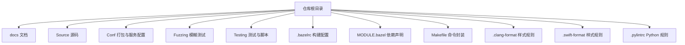
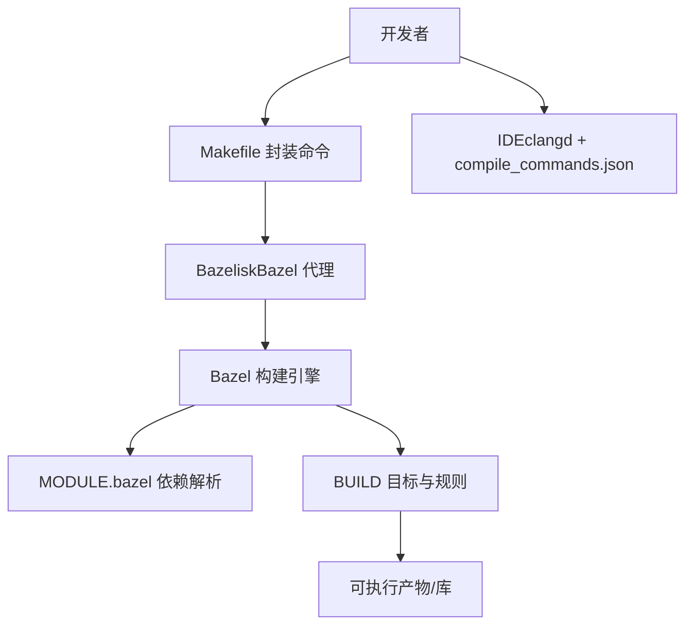
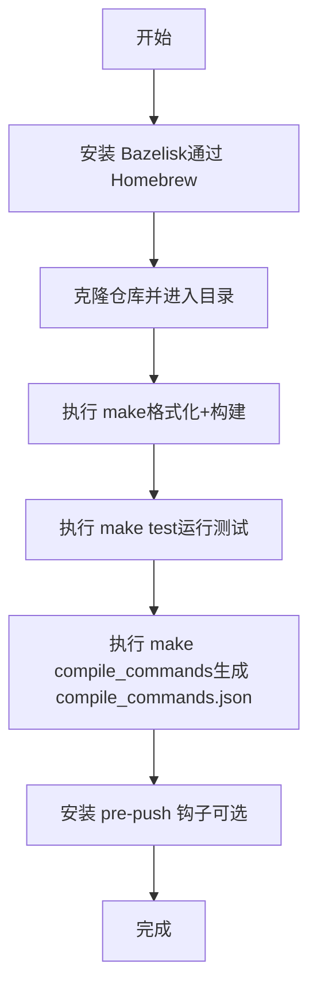
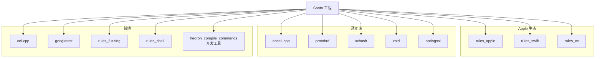

# 开发环境搭建

<cite>
**本文引用的文件**
- [README.md](file://README.md)
- [docs/docs/development/building.md](file://docs/docs/development/building.md)
- [docs/docs/development/contributing.md](file://docs/docs/development/contributing.md)
- [.bazelrc](file://.bazelrc)
- [MODULE.bazel](file://MODULE.bazel)
- [Makefile](file://Makefile)
- [.pre-push.hook](file://.pre-push.hook)
- [.clang-format](file://.clang-format)
- [.swift-format](file://.swift-format)
- [.pylintrc](file://.pylintrc)
- [Source/common/BUILD](file://Source/common/BUILD)
</cite>

## 目录
1. [简介](#简介)
2. [项目结构](#项目结构)
3. [核心组件](#核心组件)
4. [架构总览](#架构总览)
5. [详细组件分析](#详细组件分析)
6. [依赖分析](#依赖分析)
7. [性能考虑](#性能考虑)
8. [故障排查指南](#故障排查指南)
9. [结论](#结论)
10. [附录](#附录)

## 简介
本指南面向在 macOS 上参与 Santa 项目开发的工程师，目标是帮助你快速完成本地开发环境搭建与验证。内容覆盖系统要求与前置条件（macOS、Xcode、命令行工具）、Bazelisk 安装与配置、依赖安装（Homebrew 包管理器）、IDE 配置（VS Code 与 Xcode）、代码格式化工具（clang-format、SwiftFormat）以及环境变量与 PATH 设置，并提供基础编译测试验证流程，确保团队使用统一的构建版本与一致的开发体验。

## 项目结构
Santa 使用 Bazel 作为统一构建系统，采用模块化 WORKSPACE/MODULE 结构组织源码与依赖；同时通过 Makefile 提供常用命令封装，便于一键格式化、构建与测试。开发文档位于 docs 目录，涵盖构建、贡献与风格规范等主题。

**章节来源**
- [README.md](file://README.md#L1-L152)
- [docs/docs/development/building.md](file://docs/docs/development/building.md#L1-L106)
- [Makefile](file://Makefile#L1-L40)

## 核心组件
- 构建系统：Bazel + Bazelisk（自动选择正确版本）
- 依赖管理：MODULE.bazel 声明 abseil-cpp、protobuf、rules_apple、rules_swift 等
- 代码风格：clang-format、SwiftFormat、pylint
- IDE 支持：通过生成 compile_commands.json 为 clangd 提供语义支持
- 质量门禁：pre-push 钩子执行 lint 并阻止不合规推送

**章节来源**
- [docs/docs/development/building.md](file://docs/docs/development/building.md#L1-L106)
- [MODULE.bazel](file://MODULE.bazel#L1-L42)
- [.bazelrc](file://.bazelrc#L1-L68)
- [.pre-push.hook](file://.pre-push.hook#L1-L34)
- [.clang-format](file://.clang-format#L1-L43)
- [.swift-format](file://.swift-format#L1-L18)
- [.pylintrc](file://.pylintrc#L1-L4)

## 架构总览
下图展示从开发者到构建系统的整体流程，强调统一构建版本（Bazelisk）与依赖解析（MODULE.bazel）的作用。

**图表来源**
- [docs/docs/development/building.md](file://docs/docs/development/building.md#L1-L106)
- [MODULE.bazel](file://MODULE.bazel#L1-L42)
- [Makefile](file://Makefile#L1-L40)

## 详细组件分析

### 系统要求与前置条件
- macOS 版本
  - 仓库未显式限定最低版本，但涉及系统扩展与 Endpoint Security 监控，建议使用较新的 macOS 版本以获得稳定内核与 SDK 支持。
- Xcode 与命令行工具
  - 由于项目使用 Apple 平台规则与 Swift/Objective-C 混编，需安装 Xcode 及其命令行工具（xcode-select --install），以便获取 clang/clang++、SDK 与平台工具链。
- Bazelisk
  - 使用 Bazelisk 统一构建版本，避免团队成员因 Bazel 版本差异导致构建不一致。

**章节来源**
- [docs/docs/development/building.md](file://docs/docs/development/building.md#L1-L106)

### Bazelisk 安装与配置
- 安装方式
  - 通过 Homebrew 安装 bazelisk，系统会自动将 bazel 与 bazelisk 添加到 PATH。
- 版本控制
  - Bazelisk 会根据工作区内的配置自动下载并使用匹配的 Bazel 版本，确保团队一致性。
- 常用命令
  - 使用 Makefile 的默认目标进行格式化与构建，或直接运行 bazel 命令。

**章节来源**
- [docs/docs/development/building.md](file://docs/docs/development/building.md#L1-L106)
- [Makefile](file://Makefile#L1-L40)

### 依赖安装（含 Homebrew）
- 依赖来源
  - 项目通过 MODULE.bazel 声明大量第三方依赖（如 abseil-cpp、protobuf、rules_apple、rules_swift、xxhash、zstd、boringssl 等），并包含非模块依赖（FMDB、OCMock、nats_c）。
- 安装建议
  - 使用 Homebrew 安装 bazelisk 后，首次构建时 Bazel 会自动拉取所需依赖；若需要本地工具链或额外开发工具，可通过 Homebrew 安装。
- 依赖解析
  - Bazel 在解析 MODULE.bazel 后，会按需下载并缓存依赖，无需手动管理每个子模块。

**章节来源**
- [MODULE.bazel](file://MODULE.bazel#L1-L42)
- [Source/common/BUILD](file://Source/common/BUILD#L1-L120)

### IDE 配置（VS Code 与 Xcode）
- VS Code
  - 通过 Makefile 的 compile_commands 目标生成 compile_commands.json，再在编辑器中启用基于该文件的语义补全与跳转。
- Xcode
  - 项目包含 GUI、CLI、守护进程等多个组件的 Info.plist 与主程序入口，可在 Xcode 中打开相应工程或以 Bazel 目标形式参与调试（需配合编译数据库与符号信息）。

**章节来源**
- [docs/docs/development/building.md](file://docs/docs/development/building.md#L1-L106)
- [Makefile](file://Makefile#L1-L40)

### 代码格式化工具（clang-format、SwiftFormat、pylint）
- clang-format
  - 用于 Objective-C 与 C++，遵循 Google 风格并自定义列宽与缩进策略。
- SwiftFormat
  - 用于 Swift，设定行长度、缩进与若干规则开关。
- pylint
  - 用于 Python 脚本，限制行长与缩进。
- 使用建议
  - 在提交前运行格式化脚本，确保风格一致并通过 CI 校验。

**章节来源**
- [.clang-format](file://.clang-format#L1-L43)
- [.swift-format](file://.swift-format#L1-L18)
- [.pylintrc](file://.pylintrc#L1-L4)
- [docs/docs/development/contributing.md](file://docs/docs/development/contributing.md#L1-L49)

### 环境变量与 PATH 设置
- PATH
  - 安装 bazelisk 后，系统会将其加入 PATH，从而可以在终端直接使用 bazel 与 bazelisk 命令。
- 其他变量
  - 项目未定义特定的必需环境变量；如需启用 Sanitizers 或特殊构建变体，可在 bazel build 命令后追加对应选项。

**章节来源**
- [docs/docs/development/building.md](file://docs/docs/development/building.md#L1-L106)
- [.bazelrc](file://.bazelrc#L1-L68)

### 验证环境配置（基础编译测试）
- 基本流程
  - 运行 make（默认会先格式化，再构建 GUI 目标）。
  - 运行 make test 执行单元测试套件。
  - 如需生成编译数据库以支持 IDE 语义，运行 make compile_commands。
- 推送前检查
  - 仓库提供 pre-push 钩子，在推送前自动执行 lint 脚本，失败将阻止推送。

**图表来源**
- [docs/docs/development/building.md](file://docs/docs/development/building.md#L1-L106)
- [Makefile](file://Makefile#L1-L40)
- [.pre-push.hook](file://.pre-push.hook#L1-L34)

**章节来源**
- [Makefile](file://Makefile#L1-L40)
- [.pre-push.hook](file://.pre-push.hook#L1-L34)

## 依赖分析
下图展示 Santa 工程的关键依赖关系，突出 MODULE.bazel 中声明的核心库与规则集。

**图表来源**
- [MODULE.bazel](file://MODULE.bazel#L1-L42)

**章节来源**
- [MODULE.bazel](file://MODULE.bazel#L1-L42)

## 性能考虑
- 构建优化
  - 使用 -c opt 进行发布构建；开启 dsym 便于调试与符号定位。
  - 利用多 CPU 架构交叉编译参数以适配不同芯片。
- 调试与分析
  - 可启用 AddressSanitizer/ThreadSanitizer/UndefinedBehaviorSanitizer 等变体进行内存与并发问题排查。
- 编译数据库
  - 生成 compile_commands.json 有助于 IDE 快速索引与补全，减少等待时间。

**章节来源**
- [Makefile](file://Makefile#L1-L40)
- [.bazelrc](file://.bazelrc#L1-L68)

## 故障排查指南
- 构建失败（找不到 SDK/工具链）
  - 确认已安装 Xcode 并接受许可协议；在终端执行 xcode-select --install 安装命令行工具。
- Bazel 版本不匹配
  - 确保通过 Homebrew 安装了 bazelisk，并在工作区内使用 bazel 或 bazelisk 命令；不要直接使用系统自带的 bazel。
- 格式化不通过
  - 在提交前运行格式化脚本，确保 clang-format、SwiftFormat、pylint 规则满足要求。
- 推送被阻止
  - pre-push 钩子会在推送前执行 lint，失败会提示先运行 make fmt。

**章节来源**
- [docs/docs/development/building.md](file://docs/docs/development/building.md#L1-L106)
- [docs/docs/development/contributing.md](file://docs/docs/development/contributing.md#L1-L49)
- [.pre-push.hook](file://.pre-push.hook#L1-L34)

## 结论
通过统一使用 Bazelisk、遵循 MODULE.bazel 声明的依赖、配合 clang-format/SwiftFormat/pylint 的代码风格与 pre-push 钩子的质量门禁，Santa 项目能够在 macOS 上实现跨平台一致的构建体验。建议新成员优先完成 Xcode/命令行工具安装、Bazelisk 配置与 IDE 编译数据库生成，随后以 make 为入口完成日常开发与测试。

## 附录
- 常用命令参考
  - make：格式化并构建 GUI 目标
  - make test：运行单元测试
  - make compile_commands：生成 compile_commands.json
  - make reload：重载开发中的组件（需配合 reload 目标）

**章节来源**
- [Makefile](file://Makefile#L1-L40)
- [docs/docs/development/building.md](file://docs/docs/development/building.md#L1-L106)