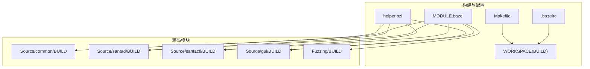
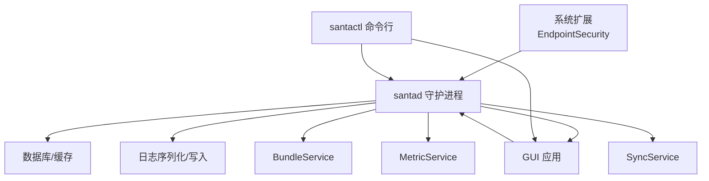
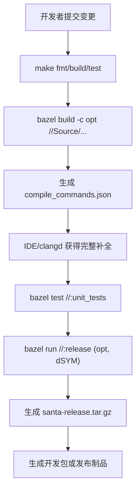
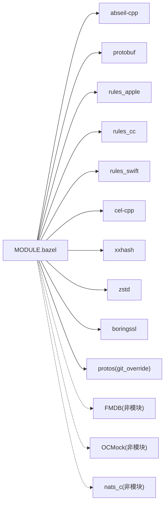
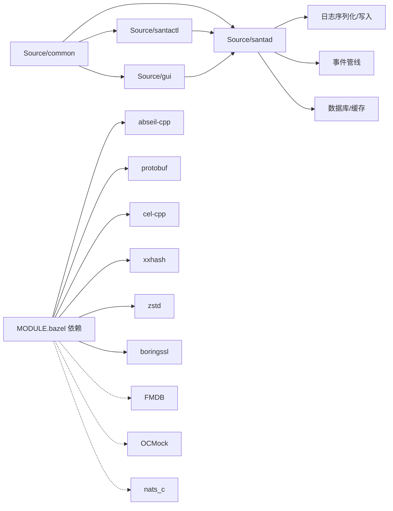
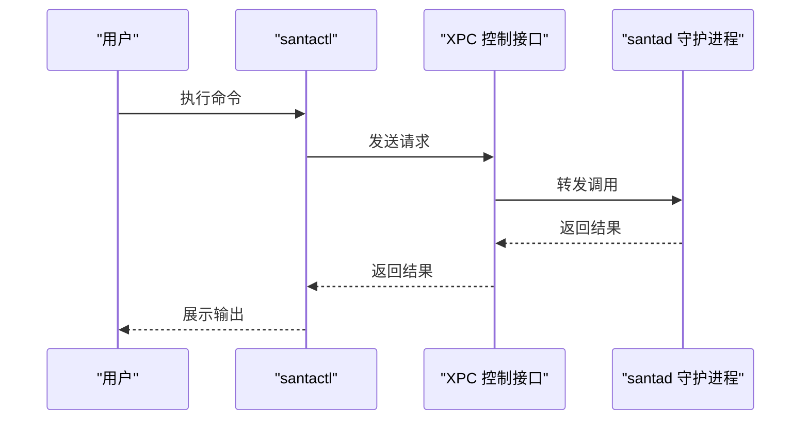

# 开发者指南

<cite>
**本文引用的文件**
- [README.md](file://README.md)
- [docs/docs/development/building.md](file://docs/docs/development/building.md)
- [MODULE.bazel](file://MODULE.bazel)
- [.bazelrc](file://.bazelrc)
- [BUILD](file://BUILD)
- [Makefile](file://Makefile)
- [helper.bzl](file://helper.bzl)
- [Testing/lint.sh](file://Testing/lint.sh)
- [Testing/fix.sh](file://Testing/fix.sh)
- [Source/common/BUILD](file://Source/common/BUILD)
- [Source/santad/BUILD](file://Source/santad/BUILD)
- [Source/santactl/BUILD](file://Source/santactl/BUILD)
- [Source/gui/BUILD](file://Source/gui/BUILD)
- [Fuzzing/BUILD](file://Fuzzing/BUILD)
</cite>

## 目录
1. [简介](#简介)
2. [项目结构](#项目结构)
3. [核心组件](#核心组件)
4. [架构总览](#架构总览)
5. [详细组件分析](#详细组件分析)
6. [依赖分析](#依赖分析)
7. [性能考虑](#性能考虑)
8. [故障排查指南](#故障排查指南)
9. [结论](#结论)
10. [附录](#附录)

## 简介
Santa 是一个面向 macOS 的二进制与文件访问授权系统，由系统扩展（监控执行与文件访问）、GUI 代理（阻断时向用户提示）、后台同步服务（与远端服务器同步配置）以及命令行工具组成。本指南聚焦于开发者侧的环境搭建、构建系统、编译流程、依赖管理、模块组织、代码规范、质量保证、调试与测试、持续集成、贡献与发布管理、API 设计与扩展点、开发工具与 IDE 配置、性能与安全实践等。

## 项目结构
仓库采用 Bazel 作为统一构建系统，源码按功能域分包组织，核心模块包括：
- Source/common：跨组件共享的通用库与协议定义
- Source/santad：守护进程与事件处理管线
- Source/santactl：命令行工具
- Source/gui：图形界面应用
- Source/santabundleservice / santametricservice / santasyncservice：配套服务
- Fuzzing：模糊测试目标
- Conf：打包与签名脚本、plist 与安装脚本
- Testing：格式化、静态检查、本地化校验与工作区状态脚本
- docs：官方文档站点源码

**图表来源**
- [MODULE.bazel](file://MODULE.bazel#L1-L42)
- [.bazelrc](file://.bazelrc#L1-L68)
- [Makefile](file://Makefile#L1-L40)
- [BUILD](file://BUILD#L1-L260)
- [helper.bzl](file://helper.bzl#L1-L64)
- [Source/common/BUILD](file://Source/common/BUILD#L1-L120)
- [Source/santad/BUILD](file://Source/santad/BUILD#L1-L120)
- [Source/santactl/BUILD](file://Source/santactl/BUILD#L1-L80)
- [Source/gui/BUILD](file://Source/gui/BUILD#L1-L120)
- [Fuzzing/BUILD](file://Fuzzing/BUILD#L1-L12)

**章节来源**
- [README.md](file://README.md#L1-L152)
- [docs/docs/development/building.md](file://docs/docs/development/building.md#L1-L106)
- [MODULE.bazel](file://MODULE.bazel#L1-L42)
- [.bazelrc](file://.bazelrc#L1-L68)
- [BUILD](file://BUILD#L1-L260)
- [Makefile](file://Makefile#L1-L40)
- [helper.bzl](file://helper.bzl#L1-L64)

## 核心组件
- 共享库与协议
  - 协议与序列化：通过 proto_library/cc_proto_library 定义并生成 C++/ObjC 包装，供各模块复用
  - 基础设施：缓存、日志、证书与签名辅助、字符串与数据压缩、XPC 连接、定时器、环形缓冲等
- 守护进程（santad）
  - 数据层：规则表、事件表、数据库控制器
  - 事件管线：EndpointSecurity 客户端、富化器、记录器、授权器、速率限制、结果缓存
  - 日志与写入：多种序列化器与写入器（文件、syslog、Protobuf 等）
- 命令行工具（santactl）
  - 子命令：打印日志、安装、遥测、规则管理、状态查询、同步、版本等
  - 与守护进程通过 XPC 通信
- 图形界面（Santa.app）
  - 窗口控制器与视图（Swift/ObjC），展示阻断消息、设备事件、文件访问事件等
- 服务组件
  - BundleService、MetricService、SyncService 分别承担资源包、指标与同步职责
- 模糊测试（Fuzzing）
  - 针对 Mach-O 解析等路径的 ObjC 模糊测试目标

**章节来源**
- [Source/common/BUILD](file://Source/common/BUILD#L1-L200)
- [Source/santad/BUILD](file://Source/santad/BUILD#L1-L200)
- [Source/santactl/BUILD](file://Source/santactl/BUILD#L1-L120)
- [Source/gui/BUILD](file://Source/gui/BUILD#L1-L200)
- [Fuzzing/BUILD](file://Fuzzing/BUILD#L1-L12)

## 架构总览
Santa 的运行时由系统扩展与多个用户态组件协同完成：系统扩展负责事件采集与决策；守护进程进行规则匹配与缓存；GUI 在阻断时通知用户；santactl 提供运维能力；服务组件负责指标与策略同步。

**图表来源**
- [Source/santad/BUILD](file://Source/santad/BUILD#L1-L120)
- [Source/gui/BUILD](file://Source/gui/BUILD#L160-L200)
- [Source/santactl/BUILD](file://Source/santactl/BUILD#L140-L170)

## 详细组件分析

### 构建系统与编译流程
- Bazel 版本与工具链
  - 使用 Bazelisk 确保团队一致的 Bazel 版本
  - .bazelrc 统一启用 dSYM、C++20、警告与 sanitizer 配置
  - Makefile 提供常用命令封装（格式化、构建、测试、打包、重载）
- 目标与规则
  - WORKSPACE(BUILD) 定义包组、版本标签、构建类型（release/adhoc/debugger/opt）、加载/卸载/重载命令
  - helper.bzl 封装通用单元测试与资源打包规则
  - 各模块 BUILD 文件声明语言绑定（rules_apple/rules_cc/rules_swift）与依赖
- 发布与打包
  - release 目标产出多架构二进制与 dSYM，并校验 fat 二进制完整性
  - package-dev 基于 release 输出的归档生成开发包

**图表来源**
- [docs/docs/development/building.md](file://docs/docs/development/building.md#L1-L106)
- [.bazelrc](file://.bazelrc#L1-L68)
- [Makefile](file://Makefile#L1-L40)
- [BUILD](file://BUILD#L110-L220)
- [helper.bzl](file://helper.bzl#L1-L64)

**章节来源**
- [docs/docs/development/building.md](file://docs/docs/development/building.md#L1-L106)
- [.bazelrc](file://.bazelrc#L1-L68)
- [Makefile](file://Makefile#L1-L40)
- [BUILD](file://BUILD#L1-L260)
- [helper.bzl](file://helper.bzl#L1-L64)

### 依赖管理与模块组织
- 规则与依赖
  - MODULE.bazel 声明 abseil、protobuf、rules_apple、rules_cc、rules_swift、cel-cpp、xxhash、zstd、boringssl 等
  - 非模块依赖通过 non_module_deps 引入 FMDB、OCMock、nats_c
  - 通过 git_override 对 protos 进行特定提交覆盖
- 模块边界
  - Source/common 作为共享层，被其他模块以明确依赖方式引用
  - 各子模块（santad、santactl、gui、services、fuzzing）各自 BUILD 文件定义清晰的接口与依赖图

**图表来源**
- [MODULE.bazel](file://MODULE.bazel#L1-L42)

**章节来源**
- [MODULE.bazel](file://MODULE.bazel#L1-L42)

### 代码规范与质量保证
- 格式化与静态检查
  - clang-format、swift-format、buildifier 统一风格与语法
  - lint.sh 在 CI 中执行格式与语法检查
- 测试策略
  - 各模块均提供单元测试套件，helper.bzl 统一了测试规则与资源打包
  - 支持 ASAN/TSAN/UBSAN 等 sanitizer 配置
- 模糊测试
  - Fuzzing/BUILD 定义 ObjC 模糊测试目标，结合 corpus 进行回归验证

**章节来源**
- [Testing/lint.sh](file://Testing/lint.sh#L1-L22)
- [Testing/fix.sh](file://Testing/fix.sh#L1-L8)
- [.bazelrc](file://.bazelrc#L37-L68)
- [helper.bzl](file://helper.bzl#L1-L64)
- [Fuzzing/BUILD](file://Fuzzing/BUILD#L1-L12)

### 调试技巧与测试策略
- 调试与符号
  - .bazelrc 启用 dSYM，release 目标要求生成 dSYM 并校验多架构切片
  - 支持 ASAN/TSAN/UBSAN，便于定位并发与内存问题
- 重载与安装
  - Makefile 提供 reload 目标，配合 WORKSPACE 的 run_command 实现快速重载
  - 文档提供了在未注册机器上加载 adhoc 构建的步骤（需禁用 SIP）
- 单元测试
  - 各模块 BUILD 中的 test_suite 聚合测试目标，支持按模块独立运行

**章节来源**
- [.bazelrc](file://.bazelrc#L1-L68)
- [BUILD](file://BUILD#L70-L112)
- [docs/docs/development/building.md](file://docs/docs/development/building.md#L63-L106)
- [Makefile](file://Makefile#L24-L33)

### 持续集成与发布管理
- 版本与构建类型
  - 通过 config_setting 区分 release/adhoc/debugger 与 opt_build，影响产物与签名策略
- 发布制品
  - release 目标生成包含二进制、配置与 dSYM 的 tarball，并校验多架构切片
  - package-dev 基于 release 归档生成开发包
- 工作区状态
  - workspace_status.sh 可用于注入构建信息（如提交哈希）

**章节来源**
- [BUILD](file://BUILD#L20-L68)
- [BUILD](file://BUILD#L113-L220)

### API 设计原则、扩展点与插件机制
- XPC 接口
  - 各模块广泛使用 MOLXPCConnection 与接口头文件，确保组件间强契约通信
- 插件与可扩展日志
  - 日志序列化器与写入器采用可插拔设计，支持多种输出后端
- 策略表达
  - 通过 cel-cpp 与自定义规则标识符实现策略扩展

**章节来源**
- [Source/common/BUILD](file://Source/common/BUILD#L560-L740)
- [Source/santad/BUILD](file://Source/santad/BUILD#L670-L771)

### 贡献流程与代码审查
- 文档指引
  - README 提供贡献入口链接至官方文档“Development/Contributing”
- 代码质量
  - lint.sh/fix.sh 保障风格一致性
  - 单元测试与 sanitizer 配置提升质量门槛

**章节来源**
- [README.md](file://README.md#L144-L152)
- [docs/docs/development/building.md](file://docs/docs/development/building.md#L1-L106)
- [Testing/lint.sh](file://Testing/lint.sh#L1-L22)
- [Testing/fix.sh](file://Testing/fix.sh#L1-L8)

### 开发工具推荐与 IDE 配置
- 编辑器
  - 使用 hedron_compile_commands 生成 compile_commands.json，配合 clangd 获取完整补全与跳转
- 构建与测试
  - Makefile 封装常用命令，简化日常开发流程

**章节来源**
- [docs/docs/development/building.md](file://docs/docs/development/building.md#L93-L106)
- [Makefile](file://Makefile#L1-L20)

## 依赖分析
以下依赖关系图展示了模块间的直接依赖与外部依赖：

**图表来源**
- [MODULE.bazel](file://MODULE.bazel#L1-L42)
- [Source/common/BUILD](file://Source/common/BUILD#L1-L120)
- [Source/santad/BUILD](file://Source/santad/BUILD#L1-L120)
- [Source/santactl/BUILD](file://Source/santactl/BUILD#L1-L80)
- [Source/gui/BUILD](file://Source/gui/BUILD#L1-L120)

**章节来源**
- [MODULE.bazel](file://MODULE.bazel#L1-L42)
- [Source/common/BUILD](file://Source/common/BUILD#L1-L200)
- [Source/santad/BUILD](file://Source/santad/BUILD#L1-L200)
- [Source/santactl/BUILD](file://Source/santactl/BUILD#L1-L120)
- [Source/gui/BUILD](file://Source/gui/BUILD#L1-L200)

## 性能考虑
- 缓存与命中
  - 决策缓存与文件/集合缓存减少重复计算
- 并发与锁
  - 多处使用 absl 同步原语，注意避免热点竞争
- 日志与序列化
  - 选择合适的序列化器与写入器，控制开销
- 构建优化
  - 使用 opt 构建与 dSYM，便于性能剖析与回溯

[本节为通用指导，无需列出具体文件来源]

## 故障排查指南
- 构建失败
  - 缺少 dSYM 或未生成多架构切片会导致 release 目标失败
  - 未启用 opt 构建会触发 release 保护逻辑
- 符号与调试
  - 使用 ASAN/TSAN/UBSAN 快速定位内存与并发问题
- 重载与安装
  - 若无法加载系统扩展，参考文档中关于 adhoc 构建与 SIP 的说明

**章节来源**
- [BUILD](file://BUILD#L113-L220)
- [.bazelrc](file://.bazelrc#L37-L68)
- [docs/docs/development/building.md](file://docs/docs/development/building.md#L63-L106)

## 结论
Santa 的开发以 Bazel 为核心，辅以严格的代码规范、完善的测试与 sanitizer 配置、清晰的模块边界与可扩展的日志/序列化体系。通过统一的构建与发布流程，开发者可以高效地迭代功能、修复问题并交付稳定版本。

[本节为总结性内容，无需列出具体文件来源]

## 附录

### 关键流程：santactl 命令到守护进程调用序列

**图表来源**
- [Source/santactl/BUILD](file://Source/santactl/BUILD#L1-L80)
- [Source/common/BUILD](file://Source/common/BUILD#L560-L740)