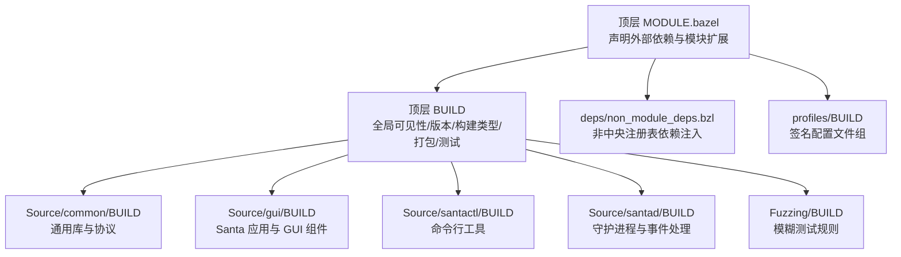
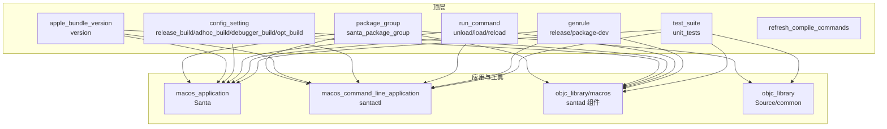
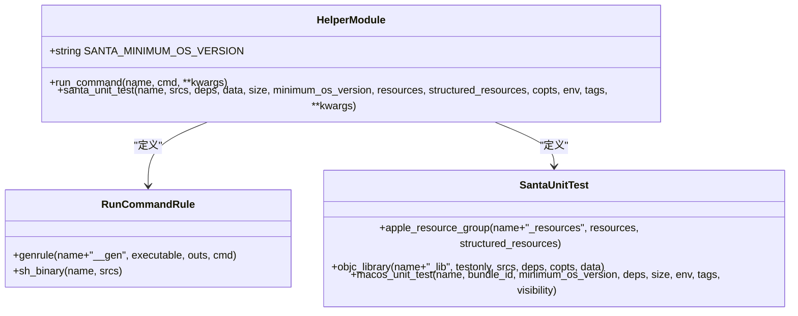
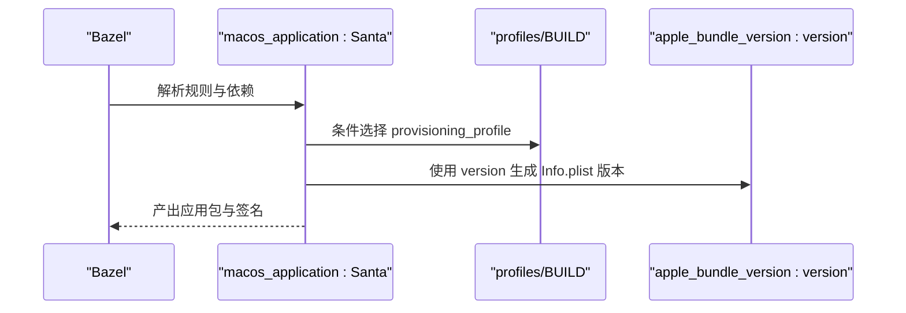
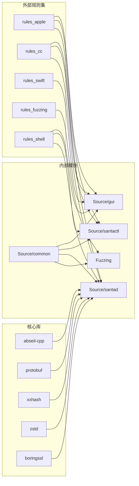
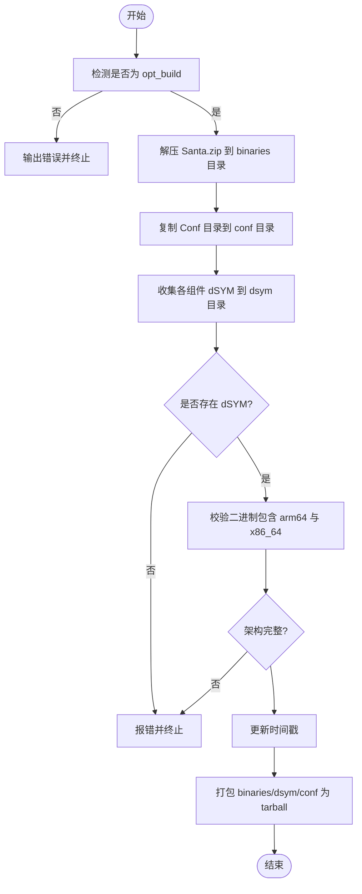

# Bazel配置

<cite>
**本文引用的文件**
- [BUILD](file://BUILD)
- [MODULE.bazel](file://MODULE.bazel)
- [helper.bzl](file://helper.bzl)
- [Source/common/BUILD](file://Source/common/BUILD)
- [Source/gui/BUILD](file://Source/gui/BUILD)
- [Source/santactl/BUILD](file://Source/santactl/BUILD)
- [Source/santad/BUILD](file://Source/santad/BUILD)
- [Fuzzing/BUILD](file://Fuzzing/BUILD)
- [Fuzzing/fuzzing.bzl](file://Fuzzing/fuzzing.bzl)
- [deps/non_module_deps.bzl](file://deps/non_module_deps.bzl)
- [profiles/BUILD](file://profiles/BUILD)
</cite>

## 目录
1. [简介](#简介)
2. [项目结构](#项目结构)
3. [核心组件](#核心组件)
4. [架构总览](#架构总览)
5. [详细组件分析](#详细组件分析)
6. [依赖关系分析](#依赖关系分析)
7. [性能考虑](#性能考虑)
8. [故障排查指南](#故障排查指南)
9. [结论](#结论)
10. [附录](#附录)

## 简介
本文件系统化梳理 Santa 项目的 Bazel 构建配置，重点覆盖顶层 BUILD 的规则组织、可执行文件与库文件的构建方式、资源文件处理、config_setting 的构建类型区分、apple_bundle_version 的版本管理与构建标签生成、package_group 的可见性控制、genrule 的发布打包流程、run_command 在系统扩展加载/卸载中的作用，以及 helper.bzl 中自定义规则与构建优化实践。文档旨在帮助开发者快速理解并高效维护该仓库的构建体系。

## 项目结构
Santa 采用按功能域分层的目录组织：顶层通过 MODULE.bazel 声明外部依赖与模块扩展；顶层 BUILD 定义全局可见性、版本标签、构建类型配置、系统扩展加载/卸载命令、发布打包与测试套件；各子模块（如 Source/common、Source/gui、Source/santactl、Source/santad）各自提供 BUILD 文件定义具体可执行程序、库与测试；Fuzzing 提供模糊测试工具链；deps 与 profiles 提供非中央注册表依赖与签名配置。

图表来源
- [MODULE.bazel](file://MODULE.bazel#L1-L42)
- [BUILD](file://BUILD#L1-L260)
- [Source/common/BUILD](file://Source/common/BUILD#L1-L120)
- [Source/gui/BUILD](file://Source/gui/BUILD#L1-L200)
- [Source/santactl/BUILD](file://Source/santactl/BUILD#L1-L170)
- [Source/santad/BUILD](file://Source/santad/BUILD#L1-L120)
- [Fuzzing/BUILD](file://Fuzzing/BUILD#L1-L12)
- [deps/non_module_deps.bzl](file://deps/non_module_deps.bzl#L1-L32)
- [profiles/BUILD](file://profiles/BUILD#L1-L16)

章节来源
- [MODULE.bazel](file://MODULE.bazel#L1-L42)
- [BUILD](file://BUILD#L1-L260)

## 核心组件
- 全局可见性与导出
  - 顶层 package 使用 package_group 控制默认可见性，确保内部模块间可访问，同时对外部保持隔离。
  - exports_files 导出安装脚本与 plist 配置，便于发布与部署。
- 版本管理与构建标签
  - 通过 apple_bundle_version 定义版本标签模式与回退值，用于 Info.plist 与系统扩展版本号生成。
- 构建类型配置
  - config_setting 定义 release_build、adhoc_build、debugger_build、opt_build 等，用于条件选择与签名策略。
- 可执行程序与库
  - 各模块 BUILD 使用 rules_apple 与 rules_cc 规则定义 macos_application、macos_command_line_application、objc_library、swift_library 等。
- 资源文件与打包
  - macos_application 的 resources、strings、app_icons 等统一纳入应用包；genrule 用于发布 tarball 打包。
- 自定义规则与优化
  - helper.bzl 提供 run_command 与 santa_unit_test 等自定义规则，简化命令执行与单元测试封装。
  - refresh_compile_commands 仅对 Source 子树生成编译命令，避免 genrule 干扰。

章节来源
- [BUILD](file://BUILD#L1-L260)
- [helper.bzl](file://helper.bzl#L1-L64)
- [Source/common/BUILD](file://Source/common/BUILD#L1-L120)
- [Source/gui/BUILD](file://Source/gui/BUILD#L1-L200)
- [Source/santactl/BUILD](file://Source/santactl/BUILD#L1-L170)
- [Source/santad/BUILD](file://Source/santad/BUILD#L1-L120)

## 架构总览
下图展示顶层构建与关键模块的关系，以及版本标签与构建类型如何影响产物签名与打包。

图表来源
- [BUILD](file://BUILD#L1-L260)
- [Source/gui/BUILD](file://Source/gui/BUILD#L160-L200)
- [Source/santactl/BUILD](file://Source/santactl/BUILD#L146-L166)
- [Source/santad/BUILD](file://Source/santad/BUILD#L1-L120)
- [Source/common/BUILD](file://Source/common/BUILD#L1-L120)

## 详细组件分析

### 顶层 BUILD：规则与策略
- 可见性与导出
  - 使用 package_group 将所有包纳入默认可见范围，便于模块内共享。
  - exports_files 暴露安装脚本与服务 plist，支持自动化安装与卸载。
- 版本标签
  - apple_bundle_version 定义版本标签模式、捕获组与回退标签，确保 Info.plist 与系统扩展版本一致。
- 构建类型配置
  - release_build：通过 define 标记区分发布构建。
  - adhoc_build：无 Provisioning Profile 的签名场景，适用于 CI 或 SIP 关闭环境。
  - debugger_build：带 get-task-allow 的生产签名，支持启用 SIP 的现场调试。
  - opt_build：基于 compilation_mode 的优化构建检测。
- 运行时命令
  - run_command 定义 unload/load/reload，分别负责卸载系统扩展与 LaunchDaemons/LaunchAgents，并在 reload 中集成安装脚本以重载本地构建产物。
- 发布与打包
  - genrule release：在 opt_build 下收集二进制、配置与 dSYM，校验架构完整性，生成发布 tarball。
  - genrule package-dev：基于 release 输出生成开发分发包。
- 测试与开发辅助
  - test_suite 聚合多模块单元测试。
  - refresh_compile_commands 仅针对 Source 子树生成 compile_commands，避免 genrule 影响。

章节来源
- [BUILD](file://BUILD#L1-L260)

### helper.bzl：自定义规则与构建优化
- run_command
  - 将 shell 命令封装为可执行 genrule，并进一步包装为 sh_binary，便于在 Bazel 中直接调用。
- santa_unit_test
  - 封装 apple_resource_group、objc_library 与 macos_unit_test，统一最小 OS 版本、资源与可见性设置，提升测试一致性与可维护性。
- 最小系统版本常量
  - SANTA_MINIMUM_OS_VERSION 统一约束各模块最低系统版本，减少重复配置。

图表来源
- [helper.bzl](file://helper.bzl#L1-L64)

章节来源
- [helper.bzl](file://helper.bzl#L1-L64)

### Source/common：通用库与协议
- 作为跨模块共享的基础库，统一日志、数据结构、证书与签名工具等。
- 通过 package(default_visibility) 与顶层 package_group 协同，保证内部可见性。
- 提供 proto 与 cc_proto 包装，便于 Objective-C 与 Swift 模块复用。

章节来源
- [Source/common/BUILD](file://Source/common/BUILD#L1-L120)

### Source/gui：Santa 应用与 GUI 组件
- macos_application 定义 Santa 主应用，配置图标、Info.plist、字符串资源、系统扩展附加内容、签名选项与版本标签。
- entitlements 与 provisioning_profile 依据构建类型选择，adhoc_build 使用独立 entitlements 文件，其他类型从 profiles 获取。
- 通过 additional_contents 将多个二进制与系统扩展整合到应用包中，便于分发与安装。

图表来源
- [Source/gui/BUILD](file://Source/gui/BUILD#L160-L200)
- [profiles/BUILD](file://profiles/BUILD#L1-L16)
- [BUILD](file://BUILD#L20-L33)

章节来源
- [Source/gui/BUILD](file://Source/gui/BUILD#L1-L200)
- [profiles/BUILD](file://profiles/BUILD#L1-L16)

### Source/santactl：命令行工具
- macos_command_line_application 定义 santactl，配置 codesignopts、Info.plist 与版本标签。
- provisioning_profile 依据构建类型选择，opt_build 下可包含额外调试命令实现。
- 依赖 Source/common 与各模块日志、规则、配置等公共能力。

章节来源
- [Source/santactl/BUILD](file://Source/santactl/BUILD#L146-L166)
- [Source/santactl/BUILD](file://Source/santactl/BUILD#L1-L120)

### Source/santad：守护进程与事件处理
- 大量 objc_library 定义数据库、事件表、策略处理器、序列化器、写入器等模块化组件。
- 通过 select 与 config_setting 控制依赖与 SDK dylib，适配不同构建类型。
- 提供丰富的单元测试与测试套件，保障核心逻辑稳定性。

章节来源
- [Source/santad/BUILD](file://Source/santad/BUILD#L1-L120)
- [Source/santad/BUILD](file://Source/santad/BUILD#L120-L240)

### Fuzzing：模糊测试
- 通过 fuzzing.bzl 将 objc_library 与 cc_fuzz_test 组合，形成可复用的模糊测试规则，便于对特定模块进行安全与健壮性测试。

章节来源
- [Fuzzing/BUILD](file://Fuzzing/BUILD#L1-L12)
- [Fuzzing/fuzzing.bzl](file://Fuzzing/fuzzing.bzl#L1-L22)

### 依赖与模块扩展
- MODULE.bazel
  - 声明 abseil-cpp、protobuf、rules_apple、rules_cc、rules_swift、xxhash、zstd、boringssl 等核心依赖。
  - 引入 northpolesec_protos 并通过 git_override 固定版本。
  - 加载 hedron_compile_commands 并指定 fork 源，确保编译命令提取工具可用。
- deps/non_module_deps.bzl
  - 注入 FMDB、OCMock、nats_c 等未进入中央注册表的第三方库，统一通过 BUILD 文件桥接。
- profiles/BUILD
  - 提供 Santa_Dev 与 Santa_Daemon_Dev 两种 Provisioning Profile，用于不同组件的签名策略。

章节来源
- [MODULE.bazel](file://MODULE.bazel#L1-L42)
- [deps/non_module_deps.bzl](file://deps/non_module_deps.bzl#L1-L32)
- [profiles/BUILD](file://profiles/BUILD#L1-L16)

## 依赖关系分析
- 外部依赖
  - rules_apple、rules_cc、rules_swift、rules_fuzzing、rules_shell 等官方规则集驱动 Apple 平台构建与测试。
  - abseil-cpp、protobuf、xxhash、zstd、boringssl 等提供高性能基础库。
- 内部依赖
  - Source/gui 依赖 Source/santactl、Source/santabundleservice、Source/santametricservice、Source/santasyncservice 与系统扩展。
  - Source/santad 依赖 Source/common 与各日志/序列化/写入器模块。
  - Fuzzing 依赖 Source/common 的文件信息与签名工具。
- 可见性与耦合
  - 通过 package_group 限制可见性，降低模块间耦合；各模块仅暴露必要接口。

图表来源
- [MODULE.bazel](file://MODULE.bazel#L1-L42)
- [Source/gui/BUILD](file://Source/gui/BUILD#L160-L200)
- [Source/santactl/BUILD](file://Source/santactl/BUILD#L146-L166)
- [Source/santad/BUILD](file://Source/santad/BUILD#L1-L120)
- [Source/common/BUILD](file://Source/common/BUILD#L1-L120)
- [Fuzzing/BUILD](file://Fuzzing/BUILD#L1-L12)

## 性能考虑
- 优化构建与发布
  - 发布 tarball 仅在 opt_build 下允许，避免非优化构建产物进入发布渠道。
  - 校验二进制包含 arm64 与 x86_64 切片，确保兼容性与性能。
- 编译命令生成
  - refresh_compile_commands 限定在 Source 子树，减少无关目标干扰，提高索引效率。
- 资源与 dSYM
  - 发布阶段集中收集 dSYM，便于问题定位；同时更新时间戳以符合发布期望。

章节来源
- [BUILD](file://BUILD#L116-L222)
- [BUILD](file://BUILD#L251-L260)

## 故障排查指南
- 发布失败（缺少 dSYM）
  - 现象：release 目标提示未找到 dSYM。
  - 排查：确认使用了生成 dSYM 的标志，并检查 dSYM 是否被正确收集。
- 发布失败（缺失架构切片）
  - 现象：release 目标提示缺少 arm64 或 x86_64。
  - 排查：确保二进制为 fat 可执行，包含双架构切片。
- 非优化构建触发错误
  - 现象：release 目标在非 opt 模式下输出错误提示。
  - 排查：使用优化模式重新构建并添加相应标志。
- 签名与配置问题
  - 现象：adhoc_build 与非 adhoc_build 的 entitlements/provisioning profile 不匹配。
  - 排查：确认构建类型对应的配置是否正确，provisioning_profile 与 entitlements 是否按规则选择。
- 系统扩展加载/卸载异常
  - 现象：reload/unload 命令执行后系统扩展状态异常。
  - 排查：检查 unload/load/reload 的命令顺序与权限，确认安装脚本路径与参数正确。

章节来源
- [BUILD](file://BUILD#L72-L112)
- [BUILD](file://BUILD#L116-L222)
- [Source/gui/BUILD](file://Source/gui/BUILD#L160-L200)
- [Source/santactl/BUILD](file://Source/santactl/BUILD#L146-L166)

## 结论
Santa 的 Bazel 构建体系通过清晰的模块划分、严格的可见性控制、灵活的构建类型配置与完善的发布打包流程，实现了可维护、可扩展且可发布的构建基线。借助 helper.bzl 的自定义规则与 MODULE.bazel 的依赖管理，团队能够以较低成本迭代功能并保持构建质量。建议在日常开发中遵循以下最佳实践：
- 使用 opt_build 进行发布打包；
- 明确区分 adhoc_build 与生产签名场景；
- 严格校验二进制架构与 dSYM 收集；
- 通过 helper.bzl 统一测试与命令封装，减少重复配置。

## 附录

### config_setting 使用要点
- release_build：通过 define 标记区分发布构建，可用于条件选择与日志策略。
- adhoc_build：无 Provisioning Profile 的签名场景，适用于 CI 或 SIP 关闭环境。
- debugger_build：带 get-task-allow 的生产签名，支持启用 SIP 的现场调试。
- opt_build：基于 compilation_mode 的优化构建检测，用于发布打包前置校验。

章节来源
- [BUILD](file://BUILD#L35-L63)

### apple_bundle_version 与构建标签
- 版本标签模式与捕获组定义 release 与 build 两部分，fallback_build_label 提供回退值。
- 通过 version 参数将版本标签注入 Info.plist 与系统扩展，确保版本一致性。

章节来源
- [BUILD](file://BUILD#L22-L33)
- [Source/gui/BUILD](file://Source/gui/BUILD#L160-L200)
- [Source/santactl/BUILD](file://Source/santactl/BUILD#L146-L166)

### package_group 与可见性控制
- 使用 package_group 将所有包纳入默认可见范围，便于模块内共享；同时通过 visibility 控制对外暴露面。

章节来源
- [BUILD](file://BUILD#L64-L68)

### genrule 发布流程（release 与 package-dev）
- release：在 opt_build 下收集二进制、配置与 dSYM，校验架构完整性，生成发布 tarball。
- package-dev：基于 release 输出生成开发分发包，便于本地或 CI 分发。

图表来源
- [BUILD](file://BUILD#L116-L222)

### run_command 在系统扩展加载/卸载中的作用
- unload：卸载系统扩展与相关 LaunchDaemons/LaunchAgents。
- load：加载系统扩展与相关服务。
- reload：将 Bazel 产出的 zip 解压并调用安装脚本，完成本地重载。

章节来源
- [BUILD](file://BUILD#L72-L112)