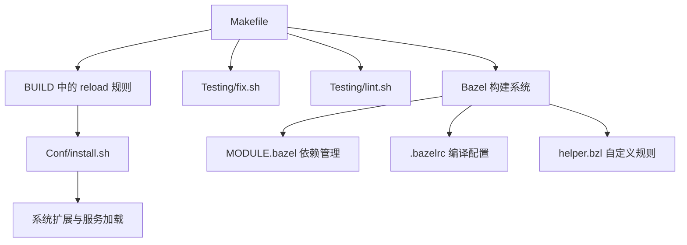
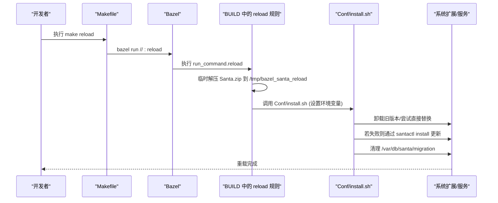
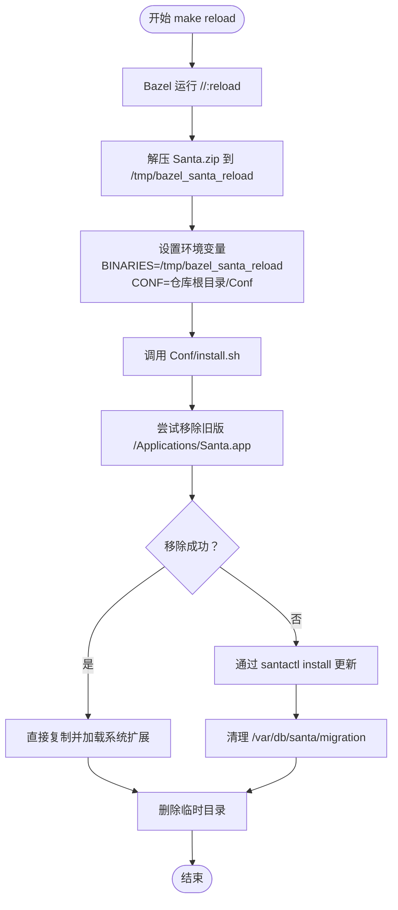
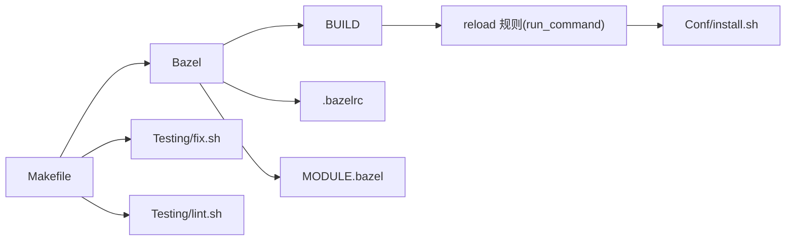

# Makefile使用

<cite>
**本文引用的文件**
- [Makefile](file://Makefile)
- [BUILD](file://BUILD)
- [.bazelrc](file://.bazelrc)
- [MODULE.bazel](file://MODULE.bazel)
- [helper.bzl](file://helper.bzl)
- [Conf/install.sh](file://Conf/install.sh)
- [Conf/install_services.sh](file://Conf/install_services.sh)
- [Testing/fix.sh](file://Testing/fix.sh)
- [Testing/lint.sh](file://Testing/lint.sh)
- [generate_cov.sh](file://generate_cov.sh)
- [docs/docs/development/building.md](file://docs/docs/development/building.md)
</cite>

## 目录
1. [简介](#简介)
2. [项目结构](#项目结构)
3. [核心组件](#核心组件)
4. [架构总览](#架构总览)
5. [详细组件分析](#详细组件分析)
6. [依赖分析](#依赖分析)
7. [性能考虑](#性能考虑)
8. [故障排查指南](#故障排查指南)
9. [结论](#结论)
10. [附录](#附录)

## 简介
本文件面向Santa项目的开发者与维护者，系统性讲解Makefile的使用方式与工作原理，重点覆盖以下方面：
- 各个目标的作用与使用方法：如默认目标、格式化、构建、测试、发布、重载、清理等
- make reload目标的内部工作机制：临时解压、安装脚本调用、清理过程
- 清理目标（make clean、make realclean）的功能与差异
- 如何通过Makefile进行快速开发与测试
- Makefile变量与自定义方法
- Makefile与Bazel构建系统的协作关系与最佳实践

## 项目结构
Santa项目采用Bazel作为主要构建系统，并通过Makefile提供简化的命令入口。Makefile中的大多数目标最终都会委托给Bazel执行，同时提供少量辅助任务（如代码格式化、编译命令生成等）。关键文件与职责如下：
- Makefile：顶层命令入口，封装常用构建、测试、清理、重载等操作
- BUILD：Bazel构建规则定义，包含release打包、reload运行规则、单元测试套件等
- .bazelrc：Bazel全局构建配置，含编译选项、优化级别、sanitizer配置等
- MODULE.bazel：模块依赖声明与覆盖
- helper.bzl：自定义Bazel规则（如run_command）
- Conf/install.sh：安装/更新脚本，由reload流程调用
- Conf/install_services.sh：系统服务安装与加载脚本
- Testing/fix.sh、Testing/lint.sh：代码格式化与静态检查工具
- generate_cov.sh：覆盖率收集脚本

图表来源
- [Makefile](file://Makefile#L1-L40)
- [BUILD](file://BUILD#L94-L111)
- [Conf/install.sh](file://Conf/install.sh#L1-L68)
- [.bazelrc](file://.bazelrc#L1-L68)
- [MODULE.bazel](file://MODULE.bazel#L1-L42)
- [helper.bzl](file://helper.bzl#L1-L64)

章节来源
- [Makefile](file://Makefile#L1-L40)
- [BUILD](file://BUILD#L1-L260)
- [.bazelrc](file://.bazelrc#L1-L68)
- [MODULE.bazel](file://MODULE.bazel#L1-L42)
- [helper.bzl](file://helper.bzl#L1-L64)

## 核心组件
- 默认目标 default：先执行格式化，再执行构建
- 格式化目标 fmt：调用Testing/fix.sh对源码进行格式化与修复
- 构建目标 build：使用Bazel在优化模式下构建GUI组件
- 测试目标 test：在adhoc构建类型下运行单元测试
- 发布相关目标：v2release、v2release-notls、debugrelease、devrelease
- 重载目标 reload：通过Bazel运行reload规则，实现系统扩展与服务的快速重载
- 清理目标：clean、realclean
- 编译命令生成：compile_commands

章节来源
- [Makefile](file://Makefile#L1-L40)

## 架构总览
Makefile作为顶层入口，将用户命令映射到Bazel构建规则或Shell脚本。其中reload目标尤为关键，它通过Bazel的genrule运行Conf/install.sh，完成系统扩展与服务的卸载、安装与加载，从而实现“热重载”。

图表来源
- [Makefile](file://Makefile#L24-L25)
- [BUILD](file://BUILD#L94-L111)
- [Conf/install.sh](file://Conf/install.sh#L1-L68)

## 详细组件分析

### 目标：default（默认）
- 作用：先执行代码格式化，再执行构建
- 命令：make 或 make default
- 行为：依次调用 fmt 和 build

章节来源
- [Makefile](file://Makefile#L1)

### 目标：fmt（格式化）
- 作用：统一代码风格，修复常见问题
- 命令：make fmt
- 行为：调用Testing/fix.sh，对C/C++、Objective-C、Swift、BUILD文件进行格式化与修复

章节来源
- [Makefile](file://Makefile#L3-L4)
- [Testing/fix.sh](file://Testing/fix.sh#L1-L8)

### 目标：build（构建）
- 作用：构建GUI组件（Santa.app）
- 命令：make build
- 行为：Bazel在优化模式下构建Source/gui:Santa

章节来源
- [Makefile](file://Makefile#L6-L7)

### 目标：test（测试）
- 作用：运行单元测试
- 命令：make test
- 行为：Bazel以adhoc构建类型运行单元测试套件，输出错误信息

章节来源
- [Makefile](file://Makefile#L9-L10)

### 目标：v2release、v2release-notls、debugrelease、devrelease（发布）
- 作用：构建不同类型的发布包
- 行为：
  - v2release：启用同步协议v2、生成dSYM、支持arm64与x86_64
  - v2release-notls：禁用TLS
  - debugrelease：开启DEBUG宏与TLS禁用
  - devrelease：标准发布构建
- 特点：均使用优化模式与dSYM生成，支持多架构

章节来源
- [Makefile](file://Makefile#L12-L22)

### 目标：reload（重载）
- 作用：快速重载系统扩展与服务
- 命令：make reload
- 行为：
  - 通过Bazel运行BUILD中的reload规则
  - 临时解压构建产物中的Santa.zip至 /tmp/bazel_santa_reload
  - 设置环境变量后调用Conf/install.sh
  - 清理临时目录
- 注意：需要管理员权限；若系统启用了SIP，可能需要特殊处理

图表来源
- [Makefile](file://Makefile#L24-L25)
- [BUILD](file://BUILD#L94-L111)
- [Conf/install.sh](file://Conf/install.sh#L1-L68)

章节来源
- [Makefile](file://Makefile#L24-L25)
- [BUILD](file://BUILD#L94-L111)
- [Conf/install.sh](file://Conf/install.sh#L1-L68)

### 目标：clean、realclean（清理）
- clean：Bazel清理缓存与中间产物
- realclean：Bazel彻底清理（expunge），清除所有缓存与外部状态
- 使用场景：解决构建异常、重新初始化构建环境

章节来源
- [Makefile](file://Makefile#L27-L31)

### 目标：compile_commands（编译命令生成）
- 作用：为IDE/clangd生成compile_commands.json
- 行为：先构建Source下的目标，再运行refresh_compile_commands生成编译命令文件

章节来源
- [Makefile](file://Makefile#L33-L37)
- [BUILD](file://BUILD#L251-L259)

## 依赖分析
- Makefile依赖于Bazel构建系统，绝大多数目标通过bazel run/build/test等命令实现
- reload目标依赖BUILD中的run_command.reload规则，该规则进一步依赖Conf/install.sh
- Conf/install.sh依赖系统扩展与LaunchAgent/LaunchDaemon的加载/卸载机制
- .bazelrc提供统一的编译选项与sanitizer配置，影响所有构建目标
- MODULE.bazel声明第三方依赖与override，确保构建一致性

图表来源
- [Makefile](file://Makefile#L1-L40)
- [BUILD](file://BUILD#L94-L111)
- [Conf/install.sh](file://Conf/install.sh#L1-L68)
- [.bazelrc](file://.bazelrc#L1-L68)
- [MODULE.bazel](file://MODULE.bazel#L1-L42)

章节来源
- [Makefile](file://Makefile#L1-L40)
- [BUILD](file://BUILD#L1-L260)
- [.bazelrc](file://.bazelrc#L1-L68)
- [MODULE.bazel](file://MODULE.bazel#L1-L42)

## 性能考虑
- 使用优化模式（-c opt）构建可获得更好的运行时性能
- 生成dSYM有助于调试与崩溃分析，但会增加构建时间与产物体积
- 多架构构建（arm64,x86_64）确保兼容性，但会增加编译时间
- 清理缓存（make clean/realclean）可解决构建缓存导致的问题，但会触发全量重建
- 使用compile_commands.json可显著提升IDE体验，减少索引时间

## 故障排查指南
- 权限不足
  - 现象：install.sh提示必须以root运行
  - 处理：使用sudo执行make reload
- SIP限制
  - 现象：无法直接替换系统扩展
  - 处理：通过santactl install进行更新；参考文档说明在特定条件下使用adhoc构建
- dSYM缺失
  - 现象：release目标报错缺少dSYM
  - 处理：确保使用--apple_generate_dsym标志
- 多架构缺失
  - 现象：release目标报错缺少arm64或x86_64切片
  - 处理：确保使用--macos_cpus=arm64,x86_64
- 构建缓存问题
  - 现象：构建结果异常或不一致
  - 处理：执行make realclean后重试

章节来源
- [Conf/install.sh](file://Conf/install.sh#L1-L68)
- [BUILD](file://BUILD#L116-L222)
- [docs/docs/development/building.md](file://docs/docs/development/building.md#L63-L106)

## 结论
Makefile为Santa项目提供了简洁一致的命令入口，将复杂的Bazel构建、测试、安装与重载流程封装为易用的目标。通过合理使用这些目标，开发者可以高效地完成日常开发与测试任务。reload目标是快速迭代的关键，配合Conf/install.sh实现了对系统扩展与服务的自动化重载。建议在开发过程中结合Bazel配置与Makefile目标，形成标准化的开发与发布流程。

## 附录

### Makefile变量与自定义方法
- 可通过Bazel define参数控制构建类型与特性，例如：
  - SANTA_BUILD_TYPE：release/adhoc/debugger
  - 其他宏定义：如DEBUG、SANTA_FORCE_SYNC_V2、SANTA_NATS_DISABLE_TLS
- 可通过Bazel配置文件（.bazelrc）调整编译选项、sanitizer、优化级别等
- 可通过Bazel标签与过滤器选择性运行测试

章节来源
- [BUILD](file://BUILD#L36-L56)
- [.bazelrc](file://.bazelrc#L1-L68)

### 快速开发与测试指南
- 格式化与检查：make fmt；Testing/lint.sh
- 构建GUI：make build
- 运行测试：make test
- 生成IDE编译命令：make compile_commands
- 快速重载：make reload（需管理员权限）

章节来源
- [Makefile](file://Makefile#L1-L40)
- [Testing/lint.sh](file://Testing/lint.sh#L1-L22)

### 与Bazel的协作关系与最佳实践
- 将复杂逻辑封装在BUILD中（如reload规则、release打包、测试套件）
- 使用helper.bzl定义可复用规则（如run_command）
- 通过MODULE.bazel集中管理依赖与override
- 在Makefile中仅保留对外可见的命令入口，避免重复逻辑

章节来源
- [BUILD](file://BUILD#L1-L260)
- [helper.bzl](file://helper.bzl#L1-L64)
- [MODULE.bazel](file://MODULE.bazel#L1-L42)