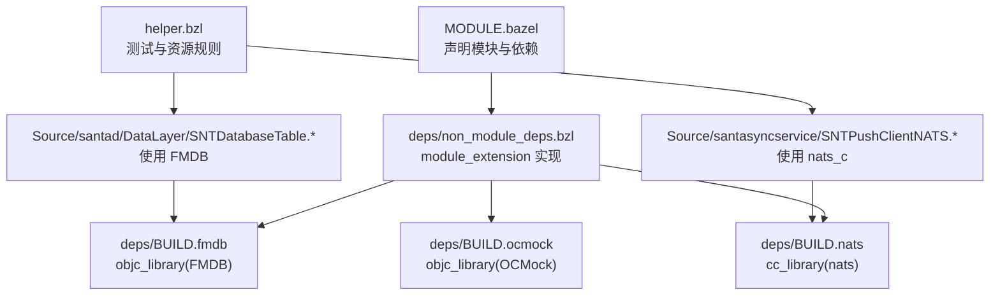
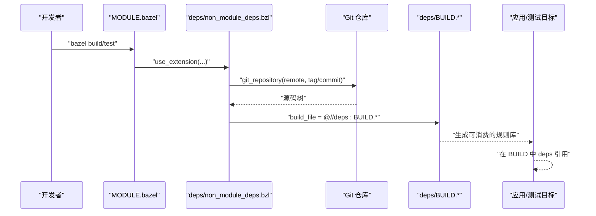
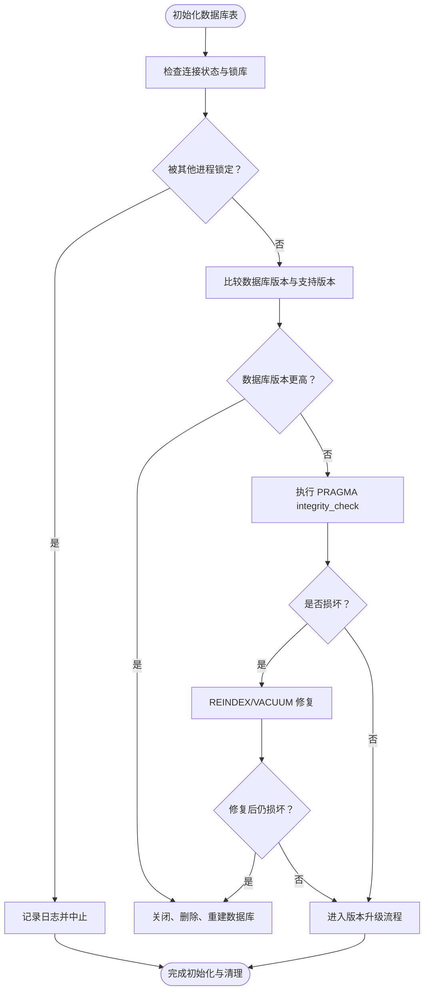
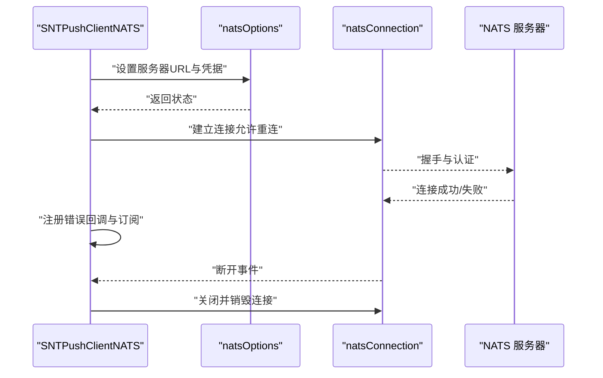
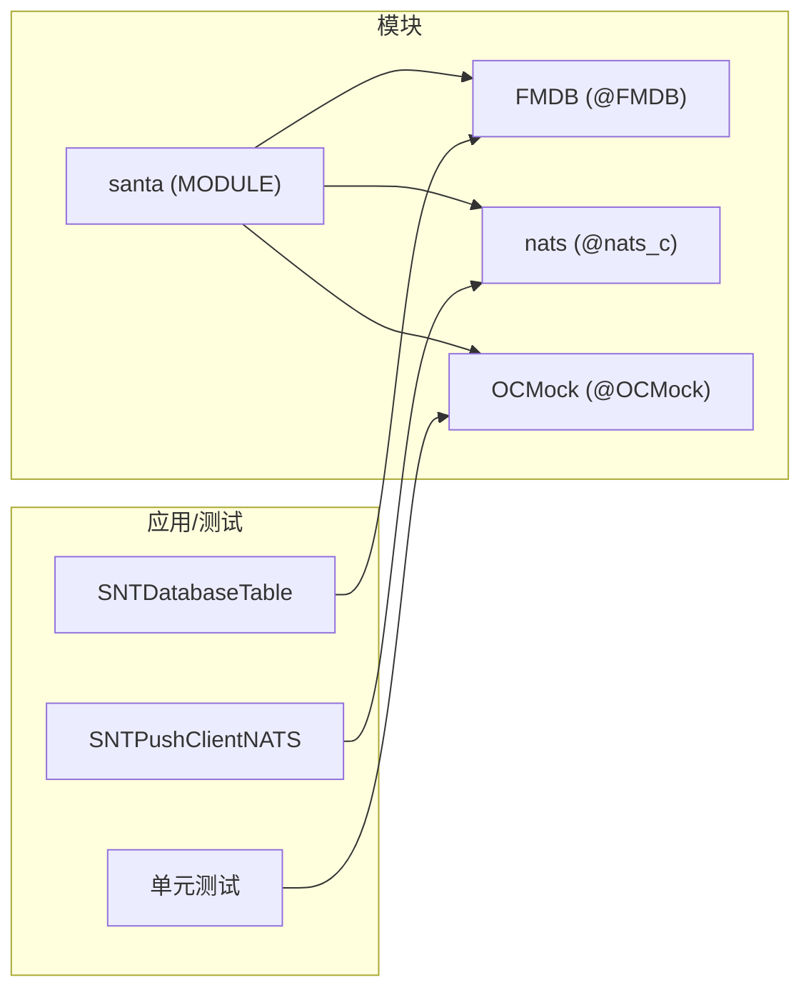

# 依赖管理

<cite>
**本文引用的文件**
- [MODULE.bazel](file://MODULE.bazel)
- [deps/BUILD](file://deps/BUILD)
- [deps/BUILD.fmdb](file://deps/BUILD.fmdb)
- [deps/BUILD.nats](file://deps/BUILD.nats)
- [deps/BUILD.ocmock](file://deps/BUILD.ocmock)
- [deps/non_module_deps.bzl](file://deps/non_module_deps.bzl)
- [Source/santad/DataLayer/SNTDatabaseTable.h](file://Source/santad/DataLayer/SNTDatabaseTable.h)
- [Source/santad/DataLayer/SNTDatabaseTable.mm](file://Source/santad/DataLayer/SNTDatabaseTable.mm)
- [Source/santasyncservice/SNTPushClientNATS.mm](file://Source/santasyncservice/SNTPushClientNATS.mm)
- [Source/santasyncservice/SNTPushClientNATS.h](file://Source/santasyncservice/SNTPushClientNATS.h)
- [Source/santasyncservice/SNTPushClientNATSConnectionTest.mm](file://Source/santasyncservice/SNTPushClientNATSConnectionTest.mm)
- [helper.bzl](file://helper.bzl)
</cite>

## 目录
1. [简介](#简介)
2. [项目结构](#项目结构)
3. [核心组件](#核心组件)
4. [架构总览](#架构总览)
5. [详细组件分析](#详细组件分析)
6. [依赖关系分析](#依赖关系分析)
7. [性能考量](#性能考量)
8. [故障排查指南](#故障排查指南)
9. [结论](#结论)
10. [附录](#附录)

## 简介
本文件系统性梳理 Santa 项目的依赖管理体系，重点覆盖以下方面：
- deps/BUILD 中的通用可见性与许可证声明
- deps/BUILD.fmdb、deps/BUILD.nats、deps/BUILD.ocmock 中第三方库的规则定义与使用方式
- deps/non_module_deps.bzl 中自定义扩展实现对非 Bazel Central Registry 模块的集成
- 内部模块间依赖关系与导入方式（以数据库与同步服务为例）
- 新增第三方依赖与更新现有依赖的操作流程
- 依赖版本管理与兼容性注意事项
- 依赖冲突排查与解决思路
- 模块化依赖系统的设计原则与最佳实践

## 项目结构
Santa 使用 Bzlmod（MODULE.bazel）作为模块化依赖入口，通过 module_extension 将非 BCR 模块注入到工作区。deps 目录下提供各第三方库的 BUILD 规则与仓库镜像配置，配合 helper.bzl 提供测试与资源打包辅助。



图表来源
- [MODULE.bazel](file://MODULE.bazel#L1-L42)
- [deps/non_module_deps.bzl](file://deps/non_module_deps.bzl#L1-L32)
- [deps/BUILD.fmdb](file://deps/BUILD.fmdb#L1-L10)
- [deps/BUILD.nats](file://deps/BUILD.nats#L1-L43)
- [deps/BUILD.ocmock](file://deps/BUILD.ocmock#L1-L17)
- [Source/santad/DataLayer/SNTDatabaseTable.h](file://Source/santad/DataLayer/SNTDatabaseTable.h#L36-L58)
- [Source/santasyncservice/SNTPushClientNATS.mm](file://Source/santasyncservice/SNTPushClientNATS.mm#L335-L440)
- [helper.bzl](file://helper.bzl#L1-L64)

章节来源
- [MODULE.bazel](file://MODULE.bazel#L1-L42)
- [deps/BUILD](file://deps/BUILD#L1-L6)

## 核心组件
- MODULE.bazel：声明官方依赖（abseil-cpp、protobuf、rules_apple 等），并通过 use_extension/use_repo 注入非模块依赖（FMDB、OCMock、nats_c）。同时对 protos 进行 git_override，确保仓库与提交一致性。
- deps/non_module_deps.bzl：定义 module_extension，使用 git_repository 从指定远程仓库拉取源码，绑定各自 BUILD 文件，形成可复用的依赖注册机制。
- deps/BUILD.fmdb：定义 objc_library，暴露 FMDB 头文件与源文件集合，设置 sqlite3 SDK dylib 依赖，公开可见性。
- deps/BUILD.nats：定义 cc_library，聚合 nats.c 的 C 源与头文件，启用 TLS 宏与线程相关编译选项，链接 Security 框架与 pthread，依赖 boringssl 的 ssl/crypto。
- deps/BUILD.ocmock：定义 objc_library，仅用于测试（testonly），包含 OCMock 源与 PCH 预编译头，公开可见性。
- helper.bzl：提供测试与资源打包辅助规则，便于在测试目标中统一组织资源与依赖。

章节来源
- [MODULE.bazel](file://MODULE.bazel#L1-L42)
- [deps/non_module_deps.bzl](file://deps/non_module_deps.bzl#L1-L32)
- [deps/BUILD.fmdb](file://deps/BUILD.fmdb#L1-L10)
- [deps/BUILD.nats](file://deps/BUILD.nats#L1-L43)
- [deps/BUILD.ocmock](file://deps/BUILD.ocmock#L1-L17)
- [helper.bzl](file://helper.bzl#L1-L64)

## 架构总览
下图展示 Santa 项目模块化依赖的装配路径与运行时使用关系：



图表来源
- [MODULE.bazel](file://MODULE.bazel#L1-L42)
- [deps/non_module_deps.bzl](file://deps/non_module_deps.bzl#L1-L32)
- [deps/BUILD.fmdb](file://deps/BUILD.fmdb#L1-L10)
- [deps/BUILD.nats](file://deps/BUILD.nats#L1-L43)
- [deps/BUILD.ocmock](file://deps/BUILD.ocmock#L1-L17)

## 详细组件分析

### 组件一：FMDB（SQLite Objective-C 封装）
- 规则定义要点
  - 类型：objc_library
  - 源与头文件：glob 收集 src/fmdb 下的 .m/.h
  - 包含路径：includes 指向 src
  - 依赖：sdk_dylibs 指向 sqlite3
  - 可见性：公开
- 使用场景
  - 数据层初始化与迁移：通过数据库队列封装执行 SQL，维护 userVersion 并在升级后执行 VACUUM
  - 错误处理：检测锁库、版本不兼容、损坏数据库并进行修复或重建
- 依赖关系
  - 在 MODULE.bazel 中由 non_module_deps 注入为 @FMDB
  - 应用侧通过 deps 引用该标签



图表来源
- [Source/santad/DataLayer/SNTDatabaseTable.mm](file://Source/santad/DataLayer/SNTDatabaseTable.mm#L32-L150)
- [Source/santad/DataLayer/SNTDatabaseTable.h](file://Source/santad/DataLayer/SNTDatabaseTable.h#L36-L58)
- [deps/BUILD.fmdb](file://deps/BUILD.fmdb#L1-L10)

章节来源
- [deps/BUILD.fmdb](file://deps/BUILD.fmdb#L1-L10)
- [Source/santad/DataLayer/SNTDatabaseTable.h](file://Source/santad/DataLayer/SNTDatabaseTable.h#L36-L58)
- [Source/santad/DataLayer/SNTDatabaseTable.mm](file://Source/santad/DataLayer/SNTDatabaseTable.mm#L32-L150)

### 组件二：NATS C 客户端（推送与同步）
- 规则定义要点
  - 类型：cc_library
  - 源与头文件：glob 收集 src 与 include 目录，排除 Windows、GLib、STAN 等平台/子模块
  - 编译宏：启用 TLS 与多线程相关宏
  - 链接：Security 框架与 pthread
  - 依赖：boringssl 的 ssl/crypto
- 使用场景
  - 推送客户端初始化、认证（JWT/NKey）、重连策略、错误回调与订阅管理
  - 测试中使用 OCMock 构造配置器与委托对象，验证连接行为
- 依赖关系
  - 在 MODULE.bazel 中由 non_module_deps 注入为 @nats_c
  - 应用侧通过 deps 引用该标签



图表来源
- [deps/BUILD.nats](file://deps/BUILD.nats#L1-L43)
- [Source/santasyncservice/SNTPushClientNATS.mm](file://Source/santasyncservice/SNTPushClientNATS.mm#L335-L440)
- [Source/santasyncservice/SNTPushClientNATS.h](file://Source/santasyncservice/SNTPushClientNATS.h#L1-L21)
- [deps/BUILD.ocmock](file://deps/BUILD.ocmock#L1-L17)
- [Source/santasyncservice/SNTPushClientNATSConnectionTest.mm](file://Source/santasyncservice/SNTPushClientNATSConnectionTest.mm#L65-L148)

章节来源
- [deps/BUILD.nats](file://deps/BUILD.nats#L1-L43)
- [Source/santasyncservice/SNTPushClientNATS.mm](file://Source/santasyncservice/SNTPushClientNATS.mm#L335-L440)
- [Source/santasyncservice/SNTPushClientNATS.h](file://Source/santasyncservice/SNTPushClientNATS.h#L1-L21)
- [deps/BUILD.ocmock](file://deps/BUILD.ocmock#L1-L17)
- [Source/santasyncservice/SNTPushClientNATSConnectionTest.mm](file://Source/santasyncservice/SNTPushClientNATSConnectionTest.mm#L65-L148)

### 组件三：OCMock（测试替身）
- 规则定义要点
  - 类型：objc_library（testonly）
  - 源与头文件：glob 收集 Source/OCMock 下的 .h/.m
  - 非 ARC 源：non_arc_srcs
  - 预编译头：pch
  - 可见性：公开
- 使用场景
  - 单元测试中构造类与协议替身，模拟外部依赖行为
  - 与 helper.bzl 的测试规则配合，统一资源与依赖组织

章节来源
- [deps/BUILD.ocmock](file://deps/BUILD.ocmock#L1-L17)
- [helper.bzl](file://helper.bzl#L1-L64)

### 组件四：非模块依赖扩展（non_module_deps.bzl）
- 设计与实现
  - 使用 module_extension 定义扩展，内部通过 git_repository 拉取仓库，绑定对应 BUILD 文件
  - 依次注册 FMDB、OCMock、nats_c 三个第三方库
- 版本控制
  - FMDB：以 commit 固定版本
  - OCMock：以 commit 固定版本（对应 tag）
  - nats_c：以 tag 固定版本
- 与 MODULE.bazel 的协作
  - MODULE.bazel 通过 use_extension 调用扩展，再用 use_repo 将仓库暴露为标签

```mermaid
classDiagram
class NonModuleDepsBzl {
+_non_module_deps_impl(ctx)
+non_module_deps(module_extension)
}
class GitRepository {
+name
+remote
+tag/commit
+build_file
}
class FMDB_BUILD
class NATS_BUILD
class OCMOCK_BUILD
NonModuleDepsBzl --> GitRepository : "创建仓库条目"
GitRepository --> FMDB_BUILD : "build_file=@//deps : BUILD.fmdb"
GitRepository --> NATS_BUILD : "build_file=@//deps : BUILD.nats"
GitRepository --> OCMOCK_BUILD : "build_file=@//deps : BUILD.ocmock"
```

图表来源
- [deps/non_module_deps.bzl](file://deps/non_module_deps.bzl#L1-L32)
- [deps/BUILD.fmdb](file://deps/BUILD.fmdb#L1-L10)
- [deps/BUILD.nats](file://deps/BUILD.nats#L1-L43)
- [deps/BUILD.ocmock](file://deps/BUILD.ocmock#L1-L17)

章节来源
- [deps/non_module_deps.bzl](file://deps/non_module_deps.bzl#L1-L32)
- [MODULE.bazel](file://MODULE.bazel#L1-L42)

## 依赖关系分析
- 模块化装配链路
  - MODULE.bazel 声明官方依赖与 override
  - non_module_deps.bzl 通过 git_repository 注入第三方源码树
  - 各 BUILD 文件定义规则，供应用/测试目标在 deps 中引用
- 内部模块依赖
  - 数据层（SNTDatabaseTable）依赖 FMDB（objc_library）
  - 同步服务（SNTPushClientNATS）依赖 nats_c（cc_library），并间接依赖 boringssl（由 nats BUILD 指定）
  - 测试目标可选择性依赖 OCMock（testonly）



图表来源
- [MODULE.bazel](file://MODULE.bazel#L1-L42)
- [deps/BUILD.fmdb](file://deps/BUILD.fmdb#L1-L10)
- [deps/BUILD.nats](file://deps/BUILD.nats#L1-L43)
- [deps/BUILD.ocmock](file://deps/BUILD.ocmock#L1-L17)
- [Source/santad/DataLayer/SNTDatabaseTable.h](file://Source/santad/DataLayer/SNTDatabaseTable.h#L36-L58)
- [Source/santasyncservice/SNTPushClientNATS.h](file://Source/santasyncservice/SNTPushClientNATS.h#L1-L21)

章节来源
- [MODULE.bazel](file://MODULE.bazel#L1-L42)
- [deps/BUILD.fmdb](file://deps/BUILD.fmdb#L1-L10)
- [deps/BUILD.nats](file://deps/BUILD.nats#L1-L43)
- [deps/BUILD.ocmock](file://deps/BUILD.ocmock#L1-L17)
- [Source/santad/DataLayer/SNTDatabaseTable.h](file://Source/santad/DataLayer/SNTDatabaseTable.h#L36-L58)
- [Source/santasyncservice/SNTPushClientNATS.h](file://Source/santasyncservice/SNTPushClientNATS.h#L1-L21)

## 性能考量
- 编译优化
  - nats BUILD 显式定义 copts/linkopts，减少无关函数/变量告警并链接 pthread，有助于运行时并发与稳定性
- 运行时优化
  - 数据库升级后执行 VACUUM，降低碎片与查询成本
- 资源与测试
  - helper.bzl 将资源与测试目标解耦，避免重复构建与不必要的链接

章节来源
- [deps/BUILD.nats](file://deps/BUILD.nats#L1-L43)
- [Source/santad/DataLayer/SNTDatabaseTable.mm](file://Source/santad/DataLayer/SNTDatabaseTable.mm#L120-L148)
- [helper.bzl](file://helper.bzl#L1-L64)

## 故障排查指南
- 版本不匹配
  - 现象：构建失败或运行时崩溃
  - 排查：确认 MODULE.bazel 中的 tag/commit 与 deps/non_module_deps.bzl 是否一致；若更新了 tag/commit，需同步修改双方
- 链接问题
  - 现象：找不到符号或链接错误
  - 排查：检查 nats BUILD 的 linkopts 与 includes；确认依赖的 boringssl ssl/crypto 已正确解析
- 测试依赖缺失
  - 现象：测试无法编译或运行
  - 排查：确认 OCMock 为 testonly 且仅在测试目标中使用；确保 helper.bzl 的测试规则已正确组织资源
- 数据库异常
  - 现象：锁库、版本不兼容、损坏
  - 排查：依据 SNTDatabaseTable 的日志与流程，确认是否触发了重建或修复逻辑

章节来源
- [deps/non_module_deps.bzl](file://deps/non_module_deps.bzl#L1-L32)
- [deps/BUILD.nats](file://deps/BUILD.nats#L1-L43)
- [deps/BUILD.ocmock](file://deps/BUILD.ocmock#L1-L17)
- [Source/santad/DataLayer/SNTDatabaseTable.mm](file://Source/santad/DataLayer/SNTDatabaseTable.mm#L32-L150)
- [helper.bzl](file://helper.bzl#L1-L64)

## 结论
Santa 的依赖管理采用 Bzlmod + module_extension 的模块化方案，将非 BCR 第三方库以受控方式注入工作区。通过 deps 目录下的 BUILD 文件明确声明规则与可见性，结合 helper.bzl 的测试辅助，实现了清晰、可维护、可复现的依赖体系。建议在新增或更新依赖时，严格遵循“固定版本 + 同步变更”的流程，确保构建稳定性与可追溯性。

## 附录

### 如何添加新的第三方依赖
- 步骤
  - 在 deps/non_module_deps.bzl 中新增 git_repository 条目，指定 remote、tag/commit、build_file
  - 在 deps/BUILD 中编写对应规则（objc_library 或 cc_library），设置 includes、hdrs、srcs、deps、linkopts 等
  - 在 MODULE.bazel 中通过 use_extension/use_repo 将新仓库暴露为标签
  - 在应用/测试 BUILD 中 deps 引用新标签
- 注意事项
  - 优先使用 tag/commit 固定版本，避免漂移
  - 控制 includes 与 glob 范围，减少无关文件参与编译
  - 对于测试专用库（如 OCMock），保持 testonly 并仅在测试目标中使用

章节来源
- [deps/non_module_deps.bzl](file://deps/non_module_deps.bzl#L1-L32)
- [deps/BUILD.fmdb](file://deps/BUILD.fmdb#L1-L10)
- [deps/BUILD.nats](file://deps/BUILD.nats#L1-L43)
- [deps/BUILD.ocmock](file://deps/BUILD.ocmock#L1-L17)
- [MODULE.bazel](file://MODULE.bazel#L1-L42)

### 更新现有依赖版本
- 步骤
  - 在 deps/non_module_deps.bzl 中更新对应仓库的 tag/commit
  - 若 BUILD 文件有变更，同步调整 includes、deps、defines、linkopts 等
  - 在 MODULE.bazel 中重新 use_repo，确保标签映射正确
  - 全量构建与测试，验证兼容性
- 兼容性建议
  - 关注第三方库的 API 变更与废弃项
  - 对于 TLS/安全相关库，关注证书与算法兼容性

章节来源
- [deps/non_module_deps.bzl](file://deps/non_module_deps.bzl#L1-L32)
- [deps/BUILD.nats](file://deps/BUILD.nats#L1-L43)
- [MODULE.bazel](file://MODULE.bazel#L1-L42)

### 设计原则与最佳实践
- 固定版本与可追溯：所有外部依赖均以 tag/commit 明确标识
- 规则最小化：BUILD 文件仅包含必要源与头文件，避免冗余
- 可见性控制：公共库设为公开，测试库设为 testonly
- 模块化装配：通过 module_extension 统一注入，集中管理
- 测试隔离：测试资源与业务代码分离，减少耦合

章节来源
- [deps/BUILD](file://deps/BUILD#L1-L6)
- [deps/BUILD.fmdb](file://deps/BUILD.fmdb#L1-L10)
- [deps/BUILD.nats](file://deps/BUILD.nats#L1-L43)
- [deps/BUILD.ocmock](file://deps/BUILD.ocmock#L1-L17)
- [helper.bzl](file://helper.bzl#L1-L64)