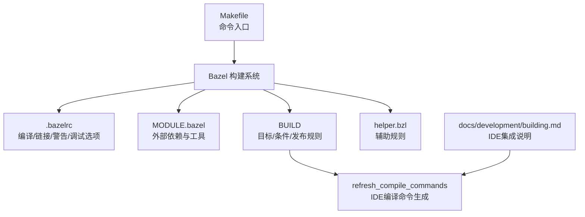
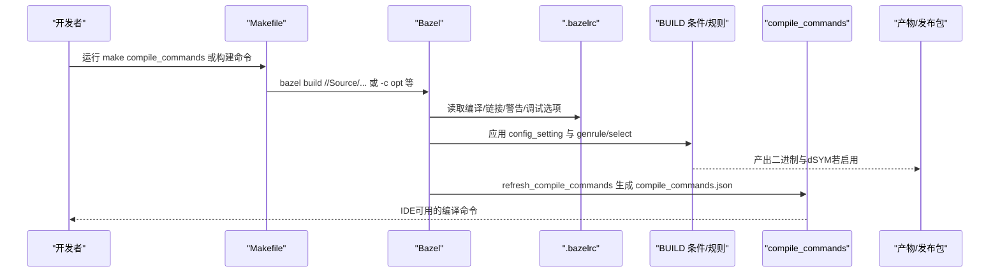
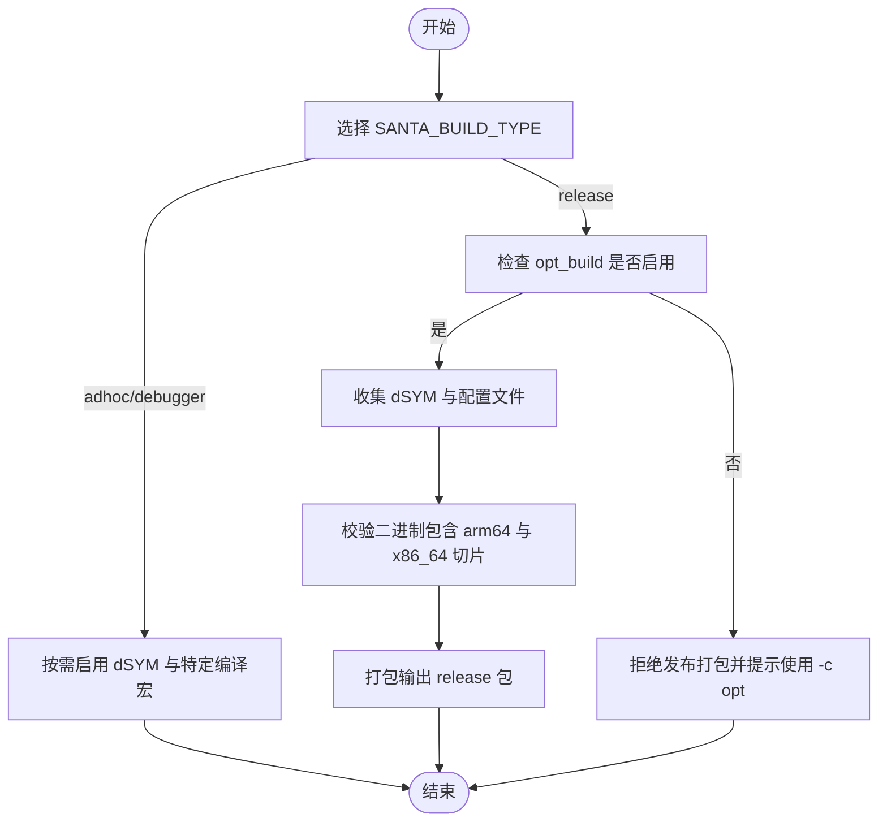
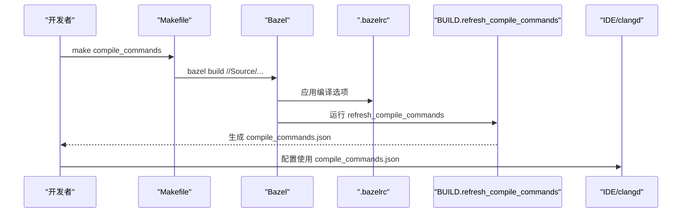
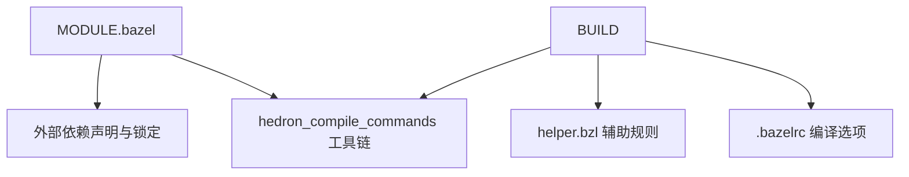

# 构建优化

<cite>
**本文引用的文件**
- [Makefile](file://Makefile)
- [.bazelrc](file://.bazelrc)
- [MODULE.bazel](file://MODULE.bazel)
- [BUILD](file://BUILD)
- [helper.bzl](file://helper.bzl)
- [docs/development/building.md](file://docs/docs/development/building.md)
- [generate_cov.sh](file://generate_cov.sh)
- [Testing/clang_analyzer/run_clang_analyzer.sh](file://Testing/clang_analyzer/run_clang_analyzer.sh)
</cite>

## 目录
1. [简介](#简介)
2. [项目结构](#项目结构)
3. [核心组件](#核心组件)
4. [架构总览](#架构总览)
5. [详细组件分析](#详细组件分析)
6. [依赖关系分析](#依赖关系分析)
7. [性能考量](#性能考量)
8. [故障排查指南](#故障排查指南)
9. [结论](#结论)
10. [附录](#附录)

## 简介
本文件面向Santa项目的构建优化，聚焦以下主题：
- 不同构建模式与SANTA_BUILD_TYPE类型的配置与选择
- 构建缓存与增量构建的工作原理
- 并行构建配置与加速策略
- 编译命令生成与IDE集成（refresh_compile_commands）
- 构建性能分析与瓶颈识别方法
- 构建时间优化技巧与配置建议
- dSYM生成与符号文件处理对构建性能的影响

## 项目结构
Santa使用Bazel作为构建系统，并通过顶层Makefile提供常用命令入口；.bazelrc集中定义编译选项与sanitizer配置；MODULE.bazel声明外部依赖与compile_commands提取器；BUILD文件定义目标、条件配置与发布打包规则；helper.bzl提供辅助规则；开发文档说明IDE集成流程。

图表来源
- [Makefile](file://Makefile#L1-L40)
- [.bazelrc](file://.bazelrc#L1-L68)
- [MODULE.bazel](file://MODULE.bazel#L1-L42)
- [BUILD](file://BUILD#L1-L260)
- [helper.bzl](file://helper.bzl#L1-L64)
- [docs/development/building.md](file://docs/docs/development/building.md#L93-L106)

章节来源
- [Makefile](file://Makefile#L1-L40)
- [.bazelrc](file://.bazelrc#L1-L68)
- [MODULE.bazel](file://MODULE.bazel#L1-L42)
- [BUILD](file://BUILD#L1-L260)
- [helper.bzl](file://helper.bzl#L1-L64)
- [docs/development/building.md](file://docs/docs/development/building.md#L93-L106)

## 核心组件
- 构建模式与SANTA_BUILD_TYPE
  - SANTA_BUILD_TYPE支持release、adhoc、debugger三种类型，通过config_setting在BUILD中进行条件选择。
  - opt_build用于检测是否为优化构建（-c opt），release目标在非opt_build下会拒绝打包。
- 发布与符号文件
  - release目标在opt_build条件下收集各组件的dSYM目录，缺失则报错；同时校验二进制包含arm64与x86_64切片。
  - .bazelrc默认启用--apple_generate_dsym，确保dSYM生成。
- 编译命令与IDE集成
  - 使用hedron_compile_commands工具链，BUILD中通过refresh_compile_commands规则生成compile_commands.json供clangd等IDE使用。
  - Makefile提供compile_commands目标，先构建Source域目标，再运行refresh_compile_commands。
- 测试与覆盖率
  - generate_cov.sh演示了覆盖率收集与合并策略，便于定位热点与低覆盖区域。
- 性能相关编译选项
  - .bazelrc设置C++标准、警告等级、per_file_copt策略、sanitizer配置等，影响编译速度与产物质量。

章节来源
- [BUILD](file://BUILD#L35-L63)
- [BUILD](file://BUILD#L116-L222)
- [.bazelrc](file://.bazelrc#L1-L20)
- [BUILD](file://BUILD#L251-L260)
- [Makefile](file://Makefile#L33-L38)
- [generate_cov.sh](file://generate_cov.sh#L1-L29)

## 架构总览
下图展示从开发者命令到最终产物的关键路径，包括构建模式选择、条件判断、符号文件生成与IDE命令文件生成。

图表来源
- [Makefile](file://Makefile#L33-L38)
- [.bazelrc](file://.bazelrc#L1-L20)
- [BUILD](file://BUILD#L251-L260)
- [docs/development/building.md](file://docs/docs/development/building.md#L93-L106)

## 详细组件分析

### 组件A：构建模式与SANTA_BUILD_TYPE
- 模式定义
  - SANTA_BUILD_TYPE=release：生产发布构建，配合opt_build与--apple_generate_dsym，release目标校验产物完整性。
  - SANTA_BUILD_TYPE=adhoc：用于CI或禁用SIP场景的开发/测试构建，可通过命令行传入。
  - SANTA_BUILD_TYPE=debugger：带调试能力的签名构建，适用于启用SIP时的现场调试。
- 规则与选择
  - BUILD中通过config_setting匹配define值，控制release目标的select分支与opt_build检测。
  - Makefile示例展示了不同变体（如v2release、v2release-notls、debugrelease、devrelease）的组合参数。

图表来源
- [BUILD](file://BUILD#L35-L63)
- [BUILD](file://BUILD#L116-L222)
- [Makefile](file://Makefile#L12-L22)

章节来源
- [BUILD](file://BUILD#L35-L63)
- [BUILD](file://BUILD#L116-L222)
- [Makefile](file://Makefile#L12-L22)

### 组件B：构建缓存与增量构建
- 缓存与可重现性
  - .bazelrc设置strip策略与sanitizer相关选项，影响产物与缓存命中率。
  - Bazel默认追求可重现性，但某些场景（如覆盖率、sanitizer）需要调整以平衡性能与诊断能力。
- 增量构建要点
  - 仅变更源文件与直接依赖受影响的目标会被重新编译。
  - 外部依赖通过MODULE.bazel锁定版本，减少不必要的重构建。
- dSYM与缓存
  - 启用--apple_generate_dsym会增加编译/链接时间，但有利于发布与问题定位；release目标会收集dSYM，未生成将导致失败。

章节来源
- [.bazelrc](file://.bazelrc#L37-L67)
- [MODULE.bazel](file://MODULE.bazel#L1-L42)
- [BUILD](file://BUILD#L1-L20)
- [BUILD](file://BUILD#L116-L222)

### 组件C：并行构建与加速策略
- 并行度与资源
  - 可通过Bazel内置的并行调度与本地CPU核数利用提升速度；仓库未显式设置并行参数，建议结合实际机器核数与磁盘I/O情况评估。
- 依赖与任务粒度
  - 将大目标拆分为更细粒度的库与测试，有助于并行化与缓存复用。
- 覆盖率与诊断
  - generate_cov.sh演示了覆盖率收集策略，可在CI中开启以发现热点与回归点，间接指导优化方向。

章节来源
- [generate_cov.sh](file://generate_cov.sh#L1-L29)

### 组件D：编译命令生成与IDE集成
- 工具链
  - MODULE.bazel引入hedron_compile_commands工具链，用于抽取编译命令。
- 规则与流程
  - BUILD中refresh_compile_commands规则指定目标范围，避免非Source域目标干扰生成过程。
  - Makefile提供compile_commands目标：先构建Source域目标，再运行refresh_compile_commands生成compile_commands.json。
- IDE配置
  - 文档说明如何使用该json文件配置clangd以获得更好的补全与跳转体验。

图表来源
- [Makefile](file://Makefile#L33-L38)
- [BUILD](file://BUILD#L251-L260)
- [MODULE.bazel](file://MODULE.bazel#L31-L41)
- [docs/development/building.md](file://docs/docs/development/building.md#L93-L106)

章节来源
- [Makefile](file://Makefile#L33-L38)
- [BUILD](file://BUILD#L251-L260)
- [MODULE.bazel](file://MODULE.bazel#L31-L41)
- [docs/development/building.md](file://docs/docs/development/building.md#L93-L106)

### 组件E：构建性能分析与瓶颈识别
- 静态分析
  - Testing/clang_analyzer/run_clang_analyzer.sh演示了analyze-build与compile_commands.json的结合，可用于静态分析与潜在问题定位。
- 动态分析
  - generate_cov.sh展示了覆盖率收集流程，可辅助识别热点路径与低覆盖区域，指导针对性优化。
- 日志与诊断
  - .bazelrc中的sanitizer配置（asan/tsan/ubsan）可帮助定位并发与内存问题，但会增加构建与运行开销。

章节来源
- [Testing/clang_analyzer/run_clang_analyzer.sh](file://Testing/clang_analyzer/run_clang_analyzer.sh#L1-L15)
- [generate_cov.sh](file://generate_cov.sh#L1-L29)
- [.bazelrc](file://.bazelrc#L37-L67)

### 组件F：dSYM生成与符号文件处理
- 生成策略
  - .bazelrc默认启用--apple_generate_dsym，确保dSYM随构建产生。
  - release目标会收集各组件的dSYM目录，缺失则报错，保证发布包具备完整符号信息。
- 对性能的影响
  - dSYM生成会增加编译/链接时间与产物体积；在CI中可按需启用，开发阶段建议保留以便调试。
- 产物校验
  - release目标还会校验二进制包含arm64与x86_64切片，确保兼容性。

章节来源
- [.bazelrc](file://.bazelrc#L1-L2)
- [BUILD](file://BUILD#L116-L222)

## 依赖关系分析
- 外部依赖管理
  - MODULE.bazel声明核心依赖（abseil、protobuf、rules_apple、rules_swift等）与非中央注册仓库依赖（FMDB、OCMock、nats_c），并通过git_override锁定版本。
- 工具链依赖
  - hedron_compile_commands工具链用于生成compile_commands.json，被BUILD中的refresh_compile_commands规则使用。
- 内部规则依赖
  - helper.bzl提供run_command与santa_unit_test等辅助规则，简化构建与测试流程。

图表来源
- [MODULE.bazel](file://MODULE.bazel#L1-L42)
- [BUILD](file://BUILD#L1-L20)
- [helper.bzl](file://helper.bzl#L1-L64)
- [.bazelrc](file://.bazelrc#L1-L20)

章节来源
- [MODULE.bazel](file://MODULE.bazel#L1-L42)
- [BUILD](file://BUILD#L1-L20)
- [helper.bzl](file://helper.bzl#L1-L64)
- [.bazelrc](file://.bazelrc#L1-L20)

## 性能考量
- 编译选项与警告
  - .bazelrc统一设置C++标准与警告等级，per_file_copt对特定子模块放宽警告，有助于减少告警噪声并保持编译稳定性。
- Sanitizer与诊断
  - sanitizer配置（asan/tsan/ubsan）可显著增加编译与运行成本，建议仅在问题定位阶段启用。
- dSYM与产物体积
  - dSYM生成提升调试能力，但会增加时间与空间开销；发布前务必启用以满足分发要求。
- 并行与任务粒度
  - 合理拆分目标、减少跨模块耦合，有助于提升并行度与缓存命中率。

章节来源
- [.bazelrc](file://.bazelrc#L1-L20)
- [.bazelrc](file://.bazelrc#L37-L67)
- [BUILD](file://BUILD#L116-L222)

## 故障排查指南
- 发布包构建失败
  - 症状：release目标拒绝打包或缺少dSYM。
  - 排查：确认使用了--apple_generate_dsym与-с opt；检查各组件是否生成对应dSYM；确保二进制包含arm64与x86_64切片。
- IDE无法获取编译命令
  - 症状：clangd无自动补全或跳转。
  - 排查：执行make compile_commands；确认生成的compile_commands.json存在且路径正确；按文档配置IDE使用该文件。
- 覆盖率报告异常
  - 症状：覆盖率数据不完整或路径不匹配。
  - 排查：参考generate_cov.sh的清理与过滤逻辑，确保执行根路径与输出路径一致；检查spawn_strategy与test_output配置。
- Sanitizer导致构建缓慢或失败
  - 症状：构建时间过长或运行期崩溃。
  - 排查：确认sanitizer配置仅在必要时启用；检查ASAN_OPTIONS/TSAN_OPTIONS/UBSAN_OPTIONS环境变量。

章节来源
- [BUILD](file://BUILD#L116-L222)
- [Makefile](file://Makefile#L33-L38)
- [docs/development/building.md](file://docs/docs/development/building.md#L93-L106)
- [generate_cov.sh](file://generate_cov.sh#L1-L29)
- [.bazelrc](file://.bazelrc#L37-L67)

## 结论
Santa的构建体系围绕Bazel展开，通过config_setting与条件规则实现多构建模式切换；借助hedron_compile_commands实现IDE友好；通过opt_build与dSYM策略保障发布质量。性能优化应综合考虑编译选项、sanitizer启用策略、并行度与任务粒度，并结合覆盖率与静态分析工具持续迭代。

## 附录
- 常用命令速查
  - 构建GUI应用：make build
  - 运行单元测试（adhoc模式）：make test
  - 生成发布包（含dSYM与多架构校验）：bazel build -c opt //:release
  - 生成编译命令文件：make compile_commands
  - 清理缓存：make clean / make realclean

章节来源
- [Makefile](file://Makefile#L1-L40)
- [BUILD](file://BUILD#L116-L222)
- [docs/development/building.md](file://docs/docs/development/building.md#L93-L106)