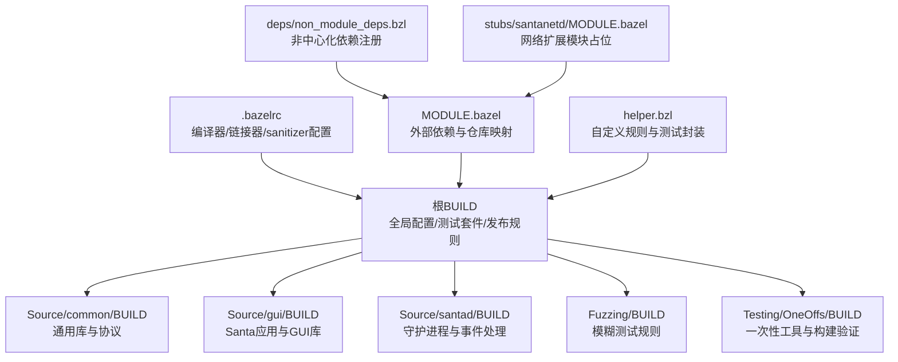
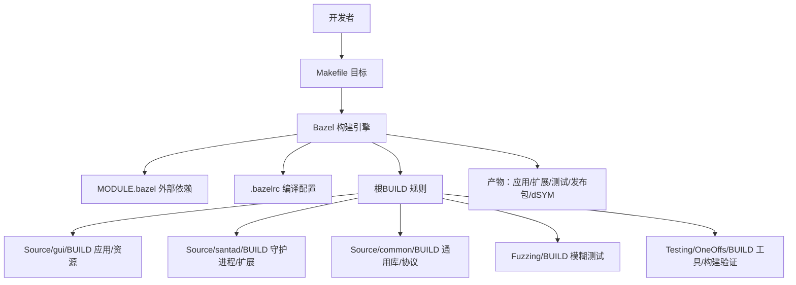
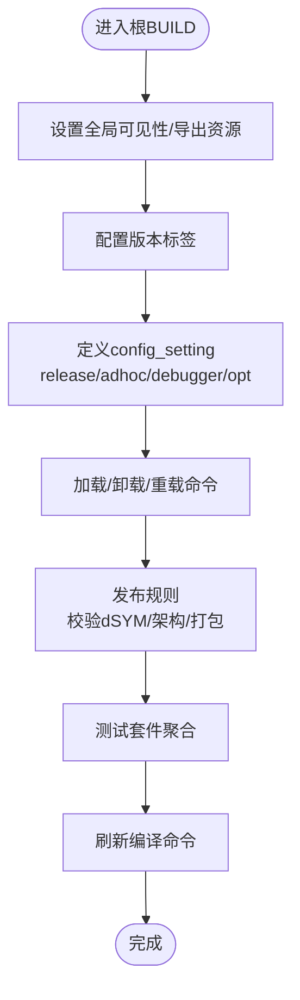
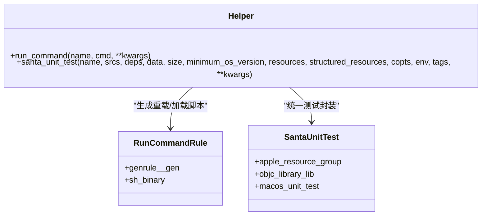
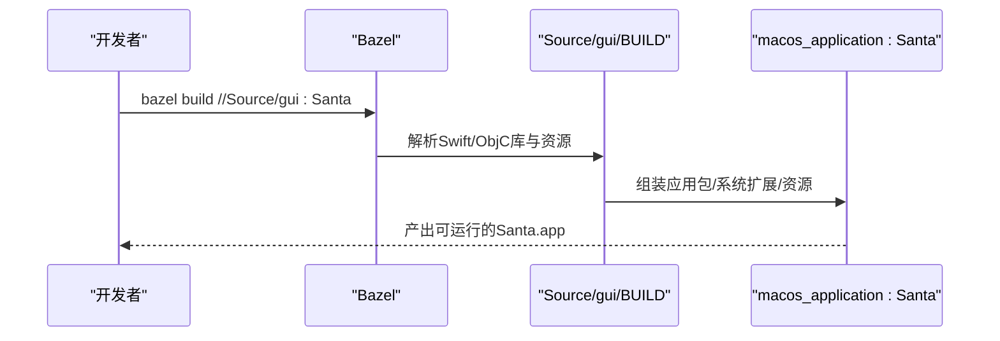
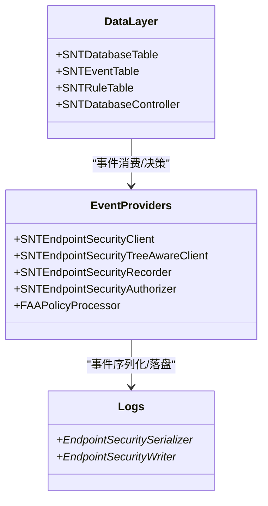
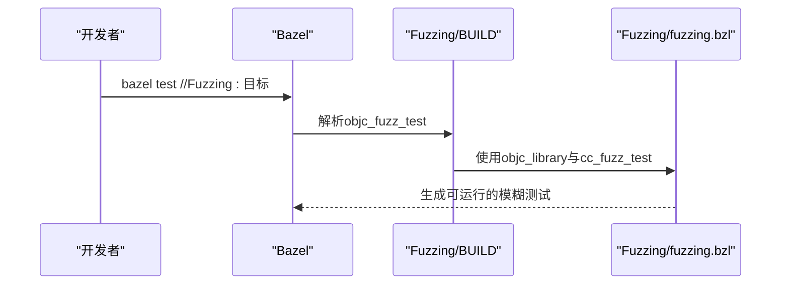
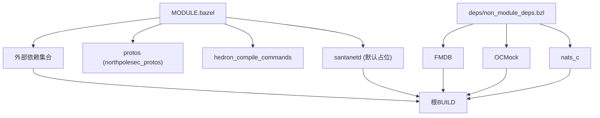

# 构建系统

<cite>
**本文引用的文件**
- [Makefile](file://Makefile)
- [.bazelrc](file://.bazelrc)
- [MODULE.bazel](file://MODULE.bazel)
- [BUILD（根）](file://BUILD)
- [helper.bzl](file://helper.bzl)
- [Source/common/BUILD](file://Source/common/BUILD)
- [Source/gui/BUILD](file://Source/gui/BUILD)
- [Source/santad/BUILD](file://Source/santad/BUILD)
- [Fuzzing/BUILD](file://Fuzzing/BUILD)
- [Fuzzing/fuzzing.bzl](file://Fuzzing/fuzzing.bzl)
- [deps/non_module_deps.bzl](file://deps/non_module_deps.bzl)
- [Testing/OneOffs/BUILD](file://Testing/OneOffs/BUILD)
- [Testing/lint.sh](file://Testing/lint.sh)
- [Testing/fix.sh](file://Testing/fix.sh)
- [stubs/santanetd/MODULE.bazel](file://stubs/santanetd/MODULE.bazel)
- [stubs/santanetd/README.md](file://stubs/santanetd/README.md)
- [Source/santasyncservice/SNTSyncEventUpload.mm](file://Source/santasyncservice/SNTSyncEventUpload.mm)
</cite>

## 目录
1. [简介](#简介)
2. [项目结构](#项目结构)
3. [核心组件](#核心组件)
4. [架构总览](#架构总览)
5. [详细组件分析](#详细组件分析)
6. [依赖分析](#依赖分析)
7. [性能考虑](#性能考虑)
8. [故障排查指南](#故障排查指南)
9. [结论](#结论)
10. [附录](#附录)

## 简介
本文件面向Santa项目的构建系统，系统性梳理Bazel构建体系与Makefile辅助工具的使用方式，覆盖以下主题：
- Bazel工作原理与配置要点：规则类型、配置项、构建目标与产物组织
- BUILD文件结构与规则定义：可执行文件、库文件、资源文件、测试套件与生成规则
- Makefile常用目标：构建、测试、打包、重载、清理与编译命令生成
- 依赖管理：外部依赖（MODULE.bazel）与内部模块依赖（跨包可见性）
- 构建配置选项：SANTA_BUILD_TYPE与编译模式对产物的影响
- 构建优化与并行：编译器选项、并行度、缓存与增量构建
- 构建缓存与增量构建：Bazel缓存、dSYM生成、产物一致性
- 调试与常见问题：日志、sanitizer、常见错误定位与修复
- 新增内容：模块化网络功能支持（santanetd stub）与代码签名时间戳字段在事件上传中的使用

## 项目结构
Santa采用Bazel作为主构建系统，并通过Makefile提供便捷的目标封装。仓库中各子系统（GUI、守护进程、指标服务、同步服务、通用库、模糊测试等）均在独立的BUILD文件中声明规则；根BUILD负责全局配置、版本标签、测试套件与发布打包流程。

图表来源
- [BUILD（根）](file://BUILD#L1-L260)
- [Source/common/BUILD](file://Source/common/BUILD#L1-L120)
- [Source/gui/BUILD](file://Source/gui/BUILD#L1-L200)
- [Source/santad/BUILD](file://Source/santad/BUILD#L1-L120)
- [Fuzzing/BUILD](file://Fuzzing/BUILD#L1-L12)
- [Testing/OneOffs/BUILD](file://Testing/OneOffs/BUILD#L1-L77)
- [.bazelrc](file://.bazelrc#L1-L68)
- [MODULE.bazel](file://MODULE.bazel#L1-L51)
- [helper.bzl](file://helper.bzl#L1-L64)
- [deps/non_module_deps.bzl](file://deps/non_module_deps.bzl#L1-L32)
- [stubs/santanetd/MODULE.bazel](file://stubs/santanetd/MODULE.bazel#L1-L4)

章节来源
- [Makefile](file://Makefile#L1-L40)
- [.bazelrc](file://.bazelrc#L1-L68)
- [MODULE.bazel](file://MODULE.bazel#L1-L51)
- [BUILD（根）](file://BUILD#L1-L260)
- [helper.bzl](file://helper.bzl#L1-L64)

## 核心组件
- 根BUILD：定义全局可见性、版本标签、配置开关、加载/卸载/重载命令、发布打包与测试套件、编译命令刷新
- helper.bzl：提供run_command与santa_unit_test等自定义规则，统一测试与脚本生成
- 各模块BUILD：按功能划分，声明objc/swift/cc库、macOS应用/系统扩展、单元测试与模糊测试
- MODULE.bazel：声明外部依赖与仓库映射，含protos、FMDB、OCMock、nats_c等；并引入santanetd占位模块
- .bazelrc：统一编译器选项、sanitizer配置、Swift/C++互操作设置
- Makefile：封装常用构建、测试、打包、重载、清理与compile_commands生成

章节来源
- [BUILD（根）](file://BUILD#L1-L260)
- [helper.bzl](file://helper.bzl#L1-L64)
- [MODULE.bazel](file://MODULE.bazel#L1-L51)
- [.bazelrc](file://.bazelrc#L1-L68)
- [Makefile](file://Makefile#L1-L40)

## 架构总览
下图展示Santa构建系统的高层交互：开发者通过Makefile调用Bazel，Bazel依据MODULE.bazel解析外部依赖，根据各BUILD文件定义的规则构建产物，最终生成应用、系统扩展与发布包。

图表来源
- [Makefile](file://Makefile#L1-L40)
- [.bazelrc](file://.bazelrc#L1-L68)
- [MODULE.bazel](file://MODULE.bazel#L1-L51)
- [BUILD（根）](file://BUILD#L1-L260)
- [Source/gui/BUILD](file://Source/gui/BUILD#L1-L200)
- [Source/santad/BUILD](file://Source/santad/BUILD#L1-L120)
- [Source/common/BUILD](file://Source/common/BUILD#L1-L120)
- [Fuzzing/BUILD](file://Fuzzing/BUILD#L1-L12)
- [Testing/OneOffs/BUILD](file://Testing/OneOffs/BUILD#L1-L77)

## 详细组件分析

### 根BUILD（全局配置与发布）
- 全局可见性与导出文件：通过package_group与exports_files确保安装脚本与plist等资源可被发布流程使用
- 版本标签：apple_bundle_version用于生成bundle版本信息
- 配置开关：基于--define与--compilation_mode的config_setting，区分release/adhoc/debugger与opt构建
- 加载/卸载/重载：run_command生成可执行脚本，支持系统扩展与服务的卸载、加载与重载
- 发布规则：genrule组合二进制、配置与dSYM，校验fat二进制架构并输出tar.gz
- 测试套件：test_suite聚合多模块单元测试，另含一次性构建验证目标
- 编译命令刷新：refresh_compile_commands仅针对Source目录生成compile_commands.json

图表来源
- [BUILD（根）](file://BUILD#L1-L260)

章节来源
- [BUILD（根）](file://BUILD#L1-L260)

### helper.bzl（自定义规则与测试封装）
- run_command：生成可执行脚本并包装为sh_binary，便于在Bazel中以规则形式运行
- santa_unit_test：封装objc_library与macos_unit_test，自动注入资源组、最小系统版本、环境变量与标签

图表来源
- [helper.bzl](file://helper.bzl#L1-L64)

章节来源
- [helper.bzl](file://helper.bzl#L1-L64)

### Source/common/BUILD（通用库与协议）
- 协议与生成库：proto_library与cc_proto_library，配合include wrapper供ObjC使用
- 常用工具库：字符串、压缩、证书、签名标识、缓存、定时器、设备事件、规则模型等
- 单元测试：大量santa_unit_test目标，覆盖核心数据结构与算法

图表来源
- [Source/common/BUILD](file://Source/common/BUILD#L1-L120)

章节来源
- [Source/common/BUILD](file://Source/common/BUILD#L1-L200)

### Source/gui/BUILD（Santa应用与GUI库）
- Swift库：消息视图、关于窗口、文件信息、二进制/设备/文件访问/网络挂载消息窗口
- ObjC库：应用委托、控制器、通知管理、入口main.mm
- macos_application：Santa应用，配置Info.plist、图标、字符串、最低系统版本、entitlements与provisioning profile
- 测试：SNTNotificationManagerTest

图表来源
- [Source/gui/BUILD](file://Source/gui/BUILD#L1-L200)

章节来源
- [Source/gui/BUILD](file://Source/gui/BUILD#L1-L252)

### Source/santad/BUILD（守护进程与事件处理）
- 数据层：数据库表、事件表、规则表、数据库控制器
- 事件处理：EndpointSecurity客户端、树感知客户端、记录器、授权器、策略处理器、速率限制、结果缓存
- 日志序列化：多种序列化器（基础字符串、Protobuf、空实现）与写入器（文件、syslog）
- 测试：覆盖通知队列、同步队列、策略处理器、临时监控模式、设备管理等

图表来源
- [Source/santad/BUILD](file://Source/santad/BUILD#L1-L200)

章节来源
- [Source/santad/BUILD](file://Source/santad/BUILD#L1-L400)

### Fuzzing/BUILD 与 Fuzzing/fuzzing.bzl（模糊测试）
- objc_fuzz_test：将ObjC源封装为fuzz测试，指定corpus与链接选项
- 依赖：基于Source/common中的SNTFileInfo等库进行模糊测试

图表来源
- [Fuzzing/BUILD](file://Fuzzing/BUILD#L1-L12)
- [Fuzzing/fuzzing.bzl](file://Fuzzing/fuzzing.bzl#L1-L22)

章节来源
- [Fuzzing/BUILD](file://Fuzzing/BUILD#L1-L12)
- [Fuzzing/fuzzing.bzl](file://Fuzzing/fuzzing.bzl#L1-L22)

### Testing/OneOffs/BUILD（一次性工具与构建验证）
- 事件归档与规则归档生成器
- BuildOnly测试套件：仅触发构建，不运行测试，用于验证代码变更不会破坏构建链路

章节来源
- [Testing/OneOffs/BUILD](file://Testing/OneOffs/BUILD#L1-L77)

## 依赖分析
- 外部依赖：MODULE.bazel声明abseil、protobuf、rules_apple/rules_cc/rules_swift、cel-cpp、xxhash、zstd、boringssl、protos、hedron_compile_commands等
- 非模块依赖：deps/non_module_deps.bzl注册FMDB、OCMock、nats_c并通过build_file指向deps下的BUILD文件
- 内部依赖：各BUILD文件通过//Source/...路径引用内部模块，配合package_group实现跨包可见性
- 模块化网络功能：MODULE.bazel引入santanetd模块，默认指向stubs/santanetd占位模块，便于在私有仓库不可用时仍可构建

图表来源
- [MODULE.bazel](file://MODULE.bazel#L1-L51)
- [deps/non_module_deps.bzl](file://deps/non_module_deps.bzl#L1-L32)
- [BUILD（根）](file://BUILD#L1-L120)
- [stubs/santanetd/MODULE.bazel](file://stubs/santanetd/MODULE.bazel#L1-L4)

章节来源
- [MODULE.bazel](file://MODULE.bazel#L1-L51)
- [deps/non_module_deps.bzl](file://deps/non_module_deps.bzl#L1-L32)
- [BUILD（根）](file://BUILD#L1-L120)
- [stubs/santanetd/MODULE.bazel](file://stubs/santanetd/MODULE.bazel#L1-L4)

## 性能考虑
- 并行构建：Bazel默认启用并行，可通过配置提升吞吐（例如增大jobs数），但需结合机器资源与I/O能力
- 编译器优化：.bazelrc启用-Werror与C++20标准，同时对特定依赖放宽警告，减少噪声
- dSYM与发布：release规则要求--apple_generate_dsym，确保符号信息完整，利于后续分析
- 架构兼容：发布规则校验fat二进制包含arm64与x86_64切片，避免单架构产物
- 缓存与增量：Bazel缓存与增量构建由其引擎自动管理，建议保持磁盘空间充足并定期清理过期缓存

章节来源
- [.bazelrc](file://.bazelrc#L1-L68)
- [BUILD（根）](file://BUILD#L116-L222)

## 故障排查指南
- 未生成dSYM或缺失架构切片：检查是否使用--apple_generate_dsym与多架构参数，release规则会显式校验
- 未设置SANTA_BUILD_TYPE导致测试失败：Makefile中的test目标通过--define传入SANTA_BUILD_TYPE=adhoc
- 代码格式与静态检查：Testing/lint.sh与Testing/fix.sh提供clang-format、swift-format与buildifier的lint/fix流程
- sanitizer问题：.bazelrc提供asan/tsan/ubsan配置，若出现异常可切换到对应config运行定位

章节来源
- [Makefile](file://Makefile#L9-L11)
- [BUILD（根）](file://BUILD#L116-L222)
- [Testing/lint.sh](file://Testing/lint.sh#L1-L22)
- [Testing/fix.sh](file://Testing/fix.sh#L1-L8)
- [.bazelrc](file://.bazelrc#L37-L68)

## 结论
Santa的构建系统以Bazel为核心，结合MODULE.bazel与helper.bzl实现了清晰的规则抽象与依赖管理；Makefile提供了简洁的开发工作流。通过config_setting与genrule，项目在不同构建类型与发布阶段具备明确的控制点；sanitizer与测试套件保障了质量与稳定性。遵循本文的配置与最佳实践，可高效完成本地开发、CI集成与发布打包。

## 附录

### Makefile常用目标
- 默认目标：格式化与构建
- 构建：优化模式构建Santa应用
- 测试：设置SANTA_BUILD_TYPE=adhoc并运行单元测试
- 发布：多目标（v2release、v2release-notls、debugrelease、devrelease），均使用--apple_generate_dsym并指定macOS多架构
- 重载：通过根BUILD中的reload规则解压并执行安装脚本
- 清理：clean与realclean（expunge）
- 编译命令：构建Source下所有目标并刷新compile_commands.json

章节来源
- [Makefile](file://Makefile#L1-L40)
- [BUILD（根）](file://BUILD#L72-L112)
- [BUILD（根）](file://BUILD#L251-L260)

### 构建配置选项（SANTA_BUILD_TYPE）
- release：用于正式发布，通常与--define=SANTA_BUILD_TYPE=release配合
- adhoc：无Provisioning Profile的签名，适用于CI与SIP关闭场景
- debugger：生产签名但带get-task-allow，便于启用SIP时调试

章节来源
- [BUILD（根）](file://BUILD#L35-L56)

### 新增内容：模块化网络功能支持（santanetd）
- MODULE.bazel中引入santanetd模块，默认通过local_path_override指向stubs/santanetd占位模块，使仓库可在缺少私有仓库的情况下正常构建
- 维护者可在构建时替换该override以接入真实实现，不影响现有构建流程

章节来源
- [MODULE.bazel](file://MODULE.bazel#L25-L33)
- [stubs/santanetd/MODULE.bazel](file://stubs/santanetd/MODULE.bazel#L1-L4)
- [stubs/santanetd/README.md](file://stubs/santanetd/README.md#L1-L6)

### 新增内容：代码签名时间戳控制与事件上传
- 在发布规则中，根BUILD的release genrule对产物执行统一的时间戳更新，以保证发布产物的时间戳更贴近实际构建时间
- 事件上传模块在序列化执行事件时，会将secure_signing_time与signing_time两个时间戳字段写入协议消息，便于服务端进行合规与审计分析

章节来源
- [BUILD（根）](file://BUILD#L213-L217)
- [Source/santasyncservice/SNTSyncEventUpload.mm](file://Source/santasyncservice/SNTSyncEventUpload.mm#L249-L277)