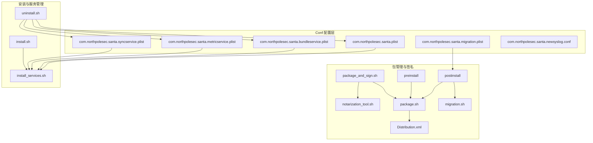
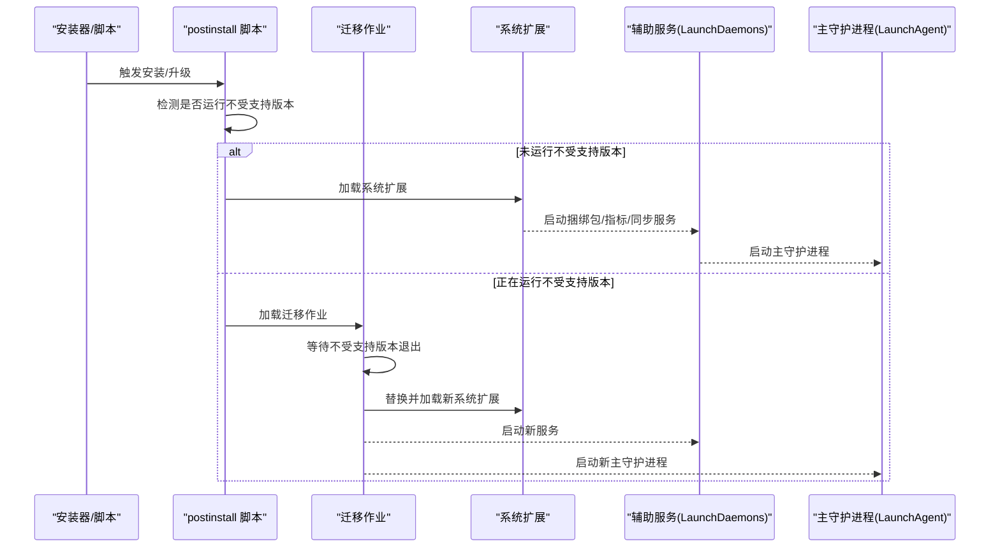
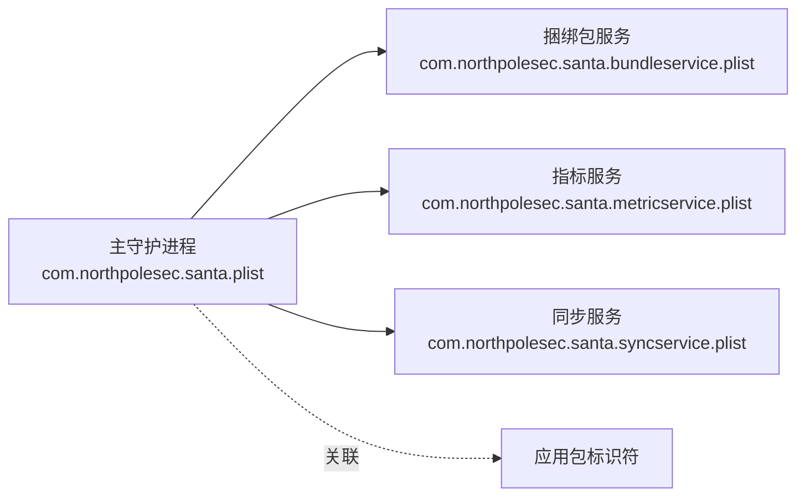
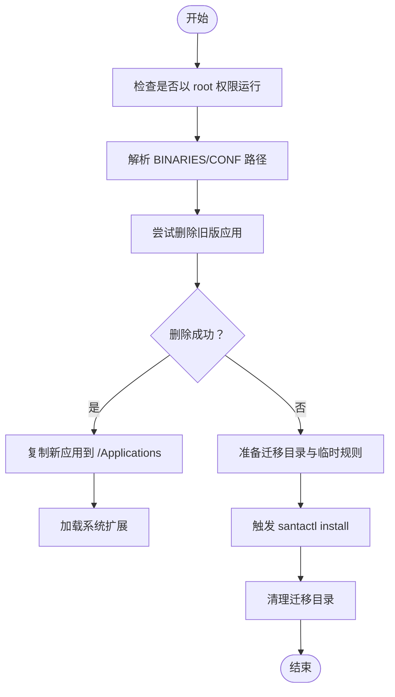
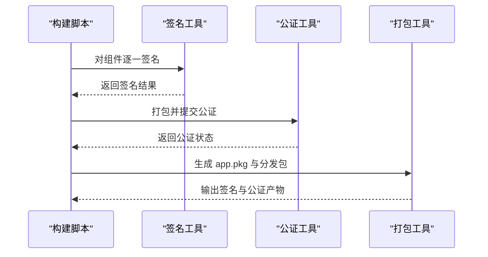
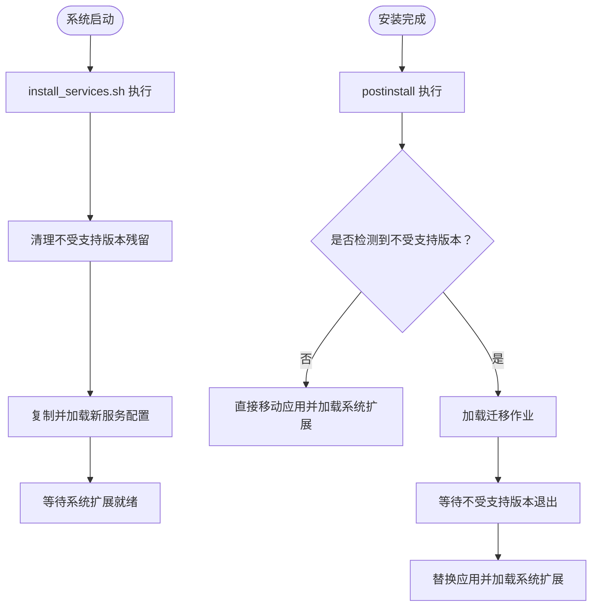
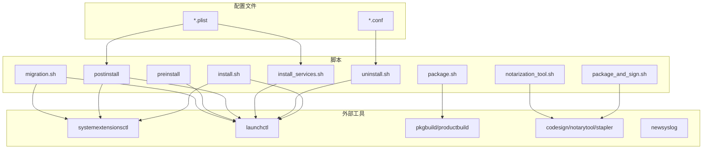

# 构建系统配置管理

<cite>
**本文引用的文件**
- [Conf/com.northpolesec.santa.plist](file://Conf/com.northpolesec.santa.plist)
- [Conf/com.northpolesec.santa.bundleservice.plist](file://Conf/com.northpolesec.santa.bundleservice.plist)
- [Conf/com.northpolesec.santa.metricservice.plist](file://Conf/com.northpolesec.santa.metricservice.plist)
- [Conf/com.northpolesec.santa.syncservice.plist](file://Conf/com.northpolesec.santa.syncservice.plist)
- [Conf/com.northpolesec.santa.migration.plist](file://Conf/com.northpolesec.santa.migration.plist)
- [Conf/com.northpolesec.santa.newsyslog.conf](file://Conf/com.northpolesec.santa.newsyslog.conf)
- [Conf/install.sh](file://Conf/install.sh)
- [Conf/uninstall.sh](file://Conf/uninstall.sh)
- [Conf/install_services.sh](file://Conf/install_services.sh)
- [Conf/Package/package.sh](file://Conf/Package/package.sh)
- [Conf/Package/package_and_sign.sh](file://Conf/Package/package_and_sign.sh)
- [Conf/Package/migration.sh](file://Conf/Package/migration.sh)
- [Conf/Package/Distribution.xml](file://Conf/Package/Distribution.xml)
- [Conf/Package/preinstall](file://Conf/Package/preinstall)
- [Conf/Package/postinstall](file://Conf/Package/postinstall)
- [Conf/Package/notarization_tool.sh](file://Conf/Package/notarization_tool.sh)
</cite>

## 目录
1. [引言](#引言)
2. [项目结构](#项目结构)
3. [核心组件](#核心组件)
4. [架构总览](#架构总览)
5. [详细组件分析](#详细组件分析)
6. [依赖关系分析](#依赖关系分析)
7. [性能考虑](#性能考虑)
8. [故障排查指南](#故障排查指南)
9. [结论](#结论)
10. [附录](#附录)

## 引言
本文件聚焦 Santa 项目的“构建系统配置管理”，围绕 Conf 目录下的 LaunchDaemon/LaunchAgent 配置、安装/卸载脚本、打包与签名流程、以及迁移机制进行系统化梳理。目标是帮助读者快速理解 Santa 在 macOS 上的部署、升级与卸载路径，掌握各配置文件的作用边界与交互关系，并提供可操作的排障建议。

## 项目结构
Conf 目录包含以下关键内容：
- Launch 配置：用于启动主守护进程与辅助服务（捆绑包服务、指标服务、同步服务），以及迁移作业。
- 安装与卸载脚本：负责安装、更新、卸载与清理。
- 包管理脚本：负责打包、签名、公证、装箱与验证。
- 日志轮转配置：定义日志文件位置、权限与轮转策略。

图表来源
- [Conf/com.northpolesec.santa.plist](file://Conf/com.northpolesec.santa.plist#L1-L22)
- [Conf/com.northpolesec.santa.bundleservice.plist](file://Conf/com.northpolesec.santa.bundleservice.plist#L1-L33)
- [Conf/com.northpolesec.santa.metricservice.plist](file://Conf/com.northpolesec.santa.metricservice.plist#L1-L27)
- [Conf/com.northpolesec.santa.syncservice.plist](file://Conf/com.northpolesec.santa.syncservice.plist#L1-L27)
- [Conf/com.northpolesec.santa.migration.plist](file://Conf/com.northpolesec.santa.migration.plist#L1-L21)
- [Conf/com.northpolesec.santa.newsyslog.conf](file://Conf/com.northpolesec.santa.newsyslog.conf#L1-L3)
- [Conf/install.sh](file://Conf/install.sh#L1-L68)
- [Conf/uninstall.sh](file://Conf/uninstall.sh#L1-L42)
- [Conf/install_services.sh](file://Conf/install_services.sh#L1-L64)
- [Conf/Package/package.sh](file://Conf/Package/package.sh#L1-L77)
- [Conf/Package/package_and_sign.sh](file://Conf/Package/package_and_sign.sh#L1-L153)
- [Conf/Package/Distribution.xml](file://Conf/Package/Distribution.xml#L1-L17)
- [Conf/Package/notarization_tool.sh](file://Conf/Package/notarization_tool.sh#L1-L19)
- [Conf/Package/preinstall](file://Conf/Package/preinstall#L1-L10)
- [Conf/Package/postinstall](file://Conf/Package/postinstall#L1-L83)
- [Conf/Package/migration.sh](file://Conf/Package/migration.sh#L1-L41)

章节来源
- [Conf/com.northpolesec.santa.plist](file://Conf/com.northpolesec.santa.plist#L1-L22)
- [Conf/com.northpolesec.santa.bundleservice.plist](file://Conf/com.northpolesec.santa.bundleservice.plist#L1-L33)
- [Conf/com.northpolesec.santa.metricservice.plist](file://Conf/com.northpolesec.santa.metricservice.plist#L1-L27)
- [Conf/com.northpolesec.santa.syncservice.plist](file://Conf/com.northpolesec.santa.syncservice.plist#L1-L27)
- [Conf/com.northpolesec.santa.migration.plist](file://Conf/com.northpolesec.santa.migration.plist#L1-L21)
- [Conf/com.northpolesec.santa.newsyslog.conf](file://Conf/com.northpolesec.santa.newsyslog.conf#L1-L3)
- [Conf/install.sh](file://Conf/install.sh#L1-L68)
- [Conf/uninstall.sh](file://Conf/uninstall.sh#L1-L42)
- [Conf/install_services.sh](file://Conf/install_services.sh#L1-L64)
- [Conf/Package/package.sh](file://Conf/Package/package.sh#L1-L77)
- [Conf/Package/package_and_sign.sh](file://Conf/Package/package_and_sign.sh#L1-L153)
- [Conf/Package/Distribution.xml](file://Conf/Package/Distribution.xml#L1-L17)
- [Conf/Package/notarization_tool.sh](file://Conf/Package/notarization_tool.sh#L1-L19)
- [Conf/Package/preinstall](file://Conf/Package/preinstall#L1-L10)
- [Conf/Package/postinstall](file://Conf/Package/postinstall#L1-L83)
- [Conf/Package/migration.sh](file://Conf/Package/migration.sh#L1-L41)

## 核心组件
- 主守护进程 LaunchAgent：负责加载系统扩展并启动主守护进程。
- 辅助服务 LaunchDaemon：捆绑包服务、指标服务、同步服务，分别通过 Mach 服务或 KeepAlive 策略运行。
- 迁移作业 LaunchDaemon：在安装过程中检测旧版 Santa 并完成平滑替换。
- 日志轮转配置：定义日志文件路径、权限与轮转参数。
- 安装/卸载脚本：处理安装、升级、卸载与清理，兼容 tamper protections。
- 包管理脚本：签名、公证、打包、DMG 打包与验证。
- 分发描述文件：定义安装器分发包的组成与版本信息。

章节来源
- [Conf/com.northpolesec.santa.plist](file://Conf/com.northpolesec.santa.plist#L1-L22)
- [Conf/com.northpolesec.santa.bundleservice.plist](file://Conf/com.northpolesec.santa.bundleservice.plist#L1-L33)
- [Conf/com.northpolesec.santa.metricservice.plist](file://Conf/com.northpolesec.santa.metricservice.plist#L1-L27)
- [Conf/com.northpolesec.santa.syncservice.plist](file://Conf/com.northpolesec.santa.syncservice.plist#L1-L27)
- [Conf/com.northpolesec.santa.migration.plist](file://Conf/com.northpolesec.santa.migration.plist#L1-L21)
- [Conf/com.northpolesec.santa.newsyslog.conf](file://Conf/com.northpolesec.santa.newsyslog.conf#L1-L3)
- [Conf/install.sh](file://Conf/install.sh#L1-L68)
- [Conf/uninstall.sh](file://Conf/uninstall.sh#L1-L42)
- [Conf/Package/package.sh](file://Conf/Package/package.sh#L1-L77)
- [Conf/Package/package_and_sign.sh](file://Conf/Package/package_and_sign.sh#L1-L153)
- [Conf/Package/Distribution.xml](file://Conf/Package/Distribution.xml#L1-L17)

## 架构总览
下图展示 Santa 的安装、升级与卸载在 macOS 上的总体流程，包括 Launch 配置、系统扩展加载、辅助服务与迁移作业之间的协作关系。

图表来源
- [Conf/Package/postinstall](file://Conf/Package/postinstall#L1-L83)
- [Conf/Package/migration.sh](file://Conf/Package/migration.sh#L1-L41)
- [Conf/com.northpolesec.santa.plist](file://Conf/com.northpolesec.santa.plist#L1-L22)
- [Conf/com.northpolesec.santa.bundleservice.plist](file://Conf/com.northpolesec.santa.bundleservice.plist#L1-L33)
- [Conf/com.northpolesec.santa.metricservice.plist](file://Conf/com.northpolesec.santa.metricservice.plist#L1-L27)
- [Conf/com.northpolesec.santa.syncservice.plist](file://Conf/com.northpolesec.santa.syncservice.plist#L1-L27)

## 详细组件分析

### 主守护进程与辅助服务配置
- 主守护进程（LaunchAgent）：以 syslog 方式运行，随系统加载并保持常驻，关联应用包标识符以便系统识别。
- 辅助服务（LaunchDaemon）：捆绑包服务、指标服务、同步服务均以 syslog 方式运行；部分服务通过 Mach 服务暴露接口，按需启动，避免常驻占用资源。
- 关联机制：所有服务均声明与应用包相同的 AssociatedBundleIdentifiers，确保系统层面的归属一致。

图表来源
- [Conf/com.northpolesec.santa.plist](file://Conf/com.northpolesec.santa.plist#L1-L22)
- [Conf/com.northpolesec.santa.bundleservice.plist](file://Conf/com.northpolesec.santa.bundleservice.plist#L1-L33)
- [Conf/com.northpolesec.santa.metricservice.plist](file://Conf/com.northpolesec.santa.metricservice.plist#L1-L27)
- [Conf/com.northpolesec.santa.syncservice.plist](file://Conf/com.northpolesec.santa.syncservice.plist#L1-L27)

章节来源
- [Conf/com.northpolesec.santa.plist](file://Conf/com.northpolesec.santa.plist#L1-L22)
- [Conf/com.northpolesec.santa.bundleservice.plist](file://Conf/com.northpolesec.santa.bundleservice.plist#L1-L33)
- [Conf/com.northpolesec.santa.metricservice.plist](file://Conf/com.northpolesec.santa.metricservice.plist#L1-L27)
- [Conf/com.northpolesec.santa.syncservice.plist](file://Conf/com.northpolesec.santa.syncservice.plist#L1-L27)

### 安装与升级流程
- 安装脚本 install.sh：优先尝试直接替换应用与加载系统扩展；若受 tamper protections 影响无法删除应用，则写入迁移目录并通过 santactl 触发安装。
- 升级场景中的规则放行：针对特定版本在 Lockdown 模式下，临时添加允许规则以保证组件可被签名标识放行。
- 卸载脚本 uninstall.sh：卸载系统扩展、移除 LaunchDaemons/LaunchAgents、清理日志与配置、可选地保留配置与数据库。

图表来源
- [Conf/install.sh](file://Conf/install.sh#L1-L68)

章节来源
- [Conf/install.sh](file://Conf/install.sh#L1-L68)
- [Conf/uninstall.sh](file://Conf/uninstall.sh#L1-L42)

### 包管理与签名流程
- package.sh：生成 app.pkg，设置组件属性（不可重定位、覆盖行为等），复制迁移脚本与配置，调用 pkgbuild 与 productbuild 产出分发包。
- package_and_sign.sh：对二进制与系统扩展逐个签名，打包为 zip 提交公证，对应用执行 stapler，生成发布 tar、签名并公证分发包，最后封装为 DMG 并公证。
- notarization_tool.sh：封装 notarytool 提交与等待逻辑，使用环境变量注入密钥材料。
- 分发描述文件 Distribution.xml：定义安装器标题、架构限制与单一包引用。

图表来源
- [Conf/Package/package_and_sign.sh](file://Conf/Package/package_and_sign.sh#L1-L153)
- [Conf/Package/package.sh](file://Conf/Package/package.sh#L1-L77)
- [Conf/Package/notarization_tool.sh](file://Conf/Package/notarization_tool.sh#L1-L19)
- [Conf/Package/Distribution.xml](file://Conf/Package/Distribution.xml#L1-L17)

章节来源
- [Conf/Package/package.sh](file://Conf/Package/package.sh#L1-L77)
- [Conf/Package/package_and_sign.sh](file://Conf/Package/package_and_sign.sh#L1-L153)
- [Conf/Package/notarization_tool.sh](file://Conf/Package/notarization_tool.sh#L1-L19)
- [Conf/Package/Distribution.xml](file://Conf/Package/Distribution.xml#L1-L17)

### 迁移机制与服务安装
- install_services.sh：在系统扩展启动前由 NPS Santa 系统扩展调用，清理不受支持版本残留、移除旧 Launch 配置、复制新配置并加载服务。
- postinstall：安装后根据是否运行不受支持版本决定直接安装还是加载迁移作业；迁移作业等待不受支持版本退出后再替换并加载新组件。
- preinstall：安装前清理残留迁移作业与缓存目录，确保干净安装。

图表来源
- [Conf/install_services.sh](file://Conf/install_services.sh#L1-L64)
- [Conf/Package/postinstall](file://Conf/Package/postinstall#L1-L83)
- [Conf/Package/migration.sh](file://Conf/Package/migration.sh#L1-L41)
- [Conf/Package/preinstall](file://Conf/Package/preinstall#L1-L10)

章节来源
- [Conf/install_services.sh](file://Conf/install_services.sh#L1-L64)
- [Conf/Package/postinstall](file://Conf/Package/postinstall#L1-L83)
- [Conf/Package/migration.sh](file://Conf/Package/migration.sh#L1-L41)
- [Conf/Package/preinstall](file://Conf/Package/preinstall#L1-L10)

### 日志与轮转
- 日志文件路径与轮转参数在 newsyslog 配置中定义，便于集中管理与轮转。
- 卸载时会向 syslogd 发送 HUP 信号以重新读取配置，确保日志行为一致。

章节来源
- [Conf/com.northpolesec.santa.newsyslog.conf](file://Conf/com.northpolesec.santa.newsyslog.conf#L1-L3)
- [Conf/uninstall.sh](file://Conf/uninstall.sh#L1-L42)

## 依赖关系分析
- 配置文件依赖：各服务的 plist 文件依赖于应用二进制路径与 syslog 参数；迁移作业依赖 postinstall 的触发与系统扩展状态。
- 脚本依赖：install.sh 依赖 santactl 与系统扩展加载命令；package_and_sign.sh 依赖签名与公证工具链；postinstall 依赖 systemextensionsctl 与 launchctl。
- 外部集成点：系统扩展、Launch 控制、newsyslog、pkgbuild/productbuild、notarytool/stapler。

图表来源
- [Conf/com.northpolesec.santa.plist](file://Conf/com.northpolesec.santa.plist#L1-L22)
- [Conf/com.northpolesec.santa.bundleservice.plist](file://Conf/com.northpolesec.santa.bundleservice.plist#L1-L33)
- [Conf/com.northpolesec.santa.metricservice.plist](file://Conf/com.northpolesec.santa.metricservice.plist#L1-L27)
- [Conf/com.northpolesec.santa.syncservice.plist](file://Conf/com.northpolesec.santa.syncservice.plist#L1-L27)
- [Conf/com.northpolesec.santa.newsyslog.conf](file://Conf/com.northpolesec.santa.newsyslog.conf#L1-L3)
- [Conf/install.sh](file://Conf/install.sh#L1-L68)
- [Conf/uninstall.sh](file://Conf/uninstall.sh#L1-L42)
- [Conf/install_services.sh](file://Conf/install_services.sh#L1-L64)
- [Conf/Package/package.sh](file://Conf/Package/package.sh#L1-L77)
- [Conf/Package/package_and_sign.sh](file://Conf/Package/package_and_sign.sh#L1-L153)
- [Conf/Package/postinstall](file://Conf/Package/postinstall#L1-L83)
- [Conf/Package/preinstall](file://Conf/Package/preinstall#L1-L10)
- [Conf/Package/migration.sh](file://Conf/Package/migration.sh#L1-L41)
- [Conf/Package/notarization_tool.sh](file://Conf/Package/notarization_tool.sh#L1-L19)

章节来源
- [Conf/install.sh](file://Conf/install.sh#L1-L68)
- [Conf/uninstall.sh](file://Conf/uninstall.sh#L1-L42)
- [Conf/Package/package_and_sign.sh](file://Conf/Package/package_and_sign.sh#L1-L153)

## 性能考虑
- 服务启动策略：非关键服务采用按需启动或 KeepAlive 关闭，降低常驻开销。
- 迁移路径：通过迁移作业与临时规则避免阻塞，缩短升级时间窗口。
- 打包与公证：分发包与 DMG 的压缩级别与公证流程应平衡速度与合规性。
- 日志轮转：合理设置大小与数量阈值，避免磁盘压力与 I/O 抖动。

## 故障排查指南
- 安装失败或无法加载系统扩展
  - 检查是否以 root 权限运行安装脚本。
  - 查看系统扩展状态与错误日志，确认签名与公证状态。
  - 若存在不受支持版本，确认 postinstall 是否正确加载迁移作业。
- 升级卡在 Lockdown 模式
  - 确认版本是否属于需要临时放行的范围，检查临时规则是否已创建。
- 卸载后残留配置或日志
  - 使用卸载脚本清理 Launch 配置与应用目录；必要时手动删除 /var/db/santa 与日志文件。
- 公证失败
  - 检查 notarization_tool.sh 的环境变量与密钥文件生成过程；确认 notarytool 可用且网络可达。
- 日志不轮转
  - 检查 newsyslog 配置文件路径与权限，确认 syslogd 已收到 HUP 信号。

章节来源
- [Conf/install.sh](file://Conf/install.sh#L1-L68)
- [Conf/uninstall.sh](file://Conf/uninstall.sh#L1-L42)
- [Conf/Package/postinstall](file://Conf/Package/postinstall#L1-L83)
- [Conf/Package/migration.sh](file://Conf/Package/migration.sh#L1-L41)
- [Conf/Package/notarization_tool.sh](file://Conf/Package/notarization_tool.sh#L1-L19)
- [Conf/com.northpolesec.santa.newsyslog.conf](file://Conf/com.northpolesec.santa.newsyslog.conf#L1-L3)

## 结论
Santa 的构建系统配置管理围绕“配置文件 + 脚本 + 包管理”的闭环展开：Launch 配置确保服务生命周期与关联关系清晰；安装/卸载脚本兼顾安全性与兼容性；包管理脚本实现从签名到公证再到分发的全链路自动化；迁移机制保障升级过程的平滑与可控。通过本文档的结构化梳理与图示说明，读者可以高效理解 Santa 的部署与运维要点，并据此制定标准化的打包与发布流程。

## 附录
- 常用环境变量与作用
  - RELEASE_ROOT：发布包根目录
  - PKG_OUT_DIR：包输出目录
  - BUILD_DEV_DISTRIBUTION_PKG：是否生成开发分发包
  - SIGNING_IDENTITY/SIGNING_TEAMID/SIGNING_KEYCHAIN：组件签名参数
  - INSTALLER_SIGNING_IDENTITY/INSTALLER_SIGNING_KEYCHAIN：安装包签名参数
  - NOTARIZATION_TOOL：公证工具路径
  - NOTARIZATION_KEY_P8/NOTARIZATION_KEY_ID/NOTARIZATION_ISSUER_ID：公证密钥材料
  - CONF_DIR：系统扩展启动时的服务配置目录

章节来源
- [Conf/Package/package.sh](file://Conf/Package/package.sh#L1-L77)
- [Conf/Package/package_and_sign.sh](file://Conf/Package/package_and_sign.sh#L1-L153)
- [Conf/Package/notarization_tool.sh](file://Conf/Package/notarization_tool.sh#L1-L19)
- [Conf/install_services.sh](file://Conf/install_services.sh#L1-L64)