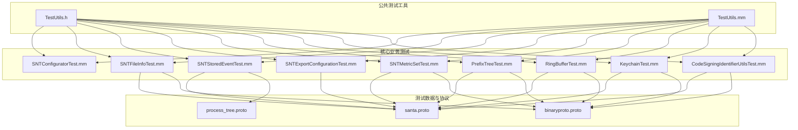
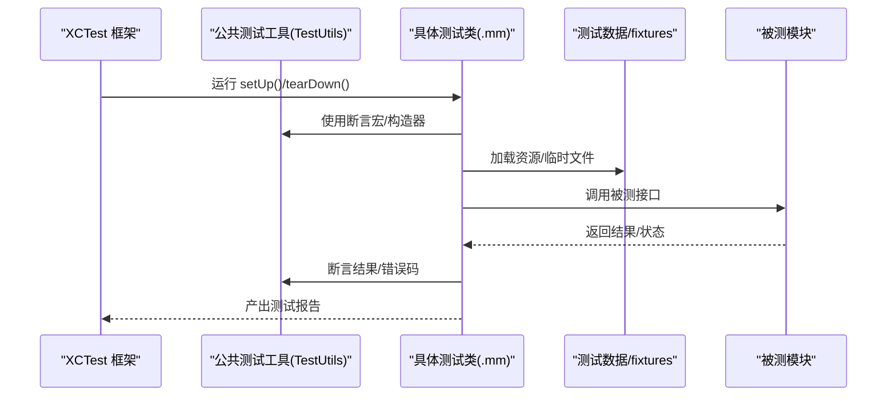
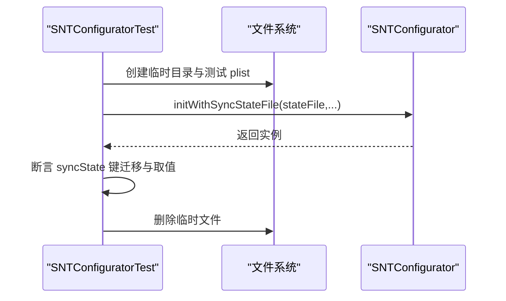
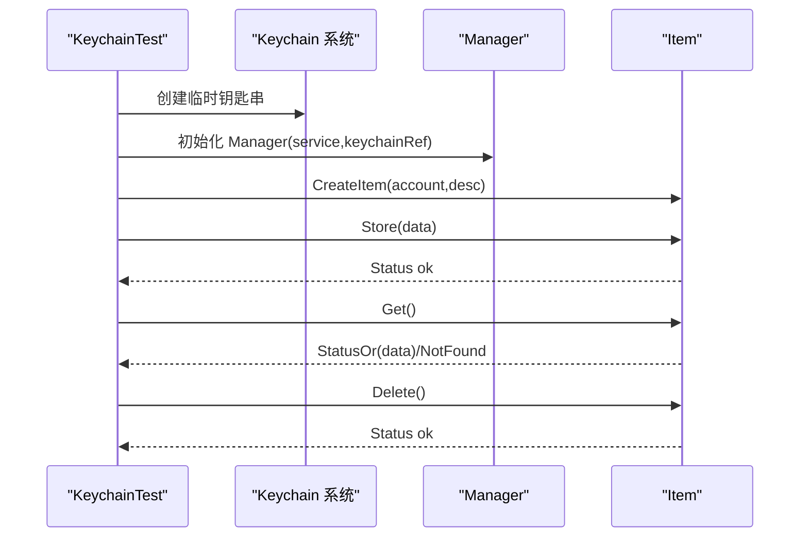
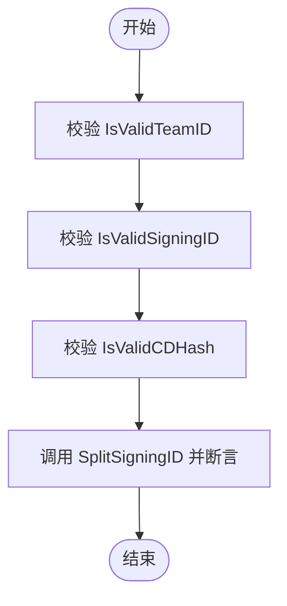
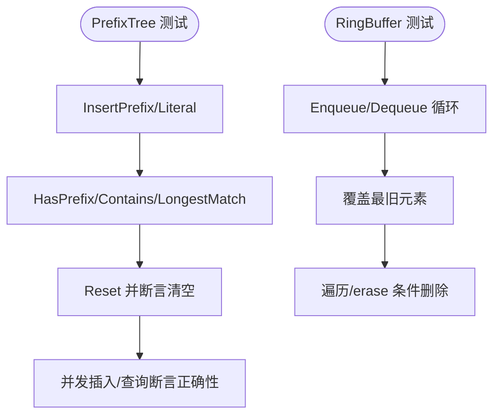
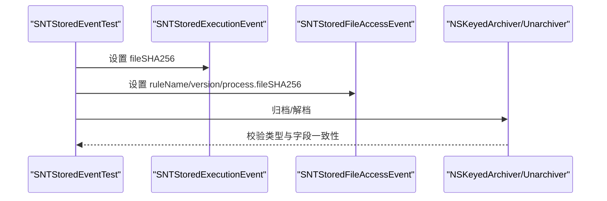
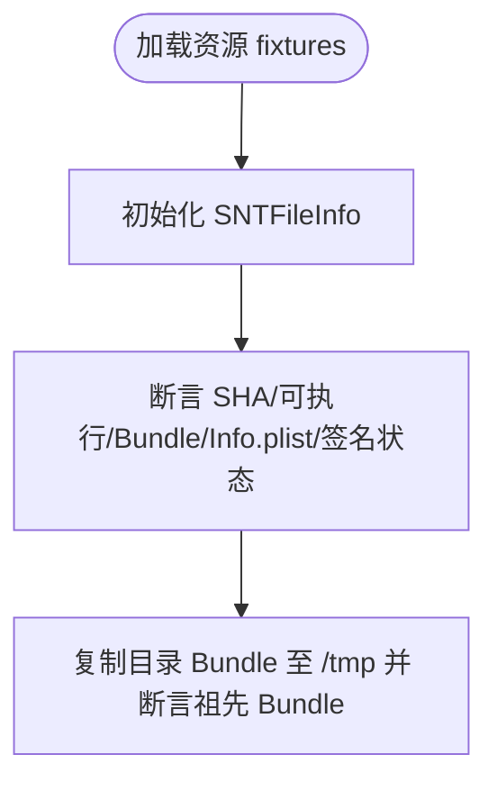
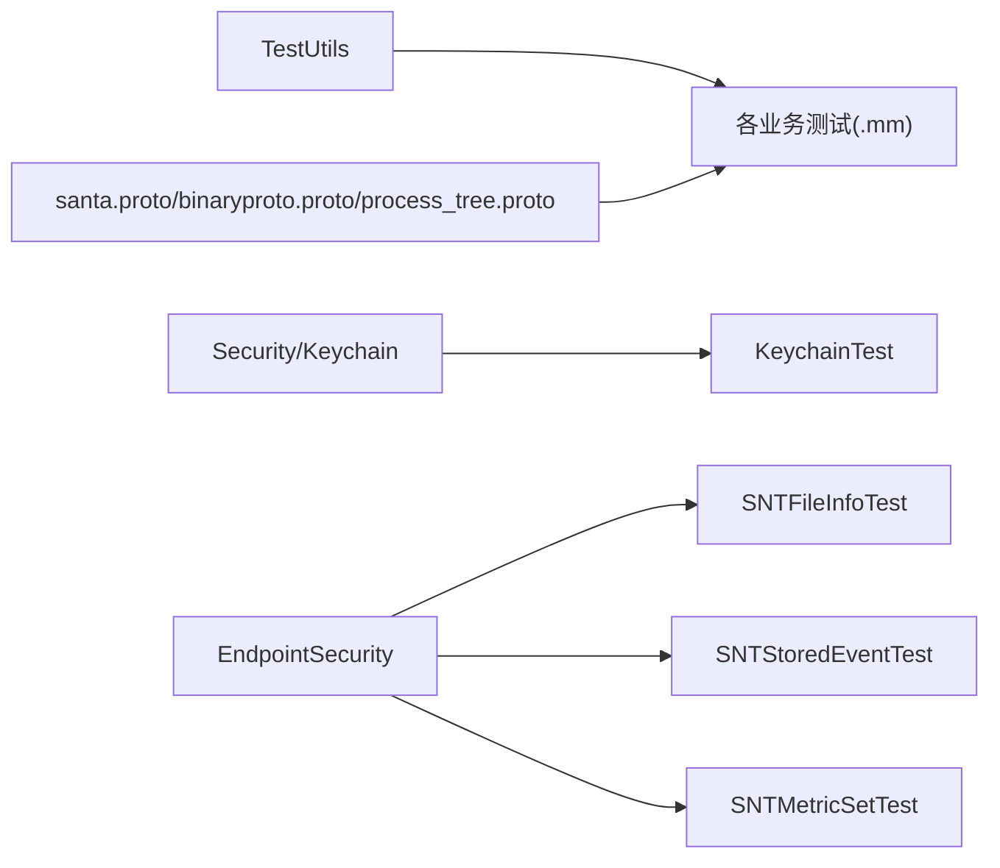

# 单元测试

<cite>
**本文引用的文件**
- [Source/common/TestUtils.h](file://Source/common/TestUtils.h)
- [Source/common/TestUtils.mm](file://Source/common/TestUtils.mm)
- [Source/common/CodeSigningIdentifierUtilsTest.mm](file://Source/common/CodeSigningIdentifierUtilsTest.mm)
- [Source/common/KeychainTest.mm](file://Source/common/KeychainTest.mm)
- [Source/common/SNTConfiguratorTest.mm](file://Source/common/SNTConfiguratorTest.mm)
- [Source/common/SNTFileInfoTest.mm](file://Source/common/SNTFileInfoTest.mm)
- [Source/common/SNTStoredEventTest.mm](file://Source/common/SNTStoredEventTest.mm)
- [Source/common/SNTExportConfigurationTest.mm](file://Source/common/SNTExportConfigurationTest.mm)
- [Source/common/SNTMetricSetTest.mm](file://Source/common/SNTMetricSetTest.mm)
- [Source/common/PrefixTreeTest.mm](file://Source/common/PrefixTreeTest.mm)
- [Source/common/RingBufferTest.mm](file://Source/common/RingBufferTest.mm)
- [Source/common/santa.proto](file://Source/common/santa.proto)
- [Source/santad/Logs/EndpointSecurity/Writers/FSSpool/binaryproto.proto](file://Source/santad/Logs/EndpointSecurity/Writers/FSSpool/binaryproto.proto)
- [Source/santad/ProcessTree/process_tree.proto](file://Source/santad/ProcessTree/process_tree.proto)
</cite>

## 目录
1. [引言](#引言)
2. [项目结构](#项目结构)
3. [核心组件](#核心组件)
4. [架构总览](#架构总览)
5. [详细组件分析](#详细组件分析)
6. [依赖关系分析](#依赖关系分析)
7. [性能考量](#性能考量)
8. [故障排查指南](#故障排查指南)
9. [结论](#结论)
10. [附录](#附录)

## 引言
本文件系统性梳理 Santa 项目的单元测试设计与实现，覆盖测试组织结构、命名规范、测试类型（配置、错误处理、加密、缓存、序列化等）、测试数据管理（fixtures 与模拟对象）、断言最佳实践、覆盖率要求、调试技巧以及可维护性与清理机制。目标是帮助开发者快速理解并高效编写高质量的单元测试。

## 项目结构
- 测试文件采用“按功能模块分层 + 按组件分文件”的组织方式：
  - 公共工具与通用测试辅助位于 Source/common 下，统一提供断言宏、ES 结构构造器、时间与信号量断言等。
  - 各业务模块（如配置、文件信息、事件、指标、容器结构等）在对应目录下提供独立的 .mm 测试文件。
  - 测试数据通过资源路径或临时目录提供，部分测试使用 proto 定义进行序列化/反序列化验证。
- 命名规范：
  - 测试类以被测类名加 Test 后缀命名，例如 SNTConfiguratorTest、SNTFileInfoTest 等。
  - 测试方法以 testXxx 开头，清晰表达测试意图，如 testInitMigratesSyncStateKeys、testBasic、testHasPrefix 等。
  - 测试夹具（fixtures）通常放置于资源目录或临时目录，便于隔离与复用。

**图表来源**
- [Source/common/TestUtils.h](file://Source/common/TestUtils.h#L1-L106)
- [Source/common/TestUtils.mm](file://Source/common/TestUtils.mm#L1-L325)
- [Source/common/SNTConfiguratorTest.mm](file://Source/common/SNTConfiguratorTest.mm#L1-L111)
- [Source/common/SNTFileInfoTest.mm](file://Source/common/SNTFileInfoTest.mm#L1-L267)
- [Source/common/SNTStoredEventTest.mm](file://Source/common/SNTStoredEventTest.mm#L1-L112)
- [Source/common/SNTExportConfigurationTest.mm](file://Source/common/SNTExportConfigurationTest.mm#L1-L59)
- [Source/common/SNTMetricSetTest.mm](file://Source/common/SNTMetricSetTest.mm#L1-L708)
- [Source/common/PrefixTreeTest.mm](file://Source/common/PrefixTreeTest.mm#L1-L250)
- [Source/common/RingBufferTest.mm](file://Source/common/RingBufferTest.mm#L1-L201)
- [Source/common/KeychainTest.mm](file://Source/common/KeychainTest.mm#L1-L124)
- [Source/common/CodeSigningIdentifierUtilsTest.mm](file://Source/common/CodeSigningIdentifierUtilsTest.mm#L1-L183)
- [Source/common/santa.proto](file://Source/common/santa.proto)
- [Source/santad/Logs/EndpointSecurity/Writers/FSSpool/binaryproto.proto](file://Source/santad/Logs/EndpointSecurity/Writers/FSSpool/binaryproto.proto)
- [Source/santad/ProcessTree/process_tree.proto](file://Source/santad/ProcessTree/process_tree.proto)

**章节来源**
- [Source/common/TestUtils.h](file://Source/common/TestUtils.h#L1-L106)
- [Source/common/TestUtils.mm](file://Source/common/TestUtils.mm#L1-L325)

## 核心组件
- 测试断言与辅助宏：
  - 提供跨 XCTest 与 GoogleTest 的断言桥接与美化输出，确保失败信息可读性强。
  - 针对 C 字符串、C++ 字符串、前缀/后缀匹配、信号量等待、absl::Status 等场景提供专用断言宏。
- ES 结构构造器：
  - 提供 MakeAuditToken、MakeStat、MakeESStringToken、MakeESFile、MakeESProcess、MakeESMessage 等工厂函数，用于快速构建 EndpointSecurity 相关测试数据。
- 时间与并发辅助：
  - 提供 SleepMS 与基于 mach 绝对时间的 deadline 计算，支持 macOS ES 版本兼容性判断。
- 资源与临时目录：
  - 大量测试通过临时目录或资源路径加载 fixtures，保证测试隔离与可重复性。

**章节来源**
- [Source/common/TestUtils.h](file://Source/common/TestUtils.h#L30-L106)
- [Source/common/TestUtils.mm](file://Source/common/TestUtils.mm#L27-L123)
- [Source/common/TestUtils.mm](file://Source/common/TestUtils.mm#L124-L325)

## 架构总览
下图展示测试框架与被测模块之间的交互关系：测试类依赖公共工具（断言、ES 构造器、时间/信号量），并通过资源或临时目录访问 fixtures；部分测试涉及 proto 序列化/反序列化。

**图表来源**
- [Source/common/TestUtils.h](file://Source/common/TestUtils.h#L30-L106)
- [Source/common/TestUtils.mm](file://Source/common/TestUtils.mm#L1-L325)
- [Source/common/SNTConfiguratorTest.mm](file://Source/common/SNTConfiguratorTest.mm#L38-L111)
- [Source/common/SNTFileInfoTest.mm](file://Source/common/SNTFileInfoTest.mm#L24-L33)

## 详细组件分析

### 配置测试：SNTConfiguratorTest
- 设计要点
  - 使用临时目录存放测试状态文件，避免污染真实环境。
  - 通过自定义访问授权器控制对同步状态文件与普通状态文件的读写权限，验证迁移逻辑。
  - 验证键值迁移（如 SyncCleanRequired -> SyncTypeRequired）与空状态分支。
- 关键流程
  - 初始化测试目录与 plist 文件。
  - 以不同输入触发初始化，断言迁移后的状态字典。
  - 清理临时文件。

**图表来源**
- [Source/common/SNTConfiguratorTest.mm](file://Source/common/SNTConfiguratorTest.mm#L55-L111)

**章节来源**
- [Source/common/SNTConfiguratorTest.mm](file://Source/common/SNTConfiguratorTest.mm#L38-L111)

### 错误处理测试：KeychainTest
- 设计要点
  - 使用临时路径创建系统钥匙串，验证 Keychain 管理器与 Item 的创建、存储、删除、获取行为。
  - 使用断言宏验证非存在项获取返回 NotFound，重复存储成功（内部先删除再写入）。
  - 使用 SecurityOSStatus 到 absl::Status 的转换函数验证错误码映射。
- 关键流程
  - 创建临时钥匙串路径与密码。
  - 初始化 Manager 并创建多个 Item。
  - 存储/获取/删除并断言状态码与数据一致性。

**图表来源**
- [Source/common/KeychainTest.mm](file://Source/common/KeychainTest.mm#L66-L124)

**章节来源**
- [Source/common/KeychainTest.mm](file://Source/common/KeychainTest.mm#L27-L124)

### 加密与签名测试：CodeSigningIdentifierUtilsTest
- 设计要点
  - 验证团队 ID、签名 ID（TeamID:SigningID 或 platform:SigningID）、cdhash 的合法性校验。
  - 验证 SplitSigningID 对合法/非法输入的拆分行为，断言空指针与空字符串的处理。
- 关键流程
  - 分组测试有效/无效输入，断言 IsValid* 与 SplitSigningID 的返回值。

**图表来源**
- [Source/common/CodeSigningIdentifierUtilsTest.mm](file://Source/common/CodeSigningIdentifierUtilsTest.mm#L27-L183)

**章节来源**
- [Source/common/CodeSigningIdentifierUtilsTest.mm](file://Source/common/CodeSigningIdentifierUtilsTest.mm#L27-L183)

### 缓存与容器测试：PrefixTreeTest、RingBufferTest
- PrefixTreeTest
  - 验证前缀/字面量插入、HasPrefix、最长前缀匹配、Contains、节点计数、重置、复杂值类型、多线程并发安全。
- RingBufferTest
  - 验证容量、空满状态、入队/出队、覆盖策略、迭代器、erase 与条件删除。
- 关键流程
  - 构造树/环形缓冲区，执行插入/查询/删除操作，断言状态与返回值。

**图表来源**
- [Source/common/PrefixTreeTest.mm](file://Source/common/PrefixTreeTest.mm#L31-L250)
- [Source/common/RingBufferTest.mm](file://Source/common/RingBufferTest.mm#L29-L201)

**章节来源**
- [Source/common/PrefixTreeTest.mm](file://Source/common/PrefixTreeTest.mm#L31-L250)
- [Source/common/RingBufferTest.mm](file://Source/common/RingBufferTest.mm#L29-L201)

### 序列化与事件测试：SNTStoredEventTest、SNTExportConfigurationTest、SNTMetricSetTest
- SNTStoredEventTest
  - 验证基类 uniqueID/unactionableEvent 抛异常，派生类行为正常；验证 NSKeyedArchiver/Unarchiver 的 secure coding。
- SNTExportConfigurationTest
  - 验证初始化参数、secure coding 编解码一致性。
- SNTMetricSetTest
  - 验证多种指标类型（计数器、布尔/整型/双精度/字符串 Gauge、常量指标）的注册、更新、导出结构，回调注册与执行。
- 关键流程
  - 构造对象，执行编码/解码或指标更新，断言导出结构与字段值。

**图表来源**
- [Source/common/SNTStoredEventTest.mm](file://Source/common/SNTStoredEventTest.mm#L27-L112)
- [Source/common/SNTExportConfigurationTest.mm](file://Source/common/SNTExportConfigurationTest.mm#L25-L59)
- [Source/common/SNTMetricSetTest.mm](file://Source/common/SNTMetricSetTest.mm#L378-L466)

**章节来源**
- [Source/common/SNTStoredEventTest.mm](file://Source/common/SNTStoredEventTest.mm#L27-L112)
- [Source/common/SNTExportConfigurationTest.mm](file://Source/common/SNTExportConfigurationTest.mm#L25-L59)
- [Source/common/SNTMetricSetTest.mm](file://Source/common/SNTMetricSetTest.mm#L378-L466)

### 文件信息与资源测试：SNTFileInfoTest
- 设计要点
  - 通过资源路径加载 fixtures，验证路径标准化、SHA1/SHA256、可执行性、缺失 page zero、动态库、脚本、Bundle 解析、祖先 Bundle 查找、Info.plist 读取、代码签名状态等。
- 关键流程
  - 初始化 SNTFileInfo，断言属性与解析结果；复制目录 Bundle 至临时路径验证祖先 Bundle 行为。

**图表来源**
- [Source/common/SNTFileInfoTest.mm](file://Source/common/SNTFileInfoTest.mm#L24-L205)

**章节来源**
- [Source/common/SNTFileInfoTest.mm](file://Source/common/SNTFileInfoTest.mm#L24-L205)

## 依赖关系分析
- 内部依赖
  - 所有测试类均依赖公共测试工具（断言宏、ES 构造器、时间/信号量辅助）。
  - 部分测试依赖 proto 定义（santa.proto、binaryproto.proto、process_tree.proto）进行序列化/反序列化验证。
- 外部依赖
  - XCTest、Foundation、Security（钥匙串）、EndpointSecurity（ES 构造器）、absl::Status（错误码映射）。
- 耦合与内聚
  - 测试类围绕单一职责模块，耦合度低；公共工具提供高内聚的断言与构造能力，减少重复代码。

**图表来源**
- [Source/common/TestUtils.h](file://Source/common/TestUtils.h#L30-L106)
- [Source/common/TestUtils.mm](file://Source/common/TestUtils.mm#L1-L325)
- [Source/common/KeychainTest.mm](file://Source/common/KeychainTest.mm#L66-L124)
- [Source/common/SNTFileInfoTest.mm](file://Source/common/SNTFileInfoTest.mm#L24-L205)
- [Source/common/SNTStoredEventTest.mm](file://Source/common/SNTStoredEventTest.mm#L27-L112)
- [Source/common/SNTMetricSetTest.mm](file://Source/common/SNTMetricSetTest.mm#L378-L466)
- [Source/common/santa.proto](file://Source/common/santa.proto)
- [Source/santad/Logs/EndpointSecurity/Writers/FSSpool/binaryproto.proto](file://Source/santad/Logs/EndpointSecurity/Writers/FSSpool/binaryproto.proto)
- [Source/santad/ProcessTree/process_tree.proto](file://Source/santad/ProcessTree/process_tree.proto)

**章节来源**
- [Source/common/TestUtils.h](file://Source/common/TestUtils.h#L30-L106)
- [Source/common/TestUtils.mm](file://Source/common/TestUtils.mm#L1-L325)

## 性能考量
- 测试并发与稳定性
  - PrefixTreeTest 包含多线程插入/查询断言，建议在本地与 CI 中分别运行，避免竞态导致的间歇性失败。
- 资源占用
  - 钥匙串与临时文件测试需注意磁盘空间与文件句柄泄漏，确保 tearDown 正确清理。
- 断言开销
  - 使用断言宏时尽量避免在热路径中频繁分配对象，优先复用构造器生成的 ES 结构。

[本节为通用指导，无需列出具体文件来源]

## 故障排查指南
- 常见问题与解决
  - 断言失败信息不明确：使用 TestUtils 中的美化断言宏（如字符串比较、前缀/后缀断言）提升可读性。
  - ES 版本不兼容：利用 MaxSupportedESMessageVersionForCurrentOS 与最小版本映射函数，确保测试消息版本与当前系统匹配。
  - 钥匙串操作失败：检查临时钥匙串路径与权限，确认 SecKeychainCreate 返回值与错误码映射。
  - 序列化失败：确保归档/解档时指定允许的类集合，并启用 secure coding。
- 调试技巧
  - 使用临时目录隔离测试数据，便于手动检查中间状态。
  - 在关键断言前后打印关键字段（如 uniqueID、codesignStatus、metric 导出结构），缩小问题范围。
  - 对并发测试，增加日志与更细粒度断言，定位竞态。

**章节来源**
- [Source/common/TestUtils.h](file://Source/common/TestUtils.h#L30-L106)
- [Source/common/TestUtils.mm](file://Source/common/TestUtils.mm#L124-L325)
- [Source/common/KeychainTest.mm](file://Source/common/KeychainTest.mm#L66-L124)
- [Source/common/SNTStoredEventTest.mm](file://Source/common/SNTStoredEventTest.mm#L65-L112)
- [Source/common/SNTMetricSetTest.mm](file://Source/common/SNTMetricSetTest.mm#L338-L466)

## 结论
Santa 项目的单元测试遵循清晰的模块化与工具化设计：公共测试工具提供一致的断言与构造能力，各类业务测试聚焦单一职责并通过 fixtures 与临时目录保障隔离性。通过合理的断言策略、序列化验证与并发测试，整体测试质量与可维护性得到显著提升。建议持续补充覆盖率与边界条件测试，保持测试与实现同步演进。

[本节为总结性内容，无需列出具体文件来源]

## 附录

### 测试断言最佳实践
- 使用语义化断言宏，避免裸 XCTAssertEqual/XCTAssertTrue 的歧义。
- 对字符串/路径/哈希值断言，优先使用前缀/后缀断言宏，提升可读性。
- 对异步/超时场景，使用信号量断言宏，明确超时阈值与失败信息。
- 对错误码/状态，使用 absl::Status 相关断言宏，统一错误处理策略。

**章节来源**
- [Source/common/TestUtils.h](file://Source/common/TestUtils.h#L30-L106)

### 测试数据管理与清理
- fixtures 策略
  - 小型静态数据（如 JSON、证书、plist）放入资源目录，通过 bundle 路径加载。
  - 大型或临时数据（如钥匙串、目录 Bundle）使用临时目录，测试结束后删除。
- 清理机制
  - setUp 创建资源，tearDown 删除临时文件，避免残留影响其他测试。
  - 对并发测试，确保每个线程/任务拥有独立命名空间（UUID）与临时路径。

**章节来源**
- [Source/common/SNTConfiguratorTest.mm](file://Source/common/SNTConfiguratorTest.mm#L40-L53)
- [Source/common/SNTFileInfoTest.mm](file://Source/common/SNTFileInfoTest.mm#L160-L178)
- [Source/common/KeychainTest.mm](file://Source/common/KeychainTest.mm#L33-L40)

### 测试覆盖率与持续集成
- 建议
  - 为关键模块（配置、文件信息、事件、指标、容器、加密）设置覆盖率门槛。
  - 对 ES 相关逻辑（消息版本兼容、事件序列化）进行回归测试。
  - 对并发敏感模块（PrefixTree、RingBuffer）在 CI 中多次运行，降低偶发失败概率。

[本节为通用指导，无需列出具体文件来源]