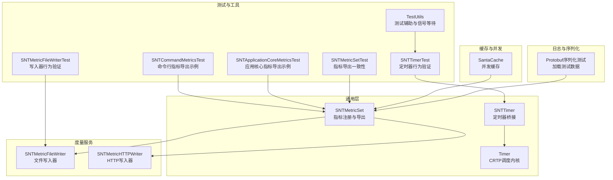
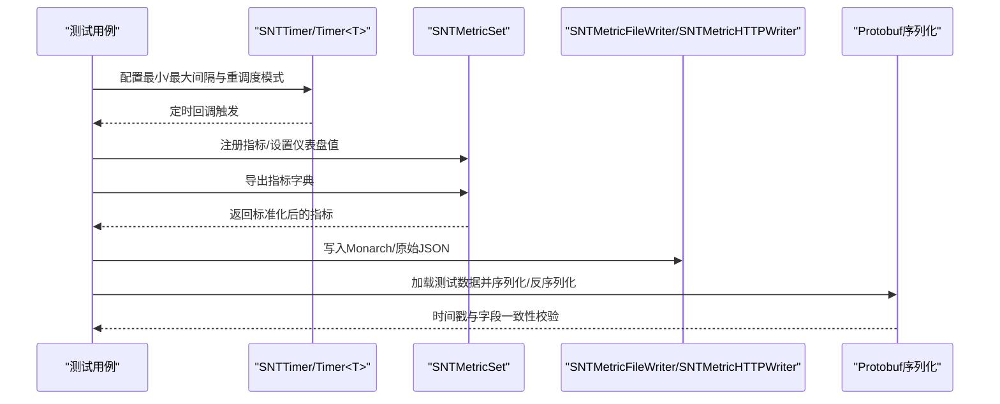
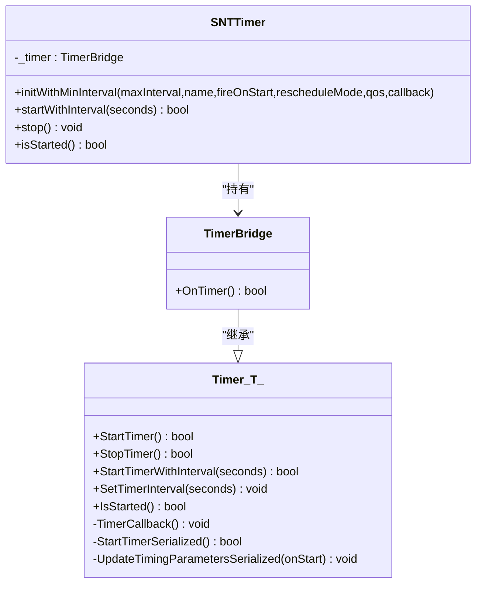
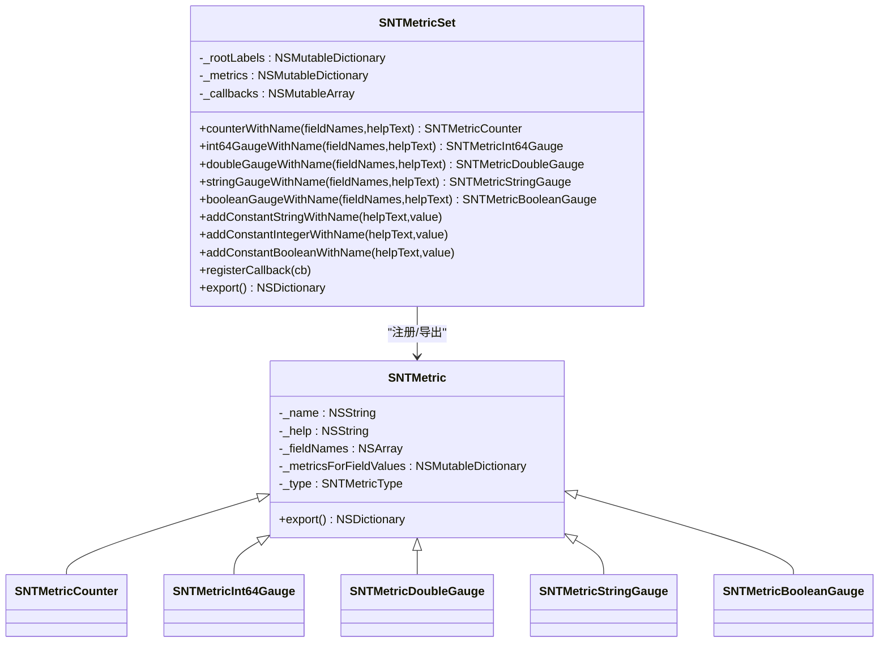
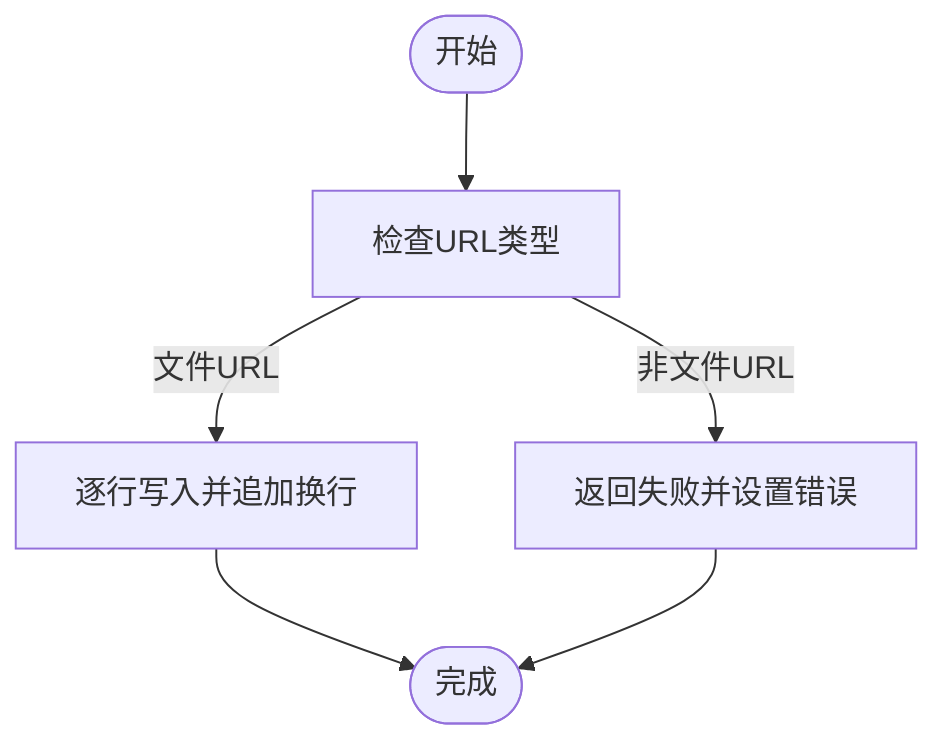
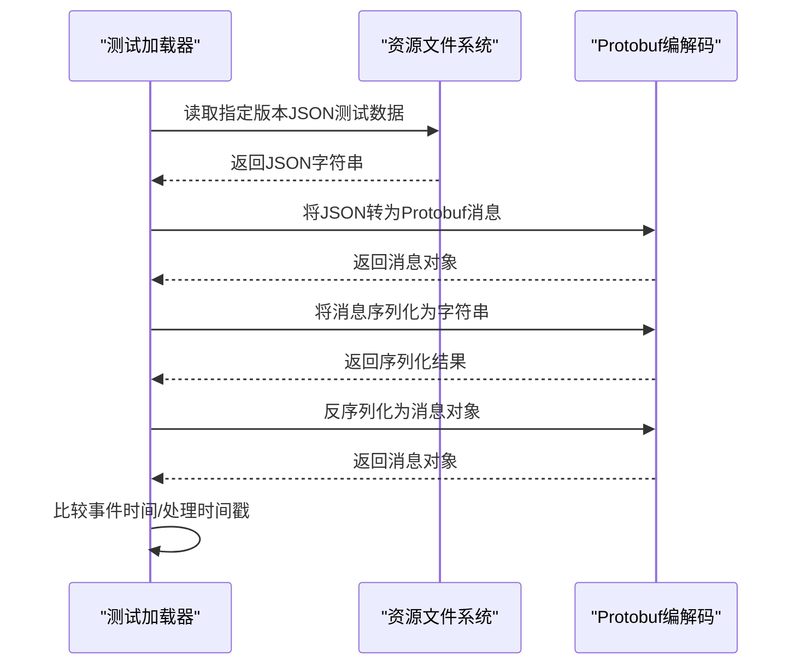
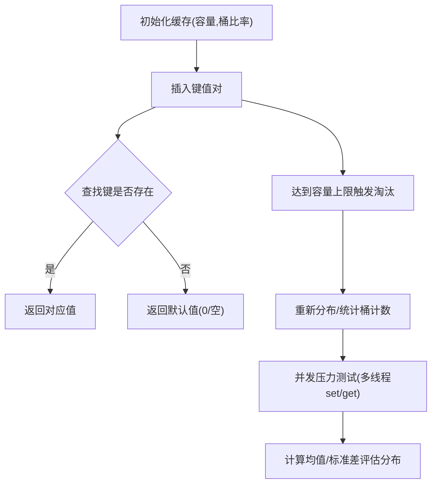
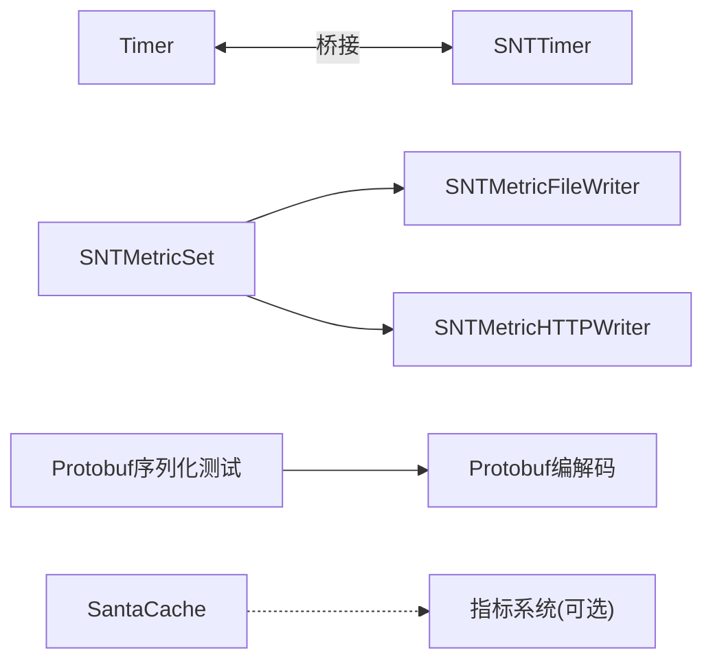

# 性能测试

<cite>
**本文引用的文件**
- [SNTTimer.h](file://Source/common/SNTTimer.h)
- [SNTTimer.mm](file://Source/common/SNTTimer.mm)
- [Timer.h](file://Source/common/Timer.h)
- [SNTMetricSet.h](file://Source/common/SNTMetricSet.h)
- [SNTMetricSet.mm](file://Source/common/SNTMetricSet.mm)
- [SNTMetricSetTest.mm](file://Source/common/SNTMetricSetTest.mm)
- [SNTTimerTest.mm](file://Source/common/SNTTimerTest.mm)
- [TestUtils.h](file://Source/common/TestUtils.h)
- [TestUtils.mm](file://Source/common/TestUtils.mm)
- [SNTMetricFileWriterTest.mm](file://Source/santametricservice/Writers/SNTMetricFileWriterTest.mm)
- [SNTApplicationCoreMetricsTest.mm](file://Source/santad/SNTApplicationCoreMetricsTest.mm)
- [SNTCommandMetricsTest.mm](file://Source/santactl/Commands/SNTCommandMetricsTest.mm)
- [ProtobufTest.mm](file://Source/santad/Logs/EndpointSecurity/Serializers/ProtobufTest.mm)
- [SantaCacheTest.mm](file://Source/common/SantaCacheTest.mm)
- [main.cpp（Fuzzing/santacache）](file://Fuzzing/santacache/src/main.cpp)
</cite>

## 目录
1. [引言](#引言)
2. [项目结构](#项目结构)
3. [核心组件](#核心组件)
4. [架构总览](#架构总览)
5. [详细组件分析](#详细组件分析)
6. [依赖分析](#依赖分析)
7. [性能考虑](#性能考虑)
8. [故障排查指南](#故障排查指南)
9. [结论](#结论)
10. [附录](#附录)

## 引言
本文件面向Santa项目的性能测试与基准评测，聚焦以下目标：
- 设计理念与测试场景：覆盖高并发定时器触发、大量规则匹配、大数据量事件序列化与写入等关键路径。
- 工具与系统：SNTTimer与Metrics体系的使用与集成方式。
- 基准测试：测试数据生成、环境配置与导出格式一致性校验。
- 指标采集与分析：延迟、内存、CPU等指标的采集与分析方法。
- 瓶颈识别与优化建议：基于现有组件行为与测试用例的观察。
- 回归测试与持续监控：如何在CI中落地性能回归与长期监控。
- 压力与负载测试：如何通过模拟高并发与大规模数据验证系统稳定性。

## 项目结构
Santa的性能相关能力主要分布在如下模块：
- 通用定时器与度量：SNTTimer、Timer、SNTMetricSet
- 度量服务与写入器：SNTMetricFileWriter、SNTMetricHTTPWriter
- 日志与序列化：Protobuf序列化与写入流程
- 缓存与并发：SantaCache及其多线程行为
- 测试与工具：XCTest测试、TestUtils辅助、模糊测试

图示来源
- [SNTTimer.mm](file://Source/common/SNTTimer.mm#L1-L92)
- [Timer.h](file://Source/common/Timer.h#L1-L238)
- [SNTMetricSet.mm](file://Source/common/SNTMetricSet.mm#L434-L668)
- [SNTMetricFileWriterTest.mm](file://Source/santametricservice/Writers/SNTMetricFileWriterTest.mm#L1-L90)
- [ProtobufTest.mm](file://Source/santad/Logs/EndpointSecurity/Serializers/ProtobufTest.mm#L150-L328)
- [SantaCacheTest.mm](file://Source/common/SantaCacheTest.mm#L1-L317)
- [SNTTimerTest.mm](file://Source/common/SNTTimerTest.mm#L1-L362)
- [SNTMetricSetTest.mm](file://Source/common/SNTMetricSetTest.mm#L1-L708)
- [SNTApplicationCoreMetricsTest.mm](file://Source/santad/SNTApplicationCoreMetricsTest.mm#L1-L41)
- [SNTCommandMetricsTest.mm](file://Source/santactl/Commands/SNTCommandMetricsTest.mm#L1-L42)
- [TestUtils.mm](file://Source/common/TestUtils.mm#L1-L325)

章节来源
- [SNTTimer.h](file://Source/common/SNTTimer.h#L1-L41)
- [SNTTimer.mm](file://Source/common/SNTTimer.mm#L1-L92)
- [Timer.h](file://Source/common/Timer.h#L1-L238)
- [SNTMetricSet.h](file://Source/common/SNTMetricSet.h#L1-L203)
- [SNTMetricSet.mm](file://Source/common/SNTMetricSet.mm#L1-L668)
- [SNTMetricFileWriterTest.mm](file://Source/santametricservice/Writers/SNTMetricFileWriterTest.mm#L1-L90)
- [ProtobufTest.mm](file://Source/santad/Logs/EndpointSecurity/Serializers/ProtobufTest.mm#L150-L328)
- [SantaCacheTest.mm](file://Source/common/SantaCacheTest.mm#L1-L317)
- [SNTTimerTest.mm](file://Source/common/SNTTimerTest.mm#L1-L362)
- [SNTMetricSetTest.mm](file://Source/common/SNTMetricSetTest.mm#L1-L708)
- [SNTApplicationCoreMetricsTest.mm](file://Source/santad/SNTApplicationCoreMetricsTest.mm#L1-L41)
- [SNTCommandMetricsTest.mm](file://Source/santactl/Commands/SNTCommandMetricsTest.mm#L1-L42)
- [TestUtils.h](file://Source/common/TestUtils.h#L1-L106)
- [TestUtils.mm](file://Source/common/TestUtils.mm#L1-L325)

## 核心组件
- SNTTimer与Timer<T>：提供可配置的定时器调度，支持前沿/尾沿重调度、最小/最大间隔钳制、QoS绑定与线程安全回调。
- SNTMetricSet：统一的指标注册与导出接口，支持计数器、整型/双精度/布尔/字符串仪表盘，以及常量标签；导出时对时间戳标准化。
- 写入器：SNTMetricFileWriter与SNTMetricHTTPWriter负责将指标按Monarch/原始JSON格式落盘或上报。
- Protobuf序列化：用于事件消息的序列化与反序列化，配合测试数据加载与时间戳比对。
- SantaCache：高性能并发缓存，具备桶分布统计与多线程压力测试用例。

章节来源
- [SNTTimer.h](file://Source/common/SNTTimer.h#L1-L41)
- [SNTTimer.mm](file://Source/common/SNTTimer.mm#L1-L92)
- [Timer.h](file://Source/common/Timer.h#L1-L238)
- [SNTMetricSet.h](file://Source/common/SNTMetricSet.h#L1-L203)
- [SNTMetricSet.mm](file://Source/common/SNTMetricSet.mm#L1-L668)
- [SNTMetricFileWriterTest.mm](file://Source/santametricservice/Writers/SNTMetricFileWriterTest.mm#L1-L90)
- [ProtobufTest.mm](file://Source/santad/Logs/EndpointSecurity/Serializers/ProtobufTest.mm#L150-L328)
- [SantaCacheTest.mm](file://Source/common/SantaCacheTest.mm#L1-L317)

## 架构总览
下图展示性能测试相关组件的交互关系与数据流：

图示来源
- [SNTTimer.mm](file://Source/common/SNTTimer.mm#L1-L92)
- [Timer.h](file://Source/common/Timer.h#L1-L238)
- [SNTMetricSet.mm](file://Source/common/SNTMetricSet.mm#L606-L668)
- [SNTMetricFileWriterTest.mm](file://Source/santametricservice/Writers/SNTMetricFileWriterTest.mm#L1-L90)
- [ProtobufTest.mm](file://Source/santad/Logs/EndpointSecurity/Serializers/ProtobufTest.mm#L150-L328)

## 详细组件分析

### 组件A：SNTTimer与Timer<T>（高并发定时器）
- 设计要点
  - CRTP模板类Timer<T>封装调度内核，支持前沿/尾沿两种重调度模式，避免回调阻塞导致的抖动。
  - SNTTimer作为Objective-C桥接，暴露最小/最大间隔、启动/停止、是否已启动查询等接口。
  - 使用dispatch_source定时器与全局队列，结合QoS控制任务优先级。
- 性能特性
  - 线程安全：内部通过串行队列与同步调用保证状态一致性。
  - 参数钳制：当外部传入间隔超出[min,max]范围时自动钳制，并记录告警日志。
  - 可动态调整间隔：运行中可更新间隔并在下次周期生效。
- 测试覆盖
  - 初始化无名定时器返回nil、启动/停止状态查询、多次启动返回值、前沿/尾沿重调度、最小/最大间隔钳制、首次触发时机（立即/等待一周期）等。

图示来源
- [Timer.h](file://Source/common/Timer.h#L1-L238)
- [SNTTimer.mm](file://Source/common/SNTTimer.mm#L1-L92)

章节来源
- [SNTTimer.h](file://Source/common/SNTTimer.h#L1-L41)
- [SNTTimer.mm](file://Source/common/SNTTimer.mm#L1-L92)
- [Timer.h](file://Source/common/Timer.h#L1-L238)
- [SNTTimerTest.mm](file://Source/common/SNTTimerTest.mm#L1-L362)

### 组件B：SNTMetricSet（指标注册与导出）
- 设计要点
  - 提供计数器、整型/双精度/布尔/字符串仪表盘，以及常量标签。
  - 支持根标签（root labels）与回调钩子，在每次导出前刷新动态指标。
  - 导出时将时间戳标准化为ISO8601字符串，便于跨系统解析。
- 性能特性
  - 多线程安全：内部使用@synchronized保护共享状态。
  - 字段维度化存储：按字段组合键维护独立的指标值对象，支持多维聚合。
  - 导出批量化：一次性触发所有回调，减少重复计算。
- 测试覆盖
  - 计数器/仪表盘基本操作、同名同模式指标复用、导出结构一致性、根标签增删改、回调注入与执行次数验证、多字段序列化等。

图示来源
- [SNTMetricSet.h](file://Source/common/SNTMetricSet.h#L1-L203)
- [SNTMetricSet.mm](file://Source/common/SNTMetricSet.mm#L1-L668)
- [SNTMetricSetTest.mm](file://Source/common/SNTMetricSetTest.mm#L1-L708)

章节来源
- [SNTMetricSet.h](file://Source/common/SNTMetricSet.h#L1-L203)
- [SNTMetricSet.mm](file://Source/common/SNTMetricSet.mm#L1-L668)
- [SNTMetricSetTest.mm](file://Source/common/SNTMetricSetTest.mm#L1-L708)

### 组件C：写入器（文件/HTTP）
- 文件写入器
  - 行分隔输出，覆盖写入，确保每行以换行结尾。
  - 对非文件URL写入失败进行断言，保障错误路径可控。
- HTTP写入器
  - 与指标格式配合，支持Monarch/原始JSON格式上报。

图示来源
- [SNTMetricFileWriterTest.mm](file://Source/santametricservice/Writers/SNTMetricFileWriterTest.mm#L1-L90)

章节来源
- [SNTMetricFileWriterTest.mm](file://Source/santametricservice/Writers/SNTMetricFileWriterTest.mm#L1-L90)

### 组件D：Protobuf序列化与测试数据加载
- 功能概述
  - 从资源目录加载指定版本的JSON测试数据，构造消息并序列化为Protobuf字符串，再反序列化为结构体进行字段与时间戳比对。
  - 提供时间戳转换与比较辅助函数，确保事件时间与处理时间一致。
- 场景意义
  - 验证序列化/反序列化正确性，支撑大规模事件吞吐下的稳定性测试。

图示来源
- [ProtobufTest.mm](file://Source/santad/Logs/EndpointSecurity/Serializers/ProtobufTest.mm#L150-L328)

章节来源
- [ProtobufTest.mm](file://Source/santad/Logs/EndpointSecurity/Serializers/ProtobufTest.mm#L150-L328)

### 组件E：SantaCache（高并发缓存）
- 设计要点
  - 基于桶数组的哈希缓存，支持上限重置、桶分布统计、多线程并发写入与读取。
- 性能特性
  - 平均O(1)访问；桶数量与键分布影响命中率与冲突；提供桶计数统计以评估分布均匀性。
- 测试覆盖
  - 设置/删除/重置、单调与随机键分布、标准差阈值校验、多线程并发压力、对象/标量类型支持等。

图示来源
- [SantaCacheTest.mm](file://Source/common/SantaCacheTest.mm#L1-L317)

章节来源
- [SantaCacheTest.mm](file://Source/common/SantaCacheTest.mm#L1-L317)

### 组件F：模糊测试（Fuzzing/santacache）
- 目的
  - 通过LLVM libFuzzer对SantaCache进行输入变异，验证边界条件与异常路径。
- 关键点
  - 输入长度限制与拷贝逻辑，确保set/get一致性；异常时打印不匹配信息。

章节来源
- [main.cpp（Fuzzing/santacache）](file://Fuzzing/santacache/src/main.cpp#L1-L43)

## 依赖分析
- 组件耦合
  - SNTTimer依赖Timer<T>实现调度内核；SNTMetricSet与写入器解耦，通过统一导出接口对接不同后端。
  - Protobuf序列化测试依赖资源文件与时间戳工具函数。
  - SantaCache独立于指标系统，但可被策略/决策链路复用。
- 外部依赖
  - Foundation、Dispatch、QoS、EndpointSecurity（测试构建）等系统框架。
- 循环依赖
  - 当前设计未见循环依赖；各模块职责清晰，接口单向依赖。

图示来源
- [Timer.h](file://Source/common/Timer.h#L1-L238)
- [SNTTimer.mm](file://Source/common/SNTTimer.mm#L1-L92)
- [SNTMetricSet.mm](file://Source/common/SNTMetricSet.mm#L1-L668)
- [SNTMetricFileWriterTest.mm](file://Source/santametricservice/Writers/SNTMetricFileWriterTest.mm#L1-L90)
- [ProtobufTest.mm](file://Source/santad/Logs/EndpointSecurity/Serializers/ProtobufTest.mm#L150-L328)
- [SantaCacheTest.mm](file://Source/common/SantaCacheTest.mm#L1-L317)

## 性能考虑
- 定时器
  - 前沿重调度适合低延迟响应场景；尾沿重调度适合避免回调阻塞导致的抖动。
  - 最小/最大间隔钳制可防止极端配置引发的资源争用。
- 指标导出
  - 导出前回调会增加CPU开销，应尽量保持轻量；必要时拆分为增量更新。
  - 时间戳标准化为ISO8601字符串，便于下游解析，但会引入少量字符串处理成本。
- 写入器
  - 文件写入采用逐行追加，注意磁盘I/O瓶颈；批量写入优于频繁小块写入。
  - HTTP写入需关注网络抖动与超时重试策略。
- 序列化
  - Protobuf序列化/反序列化在高并发下可能成为热点，建议预分配缓冲区与复用对象。
- 缓存
  - 合理设置桶数量与容量上限，避免过多冲突；并发压力下关注锁竞争与内存碎片。

## 故障排查指南
- 定时器问题
  - 若定时器未触发，检查是否已start且间隔未被钳制到极值；确认重调度模式与回调返回值。
  - 使用信号量等待与TestUtils提供的SleepMS辅助验证时序。
- 指标导出异常
  - 根标签缺失或重复覆盖会导致导出结构异常；检查add/removeRootLabel调用顺序。
  - 回调未执行或执行次数不符，检查registerCallback与export调用时机。
- 写入器失败
  - 非文件URL写入会失败，确保URL类型正确；检查文件权限与磁盘空间。
- 序列化不一致
  - 事件时间/处理时间戳不一致时，检查消息版本与时间戳转换逻辑。
- 缓存异常
  - 键分布不均导致命中率下降，可通过桶计数统计评估；并发写入失败时检查竞态条件。

章节来源
- [SNTTimerTest.mm](file://Source/common/SNTTimerTest.mm#L1-L362)
- [SNTMetricSetTest.mm](file://Source/common/SNTMetricSetTest.mm#L1-L708)
- [SNTMetricFileWriterTest.mm](file://Source/santametricservice/Writers/SNTMetricFileWriterTest.mm#L1-L90)
- [ProtobufTest.mm](file://Source/santad/Logs/EndpointSecurity/Serializers/ProtobufTest.mm#L150-L328)
- [SantaCacheTest.mm](file://Source/common/SantaCacheTest.mm#L1-L317)
- [TestUtils.mm](file://Source/common/TestUtils.mm#L1-L325)

## 结论
Santa的性能测试体系围绕“定时器调度、指标注册导出、序列化与写入、并发缓存”四大支柱展开。通过严格的测试用例与工具链（XCTest、TestUtils、Fuzzing），可在开发与CI阶段快速定位性能瓶颈并验证优化效果。建议在持续集成中加入定时器时序、指标导出耗时、序列化吞吐与缓存命中率等关键指标的回归检测，形成闭环的性能监控与预警机制。

## 附录
- 测试数据生成与环境配置
  - 使用TestUtils构造ES消息、审计令牌与stat结构，模拟真实事件流。
  - 利用临时目录与资源文件加载测试数据，确保测试隔离与可重复性。
- 基准测试建议
  - 针对定时器：测量前沿/尾沿模式下的抖动与平均延迟。
  - 针对指标：测量导出路径在不同字段维度下的耗时。
  - 针对序列化：测量不同版本消息的序列化/反序列化吞吐。
  - 针对缓存：测量不同键分布与并发度下的命中率与延迟。
- 回归与监控
  - 在CI中固定关键场景的基线值，出现显著偏离即告警。
  - 将指标导出与写入器耗时纳入质量门禁，避免引入性能退化。