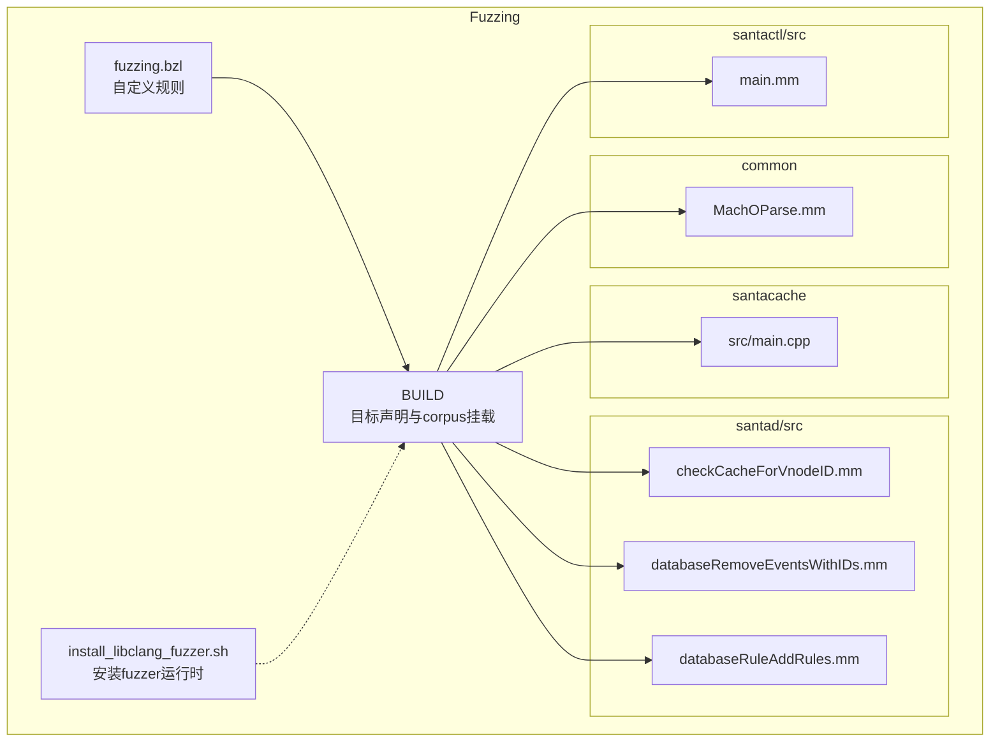
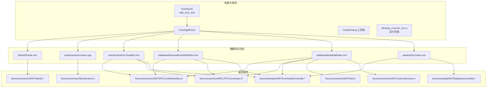
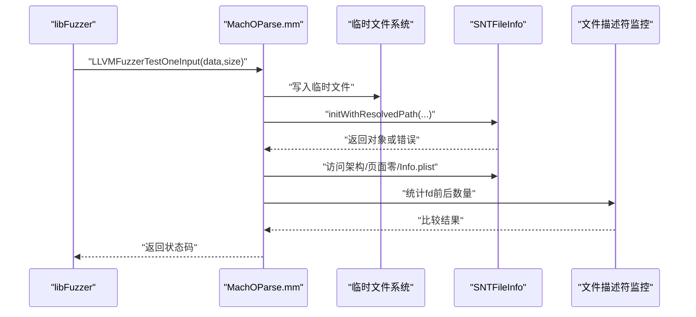
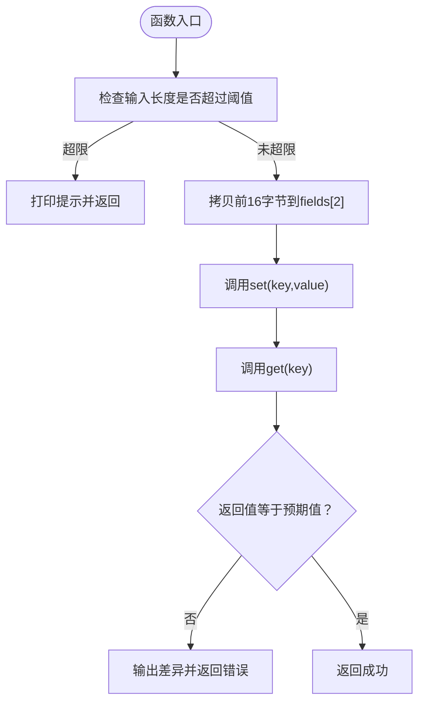
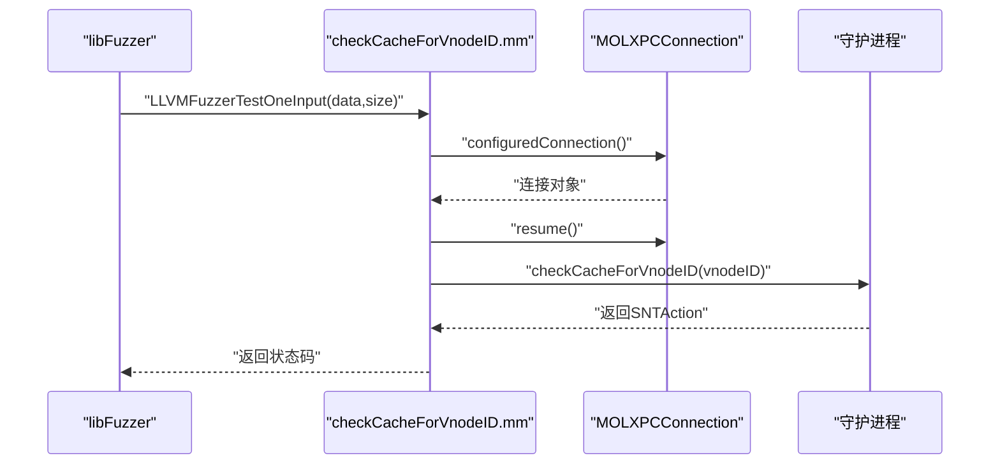
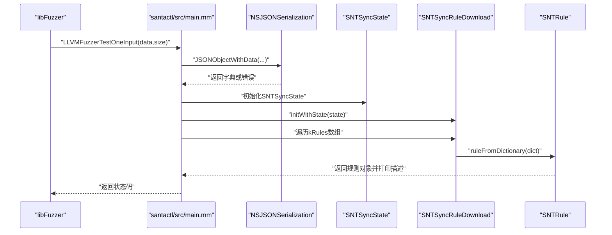
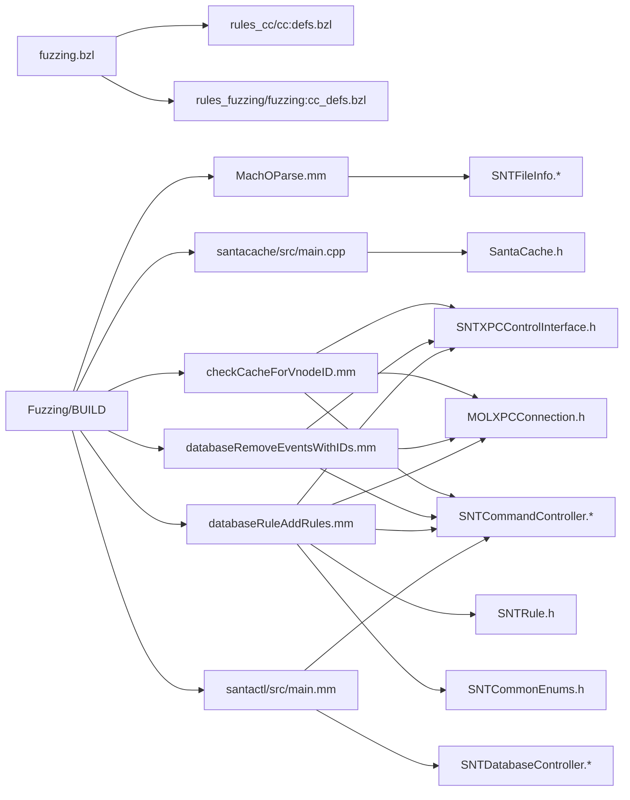

# 模糊测试

<cite>
**本文引用的文件**
- [Fuzzing/fuzzing.bzl](file://Fuzzing/fuzzing.bzl)
- [Fuzzing/BUILD](file://Fuzzing/BUILD)
- [Fuzzing/install_libclang_fuzzer.sh](file://Fuzzing/install_libclang_fuzzer.sh)
- [Fuzzing/common/MachOParse.mm](file://Fuzzing/common/MachOParse.mm)
- [Fuzzing/santacache/src/main.cpp](file://Fuzzing/santacache/src/main.cpp)
- [Fuzzing/santad/src/checkCacheForVnodeID.mm](file://Fuzzing/santad/src/checkCacheForVnodeID.mm)
- [Fuzzing/santad/src/databaseRemoveEventsWithIDs.mm](file://Fuzzing/santad/src/databaseRemoveEventsWithIDs.mm)
- [Fuzzing/santad/src/databaseRuleAddRules.mm](file://Fuzzing/santad/src/databaseRuleAddRules.mm)
- [Fuzzing/santactl/src/main.mm](file://Fuzzing/santactl/src/main.mm)
- [Source/common/SNTFileInfo.h](file://Source/common/SNTFileInfo.h)
- [Source/common/SNTFileInfo.mm](file://Source/common/SNTFileInfo.mm)
- [Source/common/SNTCommonEnums.h](file://Source/common/SNTCommonEnums.h)
- [Source/common/SNTRule.h](file://Source/common/SNTRule.h)
- [Source/common/SNTXPCControlInterface.h](file://Source/common/SNTXPCControlInterface.h)
- [Source/common/MOLXPCConnection.h](file://Source/common/MOLXPCConnection.h)
- [Source/santactl/SNTCommandController.h](file://Source/santactl/SNTCommandController.h)
- [Source/santactl/SNTCommandController.mm](file://Source/santactl/SNTCommandController.mm)
- [Source/santad/SNTDatabaseController.h](file://Source/santad/SNTDatabaseController.h)
- [Source/santad/SNTDatabaseController.mm](file://Source/santad/SNTDatabaseController.mm)
- [Source/common/SantaCache.h](file://Source/common/SantaCache.h)
</cite>

## 目录
1. [简介](#简介)
2. [项目结构](#项目结构)
3. [核心组件](#核心组件)
4. [架构总览](#架构总览)
5. [详细组件分析](#详细组件分析)
6. [依赖分析](#依赖分析)
7. [性能考虑](#性能考虑)
8. [故障排查指南](#故障排查指南)
9. [结论](#结论)
10. [附录](#附录)

## 简介
本文件面向Santa项目的模糊测试体系，系统化说明libFuzzer的集成与配置、fuzzing.bzl构建规则的使用方式、各模糊测试目标（MachO解析器、缓存操作、数据库操作、CLI同步规则解析等）的实现要点、输入生成策略与种子语料库管理、结果分析与崩溃报告处理流程，并提供环境搭建、运行配置与扩展新目标的实践指南。同时讨论模糊测试在安全漏洞发现中的作用与局限性。

## 项目结构
Santa的模糊测试位于Fuzzing目录下，采用Bazel构建系统，通过自定义objc_fuzz_test规则封装objc_library与cc_fuzz_test，统一管理目标编译、链接与语料库挂载。典型目标包括：
- MachO解析：验证SNTFileInfo对任意二进制数据的解析稳健性
- 缓存子系统：验证SantaCache键值缓存的正确性与一致性
- 守护进程数据库操作：通过XPC调用守护进程执行规则增删与事件清理
- CLI规则同步：解析JSON规则集并构造内部对象进行稳健性测试

图表来源
- [Fuzzing/fuzzing.bzl](file://Fuzzing/fuzzing.bzl#L1-L22)
- [Fuzzing/BUILD](file://Fuzzing/BUILD#L1-L12)
- [Fuzzing/install_libclang_fuzzer.sh](file://Fuzzing/install_libclang_fuzzer.sh#L1-L15)
- [Fuzzing/common/MachOParse.mm](file://Fuzzing/common/MachOParse.mm#L1-L41)
- [Fuzzing/santacache/src/main.cpp](file://Fuzzing/santacache/src/main.cpp#L1-L44)
- [Fuzzing/santad/src/checkCacheForVnodeID.mm](file://Fuzzing/santad/src/checkCacheForVnodeID.mm#L1-L60)
- [Fuzzing/santad/src/databaseRemoveEventsWithIDs.mm](file://Fuzzing/santad/src/databaseRemoveEventsWithIDs.mm#L1-L52)
- [Fuzzing/santad/src/databaseRuleAddRules.mm](file://Fuzzing/santad/src/databaseRuleAddRules.mm#L1-L76)
- [Fuzzing/santactl/src/main.mm](file://Fuzzing/santactl/src/main.mm#L1-L63)

章节来源
- [Fuzzing/fuzzing.bzl](file://Fuzzing/fuzzing.bzl#L1-L22)
- [Fuzzing/BUILD](file://Fuzzing/BUILD#L1-L12)
- [Fuzzing/install_libclang_fuzzer.sh](file://Fuzzing/install_libclang_fuzzer.sh#L1-L15)

## 核心组件
- 自定义objc_fuzz_test规则：封装objc_library与cc_fuzz_test，自动注入语料库与链接选项，简化目标声明与复用。
- MachO解析目标：以随机字节写入临时文件，交由SNTFileInfo解析并触发架构、页面零、Info.plist等访问路径，检测异常与资源泄漏。
- 缓存目标：构造固定长度输入，驱动SantaCache的set/get，验证一致性与边界条件。
- 守护进程数据库操作目标：通过SNTXPCControlInterface连接守护进程，调用检查缓存、删除事件、添加规则等接口，覆盖XPC通信与数据库层。
- CLI规则同步目标：解析JSON规则集，构造SNTSyncState与SNTSyncRuleDownload，遍历规则字典生成SNTRule对象，验证序列化与转换稳健性。

章节来源
- [Fuzzing/fuzzing.bzl](file://Fuzzing/fuzzing.bzl#L1-L22)
- [Fuzzing/BUILD](file://Fuzzing/BUILD#L1-L12)
- [Fuzzing/common/MachOParse.mm](file://Fuzzing/common/MachOParse.mm#L1-L41)
- [Fuzzing/santacache/src/main.cpp](file://Fuzzing/santacache/src/main.cpp#L1-L44)
- [Fuzzing/santad/src/checkCacheForVnodeID.mm](file://Fuzzing/santad/src/checkCacheForVnodeID.mm#L1-L60)
- [Fuzzing/santad/src/databaseRemoveEventsWithIDs.mm](file://Fuzzing/santad/src/databaseRemoveEventsWithIDs.mm#L1-L52)
- [Fuzzing/santad/src/databaseRuleAddRules.mm](file://Fuzzing/santad/src/databaseRuleAddRules.mm#L1-L76)
- [Fuzzing/santactl/src/main.mm](file://Fuzzing/santactl/src/main.mm#L1-L63)

## 架构总览
模糊测试整体架构围绕“libFuzzer运行时 + Bazel规则 + 多目标测试 + 语料库”展开。目标通过LLVMFuzzerTestOneInput入口接收输入，部分目标通过XPC与守护进程交互，所有目标均在Bazel中统一构建与运行。

图表来源
- [Fuzzing/fuzzing.bzl](file://Fuzzing/fuzzing.bzl#L1-L22)
- [Fuzzing/BUILD](file://Fuzzing/BUILD#L1-L12)
- [Fuzzing/common/MachOParse.mm](file://Fuzzing/common/MachOParse.mm#L1-L41)
- [Fuzzing/santacache/src/main.cpp](file://Fuzzing/santacache/src/main.cpp#L1-L44)
- [Fuzzing/santad/src/checkCacheForVnodeID.mm](file://Fuzzing/santad/src/checkCacheForVnodeID.mm#L1-L60)
- [Fuzzing/santad/src/databaseRemoveEventsWithIDs.mm](file://Fuzzing/santad/src/databaseRemoveEventsWithIDs.mm#L1-L52)
- [Fuzzing/santad/src/databaseRuleAddRules.mm](file://Fuzzing/santad/src/databaseRuleAddRules.mm#L1-L76)
- [Fuzzing/santactl/src/main.mm](file://Fuzzing/santactl/src/main.mm#L1-L63)
- [Source/common/SNTFileInfo.h](file://Source/common/SNTFileInfo.h)
- [Source/common/SNTFileInfo.mm](file://Source/common/SNTFileInfo.mm)
- [Source/common/SNTCommonEnums.h](file://Source/common/SNTCommonEnums.h)
- [Source/common/SNTRule.h](file://Source/common/SNTRule.h)
- [Source/common/SNTXPCControlInterface.h](file://Source/common/SNTXPCControlInterface.h)
- [Source/common/MOLXPCConnection.h](file://Source/common/MOLXPCConnection.h)
- [Source/santactl/SNTCommandController.h](file://Source/santactl/SNTCommandController.h)
- [Source/santactl/SNTCommandController.mm](file://Source/santactl/SNTCommandController.mm)
- [Source/santad/SNTDatabaseController.h](file://Source/santad/SNTDatabaseController.h)
- [Source/santad/SNTDatabaseController.mm](file://Source/santad/SNTDatabaseController.mm)
- [Source/common/SantaCache.h](file://Source/common/SantaCache.h)

## 详细组件分析

### MachO解析目标（MachOParse）
- 目标职责：以随机输入写入临时文件，交由SNTFileInfo解析，触发架构信息、缺失页面零、Info.plist等访问路径，检测异常与资源泄漏。
- 关键点：
  - 使用临时文件与SNTFileInfo初始化，捕获错误并记录日志。
  - 调用多个解析方法以覆盖不同分支。
  - 对打开文件描述符数量进行前后对比，若增加则中止，防止泄漏。
- 输入策略：无固定格式要求，鼓励多样化的二进制数据；结合语料库持续扩充。
- 运行建议：配合Bazel cc_fuzz_test默认的libFuzzer参数，可按需追加-max_len、-runs、-timeout等。

图表来源
- [Fuzzing/common/MachOParse.mm](file://Fuzzing/common/MachOParse.mm#L1-L41)
- [Source/common/SNTFileInfo.h](file://Source/common/SNTFileInfo.h)
- [Source/common/SNTFileInfo.mm](file://Source/common/SNTFileInfo.mm)

章节来源
- [Fuzzing/common/MachOParse.mm](file://Fuzzing/common/MachOParse.mm#L1-L41)

### 缓存操作目标（santacache）
- 目标职责：以固定长度输入驱动SantaCache的set/get，验证键值一致性与边界条件。
- 关键点：
  - 限制输入最大长度，避免越界。
  - 将前16字节拷贝到两个字段，分别作为key与value。
  - set后get并比对，不一致即返回错误码。
- 输入策略：优先使用短小、可控的输入，便于定位问题；可结合语料库逐步扩大覆盖面。

图表来源
- [Fuzzing/santacache/src/main.cpp](file://Fuzzing/santacache/src/main.cpp#L1-L44)
- [Source/common/SantaCache.h](file://Source/common/SantaCache.h)

章节来源
- [Fuzzing/santacache/src/main.cpp](file://Fuzzing/santacache/src/main.cpp#L1-L44)

### 守护进程数据库操作目标
- checkCacheForVnodeID：通过XPC连接守护进程，查询指定vnodeID是否存在于内核缓存中，打印存在状态。
- databaseRemoveEventsWithIDs：从输入解析出若干事件ID，批量删除对应事件。
- databaseRuleAddRules：解析输入结构体，构造SNTRule并调用守护进程添加或移除规则。

图表来源
- [Fuzzing/santad/src/checkCacheForVnodeID.mm](file://Fuzzing/santad/src/checkCacheForVnodeID.mm#L1-L60)
- [Source/common/MOLXPCConnection.h](file://Source/common/MOLXPCConnection.h)
- [Source/common/SNTXPCControlInterface.h](file://Source/common/SNTXPCControlInterface.h)
- [Source/common/SNTCommonEnums.h](file://Source/common/SNTCommonEnums.h)
- [Source/common/SNTRule.h](file://Source/common/SNTRule.h)
- [Source/santactl/SNTCommandController.h](file://Source/santactl/SNTCommandController.h)
- [Source/santactl/SNTCommandController.mm](file://Source/santactl/SNTCommandController.mm)

章节来源
- [Fuzzing/santad/src/checkCacheForVnodeID.mm](file://Fuzzing/santad/src/checkCacheForVnodeID.mm#L1-L60)
- [Fuzzing/santad/src/databaseRemoveEventsWithIDs.mm](file://Fuzzing/santad/src/databaseRemoveEventsWithIDs.mm#L1-L52)
- [Fuzzing/santad/src/databaseRuleAddRules.mm](file://Fuzzing/santad/src/databaseRuleAddRules.mm#L1-L76)

### CLI规则同步目标（santactl）
- 目标职责：解析传入的JSON数据，提取规则数组，构造SNTSyncState与SNTSyncRuleDownload，逐条生成SNTRule对象并打印描述。
- 关键点：
  - 对NSData与JSON解析进行健壮性测试，避免空指针与类型不匹配。
  - 遍历规则字典，调用ruleFromDictionary生成规则对象，验证序列化与转换逻辑。

图表来源
- [Fuzzing/santactl/src/main.mm](file://Fuzzing/santactl/src/main.mm#L1-L63)
- [Source/santactl/SNTCommandController.h](file://Source/santactl/SNTCommandController.h)
- [Source/santactl/SNTCommandController.mm](file://Source/santactl/SNTCommandController.mm)
- [Source/santad/SNTDatabaseController.h](file://Source/santad/SNTDatabaseController.h)
- [Source/santad/SNTDatabaseController.mm](file://Source/santad/SNTDatabaseController.mm)

章节来源
- [Fuzzing/santactl/src/main.mm](file://Fuzzing/santactl/src/main.mm#L1-L63)

## 依赖分析
- 规则依赖：fuzzing.bzl依赖rules_cc与rules_fuzzing，objc_fuzz_test内部组合objc_library与cc_fuzz_test，确保目标具备语料库与链接选项。
- 目标依赖：
  - MachOParse依赖SNTFileInfo，间接依赖Foundation与系统文件能力。
  - 守护进程目标依赖XPC接口与SNTCommandController，以及SNTCommonEnums、SNTRule等枚举与模型。
  - CLI目标依赖SNTSyncState、SNTSyncRuleDownload与JSON解析。
  - 缓存目标依赖SantaCache模板类。
- 外部依赖：SQLite链接选项用于MachO解析目标；libclang_rt.fuzzer_osx.a由install_libclang_fuzzer.sh安装。

图表来源
- [Fuzzing/fuzzing.bzl](file://Fuzzing/fuzzing.bzl#L1-L22)
- [Fuzzing/BUILD](file://Fuzzing/BUILD#L1-L12)
- [Fuzzing/common/MachOParse.mm](file://Fuzzing/common/MachOParse.mm#L1-L41)
- [Fuzzing/santacache/src/main.cpp](file://Fuzzing/santacache/src/main.cpp#L1-L44)
- [Fuzzing/santad/src/checkCacheForVnodeID.mm](file://Fuzzing/santad/src/checkCacheForVnodeID.mm#L1-L60)
- [Fuzzing/santad/src/databaseRemoveEventsWithIDs.mm](file://Fuzzing/santad/src/databaseRemoveEventsWithIDs.mm#L1-L52)
- [Fuzzing/santad/src/databaseRuleAddRules.mm](file://Fuzzing/santad/src/databaseRuleAddRules.mm#L1-L76)
- [Fuzzing/santactl/src/main.mm](file://Fuzzing/santactl/src/main.mm#L1-L63)
- [Source/common/SNTFileInfo.h](file://Source/common/SNTFileInfo.h)
- [Source/common/SNTFileInfo.mm](file://Source/common/SNTFileInfo.mm)
- [Source/common/SantaCache.h](file://Source/common/SantaCache.h)
- [Source/common/SNTXPCControlInterface.h](file://Source/common/SNTXPCControlInterface.h)
- [Source/common/MOLXPCConnection.h](file://Source/common/MOLXPCConnection.h)
- [Source/common/SNTRule.h](file://Source/common/SNTRule.h)
- [Source/common/SNTCommonEnums.h](file://Source/common/SNTCommonEnums.h)
- [Source/santactl/SNTCommandController.h](file://Source/santactl/SNTCommandController.h)
- [Source/santactl/SNTCommandController.mm](file://Source/santactl/SNTCommandController.mm)
- [Source/santad/SNTDatabaseController.h](file://Source/santad/SNTDatabaseController.h)
- [Source/santad/SNTDatabaseController.mm](file://Source/santad/SNTDatabaseController.mm)

章节来源
- [Fuzzing/fuzzing.bzl](file://Fuzzing/fuzzing.bzl#L1-L22)
- [Fuzzing/BUILD](file://Fuzzing/BUILD#L1-L12)

## 性能考虑
- 目标规模控制：通过输入长度限制与固定缓冲区减少无效探索，提升覆盖率与稳定性。
- 语料库管理：定期更新与去重，优先保留能触发新分支或崩溃的样本，避免冗余。
- 并发与资源：XPC目标需注意守护进程可用性与连接开销，必要时降低并发度或增加重试策略。
- 运行时间：根据目标复杂度调整-fuzztime与-max_total_time，平衡探索深度与时间成本。

## 故障排查指南
- 运行时库缺失：Xcode自带的fuzzer运行时可能缺失，使用install_libclang_fuzzer.sh自动下载并安装兼容版本。
- 守护进程不可达：XPC目标在连接失败时会退出，需确认守护进程已启动且端口可用。
- 解析失败：JSON或规则解析失败时直接返回，建议在本地先用小样本验证输入格式。
- 资源泄漏：MachOParse通过文件描述符计数检测泄漏，若异常应检查临时文件清理与异常路径。

章节来源
- [Fuzzing/install_libclang_fuzzer.sh](file://Fuzzing/install_libclang_fuzzer.sh#L1-L15)
- [Fuzzing/santad/src/checkCacheForVnodeID.mm](file://Fuzzing/santad/src/checkCacheForVnodeID.mm#L1-L60)
- [Fuzzing/santactl/src/main.mm](file://Fuzzing/santactl/src/main.mm#L1-L63)
- [Fuzzing/common/MachOParse.mm](file://Fuzzing/common/MachOParse.mm#L1-L41)

## 结论
Santa的模糊测试体系通过自定义规则与多目标覆盖，有效提升了关键路径的稳健性，尤其在解析、缓存与数据库操作方面。结合语料库与运行时库管理，可在持续集成中稳定产出高质量的覆盖率与潜在缺陷线索。建议持续扩展目标、完善语料库，并将崩溃报告纳入问题跟踪流程。

## 附录

### 环境搭建与运行配置
- 安装libFuzzer运行时：执行安装脚本以补齐Xcode工具链缺失的运行时库。
- 构建与运行：使用Bazel加载Fuzzing/BUILD，即可为各目标生成cc_fuzz_test可执行文件并运行libFuzzer。
- 语料库挂载：通过BUILD中的corpus字段挂载对应目录，支持glob通配。
- 常用参数：可按需追加-max_len、-runs、-timeout、-max_total_time、-print_pcs等以优化探索行为。

章节来源
- [Fuzzing/install_libclang_fuzzer.sh](file://Fuzzing/install_libclang_fuzzer.sh#L1-L15)
- [Fuzzing/BUILD](file://Fuzzing/BUILD#L1-L12)
- [Fuzzing/fuzzing.bzl](file://Fuzzing/fuzzing.bzl#L1-L22)

### 种子语料库管理
- 位置：MachO解析目标示例包含种子文件目录，可在此放置多样化二进制样本。
- 策略：优先选择边界值、畸形数据与真实场景样本；定期清理重复与低价值样本；保持目录结构清晰以便Bazel glob识别。

章节来源
- [Fuzzing/BUILD](file://Fuzzing/BUILD#L1-L12)

### 扩展新模糊测试目标
- 新建源文件并实现LLVMFuzzerTestOneInput入口。
- 在Fuzzing/BUILD中新增objc_fuzz_test条目，设置srcs、deps、corpus与linkopts。
- 若涉及XPC或外部服务，确保目标进程可用或在测试中模拟/降级。
- 通过Bazel构建并运行，观察覆盖率与崩溃情况，迭代优化输入策略与语料库。

章节来源
- [Fuzzing/fuzzing.bzl](file://Fuzzing/fuzzing.bzl#L1-L22)
- [Fuzzing/BUILD](file://Fuzzing/BUILD#L1-L12)

### 模糊测试在安全漏洞发现中的作用与局限性
- 作用：快速发现内存错误、解析异常、竞态条件与协议边界问题，尤其适用于高风险的I/O与序列化路径。
- 局限性：无法替代形式化验证与人工渗透测试；对业务逻辑正确性与权限控制的覆盖有限；需要持续维护语料库与规则。