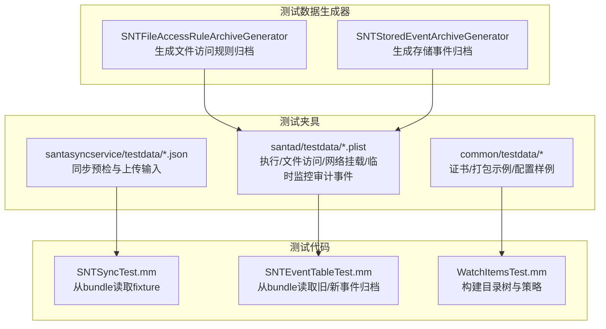
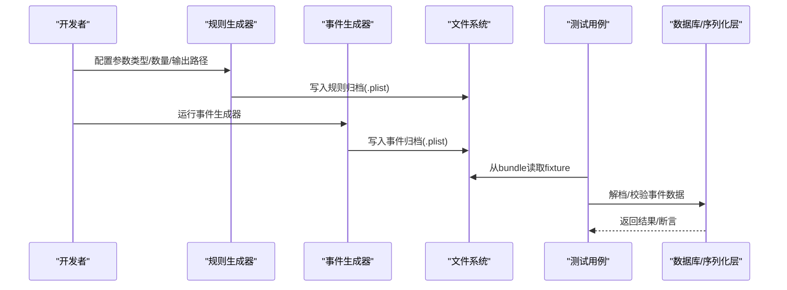
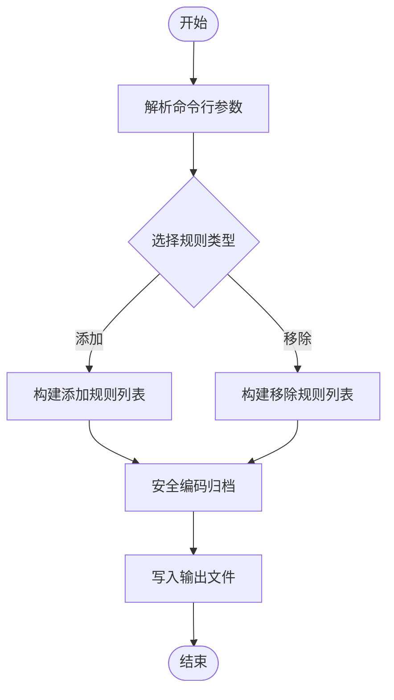
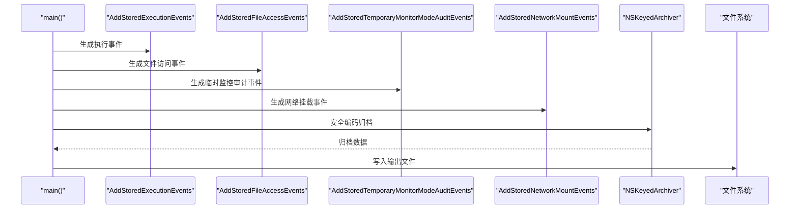
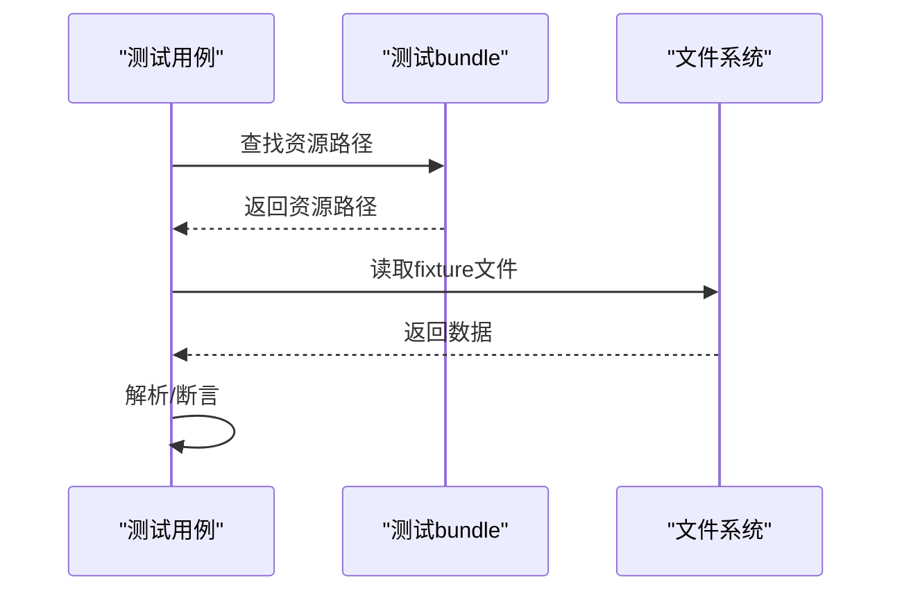
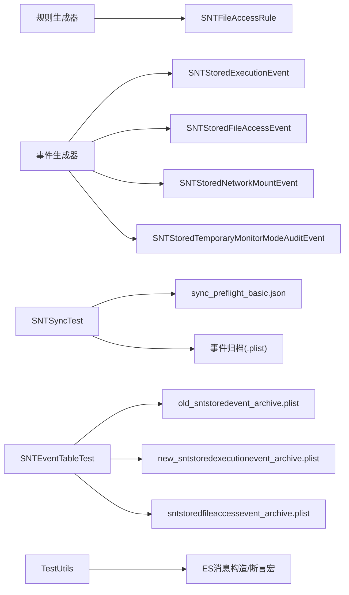

# 测试数据管理

<cite>
**本文引用的文件**
- [SNTFileAccessRuleArchiveGenerator.mm](file://Testing/OneOffs/SNTFileAccessRuleArchiveGenerator.mm)
- [SNTStoredEventArchiveGenerator.mm](file://Testing/OneOffs/SNTStoredEventArchiveGenerator.mm)
- [new_sntstoredexecutionevent_archive.plist](file://Source/santad/testdata/new_sntstoredexecutionevent_archive.plist)
- [old_sntstoredevent_archive.plist](file://Source/santad/testdata/old_sntstoredevent_archive.plist)
- [sntstoredfileaccessevent_archive.plist](file://Source/santad/testdata/sntstoredfileaccessevent_archive.plist)
- [sync_preflight_basic.json](file://Source/santasyncservice/testdata/sync_preflight_basic.json)
- [SNTSyncTest.mm](file://Source/santasyncservice/SNTSyncTest.mm)
- [SNTEventTableTest.mm](file://Source/santad/DataLayer/SNTEventTableTest.mm)
- [TestUtils.h](file://Source/common/TestUtils.h)
- [TestUtils.mm](file://Source/common/TestUtils.mm)
- [fix.sh](file://Testing/fix.sh)
- [SNTFileAccessRule.mm](file://Source/common/SNTFileAccessRule.mm)
- [SNTExportConfiguration.mm](file://Source/common/SNTExportConfiguration.mm)
- [SNTExportConfigurationTest.mm](file://Source/common/SNTExportConfigurationTest.mm)
- [SNTSyncRuleDownloadTest.mm](file://Source/santasyncservice/SNTSyncRuleDownloadTest.mm)
- [SNTSyncStage.mm](file://Source/santasyncservice/SNTSyncStage.mm)
- [SNTRuleTable.mm](file://Source/santad/DataLayer/SNTRuleTable.mm)
- [WatchItemsTest.mm](file://Source/common/faa/WatchItemsTest.mm)
- [SNTStoredEvent.mm](file://Source/common/SNTStoredEvent.mm)
- [SNTStoredExecutionEvent.mm](file://Source/common/SNTStoredExecutionEvent.mm)
- [SNTStoredFileAccessEvent.mm](file://Source/common/SNTStoredFileAccessEvent.mm)
- [SNTStoredNetworkMountEvent.mm](file://Source/common/SNTStoredNetworkMountEvent.mm)
- [SNTStoredTemporaryMonitorModeAuditEvent.mm](file://Source/common/SNTStoredTemporaryMonitorModeAuditEvent.mm)
</cite>

## 目录
1. [引言](#引言)
2. [项目结构](#项目结构)
3. [核心组件](#核心组件)
4. [架构总览](#架构总览)
5. [详细组件分析](#详细组件分析)
6. [依赖关系分析](#依赖关系分析)
7. [性能考量](#性能考量)
8. [故障排查指南](#故障排查指南)
9. [结论](#结论)
10. [附录](#附录)

## 引言
本文件聚焦 Santa 项目的“测试数据管理”，系统性阐述测试数据的组织结构、生成工具、生命周期管理（生成、版本控制、清理）、隔离与并发控制、备份与恢复、标准化与规范化，以及面向不同测试场景的数据集准备策略。重点围绕两类关键生成器：SNTFileAccessRuleArchiveGenerator 和 SNTStoredEventArchiveGenerator；并结合现有测试夹具（fixtures）与测试辅助工具，给出可操作的实践建议。

## 项目结构
Santa 的测试数据主要分布在以下位置：
- Testing/OneOffs：一次性测试数据生成器（命令行工具），用于批量生成规则或事件归档文件。
- Source/santad/testdata：已归档的事件数据（plist），供数据库层与日志导出等模块测试使用。
- Source/santasyncservice/testdata：同步服务输入样例（JSON），用于预检与事件上传流程测试。
- Source/common/testdata：通用测试资源（证书、打包示例、配置样例等）。
- 各模块测试源码中通过 bundle 资源读取测试夹具，确保测试隔离与可复现。

图表来源
- [SNTFileAccessRuleArchiveGenerator.mm](file://Testing/OneOffs/SNTFileAccessRuleArchiveGenerator.mm#L1-L139)
- [SNTStoredEventArchiveGenerator.mm](file://Testing/OneOffs/SNTStoredEventArchiveGenerator.mm#L1-L216)
- [new_sntstoredexecutionevent_archive.plist](file://Source/santad/testdata/new_sntstoredexecutionevent_archive.plist#L1-L420)
- [old_sntstoredevent_archive.plist](file://Source/santad/testdata/old_sntstoredevent_archive.plist#L1-L405)
- [sntstoredfileaccessevent_archive.plist](file://Source/santad/testdata/sntstoredfileaccessevent_archive.plist#L1-L345)
- [sync_preflight_basic.json](file://Source/santasyncservice/testdata/sync_preflight_basic.json#L1-L2)
- [SNTSyncTest.mm](file://Source/santasyncservice/SNTSyncTest.mm#L194-L227)
- [SNTEventTableTest.mm](file://Source/santad/DataLayer/SNTEventTableTest.mm#L390-L419)
- [WatchItemsTest.mm](file://Source/common/faa/WatchItemsTest.mm#L1417-L1468)

章节来源
- [SNTFileAccessRuleArchiveGenerator.mm](file://Testing/OneOffs/SNTFileAccessRuleArchiveGenerator.mm#L1-L139)
- [SNTStoredEventArchiveGenerator.mm](file://Testing/OneOffs/SNTStoredEventArchiveGenerator.mm#L1-L216)
- [new_sntstoredexecutionevent_archive.plist](file://Source/santad/testdata/new_sntstoredexecutionevent_archive.plist#L1-L420)
- [old_sntstoredevent_archive.plist](file://Source/santad/testdata/old_sntstoredevent_archive.plist#L1-L405)
- [sntstoredfileaccessevent_archive.plist](file://Source/santad/testdata/sntstoredfileaccessevent_archive.plist#L1-L345)
- [sync_preflight_basic.json](file://Source/santasyncservice/testdata/sync_preflight_basic.json#L1-L2)
- [SNTSyncTest.mm](file://Source/santasyncservice/SNTSyncTest.mm#L194-L227)
- [SNTEventTableTest.mm](file://Source/santad/DataLayer/SNTEventTableTest.mm#L390-L419)
- [WatchItemsTest.mm](file://Source/common/faa/WatchItemsTest.mm#L1417-L1468)

## 核心组件
- 测试数据生成器
  - SNTFileAccessRuleArchiveGenerator：按参数生成文件访问规则归档（plist），支持添加/移除两类规则，默认数量与输出路径可配置。
  - SNTStoredEventArchiveGenerator：生成包含多种事件类型的存储事件归档（plist），便于事件上传与解析测试。
- 测试夹具（fixtures）
  - santad/testdata 下的 plist：包含执行事件、文件访问事件、网络挂载事件、临时监控模式审计事件等历史与新格式样本。
  - santasyncservice/testdata 下的 json：同步预检与事件上传输入样例。
- 测试读取与验证
  - 测试代码通过 bundle 资源定位并读取 fixture，保证测试隔离与跨平台一致性。
  - 数据库层测试对旧/新事件归档进行解档与校验，确保兼容性。
- 工具与规范
  - TestUtils 提供 ES 消息构造、字符串重复、时间等待等测试辅助能力。
  - fix.sh 统一格式化与静态检查，保障测试数据与代码风格一致。

章节来源
- [SNTFileAccessRuleArchiveGenerator.mm](file://Testing/OneOffs/SNTFileAccessRuleArchiveGenerator.mm#L1-L139)
- [SNTStoredEventArchiveGenerator.mm](file://Testing/OneOffs/SNTStoredEventArchiveGenerator.mm#L1-L216)
- [new_sntstoredexecutionevent_archive.plist](file://Source/santad/testdata/new_sntstoredexecutionevent_archive.plist#L1-L420)
- [old_sntstoredevent_archive.plist](file://Source/santad/testdata/old_sntstoredevent_archive.plist#L1-L405)
- [sntstoredfileaccessevent_archive.plist](file://Source/santad/testdata/sntstoredfileaccessevent_archive.plist#L1-L345)
- [sync_preflight_basic.json](file://Source/santasyncservice/testdata/sync_preflight_basic.json#L1-L2)
- [SNTSyncTest.mm](file://Source/santasyncservice/SNTSyncTest.mm#L194-L227)
- [SNTEventTableTest.mm](file://Source/santad/DataLayer/SNTEventTableTest.mm#L390-L419)
- [TestUtils.h](file://Source/common/TestUtils.h#L1-L106)
- [TestUtils.mm](file://Source/common/TestUtils.mm#L1-L325)
- [fix.sh](file://Testing/fix.sh#L1-L8)

## 架构总览
下图展示测试数据在生成、落盘、读取与验证之间的交互关系。

图表来源
- [SNTFileAccessRuleArchiveGenerator.mm](file://Testing/OneOffs/SNTFileAccessRuleArchiveGenerator.mm#L1-L139)
- [SNTStoredEventArchiveGenerator.mm](file://Testing/OneOffs/SNTStoredEventArchiveGenerator.mm#L1-L216)
- [SNTSyncTest.mm](file://Source/santasyncservice/SNTSyncTest.mm#L194-L227)
- [SNTEventTableTest.mm](file://Source/santad/DataLayer/SNTEventTableTest.mm#L390-L419)

## 详细组件分析

### 组件A：SNTFileAccessRuleArchiveGenerator（文件访问规则归档生成器）
- 功能要点
  - 支持生成“添加”和“移除”两类规则，可通过参数切换。
  - 可指定生成数量与输出路径，默认输出到临时目录。
  - 使用安全编码写入归档，确保可逆与可验证。
- 关键实现路径
  - 参数解析与默认值：[SNTFileAccessRuleArchiveGenerator.mm](file://Testing/OneOffs/SNTFileAccessRuleArchiveGenerator.mm#L87-L116)
  - 生成“添加”规则逻辑：[SNTFileAccessRuleArchiveGenerator.mm](file://Testing/OneOffs/SNTFileAccessRuleArchiveGenerator.mm#L47-L74)
  - 生成“移除”规则逻辑：[SNTFileAccessRuleArchiveGenerator.mm](file://Testing/OneOffs/SNTFileAccessRuleArchiveGenerator.mm#L76-L85)
  - 归档与落盘：[SNTFileAccessRuleArchiveGenerator.mm](file://Testing/OneOffs/SNTFileAccessRuleArchiveGenerator.mm#L121-L133)

图表来源
- [SNTFileAccessRuleArchiveGenerator.mm](file://Testing/OneOffs/SNTFileAccessRuleArchiveGenerator.mm#L47-L133)

章节来源
- [SNTFileAccessRuleArchiveGenerator.mm](file://Testing/OneOffs/SNTFileAccessRuleArchiveGenerator.mm#L1-L139)

### 组件B：SNTStoredEventArchiveGenerator（存储事件归档生成器）
- 功能要点
  - 生成多种事件类型：执行事件、文件访问事件、网络挂载事件、临时监控模式审计事件。
  - 事件字段覆盖签名状态、用户会话、进程链、决策等关键维度，便于端到端测试。
  - 输出为 plist，可直接用于事件上传与解析测试。
- 关键实现路径
  - 执行事件构建：[SNTStoredEventArchiveGenerator.mm](file://Testing/OneOffs/SNTStoredEventArchiveGenerator.mm#L42-L91)
  - 文件访问事件构建：[SNTStoredEventArchiveGenerator.mm](file://Testing/OneOffs/SNTStoredEventArchiveGenerator.mm#L93-L125)
  - 临时监控模式审计事件构建：[SNTStoredEventArchiveGenerator.mm](file://Testing/OneOffs/SNTStoredEventArchiveGenerator.mm#L127-L138)
  - 网络挂载事件构建：[SNTStoredEventArchiveGenerator.mm](file://Testing/OneOffs/SNTStoredEventArchiveGenerator.mm#L140-L188)
  - 归档与落盘：[SNTStoredEventArchiveGenerator.mm](file://Testing/OneOffs/SNTStoredEventArchiveGenerator.mm#L190-L210)

图表来源
- [SNTStoredEventArchiveGenerator.mm](file://Testing/OneOffs/SNTStoredEventArchiveGenerator.mm#L42-L210)

章节来源
- [SNTStoredEventArchiveGenerator.mm](file://Testing/OneOffs/SNTStoredEventArchiveGenerator.mm#L1-L216)

### 组件C：测试夹具（fixtures）与读取
- 夹具组织
  - santad/testdata：包含旧版与新版存储事件归档，以及文件访问事件归档，覆盖不同版本演进。
  - santasyncservice/testdata：同步预检与事件上传输入样例，便于端到端同步流程测试。
- 读取方式
  - 测试通过 bundle 资源定位并读取，确保跨平台与隔离性。
  - 示例：[SNTSyncTest.mm](file://Source/santasyncservice/SNTSyncTest.mm#L194-L204)、[SNTEventTableTest.mm](file://Source/santad/DataLayer/SNTEventTableTest.mm#L390-L413)

图表来源
- [SNTSyncTest.mm](file://Source/santasyncservice/SNTSyncTest.mm#L194-L204)
- [SNTEventTableTest.mm](file://Source/santad/DataLayer/SNTEventTableTest.mm#L390-L413)

章节来源
- [new_sntstoredexecutionevent_archive.plist](file://Source/santad/testdata/new_sntstoredexecutionevent_archive.plist#L1-L420)
- [old_sntstoredevent_archive.plist](file://Source/santad/testdata/old_sntstoredevent_archive.plist#L1-L405)
- [sntstoredfileaccessevent_archive.plist](file://Source/santad/testdata/sntstoredfileaccessevent_archive.plist#L1-L345)
- [sync_preflight_basic.json](file://Source/santasyncservice/testdata/sync_preflight_basic.json#L1-L2)
- [SNTSyncTest.mm](file://Source/santasyncservice/SNTSyncTest.mm#L194-L204)
- [SNTEventTableTest.mm](file://Source/santad/DataLayer/SNTEventTableTest.mm#L390-L419)

### 组件D：测试数据生命周期管理
- 生成
  - 使用生成器按需生成规则或事件归档，参数化数量与类型，输出到固定或自定义路径。
- 版本控制
  - 通过不同文件名区分旧/新格式（如 old/new 前缀），并在测试中分别验证兼容性。
- 清理
  - 事件表支持按清理策略删除规则与事件数据，便于测试环境重置。
  - 示例：[SNTRuleTable.mm](file://Source/santad/DataLayer/SNTRuleTable.mm#L651-L688)
- 备份与恢复
  - 建议在 CI 中将生成的归档作为 artifacts 保存，以便后续回归与对比。
- 标准化与规范化
  - 使用安全编码与统一字段命名，避免跨版本差异导致的解析失败。
  - 示例：规则归档使用安全编码；事件归档包含签名链、时间戳、用户会话等标准化字段。

章节来源
- [SNTFileAccessRuleArchiveGenerator.mm](file://Testing/OneOffs/SNTFileAccessRuleArchiveGenerator.mm#L1-L139)
- [SNTStoredEventArchiveGenerator.mm](file://Testing/OneOffs/SNTStoredEventArchiveGenerator.mm#L1-L216)
- [new_sntstoredexecutionevent_archive.plist](file://Source/santad/testdata/new_sntstoredexecutionevent_archive.plist#L1-L420)
- [old_sntstoredevent_archive.plist](file://Source/santad/testdata/old_sntstoredevent_archive.plist#L1-L405)
- [SNTRuleTable.mm](file://Source/santad/DataLayer/SNTRuleTable.mm#L651-L688)

### 组件E：隔离与并发访问控制
- 隔离
  - 测试通过 bundle 资源读取，避免污染源码树；生成器输出到临时目录，减少对工作区的影响。
- 并发
  - 测试辅助工具提供信号量断言宏，便于验证异步行为与并发正确性。
  - 示例：[TestUtils.h](file://Source/common/TestUtils.h#L30-L66)、[TestUtils.mm](file://Source/common/TestUtils.mm#L113-L122)

章节来源
- [SNTSyncTest.mm](file://Source/santasyncservice/SNTSyncTest.mm#L194-L227)
- [TestUtils.h](file://Source/common/TestUtils.h#L30-L66)
- [TestUtils.mm](file://Source/common/TestUtils.mm#L113-L122)

### 组件F：备份与恢复机制
- 建议
  - 将生成的归档文件纳入 CI artifacts，保留多版本样本以支持回归测试。
  - 在本地开发中，使用固定输出路径与版本化命名，便于快速回滚与对比。
- 实践
  - 生成器默认输出到临时目录，可在 CI 中将其移动至 artifacts 目录。

章节来源
- [SNTFileAccessRuleArchiveGenerator.mm](file://Testing/OneOffs/SNTFileAccessRuleArchiveGenerator.mm#L1-L139)
- [SNTStoredEventArchiveGenerator.mm](file://Testing/OneOffs/SNTStoredEventArchiveGenerator.mm#L1-L216)

### 组件G：标准化与规范化处理
- 字段命名与类型
  - 事件归档包含签名链、时间戳、用户会话、进程信息等标准化字段，便于跨模块解析。
- 编码与序列化
  - 使用安全编码写入归档，确保可逆与跨语言兼容。
  - 示例：规则归档与配置归档均采用安全编码写入与解码。
- 示例参考
  - 规则归档：[SNTFileAccessRule.mm](file://Source/common/SNTFileAccessRule.mm#L37-L37)
  - 导出配置归档：[SNTExportConfiguration.mm](file://Source/common/SNTExportConfiguration.mm#L59-L76)、[SNTExportConfigurationTest.mm](file://Source/common/SNTExportConfigurationTest.mm#L42-L48)

章节来源
- [SNTStoredEventArchiveGenerator.mm](file://Testing/OneOffs/SNTStoredEventArchiveGenerator.mm#L1-L216)
- [SNTFileAccessRule.mm](file://Source/common/SNTFileAccessRule.mm#L37-L37)
- [SNTExportConfiguration.mm](file://Source/common/SNTExportConfiguration.mm#L59-L76)
- [SNTExportConfigurationTest.mm](file://Source/common/SNTExportConfigurationTest.mm#L42-L48)

### 组件H：不同测试场景的数据集准备
- 规则下载测试
  - 使用规则生成器生成“添加/移除”规则归档，模拟真实规则下载场景。
  - 参考：[SNTFileAccessRuleArchiveGenerator.mm](file://Testing/OneOffs/SNTFileAccessRuleArchiveGenerator.mm#L47-L116)
- 事件上传测试
  - 使用事件生成器生成包含多种事件类型的归档，配合同步预检输入进行端到端测试。
  - 参考：[SNTStoredEventArchiveGenerator.mm](file://Testing/OneOffs/SNTStoredEventArchiveGenerator.mm#L42-L210)、[sync_preflight_basic.json](file://Source/santasyncservice/testdata/sync_preflight_basic.json#L1-L2)
- 数据库兼容性测试
  - 使用旧/新事件归档进行解档与断言，验证版本演进下的兼容性。
  - 参考：[SNTEventTableTest.mm](file://Source/santad/DataLayer/SNTEventTableTest.mm#L390-L419)
- 文件访问策略测试
  - 通过 WatchItems 测试构建目录树与策略，结合文件访问事件归档验证策略匹配。
  - 参考：[WatchItemsTest.mm](file://Source/common/faa/WatchItemsTest.mm#L1417-L1468)

章节来源
- [SNTFileAccessRuleArchiveGenerator.mm](file://Testing/OneOffs/SNTFileAccessRuleArchiveGenerator.mm#L1-L139)
- [SNTStoredEventArchiveGenerator.mm](file://Testing/OneOffs/SNTStoredEventArchiveGenerator.mm#L1-L216)
- [sync_preflight_basic.json](file://Source/santasyncservice/testdata/sync_preflight_basic.json#L1-L2)
- [SNTEventTableTest.mm](file://Source/santad/DataLayer/SNTEventTableTest.mm#L390-L419)
- [WatchItemsTest.mm](file://Source/common/faa/WatchItemsTest.mm#L1417-L1468)

## 依赖关系分析
- 生成器依赖
  - 规则生成器依赖文件访问规则模型与配置项。
  - 事件生成器依赖各类存储事件模型与文件信息、签名检查器。
- 测试依赖
  - 同步测试依赖同步预检输入与事件归档。
  - 数据库测试依赖事件归档与结果集模拟。
- 工具依赖
  - TestUtils 提供 ES 消息构造与并发断言宏，支撑复杂测试场景。

图表来源
- [SNTFileAccessRule.mm](file://Source/common/SNTFileAccessRule.mm#L37-L37)
- [SNTStoredExecutionEvent.mm](file://Source/common/SNTStoredExecutionEvent.mm)
- [SNTStoredFileAccessEvent.mm](file://Source/common/SNTStoredFileAccessEvent.mm)
- [SNTStoredNetworkMountEvent.mm](file://Source/common/SNTStoredNetworkMountEvent.mm)
- [SNTStoredTemporaryMonitorModeAuditEvent.mm](file://Source/common/SNTStoredTemporaryMonitorModeAuditEvent.mm)
- [SNTSyncTest.mm](file://Source/santasyncservice/SNTSyncTest.mm#L194-L227)
- [sync_preflight_basic.json](file://Source/santasyncservice/testdata/sync_preflight_basic.json#L1-L2)
- [SNTEventTableTest.mm](file://Source/santad/DataLayer/SNTEventTableTest.mm#L390-L419)
- [old_sntstoredevent_archive.plist](file://Source/santad/testdata/old_sntstoredevent_archive.plist#L1-L405)
- [new_sntstoredexecutionevent_archive.plist](file://Source/santad/testdata/new_sntstoredexecutionevent_archive.plist#L1-L420)
- [sntstoredfileaccessevent_archive.plist](file://Source/santad/testdata/sntstoredfileaccessevent_archive.plist#L1-L345)
- [TestUtils.h](file://Source/common/TestUtils.h#L30-L66)
- [TestUtils.mm](file://Source/common/TestUtils.mm#L97-L122)

章节来源
- [SNTFileAccessRule.mm](file://Source/common/SNTFileAccessRule.mm#L37-L37)
- [SNTStoredEvent.mm](file://Source/common/SNTStoredEvent.mm)
- [SNTStoredExecutionEvent.mm](file://Source/common/SNTStoredExecutionEvent.mm)
- [SNTStoredFileAccessEvent.mm](file://Source/common/SNTStoredFileAccessEvent.mm)
- [SNTStoredNetworkMountEvent.mm](file://Source/common/SNTStoredNetworkMountEvent.mm)
- [SNTStoredTemporaryMonitorModeAuditEvent.mm](file://Source/common/SNTStoredTemporaryMonitorModeAuditEvent.mm)
- [SNTSyncTest.mm](file://Source/santasyncservice/SNTSyncTest.mm#L194-L227)
- [sync_preflight_basic.json](file://Source/santasyncservice/testdata/sync_preflight_basic.json#L1-L2)
- [SNTEventTableTest.mm](file://Source/santad/DataLayer/SNTEventTableTest.mm#L390-L419)
- [TestUtils.h](file://Source/common/TestUtils.h#L30-L66)
- [TestUtils.mm](file://Source/common/TestUtils.mm#L97-L122)

## 性能考量
- 生成器
  - 生成数量与字段复杂度直接影响归档体积与写入耗时，建议按需生成并复用。
- 测试读取
  - 通过 bundle 资源读取避免磁盘抖动；对大文件建议分块读取与惰性解析。
- 并发断言
  - 使用信号量断言宏避免忙等，提升测试稳定性与吞吐。

## 故障排查指南
- 生成失败
  - 检查参数合法性与输出路径权限；确认归档写入成功后再进行测试。
  - 参考：[SNTFileAccessRuleArchiveGenerator.mm](file://Testing/OneOffs/SNTFileAccessRuleArchiveGenerator.mm#L93-L116)、[SNTStoredEventArchiveGenerator.mm](file://Testing/OneOffs/SNTStoredEventArchiveGenerator.mm#L190-L210)
- 读取失败
  - 确认 bundle 资源路径存在且未被修改；使用测试断言确保资源加载成功。
  - 参考：[SNTSyncTest.mm](file://Source/santasyncservice/SNTSyncTest.mm#L194-L204)
- 兼容性问题
  - 对比旧/新事件归档，确认字段映射与解析逻辑；必要时更新解析器。
  - 参考：[SNTEventTableTest.mm](file://Source/santad/DataLayer/SNTEventTableTest.mm#L390-L419)
- 并发异常
  - 使用 TestUtils 提供的断言宏验证异步行为；检查信号量等待超时设置。
  - 参考：[TestUtils.h](file://Source/common/TestUtils.h#L30-L66)、[TestUtils.mm](file://Source/common/TestUtils.mm#L113-L122)

章节来源
- [SNTFileAccessRuleArchiveGenerator.mm](file://Testing/OneOffs/SNTFileAccessRuleArchiveGenerator.mm#L93-L116)
- [SNTStoredEventArchiveGenerator.mm](file://Testing/OneOffs/SNTStoredEventArchiveGenerator.mm#L190-L210)
- [SNTSyncTest.mm](file://Source/santasyncservice/SNTSyncTest.mm#L194-L204)
- [SNTEventTableTest.mm](file://Source/santad/DataLayer/SNTEventTableTest.mm#L390-L419)
- [TestUtils.h](file://Source/common/TestUtils.h#L30-L66)
- [TestUtils.mm](file://Source/common/TestUtils.mm#L113-L122)

## 结论
Santa 的测试数据管理以“生成器 + 夹具 + 测试读取 + 工具辅助”的体系为核心，实现了高内聚、低耦合的测试数据生命周期闭环。通过版本化归档与安全编码，确保了跨版本兼容与可验证性；通过 bundle 资源与并发断言宏，提升了测试隔离与稳定性。建议在 CI 中固化生成流程与 artifacts 策略，持续完善不同场景的数据集，以支撑更全面的回归与集成测试。

## 附录
- 开发者提示
  - 使用 fix.sh 统一格式化与静态检查，保持测试数据与代码风格一致。
  - 参考：[fix.sh](file://Testing/fix.sh#L1-L8)
- 相关类与模型
  - 存储事件基类与子类：[SNTStoredEvent.mm](file://Source/common/SNTStoredEvent.mm)、[SNTStoredExecutionEvent.mm](file://Source/common/SNTStoredExecutionEvent.mm)、[SNTStoredFileAccessEvent.mm](file://Source/common/SNTStoredFileAccessEvent.mm)、[SNTStoredNetworkMountEvent.mm](file://Source/common/SNTStoredNetworkMountEvent.mm)、[SNTStoredTemporaryMonitorModeAuditEvent.mm](file://Source/common/SNTStoredTemporaryMonitorModeAuditEvent.mm)
  - 同步阶段与规则下载测试：[SNTSyncStage.mm](file://Source/santasyncservice/SNTSyncStage.mm)、[SNTSyncRuleDownloadTest.mm](file://Source/santasyncservice/SNTSyncRuleDownloadTest.mm)