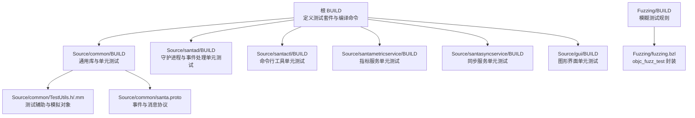
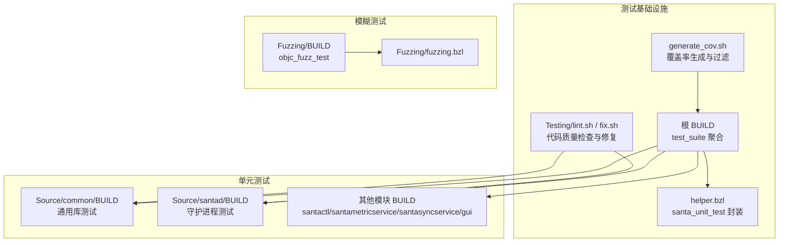
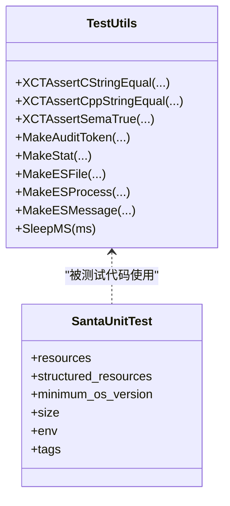
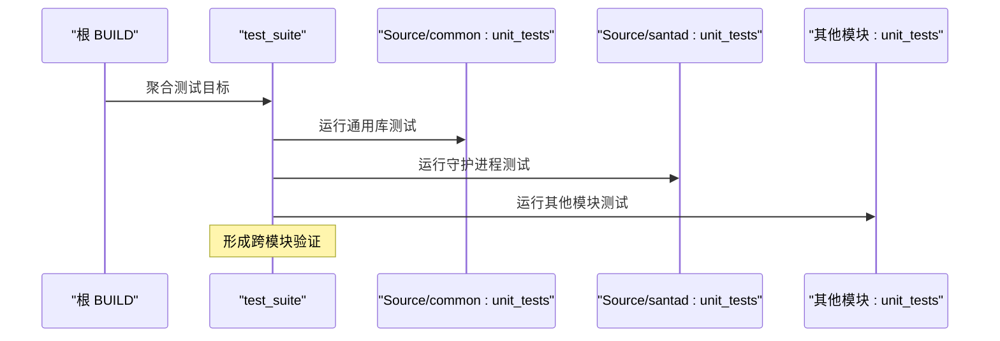
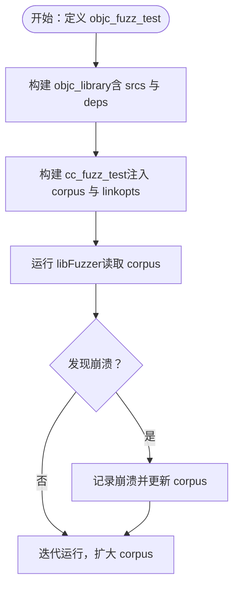
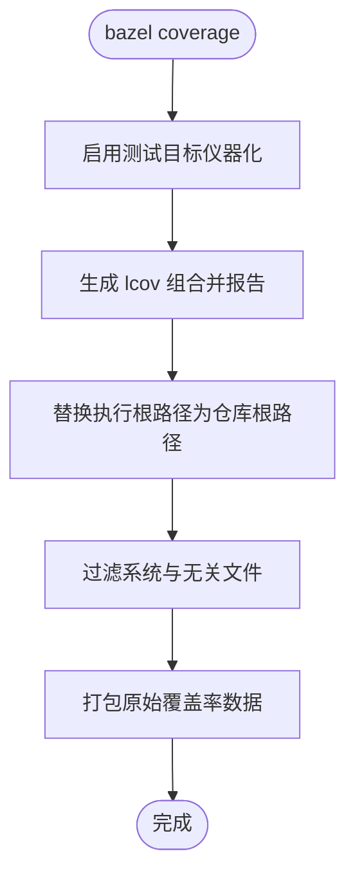
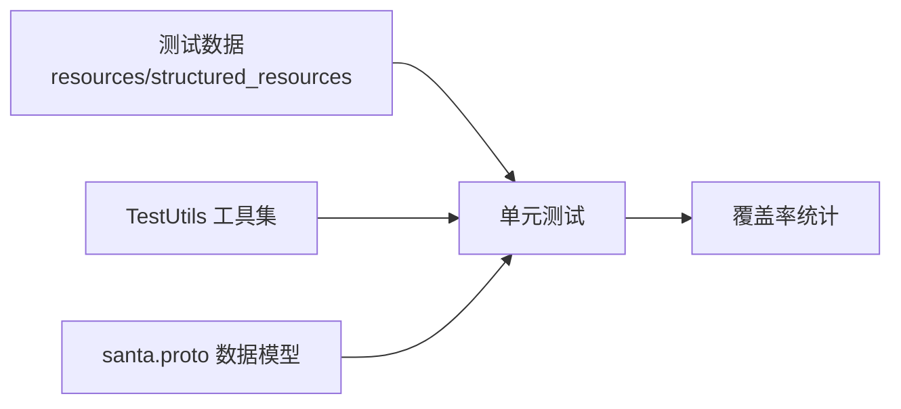
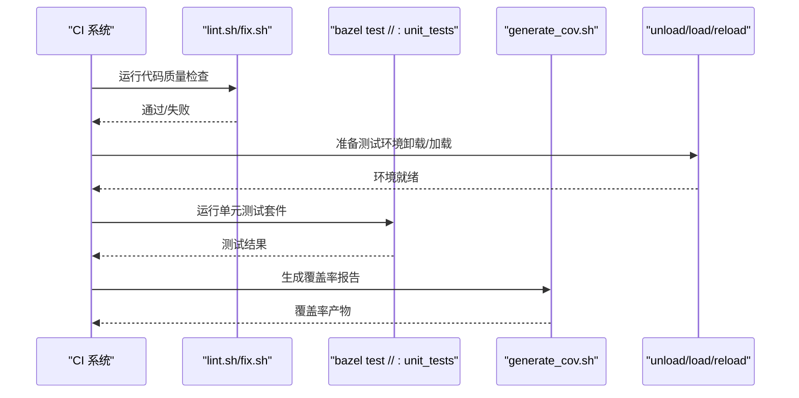
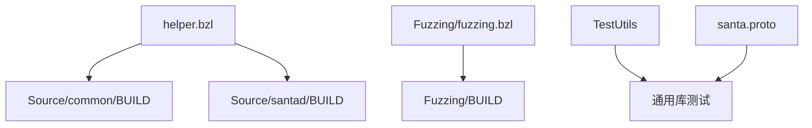

# 测试策略

<cite>
**本文引用的文件**
- [generate_cov.sh](file://generate_cov.sh)
- [helper.bzl](file://helper.bzl)
- [BUILD（根）](file://BUILD)
- [Source/common/BUILD](file://Source/common/BUILD)
- [Source/santad/BUILD](file://Source/santad/BUILD)
- [Fuzzing/BUILD](file://Fuzzing/BUILD)
- [Fuzzing/fuzzing.bzl](file://Fuzzing/fuzzing.bzl)
- [Testing/lint.sh](file://Testing/lint.sh)
- [Testing/fix.sh](file://Testing/fix.sh)
- [Source/common/TestUtils.h](file://Source/common/TestUtils.h)
- [Source/common/TestUtils.mm](file://Source/common/TestUtils.mm)
- [Source/common/santa.proto](file://Source/common/santa.proto)
</cite>

## 目录
1. [引言](#引言)
2. [项目结构](#项目结构)
3. [核心组件](#核心组件)
4. [架构总览](#架构总览)
5. [详细组件分析](#详细组件分析)
6. [依赖分析](#依赖分析)
7. [性能考虑](#性能考虑)
8. [故障排查指南](#故障排查指南)
9. [结论](#结论)
10. [附录](#附录)

## 引言
本文件系统化梳理 Santa 项目的测试策略与测试框架，覆盖单元测试、集成测试、端到端测试、模糊测试（libFuzzer）、测试覆盖率与报告、测试数据管理（fixtures 与模拟对象）、性能与压力测试方法、持续集成中的测试自动化配置、调试技巧与常见问题、以及可维护测试代码与测试数据清理机制。目标是帮助开发者在不深入源码的前提下理解并高效开展测试工作。

## 项目结构
Santa 使用 Bazel 构建系统组织测试，采用“按模块分包”的方式：公共库与各子服务（如 santad、santactl、santametricservice、santasyncservice、gui）均拥有独立 BUILD 文件与测试目标；同时通过 helper.bzl 提供统一的单元测试规则封装，便于资源注入与最小系统版本约束。

图表来源
- [BUILD（根）](file://BUILD#L235-L249)
- [Source/common/BUILD](file://Source/common/BUILD#L1-L120)
- [Source/santad/BUILD](file://Source/santad/BUILD#L1-L120)
- [Fuzzing/BUILD](file://Fuzzing/BUILD#L1-L12)
- [Fuzzing/fuzzing.bzl](file://Fuzzing/fuzzing.bzl#L1-L22)
- [Source/common/TestUtils.h](file://Source/common/TestUtils.h#L1-L106)
- [Source/common/TestUtils.mm](file://Source/common/TestUtils.mm#L1-L120)
- [Source/common/santa.proto](file://Source/common/santa.proto#L1-L120)

章节来源
- [BUILD（根）](file://BUILD#L235-L249)
- [Source/common/BUILD](file://Source/common/BUILD#L1-L120)
- [Source/santad/BUILD](file://Source/santad/BUILD#L1-L120)
- [Fuzzing/BUILD](file://Fuzzing/BUILD#L1-L12)
- [Fuzzing/fuzzing.bzl](file://Fuzzing/fuzzing.bzl#L1-L22)
- [Source/common/TestUtils.h](file://Source/common/TestUtils.h#L1-L106)
- [Source/common/TestUtils.mm](file://Source/common/TestUtils.mm#L1-L120)
- [Source/common/santa.proto](file://Source/common/santa.proto#L1-L120)

## 核心组件
- 单元测试框架与规则
  - 通过 helper.bzl 的 santa_unit_test 定义统一的 macOS 单元测试规则，自动打包 resources 与 structured_resources，设置最小系统版本与测试标签等。
  - 各模块 BUILD 中以 santa_unit_test 声明具体测试目标，例如 Source/common/BUILD 中大量以 “XXXTest” 结尾的测试目标。
- 集成测试与端到端测试
  - 项目未提供显式的集成或端到端测试目录；但通过测试套件（根 BUILD 的 test_suite）聚合各模块单元测试，形成“准集成”层面的跨模块验证。
  - 端到端测试可通过外部脚本与配置进行（例如加载/卸载系统扩展、启动服务等），但不在仓库中直接提供测试用例。
- 模糊测试（libFuzzer）
  - Fuzzing/BUILD 与 Fuzzing/fuzzing.bzl 提供 objc_fuzz_test 规则，基于 rules_cc 与 rules_fuzzing，支持为 ObjC/C++ 源生成 libFuzzer 可执行文件并指定 corpus。
- 覆盖率与报告
  - generate_cov.sh 使用 bazel coverage 生成 lcov 报告，过滤非仓库路径与无关文件，输出 raw_coverages.tgz 以便进一步处理。
- 测试数据与模拟
  - Source/common/TestUtils 提供构造 ES 事件结构体、信号量断言、字符串断言等辅助函数；配合各模块 testdata 目录提供输入数据。
- 代码质量与格式
  - Testing/lint.sh 与 Testing/fix.sh 提供 clang-format、swift-format、buildifier 的 lint/fix 流程，保障测试与被测代码风格一致。

章节来源
- [helper.bzl](file://helper.bzl#L1-L64)
- [Source/common/BUILD](file://Source/common/BUILD#L60-L120)
- [BUILD（根）](file://BUILD#L235-L249)
- [Fuzzing/BUILD](file://Fuzzing/BUILD#L1-L12)
- [Fuzzing/fuzzing.bzl](file://Fuzzing/fuzzing.bzl#L1-L22)
- [generate_cov.sh](file://generate_cov.sh#L1-L30)
- [Source/common/TestUtils.h](file://Source/common/TestUtils.h#L1-L106)
- [Source/common/TestUtils.mm](file://Source/common/TestUtils.mm#L1-L120)
- [Testing/lint.sh](file://Testing/lint.sh#L1-L22)
- [Testing/fix.sh](file://Testing/fix.sh#L1-L8)

## 架构总览
下图展示测试体系在 Santa 中的总体关系：根 BUILD 聚合测试套件，helper.bzl 统一单元测试规则，各模块 BUILD 注入资源与依赖，Fuzzing 提供模糊测试能力，generate_cov.sh 生成覆盖率报告。

图表来源
- [BUILD（根）](file://BUILD#L235-L249)
- [helper.bzl](file://helper.bzl#L1-L64)
- [Source/common/BUILD](file://Source/common/BUILD#L1-L120)
- [Source/santad/BUILD](file://Source/santad/BUILD#L1-L120)
- [Fuzzing/BUILD](file://Fuzzing/BUILD#L1-L12)
- [Fuzzing/fuzzing.bzl](file://Fuzzing/fuzzing.bzl#L1-L22)
- [Testing/lint.sh](file://Testing/lint.sh#L1-L22)
- [Testing/fix.sh](file://Testing/fix.sh#L1-L8)
- [generate_cov.sh](file://generate_cov.sh#L1-L30)

## 详细组件分析

### 单元测试设计与实施
- 规则封装与资源注入
  - helper.bzl 的 santa_unit_test 自动创建资源组，将 resources 与 structured_resources 注入测试 bundle，确保测试运行时可访问 fixtures。
  - 设置 minimum_os_version 与测试 size、tags，保证测试环境一致性。
- 典型测试目标
  - Source/common/BUILD 中大量以 “XXXTest” 结尾的目标，覆盖通用库功能（如压缩、缓存、证书、签名、规则、事件序列化等）。
  - Source/santad/BUILD 中包含对数据库层、事件表、决策缓存、策略处理器、事件提供者等模块的单元测试。
- 断言与模拟
  - Source/common/TestUtils 提供针对 C 字符串、C++ 字符串、信号量、状态码等的断言宏，以及构造 ES 事件结构体的工具函数，便于在单元测试中模拟真实系统事件。

图表来源
- [Source/common/TestUtils.h](file://Source/common/TestUtils.h#L1-L106)
- [Source/common/TestUtils.mm](file://Source/common/TestUtils.mm#L1-L120)
- [helper.bzl](file://helper.bzl#L25-L64)

章节来源
- [helper.bzl](file://helper.bzl#L1-L64)
- [Source/common/BUILD](file://Source/common/BUILD#L60-L120)
- [Source/santad/BUILD](file://Source/santad/BUILD#L170-L220)
- [Source/common/TestUtils.h](file://Source/common/TestUtils.h#L1-L106)
- [Source/common/TestUtils.mm](file://Source/common/TestUtils.mm#L1-L120)

### 集成测试与端到端测试
- 集成测试
  - 通过根 BUILD 的 test_suite 聚合多个模块的 unit_tests，形成跨模块的“准集成”测试集合，验证模块间接口契约与依赖关系。
- 端到端测试
  - 仓库未提供专用的端到端测试目录；但提供了卸载/加载系统扩展、安装/卸载服务等命令规则，可用于外部脚本驱动的端到端验证流程。

图表来源
- [BUILD（根）](file://BUILD#L235-L249)

章节来源
- [BUILD（根）](file://BUILD#L235-L249)

### 模糊测试（libFuzzer）与 fuzzing.bzl
- 规则封装
  - Fuzzing/fuzzing.bzl 定义 objc_fuzz_test，内部先构建 objc_library，再通过 cc_fuzz_test 生成 libFuzzer 可执行文件，并注入 corpus。
- 示例目标
  - Fuzzing/BUILD 中的 MachOParse 目标演示了如何为特定源文件建立模糊测试，链接 sqlite3 并依赖 SNTFileInfo。
- 使用建议
  - 为每个关键解析/处理入口（如 MachO 解析、规则解析、事件序列化）建立独立的模糊测试目标，持续扩大 corpus。

图表来源
- [Fuzzing/fuzzing.bzl](file://Fuzzing/fuzzing.bzl#L1-L22)
- [Fuzzing/BUILD](file://Fuzzing/BUILD#L1-L12)

章节来源
- [Fuzzing/fuzzing.bzl](file://Fuzzing/fuzzing.bzl#L1-L22)
- [Fuzzing/BUILD](file://Fuzzing/BUILD#L1-L12)

### 测试覆盖率与报告生成
- 覆盖率生成
  - generate_cov.sh 使用 bazel coverage，启用 instrument_test_targets 与 llvm 覆盖映射，生成 combined_report=lcov。
- 数据清洗
  - 通过 sed 替换执行根路径为仓库根路径，过滤系统路径与无关文件，最终打包 raw_coverages.tgz。
- 建议
  - 在 CI 中定期生成并上传覆盖率报告，结合阈值门禁（如最低语句/分支覆盖率）保障质量。

图表来源
- [generate_cov.sh](file://generate_cov.sh#L1-L30)

章节来源
- [generate_cov.sh](file://generate_cov.sh#L1-L30)

### 测试数据管理（fixtures 与模拟对象）
- fixtures
  - 各模块 BUILD 中通过 resources 与 structured_resources 注入测试数据，如 Source/common/BUILD 中的压缩测试数据、Bundle 示例 app 等。
- 模拟对象与辅助
  - TestUtils 提供构造 ES 事件结构体、断言信号量、断言字符串等工具，减少对真实系统调用的依赖，提升测试稳定性与可重复性。
- 协议与数据模型
  - Source/common/santa.proto 定义了事件与消息的数据模型，测试中可基于该 proto 生成/校验序列化结果。

图表来源
- [Source/common/BUILD](file://Source/common/BUILD#L60-L120)
- [Source/common/TestUtils.h](file://Source/common/TestUtils.h#L1-L106)
- [Source/common/TestUtils.mm](file://Source/common/TestUtils.mm#L1-L120)
- [Source/common/santa.proto](file://Source/common/santa.proto#L1-L120)

章节来源
- [Source/common/BUILD](file://Source/common/BUILD#L60-L120)
- [Source/common/TestUtils.h](file://Source/common/TestUtils.h#L1-L106)
- [Source/common/TestUtils.mm](file://Source/common/TestUtils.mm#L1-L120)
- [Source/common/santa.proto](file://Source/common/santa.proto#L1-L120)

### 性能测试与压力测试
- 性能测试
  - 可在单元测试中引入计时器与基准断言（如 SNTTimer/SNTXxhash 等模块），对热点路径进行微基准评估。
- 压力测试
  - 利用模糊测试（libFuzzer）对关键解析/序列化路径进行大规模随机输入测试，发现潜在性能瓶颈与内存问题。
- 建议
  - 将性能回归纳入 CI，设定阈值门禁；对关键路径（如事件序列化、规则匹配、缓存命中）单独建立压力测试目标。

[本节为通用指导，无需列出章节来源]

### 持续集成中的测试自动化
- 测试套件
  - 根 BUILD 的 test_suite 聚合所有模块的 unit_tests，作为 CI 默认运行目标。
- 代码质量
  - Testing/lint.sh 与 Testing/fix.sh 提供统一的格式化与静态检查流程，可在 CI 中作为预提交钩子或 PR 检查步骤。
- 加载/卸载与重载
  - 根 BUILD 提供 unload/load/reload 命令规则，便于在集成测试前准备/恢复系统状态。

图表来源
- [BUILD（根）](file://BUILD#L69-L112)
- [BUILD（根）](file://BUILD#L235-L249)
- [Testing/lint.sh](file://Testing/lint.sh#L1-L22)
- [Testing/fix.sh](file://Testing/fix.sh#L1-L8)
- [generate_cov.sh](file://generate_cov.sh#L1-L30)

章节来源
- [BUILD（根）](file://BUILD#L69-L112)
- [BUILD（根）](file://BUILD#L235-L249)
- [Testing/lint.sh](file://Testing/lint.sh#L1-L22)
- [Testing/fix.sh](file://Testing/fix.sh#L1-L8)
- [generate_cov.sh](file://generate_cov.sh#L1-L30)

## 依赖分析
- 组件耦合
  - 单元测试通过 helper.bzl 与各模块 BUILD 解耦，集中管理资源与最小系统版本。
  - 模糊测试通过 Fuzzing/fuzzing.bzl 与 Fuzzing/BUILD 解耦，便于为不同源文件快速生成 libFuzzer 目标。
- 外部依赖
  - 测试框架依赖 Xcode XCTest、GoogleTest/GMock；覆盖率依赖 bazel coverage 与 lcov；格式化依赖 clang-format/swift-format/buildifier。
- 循环依赖
  - 从当前文件可见，测试规则与被测代码之间为单向依赖，未见循环依赖迹象。

图表来源
- [helper.bzl](file://helper.bzl#L1-L64)
- [Source/common/BUILD](file://Source/common/BUILD#L1-L120)
- [Source/santad/BUILD](file://Source/santad/BUILD#L1-L120)
- [Fuzzing/fuzzing.bzl](file://Fuzzing/fuzzing.bzl#L1-L22)
- [Fuzzing/BUILD](file://Fuzzing/BUILD#L1-L12)
- [Source/common/TestUtils.h](file://Source/common/TestUtils.h#L1-L106)
- [Source/common/santa.proto](file://Source/common/santa.proto#L1-L120)

章节来源
- [helper.bzl](file://helper.bzl#L1-L64)
- [Source/common/BUILD](file://Source/common/BUILD#L1-L120)
- [Source/santad/BUILD](file://Source/santad/BUILD#L1-L120)
- [Fuzzing/fuzzing.bzl](file://Fuzzing/fuzzing.bzl#L1-L22)
- [Fuzzing/BUILD](file://Fuzzing/BUILD#L1-L12)
- [Source/common/TestUtils.h](file://Source/common/TestUtils.h#L1-L106)
- [Source/common/santa.proto](file://Source/common/santa.proto#L1-L120)

## 性能考虑
- 测试执行效率
  - 使用较小的测试 size 与最小系统版本，缩短测试时间。
  - 将耗时测试拆分为独立目标，避免阻塞主测试套件。
- 覆盖率成本
  - 仅对关键路径开启高粒度仪器化，平衡覆盖率与构建/运行时间。
- 模糊测试收益
  - 针对热点路径（解析、序列化、缓存）建立稳定 corpus，提高发现异常的概率与速度。

[本节为通用指导，无需列出章节来源]

## 故障排查指南
- 测试断言失败
  - 使用 TestUtils 中的断言宏（如字符串断言、信号量断言）定位问题；必要时打印关键字段或序列化后的 proto 内容。
- 资源缺失
  - 确认 resources 与 structured_resources 是否正确注入；检查路径是否随打包变化。
- 覆盖率异常
  - 检查 generate_cov.sh 的路径替换与过滤逻辑；确认 CI 环境变量与执行根路径。
- 代码风格问题
  - 使用 Testing/lint.sh 与 Testing/fix.sh 修复格式问题，避免 CI 失败。

章节来源
- [Source/common/TestUtils.h](file://Source/common/TestUtils.h#L1-L106)
- [Source/common/TestUtils.mm](file://Source/common/TestUtils.mm#L1-L120)
- [generate_cov.sh](file://generate_cov.sh#L1-L30)
- [Testing/lint.sh](file://Testing/lint.sh#L1-L22)
- [Testing/fix.sh](file://Testing/fix.sh#L1-L8)

## 结论
Santa 的测试体系以 Bazel 为核心，借助 helper.bzl 统一单元测试规则、TestUtils 提供高质量测试辅助、Fuzzing 目录提供 libFuzzer 支持、generate_cov.sh 实现覆盖率报告，辅以 lint/fix 脚本保障代码质量。通过 test_suite 聚合多模块测试，形成稳定的“准集成”验证链路。建议在现有基础上进一步完善端到端测试与覆盖率阈值门禁，持续提升测试覆盖面与质量稳定性。

[本节为总结性内容，无需列出章节来源]

## 附录
- 最佳实践清单
  - 为每个关键模块/功能点建立单元测试目标，优先覆盖错误路径与边界条件。
  - 使用 TestUtils 构造最小可复现实例，减少对外部系统依赖。
  - 对热点路径建立模糊测试目标，持续扩充 corpus。
  - 在 CI 中启用覆盖率报告与阈值门禁，定期审查覆盖率趋势。
  - 使用 lint/fix 脚本保持测试与被测代码风格一致，降低维护成本。

[本节为通用指导，无需列出章节来源]