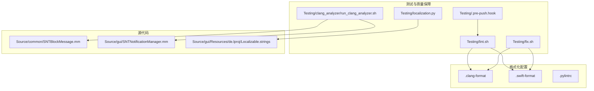
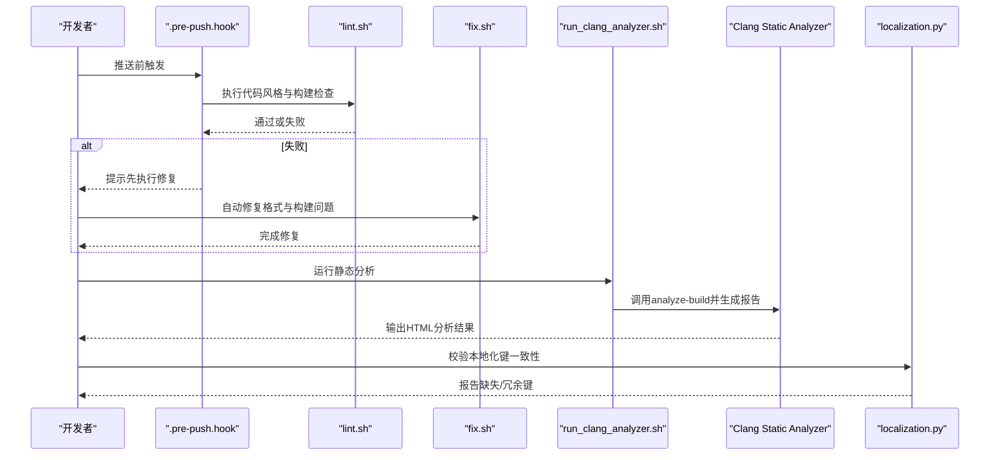
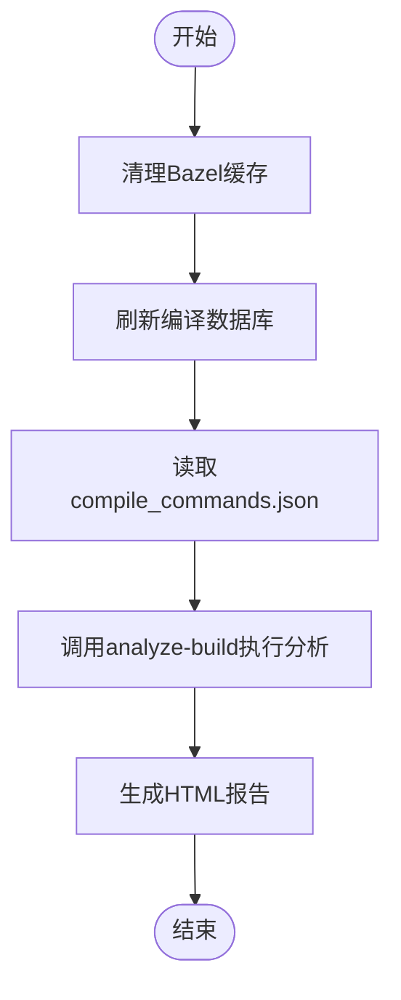
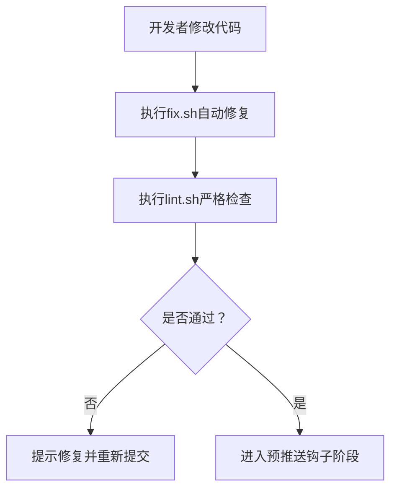
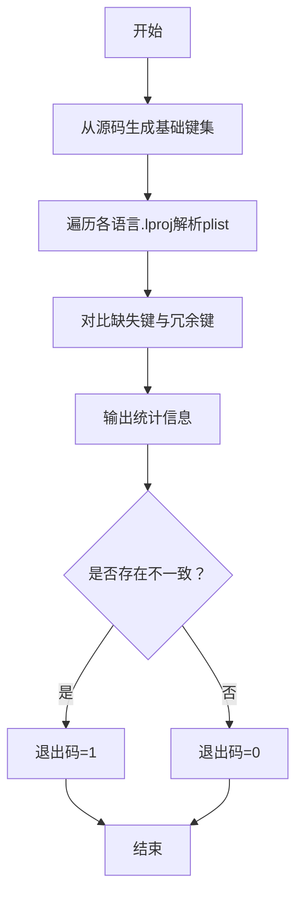
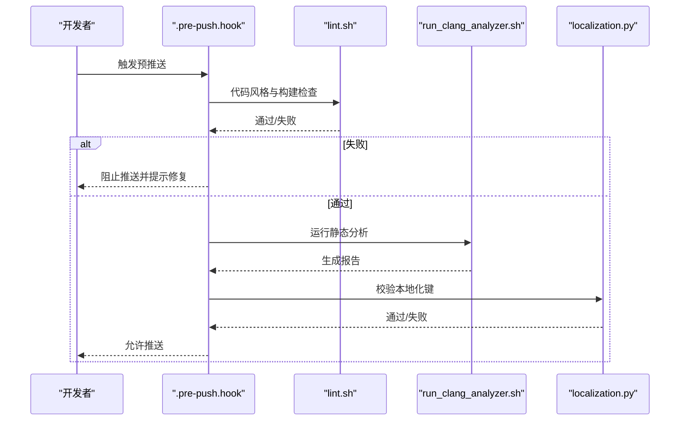
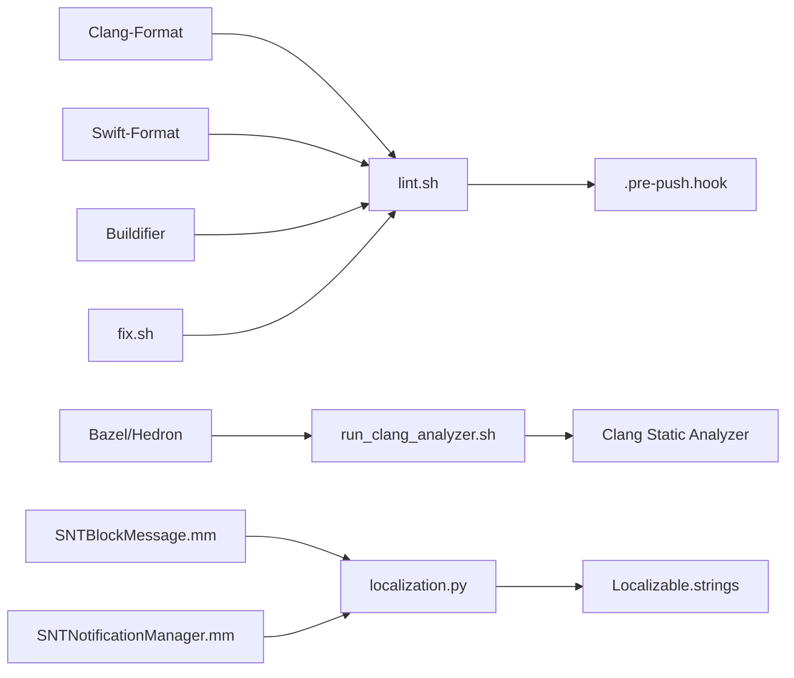

# 静态分析

<cite>
**本文引用的文件**
- [Testing/clang_analyzer/run_clang_analyzer.sh](file://Testing/clang_analyzer/run_clang_analyzer.sh)
- [.clang-format](file://.clang-format)
- [.pylintrc](file://.pylintrc)
- [.swift-format](file://.swift-format)
- [Testing/lint.sh](file://Testing/lint.sh)
- [Testing/fix.sh](file://Testing/fix.sh)
- [.pre-push.hook](file://.pre-push.hook)
- [Testing/localization.py](file://Testing/localization.py)
- [Source/common/SNTBlockMessage.mm](file://Source/common/SNTBlockMessage.mm)
- [Source/gui/SNTNotificationManager.mm](file://Source/gui/SNTNotificationManager.mm)
- [Source/gui/Resources/de.lproj/Localizable.strings](file://Source/gui/Resources/de.lproj/Localizable.strings)
- [CONTRIBUTING.md](file://CONTRIBUTING.md)
- [README.md](file://README.md)
</cite>

## 目录
1. [简介](#简介)
2. [项目结构](#项目结构)
3. [核心组件](#核心组件)
4. [架构总览](#架构总览)
5. [详细组件分析](#详细组件分析)
6. [依赖分析](#依赖分析)
7. [性能考虑](#性能考虑)
8. [故障排查指南](#故障排查指南)
9. [结论](#结论)
10. [附录](#附录)

## 简介
本文件面向Santa项目的静态分析与代码质量保障，系统性说明以下方面：
- Clang Static Analyzer（CSA）在本仓库中的集成方式与执行流程，重点解析run_clang_analyzer.sh脚本的配置与运行步骤。
- 代码格式化标准与Clang-Format、Swift-Format、Pylint等工具的配置与使用方法。
- 本地化字符串的检查与管理工具及流程，确保多语言资源键一致性。
- 代码质量门禁与持续集成中的静态分析配置建议。
- 常见代码质量问题的识别与修复建议。
- 如何将静态分析工具融入日常开发工作流，提升整体代码质量。

## 项目结构
围绕静态分析与质量保障的相关文件主要分布在以下位置：
- Testing/clang_analyzer：存放Clang Static Analyzer的执行脚本与输出目录占位。
- Testing：存放通用的代码质量脚本（lint/fix）、本地化检查脚本以及Git预推送钩子。
- 根目录：存放各语言的格式化与检查配置文件（.clang-format、.swift-format、.pylintrc）。
- Source：包含大量Objective-C、C++与Swift源码，是静态分析与本地化检查的主要目标。

**图表来源**
- [Testing/clang_analyzer/run_clang_analyzer.sh](file://Testing/clang_analyzer/run_clang_analyzer.sh#L1-L16)
- [.clang-format](file://.clang-format#L1-L43)
- [.swift-format](file://.swift-format#L1-L18)
- [.pylintrc](file://.pylintrc#L1-L4)
- [Testing/lint.sh](file://Testing/lint.sh#L1-L22)
- [Testing/fix.sh](file://Testing/fix.sh#L1-L8)
- [Testing/localization.py](file://Testing/localization.py#L1-L123)
- [Source/common/SNTBlockMessage.mm](file://Source/common/SNTBlockMessage.mm#L1-L200)
- [Source/gui/SNTNotificationManager.mm](file://Source/gui/SNTNotificationManager.mm#L1-L200)
- [Source/gui/Resources/de.lproj/Localizable.strings](file://Source/gui/Resources/de.lproj/Localizable.strings#L1-L180)

**章节来源**
- [README.md](file://README.md#L1-L152)
- [CONTRIBUTING.md](file://CONTRIBUTING.md#L39-L49)

## 核心组件
- Clang Static Analyzer执行脚本：通过Bazel刷新编译数据库并调用analyze-build进行分析，生成HTML报告。
- 代码格式化与检查：统一的Clang-Format、Swift-Format与Pylint配置，配合lint/fix脚本与Git预推送钩子形成门禁。
- 本地化字符串检查：基于genstrings与plutil的自动化脚本，校验多语言资源键集合的一致性。
- 源代码目标：覆盖Objective-C、C++与Swift，静态分析与本地化检查均针对这些语言的源文件。

**章节来源**
- [Testing/clang_analyzer/run_clang_analyzer.sh](file://Testing/clang_analyzer/run_clang_analyzer.sh#L1-L16)
- [.clang-format](file://.clang-format#L1-L43)
- [.swift-format](file://.swift-format#L1-L18)
- [.pylintrc](file://.pylintrc#L1-L4)
- [Testing/lint.sh](file://Testing/lint.sh#L1-L22)
- [Testing/fix.sh](file://Testing/fix.sh#L1-L8)
- [Testing/localization.py](file://Testing/localization.py#L1-L123)

## 架构总览
下图展示了从开发者提交到静态分析与本地化检查的整体流程，以及与源代码的关系：

**图表来源**
- [.pre-push.hook](file://.pre-push.hook#L1-L34)
- [Testing/lint.sh](file://Testing/lint.sh#L1-L22)
- [Testing/fix.sh](file://Testing/fix.sh#L1-L8)
- [Testing/clang_analyzer/run_clang_analyzer.sh](file://Testing/clang_analyzer/run_clang_analyzer.sh#L1-L16)
- [Testing/localization.py](file://Testing/localization.py#L1-L123)

## 详细组件分析

### Clang Static Analyzer 集成与执行
- 目标：对Santa的Objective-C、C++与Swift源码进行静态分析，发现潜在缺陷与安全问题。
- 关键点：
  - 使用Bazel刷新编译数据库，确保analyze-build能正确读取所有编译命令。
  - analyze-build根据compile_commands.json执行分析，并输出HTML报告到指定目录。
  - 可通过--use-analyzer参数指定clang路径，确保与系统工具链一致。
- 建议：
  - 在CI中增加该脚本的执行步骤，将HTML报告作为Artifacts保存以便追溯。
  - 对于大型模块，可分批执行分析，避免单次分析耗时过长。

**图表来源**
- [Testing/clang_analyzer/run_clang_analyzer.sh](file://Testing/clang_analyzer/run_clang_analyzer.sh#L1-L16)

**章节来源**
- [Testing/clang_analyzer/run_clang_analyzer.sh](file://Testing/clang_analyzer/run_clang_analyzer.sh#L1-L16)

### 代码格式化标准与Clang-Format、Swift-Format、Pylint
- Clang-Format（Objective-C/C++）：
  - 基于Google风格，限制行长（ObjC为100，C++为80），控制指针对齐与缩进宽度，要求文件末尾换行。
  - 通过lint.sh进行严格检查（--Werror），fix.sh用于自动修复。
- Swift-Format：
  - 行长度120，缩进2空格；部分规则关闭（如CamelCase、块注释等），保持团队一致性。
- Pylint：
  - Python代码风格限制行长80，缩进2空格；配合lint.sh进行统一检查。

**图表来源**
- [.clang-format](file://.clang-format#L1-L43)
- [.swift-format](file://.swift-format#L1-L18)
- [.pylintrc](file://.pylintrc#L1-L4)
- [Testing/fix.sh](file://Testing/fix.sh#L1-L8)
- [Testing/lint.sh](file://Testing/lint.sh#L1-L22)

**章节来源**
- [.clang-format](file://.clang-format#L1-L43)
- [.swift-format](file://.swift-format#L1-L18)
- [.pylintrc](file://.pylintrc#L1-L4)
- [Testing/fix.sh](file://Testing/fix.sh#L1-L8)
- [Testing/lint.sh](file://Testing/lint.sh#L1-L22)
- [CONTRIBUTING.md](file://CONTRIBUTING.md#L39-L49)

### 本地化字符串检查与管理
- 工具链：
  - genstrings：从SwiftUI与Objective-C源码中抽取本地化键，生成临时Localizable.strings。
  - iconv：将UTF-16转换为UTF-8，便于后续处理。
  - plutil：将字符串文件转换为XML格式供解析。
- 流程：
  - 生成基础键集（基于当前代码）。
  - 遍历各语言.lproj目录，解析其Localizable.strings。
  - 统计缺失键与冗余键，计算完成度百分比。
  - 若存在缺失或冗余键，返回非零退出码，触发质量门禁失败。
- 建议：
  - 在fix流程中加入写回英文键值的选项，确保主语言资源同步更新。
  - 将localization.py纳入预推送钩子，确保每次变更都通过一致性检查。

**图表来源**
- [Testing/localization.py](file://Testing/localization.py#L1-L123)
- [Source/common/SNTBlockMessage.mm](file://Source/common/SNTBlockMessage.mm#L60-L120)
- [Source/gui/SNTNotificationManager.mm](file://Source/gui/SNTNotificationManager.mm#L149-L200)
- [Source/gui/Resources/de.lproj/Localizable.strings](file://Source/gui/Resources/de.lproj/Localizable.strings#L1-L180)

**章节来源**
- [Testing/localization.py](file://Testing/localization.py#L1-L123)
- [Source/common/SNTBlockMessage.mm](file://Source/common/SNTBlockMessage.mm#L60-L120)
- [Source/gui/SNTNotificationManager.mm](file://Source/gui/SNTNotificationManager.mm#L149-L200)
- [Source/gui/Resources/de.lproj/Localizable.strings](file://Source/gui/Resources/de.lproj/Localizable.strings#L1-L180)

### 代码质量门禁与持续集成配置
- 预推送门禁：
  - .pre-push.hook在推送前调用lint.sh，若失败则阻止推送，提示先执行fix.sh修复。
- CI建议：
  - 在CI流水线中增加Clang Static Analyzer执行步骤，保存HTML报告Artifacts。
  - 同步执行lint.sh与localization.py，确保所有质量检查通过后才允许合并。
  - 对关键模块（如santad、gui、common）分别执行分析，缩短反馈周期。

**图表来源**
- [.pre-push.hook](file://.pre-push.hook#L1-L34)
- [Testing/lint.sh](file://Testing/lint.sh#L1-L22)
- [Testing/clang_analyzer/run_clang_analyzer.sh](file://Testing/clang_analyzer/run_clang_analyzer.sh#L1-L16)
- [Testing/localization.py](file://Testing/localization.py#L1-L123)

**章节来源**
- [.pre-push.hook](file://.pre-push.hook#L1-L34)
- [Testing/lint.sh](file://Testing/lint.sh#L1-L22)
- [Testing/clang_analyzer/run_clang_analyzer.sh](file://Testing/clang_analyzer/run_clang_analyzer.sh#L1-L16)
- [Testing/localization.py](file://Testing/localization.py#L1-L123)

### 常见代码质量问题与修复建议
- Objective-C/内存与字符串处理：
  - 建议在涉及HTML解析与富文本生成时，统一错误处理与日志记录，避免空指针与异常传播。
  - 对字符串替换与模板映射逻辑进行边界检查，防止越界或格式不匹配。
- Swift并发与通知：
  - 在串行队列中进行状态更新与用户默认项操作，注意线程安全与竞态条件。
  - 分布式通知的userInfo字段应保持稳定且可序列化，避免类型不匹配导致崩溃。
- 本地化一致性：
  - 新增/删除文案需同步更新所有语言的Localizable.strings，避免键缺失或冗余。
  - 使用localization.py定期扫描，提前发现不一致问题。

**章节来源**
- [Source/common/SNTBlockMessage.mm](file://Source/common/SNTBlockMessage.mm#L120-L170)
- [Source/gui/SNTNotificationManager.mm](file://Source/gui/SNTNotificationManager.mm#L120-L170)
- [Testing/localization.py](file://Testing/localization.py#L85-L123)

## 依赖分析
- 工具依赖关系：
  - run_clang_analyzer.sh依赖Bazel与hedron_compile_commands插件生成compile_commands.json。
  - lint.sh依赖clang-format、swift-format与buildifier；fix.sh用于自动修复。
  - localization.py依赖系统工具genstrings、iconv、plutil。
- 源码耦合：
  - SNTBlockMessage与SNTNotificationManager广泛使用NSLocalizedString，本地化资源的完整性直接影响用户体验与国际化质量。

**图表来源**
- [Testing/clang_analyzer/run_clang_analyzer.sh](file://Testing/clang_analyzer/run_clang_analyzer.sh#L1-L16)
- [Testing/lint.sh](file://Testing/lint.sh#L1-L22)
- [Testing/fix.sh](file://Testing/fix.sh#L1-L8)
- [Testing/localization.py](file://Testing/localization.py#L1-L123)
- [Source/common/SNTBlockMessage.mm](file://Source/common/SNTBlockMessage.mm#L60-L120)
- [Source/gui/SNTNotificationManager.mm](file://Source/gui/SNTNotificationManager.mm#L149-L200)

**章节来源**
- [Testing/clang_analyzer/run_clang_analyzer.sh](file://Testing/clang_analyzer/run_clang_analyzer.sh#L1-L16)
- [Testing/lint.sh](file://Testing/lint.sh#L1-L22)
- [Testing/fix.sh](file://Testing/fix.sh#L1-L8)
- [Testing/localization.py](file://Testing/localization.py#L1-L123)
- [Source/common/SNTBlockMessage.mm](file://Source/common/SNTBlockMessage.mm#L60-L120)
- [Source/gui/SNTNotificationManager.mm](file://Source/gui/SNTNotificationManager.mm#L149-L200)

## 性能考虑
- 静态分析规模：
  - 对大型模块分批分析，减少单次分析时间；在CI中并行多个子任务。
- 格式化与检查：
  - lint.sh使用--Werror与递归检查，建议仅在必要时开启严格模式；fix.sh用于快速修复。
- 本地化检查：
  - localization.py对每个语言文件执行解析与对比，建议在本地增量运行，CI中全量扫描。

## 故障排查指南
- 预推送失败：
  - 检查lint.sh输出，确认是否因格式问题或构建器警告导致失败；执行fix.sh修复后重试。
- 静态分析无输出：
  - 确认Bazel已成功刷新compile_commands.json；检查analyze-build参数与clang路径。
- 本地化不一致：
  - 使用localization.py输出的缺失/冗余键列表定位问题；对照英文键值逐一修正。
- 权限与工具缺失：
  - 确保系统已安装genstrings、iconv、plutil、clang-format、swift-format、buildifier等工具。

**章节来源**
- [.pre-push.hook](file://.pre-push.hook#L1-L34)
- [Testing/lint.sh](file://Testing/lint.sh#L1-L22)
- [Testing/fix.sh](file://Testing/fix.sh#L1-L8)
- [Testing/clang_analyzer/run_clang_analyzer.sh](file://Testing/clang_analyzer/run_clang_analyzer.sh#L1-L16)
- [Testing/localization.py](file://Testing/localization.py#L85-L123)

## 结论
通过将Clang Static Analyzer、Clang-Format、Swift-Format、Pylint与本地化检查工具整合到开发工作流与预推送钩子中，Santa项目实现了对代码风格、潜在缺陷与本地化一致性的系统性质量保障。建议在CI中固化上述流程，并对关键模块实施分层分析，以持续提升代码质量与可维护性。

## 附录
- 开发者指南与贡献规范可参考项目贡献文档，其中明确指出使用clang-format与GitHub Actions样式检查的要求。

**章节来源**
- [CONTRIBUTING.md](file://CONTRIBUTING.md#L39-L49)
- [README.md](file://README.md#L1-L152)