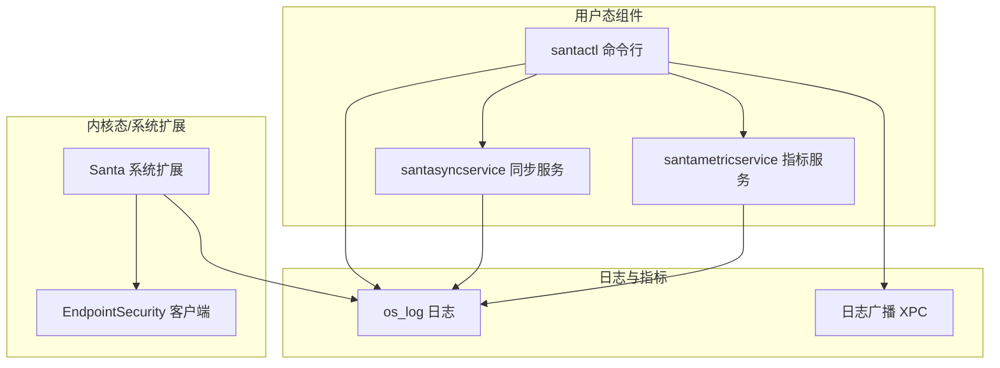
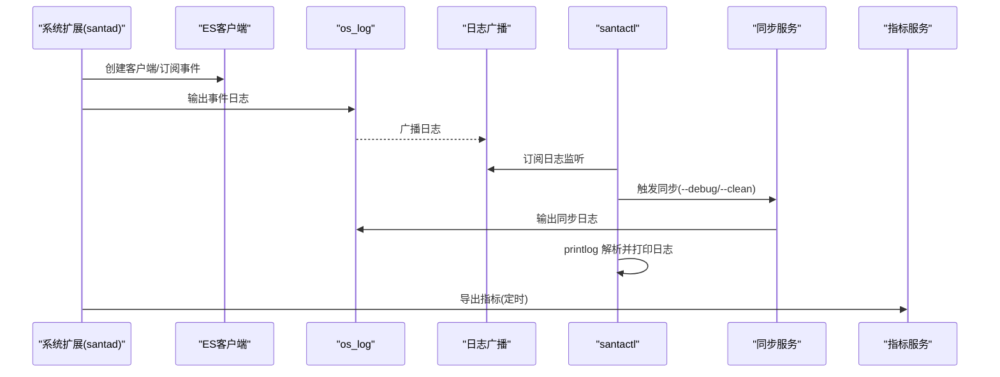
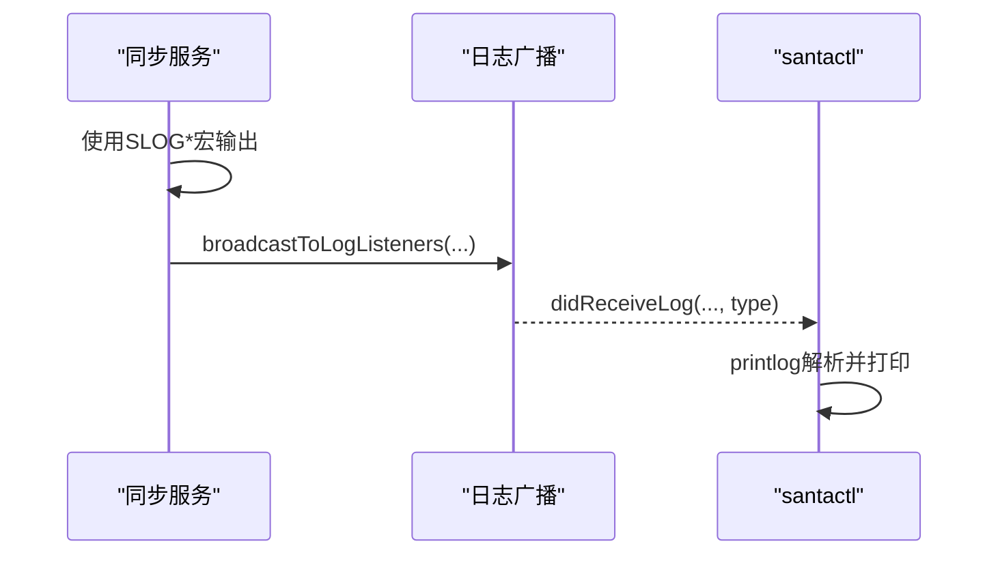
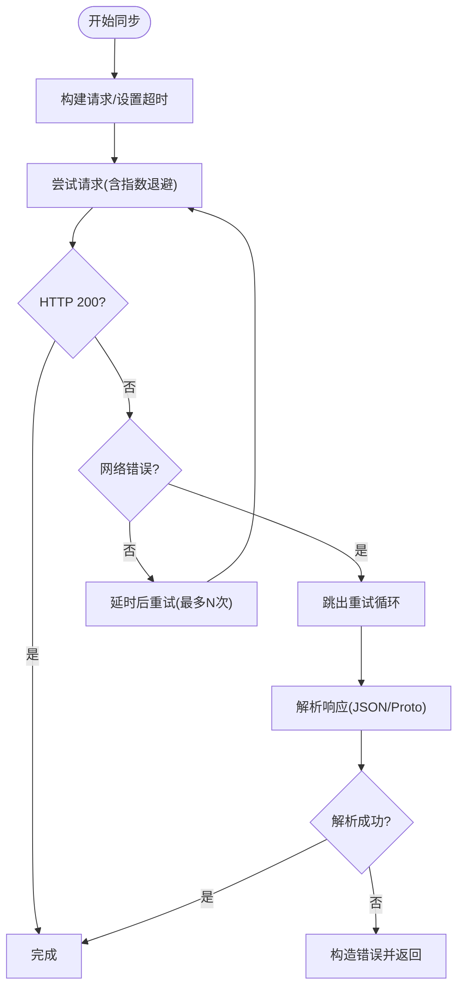
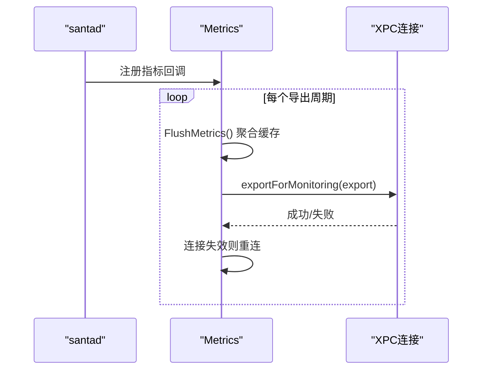
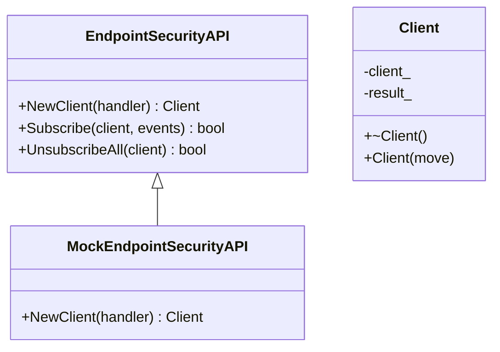
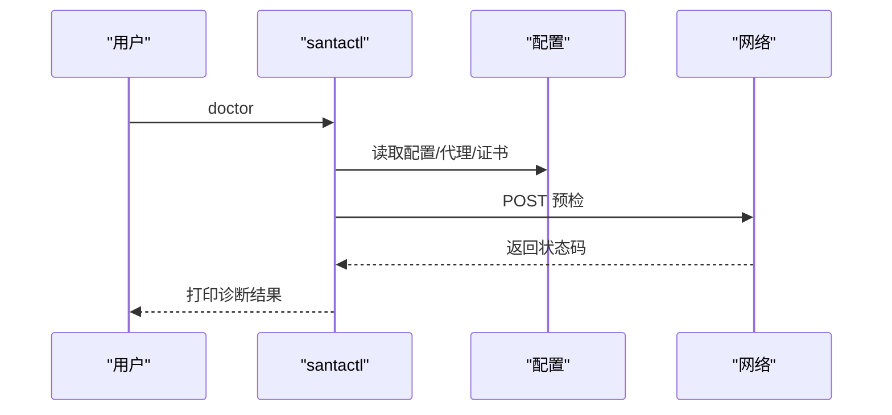
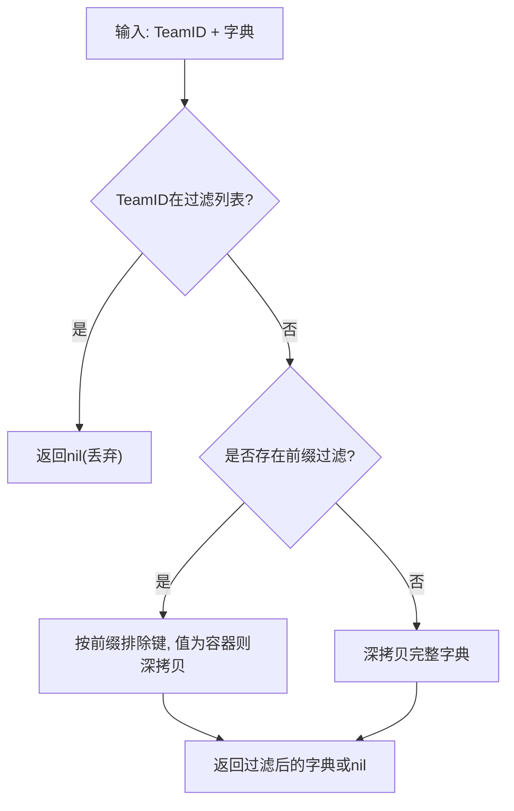
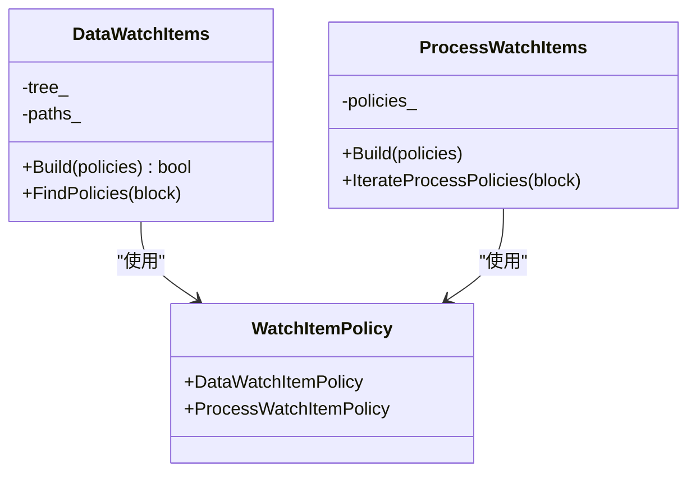
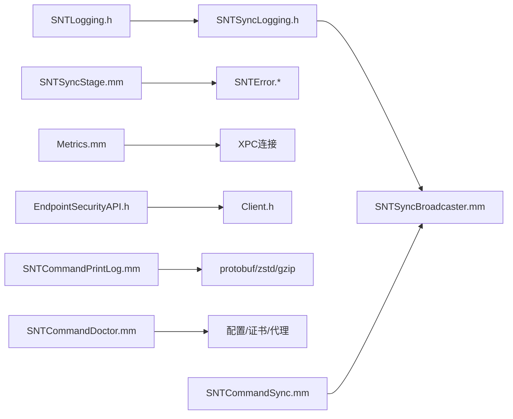

# 调试工具

<cite>
**本文引用的文件**
- [Source/santad/main.mm](file://Source/santad/main.mm)
- [Source/santad/Santad.mm](file://Source/santad/Santad.mm)
- [Source/santad/SantadDeps.mm](file://Source/santad/SantadDeps.mm)
- [Source/santad/ProcessControl.mm](file://Source/santad/ProcessControl.mm)
- [Source/santad/Metrics.h](file://Source/santad/Metrics.h)
- [Source/santad/Metrics.mm](file://Source/santad/Metrics.mm)
- [Source/santad/SNTApplicationCoreMetrics.mm](file://Source/santad/SNTApplicationCoreMetrics.mm)
- [Source/common/SNTLogging.h](file://Source/common/SNTLogging.h)
- [Source/santasyncservice/SNTSyncLogging.h](file://Source/santasyncservice/SNTSyncLogging.h)
- [Source/santasyncservice/SNTSyncBroadcaster.mm](file://Source/santasyncservice/SNTSyncBroadcaster.mm)
- [Source/santasyncservice/SNTSyncStage.mm](file://Source/santasyncservice/SNTSyncStage.mm)
- [Source/santactl/Commands/SNTCommandPrintLog.mm](file://Source/santactl/Commands/SNTCommandPrintLog.mm)
- [Source/santactl/Commands/SNTCommandSync.mm](file://Source/santactl/Commands/SNTCommandSync.mm)
- [Source/santactl/Commands/SNTCommandDoctor.mm](file://Source/santactl/Commands/SNTCommandDoctor.mm)
- [Source/santasyncservice/SNTSyncTest.mm](file://Source/santasyncservice/SNTSyncTest.mm)
- [Source/santametricservice/Writers/SNTMetricHTTPWriterTest.mm](file://Source/santametricservice/Writers/SNTMetricHTTPWriterTest.mm)
- [Testing/clang_analyzer/run_clang_analyzer.sh](file://Testing/clang_analyzer/run_clang_analyzer.sh)
- [Source/santad/EntitlementsFilter.mm](file://Source/santad/EntitlementsFilter.mm)
- [Source/santad/EntitlementsFilterTest.mm](file://Source/santad/EntitlementsFilterTest.mm)
- [Source/common/EncodeEntitlementsTest.mm](file://Source/common/EncodeEntitlementsTest.mm)
- [Source/santad/EventProviders/EndpointSecurity/EndpointSecurityAPI.h](file://Source/santad/EventProviders/EndpointSecurity/EndpointSecurityAPI.h)
- [Source/santad/EventProviders/EndpointSecurity/Client.h](file://Source/santad/EventProviders/EndpointSecurity/Client.h)
- [Source/santad/EventProviders/EndpointSecurity/MockEndpointSecurityAPI.h](file://Source/santad/EventProviders/EndpointSecurity/MockEndpointSecurityAPI.h)
- [Source/santad/EventProviders/SNTEndpointSecurityClient.h](file://Source/santad/EventProviders/SNTEndpointSecurityClient.h)
- [Source/santad/EventProviders/SNTEndpointSecurityRecorderTest.mm](file://Source/santad/EventProviders/SNTEndpointSecurityRecorderTest.mm)
- [Source/santad/EventProviders/SNTEndpointSecurityTamperResistanceTest.mm](file://Source/santad/EventProviders/SNTEndpointSecurityTamperResistanceTest.mm)
- [Source/common/faa/WatchItems.h](file://Source/common/faa/WatchItems.h)
- [Source/common/faa/WatchItems.mm](file://Source/common/faa/WatchItems.mm)
- [Source/common/faa/WatchItemPolicy.h](file://Source/common/faa/WatchItemPolicy.h)
- [Source/common/faa/WatchItemPolicyTest.mm](file://Source/common/faa/WatchItemPolicyTest.mm)
- [Source/santad/Logs/EndpointSecurity/Serializers/ProtobufTest.mm](file://Source/santad/Logs/EndpointSecurity/Serializers/ProtobufTest.mm)
- [Source/santad/EventProviders/EndpointSecurity/Client.h](file://Source/santad/EventProviders/EndpointSecurity/Client.h)
- [Source/santad/EventProviders/EndpointSecurity/EndpointSecurityAPI.h](file://Source/santad/EventProviders/EndpointSecurity/EndpointSecurityAPI.h)
- [Source/santad/EventProviders/EndpointSecurity/MockEndpointSecurityAPI.h](file://Source/santad/EventProviders/EndpointSecurity/MockEndpointSecurityAPI.h)
- [Source/santad/EventProviders/SNTEndpointSecurityClient.h](file://Source/santad/EventProviders/SNTEndpointSecurityClient.h)
- [Source/santad/com.northpolesec.santa.daemon.systemextension-debugger.entitlements](file://Source/santad/com.northpolesec.santa.daemon.systemextension-debugger.entitlements)
- [Source/santad/com.northpolesec.santa.daemon.systemextension-adhoc.entitlements](file://Source/santad/com.northpolesec.santa.daemon.systemextension-adhoc.entitlements)
- [Source/common/SNTError.h](file://Source/common/SNTError.h)
- [Source/common/SNTError.mm](file://Source/common/SNTError.mm)
</cite>

## 目录
1. 引言
2. 项目结构
3. 核心组件
4. 架构总览
5. 详细组件分析
6. 依赖关系分析
7. 性能考量
8. 故障排查指南
9. 结论
10. 附录（如有）

## 引言
本指南面向Santa项目的开发者与运维人员，系统性讲解如何在macOS环境下高效调试Santa系统扩展及其相关服务。内容覆盖Xcode调试器与lldb命令行调试、系统扩展调试要点、日志与事件序列解析、性能分析工具（Instruments/Time Profiler）、内存泄漏检测、网络调试与API调用追踪、clang-analyzer静态分析，以及常见调试场景与解决方案。

## 项目结构
Santa由多个子模块组成：守护进程（santad）、命令行工具（santactl）、同步服务（santasyncservice）、指标服务（santametricservice）等。日志体系通过os_log与自定义宏实现，并支持通过XPC广播到客户端或命令行工具；网络同步采用指数退避重试与错误码处理；指标导出通过XPC连接到指标服务；系统扩展调试需要合适的权限与端点安全客户端配置。

图示来源
- [Source/santasyncservice/SNTSyncBroadcaster.mm](file://Source/santasyncservice/SNTSyncBroadcaster.mm#L38-L73)
- [Source/santasyncservice/SNTSyncLogging.h](file://Source/santasyncservice/SNTSyncLogging.h#L23-L48)
- [Source/common/SNTLogging.h](file://Source/common/SNTLogging.h#L25-L30)
- [Source/santactl/Commands/SNTCommandPrintLog.mm](file://Source/santactl/Commands/SNTCommandPrintLog.mm#L346-L407)
- [Source/santasyncservice/SNTSyncStage.mm](file://Source/santasyncservice/SNTSyncStage.mm#L175-L283)

章节来源
- [Source/santad/main.mm](file://Source/santad/main.mm#L1-L43)
- [Source/santasyncservice/SNTSyncBroadcaster.mm](file://Source/santasyncservice/SNTSyncBroadcaster.mm#L38-L73)
- [Source/santasyncservice/SNTSyncLogging.h](file://Source/santasyncservice/SNTSyncLogging.h#L23-L48)
- [Source/common/SNTLogging.h](file://Source/common/SNTLogging.h#L25-L30)

## 核心组件
- 日志与广播：统一使用os_log宏输出，同步服务可将日志同时广播给监听者（如santactl）。
- 同步服务：负责与远端服务器通信，具备指数退避重试、超时控制、错误码处理与JSON解析。
- 指标导出：定时聚合事件计数与耗时，通过XPC连接导出至指标服务。
- 系统扩展与端点安全：通过EndpointSecurity API创建客户端、订阅事件类型并处理消息。
- 命令行工具：提供打印日志、执行同步、系统诊断等能力，便于离线分析与验证。

章节来源
- [Source/santasyncservice/SNTSyncLogging.h](file://Source/santasyncservice/SNTSyncLogging.h#L23-L48)
- [Source/santasyncservice/SNTSyncBroadcaster.mm](file://Source/santasyncservice/SNTSyncBroadcaster.mm#L38-L73)
- [Source/santasyncservice/SNTSyncStage.mm](file://Source/santasyncservice/SNTSyncStage.mm#L175-L283)
- [Source/santad/Metrics.mm](file://Source/santad/Metrics.mm#L301-L408)
- [Source/santad/Metrics.h](file://Source/santad/Metrics.h#L109-L142)
- [Source/santad/EventProviders/EndpointSecurity/EndpointSecurityAPI.h](file://Source/santad/EventProviders/EndpointSecurity/EndpointSecurityAPI.h#L15-L37)
- [Source/santactl/Commands/SNTCommandPrintLog.mm](file://Source/santactl/Commands/SNTCommandPrintLog.mm#L346-L407)

## 架构总览
下图展示从系统扩展到日志、同步与指标的整体交互路径，以及命令行工具的接入点。

图示来源
- [Source/santad/EventProviders/EndpointSecurity/EndpointSecurityAPI.h](file://Source/santad/EventProviders/EndpointSecurity/EndpointSecurityAPI.h#L15-L37)
- [Source/santasyncservice/SNTSyncLogging.h](file://Source/santasyncservice/SNTSyncLogging.h#L23-L48)
- [Source/santasyncservice/SNTSyncBroadcaster.mm](file://Source/santasyncservice/SNTSyncBroadcaster.mm#L38-L73)
- [Source/santactl/Commands/SNTCommandPrintLog.mm](file://Source/santactl/Commands/SNTCommandPrintLog.mm#L346-L407)
- [Source/santactl/Commands/SNTCommandSync.mm](file://Source/santactl/Commands/SNTCommandSync.mm#L85-L118)
- [Source/santad/Metrics.mm](file://Source/santad/Metrics.mm#L301-L408)

## 详细组件分析

### 组件A：日志与日志广播
- 日志宏：封装os_log_with_type，提供统一的日志入口；同步服务提供SLOGD/SLOGI/SLOGW/SLOGE宏，既写标准流水线也广播给监听者。
- 广播机制：通过XPC连接集合维护日志监听者，异步广播日志；支持屏障同步以保证一致性。
- 命令行查看：santactl printlog支持解析压缩/流式/Any格式的二进制日志，转换为JSON输出，便于离线分析。

图示来源
- [Source/santasyncservice/SNTSyncLogging.h](file://Source/santasyncservice/SNTSyncLogging.h#L23-L48)
- [Source/santasyncservice/SNTSyncBroadcaster.mm](file://Source/santasyncservice/SNTSyncBroadcaster.mm#L38-L73)
- [Source/santactl/Commands/SNTCommandPrintLog.mm](file://Source/santactl/Commands/SNTCommandPrintLog.mm#L346-L407)

章节来源
- [Source/santasyncservice/SNTSyncLogging.h](file://Source/santasyncservice/SNTSyncLogging.h#L23-L48)
- [Source/santasyncservice/SNTSyncBroadcaster.mm](file://Source/santasyncservice/SNTSyncBroadcaster.mm#L38-L73)
- [Source/santactl/Commands/SNTCommandPrintLog.mm](file://Source/santactl/Commands/SNTCommandPrintLog.mm#L346-L407)

### 组件B：网络同步与API调用追踪
- 指数退避重试：对非网络类错误直接退出重试循环，避免无意义等待；对网络错误按幂次延时重试。
- 错误处理：解析响应失败、JSON反序列化失败、HTTP状态码错误均生成标准化错误对象。
- 命令行同步：支持--debug开关仅打印调试日志；--clean/--clean-all清理模式；阻塞运行直至收到状态码后退出。

图示来源
- [Source/santasyncservice/SNTSyncStage.mm](file://Source/santasyncservice/SNTSyncStage.mm#L175-L283)
- [Source/common/SNTError.h](file://Source/common/SNTError.h#L32-L92)
- [Source/common/SNTError.mm](file://Source/common/SNTError.mm#L1-L80)
- [Source/santactl/Commands/SNTCommandSync.mm](file://Source/santactl/Commands/SNTCommandSync.mm#L85-L118)

章节来源
- [Source/santasyncservice/SNTSyncStage.mm](file://Source/santasyncservice/SNTSyncStage.mm#L175-L283)
- [Source/common/SNTError.h](file://Source/common/SNTError.h#L32-L92)
- [Source/common/SNTError.mm](file://Source/common/SNTError.mm#L1-L80)
- [Source/santactl/Commands/SNTCommandSync.mm](file://Source/santactl/Commands/SNTCommandSync.mm#L85-L118)

### 组件C：指标导出与监控
- 指标注册：注册虚拟内存、常驻集大小、CPU时间等指标，并周期回调采集任务信息。
- 导出流程：聚合事件计数、耗时、丢弃统计，通过XPC连接导出；定时器控制导出周期；连接失效自动重连。
- 测试验证：测试覆盖启动停止、间隔设置、处理器名称映射、双止动保护等行为。

图示来源
- [Source/santad/SNTApplicationCoreMetrics.mm](file://Source/santad/SNTApplicationCoreMetrics.mm#L82-L116)
- [Source/santad/Metrics.mm](file://Source/santad/Metrics.mm#L301-L408)
- [Source/santad/Metrics.h](file://Source/santad/Metrics.h#L109-L142)

章节来源
- [Source/santad/SNTApplicationCoreMetrics.mm](file://Source/santad/SNTApplicationCoreMetrics.mm#L82-L116)
- [Source/santad/Metrics.mm](file://Source/santad/Metrics.mm#L301-L408)
- [Source/santad/Metrics.h](file://Source/santad/Metrics.h#L109-L142)

### 组件D：系统扩展与端点安全调试
- ES客户端：封装EndpointSecurity API，提供NewClient/Subscribe/Unsubscribe接口；Client生命周期管理避免循环引用。
- 调试要点：系统扩展需具备端点安全客户端权限；调试模式下可启用额外权限（如获取任务）；建议在开发机上使用调试版签名与权限。
- 权限清单：调试版与随装版权限不同，调试版包含获取任务等能力，便于调试。

图示来源
- [Source/santad/EventProviders/EndpointSecurity/EndpointSecurityAPI.h](file://Source/santad/EventProviders/EndpointSecurity/EndpointSecurityAPI.h#L15-L37)
- [Source/santad/EventProviders/EndpointSecurity/Client.h](file://Source/santad/EventProviders/EndpointSecurity/Client.h#L1-L43)
- [Source/santad/EventProviders/EndpointSecurity/MockEndpointSecurityAPI.h](file://Source/santad/EventProviders/EndpointSecurity/MockEndpointSecurityAPI.h#L15-L35)

章节来源
- [Source/santad/EventProviders/EndpointSecurity/EndpointSecurityAPI.h](file://Source/santad/EventProviders/EndpointSecurity/EndpointSecurityAPI.h#L15-L37)
- [Source/santad/EventProviders/EndpointSecurity/Client.h](file://Source/santad/EventProviders/EndpointSecurity/Client.h#L1-L43)
- [Source/santad/EventProviders/EndpointSecurity/MockEndpointSecurityAPI.h](file://Source/santad/EventProviders/EndpointSecurity/MockEndpointSecurityAPI.h#L15-L35)
- [Source/santad/com.northpolesec.santa.daemon.systemextension-debugger.entitlements](file://Source/santad/com.northpolesec.santa.daemon.systemextension-debugger.entitlements#L1-L19)
- [Source/santad/com.northpolesec.santa.daemon.systemextension-adhoc.entitlements](file://Source/santad/com.northpolesec.santa.daemon.systemextension-adhoc.entitlements#L1-L9)

### 组件E：命令行工具与诊断
- doctor：校验进程、配置与同步状态；HTTPS校验、代理配置、证书链配置；发起预检请求并打印响应码。
- printlog：解析多种日志格式，支持gzip/zstd/流式/Any，输出为JSON，便于离线分析。
- sync：触发同步，支持调试日志过滤、清理模式、阻塞等待结果。

图示来源
- [Source/santactl/Commands/SNTCommandDoctor.mm](file://Source/santactl/Commands/SNTCommandDoctor.mm#L150-L246)
- [Source/santactl/Commands/SNTCommandPrintLog.mm](file://Source/santactl/Commands/SNTCommandPrintLog.mm#L346-L407)
- [Source/santactl/Commands/SNTCommandSync.mm](file://Source/santactl/Commands/SNTCommandSync.mm#L85-L118)

章节来源
- [Source/santactl/Commands/SNTCommandDoctor.mm](file://Source/santactl/Commands/SNTCommandDoctor.mm#L1-L249)
- [Source/santactl/Commands/SNTCommandPrintLog.mm](file://Source/santactl/Commands/SNTCommandPrintLog.mm#L1-L410)
- [Source/santactl/Commands/SNTCommandSync.mm](file://Source/santactl/Commands/SNTCommandSync.mm#L85-L118)

### 组件F：权限与敏感字段过滤
- 权限过滤：根据TeamID前缀过滤敏感字段，避免泄露；支持并发更新与深拷贝策略，保证线程安全。
- 编码测试：验证编码前后敏感字段数量变化、是否标记已过滤等。

图示来源
- [Source/santad/EntitlementsFilter.mm](file://Source/santad/EntitlementsFilter.mm#L34-L78)
- [Source/santad/EntitlementsFilterTest.mm](file://Source/santad/EntitlementsFilterTest.mm#L152-L276)
- [Source/common/EncodeEntitlementsTest.mm](file://Source/common/EncodeEntitlementsTest.mm#L148-L158)

章节来源
- [Source/santad/EntitlementsFilter.mm](file://Source/santad/EntitlementsFilter.mm#L34-L78)
- [Source/santad/EntitlementsFilterTest.mm](file://Source/santad/EntitlementsFilterTest.mm#L152-L276)
- [Source/common/EncodeEntitlementsTest.mm](file://Source/common/EncodeEntitlementsTest.mm#L148-L158)

### 组件G：文件访问与策略匹配
- 匹配树：数据策略基于前缀树查找最长匹配；进程策略迭代遍历。
- 测试覆盖：验证构建、查找、遍历逻辑与边界条件。

图示来源
- [Source/common/faa/WatchItems.h](file://Source/common/faa/WatchItems.h#L92-L132)
- [Source/common/faa/WatchItems.mm](file://Source/common/faa/WatchItems.mm#L699-L740)
- [Source/common/faa/WatchItemPolicy.h](file://Source/common/faa/WatchItemPolicy.h#L247-L276)
- [Source/common/faa/WatchItemPolicyTest.mm](file://Source/common/faa/WatchItemPolicyTest.mm#L1-L42)

章节来源
- [Source/common/faa/WatchItems.h](file://Source/common/faa/WatchItems.h#L92-L132)
- [Source/common/faa/WatchItems.mm](file://Source/common/faa/WatchItems.mm#L699-L740)
- [Source/common/faa/WatchItemPolicy.h](file://Source/common/faa/WatchItemPolicy.h#L247-L276)
- [Source/common/faa/WatchItemPolicyTest.mm](file://Source/common/faa/WatchItemPolicyTest.mm#L1-L42)

## 依赖关系分析
- 日志依赖：SNTLogging.h/os_log；同步日志宏SLOG*依赖SNTLogging；同步广播依赖MOLXPCConnection。
- 同步依赖：SNTSyncStage使用NSURLSession/JSON解析/错误对象；测试覆盖HTTP响应与错误处理。
- 指标依赖：Metrics通过XPC连接指标服务；注册回调采集任务信息；定时器驱动导出。
- 端点安全依赖：EndpointSecurityAPI/Client/MockEndpointSecurityAPI构成ES客户端抽象层；系统扩展客户端接口定义于SNTEndpointSecurityClient.h。
- 命令行依赖：printlog依赖protobuf/zstd/gzip解压；doctor依赖配置与认证会话；sync依赖XPC日志监听。

图示来源
- [Source/common/SNTLogging.h](file://Source/common/SNTLogging.h#L25-L30)
- [Source/santasyncservice/SNTSyncLogging.h](file://Source/santasyncservice/SNTSyncLogging.h#L23-L48)
- [Source/santasyncservice/SNTSyncBroadcaster.mm](file://Source/santasyncservice/SNTSyncBroadcaster.mm#L38-L73)
- [Source/santasyncservice/SNTSyncStage.mm](file://Source/santasyncservice/SNTSyncStage.mm#L175-L283)
- [Source/common/SNTError.h](file://Source/common/SNTError.h#L32-L92)
- [Source/santad/Metrics.mm](file://Source/santad/Metrics.mm#L301-L408)
- [Source/santad/EventProviders/EndpointSecurity/EndpointSecurityAPI.h](file://Source/santad/EventProviders/EndpointSecurity/EndpointSecurityAPI.h#L15-L37)
- [Source/santad/EventProviders/EndpointSecurity/Client.h](file://Source/santad/EventProviders/EndpointSecurity/Client.h#L1-L43)
- [Source/santactl/Commands/SNTCommandPrintLog.mm](file://Source/santactl/Commands/SNTCommandPrintLog.mm#L346-L407)
- [Source/santactl/Commands/SNTCommandDoctor.mm](file://Source/santactl/Commands/SNTCommandDoctor.mm#L150-L246)
- [Source/santactl/Commands/SNTCommandSync.mm](file://Source/santactl/Commands/SNTCommandSync.mm#L85-L118)

章节来源
- [Source/santasyncservice/SNTSyncTest.mm](file://Source/santasyncservice/SNTSyncTest.mm#L158-L195)
- [Source/santametricservice/Writers/SNTMetricHTTPWriterTest.mm](file://Source/santametricservice/Writers/SNTMetricHTTPWriterTest.mm#L90-L191)

## 性能考量
- CPU/内存指标：注册虚拟/常驻内存与CPU时间指标，定期回调采集任务信息，避免阻塞导出路径。
- 导出周期：通过定时器控制导出间隔，支持动态调整；连接失效自动重连，降低抖动影响。
- 日志解析：printlog对大文件有上限限制，避免一次性解压占用过多内存；优先使用流式解析。
- 网络重试：指数退避减少拥塞；遇到网络中断直接中止重试，避免无效等待。

章节来源
- [Source/santad/SNTApplicationCoreMetrics.mm](file://Source/santad/SNTApplicationCoreMetrics.mm#L82-L116)
- [Source/santad/Metrics.mm](file://Source/santad/Metrics.mm#L301-L408)
- [Source/santactl/Commands/SNTCommandPrintLog.mm](file://Source/santactl/Commands/SNTCommandPrintLog.mm#L184-L217)
- [Source/santasyncservice/SNTSyncStage.mm](file://Source/santasyncservice/SNTSyncStage.mm#L175-L283)

## 故障排查指南
- 同步失败排查
  - 检查HTTP状态码与错误域，确认是否为网络中断或服务器错误。
  - 使用--debug仅打印调试日志，结合printlog离线解析定位异常。
  - 参考测试用例中的响应构造与错误断言，复现并验证错误分支。
- 日志解析失败
  - 确认文件类型（magic值识别），优先使用流式/Any解析；若过大先解压。
  - 关注哈希校验与消息长度解析错误，排查损坏或截断。
- 指标导出异常
  - 检查XPC连接有效性与invalidationHandler重连逻辑；确认导出周期与队列状态。
- 系统扩展调试
  - 确认调试版权限（获取任务、端点安全客户端）；必要时切换到调试签名。
  - 使用MockEndpointSecurityAPI进行单元测试，隔离ES客户端行为。
- 配置与规则
  - doctor命令可快速发现进程缺失、配置错误、HTTPS与代理问题；预检请求返回码即排障依据。
  - WatchItemPolicy参数校验与默认值，避免同时设置平台二元与团队ID等冲突组合。

章节来源
- [Source/santasyncservice/SNTSyncStage.mm](file://Source/santasyncservice/SNTSyncStage.mm#L175-L283)
- [Source/santasyncservice/SNTSyncTest.mm](file://Source/santasyncservice/SNTSyncTest.mm#L158-L195)
- [Source/santactl/Commands/SNTCommandPrintLog.mm](file://Source/santactl/Commands/SNTCommandPrintLog.mm#L274-L311)
- [Source/santactl/Commands/SNTCommandDoctor.mm](file://Source/santactl/Commands/SNTCommandDoctor.mm#L150-L246)
- [Source/santad/EventProviders/EndpointSecurity/MockEndpointSecurityAPI.h](file://Source/santad/EventProviders/EndpointSecurity/MockEndpointSecurityAPI.h#L15-L35)
- [Source/santad/com.northpolesec.santa.daemon.systemextension-debugger.entitlements](file://Source/santad/com.northpolesec.santa.daemon.systemextension-debugger.entitlements#L1-L19)
- [Source/common/faa/WatchItemPolicy.h](file://Source/common/faa/WatchItemPolicy.h#L73-L155)

## 结论
Santa的调试体系围绕“日志—广播—命令行—服务—指标—网络同步”形成闭环。通过统一的日志宏与XPC广播，配合printlog离线解析与doctor诊断，可快速定位系统扩展、网络与配置问题。结合指标导出与ES客户端抽象，可在不破坏生产环境的前提下进行深入分析与回归验证。

## 附录（如有）
- clang-analyzer静态分析
  - 使用脚本刷新编译数据库并执行analyze-build，生成HTML报告，定位潜在内存安全与未初始化等问题。
  
章节来源
- [Testing/clang_analyzer/run_clang_analyzer.sh](file://Testing/clang_analyzer/run_clang_analyzer.sh#L1-L16)