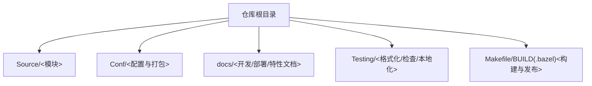
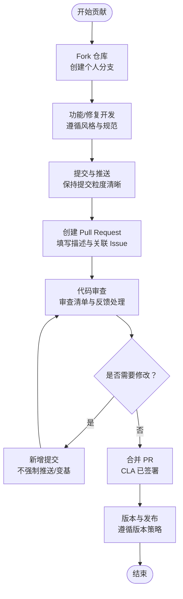
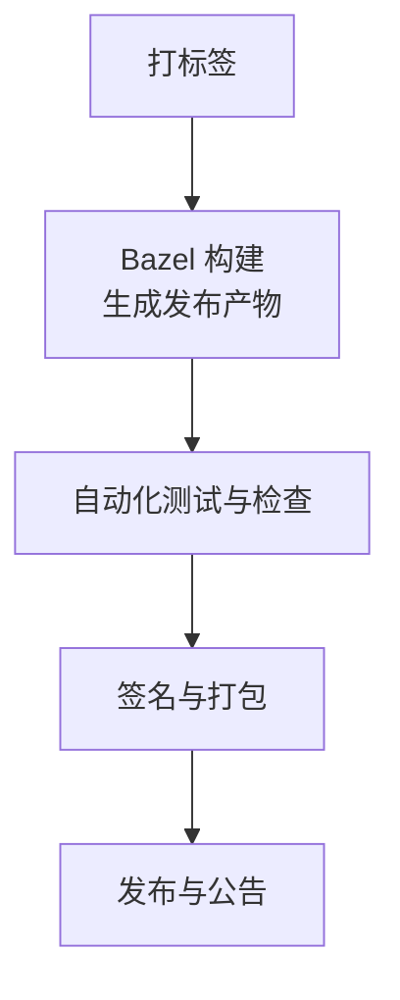
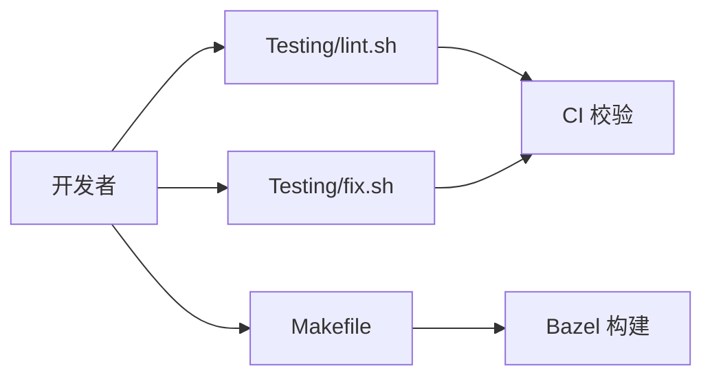

# 贡献流程

<cite>
**本文引用的文件**
- [README.md](file://README.md)
- [CONTRIBUTING.md](file://CONTRIBUTING.md)
- [SECURITY.md](file://SECURITY.md)
- [docs/docs/development/contributing.md](file://docs/docs/development/contributing.md)
- [docs/docs/development/building.md](file://docs/docs/development/building.md)
- [docs/docs/development/version_policy.md](file://docs/docs/development/version_policy.md)
- [Makefile](file://Makefile)
- [Testing/fix.sh](file://Testing/fix.sh)
- [Testing/lint.sh](file://Testing/lint.sh)
</cite>

## 目录
1. [引言](#引言)
2. [项目结构](#项目结构)
3. [核心组件](#核心组件)
4. [架构总览](#架构总览)
5. [详细组件分析](#详细组件分析)
6. [依赖分析](#依赖分析)
7. [性能考虑](#性能考虑)
8. [故障排查指南](#故障排查指南)
9. [结论](#结论)
10. [附录](#附录)

## 引言
本文件面向希望为 Santa 项目做出贡献的开发者与维护者，系统化梳理从 fork 到 Pull Request 合并的完整流程、分支与提交规范、代码审查流程与标准、问题与功能请求的提交规范、安全漏洞报告流程与保密要求、社区行为准则与沟通指南、发布与版本管理策略、贡献者许可协议（CLA）签署流程，以及如何参与项目维护与文档改进。内容基于仓库内现有文档与脚本进行归纳总结，确保非技术背景读者也能顺畅理解。

## 项目结构
Santa 是一个使用 Bazel 构建的 macOS 平台二进制授权系统，包含系统扩展、GUI 代理、后台同步服务与命令行工具等模块。贡献工作主要围绕以下路径展开：
- 源码与模块：Source/
- 配置与打包：Conf/
- 文档与站点：docs/
- 测试与工具：Testing/
- 发布与构建：Makefile、BUILD 等

章节来源
- [docs/docs/development/building.md](file://docs/docs/development/building.md#L1-L106)

## 核心组件
- 贡献前置条件与 CLA
  - 所有贡献需先完成个人贡献者许可协议（Individual CLA）在线签署，方可进入代码库合并阶段。
- 提交前沟通
  - 对于较大改动，建议在提交 PR 前通过 issue 跟维护者沟通，避免后期返工。
- 代码风格与格式化
  - 使用 clang-format、swift-format 与 buildifier 统一风格；可通过仓库提供的脚本自动修复或检查。
- 代码审查
  - 所有提交均需审查，审查反馈通过 GitHub PR 机制进行；收到修改意见后请新增提交而非强制推送或变基，以便 GitHub 展示“自上次审查以来的变更”。

章节来源
- [CONTRIBUTING.md](file://CONTRIBUTING.md#L1-L49)
- [docs/docs/development/contributing.md](file://docs/docs/development/contributing.md#L1-L49)
- [Testing/fix.sh](file://Testing/fix.sh#L1-L8)
- [Testing/lint.sh](file://Testing/lint.sh#L1-L22)

## 架构总览
下图展示贡献流程的关键节点与交互关系，涵盖从 fork 到 PR 合并的主要步骤、审查与 CI 校验、以及文档与版本策略的关联。

## 详细组件分析

### 分支策略与提交规范
- 分支模型
  - 默认分支为 main，所有发布均来自带标签的提交；如需复现特定版本，可检出对应标签。
- 提交粒度
  - 建议按功能或修复拆分提交，便于审查与回溯。
- 提交信息
  - 保持清晰简洁，必要时在 PR 描述中补充背景、动机与影响范围。
- 本地校验
  - 在提交前运行统一的格式化与静态检查脚本，确保 CI 顺利通过。

章节来源
- [docs/docs/development/building.md](file://docs/docs/development/building.md#L1-L106)
- [Testing/fix.sh](file://Testing/fix.sh#L1-L8)
- [Testing/lint.sh](file://Testing/lint.sh#L1-L22)

### 代码审查流程与标准
- 审查流程
  - 所有提交（含维护者）均需审查；通过 GitHub PR 的评论与请求更改机制进行沟通。
  - 收到反馈后，请新增提交以响应修改，避免强制推送或变基，保证“自上次审查以来的变更”可见性。
- 审查标准
  - 正确性：逻辑正确、边界条件覆盖、错误处理完备。
  - 可维护性：命名清晰、注释充分、复杂逻辑拆分合理。
  - 兼容性：对既有行为的影响最小化，必要时提供迁移指引。
  - 性能：避免引入明显性能退化，关键路径保持高效。
  - 安全：遵循安全最佳实践，避免引入新的攻击面。
- 审查清单（建议）
  - 是否满足需求与设计目标？
  - 是否通过本地构建与测试？
  - 是否符合代码风格与格式化要求？
  - 是否存在潜在的回归风险？
  - 是否需要更新文档或测试用例？

章节来源
- [CONTRIBUTING.md](file://CONTRIBUTING.md#L1-L49)
- [docs/docs/development/contributing.md](file://docs/docs/development/contributing.md#L1-L49)

### 问题报告与功能请求
- 问题报告
  - 使用 GitHub Issues 提交问题；优先在社区渠道获取帮助后再提交 issue。
- 功能请求
  - 在提交 PR 前先通过 issue 与维护者沟通，明确需求背景与预期收益，减少后期分歧。
- 沟通渠道
  - 社区交流与求助可使用指定 Slack 频道。

章节来源
- [README.md](file://README.md#L1-L152)
- [CONTRIBUTING.md](file://CONTRIBUTING.md#L1-L49)
- [docs/docs/development/contributing.md](file://docs/docs/development/contributing.md#L1-L49)

### 安全漏洞报告流程与保密要求
- 报告方式
  - 通过 GitHub 安全通告页面私下提交漏洞详情。
- 披露策略
  - 漏洞将在新版本发布或 90 天（以先到为准）内公开披露。
- 保密要求
  - 在未公开披露前，请勿向第三方透露漏洞细节。

章节来源
- [SECURITY.md](file://SECURITY.md#L1-L10)

### 社区行为准则与沟通指南
- 行为准则
  - 项目鼓励友好、尊重与包容的社区氛围；任何不当言行将被指出并要求改正。
- 沟通指南
  - 优先使用公开渠道进行讨论；涉及敏感话题请谨慎措辞。
- 问题与 PR 的沟通
  - 对审查反馈保持开放态度，积极回应疑问；若不确定可请求更详细的说明。

章节来源
- [CONTRIBUTING.md](file://CONTRIBUTING.md#L1-L49)
- [docs/docs/development/contributing.md](file://docs/docs/development/contributing.md#L1-L49)

### 发布流程与版本管理策略
- 版本来源
  - 所有发布均从带标签的提交构建；默认分支 main 为源代码真相。
- 版本支持策略
  - 对于 Santa 自身版本：通常支持近一年内的版本，维护者可要求升级至最新版本。
  - 对于 macOS 版本：始终支持最新 3 个主版本；新主版本发布时会临时支持最多 4 个主版本，至少持续 3 个月。
  - 新特性若依赖新系统版本，可在旧系统上禁用并通过文档标注。
- 发布构建
  - 使用 Makefile 中的规则进行构建与打包，支持多架构与调试符号生成。

章节来源
- [docs/docs/development/building.md](file://docs/docs/development/building.md#L1-L106)
- [docs/docs/development/version_policy.md](file://docs/docs/development/version_policy.md#L1-L32)
- [Makefile](file://Makefile#L1-L40)

### 贡献者许可协议（CLA）要求与签署流程
- 要求
  - 所有贡献者需签署个人贡献者许可协议（Individual CLA），以确保项目拥有必要的版权许可与分发权限。
- 签署流程
  - 在线完成 CLA 签署；通常在提交 PR 后由维护者指导完成，但必须在合并前完成。
- 影响
  - 未签署 CLA 的贡献无法进入代码库；CLA 不改变贡献者的版权归属，仅授予项目使用与再分发的权利。

章节来源
- [CONTRIBUTING.md](file://CONTRIBUTING.md#L1-L49)
- [docs/docs/development/contributing.md](file://docs/docs/development/contributing.md#L1-L49)

### 参与项目维护与文档改进
- 项目维护
  - 关注 issue 与 PR，及时响应审查反馈与社区提问；协助推进修复与改进。
- 文档改进
  - 文档位于 docs/ 目录，采用 Docusaurus；新增或修改文档时请遵循现有目录结构与侧边栏配置。
- 本地预览
  - 使用文档工程提供的依赖与配置进行本地构建与预览，确保链接与样式无误。

章节来源
- [docs/docs/development/building.md](file://docs/docs/development/building.md#L1-L106)

## 依赖分析
贡献流程中的关键依赖关系如下：
- 本地工具链：clang-format、swift-format、buildifier、bazelisk
- 仓库脚本：Testing/fix.sh、Testing/lint.sh、Makefile
- 文档与站点：docs/docs/development/*.md

图表来源
- [Testing/fix.sh](file://Testing/fix.sh#L1-L8)
- [Testing/lint.sh](file://Testing/lint.sh#L1-L22)
- [Makefile](file://Makefile#L1-L40)

章节来源
- [Testing/fix.sh](file://Testing/fix.sh#L1-L8)
- [Testing/lint.sh](file://Testing/lint.sh#L1-L22)
- [Makefile](file://Makefile#L1-L40)

## 性能考虑
- 本地构建与测试
  - 使用 Makefile 快速执行格式化、构建与测试，有助于在提交前发现潜在问题。
- 代码审查与回归
  - 通过严格的审查与测试，避免引入性能退化；对关键路径保持关注。
- 版本策略
  - 遵循版本支持策略，避免过度兼容旧版本导致的性能与维护成本上升。

章节来源
- [Makefile](file://Makefile#L1-L40)
- [docs/docs/development/version_policy.md](file://docs/docs/development/version_policy.md#L1-L32)

## 故障排查指南
- 格式化失败
  - 使用仓库脚本自动修复或检查；确认本地 clang-format、swift-format 与 buildifier 版本一致。
- 构建失败
  - 确认已安装并使用正确的 Bazel 版本（bazelisk）；参考构建文档进行环境准备。
- 测试失败
  - 使用 Makefile 的测试目标运行单元测试；定位失败用例并修复。
- 审查反馈未显示差异
  - 若出现审查界面未显示“自上次审查以来的变更”，请检查是否进行了强制推送或变基；应改为新增提交以保留差异视图。

章节来源
- [Testing/fix.sh](file://Testing/fix.sh#L1-L8)
- [Testing/lint.sh](file://Testing/lint.sh#L1-L22)
- [docs/docs/development/building.md](file://docs/docs/development/building.md#L1-L106)
- [CONTRIBUTING.md](file://CONTRIBUTING.md#L1-L49)
- [docs/docs/development/contributing.md](file://docs/docs/development/contributing.md#L1-L49)

## 结论
Santa 项目的贡献流程以“先沟通、后提交、严审查、重规范”为核心原则。通过统一的格式化与构建工具、严格的审查与版本策略，以及完善的沟通与安全披露机制，确保贡献质量与项目长期健康演进。建议贡献者在提交前熟悉本文档与相关脚本，以提升协作效率与成功率。

## 附录
- 快速参考
  - CLA：在线签署，合并前完成。
  - 审查：所有提交均需审查；收到反馈后新增提交。
  - 格式化：使用仓库脚本统一风格。
  - 构建：使用 Makefile 与 Bazel；遵循文档准备环境。
  - 版本：从标签构建；遵循版本支持策略。