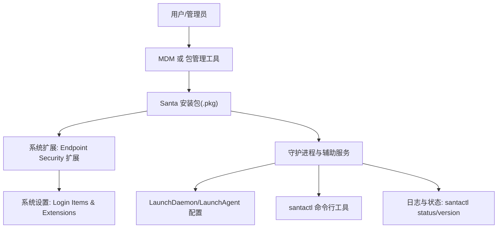
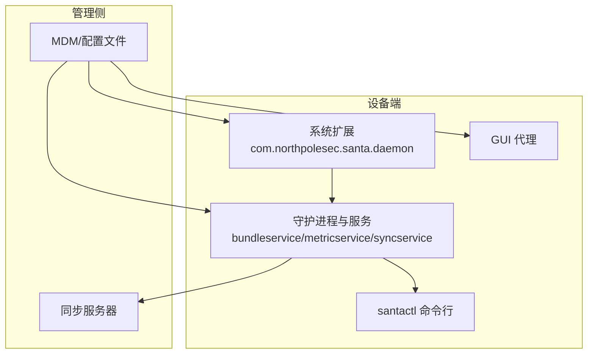
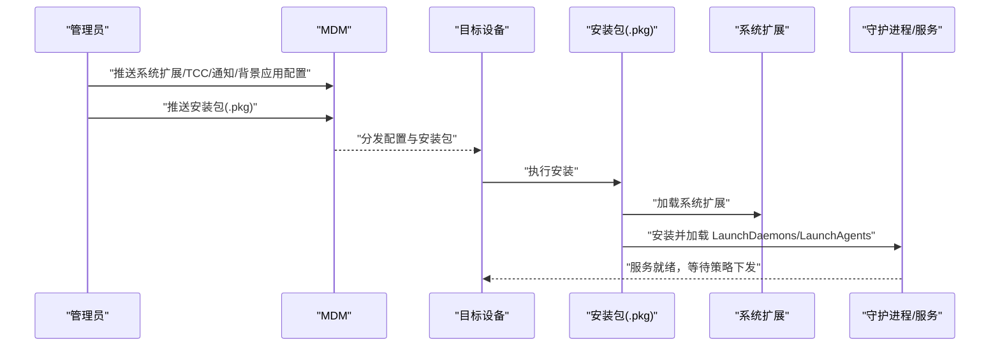
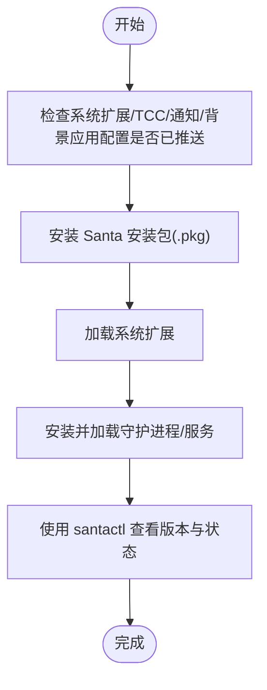
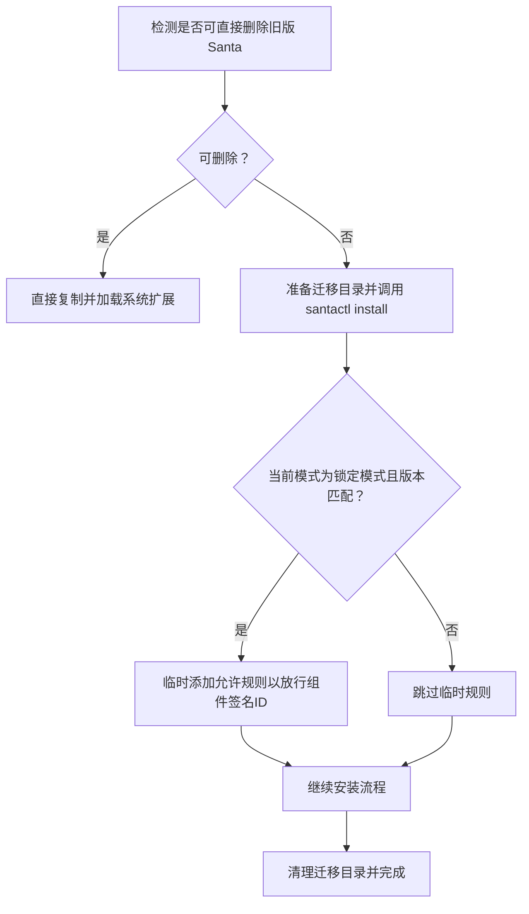
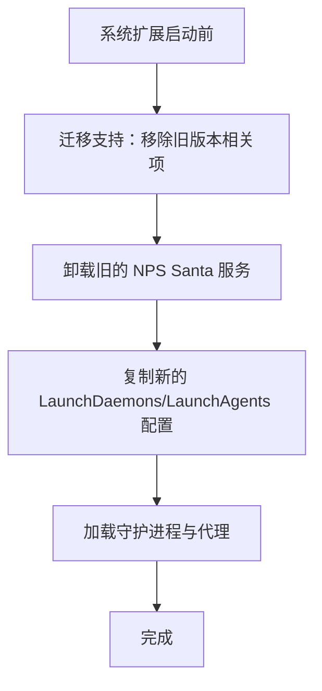
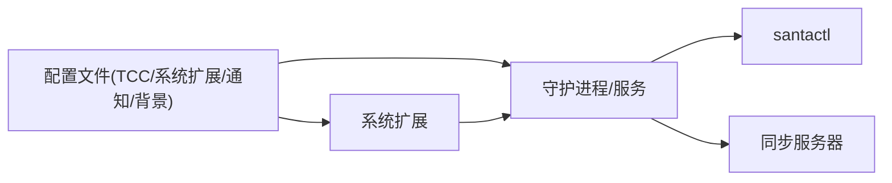

# 快速开始

<cite>
**本文引用的文件**
- [README.md](file://README.md)
- [docs/docs/deployment/getting-started.md](file://docs/docs/deployment/getting-started.md)
- [docs/docs/deployment/install-package.md](file://docs/docs/deployment/install-package.md)
- [docs/docs/deployment/profile-system-extension.md](file://docs/docs/deployment/profile-system-extension.md)
- [docs/docs/deployment/profile-tcc.md](file://docs/docs/deployment/profile-tcc.md)
- [docs/docs/deployment/profile-background.md](file://docs/docs/deployment/profile-background.md)
- [docs/docs/deployment/profile-notifications.md](file://docs/docs/deployment/profile-notifications.md)
- [docs/docs/deployment/troubleshooting.md](file://docs/docs/deployment/troubleshooting.md)
- [Conf/install.sh](file://Conf/install.sh)
- [Conf/install_services.sh](file://Conf/install_services.sh)
- [Conf/uninstall.sh](file://Conf/uninstall.sh)
- [Conf/com.northpolesec.santa.plist](file://Conf/com.northpolesec.santa.plist)
</cite>

## 目录
1. [简介](#简介)
2. [项目结构](#项目结构)
3. [核心组件](#核心组件)
4. [架构总览](#架构总览)
5. [详细组件分析](#详细组件分析)
6. [依赖分析](#依赖分析)
7. [性能考虑](#性能考虑)
8. [故障排除指南](#故障排除指南)
9. [结论](#结论)
10. [附录](#附录)

## 简介
Santa 是一个面向 macOS 的二进制与文件访问授权系统，由系统扩展、GUI 代理、同步服务以及命令行工具组成。它通过本地数据库与远程管理服务器协同工作，在默认“监控模式”下记录未知或被阻止的二进制执行事件，并在“锁定模式”下仅允许白名单中的程序运行。Santa 支持多种规则类型（签名、路径、编译器等）与缓存机制，以降低重复决策开销。

本“快速开始”旨在帮助新用户在最短时间内完成系统要求检查、安装包下载、系统扩展安装、服务启动与基础验证，并提供常见问题排查方法。

章节来源
- [README.md](file://README.md#L13-L30)

## 项目结构
本仓库包含以下与安装部署直接相关的部分：
- 文档：位于 docs/docs/deployment 下，涵盖系统扩展、TCC、通知、背景应用、安装包与故障排除等主题。
- 配置与脚本：位于 Conf/，包含安装/卸载脚本、LaunchDaemon/LaunchAgent 配置文件及打包相关脚本。
- 源码：位于 Source/，包含系统扩展、守护进程、命令行工具、指标与同步服务等组件（用于理解整体架构与职责划分）。

下面给出一个概念性项目结构图，展示安装流程中涉及的关键文件与角色：

## 核心组件
- 系统扩展（Endpoint Security Extension）
  - 负责从内核接收事件回调并进行拦截/放行决策。
  - 需要通过系统扩展配置文件在组织内预批准加载。
- 守护进程与辅助服务
  - 包含捆绑服务、指标服务、同步服务与 GUI 代理。
  - 通过 LaunchDaemon/LaunchAgent 在系统启动时自动加载。
- 配置文件与策略
  - 使用 macOS 配置文件部署 TCC、系统扩展、通知与背景应用等策略。
  - 可通过配置文件下发 Santa 的行为参数与规则源。
- 命令行工具（santactl）
  - 用于查询版本、查看状态、安装更新、规则管理与诊断等。

章节来源
- [docs/docs/deployment/profile-system-extension.md](file://docs/docs/deployment/profile-system-extension.md#L1-L20)
- [docs/docs/deployment/profile-tcc.md](file://docs/docs/deployment/profile-tcc.md#L1-L20)
- [docs/docs/deployment/profile-background.md](file://docs/docs/deployment/profile-background.md#L1-L15)
- [docs/docs/deployment/profile-notifications.md](file://docs/docs/deployment/profile-notifications.md#L1-L15)
- [docs/docs/deployment/install-package.md](file://docs/docs/deployment/install-package.md#L148-L196)

## 架构总览
下图展示了 Santa 在 macOS 上的典型部署与交互关系，映射到实际配置文件与文档页面：

图表来源
- [docs/docs/deployment/profile-system-extension.md](file://docs/docs/deployment/profile-system-extension.md#L1-L20)
- [docs/docs/deployment/profile-tcc.md](file://docs/docs/deployment/profile-tcc.md#L1-L20)
- [docs/docs/deployment/profile-background.md](file://docs/docs/deployment/profile-background.md#L1-L15)
- [docs/docs/deployment/profile-notifications.md](file://docs/docs/deployment/profile-notifications.md#L1-L15)
- [docs/docs/deployment/install-package.md](file://docs/docs/deployment/install-package.md#L148-L196)

## 详细组件分析

### 安装流程（手动 vs MDM 部署）
- 手动安装
  - 适用于单机实验或小规模部署。可双击 PKG 文件或使用命令行安装。
  - 安装包自带预安装/后安装脚本，确保系统扩展与服务正确加载。
- MDM 部署
  - 通过 MDM 推送系统扩展、TCC、通知与背景应用配置，再推送安装包。
  - 建议启用“审计与强制”以确保安装包不被移除。
- 升级与热更新
  - 若已有运行中的 Santa，可通过命令触发升级；安装脚本会处理签名 ID 规则以避免锁区升级阻塞。

图表来源
- [docs/docs/deployment/install-package.md](file://docs/docs/deployment/install-package.md#L31-L64)
- [docs/docs/deployment/profile-system-extension.md](file://docs/docs/deployment/profile-system-extension.md#L18-L44)
- [docs/docs/deployment/profile-tcc.md](file://docs/docs/deployment/profile-tcc.md#L18-L40)
- [docs/docs/deployment/profile-background.md](file://docs/docs/deployment/profile-background.md#L16-L33)
- [docs/docs/deployment/profile-notifications.md](file://docs/docs/deployment/profile-notifications.md#L18-L39)

章节来源
- [docs/docs/deployment/install-package.md](file://docs/docs/deployment/install-package.md#L115-L147)
- [docs/docs/deployment/install-package.md](file://docs/docs/deployment/install-package.md#L31-L64)
- [docs/docs/deployment/getting-started.md](file://docs/docs/deployment/getting-started.md#L1-L21)

### 首次配置与服务启动
- 系统扩展与 TCC
  - 使用系统扩展配置文件预批准扩展加载；使用 TCC 配置文件授予 Full Disk Access 权限。
- 背景应用与通知
  - 使用背景应用配置文件抑制“后台应用已添加”提示；使用通知配置文件控制 Santa 的系统通知行为。
- 服务安装与加载
  - 安装包会复制 LaunchDaemon/LaunchAgent 配置并加载；也可通过服务安装脚本在系统扩展启动前完成迁移与加载。
- 验证
  - 使用命令行工具查看版本与状态，确认守护进程、缓存、数据库、同步信息等处于正常状态。

图表来源
- [docs/docs/deployment/profile-system-extension.md](file://docs/docs/deployment/profile-system-extension.md#L18-L44)
- [docs/docs/deployment/profile-tcc.md](file://docs/docs/deployment/profile-tcc.md#L18-L40)
- [docs/docs/deployment/profile-background.md](file://docs/docs/deployment/profile-background.md#L16-L33)
- [docs/docs/deployment/profile-notifications.md](file://docs/docs/deployment/profile-notifications.md#L18-L39)
- [docs/docs/deployment/install-package.md](file://docs/docs/deployment/install-package.md#L148-L196)

章节来源
- [docs/docs/deployment/profile-system-extension.md](file://docs/docs/deployment/profile-system-extension.md#L1-L20)
- [docs/docs/deployment/profile-tcc.md](file://docs/docs/deployment/profile-tcc.md#L1-L20)
- [docs/docs/deployment/profile-background.md](file://docs/docs/deployment/profile-background.md#L1-L15)
- [docs/docs/deployment/profile-notifications.md](file://docs/docs/deployment/profile-notifications.md#L1-L15)
- [docs/docs/deployment/install-package.md](file://docs/docs/deployment/install-package.md#L148-L196)

### 升级与热更新（安装脚本逻辑）
安装脚本会根据当前是否可直接删除旧版 Santa 来决定是直接安装还是通过命令触发更新。当处于锁定模式且版本为特定范围时，脚本会临时添加允许规则以避免升级阻塞。

图表来源
- [Conf/install.sh](file://Conf/install.sh#L21-L66)

章节来源
- [Conf/install.sh](file://Conf/install.sh#L21-L66)

### 服务安装脚本（系统扩展启动前）
该脚本在系统扩展启动前运行，负责清理旧版本残留、卸载旧服务、安装新 LaunchDaemons/LaunchAgents 并加载它们。

图表来源
- [Conf/install_services.sh](file://Conf/install_services.sh#L18-L64)

章节来源
- [Conf/install_services.sh](file://Conf/install_services.sh#L18-L64)

### 卸载流程
- 卸载系统扩展
- 卸载守护进程与代理
- 删除应用与配置文件
- 可选：删除/var/db/santa 与日志

章节来源
- [Conf/uninstall.sh](file://Conf/uninstall.sh#L1-L42)

## 依赖分析
- 组件耦合
  - 系统扩展与守护进程/服务之间通过 XPC 通信；GUI 代理与命令行工具也通过 XPC 与守护进程交互。
  - 配置文件（TCC、系统扩展、通知、背景应用）对系统扩展与 Full Disk Access 的启用具有强依赖。
- 外部依赖
  - MDM：用于批量推送配置与安装包。
  - 同步服务器：用于策略与规则的集中管理与下发。
- 潜在循环依赖
  - 安装脚本与服务安装脚本在启动阶段有明确顺序，未见循环依赖迹象。

图表来源
- [docs/docs/deployment/profile-tcc.md](file://docs/docs/deployment/profile-tcc.md#L18-L40)
- [docs/docs/deployment/profile-system-extension.md](file://docs/docs/deployment/profile-system-extension.md#L18-L44)
- [docs/docs/deployment/profile-notifications.md](file://docs/docs/deployment/profile-notifications.md#L18-L39)
- [docs/docs/deployment/profile-background.md](file://docs/docs/deployment/profile-background.md#L16-L33)
- [docs/docs/deployment/install-package.md](file://docs/docs/deployment/install-package.md#L148-L196)

## 性能考虑
- 缓存机制：已允许的二进制会被缓存，减少重复决策成本。
- 日志与事件：事件数据库用于聚合与后续分析，建议合理配置日志级别与存储位置。
- 规则优先级：签名规则优先于路径规则，合理设计规则可减少误判与回溯成本。

章节来源
- [README.md](file://README.md#L83-L88)

## 故障排除指南
- 确认守护进程运行
  - 使用命令行工具查看状态与版本，若无法通信，先执行诊断命令。
- 启用 Full Disk Access
  - 在系统设置中为 Santa 的守护进程与捆绑服务授予 Full Disk Access。
- 确认系统扩展已激活
  - 使用系统扩展列表命令检查状态；如处于“等待用户批准”，需在系统设置中启用。
- 查看日志
  - 使用系统日志流过滤守护进程日志，定位启动失败或异常原因。
- 企业部署注意事项
  - 确保 MDM 监督关系正常；确认系统扩展与 TCC/通知/背景应用配置均已下发。

章节来源
- [docs/docs/deployment/troubleshooting.md](file://docs/docs/deployment/troubleshooting.md#L10-L20)
- [docs/docs/deployment/troubleshooting.md](file://docs/docs/deployment/troubleshooting.md#L23-L30)
- [docs/docs/deployment/troubleshooting.md](file://docs/docs/deployment/troubleshooting.md#L31-L45)
- [docs/docs/deployment/troubleshooting.md](file://docs/docs/deployment/troubleshooting.md#L46-L76)
- [docs/docs/deployment/troubleshooting.md](file://docs/docs/deployment/troubleshooting.md#L77-L86)
- [docs/docs/deployment/troubleshooting.md](file://docs/docs/deployment/troubleshooting.md#L87-L107)

## 结论
通过遵循本指南，您可以在几分钟内完成 Santa 的系统要求检查、安装包部署、系统扩展与服务启动，并通过命令行工具进行状态验证。对于企业环境，建议采用 MDM 进行统一配置与安装，以减少用户干预并提升一致性。遇到问题时，可按故障排除指南逐步定位并解决。

## 附录

### 快速操作清单
- 准备配置文件：系统扩展、TCC、通知、背景应用
- 下载安装包：从发布页获取最新 PKG
- 部署方式：MDM 或手动安装
- 首次验证：santactl version 与 santactl status
- 常见问题：Full Disk Access、系统扩展状态、日志排查

章节来源
- [docs/docs/deployment/install-package.md](file://docs/docs/deployment/install-package.md#L115-L147)
- [docs/docs/deployment/install-package.md](file://docs/docs/deployment/install-package.md#L148-L196)
- [docs/docs/deployment/troubleshooting.md](file://docs/docs/deployment/troubleshooting.md#L31-L45)
- [docs/docs/deployment/troubleshooting.md](file://docs/docs/deployment/troubleshooting.md#L46-L76)