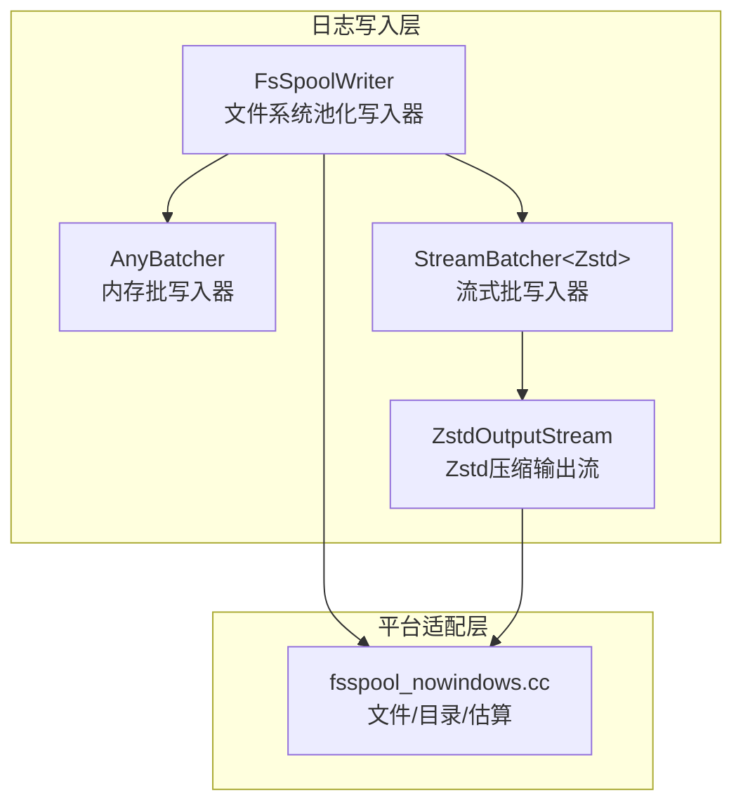
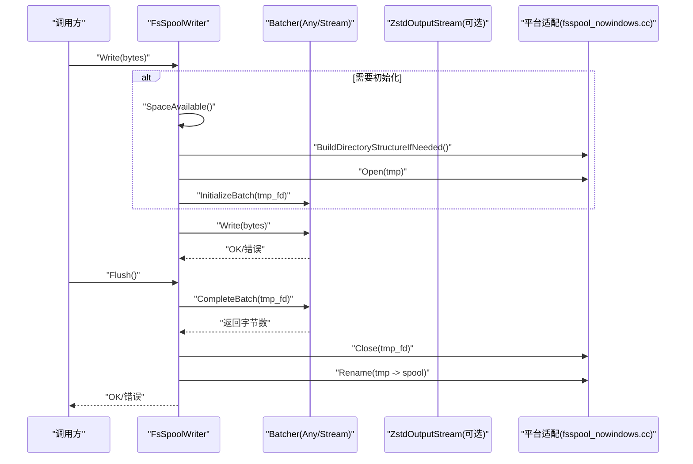
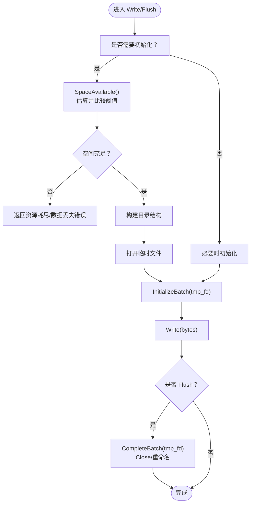
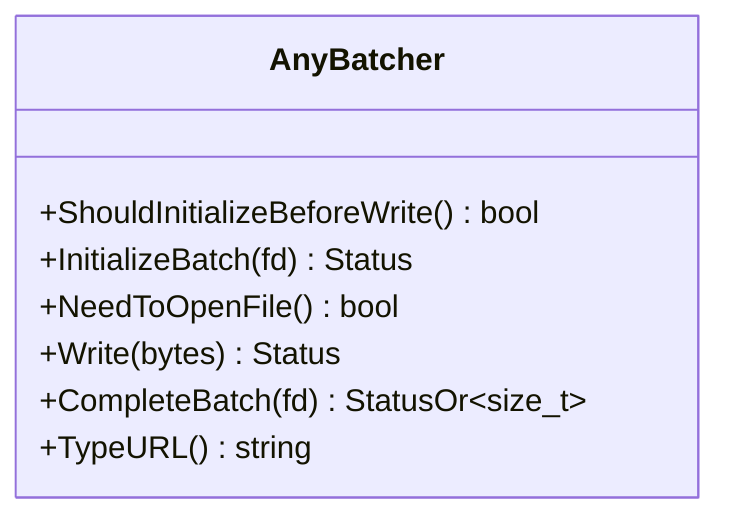
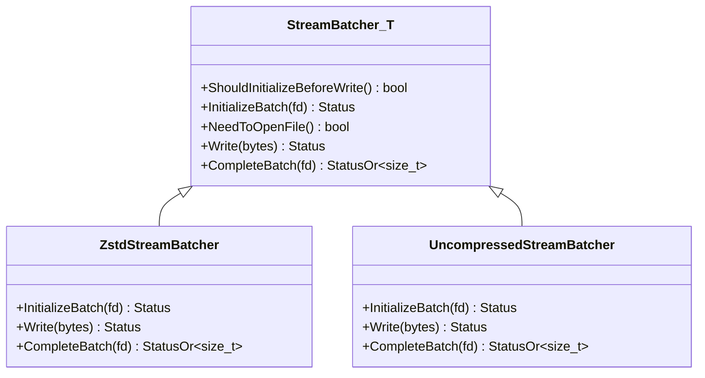
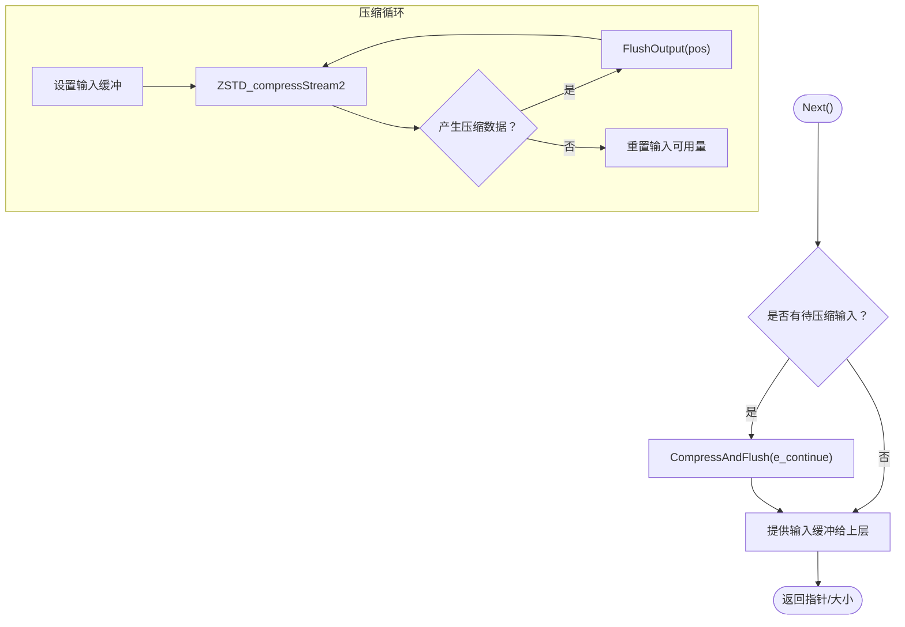
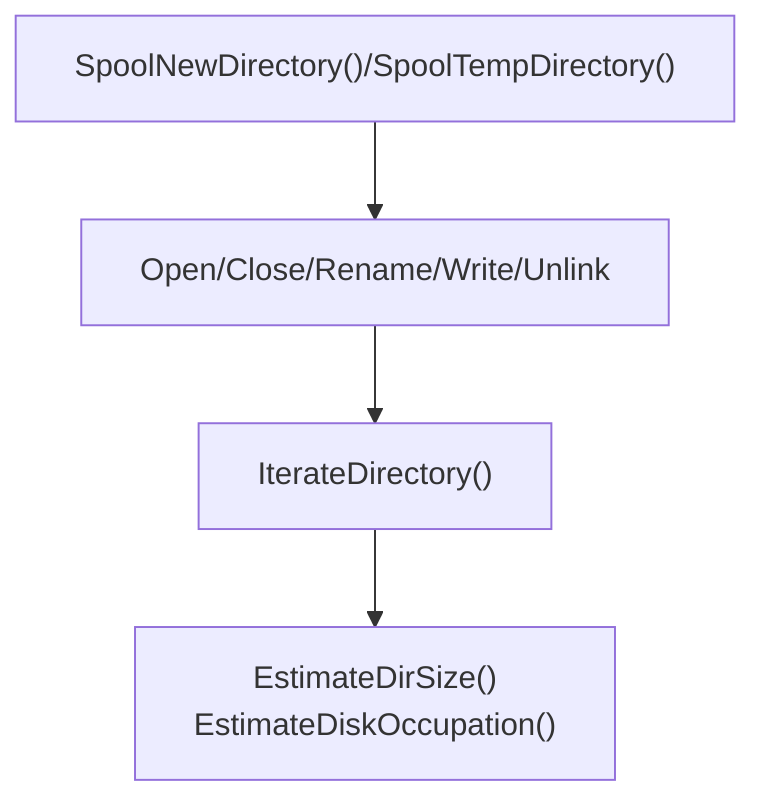
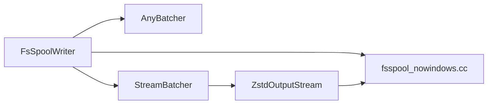

# I/O优化

<cite>
**本文引用的文件**
- [fsspool.h](file://Source/santad/Logs/EndpointSecurity/Writers/FSSpool/fsspool.h)
- [fsspool_nowindows.cc](file://Source/santad/Logs/EndpointSecurity/Writers/FSSpool/fsspool_nowindows.cc)
- [AnyBatcher.h](file://Source/santad/Logs/EndpointSecurity/Writers/FSSpool/AnyBatcher.h)
- [AnyBatcher.mm](file://Source/santad/Logs/EndpointSecurity/Writers/FSSpool/AnyBatcher.mm)
- [StreamBatcher.h](file://Source/santad/Logs/EndpointSecurity/Writers/FSSpool/StreamBatcher.h)
- [ZstdOutputStream.h](file://Source/santad/Logs/EndpointSecurity/Writers/FSSpool/ZstdOutputStream.h)
- [ZstdOutputStream.mm](file://Source/santad/Logs/EndpointSecurity/Writers/FSSpool/ZstdOutputStream.mm)
- [StreamBatcherTest.mm](file://Source/santad/Logs/EndpointSecurity/Writers/FSSpool/StreamBatcherTest.mm)
</cite>

## 目录
1. [引言](#引言)
2. [项目结构](#项目结构)
3. [核心组件](#核心组件)
4. [架构总览](#架构总览)
5. [详细组件分析](#详细组件分析)
6. [依赖关系分析](#依赖关系分析)
7. [性能考量](#性能考量)
8. [故障排查指南](#故障排查指南)
9. [结论](#结论)
10. [附录](#附录)

## 引言
本技术文档聚焦 Santa I/O 优化的关键子系统：基于文件系统的消息池化（FSSpool）、Zstd 压缩输出流以及批量写入策略。我们将从架构、数据流、处理逻辑、集成点、错误处理与性能特性等维度进行深入解析，并结合实际源码路径帮助读者快速定位实现细节。同时，文档涵盖事件日志的异步写入、缓冲区管理、磁盘空间控制、I/O 调度优化、文件描述符复用与系统调用减少、磁盘 I/O 监控与吞吐量优化、延迟控制、日志轮转策略、磁盘配额与存储回收，以及网络 I/O 优化、远程写入与带宽限制处理。

## 项目结构
该 I/O 优化模块位于 santad 的日志子系统中，采用“文件系统池化 + 批量写入 + 压缩”的分层设计：
- 文件系统池化（FsSpool）：负责多写者并发写入、临时文件与最终落盘、目录结构管理、空间估算与配额控制。
- 批量写入器（AnyBatcher/StreamBatcher）：将消息按批次写入，支持内存批（AnyBatcher）与流式批（StreamBatcher）两种模式。
- 压缩输出流（ZstdOutputStream）：在流式批写入时对数据进行 Zstd 压缩，提升吞吐并降低存储占用。
- 平台适配层（fsspool_nowindows.cc）：封装文件操作、目录遍历、磁盘占用估算等平台相关逻辑。

**图表来源**
- [fsspool.h](file://Source/santad/Logs/EndpointSecurity/Writers/FSSpool/fsspool.h#L60-L220)
- [AnyBatcher.h](file://Source/santad/Logs/EndpointSecurity/Writers/FSSpool/AnyBatcher.h#L26-L41)
- [StreamBatcher.h](file://Source/santad/Logs/EndpointSecurity/Writers/FSSpool/StreamBatcher.h#L33-L90)
- [ZstdOutputStream.h](file://Source/santad/Logs/EndpointSecurity/Writers/FSSpool/ZstdOutputStream.h#L24-L63)
- [fsspool_nowindows.cc](file://Source/santad/Logs/EndpointSecurity/Writers/FSSpool/fsspool_nowindows.cc#L36-L105)

**章节来源**
- [fsspool.h](file://Source/santad/Logs/EndpointSecurity/Writers/FSSpool/fsspool.h#L60-L220)
- [fsspool_nowindows.cc](file://Source/santad/Logs/EndpointSecurity/Writers/FSSpool/fsspool_nowindows.cc#L36-L105)

## 核心组件
- FsSpoolWriter：线程兼容的文件系统池化写入器，支持多并发写者；通过临时文件与最终重命名实现原子落盘；内置磁盘空间估算与配额控制；支持 Flush 触发最终提交。
- AnyBatcher：内存批写入器，将消息累积到 Protobuf Any 列表后一次性写入文件；适合低频、大块写入场景。
- StreamBatcher：流式批写入器，按消息写入头部（魔数、哈希、长度）与负载；可选 Zstd 或 Gzip 压缩；适合高频、小块写入场景。
- ZstdOutputStream：零拷贝风格的 Zstd 压缩输出流，提供输入缓冲与压缩/刷新循环，对接上层编码流。
- 平台适配层：封装 open/close/rename/iterate/stat 等系统调用，提供目录结构、磁盘占用估算与迭代遍历。

**章节来源**
- [fsspool.h](file://Source/santad/Logs/EndpointSecurity/Writers/FSSpool/fsspool.h#L60-L220)
- [AnyBatcher.h](file://Source/santad/Logs/EndpointSecurity/Writers/FSSpool/AnyBatcher.h#L26-L41)
- [StreamBatcher.h](file://Source/santad/Logs/EndpointSecurity/Writers/FSSpool/StreamBatcher.h#L33-L90)
- [ZstdOutputStream.h](file://Source/santad/Logs/EndpointSecurity/Writers/FSSpool/ZstdOutputStream.h#L24-L63)
- [fsspool_nowindows.cc](file://Source/santad/Logs/EndpointSecurity/Writers/FSSpool/fsspool_nowindows.cc#L36-L105)

## 架构总览
下图展示了事件日志从写入到落盘的整体流程，包括批量写入、压缩、临时文件与最终重命名、空间检查与 Flush 提交。

**图表来源**
- [fsspool.h](file://Source/santad/Logs/EndpointSecurity/Writers/FSSpool/fsspool.h#L120-L220)
- [StreamBatcher.h](file://Source/santad/Logs/EndpointSecurity/Writers/FSSpool/StreamBatcher.h#L41-L81)
- [ZstdOutputStream.mm](file://Source/santad/Logs/EndpointSecurity/Writers/FSSpool/ZstdOutputStream.mm#L39-L84)
- [fsspool_nowindows.cc](file://Source/santad/Logs/EndpointSecurity/Writers/FSSpool/fsspool_nowindows.cc#L99-L105)

## 详细组件分析

### 组件A：FsSpoolWriter（文件系统池化写入器）
- 多写者并发：多个写者共享同一基座目录，通过唯一文件名与临时文件实现无锁 IPC。
- 目录结构：自动创建 new 与 tmp 子目录；首次写入前确保目录存在；清理 tmp 中的残留链接或文件。
- 空间控制：维护近似目录大小估计，基于磁盘簇大小向上取整；超过阈值则拒绝写入；Flush 后重置失败标记。
- 生命周期：Initialize/Write/Complete/Flush；Complete 将临时文件重命名为最终文件；失败时删除临时文件并回滚。
- 估算与一致性：仅在目录修改时间变化时重新统计，避免频繁 IO；估算值随写入增长，消费端 ACK 后由外部回收。

**图表来源**
- [fsspool.h](file://Source/santad/Logs/EndpointSecurity/Writers/FSSpool/fsspool.h#L120-L220)
- [fsspool_nowindows.cc](file://Source/santad/Logs/EndpointSecurity/Writers/FSSpool/fsspool_nowindows.cc#L138-L162)

**章节来源**
- [fsspool.h](file://Source/santad/Logs/EndpointSecurity/Writers/FSSpool/fsspool.h#L60-L220)
- [fsspool_nowindows.cc](file://Source/santad/Logs/EndpointSecurity/Writers/FSSpool/fsspool_nowindows.cc#L127-L162)

### 组件B：AnyBatcher（内存批写入器）
- 写入策略：将消息封装为 Protobuf Any 并追加到内存缓存；仅在需要打开文件时才真正落盘。
- 完成策略：序列化为字符串后写入文件；重置缓存并预留容量以减少后续分配。
- 适用场景：低频、大批量写入；避免频繁系统调用与磁盘碎片。

**图表来源**
- [AnyBatcher.h](file://Source/santad/Logs/EndpointSecurity/Writers/FSSpool/AnyBatcher.h#L26-L41)
- [AnyBatcher.mm](file://Source/santad/Logs/EndpointSecurity/Writers/FSSpool/AnyBatcher.mm#L31-L61)

**章节来源**
- [AnyBatcher.h](file://Source/santad/Logs/EndpointSecurity/Writers/FSSpool/AnyBatcher.h#L26-L41)
- [AnyBatcher.mm](file://Source/santad/Logs/EndpointSecurity/Writers/FSSpool/AnyBatcher.mm#L31-L61)

### 组件C：StreamBatcher（流式批写入器）
- 写入格式：写入魔数、消息哈希（Xxhash64）、变长长度与原始负载；保证可校验与可恢复。
- 初始化：创建底层 FileOutputStream 与 CodedOutputStream；可注入压缩输出流工厂（如 Zstd/Gzip）。
- 完成：计算字节计数并释放资源；返回写入字节数用于空间估算。
- 特殊化：当禁用压缩时使用 Unit 包装，逻辑几乎一致但无压缩开销。

**图表来源**
- [StreamBatcher.h](file://Source/santad/Logs/EndpointSecurity/Writers/FSSpool/StreamBatcher.h#L33-L90)
- [StreamBatcher.h](file://Source/santad/Logs/EndpointSecurity/Writers/FSSpool/StreamBatcher.h#L98-L150)

**章节来源**
- [StreamBatcher.h](file://Source/santad/Logs/EndpointSecurity/Writers/FSSpool/StreamBatcher.h#L33-L90)
- [StreamBatcher.h](file://Source/santad/Logs/EndpointSecurity/Writers/FSSpool/StreamBatcher.h#L98-L150)

### 组件D：ZstdOutputStream（Zstd 压缩输出流）
- 缓冲策略：双缓冲（输入/输出），输入缓冲供上层写入，输出缓冲供压缩后写出。
- 压缩循环：持续 compressStream2，直到输入耗尽或结束；每段压缩后立即 flush 至下游 ZeroCopy 流。
- 接口契约：实现 Next/BackUp/ByteCount，与 Protobuf 编码流无缝衔接。
- 生命周期：析构时强制 flush 结束帧并释放 CStream。

**图表来源**
- [ZstdOutputStream.h](file://Source/santad/Logs/EndpointSecurity/Writers/FSSpool/ZstdOutputStream.h#L24-L63)
- [ZstdOutputStream.mm](file://Source/santad/Logs/EndpointSecurity/Writers/FSSpool/ZstdOutputStream.mm#L54-L119)
- [ZstdOutputStream.mm](file://Source/santad/Logs/EndpointSecurity/Writers/FSSpool/ZstdOutputStream.mm#L121-L149)

**章节来源**
- [ZstdOutputStream.h](file://Source/santad/Logs/EndpointSecurity/Writers/FSSpool/ZstdOutputStream.h#L24-L63)
- [ZstdOutputStream.mm](file://Source/santad/Logs/EndpointSecurity/Writers/FSSpool/ZstdOutputStream.mm#L39-L84)
- [ZstdOutputStream.mm](file://Source/santad/Logs/EndpointSecurity/Writers/FSSpool/ZstdOutputStream.mm#L86-L149)

### 组件E：平台适配层（fsspool_nowindows.cc）
- 目录与路径：定义 new/tmp 子目录名称与分隔符；提供绝对路径判断。
- 文件操作：封装 open/close/write/unlink/rename；统一错误转换为 absl::Status。
- 目录遍历：遍历目录项并回调处理；过滤隐藏项与非常规文件。
- 磁盘占用估算：按典型簇大小（4KiB）向上取整，空文件也占至少一个簇。

**图表来源**
- [fsspool_nowindows.cc](file://Source/santad/Logs/EndpointSecurity/Writers/FSSpool/fsspool_nowindows.cc#L36-L105)
- [fsspool_nowindows.cc](file://Source/santad/Logs/EndpointSecurity/Writers/FSSpool/fsspool_nowindows.cc#L138-L162)

**章节来源**
- [fsspool_nowindows.cc](file://Source/santad/Logs/EndpointSecurity/Writers/FSSpool/fsspool_nowindows.cc#L36-L105)
- [fsspool_nowindows.cc](file://Source/santad/Logs/EndpointSecurity/Writers/FSSpool/fsspool_nowindows.cc#L127-L162)

## 依赖关系分析
- FsSpoolWriter 依赖 Batcher 接口（AnyBatcher/StreamBatcher）与平台适配层。
- StreamBatcher 可注入任意 ZeroCopyOutputStream 工厂（含 ZstdOutputStream）。
- ZstdOutputStream 依赖 Zstd 库与 Protobuf 零拷贝流接口。
- 平台适配层提供跨平台文件系统抽象。

**图表来源**
- [fsspool.h](file://Source/santad/Logs/EndpointSecurity/Writers/FSSpool/fsspool.h#L60-L220)
- [StreamBatcher.h](file://Source/santad/Logs/EndpointSecurity/Writers/FSSpool/StreamBatcher.h#L33-L90)
- [ZstdOutputStream.h](file://Source/santad/Logs/EndpointSecurity/Writers/FSSpool/ZstdOutputStream.h#L24-L63)
- [fsspool_nowindows.cc](file://Source/santad/Logs/EndpointSecurity/Writers/FSSpool/fsspool_nowindows.cc#L36-L105)

**章节来源**
- [fsspool.h](file://Source/santad/Logs/EndpointSecurity/Writers/FSSpool/fsspool.h#L60-L220)
- [StreamBatcher.h](file://Source/santad/Logs/EndpointSecurity/Writers/FSSpool/StreamBatcher.h#L33-L90)
- [ZstdOutputStream.h](file://Source/santad/Logs/EndpointSecurity/Writers/FSSpool/ZstdOutputStream.h#L24-L63)
- [fsspool_nowindows.cc](file://Source/santad/Logs/EndpointSecurity/Writers/FSSpool/fsspool_nowindows.cc#L36-L105)

## 性能考量
- 批量写入与缓冲
  - AnyBatcher：内存批累加，减少系统调用次数，适合大块写入。
  - StreamBatcher：按消息写入，支持压缩，适合高频小块写入。
  - ZstdOutputStream：双缓冲与流水式压缩，降低内存峰值并提升吞吐。
- 磁盘空间控制
  - 近似目录大小估算与簇对齐，避免频繁 stat；超过阈值快速失败，减少无效写入。
  - Flush 后重置失败标记，允许后续重试。
- I/O 调度与文件描述符复用
  - 临时文件 + 原子重命名，避免部分写入与竞争；单 fd 持久化至批完成。
  - 批完成后统一关闭 fd，减少 fd 泄漏风险。
- 系统调用减少
  - 平台适配层统一封装 open/close/rename/write，减少重复逻辑。
  - 压缩输出流内部循环 flush，避免多次小写入。
- 监控与延迟控制
  - 通过估算目录大小与阈值控制写入速率；在高负载下优先让出空间，降低尾延迟。
  - Flush 成功后可触发外部回收流程，维持稳定队列深度。

[本节为通用性能讨论，不直接分析具体文件]

## 故障排查指南
- 写入被拒绝（资源耗尽）
  - 现象：返回资源耗尽错误，后续写入可能返回数据丢失错误。
  - 排查：确认空间估算阈值与实际磁盘剩余；执行 Flush 并等待消费者 ACK。
  - 参考路径：[fsspool.h](file://Source/santad/Logs/EndpointSecurity/Writers/FSSpool/fsspool.h#L100-L118)
- 初始化失败
  - 现象：目录创建失败或打开临时文件失败。
  - 排查：检查权限与路径合法性；确认平台适配层返回状态。
  - 参考路径：[fsspool.h](file://Source/santad/Logs/EndpointSecurity/Writers/FSSpool/fsspool.h#L120-L152), [fsspool_nowindows.cc](file://Source/santad/Logs/EndpointSecurity/Writers/FSSpool/fsspool_nowindows.cc#L75-L105)
- 压缩失败
  - 现象：Next/Compress 循环返回失败。
  - 排查：确认 Zstd CStream 初始化与错误码；检查下游 ZeroCopy 输出流可用性。
  - 参考路径：[ZstdOutputStream.mm](file://Source/santad/Logs/EndpointSecurity/Writers/FSSpool/ZstdOutputStream.mm#L23-L37), [ZstdOutputStream.mm](file://Source/santad/Logs/EndpointSecurity/Writers/FSSpool/ZstdOutputStream.mm#L86-L119)
- 完成阶段异常
  - 现象：CompleteBatch 返回错误或重命名失败。
  - 排查：确认批大小与字节计数；检查临时文件是否存在与可删除。
  - 参考路径：[fsspool.h](file://Source/santad/Logs/EndpointSecurity/Writers/FSSpool/fsspool.h#L154-L179), [fsspool_nowindows.cc](file://Source/santad/Logs/EndpointSecurity/Writers/FSSpool/fsspool_nowindows.cc#L99-L105)

**章节来源**
- [fsspool.h](file://Source/santad/Logs/EndpointSecurity/Writers/FSSpool/fsspool.h#L100-L179)
- [fsspool_nowindows.cc](file://Source/santad/Logs/EndpointSecurity/Writers/FSSpool/fsspool_nowindows.cc#L75-L105)
- [ZstdOutputStream.mm](file://Source/santad/Logs/EndpointSecurity/Writers/FSSpool/ZstdOutputStream.mm#L23-L37)
- [ZstdOutputStream.mm](file://Source/santad/Logs/EndpointSecurity/Writers/FSSpool/ZstdOutputStream.mm#L86-L119)

## 结论
Santa 的 I/O 优化以“文件系统池化 + 批量写入 + 压缩”为核心，通过 FsSpoolWriter 的空间估算与原子落盘、AnyBatcher 的内存批与 StreamBatcher 的流式批，配合 ZstdOutputStream 的高效压缩，实现了高吞吐、低延迟与可控的磁盘占用。平台适配层提供了稳定的文件系统抽象，便于扩展与维护。建议在生产环境中结合 Flush 策略与外部 ACK 回收机制，进一步稳定队列深度与尾延迟。

[本节为总结性内容，不直接分析具体文件]

## 附录

### 日志轮转与磁盘配额
- 目录结构：new 作为已落盘目录，tmp 作为临时写入目录；通过重命名实现原子切换。
- 配额控制：基于目录大小估算与簇对齐，超过阈值拒绝写入；Flush 后重置失败标记。
- 存储回收：消费者 ACK 后删除文件，释放空间；目录遍历与统计仅在必要时进行。

**章节来源**
- [fsspool.h](file://Source/santad/Logs/EndpointSecurity/Writers/FSSpool/fsspool.h#L60-L118)
- [fsspool_nowindows.cc](file://Source/santad/Logs/EndpointSecurity/Writers/FSSpool/fsspool_nowindows.cc#L127-L162)

### 网络 I/O 优化与远程写入
- 远程写入：FsSpoolWriter 仅负责本地文件落盘；远程传输由上层同步服务负责（不在本模块范围内）。
- 带宽限制：可在上层传输层引入限速与背压策略，结合 FsSpool 的 Flush 与 ACK 机制，避免堆积。

[本节为概念性说明，不直接分析具体文件]

### 压缩与吞吐对比测试参考
- 测试覆盖：Uncompressed/Gzip/Zstd 三种流式批写入，验证压缩比与一致性。
- 关键断言：三者写入字节数一致；Zstd/Gzip 文件小于未压缩文件；解压后与未压缩一致。

**章节来源**
- [StreamBatcherTest.mm](file://Source/santad/Logs/EndpointSecurity/Writers/FSSpool/StreamBatcherTest.mm#L52-L177)