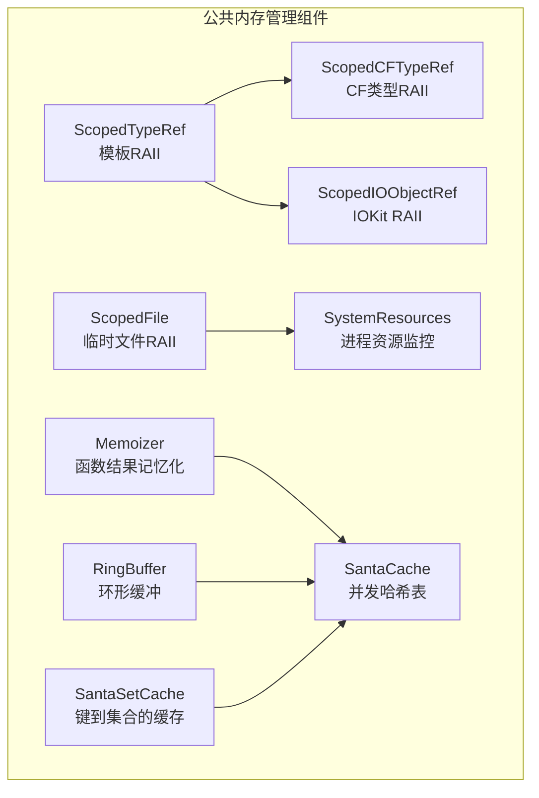
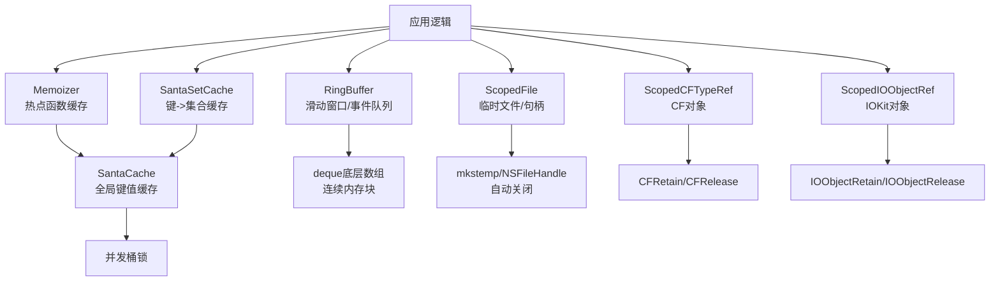
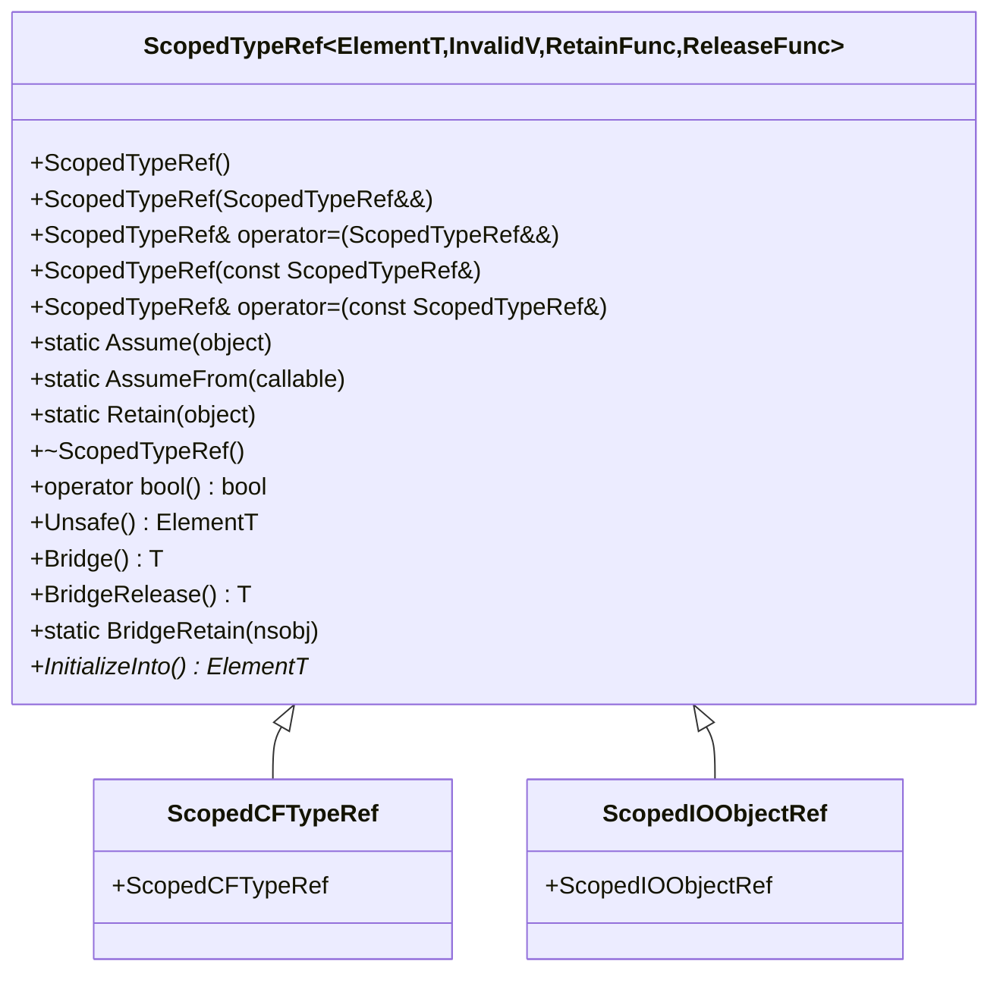
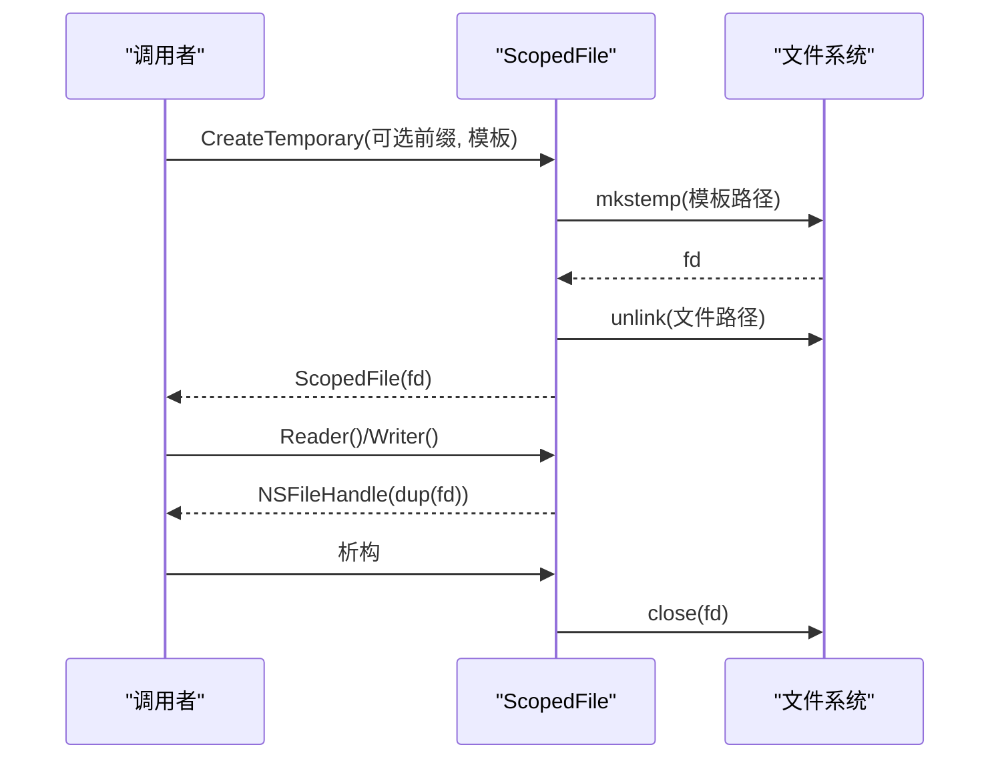
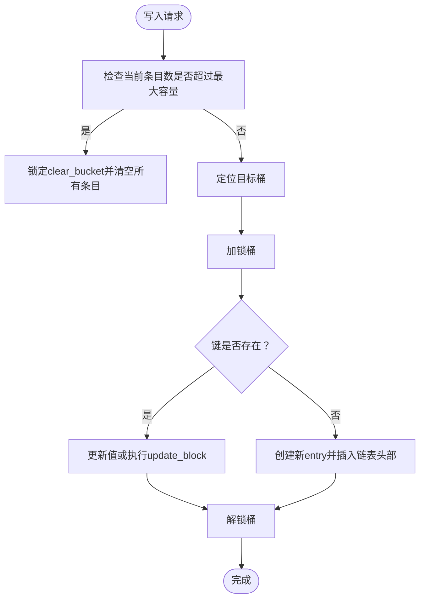
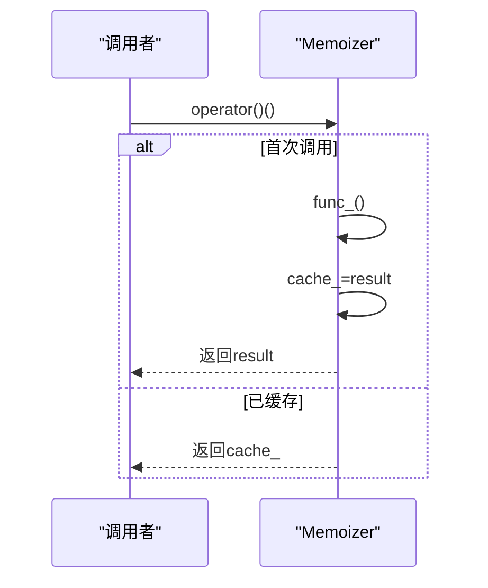
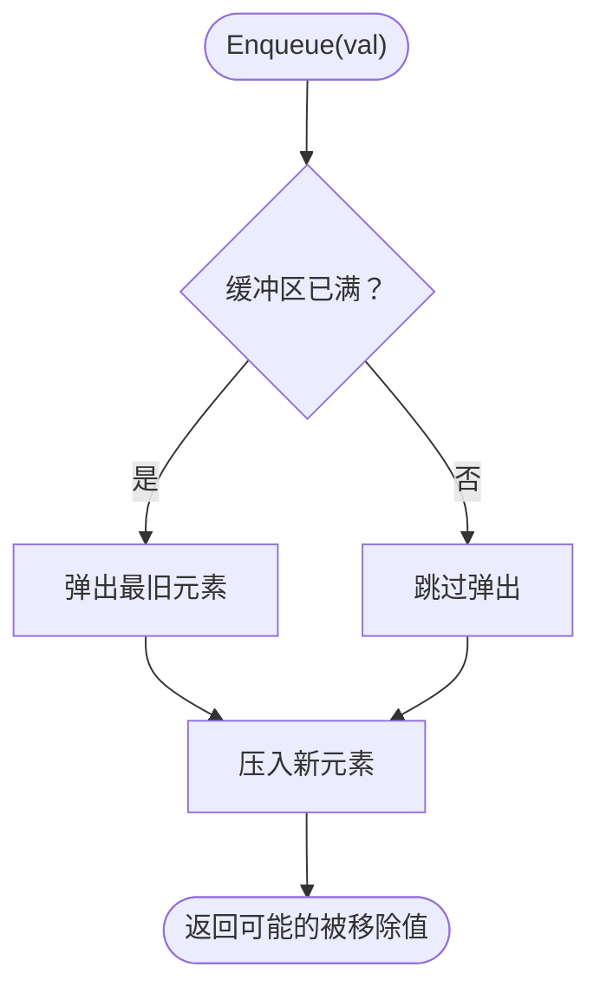
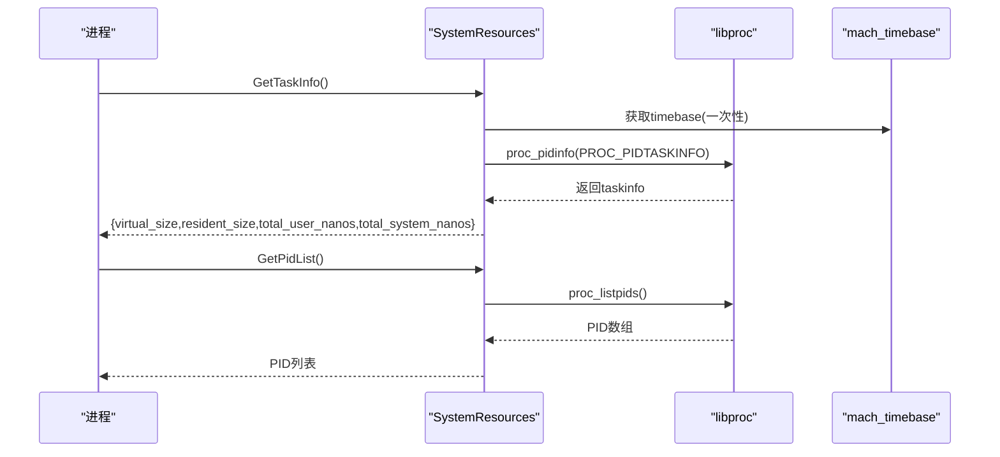
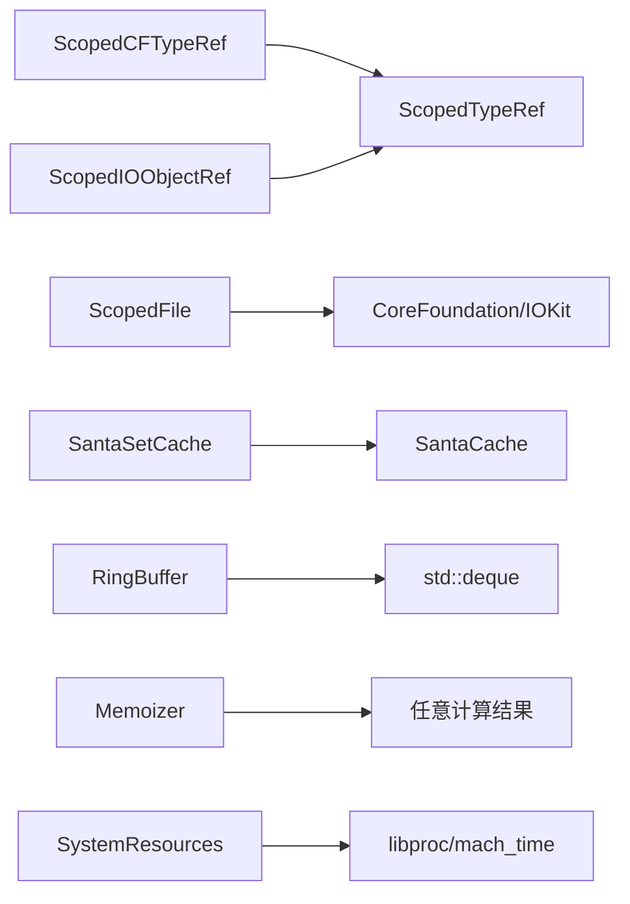

# 内存管理

<cite>
**本文引用的文件**
- [Source/common/ScopedTypeRef.h](file://Source/common/ScopedTypeRef.h)
- [Source/common/ScopedCFTypeRef.h](file://Source/common/ScopedCFTypeRef.h)
- [Source/common/ScopedIOObjectRef.h](file://Source/common/ScopedIOObjectRef.h)
- [Source/common/ScopedFile.h](file://Source/common/ScopedFile.h)
- [Source/common/Memoizer.h](file://Source/common/Memoizer.h)
- [Source/common/RingBuffer.h](file://Source/common/RingBuffer.h)
- [Source/common/SantaCache.h](file://Source/common/SantaCache.h)
- [Source/common/SantaSetCache.h](file://Source/common/SantaSetCache.h)
- [Source/common/SystemResources.h](file://Source/common/SystemResources.h)
- [Source/common/SystemResources.mm](file://Source/common/SystemResources.mm)
- [Source/common/ScopedCFTypeRefTest.mm](file://Source/common/ScopedCFTypeRefTest.mm)
- [Source/common/ScopedFileTest.mm](file://Source/common/ScopedFileTest.mm)
- [Source/common/ScopedIOObjectRefTest.mm](file://Source/common/ScopedIOObjectRefTest.mm)
- [Source/common/RingBufferTest.mm](file://Source/common/RingBufferTest.mm)
</cite>

## 目录
1. [引言](#引言)
2. [项目结构](#项目结构)
3. [核心组件](#核心组件)
4. [架构总览](#架构总览)
5. [详细组件分析](#详细组件分析)
6. [依赖关系分析](#依赖关系分析)
7. [性能考量](#性能考量)
8. [故障排查指南](#故障排查指南)
9. [结论](#结论)
10. [附录](#附录)

## 引言
本指南聚焦Santa项目中的内存管理实践，系统讲解以下主题：
- 智能指针封装（ScopedCFTypeRef、ScopedFile、ScopedIOObjectRef）的RAII设计与内存安全机制
- Memoizer模式的缓存优化策略
- RingBuffer环形缓冲区的高效内存使用与容量淘汰
- 内存泄漏防护、自动资源回收与内存碎片化预防
- 内存使用监控、峰值内存控制与分配优化
- 内存调试工具使用、泄漏检测与性能影响评估
- 大对象处理、内存池技术与跨线程内存安全

## 项目结构
Santa在公共库中提供了统一的内存与资源管理基础设施，主要位于Source/common目录下：
- 模板型RAII智能指针：ScopedTypeRef及其特化（ScopedCFTypeRef、ScopedIOObjectRef）
- 文件句柄RAII：ScopedFile
- 缓存容器：SantaCache、SantaSetCache
- 记忆化缓存：Memoizer
- 环形缓冲：RingBuffer
- 系统资源监控：SystemResources（获取虚拟/驻留内存等指标）

图表来源
- [Source/common/ScopedTypeRef.h](file://Source/common/ScopedTypeRef.h#L1-L153)
- [Source/common/ScopedCFTypeRef.h](file://Source/common/ScopedCFTypeRef.h#L1-L30)
- [Source/common/ScopedIOObjectRef.h](file://Source/common/ScopedIOObjectRef.h#L1-L31)
- [Source/common/ScopedFile.h](file://Source/common/ScopedFile.h#L1-L117)
- [Source/common/Memoizer.h](file://Source/common/Memoizer.h#L1-L55)
- [Source/common/RingBuffer.h](file://Source/common/RingBuffer.h#L1-L117)
- [Source/common/SantaCache.h](file://Source/common/SantaCache.h#L1-L468)
- [Source/common/SantaSetCache.h](file://Source/common/SantaSetCache.h#L1-L133)
- [Source/common/SystemResources.h](file://Source/common/SystemResources.h#L1-L50)

章节来源
- [Source/common/ScopedTypeRef.h](file://Source/common/ScopedTypeRef.h#L1-L153)
- [Source/common/ScopedCFTypeRef.h](file://Source/common/ScopedCFTypeRef.h#L1-L30)
- [Source/common/ScopedIOObjectRef.h](file://Source/common/ScopedIOObjectRef.h#L1-L31)
- [Source/common/ScopedFile.h](file://Source/common/ScopedFile.h#L1-L117)
- [Source/common/Memoizer.h](file://Source/common/Memoizer.h#L1-L55)
- [Source/common/RingBuffer.h](file://Source/common/RingBuffer.h#L1-L117)
- [Source/common/SantaCache.h](file://Source/common/SantaCache.h#L1-L468)
- [Source/common/SantaSetCache.h](file://Source/common/SantaSetCache.h#L1-L133)
- [Source/common/SystemResources.h](file://Source/common/SystemResources.h#L1-L50)

## 核心组件
- ScopedTypeRef：通用RAII模板，通过自定义保留/释放函数实现对任意句柄或对象的自动生命周期管理；提供Assume、Retain、AssumeFrom等所有权转移语义，并支持桥接至ARC对象。
- ScopedCFTypeRef：基于CF类型的特化，封装CFRetain/CFRelease，确保CoreFoundation对象的正确持有与释放。
- ScopedIOObjectRef：基于IOKit对象的特化，封装IOObjectRetain/IOObjectRelease，保障I/O Kit服务对象的生命周期安全。
- ScopedFile：临时文件RAII，负责创建、打开、复制文件描述符并在析构时关闭，避免泄露；提供Reader()/Writer()以安全地获取NSFileHandle。
- Memoizer：无参函数调用的记忆化缓存，避免重复昂贵计算，提升热点路径性能。
- RingBuffer：固定容量的双端队列环形缓冲，满载时自动淘汰最旧元素，适合事件流、日志滑动窗口等场景。
- SantaCache：面向IOKit扩展的并发链表哈希表，按桶加锁，支持容量上限与自动清空，保证高并发下的内存可控性。
- SantaSetCache：键到值集合的缓存，外层为SantaCache，内层集合受单键容量限制，越界则清空该键集合，整体容量超限则清空缓存。
- SystemResources：提供进程虚拟/驻留内存、CPU时间等指标查询接口，便于运行时监控与峰值控制。

章节来源
- [Source/common/ScopedTypeRef.h](file://Source/common/ScopedTypeRef.h#L1-L153)
- [Source/common/ScopedCFTypeRef.h](file://Source/common/ScopedCFTypeRef.h#L1-L30)
- [Source/common/ScopedIOObjectRef.h](file://Source/common/ScopedIOObjectRef.h#L1-L31)
- [Source/common/ScopedFile.h](file://Source/common/ScopedFile.h#L1-L117)
- [Source/common/Memoizer.h](file://Source/common/Memoizer.h#L1-L55)
- [Source/common/RingBuffer.h](file://Source/common/RingBuffer.h#L1-L117)
- [Source/common/SantaCache.h](file://Source/common/SantaCache.h#L1-L468)
- [Source/common/SantaSetCache.h](file://Source/common/SantaSetCache.h#L1-L133)
- [Source/common/SystemResources.h](file://Source/common/SystemResources.h#L1-L50)

## 架构总览
下图展示内存管理关键组件之间的交互关系与职责边界：

图表来源
- [Source/common/Memoizer.h](file://Source/common/Memoizer.h#L1-L55)
- [Source/common/SantaCache.h](file://Source/common/SantaCache.h#L1-L468)
- [Source/common/SantaSetCache.h](file://Source/common/SantaSetCache.h#L1-L133)
- [Source/common/RingBuffer.h](file://Source/common/RingBuffer.h#L1-L117)
- [Source/common/ScopedFile.h](file://Source/common/ScopedFile.h#L1-L117)
- [Source/common/ScopedCFTypeRef.h](file://Source/common/ScopedCFTypeRef.h#L1-L30)
- [Source/common/ScopedIOObjectRef.h](file://Source/common/ScopedIOObjectRef.h#L1-L31)

## 详细组件分析

### RAII智能指针：ScopedTypeRef 及其特化
- 设计要点
  - 通过模板参数注入保留/释放函数，统一管理不同系统的对象生命周期
  - 提供Assume（直接接管所有权）、Retain（显式保留后接管）、AssumeFrom（从出参创建）等语义，避免双重释放或悬挂指针
  - 支持移动构造/赋值与拷贝构造/赋值，拷贝时自动调用保留函数，析构时释放
  - 提供Bridge/BridgeRelease桥接至Objective-C ARC对象，避免重复释放
  - 提供InitializeInto用于“就地初始化”场景，配合pass-by-pointer创建函数
- 内存安全机制
  - 所有权明确且不可共享：移动后源对象失效，拷贝时保留增加引用计数
  - 析构自动释放，防止泄漏；异常路径同样安全
  - 桥接语义避免跨内存模型误释放
- 使用建议
  - 优先使用AssumeFrom处理创建函数的出参
  - 跨语言桥接时谨慎使用BridgeRelease，确保后续不再使用原RAII对象
  - 避免在多线程共享未保护的对象指针

图表来源
- [Source/common/ScopedTypeRef.h](file://Source/common/ScopedTypeRef.h#L1-L153)
- [Source/common/ScopedCFTypeRef.h](file://Source/common/ScopedCFTypeRef.h#L1-L30)
- [Source/common/ScopedIOObjectRef.h](file://Source/common/ScopedIOObjectRef.h#L1-L31)

章节来源
- [Source/common/ScopedTypeRef.h](file://Source/common/ScopedTypeRef.h#L1-L153)
- [Source/common/ScopedCFTypeRef.h](file://Source/common/ScopedCFTypeRef.h#L1-L30)
- [Source/common/ScopedIOObjectRef.h](file://Source/common/ScopedIOObjectRef.h#L1-L31)
- [Source/common/ScopedCFTypeRefTest.mm](file://Source/common/ScopedCFTypeRefTest.mm#L1-L254)
- [Source/common/ScopedIOObjectRefTest.mm](file://Source/common/ScopedIOObjectRefTest.mm#L1-L103)

### 文件句柄RAII：ScopedFile
- 设计要点
  - CreateTemporary支持可选路径前缀与模板名，内部使用mkstemp创建临时文件并立即解链接，避免持久化文件残留
  - Reader()/Writer()返回独立的NSFileHandle，每个句柄dup原始fd并在释放时关闭，确保安全复用
  - 析构时仅关闭底层fd，不删除磁盘文件（因已解链接），避免二次删除错误
  - 提供UnsafeFD访问原始fd，但需谨慎使用，确保生命周期约束
- 内存与资源安全
  - 自动关闭fd，防止句柄泄露
  - 解链接策略避免磁盘空间占用与残留文件
  - 错误路径返回absl::StatusOr，便于上层统一处理
- 使用建议
  - 优先使用Reader()/Writer()进行IO操作，避免直接暴露fd
  - 在需要原生fd的场景，务必确保调用方生命周期短于RAII对象

图表来源
- [Source/common/ScopedFile.h](file://Source/common/ScopedFile.h#L1-L117)

章节来源
- [Source/common/ScopedFile.h](file://Source/common/ScopedFile.h#L1-L117)
- [Source/common/ScopedFileTest.mm](file://Source/common/ScopedFileTest.mm#L1-L73)

### 缓存容器：SantaCache 与 SantaSetCache
- SantaCache
  - 并发哈希表，按桶加锁，桶数量根据最大容量与每桶目标条目数动态计算
  - 容量超限时自动清空所有条目，避免无限增长
  - 提供get/set/update/contains/remove/clear/foreach等操作，支持CAS风格更新
  - 内部entry链表头插，原子计数维护，锁位利用指针低比特
- SantaSetCache
  - 外层键到集合的映射，集合采用flat_hash_set，受per_entry_capacity限制
  - 插入新值时若集合超限先清空再插入，整体超限则清空缓存
  - UnsafeGet返回共享指针，不保证线程安全，仅用于单线程环境
- 内存与性能特性
  - 桶锁降低冲突，提升并发吞吐
  - 清空策略避免碎片化与内存膨胀
  - 集合容量限制防止单键占用过多内存

图表来源
- [Source/common/SantaCache.h](file://Source/common/SantaCache.h#L1-L468)
- [Source/common/SantaSetCache.h](file://Source/common/SantaSetCache.h#L1-L133)

章节来源
- [Source/common/SantaCache.h](file://Source/common/SantaCache.h#L1-L468)
- [Source/common/SantaSetCache.h](file://Source/common/SantaSetCache.h#L1-L133)

### Memoizer模式：函数结果记忆化
- 设计要点
  - 无参函数包装为std::function，首次调用执行并缓存结果
  - 后续调用直接返回缓存值，避免重复昂贵计算
  - cache_标记为mutable以便const对象也能更新缓存
- 内存与性能特性
  - 一次计算，多次复用，显著降低热点路径开销
  - 结果仅在对象生命周期内存在，避免长期驻留
- 使用建议
  - 适用于纯函数或稳定状态下的昂贵计算
  - 避免缓存易变数据或副作用函数

图表来源
- [Source/common/Memoizer.h](file://Source/common/Memoizer.h#L1-L55)

章节来源
- [Source/common/Memoizer.h](file://Source/common/Memoizer.h#L1-L55)

### RingBuffer环形缓冲区：高效内存使用
- 设计要点
  - 基于std::deque实现，固定容量，满载时Enqueue会弹出最旧元素并返回被移除值
  - 提供迭代器支持与安全的erase校验，越界将触发日志与终止
  - Empty/Full/Capacity等状态查询便于上层调度
- 内存与性能特性
  - 连续内存块的循环索引，局部性好，避免频繁重分配
  - 淘汰策略确保内存占用稳定，适合事件流、日志滑窗
- 使用建议
  - 选择合适的容量以平衡内存与信息保留
  - 对id/对象类型，注意ARC生命周期与引用计数

图表来源
- [Source/common/RingBuffer.h](file://Source/common/RingBuffer.h#L1-L117)
- [Source/common/RingBufferTest.mm](file://Source/common/RingBufferTest.mm#L1-L201)

章节来源
- [Source/common/RingBuffer.h](file://Source/common/RingBuffer.h#L1-L117)
- [Source/common/RingBufferTest.mm](file://Source/common/RingBufferTest.mm#L1-L201)

### 系统资源监控：内存使用与峰值控制
- 接口能力
  - 获取当前进程虚拟内存大小与驻留内存大小
  - 获取CPU用户态/内核态累计纳秒时间（通过Mach绝对时间换算）
  - 列举当前系统所有PID，便于批量监控
- 实践建议
  - 将驻留内存作为峰值控制的关键指标，结合SantaCache/SantaSetCache的清空策略，动态调整容量
  - 在关键路径定期采样，发现异常增长及时告警与回退

图表来源
- [Source/common/SystemResources.h](file://Source/common/SystemResources.h#L1-L50)
- [Source/common/SystemResources.mm](file://Source/common/SystemResources.mm#L1-L108)

章节来源
- [Source/common/SystemResources.h](file://Source/common/SystemResources.h#L1-L50)
- [Source/common/SystemResources.mm](file://Source/common/SystemResources.mm#L1-L108)

## 依赖关系分析
- 组件耦合
  - SantaSetCache依赖SantaCache与absl容器，提供键到集合的二级缓存
  - RingBuffer依赖absl日志与标准库容器，提供滑动窗口
  - Memoizer独立于其他缓存组件，可与任何计算结果组合
  - Scoped*系列组件彼此独立，均依赖ScopedTypeRef模板
- 外部依赖
  - CoreFoundation/IOKit用于对象生命周期管理
  - libproc/mach_time用于系统资源查询
  - absl用于哈希、同步与状态表示

图表来源
- [Source/common/ScopedCFTypeRef.h](file://Source/common/ScopedCFTypeRef.h#L1-L30)
- [Source/common/ScopedIOObjectRef.h](file://Source/common/ScopedIOObjectRef.h#L1-L31)
- [Source/common/ScopedFile.h](file://Source/common/ScopedFile.h#L1-L117)
- [Source/common/SantaSetCache.h](file://Source/common/SantaSetCache.h#L1-L133)
- [Source/common/SantaCache.h](file://Source/common/SantaCache.h#L1-L468)
- [Source/common/RingBuffer.h](file://Source/common/RingBuffer.h#L1-L117)
- [Source/common/Memoizer.h](file://Source/common/Memoizer.h#L1-L55)
- [Source/common/SystemResources.h](file://Source/common/SystemResources.h#L1-L50)

章节来源
- [Source/common/ScopedCFTypeRef.h](file://Source/common/ScopedCFTypeRef.h#L1-L30)
- [Source/common/ScopedIOObjectRef.h](file://Source/common/ScopedIOObjectRef.h#L1-L31)
- [Source/common/ScopedFile.h](file://Source/common/ScopedFile.h#L1-L117)
- [Source/common/SantaSetCache.h](file://Source/common/SantaSetCache.h#L1-L133)
- [Source/common/SantaCache.h](file://Source/common/SantaCache.h#L1-L468)
- [Source/common/RingBuffer.h](file://Source/common/RingBuffer.h#L1-L117)
- [Source/common/Memoizer.h](file://Source/common/Memoizer.h#L1-L55)
- [Source/common/SystemResources.h](file://Source/common/SystemResources.h#L1-L50)

## 性能考量
- 缓存策略
  - Memoizer减少重复计算，适合热点函数；注意缓存命中率与内存占用平衡
  - SantaCache/SantaSetCache的桶锁与清空策略在高并发下保持稳定延迟
- 内存占用
  - RingBuffer固定容量，避免动态扩容带来的碎片化
  - SantaCache通过容量上限与清空机制控制峰值内存
- 分配优化
  - Scoped*系列避免手动retain/release错误，减少异常路径下的泄漏风险
  - ScopedFile的解链接策略避免磁盘占用与后续删除成本
- 线程安全
  - SantaCache按桶加锁，降低锁竞争；SantaSetCache的UnsafeGet仅限单线程使用
  - RingBuffer的迭代器校验避免越界导致的未定义行为

[本节为通用指导，无需列出具体文件来源]

## 故障排查指南
- 泄漏检测
  - 使用ScopedFile的Reader()/Writer()确保句柄正确关闭；如出现EBADF，通常意味着重复关闭或提前销毁
  - 对CF/IOKit对象，确认使用ScopedCFTypeRef/ScopedIOObjectRef接管所有权，避免Assume/Retain混用
- 性能影响
  - 若发现缓存命中率低，考虑扩大Memoizer缓存范围或调整SantaCache容量
  - RingBuffer过小会导致频繁淘汰，增大容量或降低写入频率
- 资源监控
  - 使用SystemResources获取驻留内存与CPU时间，结合日志定位峰值时段
  - 发现内存持续增长时，检查SantaCache是否频繁清空或RingBuffer容量设置是否合理

章节来源
- [Source/common/ScopedFileTest.mm](file://Source/common/ScopedFileTest.mm#L1-L73)
- [Source/common/ScopedCFTypeRefTest.mm](file://Source/common/ScopedCFTypeRefTest.mm#L1-L254)
- [Source/common/ScopedIOObjectRefTest.mm](file://Source/common/ScopedIOObjectRefTest.mm#L1-L103)
- [Source/common/RingBufferTest.mm](file://Source/common/RingBufferTest.mm#L1-L201)
- [Source/common/SystemResources.mm](file://Source/common/SystemResources.mm#L1-L108)

## 结论
Santa的内存管理以RAII为核心，辅以缓存与环形缓冲的高效组织方式，形成一套可维护、可扩展且性能稳定的内存治理方案。通过明确的所有权语义、容量控制与系统级监控，能够在复杂系统中有效抑制泄漏、碎片化与峰值内存风险，同时保持良好的运行时性能。

[本节为总结性内容，无需列出具体文件来源]

## 附录
- 最佳实践清单
  - 优先使用Scoped*系列接管外部对象所有权
  - 对昂贵计算使用Memoizer，对热点键值使用SantaCache，对键到集合使用SantaSetCache
  - 使用RingBuffer构建滑动窗口，合理设置容量
  - 定期监控驻留内存，必要时调整缓存容量或清空策略
  - 对需要原生fd的场景谨慎使用UnsafeFD，确保生命周期约束

[本节为通用指导，无需列出具体文件来源]