# 并发控制

<cite>
**本文引用的文件**
- [SNTKVOManager.h](file://Source/common/SNTKVOManager.h)
- [SNTKVOManager.mm](file://Source/common/SNTKVOManager.mm)
- [RateLimiter.h](file://Source/santad/EventProviders/RateLimiter.h)
- [RateLimiter.mm](file://Source/santad/EventProviders/RateLimiter.mm)
- [TemporaryMonitorMode.h](file://Source/santad/TemporaryMonitorMode.h)
- [TemporaryMonitorMode.mm](file://Source/santad/TemporaryMonitorMode.mm)
- [Timer.h](file://Source/common/Timer.h)
- [SNTNotificationQueue.h](file://Source/santad/SNTNotificationQueue.h)
- [SNTNotificationQueue.mm](file://Source/santad/SNTNotificationQueue.mm)
- [Spool.h](file://Source/santad/Logs/EndpointSecurity/Writers/Spool.h)
- [SNTEndpointSecurityClient.mm](file://Source/santad/EventProviders/EndpointSecurity/SNTEndpointSecurityClient.mm)
- [SantaCache.h](file://Source/common/SantaCache.h)
</cite>

## 目录
1. [引言](#引言)
2. [项目结构](#项目结构)
3. [核心组件](#核心组件)
4. [架构总览](#架构总览)
5. [详细组件分析](#详细组件分析)
6. [依赖关系分析](#依赖关系分析)
7. [性能考量](#性能考量)
8. [故障排查指南](#故障排查指南)
9. [结论](#结论)

## 引言
本指南聚焦Santa项目中的并发控制实践，围绕以下主题展开：速率限制器（基于令牌桶思想的窗口计数）的设计与实现；KVO管理器的线程安全与观察者模式优化；临时监控模式在并发场景下的状态同步与定时器协作；锁机制选择、死锁预防与竞态消除策略；线程池与任务调度优化；以及异步回调与事件循环管理。同时给出性能测试、锁争用分析与瓶颈定位的方法建议。

## 项目结构
Santa采用分层与功能域结合的组织方式：
- 公共基础层：通用工具、缓存、定时器、KVO等
- 守护进程层：事件处理、日志写入、通知队列、临时监控模式
- 事件提供层：EndpointSecurity客户端、限速器等

下图展示与并发控制直接相关的关键模块及其交互：

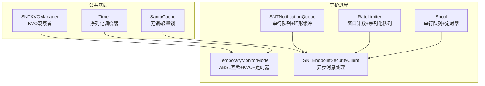

图表来源
- [SNTKVOManager.mm](file://Source/common/SNTKVOManager.mm#L26-L73)
- [Timer.h](file://Source/common/Timer.h#L52-L120)
- [SNTNotificationQueue.mm](file://Source/santad/SNTNotificationQueue.mm#L49-L187)
- [RateLimiter.mm](file://Source/santad/EventProviders/RateLimiter.mm#L30-L106)
- [TemporaryMonitorMode.mm](file://Source/santad/TemporaryMonitorMode.mm#L32-L115)
- [Spool.h](file://Source/santad/Logs/EndpointSecurity/Writers/Spool.h#L45-L64)
- [SNTEndpointSecurityClient.mm](file://Source/santad/EventProviders/EndpointSecurity/SNTEndpointSecurityClient.mm#L279-L310)
- [SantaCache.h](file://Source/common/SantaCache.h#L305-L438)

章节来源
- [SNTKVOManager.h](file://Source/common/SNTKVOManager.h#L17-L34)
- [SNTKVOManager.mm](file://Source/common/SNTKVOManager.mm#L26-L73)
- [RateLimiter.h](file://Source/santad/EventProviders/RateLimiter.h#L31-L77)
- [RateLimiter.mm](file://Source/santad/EventProviders/RateLimiter.mm#L30-L106)
- [TemporaryMonitorMode.h](file://Source/santad/TemporaryMonitorMode.h#L35-L118)
- [TemporaryMonitorMode.mm](file://Source/santad/TemporaryMonitorMode.mm#L32-L115)
- [Timer.h](file://Source/common/Timer.h#L52-L120)
- [SNTNotificationQueue.h](file://Source/santad/SNTNotificationQueue.h#L26-L47)
- [SNTNotificationQueue.mm](file://Source/santad/SNTNotificationQueue.mm#L49-L187)
- [Spool.h](file://Source/santad/Logs/EndpointSecurity/Writers/Spool.h#L45-L64)
- [SNTEndpointSecurityClient.mm](file://Source/santad/EventProviders/EndpointSecurity/SNTEndpointSecurityClient.mm#L279-L310)
- [SantaCache.h](file://Source/common/SantaCache.h#L305-L438)

## 核心组件
- 速率限制器（RateLimiter）
  - 基于“每窗口最大事件数”的限流模型，内部以GCD串行队列保证状态修改原子性，并通过窗口重置时间戳控制周期。
  - 提供运行时动态调整QPS与窗口大小的能力，禁用时退化为无上限。
- KVO管理器（SNTKVOManager）
  - 封装KVO观察生命周期，自动注册/注销，类型校验后回调，避免越界访问。
- 临时监控模式（TemporaryMonitorMode）
  - 使用ABSL互斥保护状态，配合KVO监听配置变化，定时器到期自动结束会话。
- 通知队列（SNTNotificationQueue）
  - 串行队列+环形缓冲，保障UI交互顺序与背压；连接失效时清理未决回调。
- 定时器基类（Timer<T>）
  - CRTP混入模板，统一管理GCD源与调度策略（前导边/后沿边），支持立即触发或等待一周期。
- 日志落盘（Spool<T>）
  - 串行队列+一次性定时器驱动flush任务，避免磁盘写放大。
- 端到端异步处理（SNTEndpointSecurityClient）
  - 异步投递消息至工作队列，按截止时间预算分配计算处理预算，兼顾实时性与稳定性。
- 并发缓存（SantaCache）
  - 按桶分段加锁，利用低位标志位作为自旋锁，减少全局锁竞争。

章节来源
- [RateLimiter.h](file://Source/santad/EventProviders/RateLimiter.h#L31-L77)
- [RateLimiter.mm](file://Source/santad/EventProviders/RateLimiter.mm#L30-L106)
- [SNTKVOManager.h](file://Source/common/SNTKVOManager.h#L17-L34)
- [SNTKVOManager.mm](file://Source/common/SNTKVOManager.mm#L26-L73)
- [TemporaryMonitorMode.h](file://Source/santad/TemporaryMonitorMode.h#L35-L118)
- [TemporaryMonitorMode.mm](file://Source/santad/TemporaryMonitorMode.mm#L32-L115)
- [SNTNotificationQueue.h](file://Source/santad/SNTNotificationQueue.h#L26-L47)
- [SNTNotificationQueue.mm](file://Source/santad/SNTNotificationQueue.mm#L49-L187)
- [Timer.h](file://Source/common/Timer.h#L52-L120)
- [Spool.h](file://Source/santad/Logs/EndpointSecurity/Writers/Spool.h#L45-L64)
- [SNTEndpointSecurityClient.mm](file://Source/santad/EventProviders/EndpointSecurity/SNTEndpointSecurityClient.mm#L279-L310)
- [SantaCache.h](file://Source/common/SantaCache.h#L305-L438)

## 架构总览
下图展示并发控制在系统中的位置与交互路径，突出串行化、互斥与回调封装的协同：

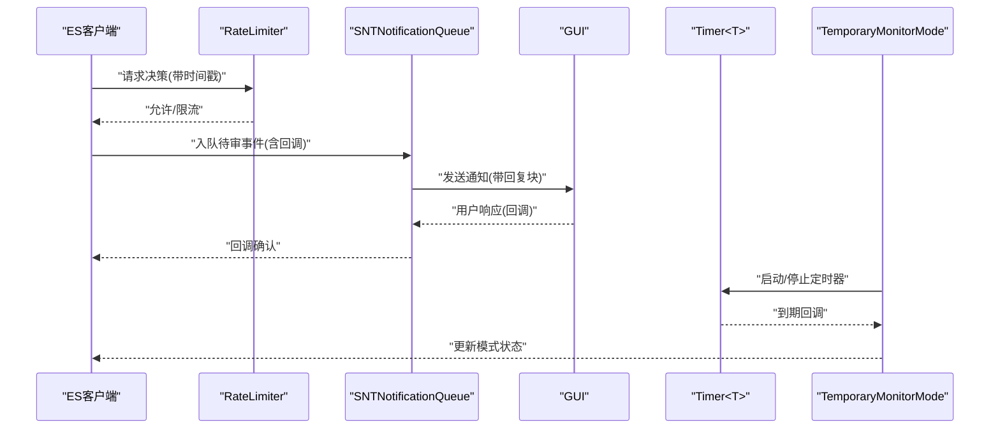

图表来源
- [RateLimiter.mm](file://Source/santad/EventProviders/RateLimiter.mm#L88-L104)
- [SNTNotificationQueue.mm](file://Source/santad/SNTNotificationQueue.mm#L116-L161)
- [Timer.h](file://Source/common/Timer.h#L91-L107)
- [TemporaryMonitorMode.mm](file://Source/santad/TemporaryMonitorMode.mm#L287-L299)

## 详细组件分析

### 速率限制器（RateLimiter）与令牌桶思想
- 设计要点
  - 窗口计数：以固定窗口统计事件总数，超过阈值则限流。
  - 序列化执行：所有设置变更与决策均在串行队列中完成，避免竞态。
  - 动态配置：支持运行时调整QPS与窗口大小，禁用时退化为无上限。
  - 指标上报：窗口重置时统计被丢弃事件数量，便于观测。
- 复杂度
  - 决策与更新均为O(1)，内存占用常数级。
- 关键路径
  - 决策流程：串行队列→重置检查→计数+1→判定→返回结果。
  - 设置流程：串行队列→参数校验与裁剪→更新阈值与重置时间→生效。

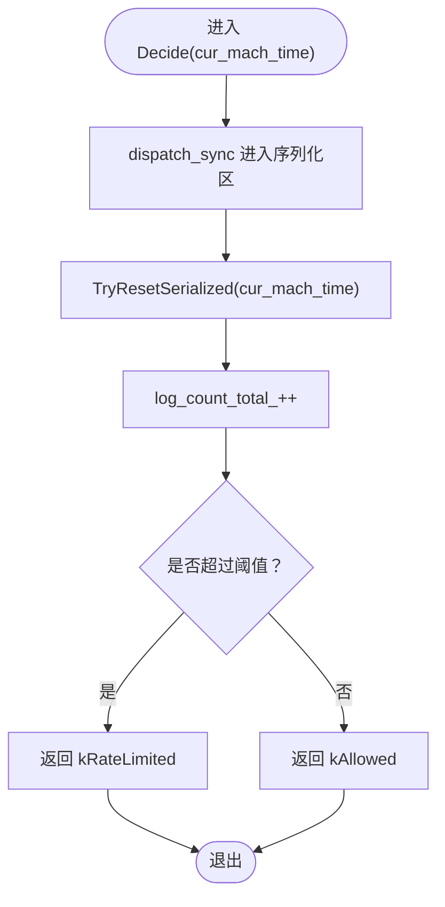

图表来源
- [RateLimiter.mm](file://Source/santad/EventProviders/RateLimiter.mm#L88-L104)
- [RateLimiter.mm](file://Source/santad/EventProviders/RateLimiter.mm#L77-L86)
- [RateLimiter.mm](file://Source/santad/EventProviders/RateLimiter.mm#L65-L75)

章节来源
- [RateLimiter.h](file://Source/santad/EventProviders/RateLimiter.h#L31-L77)
- [RateLimiter.mm](file://Source/santad/EventProviders/RateLimiter.mm#L30-L106)

### KVO管理器（SNTKVOManager）与观察者模式优化
- 设计要点
  - 生命周期绑定：观察者随对象释放自动注销，避免悬挂回调。
  - 类型安全：对新旧值进行类型校验，不匹配时回调传nil，降低崩溃风险。
  - 回调封装：统一使用闭包回调，简化上层调用。
- 并发特性
  - 注册/注销发生在同一对象实例的KVO上下文中，避免跨线程副作用。
  - 上层如需跨线程使用，应通过串行队列转发或弱引用捕获。

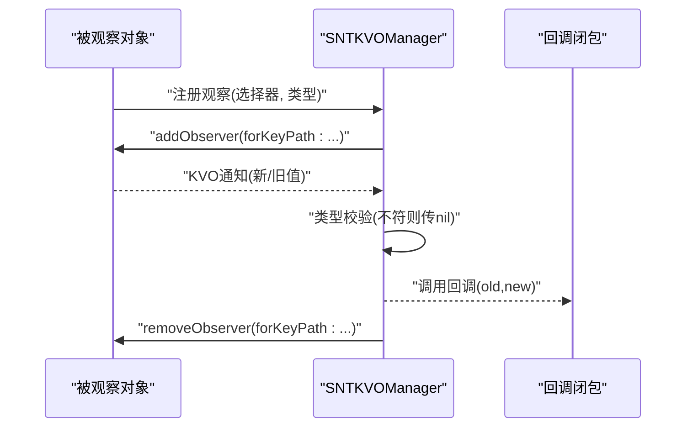

图表来源
- [SNTKVOManager.mm](file://Source/common/SNTKVOManager.mm#L41-L56)
- [SNTKVOManager.mm](file://Source/common/SNTKVOManager.mm#L58-L70)

章节来源
- [SNTKVOManager.h](file://Source/common/SNTKVOManager.h#L17-L34)
- [SNTKVOManager.mm](file://Source/common/SNTKVOManager.mm#L26-L73)

### 临时监控模式（TemporaryMonitorMode）并发与状态同步
- 设计要点
  - 状态保护：使用ABSL互斥保护deadline与session UUID等共享状态。
  - 观察者联动：通过KVO监听配置变化（如同步服务器地址），及时撤销授权。
  - 定时器协作：继承Timer<T>，到期自动结束会话并记录审计事件。
- 关键流程
  - 启动：生成会话UUID，写入持久状态，启动定时器。
  - 取消/撤销：停止定时器，清空状态，记录审计事件。
  - 到期：停止定时器，清空状态，记录过期事件。
  - 查询剩余时间：读取模式下使用读锁，避免写锁阻塞。

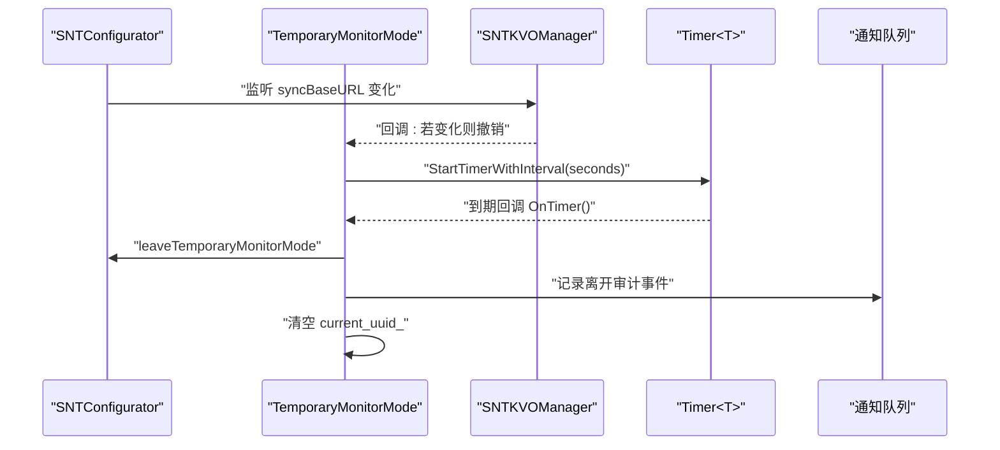

图表来源
- [TemporaryMonitorMode.mm](file://Source/santad/TemporaryMonitorMode.mm#L57-L90)
- [TemporaryMonitorMode.mm](file://Source/santad/TemporaryMonitorMode.mm#L227-L245)
- [TemporaryMonitorMode.mm](file://Source/santad/TemporaryMonitorMode.mm#L247-L258)
- [TemporaryMonitorMode.mm](file://Source/santad/TemporaryMonitorMode.mm#L260-L276)
- [TemporaryMonitorMode.mm](file://Source/santad/TemporaryMonitorMode.mm#L287-L299)
- [Timer.h](file://Source/common/Timer.h#L91-L107)

章节来源
- [TemporaryMonitorMode.h](file://Source/santad/TemporaryMonitorMode.h#L35-L118)
- [TemporaryMonitorMode.mm](file://Source/santad/TemporaryMonitorMode.mm#L32-L115)
- [Timer.h](file://Source/common/Timer.h#L52-L120)

### 通知队列（SNTNotificationQueue）与异步回调
- 设计要点
  - 串行队列：确保入队、出队与回调调用的顺序一致性。
  - 环形缓冲：满载时丢弃最老项，但保留并调用其回调，避免资源泄漏。
  - 连接失效：invalidationHandler中清理未决回调，防止悬挂。
- 异步包装：对UI回调进行包装，收到响应后从sent列表移除，再调用原始回调。

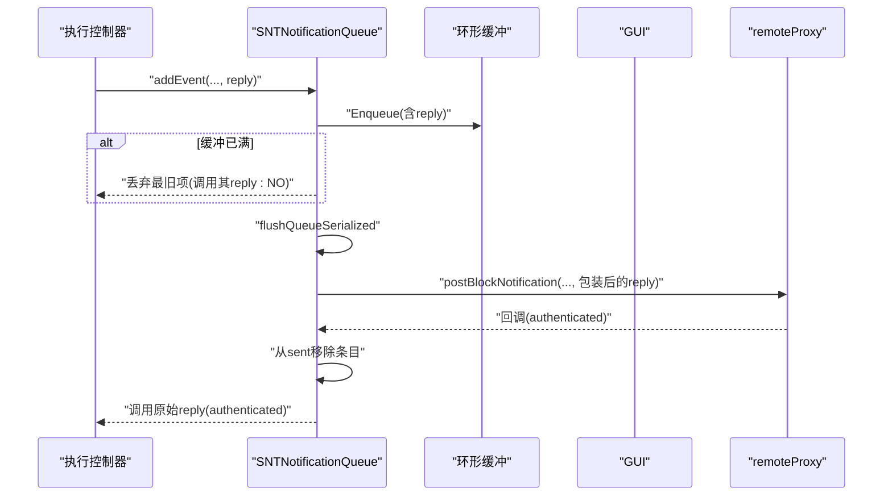

图表来源
- [SNTNotificationQueue.mm](file://Source/santad/SNTNotificationQueue.mm#L50-L88)
- [SNTNotificationQueue.mm](file://Source/santad/SNTNotificationQueue.mm#L116-L161)
- [SNTNotificationQueue.mm](file://Source/santad/SNTNotificationQueue.mm#L163-L180)

章节来源
- [SNTNotificationQueue.h](file://Source/santad/SNTNotificationQueue.h#L26-L47)
- [SNTNotificationQueue.mm](file://Source/santad/SNTNotificationQueue.mm#L49-L187)

### 定时器基类（Timer<T>）与调度策略
- 设计要点
  - CRTP混入：派生类必须实现bool OnTimer()，避免虚函数开销。
  - 两种调度模式：
    - 前导边（Leading Edge）：先重启，再回调，适合周期性任务。
    - 后沿边（Trailing Edge）：先回调，再根据返回值决定是否重启，适合“仅一次”或延迟重入。
  - 串行队列：Start/Stop/Set/IsStarted均通过dispatch_sync在内部队列执行，避免竞态。
- 参数约束：区间[min,max]内钳制，非法值记录告警并裁剪。

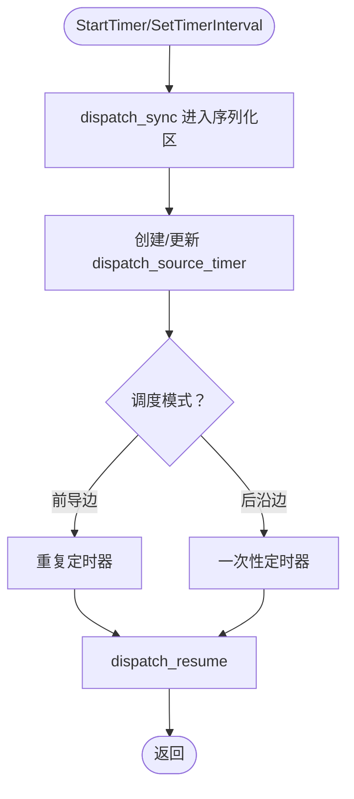

图表来源
- [Timer.h](file://Source/common/Timer.h#L73-L120)
- [Timer.h](file://Source/common/Timer.h#L154-L202)

章节来源
- [Timer.h](file://Source/common/Timer.h#L52-L120)

### 日志落盘（Spool<T>）与背压
- 设计要点
  - 串行队列：所有flush任务在独立队列执行，避免与主线程竞争。
  - 一次性定时器：按毫秒级超时触发flush，降低写放大。
  - 批处理：由外部批处理器聚合事件，Spool负责触发与提交。

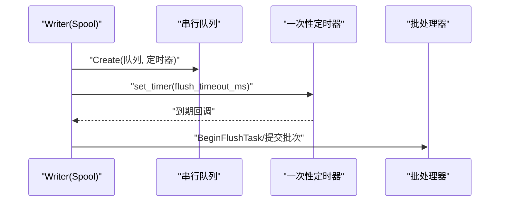

图表来源
- [Spool.h](file://Source/santad/Logs/EndpointSecurity/Writers/Spool.h#L45-L64)

章节来源
- [Spool.h](file://Source/santad/Logs/EndpointSecurity/Writers/Spool.h#L45-L64)

### 端到端异步处理（SNTEndpointSecurityClient）与预算分配
- 设计要点
  - 异步投递：将消息投递到notify队列，避免阻塞事件接收线程。
  - 预算计算：根据截止时间与默认预算比例计算可用处理时间，预留紧急响应头寸。
  - 类型约束：仅处理授权类消息，非授权消息视为编程错误并记录异常。

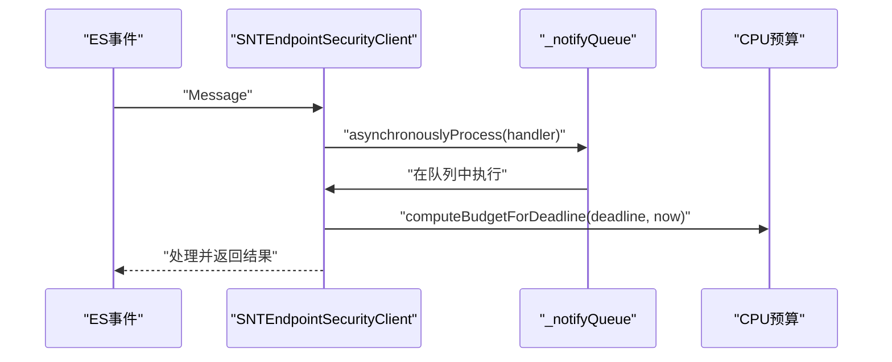

图表来源
- [SNTEndpointSecurityClient.mm](file://Source/santad/EventProviders/EndpointSecurity/SNTEndpointSecurityClient.mm#L279-L310)

章节来源
- [SNTEndpointSecurityClient.mm](file://Source/santad/EventProviders/EndpointSecurity/SNTEndpointSecurityClient.mm#L279-L310)

### 并发缓存（SantaCache）与锁策略
- 设计要点
  - 分桶自旋锁：每个桶使用低位标志位作为自旋锁，减少全局锁争用。
  - 清空保护：当容量即将溢出时，先获取“清空专用锁”，避免长时间持锁。
  - CAS风格更新：支持以“旧值匹配”为条件的更新，实现无锁更新语义。
- 复杂度
  - 访问/插入摊还接近O(1)，受桶数影响；遍历全表需O(N)。

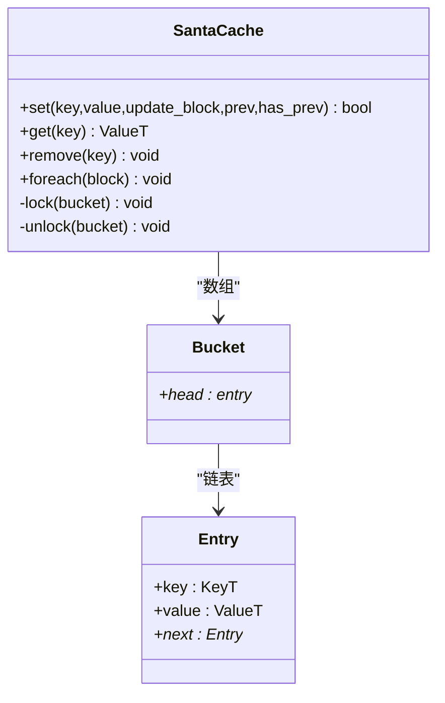

图表来源
- [SantaCache.h](file://Source/common/SantaCache.h#L305-L438)

章节来源
- [SantaCache.h](file://Source/common/SantaCache.h#L305-L438)

## 依赖关系分析
- 组件耦合
  - TemporaryMonitorMode依赖Timer<T>与SNTKVOManager，形成“状态+定时+观察”的组合。
  - SNTNotificationQueue与XPC连接解耦，通过invalidationHandler清理未决回调。
  - RateLimiter与Metrics解耦，仅在窗口重置时上报指标。
- 外部依赖
  - GCD串行队列与dispatch_source_timer用于调度与背压。
  - ABSL互斥用于细粒度状态保护。
  - Foundation/KVO用于配置观察。

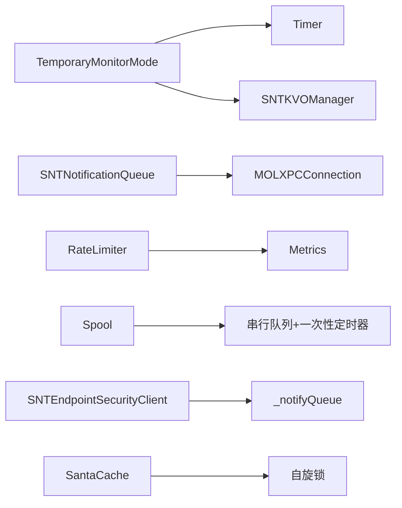

图表来源
- [TemporaryMonitorMode.h](file://Source/santad/TemporaryMonitorMode.h#L35-L118)
- [Timer.h](file://Source/common/Timer.h#L52-L120)
- [SNTKVOManager.h](file://Source/common/SNTKVOManager.h#L17-L34)
- [SNTNotificationQueue.h](file://Source/santad/SNTNotificationQueue.h#L26-L47)
- [RateLimiter.h](file://Source/santad/EventProviders/RateLimiter.h#L31-L77)
- [Spool.h](file://Source/santad/Logs/EndpointSecurity/Writers/Spool.h#L45-L64)
- [SNTEndpointSecurityClient.mm](file://Source/santad/EventProviders/EndpointSecurity/SNTEndpointSecurityClient.mm#L279-L310)
- [SantaCache.h](file://Source/common/SantaCache.h#L305-L438)

章节来源
- [TemporaryMonitorMode.mm](file://Source/santad/TemporaryMonitorMode.mm#L32-L115)
- [SNTNotificationQueue.mm](file://Source/santad/SNTNotificationQueue.mm#L163-L180)
- [RateLimiter.mm](file://Source/santad/EventProviders/RateLimiter.mm#L30-L106)
- [Spool.h](file://Source/santad/Logs/EndpointSecurity/Writers/Spool.h#L45-L64)
- [SNTEndpointSecurityClient.mm](file://Source/santad/EventProviders/EndpointSecurity/SNTEndpointSecurityClient.mm#L279-L310)
- [SantaCache.h](file://Source/common/SantaCache.h#L305-L438)

## 性能考量
- 锁与争用
  - RateLimiter与SNTNotificationQueue均采用串行队列，避免锁争用，适合高并发入队/出队场景。
  - TemporaryMonitorMode使用ABSL互斥保护关键字段，读多写少场景可考虑读写分离或RCU。
  - SantaCache采用分桶自旋锁，显著降低全局锁竞争，适合高吞吐查找/插入。
- 背压与批处理
  - 通知队列满载时丢弃最旧项但保留回调，避免阻塞生产者；建议上层限流或降级策略。
  - Spool以一次性定时器驱动flush，避免频繁小批量写入。
- 实时性
  - RateLimiter决策与设置均在串行队列执行，保证正确性；若存在热点路径，可考虑拆分队列或引入本地缓存。
  - ES客户端按截止时间预算分配处理时间，兼顾实时性与稳定性。

[本节为通用指导，无需列出具体文件来源]

## 故障排查指南
- 限流异常
  - 现象：短时间内大量事件被丢弃。
  - 排查：检查窗口大小与QPS设置；确认窗口重置逻辑是否正常触发；查看指标上报。
  - 参考路径
    - [RateLimiter.mm](file://Source/santad/EventProviders/RateLimiter.mm#L77-L86)
    - [RateLimiter.mm](file://Source/santad/EventProviders/RateLimiter.mm#L88-L104)
- 通知未达或回调未触发
  - 现象：UI无弹窗或回调未调用。
  - 排查：确认XPC连接有效性；检查invalidationHandler是否被触发；查看环形缓冲是否满载导致最旧项被丢弃。
  - 参考路径
    - [SNTNotificationQueue.mm](file://Source/santad/SNTNotificationQueue.mm#L163-L180)
    - [SNTNotificationQueue.mm](file://Source/santad/SNTNotificationQueue.mm#L116-L161)
- 临时监控模式未按时结束
  - 现象：会话超时未自动结束。
  - 排查：确认定时器是否启动/停止；检查OnTimer回调是否被调用；核对deadline与当前时间换算。
  - 参考路径
    - [Timer.h](file://Source/common/Timer.h#L91-L107)
    - [TemporaryMonitorMode.mm](file://Source/santad/TemporaryMonitorMode.mm#L287-L299)
- KVO回调未触发
  - 现象：配置变化未生效。
  - 排查：确认选择器是否存在；检查类型校验是否通过；确认对象生命周期。
  - 参考路径
    - [SNTKVOManager.mm](file://Source/common/SNTKVOManager.mm#L35-L50)
    - [SNTKVOManager.mm](file://Source/common/SNTKVOManager.mm#L58-L70)
- 缓存命中率低
  - 现象：热点数据频繁重建。
  - 排查：检查桶数与负载分布；评估是否需要扩容或调整哈希策略；关注clear触发频率。
  - 参考路径
    - [SantaCache.h](file://Source/common/SantaCache.h#L305-L438)

章节来源
- [RateLimiter.mm](file://Source/santad/EventProviders/RateLimiter.mm#L77-L104)
- [SNTNotificationQueue.mm](file://Source/santad/SNTNotificationQueue.mm#L116-L180)
- [Timer.h](file://Source/common/Timer.h#L91-L107)
- [TemporaryMonitorMode.mm](file://Source/santad/TemporaryMonitorMode.mm#L287-L299)
- [SNTKVOManager.mm](file://Source/common/SNTKVOManager.mm#L35-L70)
- [SantaCache.h](file://Source/common/SantaCache.h#L305-L438)

## 结论
Santa的并发控制以“串行化+细粒度锁+观察者/定时器”为核心，既保证了正确性与可观测性，又兼顾了性能与可维护性。速率限制器采用窗口计数模型，KVO管理器强化了观察者生命周期安全，临时监控模式通过ABSL互斥与定时器实现了可靠的会话管理。通知队列、日志落盘与缓存等组件分别在不同层面提供了背压与隔离能力。建议在高负载场景下进一步细化锁粒度与队列分区，并完善指标采集与告警体系，以持续优化系统稳定性与吞吐。