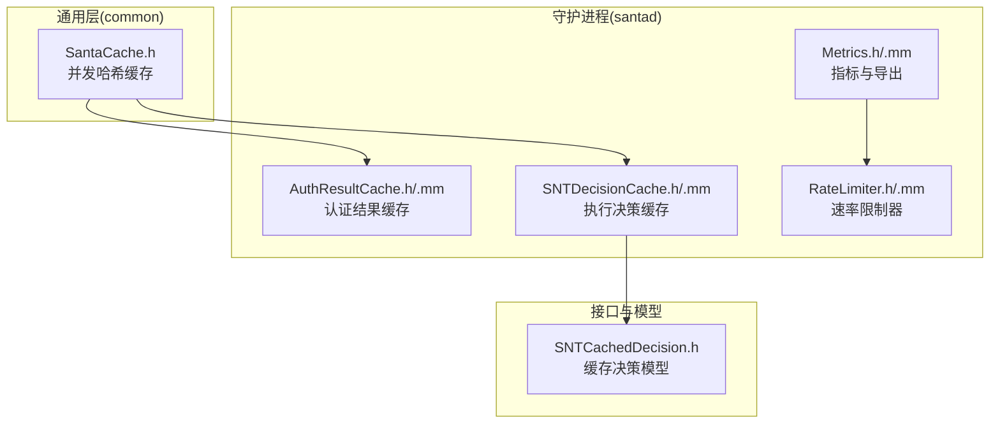
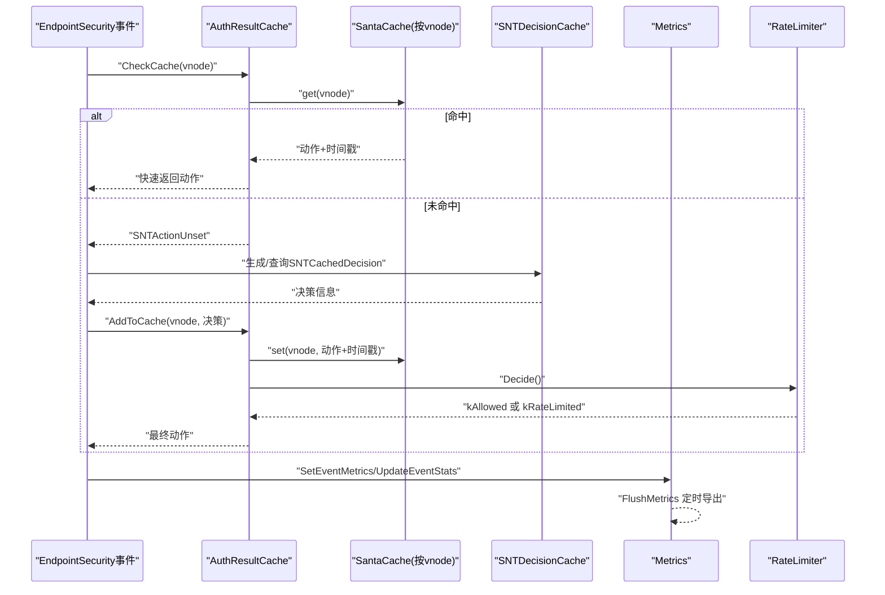
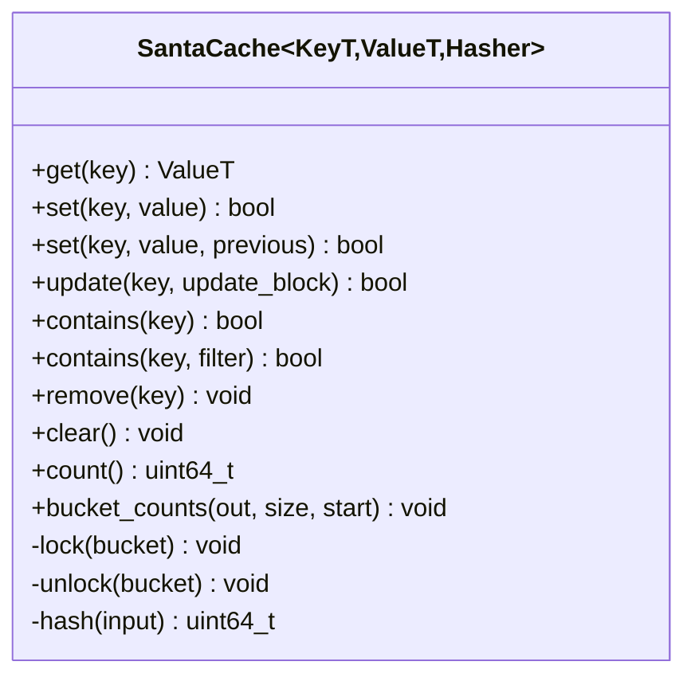
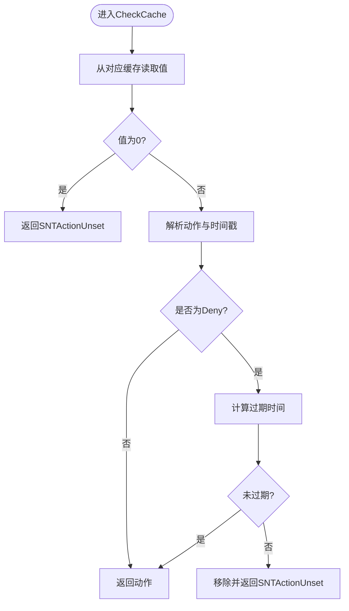
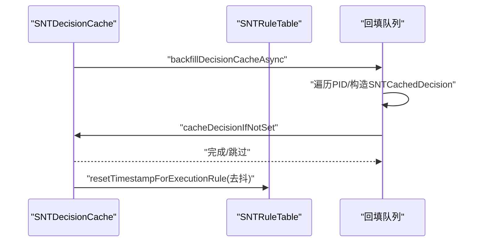
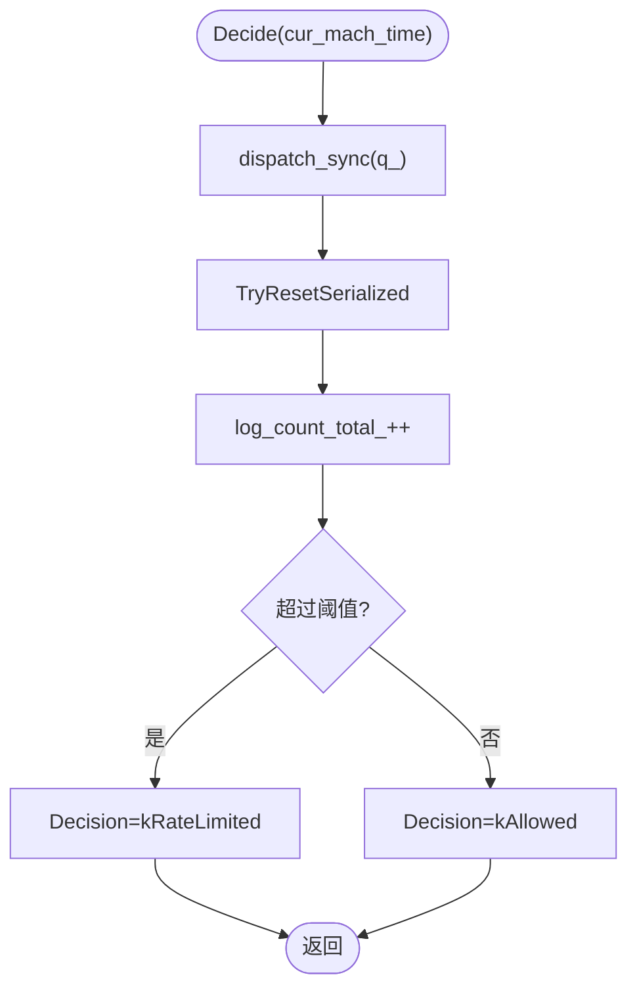
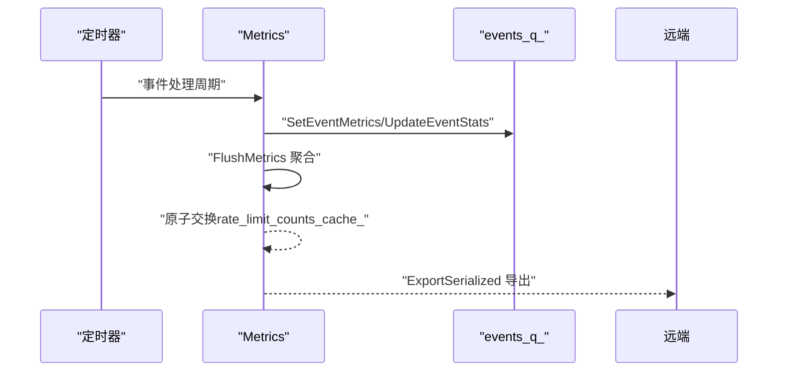
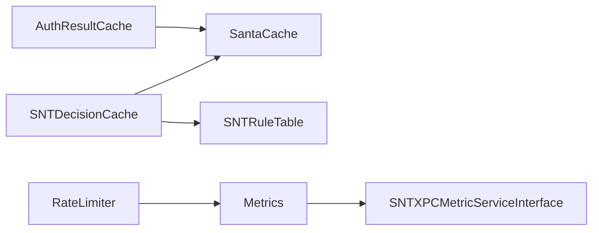

# 性能优化

<cite>
**本文引用的文件**
- [Source/common/SantaCache.h](file://Source/common/SantaCache.h)
- [Source/santad/SNTDecisionCache.h](file://Source/santad/SNTDecisionCache.h)
- [Source/santad/SNTDecisionCache.mm](file://Source/santad/SNTDecisionCache.mm)
- [Source/santad/EventProviders/AuthResultCache.h](file://Source/santad/EventProviders/AuthResultCache.h)
- [Source/santad/EventProviders/AuthResultCache.mm](file://Source/santad/EventProviders/AuthResultCache.mm)
- [Source/santad/EventProviders/RateLimiter.h](file://Source/santad/EventProviders/RateLimiter.h)
- [Source/santad/EventProviders/RateLimiter.mm](file://Source/santad/EventProviders/RateLimiter.mm)
- [Source/santad/Metrics.h](file://Source/santad/Metrics.h)
- [Source/santad/Metrics.mm](file://Source/santad/Metrics.mm)
- [Source/common/SNTCachedDecision.h](file://Source/common/SNTCachedDecision.h)
- [Source/common/SantaCacheTest.mm](file://Source/common/SantaCacheTest.mm)
- [Source/santad/SNTDecisionCacheTest.mm](file://Source/santad/SNTDecisionCacheTest.mm)
</cite>

## 目录
1. [引言](#引言)
2. [项目结构](#项目结构)
3. [核心组件](#核心组件)
4. [架构总览](#架构总览)
5. [详细组件分析](#详细组件分析)
6. [依赖关系分析](#依赖关系分析)
7. [性能考量](#性能考量)
8. [故障排查指南](#故障排查指南)
9. [结论](#结论)
10. [附录](#附录)

## 引言
本指南聚焦Santa在macOS上的性能优化，围绕缓存策略设计、内存管理优化、磁盘I/O调优、并发控制与资源竞争处理、限流器设计、性能监控与瓶颈识别、大规模部署的扩展性与资源使用优化、缓存失效与内存泄漏防护、以及性能基准与容量规划方法展开。文档以代码为依据，结合架构图与流程图，帮助读者系统理解并实践性能优化。

## 项目结构
Santa由多个子模块组成：通用工具层（common）、守护进程（santad）、命令行工具（santactl）、指标服务（santametricservice）与同步服务（santasyncservice）。与性能优化直接相关的核心位于santad中的事件提供者、决策缓存、指标与限流组件；通用层提供高性能并发哈希缓存SantaCache。

**图表来源**
- [Source/common/SantaCache.h](file://Source/common/SantaCache.h#L48-L120)
- [Source/santad/EventProviders/AuthResultCache.h](file://Source/santad/EventProviders/AuthResultCache.h#L50-L98)
- [Source/santad/EventProviders/AuthResultCache.mm](file://Source/santad/EventProviders/AuthResultCache.mm#L111-L175)
- [Source/santad/SNTDecisionCache.h](file://Source/santad/SNTDecisionCache.h#L23-L35)
- [Source/santad/SNTDecisionCache.mm](file://Source/santad/SNTDecisionCache.mm#L45-L90)
- [Source/santad/EventProviders/RateLimiter.h](file://Source/santad/EventProviders/RateLimiter.h#L31-L77)
- [Source/santad/EventProviders/RateLimiter.mm](file://Source/santad/EventProviders/RateLimiter.mm#L25-L63)
- [Source/santad/Metrics.h](file://Source/santad/Metrics.h#L69-L141)
- [Source/santad/Metrics.mm](file://Source/santad/Metrics.mm#L216-L267)
- [Source/common/SNTCachedDecision.h](file://Source/common/SNTCachedDecision.h#L23-L61)

**章节来源**
- [Source/common/SantaCache.h](file://Source/common/SantaCache.h#L48-L120)
- [Source/santad/EventProviders/AuthResultCache.h](file://Source/santad/EventProviders/AuthResultCache.h#L50-L98)
- [Source/santad/SNTDecisionCache.h](file://Source/santad/SNTDecisionCache.h#L23-L35)
- [Source/santad/EventProviders/RateLimiter.h](file://Source/santad/EventProviders/RateLimiter.h#L31-L77)
- [Source/santad/Metrics.h](file://Source/santad/Metrics.h#L69-L141)

## 核心组件
- 并发哈希缓存SantaCache：基于桶锁的链表哈希表，支持按桶锁定、容量上限触发全清空、CAS更新、遍历与统计等能力，是认证结果缓存与执行决策缓存的基础。
- 认证结果缓存AuthResultCache：按根文件系统与非根文件系统分两个缓存实例，存储vnid到动作与时间戳的组合值，支持过期淘汰与批量失效。
- 执行决策缓存SNTDecisionCache：以vnode为键缓存SNTCachedDecision对象，支持回填、时间戳重置与数据库规则更新。
- 速率限制器RateLimiter：基于窗口计数的串行化限流，支持动态调整QPS与窗口大小，并向指标系统上报被限流事件数。
- 指标系统Metrics：定时聚合事件计数、处理时延、丢弃计数与FAA日志计数，通过XPC导出至指标服务，支持序列号跟踪丢弃。

**章节来源**
- [Source/common/SantaCache.h](file://Source/common/SantaCache.h#L305-L463)
- [Source/santad/EventProviders/AuthResultCache.h](file://Source/santad/EventProviders/AuthResultCache.h#L50-L98)
- [Source/santad/EventProviders/AuthResultCache.mm](file://Source/santad/EventProviders/AuthResultCache.mm#L111-L175)
- [Source/santad/SNTDecisionCache.h](file://Source/santad/SNTDecisionCache.h#L23-L35)
- [Source/santad/SNTDecisionCache.mm](file://Source/santad/SNTDecisionCache.mm#L45-L90)
- [Source/santad/EventProviders/RateLimiter.h](file://Source/santad/EventProviders/RateLimiter.h#L31-L77)
- [Source/santad/EventProviders/RateLimiter.mm](file://Source/santad/EventProviders/RateLimiter.mm#L25-L63)
- [Source/santad/Metrics.h](file://Source/santad/Metrics.h#L69-L141)
- [Source/santad/Metrics.mm](file://Source/santad/Metrics.mm#L319-L382)

## 架构总览
下图展示认证路径中缓存与限流的关键交互，以及指标导出流程。

**图表来源**
- [Source/santad/EventProviders/AuthResultCache.mm](file://Source/santad/EventProviders/AuthResultCache.mm#L148-L171)
- [Source/common/SantaCache.h](file://Source/common/SantaCache.h#L81-L118)
- [Source/santad/SNTDecisionCache.mm](file://Source/santad/SNTDecisionCache.mm#L73-L112)
- [Source/santad/EventProviders/RateLimiter.mm](file://Source/santad/EventProviders/RateLimiter.mm#L88-L104)
- [Source/santad/Metrics.mm](file://Source/santad/Metrics.mm#L319-L382)

## 详细组件分析

### 并发哈希缓存 SantaCache
- 设计要点
  - 每桶独立锁，降低热点冲突；桶数量按“最大容量/每桶目标”计算并向上取整为2的幂，保证哈希分布均匀。
  - 支持容量上限，超过后自动清空所有桶，避免内存膨胀；提供CAS语义的set(prev)与update回调，保障原子更新。
  - 提供foreach、contains、clear与bucket_counts等工具，便于诊断与运维。
- 复杂度与性能
  - 查找/插入/删除期望O(1)，最坏O(n)退化到单链表；通过桶数与哈希函数设计降低退化概率。
  - 桶锁提升并发度，但极端情况下仍可能出现锁争用；可通过合理设置per_bucket与max_size平衡吞吐与内存。
- 内存管理
  - 使用new/delete分配条目，clear时释放链表；注意避免长生命周期持有大对象导致碎片化。
- 关键路径参考
  - 初始化与桶数计算：[SantaCache.h](file://Source/common/SantaCache.h#L60-L71)
  - get/set/update/contains/clear：[SantaCache.h](file://Source/common/SantaCache.h#L81-L257)
  - 锁实现与哈希：[SantaCache.h](file://Source/common/SantaCache.h#L418-L463)

**图表来源**
- [Source/common/SantaCache.h](file://Source/common/SantaCache.h#L81-L257)
- [Source/common/SantaCache.h](file://Source/common/SantaCache.h#L418-L463)

**章节来源**
- [Source/common/SantaCache.h](file://Source/common/SantaCache.h#L60-L118)
- [Source/common/SantaCache.h](file://Source/common/SantaCache.h#L119-L257)
- [Source/common/SantaCache.h](file://Source/common/SantaCache.h#L418-L463)
- [Source/common/SantaCacheTest.mm](file://Source/common/SantaCacheTest.mm#L139-L168)

### 认证结果缓存 AuthResultCache
- 设计要点
  - 按根文件系统与非根文件系统分别维护两套SantaCache<SantaVnode, uint64_t>，减少跨设备缓存污染。
  - 将动作与时间戳打包存储，deny动作带过期时间，过期后自动移除，避免规则变更后的长期误判。
  - 提供FlushCache按模式与原因清理缓存，并异步通知ES客户端清理其本地缓存。
- 过期与失效策略
  - deny结果缓存默认约1500ms，兼顾及时生效与高并发下的缓存命中率。
  - 规则变化、客户端模式切换、挂载卸载等场景触发清理，确保一致性。
- 并发与队列
  - 使用串行队列保护内部状态，避免竞态；清理ES缓存异步执行，防止死锁。
- 关键路径参考
  - 创建与队列初始化：[AuthResultCache.mm](file://Source/santad/EventProviders/AuthResultCache.mm#L87-L104)
  - 添加/移除/检查缓存：[AuthResultCache.mm](file://Source/santad/EventProviders/AuthResultCache.mm#L111-L171)
  - 缓存分片与计数：[AuthResultCache.mm](file://Source/santad/EventProviders/AuthResultCache.mm#L173-L175)
  - 清理与指标上报：[AuthResultCache.mm](file://Source/santad/EventProviders/AuthResultCache.mm#L177-L197)

**图表来源**
- [Source/santad/EventProviders/AuthResultCache.mm](file://Source/santad/EventProviders/AuthResultCache.mm#L148-L171)

**章节来源**
- [Source/santad/EventProviders/AuthResultCache.h](file://Source/santad/EventProviders/AuthResultCache.h#L50-L98)
- [Source/santad/EventProviders/AuthResultCache.mm](file://Source/santad/EventProviders/AuthResultCache.mm#L87-L104)
- [Source/santad/EventProviders/AuthResultCache.mm](file://Source/santad/EventProviders/AuthResultCache.mm#L111-L171)
- [Source/santad/EventProviders/AuthResultCache.mm](file://Source/santad/EventProviders/AuthResultCache.mm#L177-L197)

### 执行决策缓存 SNTDecisionCache
- 设计要点
  - 以vnode为键缓存SNTCachedDecision对象，支持回填（backfill）预热，利用进程快照填充缓存，降低首次决策开销。
  - 对transitive允许规则的执行时间戳进行去抖更新，避免频繁写库。
  - 提供forget与resetTimestamp等操作，便于失效与审计。
- 回填策略
  - 在后台队列扫描运行中的PID，构造SNTCachedDecision并尝试无覆盖插入，避免与实时决策冲突。
- 关键路径参考
  - 单例与队列初始化：[SNTDecisionCache.mm](file://Source/santad/SNTDecisionCache.mm#L45-L71)
  - 缓存写入与查询：[SNTDecisionCache.mm](file://Source/santad/SNTDecisionCache.mm#L73-L87)
  - 时间戳重置与规则更新：[SNTDecisionCache.mm](file://Source/santad/SNTDecisionCache.mm#L93-L112)
  - 异步回填与去抖：[SNTDecisionCache.mm](file://Source/santad/SNTDecisionCache.mm#L114-L205)

**图表来源**
- [Source/santad/SNTDecisionCache.mm](file://Source/santad/SNTDecisionCache.mm#L114-L205)
- [Source/santad/SNTDecisionCache.mm](file://Source/santad/SNTDecisionCache.mm#L93-L112)

**章节来源**
- [Source/santad/SNTDecisionCache.h](file://Source/santad/SNTDecisionCache.h#L23-L35)
- [Source/santad/SNTDecisionCache.mm](file://Source/santad/SNTDecisionCache.mm#L45-L112)
- [Source/santad/SNTDecisionCache.mm](file://Source/santad/SNTDecisionCache.mm#L114-L205)
- [Source/common/SNTCachedDecision.h](file://Source/common/SNTCachedDecision.h#L23-L61)
- [Source/santad/SNTDecisionCacheTest.mm](file://Source/santad/SNTDecisionCacheTest.mm#L55-L101)

### 速率限制器 RateLimiter
- 设计要点
  - 基于固定窗口的计数器，支持动态修改QPS与窗口大小；当超出阈值时标记为限流。
  - 通过串行队列保证线程安全；周期性导出被限流事件数到指标系统。
- 关键路径参考
  - 创建与队列初始化：[RateLimiter.mm](file://Source/santad/EventProviders/RateLimiter.mm#L25-L38)
  - 设置与重置逻辑：[RateLimiter.mm](file://Source/santad/EventProviders/RateLimiter.mm#L40-L57)
  - 决策与导出：[RateLimiter.mm](file://Source/santad/EventProviders/RateLimiter.mm#L88-L104)

**图表来源**
- [Source/santad/EventProviders/RateLimiter.mm](file://Source/santad/EventProviders/RateLimiter.mm#L88-L104)

**章节来源**
- [Source/santad/EventProviders/RateLimiter.h](file://Source/santad/EventProviders/RateLimiter.h#L31-L77)
- [Source/santad/EventProviders/RateLimiter.mm](file://Source/santad/EventProviders/RateLimiter.mm#L25-L63)
- [Source/santad/EventProviders/RateLimiter.mm](file://Source/santad/EventProviders/RateLimiter.mm#L88-L104)

### 指标系统 Metrics
- 设计要点
  - 定时器驱动的导出周期可配置；事件计数、处理时延、丢弃计数与FAA日志计数分别聚合。
  - 使用独立events_q_队列收集事件指标，避免导出阻塞；采用原子交换方式上报限流计数。
  - 通过序列号差值检测丢包并累计drops，保留序列号以便持续追踪。
- 关键路径参考
  - 创建与定时器：[Metrics.mm](file://Source/santad/Metrics.mm#L216-L267)
  - 导出与刷新：[Metrics.mm](file://Source/santad/Metrics.mm#L319-L382)
  - 事件统计与丢弃检测：[Metrics.mm](file://Source/santad/Metrics.mm#L422-L464)

**图表来源**
- [Source/santad/Metrics.mm](file://Source/santad/Metrics.mm#L216-L267)
- [Source/santad/Metrics.mm](file://Source/santad/Metrics.mm#L319-L382)
- [Source/santad/Metrics.mm](file://Source/santad/Metrics.mm#L422-L464)

**章节来源**
- [Source/santad/Metrics.h](file://Source/santad/Metrics.h#L69-L141)
- [Source/santad/Metrics.mm](file://Source/santad/Metrics.mm#L216-L267)
- [Source/santad/Metrics.mm](file://Source/santad/Metrics.mm#L319-L382)
- [Source/santad/Metrics.mm](file://Source/santad/Metrics.mm#L422-L464)

## 依赖关系分析
- 组件耦合
  - AuthResultCache依赖SantaCache与EndpointSecurityAPI；SNTDecisionCache依赖SantaCache与数据库层；RateLimiter依赖Metrics；Metrics依赖SNTMetricSet与XPC接口。
- 并发与锁
  - SantaCache采用桶级锁；AuthResultCache与RateLimiter使用串行队列；Metrics使用双队列分离采集与导出。
- 外部集成
  - 指标导出经由SNTXPCMetricServiceInterface连接指标服务；ES缓存清理通过ES客户端异步触发。

**图表来源**
- [Source/santad/EventProviders/AuthResultCache.h](file://Source/santad/EventProviders/AuthResultCache.h#L50-L98)
- [Source/santad/SNTDecisionCache.h](file://Source/santad/SNTDecisionCache.h#L23-L35)
- [Source/santad/EventProviders/RateLimiter.h](file://Source/santad/EventProviders/RateLimiter.h#L31-L77)
- [Source/santad/Metrics.h](file://Source/santad/Metrics.h#L69-L141)

**章节来源**
- [Source/santad/EventProviders/AuthResultCache.h](file://Source/santad/EventProviders/AuthResultCache.h#L50-L98)
- [Source/santad/SNTDecisionCache.h](file://Source/santad/SNTDecisionCache.h#L23-L35)
- [Source/santad/EventProviders/RateLimiter.h](file://Source/santad/EventProviders/RateLimiter.h#L31-L77)
- [Source/santad/Metrics.h](file://Source/santad/Metrics.h#L69-L141)

## 性能考量
- 缓存策略设计
  - 认证结果缓存：按根/非根分片，deny动作带过期时间，命中率高且能快速响应规则变化。
  - 执行决策缓存：回填预热降低冷启动成本；对transitive规则写库去抖，减少I/O压力。
  - SantaCache：桶数与每桶目标值影响分布均匀性与内存占用，需结合业务量调参。
- 内存管理优化
  - 避免在缓存中存放大对象或长生命周期容器；利用update回调原地修改，减少拷贝。
  - clear回调可用于释放自定义资源；注意避免在锁内做昂贵操作。
- 磁盘I/O调优
  - 规则与事件落盘前尽量批量化；回填仅做只读扫描，不写库；对规则时间戳更新加去抖。
  - 指标导出周期可调，避免高频写入；必要时启用压缩或增量导出（如仓库中存在相关组件）。
- 并发控制与资源竞争
  - 桶锁与串行队列配合使用，优先降低锁粒度；对ES缓存清理采用异步，避免阻塞主路径。
  - 限流器与指标系统使用独立队列，避免相互阻塞。
- 限流器设计
  - 固定窗口计数器简单高效；若需要更平滑的曲线可考虑滑动窗口或令牌桶（当前实现注释已提出改进建议）。
  - 可根据事件类型与处理器动态调整QPS，当前实现支持通过配置接口扩展。
- 性能监控指标
  - 事件计数、处理时延、丢弃计数、FAA日志计数、限流计数；序列号用于丢包检测。
  - 建议新增：缓存命中率、桶分布标准差、队列长度、CPU/内存/文件描述符使用率。
- 大规模部署的扩展性
  - 分片缓存与桶锁提升并发；指标导出周期与批量大小可调；ES客户端清理异步化。
  - 建议引入多级缓存（如LRU）与预热策略；对热点文件建立预热任务。
- 缓存失效策略与内存泄漏防护
  - 明确失效原因分类（规则变更、模式切换、挂载卸载等），避免过度清理。
  - 定期巡检缓存大小与桶分布，发现异常升高时触发主动清理；对对象缓存使用智能指针与弱引用。
- 性能基准与容量规划
  - 基准：在不同per_bucket与max_size组合下测量命中率、延迟与内存占用；评估回填耗时与峰值内存。
  - 压力：模拟高并发执行与规则频繁变更场景，观察限流触发频率与丢包情况。
  - 容量：基于峰值QPS与窗口大小估算瞬时内存需求，预留20%-50%冗余。

[本节为通用指导，无需列出具体文件来源]

## 故障排查指南
- 缓存异常
  - 命中率骤降：检查是否达到max_size触发全清；核对桶分布标准差是否过大；确认是否存在大量规则变更导致频繁失效。
  - 数据不一致：确认FlushCache原因列表是否包含预期项；检查ES缓存清理是否异步成功。
- 指标异常
  - 丢包增多：查看UpdateEventStats输出的drops计数；核对定时器是否正常运行；检查导出队列是否拥塞。
  - 限流过多：调整logs_per_sec与window_size_sec；观察rate_limit_counts增长趋势。
- 内存问题
  - 内存上涨：检查clear回调是否正确释放自定义对象；避免在缓存中保存大集合；关注回填过程中的临时对象。
- 并发问题
  - 死锁风险：确认ES缓存清理在串行队列中异步执行；避免在锁内调用外部阻塞接口。
- 测试验证
  - 使用单元测试覆盖并发set/get、CAS、foreach、clear等路径，确保边界条件正确。

**章节来源**
- [Source/common/SantaCacheTest.mm](file://Source/common/SantaCacheTest.mm#L139-L168)
- [Source/santad/SNTDecisionCacheTest.mm](file://Source/santad/SNTDecisionCacheTest.mm#L55-L101)
- [Source/santad/Metrics.mm](file://Source/santad/Metrics.mm#L422-L464)
- [Source/santad/EventProviders/AuthResultCache.mm](file://Source/santad/EventProviders/AuthResultCache.mm#L177-L197)

## 结论
Santa的性能优化围绕“高并发缓存+串行化限流+指标可观测”的主线展开。通过分片缓存、桶锁与串行队列降低争用，借助限流器与指标系统实现流量治理与可观测性，辅以回填预热与去抖写库等手段优化I/O与延迟。在大规模部署中，应结合容量规划与基准测试持续调优参数，确保稳定性与吞吐的平衡。

[本节为总结，无需列出具体文件来源]

## 附录
- 关键实现路径速查
  - SantaCache初始化与桶数计算：[SantaCache.h](file://Source/common/SantaCache.h#L60-L71)
  - AuthResultCache添加/检查/清理：[AuthResultCache.mm](file://Source/santad/EventProviders/AuthResultCache.mm#L111-L197)
  - SNTDecisionCache回填与去抖：[SNTDecisionCache.mm](file://Source/santad/SNTDecisionCache.mm#L114-L205)
  - RateLimiter决策与导出：[RateLimiter.mm](file://Source/santad/EventProviders/RateLimiter.mm#L88-L104)
  - Metrics导出与丢包检测：[Metrics.mm](file://Source/santad/Metrics.mm#L319-L382)

[本节为补充索引，无需列出具体文件来源]