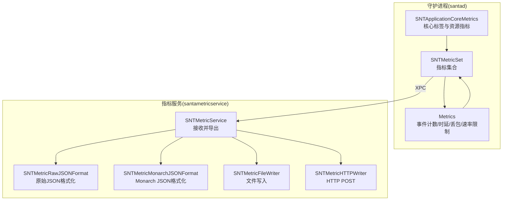
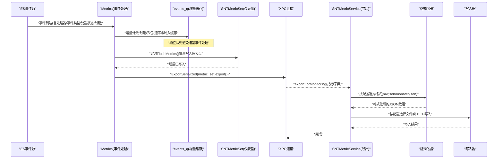
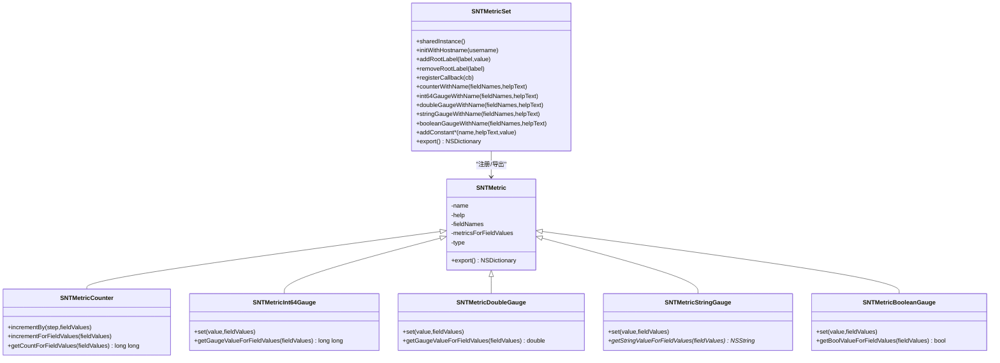
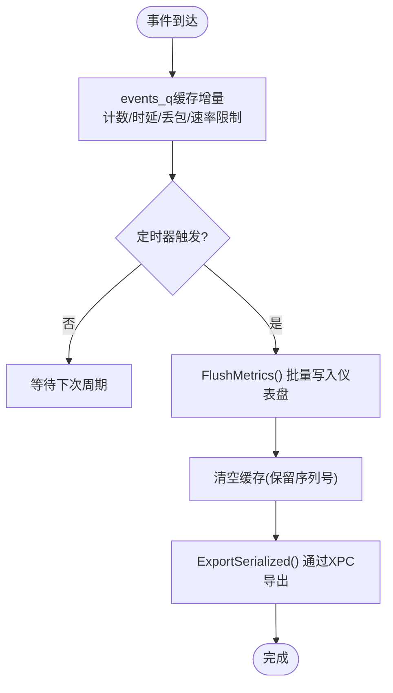
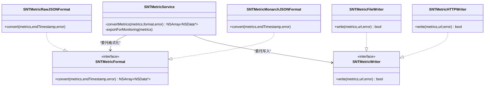
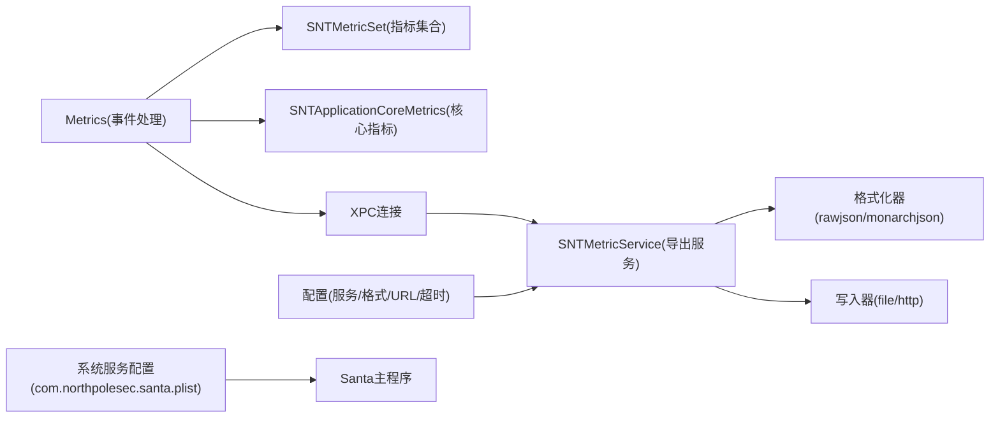

# 性能监控

<cite>
**本文引用的文件**
- [SNTMetricSet.h](file://Source/common/SNTMetricSet.h)
- [SNTMetricSet.mm](file://Source/common/SNTMetricSet.mm)
- [Metrics.h](file://Source/santad/Metrics.h)
- [Metrics.mm](file://Source/santad/Metrics.mm)
- [SNTApplicationCoreMetrics.h](file://Source/santad/SNTApplicationCoreMetrics.h)
- [SNTApplicationCoreMetrics.mm](file://Source/santad/SNTApplicationCoreMetrics.mm)
- [SNTMetricService.h](file://Source/santametricservice/SNTMetricService.h)
- [SNTMetricService.mm](file://Source/santametricservice/SNTMetricService.mm)
- [SNTMetricMonarchJSONFormat.h](file://Source/santametricservice/Formats/SNTMetricMonarchJSONFormat.h)
- [SNTMetricMonarchJSONFormat.mm](file://Source/santametricservice/Formats/SNTMetricMonarchJSONFormat.mm)
- [SNTMetricRawJSONFormat.h](file://Source/santametricservice/Formats/SNTMetricRawJSONFormat.h)
- [SNTMetricRawJSONFormat.mm](file://Source/santametricservice/Formats/SNTMetricRawJSONFormat.mm)
- [SNTMetricFileWriter.h](file://Source/santametricservice/Writers/SNTMetricFileWriter.h)
- [SNTMetricFileWriter.mm](file://Source/santametricservice/Writers/SNTMetricFileWriter.mm)
- [SNTMetricHTTPWriter.h](file://Source/santametricservice/Writers/SNTMetricHTTPWriter.h)
- [SNTMetricHTTPWriter.mm](file://Source/santametricservice/Writers/SNTMetricHTTPWriter.mm)
- [com.northpolesec.santa.plist](file://Conf/com.northpolesec.santa.plist)
</cite>

## 目录
1. [简介](#简介)
2. [项目结构](#项目结构)
3. [核心组件](#核心组件)
4. [架构总览](#架构总览)
5. [详细组件分析](#详细组件分析)
6. [依赖关系分析](#依赖关系分析)
7. [性能考量](#性能考量)
8. [故障排查指南](#故障排查指南)
9. [结论](#结论)
10. [附录](#附录)

## 简介
本文件面向Santa项目的性能监控体系，系统性阐述指标采集机制、核心应用指标与格式化输出、性能计数器设计、采样频率控制与数据聚合策略，并覆盖指标导出格式（原始JSON与Monarch JSON）、实时监控与历史数据分析、性能基线建立、异常检测与趋势分析方法、关键性能指标（KPI）定义与阈值设定、告警机制、分布式监控与多节点汇总、性能报告生成、性能测试工具使用、基准测试方法与容量规划指导。

## 项目结构
Santa的性能监控由三部分组成：
- 指标定义与采集：在守护进程侧通过统一的指标集合类进行注册与更新。
- 指标聚合与导出：定时周期性地将增量指标聚合到指标集合，并通过XPC发送至指标服务。
- 指标服务与输出：指标服务根据配置选择格式化器与写入器，将指标写入文件或HTTP端点。

图表来源
- [Metrics.mm](file://Source/santad/Metrics.mm#L216-L267)
- [SNTMetricService.mm](file://Source/santametricservice/SNTMetricService.mm#L94-L129)
- [SNTMetricMonarchJSONFormat.mm](file://Source/santametricservice/Formats/SNTMetricMonarchJSONFormat.mm#L205-L249)
- [SNTMetricRawJSONFormat.mm](file://Source/santametricservice/Formats/SNTMetricRawJSONFormat.mm#L52-L107)
- [SNTMetricFileWriter.mm](file://Source/santametricservice/Writers/SNTMetricFileWriter.mm#L39-L72)
- [SNTMetricHTTPWriter.mm](file://Source/santametricservice/Writers/SNTMetricHTTPWriter.mm#L54-L119)

章节来源
- [Metrics.mm](file://Source/santad/Metrics.mm#L216-L267)
- [SNTMetricService.mm](file://Source/santametricservice/SNTMetricService.mm#L94-L129)

## 核心组件
- 指标集合与类型
  - 统一的指标容器，支持常量、整型/双精度/字符串/布尔仪表盘与计数器。
  - 支持字段维度（fieldNames）与按字段值分组存储。
  - 提供导出为字典的能力，并在导出前执行回调以刷新动态指标。
- 事件处理与指标
  - 基于Endpoint Security事件流，统计各处理器对各类事件的处理次数、处理时延、丢包数与速率限制数。
  - 使用独立队列缓存增量指标，定时批量刷新到仪表盘。
- 应用核心指标
  - 注册运行模式、日志类型、主机名/用户名/服务名等根标签。
  - 注册内存（虚拟/驻留）与CPU（用户/内核）使用率等系统资源指标。
- 指标服务与格式化
  - 根据配置选择格式化器（原始JSON或Monarch JSON），并选择写入器（文件或HTTP）。
  - 对时间戳进行标准化，确保可序列化与可观测系统兼容。

章节来源
- [SNTMetricSet.h](file://Source/common/SNTMetricSet.h#L37-L203)
- [SNTMetricSet.mm](file://Source/common/SNTMetricSet.mm#L434-L668)
- [Metrics.h](file://Source/santad/Metrics.h#L69-L142)
- [Metrics.mm](file://Source/santad/Metrics.mm#L319-L480)
- [SNTApplicationCoreMetrics.mm](file://Source/santad/SNTApplicationCoreMetrics.mm#L118-L175)
- [SNTMetricService.mm](file://Source/santametricservice/SNTMetricService.mm#L67-L129)

## 架构总览
下图展示从事件采集到指标导出的关键交互流程：

图表来源
- [Metrics.mm](file://Source/santad/Metrics.mm#L319-L382)
- [SNTMetricService.mm](file://Source/santametricservice/SNTMetricService.mm#L94-L129)
- [SNTMetricMonarchJSONFormat.mm](file://Source/santametricservice/Formats/SNTMetricMonarchJSONFormat.mm#L205-L249)
- [SNTMetricRawJSONFormat.mm](file://Source/santametricservice/Formats/SNTMetricRawJSONFormat.mm#L52-L107)
- [SNTMetricFileWriter.mm](file://Source/santametricservice/Writers/SNTMetricFileWriter.mm#L39-L72)
- [SNTMetricHTTPWriter.mm](file://Source/santametricservice/Writers/SNTMetricHTTPWriter.mm#L54-L119)

## 详细组件分析

### 指标集合与计数器设计
- 类型与字段
  - 支持常量与仪表盘（布尔/字符串/整型/双精度）以及计数器。
  - 字段维度用于多维分组，如“处理器/事件/处置状态”。
- 并发与一致性
  - 指标值内部使用同步块保护；导出前触发回调以刷新动态指标。
  - 导出时复制根标签与指标映射，保证序列化安全。
- 时间戳与标准化
  - 指标值记录创建与最后更新时间；导出时可转换为ISO8601字符串，便于外部系统解析。

图表来源
- [SNTMetricSet.h](file://Source/common/SNTMetricSet.h#L37-L203)
- [SNTMetricSet.mm](file://Source/common/SNTMetricSet.mm#L182-L292)

章节来源
- [SNTMetricSet.h](file://Source/common/SNTMetricSet.h#L37-L203)
- [SNTMetricSet.mm](file://Source/common/SNTMetricSet.mm#L182-L292)

### 事件处理与性能计数器
- 计数器与仪表盘
  - 事件计数：按“处理器/事件/处置状态”分组计数。
  - 处理时延：按“处理器/事件”记录最近一次时延（纳秒）。
  - 丢包计数：基于序列号差值计算事件级与全局丢包。
  - 速率限制计数：记录FAA事件被速率限制的数量。
  - 文件访问授权日志计数：按“策略版本/操作类型/规则/状态/操作/决策”分组。
- 缓存与批量刷新
  - 使用独立队列缓存增量，定时批量写入仪表盘，降低锁竞争与上下文切换。
- 采样频率控制
  - 通过定时器源设置导出周期，支持运行中动态调整。

图表来源
- [Metrics.mm](file://Source/santad/Metrics.mm#L324-L382)
- [Metrics.mm](file://Source/santad/Metrics.mm#L384-L421)

章节来源
- [Metrics.h](file://Source/santad/Metrics.h#L69-L142)
- [Metrics.mm](file://Source/santad/Metrics.mm#L319-L480)

### 应用核心指标与根标签
- 根标签
  - 主机名、用户名、作业名、服务名；支持从配置注入额外标签。
- 运行态指标
  - 模式（监控/仅观察/强制执行）、日志类型（syslog/文件/protobuf等）。
- 资源指标
  - 虚拟内存、驻留内存、CPU用户态/内核态时间（秒）。
- 版本与启动时间
  - 构建版本、进程启动时间（微秒）。

章节来源
- [SNTApplicationCoreMetrics.mm](file://Source/santad/SNTApplicationCoreMetrics.mm#L118-L175)

### 指标导出格式与写入
- 格式化
  - 原始JSON：直接规范化日期并序列化。
  - Monarch JSON：将指标类型映射为流类型（仪表盘/累积），并按字段描述编码。
- 写入
  - 文件写入：逐条JSON对象换行追加。
  - HTTP写入：按配置超时与TLS策略POST到目标URL，逐条发送并聚合错误。

图表来源
- [SNTMetricService.mm](file://Source/santametricservice/SNTMetricService.mm#L67-L129)
- [SNTMetricMonarchJSONFormat.h](file://Source/santametricservice/Formats/SNTMetricMonarchJSONFormat.h#L15-L21)
- [SNTMetricMonarchJSONFormat.mm](file://Source/santametricservice/Formats/SNTMetricMonarchJSONFormat.mm#L156-L249)
- [SNTMetricRawJSONFormat.h](file://Source/santametricservice/Formats/SNTMetricRawJSONFormat.h#L15-L21)
- [SNTMetricRawJSONFormat.mm](file://Source/santametricservice/Formats/SNTMetricRawJSONFormat.mm#L52-L107)
- [SNTMetricFileWriter.h](file://Source/santametricservice/Writers/SNTMetricFileWriter.h#L14-L18)
- [SNTMetricFileWriter.mm](file://Source/santametricservice/Writers/SNTMetricFileWriter.mm#L39-L72)
- [SNTMetricHTTPWriter.h](file://Source/santametricservice/Writers/SNTMetricHTTPWriter.h#L15-L21)
- [SNTMetricHTTPWriter.mm](file://Source/santametricservice/Writers/SNTMetricHTTPWriter.mm#L54-L119)

章节来源
- [SNTMetricService.mm](file://Source/santametricservice/SNTMetricService.mm#L67-L129)
- [SNTMetricMonarchJSONFormat.mm](file://Source/santametricservice/Formats/SNTMetricMonarchJSONFormat.mm#L156-L249)
- [SNTMetricRawJSONFormat.mm](file://Source/santametricservice/Formats/SNTMetricRawJSONFormat.mm#L52-L107)
- [SNTMetricFileWriter.mm](file://Source/santametricservice/Writers/SNTMetricFileWriter.mm#L39-L72)
- [SNTMetricHTTPWriter.mm](file://Source/santametricservice/Writers/SNTMetricHTTPWriter.mm#L54-L119)

## 依赖关系分析
- 守护进程侧
  - Metrics依赖SNTMetricSet进行指标注册与导出；依赖SNTApplicationCoreMetrics注册核心标签与资源指标；通过XPC连接与指标服务通信。
- 指标服务侧
  - 依据配置选择格式化器与写入器；格式化器依赖SNTMetricSet导出结构；写入器依赖配置器与认证会话。
- 配置与启动
  - 系统服务配置文件负责加载Santa主程序，指标服务作为独立组件随守护进程运行。

图表来源
- [Metrics.mm](file://Source/santad/Metrics.mm#L216-L267)
- [SNTApplicationCoreMetrics.mm](file://Source/santad/SNTApplicationCoreMetrics.mm#L169-L175)
- [SNTMetricService.mm](file://Source/santametricservice/SNTMetricService.mm#L94-L129)
- [com.northpolesec.santa.plist](file://Conf/com.northpolesec.santa.plist#L1-L22)

章节来源
- [Metrics.mm](file://Source/santad/Metrics.mm#L216-L267)
- [SNTMetricService.mm](file://Source/santametricservice/SNTMetricService.mm#L94-L129)
- [com.northpolesec.santa.plist](file://Conf/com.northpolesec.santa.plist#L1-L22)

## 性能考量
- 采样与导出频率
  - 通过定时器源设置导出周期，支持运行中动态调整，避免频繁导出带来的抖动。
- 增量聚合与锁粒度
  - 事件侧使用独立队列缓存增量，减少对主事件处理路径的影响；导出时一次性批量写入仪表盘，降低锁竞争。
- 时间戳标准化
  - 导出前将日期标准化为ISO8601字符串，提升跨系统解析一致性与可观测性。
- 写入可靠性
  - HTTP写入逐条发送并聚合错误，便于定位单条失败；文件写入采用追加与权限控制，保障持久化安全。
- 资源指标
  - CPU与内存指标按回调周期更新，建议结合导出周期进行权衡，避免过高的更新频率影响性能。

章节来源
- [Metrics.mm](file://Source/santad/Metrics.mm#L384-L421)
- [SNTMetricSet.mm](file://Source/common/SNTMetricSet.mm#L606-L668)
- [SNTMetricHTTPWriter.mm](file://Source/santametricservice/Writers/SNTMetricHTTPWriter.mm#L54-L119)
- [SNTMetricFileWriter.mm](file://Source/santametricservice/Writers/SNTMetricFileWriter.mm#L39-L72)
- [SNTApplicationCoreMetrics.mm](file://Source/santad/SNTApplicationCoreMetrics.mm#L82-L117)

## 故障排查指南
- 导出未生效
  - 检查是否启用指标导出配置；确认格式化器与写入器可用；查看服务日志中的错误信息。
- HTTP写入失败
  - 关注返回的状态码与错误描述；检查目标URL可达性、TLS版本要求与超时设置。
- 文件写入失败
  - 检查URL是否为文件URL、文件句柄打开是否成功、权限是否正确。
- 丢包检测
  - 查看事件处理侧的日志输出，确认事件级与全局丢包计数是否增长；结合处理器与事件类型定位瓶颈。
- 指标不更新
  - 确认回调是否注册；检查导出周期是否被暂停；验证仪表盘导出逻辑是否正常。

章节来源
- [SNTMetricService.mm](file://Source/santametricservice/SNTMetricService.mm#L94-L129)
- [SNTMetricHTTPWriter.mm](file://Source/santametricservice/Writers/SNTMetricHTTPWriter.mm#L91-L116)
- [SNTMetricFileWriter.mm](file://Source/santametricservice/Writers/SNTMetricFileWriter.mm#L41-L69)
- [Metrics.mm](file://Source/santad/Metrics.mm#L422-L464)

## 结论
Santa的性能监控体系以统一的指标集合为核心，围绕事件处理侧的计数器与仪表盘、应用核心指标与根标签、以及指标服务侧的格式化与写入，构建了可扩展、可观测且可移植的监控链路。通过增量聚合、定时导出与标准化时间戳，既满足实时监控需求，又兼顾历史数据分析与分布式汇总场景。

## 附录

### 关键性能指标(KPI)与阈值建议
- KPI清单
  - 事件处理延迟（处理器/事件维度）
  - 事件处理吞吐（事件/秒）
  - 丢包率（事件级/全局）
  - 速率限制事件比例
  - 内存占用（虚拟/驻留）
  - CPU使用率（用户/内核）
  - 运行模式与日志类型
- 阈值设定
  - 延迟：按处理器与事件类型分别设定P95/P99阈值。
  - 吞吐：结合业务峰值设定最低阈值。
  - 丢包：零容忍；出现即告警。
  - 速率限制：占比超过1%需关注。
  - 资源：内存/CPU在峰值时段接近上限时预警。
- 告警机制
  - 采用分级告警（警告/严重），结合导出服务日志与外部监控平台进行聚合与通知。

### 实时监控与历史分析
- 实时监控
  - 通过HTTP写入将指标推送至监控平台；或通过文件轮转方式供采集器消费。
- 历史分析
  - 利用Monarch JSON格式的起止时间戳进行时序分析；结合字段维度进行归因分析。

### 分布式监控与多节点汇总
- 多节点指标
  - 通过根标签（主机名/用户名/服务名）实现多节点区分；在聚合层按标签合并。
- 汇总策略
  - 对计数器采用累加，对仪表盘取最新值；对丢包与速率限制采用周期性增量汇总。

### 性能测试与基准测试
- 测试工具
  - 使用事件生成器模拟高并发事件流，测量延迟与吞吐。
- 基准方法
  - 固定导出周期与事件速率，记录CPU/内存/丢包与延迟指标，绘制随负载变化的趋势曲线。
- 容量规划
  - 基于P95/P99延迟与资源占用曲线，确定最大可承载事件速率与导出周期的平衡点。